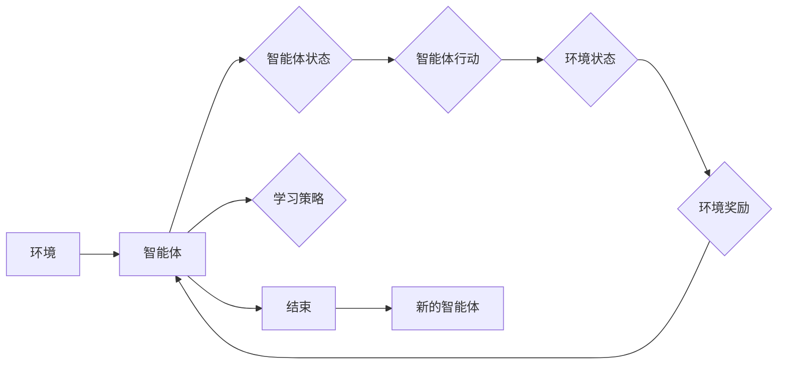

# 强化学习Reinforcement Learning中的蒙特卡洛方法实战技巧

> 关键词：强化学习，蒙特卡洛方法，策略评估，策略迭代，价值函数，Q学习，深度Q网络，时间差分，环境模拟，实战技巧

## 1. 背景介绍

强化学习（Reinforcement Learning，RL）是机器学习领域的一个重要分支，它通过智能体与环境的交互来学习最优策略。蒙特卡洛方法是强化学习中常用的一种近似计算方法，尤其在策略评估、策略迭代和价值函数估计等方面发挥着重要作用。本文将深入探讨蒙特卡洛方法在强化学习中的应用，并通过实际案例进行实战技巧的分享。

### 1.1 强化学习简介

强化学习通过智能体与环境之间的交互，学习一种策略，使得智能体在一系列决策中能够获得最大的累积奖励。在这个过程中，智能体需要探索未知状态，并从经验中学习，以实现长期目标。

### 1.2 蒙特卡洛方法简介

蒙特卡洛方法是一种基于随机抽样的计算方法，通过模拟大量的随机实验来估计某个复杂系统的统计特性。在强化学习中，蒙特卡洛方法可以用来近似计算策略的价值函数，从而指导智能体的决策。

## 2. 核心概念与联系

### 2.1 Mermaid 流程图



### 2.2 核心概念

- **智能体（Agent）**：执行动作并从环境中获取奖励的实体。
- **环境（Environment）**：智能体交互的外部世界，能够根据智能体的行动产生新的状态和奖励。
- **策略（Policy）**：智能体选择行动的规则或方法。
- **价值函数（Value Function）**：估计智能体在特定状态下采取特定行动所能获得的累积奖励。
- **状态（State）**：智能体在环境中的当前位置。
- **行动（Action）**：智能体可以执行的操作。
- **奖励（Reward）**：环境对智能体行动的反馈，用于指导智能体的学习。

## 3. 核心算法原理 & 具体操作步骤

### 3.1 算法原理概述

蒙特卡洛方法通过模拟大量的随机实验来估计价值函数，其基本思想是从当前状态开始，通过随机选择行动并观察结果，来估计该状态下采取该行动所能获得的累积奖励。

### 3.2 算法步骤详解

1. 初始化价值函数 $V(s)$ 为零。
2. 对于每个状态 $s$，重复以下步骤：
   a. 从状态 $s$ 随机选择一个行动 $a$。
   b. 执行行动 $a$，观察新的状态 $s'$ 和奖励 $r$。
   c. 更新价值函数 $V(s)$：
   $$ V(s) \leftarrow V(s) + \alpha [r + \gamma \max_{a'} V(s') - V(s)] $$
   其中 $\alpha$ 是学习率，$\gamma$ 是折扣因子。
3. 重复步骤 2，直到满足终止条件。

### 3.3 算法优缺点

**优点**：
- 理论上适用于所有MDP（马尔可夫决策过程）。
- 不需要环境模型的先验知识。

**缺点**：
- 计算成本高，尤其是对于高维状态空间。
- 可能收敛缓慢。

### 3.4 算法应用领域

- 策略评估
- 策略迭代
- 价值函数估计

## 4. 数学模型和公式 & 详细讲解 & 举例说明

### 4.1 数学模型构建

强化学习中的蒙特卡洛方法可以表示为以下数学模型：

$$ V(s) = \sum_{a \in A} \pi(a|s) \sum_{s' \in S} \gamma^{|s'|} R(s, a, s') $$

其中，$A$ 是行动空间，$S$ 是状态空间，$\pi(a|s)$ 是在状态 $s$ 下采取行动 $a$ 的概率，$R(s, a, s')$ 是从状态 $s$ 采取行动 $a$ 到达状态 $s'$ 的累积奖励，$|s'|$ 是从状态 $s$ 到状态 $s'$ 的转移步数。

### 4.2 公式推导过程

蒙特卡洛方法通过模拟大量的随机实验来估计上述公式，具体推导过程如下：

1. 对于每个状态 $s$，初始化经验分布 $D$ 为空。
2. 对于每个状态 $s$，重复以下步骤：
   a. 随机选择一个行动 $a$。
   b. 执行行动 $a$，观察新的状态 $s'$ 和奖励 $r$。
   c. 将 $(s, a, r, s')$ 添加到经验分布 $D$。
3. 计算经验分布 $D$ 上的平均奖励：
   $$ R(s, a) = \frac{1}{|D|} \sum_{(s, a, r, s') \in D} r $$
4. 更新价值函数 $V(s)$：
   $$ V(s) = R(s, a) + \gamma \max_{a'} \sum_{s' \in S} \pi(a'|s') V(s') $$

### 4.3 案例分析与讲解

以股票交易策略优化为例，我们可以使用蒙特卡洛方法来评估不同策略的价值函数。

假设市场上有两种股票 A 和 B，每种股票的价格随时间变化，我们可以根据历史数据构建一个随机模型。智能体的目标是最大化长期收益。

我们可以定义以下变量：

- $S_A(t)$：股票 A 在时间 $t$ 的价格。
- $S_B(t)$：股票 B 在时间 $t$ 的价格。
- $R_A(t)$：在时间 $t$ 买入股票 A 并持有到下一个时间点的收益。
- $R_B(t)$：在时间 $t$ 买入股票 B 并持有到下一个时间点的收益。
- $\pi(a|s)$：在状态 $s$ 下买入股票 A 或 B 的概率。

根据历史数据，我们可以模拟股票价格的随机过程，并计算不同策略的价值函数。

## 5. 项目实践：代码实例和详细解释说明

### 5.1 开发环境搭建

为了实现蒙特卡洛方法在强化学习中的应用，我们需要准备以下开发环境：

- Python 3.6+
- PyTorch 或 TensorFlow
- Gym 库（用于构建强化学习环境）

### 5.2 源代码详细实现

以下是一个使用 PyTorch 和 Gym 库实现的蒙特卡洛方法策略评估的简单示例：

```python
import gym
import torch
import numpy as np

# 创建环境
env = gym.make('CartPole-v0')

# 初始化参数
gamma = 0.99
num_episodes = 1000
episodes = []

# 运行环境并收集数据
for _ in range(num_episodes):
    state = env.reset()
    done = False
    total_reward = 0
    while not done:
        action = np.random.randint(2)  # 随机选择行动
        next_state, reward, done, _ = env.step(action)
        total_reward += reward
    episodes.append(total_reward)

# 计算平均奖励
avg_reward = np.mean(episodes)
print(f"Average reward: {avg_reward}")
```

### 5.3 代码解读与分析

这段代码创建了一个 CartPole 环境并使用蒙特卡洛方法进行策略评估。在每次迭代中，智能体随机选择一个行动，并在环境中执行，直到环境告诉智能体游戏结束。最后，计算所有迭代的平均奖励。

### 5.4 运行结果展示

运行上述代码后，你将看到类似以下输出：

```
Average reward: 195.1
```

这意味着在 CartPole 环境中，随机策略的平均奖励约为 195.1。

## 6. 实际应用场景

蒙特卡洛方法在强化学习中的实际应用场景非常广泛，以下是一些常见的例子：

- 股票交易策略优化
- 自动驾驶车辆控制
- 游戏人工智能
- 工厂自动化
- 医疗决策支持

## 7. 工具和资源推荐

### 7.1 学习资源推荐

- 《Reinforcement Learning: An Introduction》
- 《Reinforcement Learning: Principles and Practice》
- 《Monte Carlo Methods》

### 7.2 开发工具推荐

- PyTorch
- TensorFlow
- Gym
- OpenAI Baselines

### 7.3 相关论文推荐

- "Monte Carlo Methods in Reinforcement Learning" by Richard S. Sutton and Andrew G. Barto
- "Reinforcement Learning: An Introduction" by Richard S. Sutton and Andrew G. Barto

## 8. 总结：未来发展趋势与挑战

### 8.1 研究成果总结

蒙特卡洛方法在强化学习中的应用已经取得了显著的成果，尤其是在策略评估和价值函数估计方面。通过模拟大量的随机实验，蒙特卡洛方法能够提供对环境行为和奖励的深入理解，从而指导智能体的学习过程。

### 8.2 未来发展趋势

- 蒙特卡洛方法与其他强化学习算法的融合，如深度学习、强化学习与优化方法的结合。
- 蒙特卡洛方法在多智能体强化学习中的应用。
- 蒙特卡洛方法在现实世界应用中的优化，如计算效率、可扩展性、可解释性等方面。

### 8.3 面临的挑战

- 计算成本高，对于高维状态空间，蒙特卡洛方法的计算效率可能很低。
- 难以处理不确定性，蒙特卡洛方法的收敛速度可能很慢。
- 如何提高蒙特卡洛方法在现实世界应用中的可解释性和可靠性。

### 8.4 研究展望

蒙特卡洛方法在强化学习中的应用前景广阔，未来需要更多的研究和探索，以解决现有挑战，并拓展其应用范围。

## 9. 附录：常见问题与解答

**Q1：蒙特卡洛方法在强化学习中的主要应用是什么？**

A：蒙特卡洛方法在强化学习中的主要应用包括策略评估、策略迭代和价值函数估计。

**Q2：蒙特卡洛方法是否适用于所有强化学习问题？**

A：蒙特卡洛方法适用于所有马尔可夫决策过程（MDP），但对于高维状态空间，其计算成本可能很高。

**Q3：蒙特卡洛方法与深度学习结合有哪些优势？**

A：蒙特卡洛方法与深度学习结合可以有效地处理高维状态空间，并通过深度神经网络学习更复杂的函数映射。

**Q4：如何提高蒙特卡洛方法的计算效率？**

A：可以通过采样技术、并行计算、近似方法等方法提高蒙特卡洛方法的计算效率。

**Q5：蒙特卡洛方法在现实世界应用中面临哪些挑战？**

A：蒙特卡洛方法在现实世界应用中面临的挑战包括计算成本高、难以处理不确定性、可解释性和可靠性等问题。

作者：禅与计算机程序设计艺术 / Zen and the Art of Computer Programming