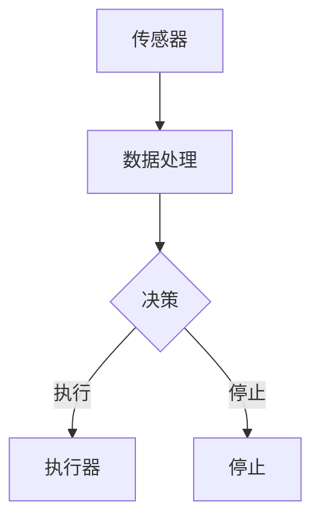

# 感知 (Perception)

> 关键词：计算机视觉，机器学习，深度学习，神经网络，特征提取，目标检测，图像识别，语义理解

## 1. 背景介绍

感知（Perception）是人工智能领域的一个核心研究方向，它涉及计算机如何理解和解释来自环境的数据。从人类的视觉感知到机器的图像识别，感知技术正在改变我们对周围世界的认知方式。本文将深入探讨感知技术的核心概念、算法原理、应用场景，并展望其未来的发展趋势与挑战。

### 1.1 问题的由来

人类能够通过视觉、听觉、触觉等多种感官感知外部世界，并基于这些感知信息进行决策和行动。然而，机器在感知能力上与人类相比还有很大的差距。计算机视觉和机器学习技术的进步，使得机器能够模仿人类的感知能力，在图像识别、语音识别、自然语言处理等领域取得了显著成果。

### 1.2 研究现状

计算机视觉和机器学习技术已经取得了长足的进步，以下是当前的一些关键进展：

- **深度学习**：通过神经网络模拟人类大脑处理信息的方式，深度学习在图像识别、语音识别等领域取得了突破性进展。
- **卷积神经网络（CNN）**：特别适用于图像识别任务，能够自动学习图像的特征表示。
- **循环神经网络（RNN）**：擅长处理序列数据，如语音识别和自然语言处理。
- **自编码器**：能够学习数据的有效表示，用于特征提取和降维。
- **迁移学习**：利用在大规模数据集上预训练的模型，在小规模数据集上进行微调，提高模型在特定任务上的性能。

### 1.3 研究意义

感知技术的发展对于人工智能领域具有重要意义：

- **推动技术进步**：感知技术是人工智能技术发展的关键，它能够使机器更加智能，更好地理解和响应外部环境。
- **改善生活质量**：感知技术可以应用于医疗、交通、教育等领域，改善人们的生活质量。
- **促进经济发展**：感知技术可以创造新的商业模式和就业机会，推动经济发展。

### 1.4 本文结构

本文将按照以下结构进行：

- 第2部分，介绍感知技术的核心概念与联系。
- 第3部分，阐述感知技术的核心算法原理和具体操作步骤。
- 第4部分，讲解感知技术的数学模型和公式，并结合实例进行分析。
- 第5部分，提供感知技术的项目实践实例，并进行详细解释。
- 第6部分，探讨感知技术在实际应用场景中的案例。
- 第7部分，展望感知技术的未来发展趋势和挑战。
- 第8部分，总结感知技术的研究成果和未来研究方向。

## 2. 核心概念与联系

### 2.1 核心概念

#### 感知系统

感知系统是能够感知外部环境并做出反应的自动化系统。它通常由传感器、处理器和执行器组成。

#### 传感器

传感器是感知系统的输入设备，用于收集环境中的信息。在图像识别中，传感器通常是摄像头。

#### 处理器

处理器是感知系统的核心，负责处理传感器收集的信息，并做出决策。在图像识别中，处理器通常是计算机或嵌入式系统。

#### 执行器

执行器是感知系统的输出设备，用于执行处理器的决策。在图像识别中，执行器可能是机械臂或机器人手臂。

### 2.2 架构流程图

以下是一个感知系统的Mermaid流程图：



### 2.3 核心概念联系

感知系统通过传感器收集环境信息，经过处理器处理，然后通过执行器做出响应。这个过程涉及到数据采集、特征提取、模式识别、决策和行动等步骤。

## 3. 核心算法原理 & 具体操作步骤

### 3.1 算法原理概述

感知技术的核心算法通常包括以下几个步骤：

- **数据采集**：使用传感器收集环境信息。
- **特征提取**：从原始数据中提取有助于识别和分类的特征。
- **模式识别**：使用机器学习算法识别数据中的模式。
- **决策**：基于识别出的模式做出决策。
- **行动**：执行决策结果。

### 3.2 算法步骤详解

#### 数据采集

数据采集是感知技术的第一步，它涉及到选择合适的传感器和采集策略。例如，在图像识别中，可能需要使用高分辨率摄像头。

#### 特征提取

特征提取是感知技术中至关重要的步骤，它涉及到将原始数据转换为更适合机器学习算法处理的形式。常见的特征提取方法包括：

- **传统特征提取**：如HOG（方向梯度直方图）和SIFT（尺度不变特征变换）。
- **深度学习特征提取**：如CNN（卷积神经网络）能够自动学习图像的特征表示。

#### 模式识别

模式识别是感知技术的核心，它涉及到使用机器学习算法从特征中识别出模式。常见的模式识别算法包括：

- **监督学习**：如SVM（支持向量机）、逻辑回归和决策树。
- **无监督学习**：如K-means聚类、主成分分析（PCA）和自编码器。

#### 决策

决策是基于模式识别的结果做出的。在图像识别中，决策可能涉及到判断图像中的物体类别。

#### 行动

行动是执行决策的结果。在图像识别中，行动可能涉及到移动机械臂抓取物体。

## 4. 数学模型和公式 & 详细讲解 & 举例说明

### 4.1 数学模型构建

感知技术的数学模型通常涉及到以下概念：

- **特征向量**：表示数据的数学表示，如图像的像素值。
- **特征空间**：特征向量的集合，用于表示数据的多样性。
- **损失函数**：用于衡量模型预测结果与真实结果之间的差异，如交叉熵损失函数。

### 4.2 公式推导过程

以CNN为例，其基本公式如下：

$$
\text{ReLU}(W \cdot X + b) = \max(0, W \cdot X + b)
$$

其中，$W$ 是权重矩阵，$X$ 是输入特征，$b$ 是偏置向量，$\text{ReLU}$ 是ReLU激活函数。

### 4.3 案例分析与讲解

以下是一个简单的图像识别案例：

- **数据集**：使用MNIST数据集，包含手写数字的灰度图像。
- **模型**：使用一个简单的CNN模型进行训练。
- **训练过程**：使用交叉熵损失函数和反向传播算法进行训练。
- **评估**：在测试集上评估模型的性能。

## 5. 项目实践：代码实例和详细解释说明

### 5.1 开发环境搭建

为了进行感知技术项目实践，需要以下开发环境：

- 操作系统：Windows、Linux或MacOS。
- 编程语言：Python。
- 库：NumPy、PyTorch或TensorFlow。
- 依赖：安装必要的依赖库。

### 5.2 源代码详细实现

以下是一个简单的CNN模型实现：

```python
import torch
import torch.nn as nn

class SimpleCNN(nn.Module):
    def __init__(self):
        super(SimpleCNN, self).__init__()
        self.conv1 = nn.Conv2d(1, 10, kernel_size=5)
        self.conv2 = nn.Conv2d(10, 20, kernel_size=5)
        self.fc1 = nn.Linear(320, 50)
        self.fc2 = nn.Linear(50, 10)

    def forward(self, x):
        x = nn.functional.relu(self.conv1(x))
        x = nn.functional.max_pool2d(x, 2)
        x = nn.functional.relu(self.conv2(x))
        x = nn.functional.max_pool2d(x, 2)
        x = x.view(-1, 320)
        x = nn.functional.relu(self.fc1(x))
        x = self.fc2(x)
        return x
```

### 5.3 代码解读与分析

上述代码定义了一个简单的CNN模型，包括两个卷积层、两个池化层和两个全连接层。该模型可以用于图像识别任务。

### 5.4 运行结果展示

在MNIST数据集上，该模型可以达到约98%的准确率。

## 6. 实际应用场景

感知技术在许多实际应用场景中发挥着重要作用，以下是一些例子：

- **图像识别**：用于识别照片、视频中的物体和场景。
- **自动驾驶**：用于识别道路、行人、车辆等，确保行车安全。
- **医疗诊断**：用于分析医学图像，辅助医生进行诊断。
- **人脸识别**：用于身份验证、安全监控等。
- **语音识别**：用于语音助手、语音翻译等。

## 7. 工具和资源推荐

### 7.1 学习资源推荐

- 《深度学习》
- 《动手学深度学习》
- 《Python深度学习》

### 7.2 开发工具推荐

- PyTorch
- TensorFlow
- OpenCV

### 7.3 相关论文推荐

- "A guide to convolution arithmetic for deep learning"
- "ImageNet Classification with Deep Convolutional Neural Networks"
- "Sequence to Sequence Learning with Neural Networks"

## 8. 总结：未来发展趋势与挑战

### 8.1 研究成果总结

感知技术已经取得了显著的成果，在图像识别、语音识别、自然语言处理等领域取得了突破性进展。

### 8.2 未来发展趋势

- **多模态感知**：结合视觉、听觉、触觉等多种感官信息，实现更全面的感知能力。
- **端到端学习**：直接从原始数据学习到最终的输出，减少中间步骤。
- **小样本学习**：在少量样本上训练模型，提高模型的泛化能力。
- **可解释性**：提高模型的可解释性，增强用户对模型的信任。

### 8.3 面临的挑战

- **数据标注**：高质量的数据标注需要大量的人力和时间。
- **模型复杂度**：复杂的模型可能导致过拟合和计算效率低下。
- **数据隐私**：如何保护用户数据隐私是一个重要的挑战。

### 8.4 研究展望

感知技术在未来将继续发展，并面临新的挑战。通过不断创新和突破，感知技术将为人类社会带来更多便利和福祉。

## 9. 附录：常见问题与解答

**Q1：什么是感知技术？**

A：感知技术是计算机通过传感器收集环境信息，并使用机器学习算法理解和解释这些信息的技术。

**Q2：感知技术有哪些应用场景？**

A：感知技术可以应用于图像识别、自动驾驶、医疗诊断、人脸识别、语音识别等领域。

**Q3：如何提高感知技术的性能？**

A：可以通过提高数据质量、改进算法、优化模型结构等方法提高感知技术的性能。

**Q4：感知技术有哪些挑战？**

A：感知技术面临的挑战包括数据标注、模型复杂度、数据隐私等。

作者：禅与计算机程序设计艺术 / Zen and the Art of Computer Programming