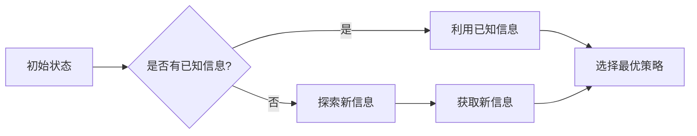
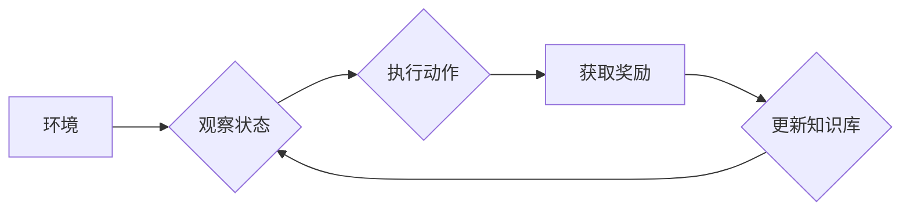

# 探索与利用 (Exploration and Exploitation)

> 关键词：探索-利用、多臂老虎机、强化学习、UCB算法、ε-greedy算法、Q-learning、强化学习应用、多智能体系统

## 1. 背景介绍

在人工智能和机器学习的领域，探索与利用是一个核心概念，尤其是在强化学习（Reinforcement Learning, RL）中。探索与利用的目的是在不确定的环境中，通过决策来最大化长期回报。本文将深入探讨探索与利用的原理、算法和应用，旨在帮助读者理解这一关键概念在人工智能领域的应用。

### 1.1 问题的由来

在现实世界中，许多决策问题都涉及到探索未知和利用已知信息之间的权衡。例如，在线广告系统需要在展示新广告和优化现有广告之间做出平衡；机器人导航需要在探索新的路径和利用已有的路径之间做出选择。

### 1.2 研究现状

探索与利用是强化学习中的一个基本问题，已经有许多经典的算法被提出，如ε-greedy算法、UCB算法和Q-learning等。这些算法在不同的应用场景下都有其优势和局限性。

### 1.3 研究意义

理解探索与利用对于开发有效的强化学习算法至关重要。它不仅能够帮助我们设计出能够在复杂环境中做出明智决策的智能系统，还能够提升机器学习模型在实际应用中的性能。

### 1.4 本文结构

本文将按照以下结构展开：
- 第二部分将介绍探索与利用的核心概念。
- 第三部分将深入探讨几种经典的探索与利用算法。
- 第四部分将通过数学模型和公式来详细讲解这些算法。
- 第五部分将提供一个项目实践案例，展示如何在实际中应用探索与利用。
- 第六部分将讨论探索与利用在实际应用场景中的应用。
- 第七部分将展望探索与利用的未来发展趋势和面临的挑战。
- 第八部分将总结全文，并对未来研究方向进行展望。

## 2. 核心概念与联系

### 2.1 核心概念原理

探索与利用的核心在于如何在未知和已知之间做出选择。以下是一个使用Mermaid流程图表示的探索与利用的概念原理：



在这个流程图中，系统首先判断是否拥有关于环境的已知信息。如果有，则利用这些信息进行决策；如果没有，则探索新信息，并在获取新信息后更新决策策略。

### 2.2 架构流程图

以下是一个更详细的探索与利用的架构流程图：



在这个架构流程图中，环境是系统需要与之交互的实体，系统通过观察状态、执行动作、获取奖励和更新知识库来不断学习和改进。

## 3. 核心算法原理 & 具体操作步骤

### 3.1 算法原理概述

#### ε-greedy算法

ε-greedy算法是一种简单的探索与利用策略，它以一定的概率ε选择探索新动作，以1-ε的概率选择利用已知信息。

#### UCB算法

UCB算法（Upper Confidence Bound）是一种用于多臂老虎机问题的算法，它通过平衡探索和利用来选择动作。

#### Q-learning

Q-learning是一种基于值函数的强化学习算法，它通过学习状态-动作值函数来选择动作。

### 3.2 算法步骤详解

#### ε-greedy算法

1. 初始化Q值表Q(s,a)为0。
2. 在每个决策周期t，以概率ε选择探索动作，以1-ε的概率选择利用已知信息。
3. 执行选定的动作，获取奖励。
4. 更新Q值表：Q(s,a) = Q(s,a) + α(R - Q(s,a))，其中α是学习率。
5. 返回步骤2。

#### UCB算法

1. 初始化Q值表Q(s,a)为0。
2. 在每个决策周期t，计算每个动作的UCB值：UCB(s,a) = Q(s,a) + c * sqrt(t(s,a) / N(s,a))，其中c是常数，t(s,a)是动作a在状态s下被选择的次数，N(s,a)是状态s下动作a被选择的次数。
3. 选择UCB值最高的动作。
4. 执行选定的动作，获取奖励。
5. 更新Q值表和t(s,a)、N(s,a)。
6. 返回步骤2。

#### Q-learning

1. 初始化Q值表Q(s,a)为0。
2. 选择动作a，观察状态s'和奖励R。
3. 更新Q值表：Q(s,a) = Q(s,a) + α(R + γ * max_a Q(s',a) - Q(s,a))，其中α是学习率，γ是折扣因子。
4. 返回步骤2。

### 3.3 算法优缺点

#### ε-greedy算法

优点：简单易实现，能够平衡探索和利用。
缺点：在初期可能过于保守，探索不足。

#### UCB算法

优点：能够更有效地探索未经验证的策略。
缺点：计算复杂度较高。

#### Q-learning

优点：适用于连续动作空间。
缺点：收敛速度较慢，可能陷入局部最优。

### 3.4 算法应用领域

这些算法在许多领域都有应用，包括但不限于：
- 游戏AI
- 机器人导航
- 在线广告系统
- 供应链管理

## 4. 数学模型和公式 & 详细讲解 & 举例说明

### 4.1 数学模型构建

#### ε-greedy算法

$$
Q(s,a) = Q(s,a) + \alpha(R - Q(s,a))
$$

#### UCB算法

$$
UCB(s,a) = Q(s,a) + c \sqrt{\frac{t(s,a)}{N(s,a)}}
$$

#### Q-learning

$$
Q(s,a) = Q(s,a) + \alpha(R + \gamma \max_{a'} Q(s',a') - Q(s,a))
$$

### 4.2 公式推导过程

#### ε-greedy算法

ε-greedy算法的更新公式是基于以下期望公式推导而来：

$$
E[R] = \sum_{a} \pi(a) \times Q(s,a)
$$

其中，$\pi(a)$ 是选择动作 $a$ 的概率，$Q(s,a)$ 是在状态 $s$ 下选择动作 $a$ 的期望回报。

#### UCB算法

UCB算法的公式是基于拉格朗日乘数法和优化理论推导而来，目的是最大化以下期望：

$$
E[\max_{a} Q(s,a)] = \sum_{a} \pi(a) \times Q(s,a) + c \sqrt{\frac{\ln t(s)}{N(s,a)}}
$$

#### Q-learning

Q-learning的更新公式是基于以下最优化问题的拉格朗日乘数法推导而来：

$$
\min_{Q(s,a)} \sum_{s',a} (R + \gamma \max_{a'} Q(s',a') - Q(s,a))^2
$$

其中，$R$ 是即时回报，$\gamma$ 是折扣因子。

### 4.3 案例分析与讲解

假设一个简单的多臂老虎机问题，有3个老虎机，每个老虎机的平均回报如下：

| 老虎机 | 平均回报 |
|--------|----------|
| 1      | 0.5      |
| 2      | 1.0      |
| 3      | 1.5      |

#### ε-greedy算法

初始时，Q值表为0，选择概率为ε=0.1。第一次选择第二个老虎机，获得回报1.0，更新Q值表。

#### UCB算法

UCB算法会根据每个老虎机的尝试次数和平均回报计算UCB值，并选择UCB值最高的老虎机。

#### Q-learning

Q-learning会根据即时回报和折扣因子更新Q值表，直到收敛。

## 5. 项目实践：代码实例和详细解释说明

### 5.1 开发环境搭建

为了进行项目实践，我们需要安装以下软件和库：

- Python 3.7或更高版本
- TensorFlow或PyTorch
- Gym（用于多臂老虎机环境）

### 5.2 源代码详细实现

以下是一个使用PyTorch实现的ε-greedy算法的多臂老虎机案例：

```python
import torch
import gym
import numpy as np

# 创建多臂老虎机环境
env = gym.make("MultiArmBandit-v0")

# 初始化Q值表
Q = torch.zeros((env.action_space.n,))

# ε-greedy参数
epsilon = 0.1
alpha = 0.1

# 训练循环
for episode in range(1000):
    state = env.reset()
    done = False
    
    while not done:
        # ε-greedy选择动作
        if np.random.rand() < epsilon:
            action = env.action_space.sample()
        else:
            action = Q.argmax().item()
        
        # 执行动作，获取回报
        next_state, reward, done, _ = env.step(action)
        
        # 更新Q值
        Q[action] = Q[action] + alpha * (reward - Q[action])
    
    # 打印当前回合的平均回报
    print(f"Episode {episode}, Average Reward: {env.get_average_reward()}")

# 关闭环境
env.close()
```

### 5.3 代码解读与分析

这段代码首先创建了一个多臂老虎机环境，并初始化了一个Q值表。然后，通过ε-greedy策略选择动作，并在每个回合中更新Q值表。最后，打印出每个回合的平均回报。

### 5.4 运行结果展示

运行上述代码，可以看到每个回合的平均回报逐渐增加，表明模型通过探索和利用的学习过程，逐渐学会了选择回报最高的老虎机。

## 6. 实际应用场景

探索与利用在实际应用场景中有着广泛的应用，以下是一些例子：

- 在线广告系统：通过探索不同广告的组合，利用用户的历史行为数据来优化广告投放策略。
- 机器人导航：机器人通过探索未知的路径，利用已有的路径信息来找到最优的导航路径。
- 供应链管理：通过探索新的供应商和库存策略，利用已有的供应链数据来降低成本和提高效率。

## 7. 工具和资源推荐

### 7.1 学习资源推荐

- 《Reinforcement Learning: An Introduction》
- 《Deep Reinforcement Learning》
- OpenAI Gym：一个开源的强化学习环境库

### 7.2 开发工具推荐

- TensorFlow
- PyTorch

### 7.3 相关论文推荐

- "Multi-Armed Bandit Algorithms" by Peter L. Bartlett and Michael I. Jordan
- "Algorithms for Reinforcement Learning" by Csaba Szepesvári

## 8. 总结：未来发展趋势与挑战

### 8.1 研究成果总结

本文深入探讨了探索与利用这一核心概念，介绍了ε-greedy算法、UCB算法和Q-learning等经典算法，并通过数学模型和公式进行了详细讲解。同时，通过项目实践案例展示了如何在实际中应用探索与利用。

### 8.2 未来发展趋势

未来，探索与利用的研究将更加深入，可能会出现以下趋势：

- 更有效的探索与利用算法，能够更好地平衡探索和利用。
- 更多的应用场景，如多智能体系统、强化学习与知识表示的融合等。
- 更好的可解释性和可扩展性。

### 8.3 面临的挑战

探索与利用在未来的发展中将面临以下挑战：

- 如何在无限的环境中做出有效的决策。
- 如何在多智能体系统中实现有效的探索与利用。
- 如何将探索与利用应用于非平稳环境。

### 8.4 研究展望

探索与利用的研究将为人工智能领域带来更多创新，推动机器学习算法在各个领域的应用。随着研究的深入，相信探索与利用将迎来更加美好的未来。

## 9. 附录：常见问题与解答

**Q1：探索与利用在强化学习中的具体应用是什么？**

A：探索与利用在强化学习中用于平衡新动作的尝试和已知动作的使用，以最大化长期回报。

**Q2：ε-greedy算法和UCB算法的主要区别是什么？**

A：ε-greedy算法以一定的概率ε随机选择动作，以1-ε的概率选择最佳动作。UCB算法则通过考虑动作的历史表现和未经验证的潜力来选择动作。

**Q3：Q-learning是如何工作的？**

A：Q-learning通过学习状态-动作值函数来选择动作，该函数代表了在特定状态下执行特定动作的期望回报。

**Q4：探索与利用在多智能体系统中如何应用？**

A：在多智能体系统中，探索与利用可以用于平衡不同智能体之间的协作和竞争，以实现整体目标的最优化。

**Q5：探索与利用在现实世界中的应用有哪些？**

A：探索与利用在现实世界中的应用非常广泛，包括在线广告系统、机器人导航、供应链管理等。

作者：禅与计算机程序设计艺术 / Zen and the Art of Computer Programming