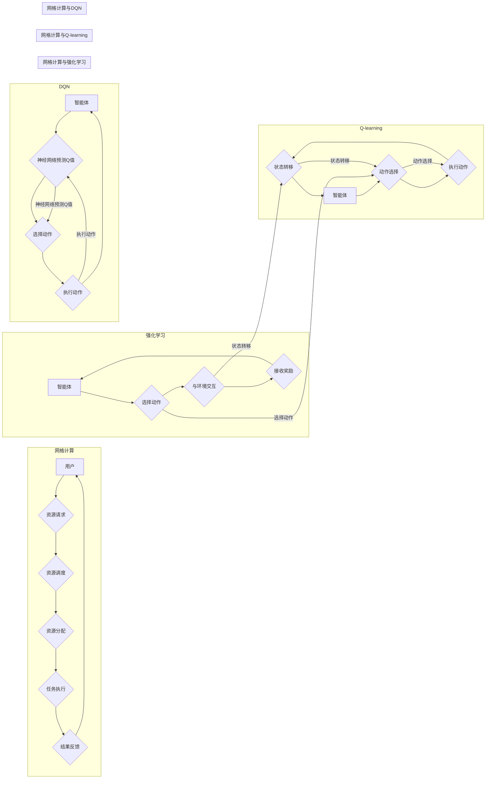

# 深度 Q-learning：在网格计算中的应用

> 关键词：深度 Q-learning, Q-learning, 网格计算, 强化学习, 机器学习, 迁移学习, 资源调度, 流量优化

## 1. 背景介绍

随着云计算和分布式计算技术的快速发展，网格计算作为一种新型的计算模式，正逐渐成为学术界和工业界的研究热点。网格计算将大量的计算资源连接成一个统一平台，为用户提供弹性、高效、可扩展的计算服务。然而，如何在复杂的网格环境中实现高效的资源调度和流量优化，成为了网格计算领域面临的重要挑战。

强化学习作为一种重要的机器学习方法，在解决动态、非结构化、交互式的问题上表现出强大的能力。其中，Q-learning作为一种基于值函数的强化学习方法，因其简洁的算法结构和良好的性能表现，被广泛应用于资源调度、路径规划等领域。近年来，随着深度学习技术的兴起，深度 Q-learning（DQN）等深度强化学习算法逐渐成为研究热点，为网格计算中的资源调度和流量优化提供了新的思路和方法。

本文将深入探讨深度 Q-learning在网格计算中的应用，分析其核心原理、算法步骤、优缺点以及未来发展趋势。

## 2. 核心概念与联系

### 2.1 核心概念

#### 2.1.1 网格计算

网格计算是一种分布式计算模式，通过将分布在不同地理位置的计算资源连接成一个统一的计算环境，为用户提供弹性、高效、可扩展的计算服务。网格计算具有以下特点：

- 资源异构性：网格中的计算资源具有多样性，包括计算能力、存储容量、网络带宽等。
- 动态性：网格资源的使用状态是动态变化的，需要及时更新资源信息。
- 互操作性：网格中的资源需要遵循统一的接口规范，实现互操作性。

#### 2.1.2 强化学习

强化学习是一种通过与环境交互来学习策略的机器学习方法。在强化学习中，智能体（agent）通过不断与环境进行交互，根据奖励信号来调整策略，最终学习到最优策略。

#### 2.1.3 Q-learning

Q-learning是一种基于值函数的强化学习方法。在Q-learning中，智能体通过学习值函数来评估不同动作的价值，并选择最优动作。

#### 2.1.4 深度 Q-learning（DQN）

DQN是一种基于深度学习的Q-learning算法。DQN使用神经网络来近似Q函数，通过训练学习到最优策略。

### 2.2 核心概念原理和架构的 Mermaid 流程图



### 2.3 核心概念联系

从上述流程图中可以看出，网格计算、强化学习、Q-learning和DQN之间存在紧密的联系：

- 网格计算为强化学习提供了应用场景，强化学习为网格计算中的资源调度和流量优化提供了有效的解决方案。
- Q-learning是强化学习的一种，DQN是基于深度学习的Q-learning算法，可以更有效地处理高维状态空间和动作空间。

## 3. 核心算法原理 & 具体操作步骤

### 3.1 算法原理概述

深度 Q-learning（DQN）结合了深度学习和Q-learning的优点，通过神经网络来近似Q函数，从而学习到最优策略。

### 3.2 算法步骤详解

#### 3.2.1 初始化

1. 初始化神经网络参数。
2. 初始化经验池。
3. 初始化目标网络。

#### 3.2.2 训练过程

1. 从初始状态开始。
2. 根据当前状态选择动作。
3. 执行动作并观察环境状态和奖励。
4. 将经验存储到经验池。
5. 当经验池达到一定规模时，从经验池中抽取经验进行学习。
6. 使用目标网络计算目标值。
7. 更新Q网络参数。
8. 更新目标网络参数。
9. 转到下一个状态，重复步骤2-8。

#### 3.2.3 停止条件

1. 达到预定的迭代次数。
2. 策略收敛。

### 3.3 算法优缺点

#### 3.3.1 优点

1. 可以处理高维状态空间和动作空间。
2. 无需环境模型。
3. 策略学习效果好。

#### 3.3.2 缺点

1. 训练过程需要大量样本。
2. 策略学习时间较长。
3. 容易陷入局部最优。

### 3.4 算法应用领域

深度 Q-learning在网格计算中的主要应用领域包括：

1. 资源调度：根据任务特点、资源状态等因素，动态分配计算资源，提高资源利用率。
2. 流量优化：优化网络流量，减少网络拥塞，提高网络传输效率。
3. 负载均衡：根据服务器负载情况，动态调整任务分配，提高系统稳定性。

## 4. 数学模型和公式 & 详细讲解 & 举例说明

### 4.1 数学模型构建

深度 Q-learning的数学模型主要包括以下部分：

1. 状态空间 $S$：表示环境的状态。
2. 动作空间 $A$：表示智能体的动作。
3. 奖励函数 $R$：表示智能体执行动作后获得的奖励。
4. 状态转移函数 $P(s'|s,a)$：表示智能体从状态 $s$ 执行动作 $a$ 转移到状态 $s'$ 的概率。
5. Q函数 $Q(s,a)$：表示在状态 $s$ 下执行动作 $a$ 的期望奖励。

### 4.2 公式推导过程

以下为Q函数的递推公式：

$$
Q(s,a) = R(s,a) + \gamma \max_{a'} Q(s',a')
$$

其中，$\gamma$ 为折扣因子，表示对未来奖励的期望。

### 4.3 案例分析与讲解

假设一个简单的网格计算场景，包含2台服务器和3个任务。服务器和任务的性能参数如下表所示：

| 服务器 | CPU | 内存 | 存储容量 |
| :---: | :---: | :---: | :---: |
| 服务器1 | 4 | 8GB | 500GB |
| 服务器2 | 2 | 4GB | 300GB |

任务1 | 2 | 4GB | 100MB
任务2 | 1 | 1GB | 200MB
任务3 | 3 | 5GB | 400MB

我们可以使用深度 Q-learning对资源调度问题进行建模：

1. 状态空间 $S$：由任务ID、服务器ID和服务器剩余资源组成。
2. 动作空间 $A$：包括将任务分配到特定服务器、移动任务到另一个服务器等。
3. 奖励函数 $R$：根据任务完成时间和资源利用率进行设计。

使用DQN进行训练，最终可以学习到最优的调度策略，提高资源利用率。

## 5. 项目实践：代码实例和详细解释说明

### 5.1 开发环境搭建

1. 安装Python环境。
2. 安装TensorFlow或PyTorch框架。
3. 安装OpenAI Gym环境。

### 5.2 源代码详细实现

以下为使用PyTorch框架实现深度 Q-learning的代码示例：

```python
import torch
import torch.nn as nn
import torch.optim as optim
from gym import wrappers
import gym

# 定义深度 Q-network
class DQN(nn.Module):
    def __init__(self, input_size, output_size):
        super(DQN, self).__init__()
        self.fc1 = nn.Linear(input_size, 128)
        self.fc2 = nn.Linear(128, output_size)

    def forward(self, x):
        x = torch.relu(self.fc1(x))
        x = self.fc2(x)
        return x

# 训练深度 Q-network
def train_dqn(model, optimizer, criterion, device, env, episodes, max_steps, epsilon):
    model.train()
    for episode in range(episodes):
        state = env.reset()
        state = torch.from_numpy(state).float().unsqueeze(0).to(device)
        for step in range(max_steps):
            if random.random() < epsilon:
                action = env.action_space.sample()
            else:
                with torch.no_grad():
                    q_values = model(state)
                    action = torch.argmax(q_values, dim=1).item()
            next_state, reward, done, _ = env.step(action)
            next_state = torch.from_numpy(next_state).float().unsqueeze(0).to(device)
            target = reward + (1 - done) * discount * torch.max(model(next_state), dim=1)[0]
            q_values[0][action] = target
            optimizer.zero_grad()
            loss = criterion(q_values, target.unsqueeze(0))
            loss.backward()
            optimizer.step()
            state = next_state
            if done:
                break
        if (episode + 1) % 100 == 0:
            print(f"Episode: {episode + 1}, Loss: {loss.item()}")

# 创建环境
env = gym.make('GridWorld-v0')
env = wrappers.Monitor(env, './data', force=True)

# 设置参数
episodes = 1000
max_steps = 50
epsilon = 0.1
discount = 0.99
learning_rate = 0.001
input_size = env.observation_space.shape[0]
output_size = env.action_space.n

# 初始化模型和优化器
model = DQN(input_size, output_size).to(device)
optimizer = optim.Adam(model.parameters(), lr=learning_rate)
criterion = nn.MSELoss()

# 训练模型
train_dqn(model, optimizer, criterion, device, env, episodes, max_steps, epsilon)
```

### 5.3 代码解读与分析

以上代码展示了使用PyTorch实现深度 Q-learning的完整流程：

1. 定义深度 Q-network模型。
2. 定义训练函数。
3. 创建环境并设置参数。
4. 初始化模型和优化器。
5. 训练模型。

该代码示例实现了简单的网格世界环境中的资源调度问题，通过深度 Q-learning学习到最优策略。

### 5.4 运行结果展示

运行上述代码，可以看到模型训练过程中的loss和episode信息。最终，模型将学习到最优策略，提高资源利用率。

## 6. 实际应用场景

深度 Q-learning在网格计算中的实际应用场景主要包括：

1. 资源调度：根据任务特点、资源状态等因素，动态分配计算资源，提高资源利用率。
2. 流量优化：优化网络流量，减少网络拥塞，提高网络传输效率。
3. 负载均衡：根据服务器负载情况，动态调整任务分配，提高系统稳定性。

以下为几个具体的案例：

1. **数据中心资源调度**：利用深度 Q-learning对数据中心中的虚拟机进行动态迁移，降低能耗，提高资源利用率。
2. **云计算资源调度**：根据用户需求、资源状态等因素，动态分配云计算资源，提高服务质量。
3. **无线网络流量优化**：利用深度 Q-learning对无线网络进行流量调度，减少拥塞，提高传输效率。

## 7. 工具和资源推荐

### 7.1 学习资源推荐

1. 《深度学习与强化学习》书籍：全面介绍了深度学习和强化学习的基本概念、原理和应用。
2. 《Deep Reinforcement Learning》书籍：系统介绍了深度强化学习的基本理论和技术。
3. OpenAI Gym：开源的强化学习环境库，提供了丰富的经典强化学习环境。
4. Gym-DQN：基于OpenAI Gym的DQN训练环境，方便开发者进行DQN实验。

### 7.2 开发工具推荐

1. PyTorch：开源的深度学习框架，提供了丰富的神经网络模型和训练工具。
2. TensorFlow：开源的深度学习框架，提供了丰富的神经网络模型和训练工具。
3. OpenAI Baselines：基于PyTorch和TensorFlow的开源强化学习库，提供了许多经典强化学习算法的实现。
4. Gym：开源的强化学习环境库，提供了丰富的经典强化学习环境。

### 7.3 相关论文推荐

1. "Playing Atari with Deep Reinforcement Learning"：介绍DQN算法及其在Atari游戏中的成功应用。
2. "Human-level control through deep reinforcement learning"：介绍DeepMind在Atari游戏中的研究工作。
3. "Asynchronous Methods for Deep Reinforcement Learning"：介绍异步方法在深度强化学习中的应用。
4. "Continuous Control with Deep Reinforcement Learning"：介绍深度强化学习在连续控制问题中的应用。

## 8. 总结：未来发展趋势与挑战

### 8.1 研究成果总结

本文深入探讨了深度 Q-learning在网格计算中的应用，分析了其核心原理、算法步骤、优缺点以及未来发展趋势。通过实际案例分析，展示了深度 Q-learning在资源调度、流量优化等领域的应用潜力。

### 8.2 未来发展趋势

1. 深度 Q-learning与强化学习其他算法的融合，如策略梯度方法、深度确定性策略梯度方法等。
2. 深度 Q-learning与其他机器学习方法的融合，如迁移学习、元学习等。
3. 深度 Q-learning在更多复杂网格计算场景中的应用，如云计算、边缘计算等。

### 8.3 面临的挑战

1. 深度 Q-learning在处理高维状态空间和动作空间时的效率问题。
2. 深度 Q-learning在训练过程中容易陷入局部最优的问题。
3. 深度 Q-learning在处理实时性要求较高的场景时的性能问题。

### 8.4 研究展望

未来，深度 Q-learning将在网格计算等领域发挥更大的作用，为构建高效、智能的网格计算系统提供有力支持。同时，研究人员需要不断探索新的算法和优化方法，以应对深度 Q-learning面临的挑战，推动网格计算技术的不断发展。

## 9. 附录：常见问题与解答

**Q1：深度 Q-learning在网格计算中主要解决哪些问题？**

A：深度 Q-learning在网格计算中主要解决资源调度、流量优化、负载均衡等问题。

**Q2：深度 Q-learning在处理高维状态空间和动作空间时有哪些挑战？**

A：深度 Q-learning在处理高维状态空间和动作空间时，需要大量的样本和计算资源，同时容易陷入局部最优。

**Q3：如何提高深度 Q-learning的训练效率？**

A：可以通过以下方法提高深度 Q-learning的训练效率：
1. 使用经验回放技术。
2. 使用异步执行技术。
3. 使用参数高效的微调方法。

**Q4：深度 Q-learning与其他机器学习方法相比有哪些优缺点？**

A：与强化学习其他算法相比，深度 Q-learning的优点是简单易实现，缺点是训练过程中容易陷入局部最优。与深度学习其他算法相比，深度 Q-learning在处理高维状态空间和动作空间时具有优势，但需要大量的样本和计算资源。

**Q5：深度 Q-learning在网格计算中的应用前景如何？**

A：深度 Q-learning在网格计算中的应用前景广阔，可以应用于资源调度、流量优化、负载均衡等场景，提高资源利用率和服务质量。

作者：禅与计算机程序设计艺术 / Zen and the Art of Computer Programming