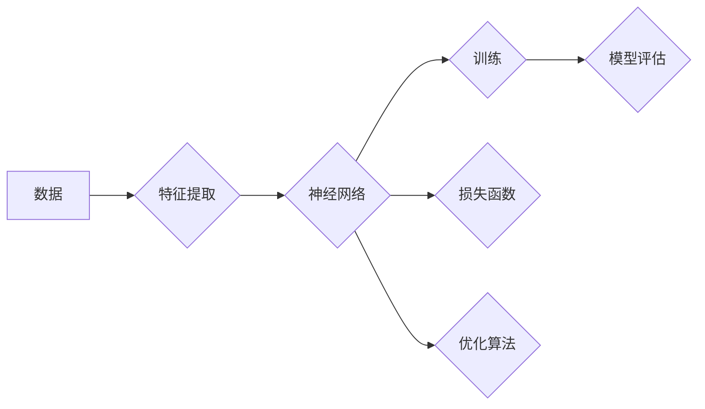

# 深度学习 原理与代码实例讲解

> 关键词：深度学习，神经网络，卷积神经网络，循环神经网络，强化学习，监督学习，无监督学习，PyTorch，TensorFlow

## 1. 背景介绍

深度学习是人工智能领域的一项革命性技术，它通过模拟人脑神经网络的结构和功能，实现了对复杂数据的自动学习和特征提取。自2012年以来，深度学习在图像识别、语音识别、自然语言处理等领域取得了显著成果，推动了人工智能的发展和应用。

### 1.1 深度学习的起源与发展

深度学习的概念最早可以追溯到20世纪40年代，当时的研究人员开始探索如何通过人工神经网络来模拟人脑的学习过程。然而，由于计算能力和数据量的限制，深度学习的发展一度陷入停滞。

直到2006年，Hinton等研究者提出了深度信念网络（DBN），标志着深度学习的复兴。随后，卷积神经网络（CNN）和循环神经网络（RNN）等深度学习模型的提出，进一步推动了深度学习的发展。

### 1.2 深度学习的主要应用

深度学习在各个领域都有广泛的应用，以下是一些典型的应用场景：

- 图像识别：识别和分类图像中的物体、场景、人物等。
- 语音识别：将语音信号转换为文本。
- 自然语言处理：进行文本分类、机器翻译、情感分析等。
- 推荐系统：为用户推荐商品、新闻、音乐等。
- 游戏：实现智能游戏AI，如AlphaGo。

## 2. 核心概念与联系

深度学习涉及多个核心概念，以下是一些重要的概念以及它们之间的关系：



### 2.1 数据

数据是深度学习的基础，用于训练和评估模型。数据的质量和数量直接影响模型的性能。

### 2.2 特征提取

特征提取是将原始数据转换为适合神经网络处理的形式的过程。常见的特征提取方法包括：离散化、归一化、降维等。

### 2.3 神经网络

神经网络是深度学习的基本单元，由多个神经元组成。每个神经元负责提取数据中的特定特征，并通过权重连接到其他神经元。

### 2.4 训练

训练是指使用数据对神经网络进行学习和优化。在训练过程中，神经网络会不断调整权重，以最小化预测结果与真实结果之间的误差。

### 2.5 模型评估

模型评估是指使用测试数据对训练好的模型进行评估，以确定模型的性能。常见的评估指标包括：准确率、召回率、F1分数等。

### 2.6 损失函数

损失函数用于衡量模型预测结果与真实结果之间的差异。常见的损失函数包括：均方误差（MSE）、交叉熵损失（Cross-Entropy）等。

### 2.7 优化算法

优化算法用于更新神经网络的权重，以最小化损失函数。常见的优化算法包括：梯度下降（Gradient Descent）、Adam等。

## 3. 核心算法原理 & 具体操作步骤

### 3.1 算法原理概述

深度学习算法主要包括以下几种：

- **监督学习**：使用标注数据训练模型，如分类、回归等。
- **无监督学习**：使用未标注数据训练模型，如聚类、降维等。
- **半监督学习**：使用部分标注数据和大量未标注数据训练模型。
- **强化学习**：通过与环境交互学习最优策略。

### 3.2 算法步骤详解

以下是监督学习算法的一般步骤：

1. **数据预处理**：对原始数据进行清洗、归一化等操作，使其适合模型训练。
2. **模型选择**：选择合适的模型结构，如神经网络、支持向量机等。
3. **参数初始化**：初始化模型参数，如权重、偏置等。
4. **模型训练**：使用训练数据对模型进行训练，通过优化算法调整模型参数。
5. **模型评估**：使用测试数据评估模型性能，调整模型参数。
6. **模型部署**：将训练好的模型部署到实际应用中。

### 3.3 算法优缺点

- **监督学习**：需要大量标注数据，但性能较好。
- **无监督学习**：不需要标注数据，但性能可能不如监督学习。
- **半监督学习**：结合了监督学习和无监督学习的优点，但需要处理大量未标注数据。
- **强化学习**：需要大量的交互数据，但能够学习到更复杂的策略。

### 3.4 算法应用领域

深度学习算法在各个领域都有广泛的应用，以下是一些典型的应用领域：

- **图像识别**：人脸识别、物体检测、场景分割等。
- **语音识别**：语音识别、语音合成、说话人识别等。
- **自然语言处理**：文本分类、机器翻译、情感分析等。
- **推荐系统**：商品推荐、新闻推荐、电影推荐等。
- **游戏**：游戏AI、棋类游戏、电子竞技等。

## 4. 数学模型和公式 & 详细讲解 & 举例说明

### 4.1 数学模型构建

深度学习模型通常使用以下数学模型：

- **激活函数**：用于引入非线性，使模型能够学习更复杂的函数关系。常见的激活函数包括：Sigmoid、ReLU、Tanh等。
- **损失函数**：用于衡量模型预测结果与真实结果之间的差异。常见的损失函数包括：均方误差（MSE）、交叉熵损失（Cross-Entropy）等。
- **优化算法**：用于更新模型参数，以最小化损失函数。常见的优化算法包括：梯度下降（Gradient Descent）、Adam等。

### 4.2 公式推导过程

以下是交叉熵损失函数的推导过程：

$$
L = -\sum_{i=1}^N y_i \log \hat{y}_i
$$

其中，$y_i$ 为真实标签，$\hat{y}_i$ 为模型预测概率。

### 4.3 案例分析与讲解

以下是一个简单的神经网络模型，用于进行二分类任务：

```
输入层 -> ReLU激活函数 -> 输出层
```

输入层包含2个神经元，输出层包含1个神经元。模型使用Sigmoid激活函数进行输出，输出范围为[0, 1]。

```python
import torch
import torch.nn as nn

class SimpleNN(nn.Module):
    def __init__(self):
        super(SimpleNN, self).__init__()
        self.fc = nn.Linear(2, 1)
    
    def forward(self, x):
        x = torch.relu(self.fc(x))
        return torch.sigmoid(x)

model = SimpleNN()
```

## 5. 项目实践：代码实例和详细解释说明

### 5.1 开发环境搭建

在开始深度学习项目之前，需要搭建相应的开发环境。以下是一个基于PyTorch的深度学习项目开发环境搭建步骤：

1. 安装Anaconda：从Anaconda官网下载并安装Anaconda。
2. 创建虚拟环境：使用conda命令创建一个名为"deeplearning"的虚拟环境。
3. 激活虚拟环境：使用conda命令激活"deeplearning"虚拟环境。
4. 安装PyTorch：使用pip命令安装PyTorch。

### 5.2 源代码详细实现

以下是一个使用PyTorch实现的简单神经网络模型：

```python
import torch
import torch.nn as nn
import torch.optim as optim

class SimpleNN(nn.Module):
    def __init__(self):
        super(SimpleNN, self).__init__()
        self.fc1 = nn.Linear(2, 10)
        self.fc2 = nn.Linear(10, 1)
    
    def forward(self, x):
        x = torch.relu(self.fc1(x))
        x = self.fc2(x)
        return torch.sigmoid(x)

# 加载数据
# ...

# 初始化模型、损失函数和优化器
model = SimpleNN()
criterion = nn.BCELoss()
optimizer = optim.Adam(model.parameters(), lr=0.01)

# 训练模型
# ...

# 评估模型
# ...
```

### 5.3 代码解读与分析

以上代码定义了一个简单的神经网络模型，包含两个全连接层。输入层包含2个神经元，输出层包含1个神经元。模型使用ReLU激活函数和Sigmoid激活函数，分别用于隐藏层和输出层。

在训练过程中，使用Adam优化器更新模型参数，并使用BCELoss损失函数进行模型评估。

### 5.4 运行结果展示

以下是一个简单的训练过程示例：

```python
# 训练模型
for epoch in range(100):
    for data, target in train_loader:
        optimizer.zero_grad()
        output = model(data)
        loss = criterion(output, target)
        loss.backward()
        optimizer.step()

    # 打印训练信息
    print(f"Epoch {epoch+1}, Loss: {loss.item()}")
```

## 6. 实际应用场景

深度学习在各个领域都有广泛的应用，以下是一些典型的应用场景：

### 6.1 图像识别

图像识别是深度学习最典型的应用之一。以下是一些图像识别的应用案例：

- **人脸识别**：用于门禁系统、人脸支付等场景。
- **物体检测**：用于自动驾驶、工业检测等场景。
- **场景分割**：用于虚拟现实、增强现实等场景。

### 6.2 语音识别

语音识别是将语音信号转换为文本的技术。以下是一些语音识别的应用案例：

- **语音助手**：如Siri、Alexa等。
- **语音翻译**：将一种语言的语音翻译成另一种语言。
- **语音搜索**：将语音输入转换为文本，并在互联网上进行搜索。

### 6.3 自然语言处理

自然语言处理是深度学习在文本领域的重要应用。以下是一些自然语言处理的应用案例：

- **文本分类**：将文本分类到预定义的类别中。
- **机器翻译**：将一种语言的文本翻译成另一种语言。
- **情感分析**：分析文本的情感倾向。

## 7. 工具和资源推荐

### 7.1 学习资源推荐

- 《深度学习》 - Ian Goodfellow、Yoshua Bengio和Aaron Courville合著，是深度学习领域的经典教材。
- 《神经网络与深度学习》 -邱锡鹏合著，是国内深度学习领域的入门教材。

### 7.2 开发工具推荐

- PyTorch：开源的深度学习框架，易于使用，社区活跃。
- TensorFlow：Google开发的深度学习框架，功能强大，适合大型项目。

### 7.3 相关论文推荐

- **AlexNet**：Alex Krizhevsky等人在2012年提出的卷积神经网络模型，开启了深度学习的热潮。
- **VGGNet**：Krizhevsky等人在2014年提出的卷积神经网络模型，在ImageNet竞赛中取得了优异成绩。
- **ResNet**：He等人在2015年提出的残差网络模型，解决了深层网络训练困难的问题。
- **Inception**：Google在2014年提出的Inception网络模型，将深度学习模型推向了新高度。

## 8. 总结：未来发展趋势与挑战

### 8.1 研究成果总结

深度学习在过去几年取得了巨大的进展，为人工智能领域带来了新的突破。随着计算能力的提升和数据的积累，深度学习将在更多领域得到应用。

### 8.2 未来发展趋势

- **模型轻量化**：为了降低模型的计算复杂度和存储需求，研究人员将致力于模型轻量化的研究。
- **可解释性**：为了提高模型的可靠性和可信度，研究人员将探索模型的可解释性。
- **跨模态学习**：为了更好地理解和处理复杂数据，研究人员将探索跨模态学习。

### 8.3 面临的挑战

- **数据隐私**：随着数据量的增加，数据隐私问题日益突出。
- **模型可解释性**：当前的深度学习模型往往被视为黑盒，其决策过程难以解释。
- **计算资源**：深度学习模型需要大量的计算资源，这对于一些资源有限的场景来说是一个挑战。

### 8.4 研究展望

深度学习作为人工智能领域的一项重要技术，将在未来得到更广泛的应用。随着研究的不断深入，深度学习将推动人工智能向更高的水平发展。

## 9. 附录：常见问题与解答

**Q1：什么是深度学习？**

A：深度学习是一种模拟人脑神经网络结构和功能的机器学习方法，通过学习大量数据中的特征和模式，实现对复杂数据的自动学习和特征提取。

**Q2：深度学习有哪些应用？**

A：深度学习在图像识别、语音识别、自然语言处理、推荐系统、游戏等领域都有广泛的应用。

**Q3：如何选择合适的深度学习模型？**

A：选择合适的深度学习模型需要根据具体的应用场景和数据特点进行综合考虑。

**Q4：如何训练深度学习模型？**

A：训练深度学习模型需要使用大量的数据和计算资源，通常需要使用深度学习框架，如PyTorch或TensorFlow。

**Q5：深度学习模型有哪些局限性？**

A：深度学习模型存在一些局限性，如对数据质量的要求较高、模型可解释性较差、需要大量的计算资源等。

---

作者：禅与计算机程序设计艺术 / Zen and the Art of Computer Programming