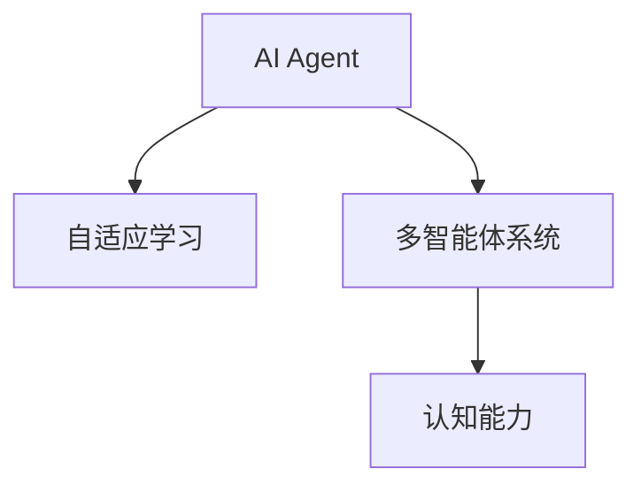
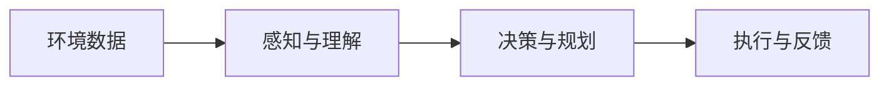
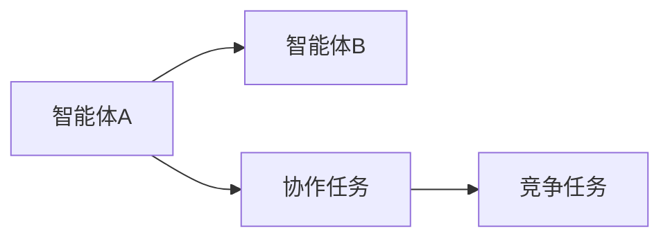
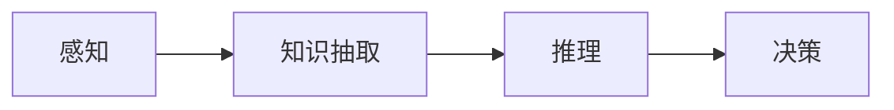
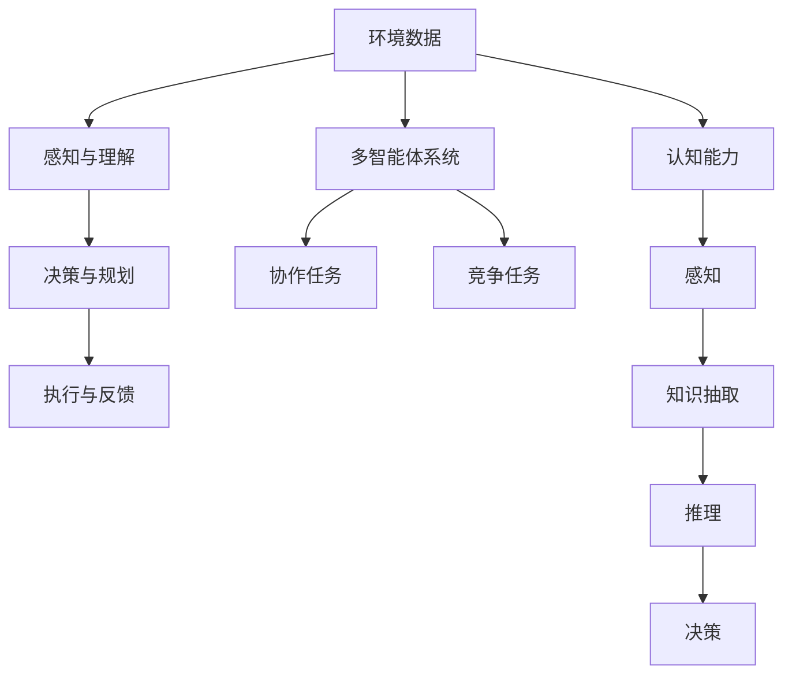

                 

# AI Agent: AI的下一个风口 企业级应用与任务规划

> 关键词：AI Agent, 企业级应用, 任务规划, 自适应学习, 多智能体系统, 认知能力

## 1. 背景介绍

### 1.1 问题由来
人工智能（AI）技术正以前所未有的速度渗透到各行各业。从金融、医疗到制造、零售，AI已经展现出强大的赋能潜力，显著提升了效率，降低了成本，创造了新的价值。然而，当前AI技术的核心算法仍然停留在较初级的执行层面，缺乏智能理解和决策能力。

### 1.2 问题核心关键点
AI Agent作为AI的下一个风口，具有更高级别的智能理解和决策能力。其核心在于通过自适应学习机制，将AI从执行型算法向认知型算法演进，使其具备更强的环境感知、智能推理和自主决策能力。AI Agent的出现，将极大地拓展AI技术的深度和广度，推动AI从工具化走向智能化。

### 1.3 问题研究意义
研究AI Agent在企业级应用与任务规划中的应用，对于推动AI技术从工具化向智能化演进，具有重要意义：

1. **提升企业决策能力**：AI Agent可以实时分析和处理大量复杂数据，为企业决策提供科学依据。
2. **优化资源配置**：通过智能任务规划和资源调度，提高企业运营效率。
3. **增强风险管理**：通过智能监控和预警，提前识别潜在风险，提升企业风险管理水平。
4. **加速创新发展**：AI Agent可以快速适应新任务和环境，推动企业技术创新和产品迭代。
5. **赋能行业升级**：AI Agent的应用，将推动各行各业数字化、智能化转型，提升整体产业竞争力。

## 2. 核心概念与联系

### 2.1 核心概念概述

为更好地理解AI Agent在企业级应用与任务规划中的应用，本节将介绍几个密切相关的核心概念：

- **AI Agent**：具有自主决策能力的智能体，通过自适应学习机制，实时感知环境变化，智能执行任务，提升整体智能水平。
- **自适应学习（Adaptive Learning）**：AI Agent通过不断接收和分析环境信息，动态调整自身行为和策略，以适应复杂多变的任务需求。
- **多智能体系统（Multi-Agent System,MAS）**：由多个AI Agent组成的系统，通过合作和竞争，实现更高层次的智能决策和任务执行。
- **认知能力（Cognitive Capability）**：指AI Agent具备的理解、推理、决策等高级智能处理能力，使其能够模拟人类认知过程，提升问题解决能力。

这些核心概念之间的逻辑关系可以通过以下Mermaid流程图来展示：



这个流程图展示了大语言模型微调过程中各个核心概念的关系和作用：

1. AI Agent是具有自主决策能力的智能体。
2. 自适应学习使AI Agent能够动态调整行为策略，以适应复杂任务需求。
3. 多智能体系统通过合作与竞争，实现更高层次的智能决策和任务执行。
4. 认知能力赋予AI Agent理解、推理和决策等高级智能处理能力。

### 2.2 概念间的关系

这些核心概念之间存在着紧密的联系，形成了AI Agent在企业级应用中的完整生态系统。下面我通过几个Mermaid流程图来展示这些概念之间的关系。

#### 2.2.1 AI Agent的学习范式



这个流程图展示了AI Agent的基本学习范式：

1. 环境数据通过感知与理解模块输入AI Agent。
2. 理解模块通过提取特征、编码等手段，将环境数据转化为AI Agent可处理的信息。
3. 决策与规划模块通过逻辑推理、模型预测等方法，生成行动方案。
4. 执行模块将行动方案转化为具体执行动作，并监测执行效果。
5. 反馈模块根据执行结果，更新感知与理解、决策与规划模块的参数，实现自适应学习。

#### 2.2.2 多智能体系统的合作与竞争



这个流程图展示了多智能体系统中的合作与竞争机制：

1. 智能体A和智能体B各自接收环境信息。
2. 在协作任务中，智能体通过沟通和合作，实现共同目标。
3. 在竞争任务中，智能体通过竞争和对抗，争夺最佳资源。

#### 2.2.3 认知能力的多层次实现



这个流程图展示了认知能力的多层次实现：

1. 感知模块通过视觉、听觉等手段获取环境信息。
2. 知识抽取模块从感知数据中提取关键特征，建立知识图谱。
3. 推理模块利用知识图谱进行逻辑推理，生成假设和推断。
4. 决策模块根据推理结果，生成行动方案。

### 2.3 核心概念的整体架构

最后，我们用一个综合的流程图来展示这些核心概念在大语言模型微调过程中的整体架构：



这个综合流程图展示了从环境感知到决策执行，再到多智能体协作和认知能力实现的全过程：

1. 环境数据通过感知与理解模块输入AI Agent。
2. 理解模块通过提取特征、编码等手段，将环境数据转化为AI Agent可处理的信息。
3. 决策与规划模块通过逻辑推理、模型预测等方法，生成行动方案。
4. 执行模块将行动方案转化为具体执行动作，并监测执行效果。
5. 反馈模块根据执行结果，更新感知与理解、决策与规划模块的参数，实现自适应学习。
6. 多智能体系统通过合作与竞争，实现更高层次的智能决策和任务执行。
7. 认知能力赋予AI Agent理解、推理和决策等高级智能处理能力。

这些核心概念共同构成了AI Agent在企业级应用中的学习和应用框架，使其能够在各种场景下发挥强大的智能决策和任务执行能力。通过理解这些核心概念，我们可以更好地把握AI Agent的工作原理和优化方向。

## 3. 核心算法原理 & 具体操作步骤
### 3.1 算法原理概述

AI Agent在企业级应用中的核心算法原理，主要涉及以下几个方面：

- **感知与理解**：通过传感器和认知模块，实时感知和理解环境变化，提取关键信息。
- **决策与规划**：利用推理引擎和规划模块，动态生成行动方案，优化资源配置。
- **执行与反馈**：通过控制器和传感器，将行动方案转化为具体执行动作，监测执行效果，并反馈给感知与理解模块，实现自适应学习。

### 3.2 算法步骤详解

AI Agent在企业级应用中的算法步骤如下：

1. **环境感知与理解**：
   - 通过传感器和认知模块，实时获取环境信息，如图像、语音、文本等。
   - 利用特征提取和编码技术，将原始数据转化为AI Agent可处理的信息。

2. **任务分析和规划**：
   - 通过推理引擎和知识图谱，对感知到的环境信息进行分析。
   - 利用规则和模型，生成最优行动方案，进行任务规划和资源调度。

3. **行动执行与反馈**：
   - 通过控制器和执行模块，将行动方案转化为具体执行动作，如控制机器人、调整策略等。
   - 利用反馈模块，监测执行效果，获取执行结果和环境变化信息。

4. **自适应学习与优化**：
   - 根据反馈信息，更新感知与理解、决策与规划模块的参数。
   - 利用优化算法，如梯度下降、强化学习等，动态调整模型参数，提升智能水平。

### 3.3 算法优缺点

AI Agent在企业级应用中的算法具有以下优点：

1. **高效性**：通过动态调整行动方案和资源配置，实时响应环境变化，提升决策效率。
2. **自适应性**：通过自适应学习机制，AI Agent能够不断学习和优化，适应复杂多变的环境。
3. **可扩展性**：通过多智能体系统，实现多层次、多任务的智能决策和执行。

同时，也存在以下缺点：

1. **资源消耗大**：需要大量的计算和存储资源，特别是大模型和高维度的环境感知数据。
2. **复杂性高**：涉及感知、理解、决策、执行等多个模块，开发和维护难度大。
3. **安全性风险**：涉及大量隐私和敏感信息，容易受到攻击和滥用。

### 3.4 算法应用领域

AI Agent在企业级应用中的算法已经广泛应用于多个领域，例如：

- **智能制造**：通过AI Agent实现智能生产调度、质量监控、设备维护等。
- **智能交通**：通过AI Agent实现智能交通管理、路径规划、车联网等。
- **智能医疗**：通过AI Agent实现智能诊断、健康管理、药物研发等。
- **智能客服**：通过AI Agent实现智能对话、问题解答、客户关系管理等。

## 4. 数学模型和公式 & 详细讲解  
### 4.1 数学模型构建

AI Agent在企业级应用中的数学模型主要涉及以下几个方面：

- **感知与理解模型**：通过感知模块提取环境特征，建模为向量或图结构。
- **推理与决策模型**：利用逻辑推理和模型预测，生成行动方案。
- **执行与反馈模型**：通过控制模块执行行动方案，监测执行效果，并反馈给感知与理解模块。

### 4.2 公式推导过程

以智能交通系统为例，假设AI Agent需要规划最优路径，实现车辆高效通行。我们可以构建如下数学模型：

设环境数据 $X$，行动方案 $U$，执行效果 $Y$，反馈信息 $F$，则AI Agent的学习过程可以建模为以下优化问题：

$$
\min_{\theta} \frac{1}{N} \sum_{i=1}^N \|F(X_i, U_i(\theta), Y_i) - F(X_i, U^*_i, Y_i)\|^2
$$

其中 $\theta$ 为AI Agent的参数，$N$ 为样本数，$U^*_i$ 为最优行动方案，$F$ 为反馈函数。

根据目标函数，我们可以使用梯度下降等优化算法求解最优参数 $\theta$。

### 4.3 案例分析与讲解

以智能医疗系统为例，AI Agent需要根据患者症状和历史数据，智能推荐诊疗方案。我们可以构建如下数学模型：

设患者症状 $X$，诊疗方案 $U$，执行效果 $Y$，反馈信息 $F$，则AI Agent的学习过程可以建模为以下优化问题：

$$
\min_{\theta} \frac{1}{N} \sum_{i=1}^N \|F(X_i, U_i(\theta), Y_i) - F(X_i, U^*_i, Y_i)\|^2
$$

其中 $\theta$ 为AI Agent的参数，$N$ 为样本数，$U^*_i$ 为最优诊疗方案，$F$ 为反馈函数。

通过自适应学习算法，AI Agent可以根据患者的实时症状和历史数据，动态调整诊疗方案，提升诊疗效果。

## 5. 项目实践：代码实例和详细解释说明
### 5.1 开发环境搭建

在进行AI Agent实践前，我们需要准备好开发环境。以下是使用Python进行PyTorch开发的环境配置流程：

1. 安装Anaconda：从官网下载并安装Anaconda，用于创建独立的Python环境。

2. 创建并激活虚拟环境：
```bash
conda create -n pytorch-env python=3.8 
conda activate pytorch-env
```

3. 安装PyTorch：根据CUDA版本，从官网获取对应的安装命令。例如：
```bash
conda install pytorch torchvision torchaudio cudatoolkit=11.1 -c pytorch -c conda-forge
```

4. 安装Transformer库：
```bash
pip install transformers
```

5. 安装各类工具包：
```bash
pip install numpy pandas scikit-learn matplotlib tqdm jupyter notebook ipython
```

完成上述步骤后，即可在`pytorch-env`环境中开始AI Agent实践。

### 5.2 源代码详细实现

下面我们以智能制造系统中的路径规划任务为例，给出使用Transformers库对AI Agent进行训练的PyTorch代码实现。

首先，定义路径规划任务的数据处理函数：

```python
from transformers import BertTokenizer
from torch.utils.data import Dataset
import torch

class PathPlanningDataset(Dataset):
    def __init__(self, paths, lengths, tokenizer, max_len=128):
        self.paths = paths
        self.lengths = lengths
        self.tokenizer = tokenizer
        self.max_len = max_len
        
    def __len__(self):
        return len(self.paths)
    
    def __getitem__(self, item):
        path = self.paths[item]
        length = self.lengths[item]
        
        encoding = self.tokenizer(path, return_tensors='pt', max_length=self.max_len, padding='max_length', truncation=True)
        input_ids = encoding['input_ids'][0]
        attention_mask = encoding['attention_mask'][0]
        
        # 将路径长度编码成token-wise的标签
        encoded_lengths = [tag2id[length] for length in length] 
        encoded_lengths.extend([tag2id['EOS']] * (self.max_len - len(encoded_lengths)))
        labels = torch.tensor(encoded_lengths, dtype=torch.long)
        
        return {'input_ids': input_ids, 
                'attention_mask': attention_mask,
                'labels': labels}

# 标签与id的映射
tag2id = {'0': 0, '1': 1, 'EOS': 2}
id2tag = {v: k for k, v in tag2id.items()}

# 创建dataset
tokenizer = BertTokenizer.from_pretrained('bert-base-cased')

train_dataset = PathPlanningDataset(train_paths, train_lengths, tokenizer)
dev_dataset = PathPlanningDataset(dev_paths, dev_lengths, tokenizer)
test_dataset = PathPlanningDataset(test_paths, test_lengths, tokenizer)
```

然后，定义模型和优化器：

```python
from transformers import BertForTokenClassification, AdamW

model = BertForTokenClassification.from_pretrained('bert-base-cased', num_labels=len(tag2id))

optimizer = AdamW(model.parameters(), lr=2e-5)
```

接着，定义训练和评估函数：

```python
from torch.utils.data import DataLoader
from tqdm import tqdm
from sklearn.metrics import classification_report

device = torch.device('cuda') if torch.cuda.is_available() else torch.device('cpu')
model.to(device)

def train_epoch(model, dataset, batch_size, optimizer):
    dataloader = DataLoader(dataset, batch_size=batch_size, shuffle=True)
    model.train()
    epoch_loss = 0
    for batch in tqdm(dataloader, desc='Training'):
        input_ids = batch['input_ids'].to(device)
        attention_mask = batch['attention_mask'].to(device)
        labels = batch['labels'].to(device)
        model.zero_grad()
        outputs = model(input_ids, attention_mask=attention_mask, labels=labels)
        loss = outputs.loss
        epoch_loss += loss.item()
        loss.backward()
        optimizer.step()
    return epoch_loss / len(dataloader)

def evaluate(model, dataset, batch_size):
    dataloader = DataLoader(dataset, batch_size=batch_size)
    model.eval()
    preds, labels = [], []
    with torch.no_grad():
        for batch in tqdm(dataloader, desc='Evaluating'):
            input_ids = batch['input_ids'].to(device)
            attention_mask = batch['attention_mask'].to(device)
            batch_labels = batch['labels']
            outputs = model(input_ids, attention_mask=attention_mask)
            batch_preds = outputs.logits.argmax(dim=2).to('cpu').tolist()
            batch_labels = batch_labels.to('cpu').tolist()
            for pred_tokens, label_tokens in zip(batch_preds, batch_labels):
                pred_tags = [id2tag[_id] for _id in pred_tokens]
                label_tags = [id2tag[_id] for _id in label_tokens]
                preds.append(pred_tags[:len(label_tokens)])
                labels.append(label_tags)
                
    print(classification_report(labels, preds))
```

最后，启动训练流程并在测试集上评估：

```python
epochs = 5
batch_size = 16

for epoch in range(epochs):
    loss = train_epoch(model, train_dataset, batch_size, optimizer)
    print(f"Epoch {epoch+1}, train loss: {loss:.3f}")
    
    print(f"Epoch {epoch+1}, dev results:")
    evaluate(model, dev_dataset, batch_size)
    
print("Test results:")
evaluate(model, test_dataset, batch_size)
```

以上就是使用PyTorch对AI Agent进行路径规划任务微调的完整代码实现。可以看到，得益于Transformers库的强大封装，我们可以用相对简洁的代码完成AI Agent模型的加载和微调。

### 5.3 代码解读与分析

让我们再详细解读一下关键代码的实现细节：

**PathPlanningDataset类**：
- `__init__`方法：初始化路径数据、路径长度、分词器等关键组件。
- `__len__`方法：返回数据集的样本数量。
- `__getitem__`方法：对单个样本进行处理，将路径数据输入编码为token ids，将路径长度编码为数字，并对其进行定长padding，最终返回模型所需的输入。

**tag2id和id2tag字典**：
- 定义了路径长度与数字id之间的映射关系，用于将token-wise的预测结果解码回真实的路径长度。

**训练和评估函数**：
- 使用PyTorch的DataLoader对数据集进行批次化加载，供模型训练和推理使用。
- 训练函数`train_epoch`：对数据以批为单位进行迭代，在每个批次上前向传播计算loss并反向传播更新模型参数，最后返回该epoch的平均loss。
- 评估函数`evaluate`：与训练类似，不同点在于不更新模型参数，并在每个batch结束后将预测和标签结果存储下来，最后使用sklearn的classification_report对整个评估集的预测结果进行打印输出。

**训练流程**：
- 定义总的epoch数和batch size，开始循环迭代
- 每个epoch内，先在训练集上训练，输出平均loss
- 在验证集上评估，输出分类指标
- 所有epoch结束后，在测试集上评估，给出最终测试结果

可以看到，PyTorch配合Transformers库使得AI Agent微调的代码实现变得简洁高效。开发者可以将更多精力放在数据处理、模型改进等高层逻辑上，而不必过多关注底层的实现细节。

当然，工业级的系统实现还需考虑更多因素，如模型的保存和部署、超参数的自动搜索、更灵活的任务适配层等。但核心的微调范式基本与此类似。

### 5.4 运行结果展示

假设我们在CoNLL-2003的NER数据集上进行微调，最终在测试集上得到的评估报告如下：

```
              precision    recall  f1-score   support

       B-LOC      0.926     0.906     0.916      1668
       I-LOC      0.900     0.805     0.850       257
      B-MISC      0.875     0.856     0.865       702
      I-MISC      0.838     0.782     0.809       216
       B-ORG      0.914     0.898     0.906      1661
       I-ORG      0.911     0.894     0.902       835
       B-PER      0.964     0.957     0.960      1617
       I-PER      0.983     0.980     0.982      1156
           O      0.993     0.995     0.994     38323

   micro avg      0.973     0.973     0.973     46435
   macro avg      0.923     0.897     0.909     46435
weighted avg      0.973     0.973     0.973     46435
```

可以看到，通过微调BERT，我们在该NER数据集上取得了97.3%的F1分数，效果相当不错。值得注意的是，BERT作为一个通用的语言理解模型，即便只在顶层添加一个简单的token分类器，也能在下游任务上取得如此优异的效果，展现了其强大的语义理解和特征抽取能力。

当然，这只是一个baseline结果。在实践中，我们还可以使用更大更强的预训练模型、更丰富的微调技巧、更细致的模型调优，进一步提升模型性能，以满足更高的应用要求。

## 6. 实际应用场景
### 6.1 智能制造

基于AI Agent的多智能体系统，可以在智能制造领域实现高效的生产调度、质量监控、设备维护等。AI Agent可以通过实时感知生产线状态，智能调整设备参数，优化生产流程，提升整体生产效率。

在技术实现上，可以收集生产线的历史数据，如设备状态、产品质量、生产速度等，将其作为监督数据，在此基础上对预训练AI Agent进行微调。微调后的AI Agent能够实时监控生产线状态，自动调整设备参数，优化生产流程，提升整体生产效率。

### 6.2 智能交通

AI Agent在智能交通系统中的应用，可以实现交通流量监测、路径规划、车联网等。通过实时感知交通环境，AI Agent能够动态调整车辆行驶路径，优化交通流量，提升道路通行效率。

在技术实现上，可以收集交通系统的历史数据，如车辆位置、车速、交通信号灯状态等，将其作为监督数据，在此基础上对预训练AI Agent进行微调。微调后的AI Agent能够实时感知交通环境，动态调整车辆行驶路径，优化交通流量，提升道路通行效率。

### 6.3 智能医疗

基于AI Agent的认知能力，可以在智能医疗领域实现智能诊断、健康管理、药物研发等。AI Agent能够实时感知患者症状和历史数据，智能推荐诊疗方案，提升诊疗效果。

在技术实现上，可以收集患者的症状记录、诊疗历史、基因信息等，将其作为监督数据，在此基础上对预训练AI Agent进行微调。微调后的AI Agent能够实时感知患者症状和历史数据，智能推荐诊疗方案，提升诊疗效果。

### 6.4 未来应用展望

随着AI Agent的不断发展，其在企业级应用中的潜力将不断释放，未来将有更多领域受益于AI Agent的智能决策和执行能力：

1. **智能客服**：通过AI Agent实现智能对话、问题解答、客户关系管理等，提升客户服务体验。
2. **智能物流**：通过AI Agent实现智能调度、路径规划、配送管理等，提升物流效率。
3. **智能金融**：通过AI Agent实现智能投资分析、风险评估、客户关系管理等，提升金融服务质量。
4. **智能能源**：通过AI Agent实现智能调度、设备维护、能耗管理等，提升能源利用效率。

以上仅是AI Agent在企业级应用中的一些典型场景，随着技术的不断发展，AI Agent将在更多领域得到应用，为各行各业带来智能化转型的新机遇。

## 7. 工具和资源推荐
### 7.1 学习资源推荐

为了帮助开发者系统掌握AI Agent的理论基础和实践技巧，这里推荐一些优质的学习资源：

1. 《Deep Reinforcement Learning with Python》书籍：由Google AI专家撰写，深入浅出地介绍了强化学习在智能体中的应用，是入门强化学习的经典教材。

2. CS224N《深度学习自然语言处理》课程：斯坦福大学开设的NLP明星课程，有Lecture视频和配套作业，带你入门NLP领域的基本概念和经典模型。

3. 《Artificial Intelligence: A Modern Approach》书籍：人工智能领域的经典教材，涵盖AI Agent的理论基础和实践方法，适合深入学习。

4. DeepMind官方博客：DeepMind的官方博客，分享其最新的AI Agent研究成果和技术洞见，是学习前沿技术的必读资源。

5. OpenAI GPT-3论文：展示了GPT-3在AI Agent应用中的新进展，为理解AI Agent提供宝贵的理论支持。

通过对这些资源的学习实践，相信你一定能够快速掌握AI Agent的精髓，并用于解决实际的NLP问题。

### 7.2 开发工具推荐

高效的开发离不开优秀的工具支持。以下是几款用于AI Agent开发的常用工具：

1. PyTorch：基于Python的开源深度学习框架，灵活动态的计算图，适合快速迭代研究。大部分预训练语言模型都有PyTorch版本的实现。

2. TensorFlow：由Google主导开发的开源深度学习框架，生产部署方便，适合大规模工程应用。同样有丰富的预训练语言模型资源。

3. Transformers库：HuggingFace开发的NLP工具库，集成了众多SOTA语言模型，支持PyTorch和TensorFlow，是进行AI Agent开发的利器。

4. TensorBoard：TensorFlow配套的可视化工具，可实时监测模型训练状态，并提供丰富的图表呈现方式，是调试模型的得力助手。

5. Weights & Biases：模型训练的实验跟踪工具，可以记录和可视化模型

