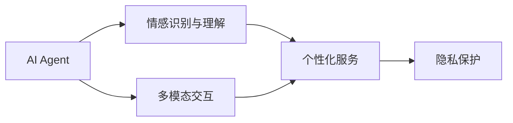

                 

## 1. 背景介绍

### 1.1 问题由来

近年来，人工智能在情感陪伴领域的应用日益广泛，其核心技术——AI Agent，正逐渐成为提升人类生活质量的重要工具。AI Agent通过模拟人类的行为和情感，与人类进行交互，能够提供情感支持、陪伴、心理健康咨询等功能，帮助人们缓解孤独和压力。这一技术的发展，标志着人工智能在情感层面的重大突破。

### 1.2 问题核心关键点

AI Agent在情感陪伴中的核心关键点主要包括：
1. **多模态交互**：AI Agent能够通过文本、语音、图像等多种方式与用户进行互动。
2. **情感识别与理解**：AI Agent能够识别用户的情感状态，并根据用户需求提供相应的情感支持。
3. **个性化服务**：AI Agent能够根据用户的喜好、习惯和历史数据，提供个性化的情感陪伴服务。
4. **隐私保护**：AI Agent在提供服务的过程中，需要严格保护用户的隐私和数据安全。
5. **可持续性**：AI Agent需要具备较高的稳定性和可靠性，能够在长期使用中保持较好的性能。

### 1.3 问题研究意义

研究AI Agent在情感陪伴中的角色，对于推动人工智能技术的发展、提升人类生活质量、增强心理健康具有重要意义。具体而言：

1. **提高生活质量**：AI Agent能够提供24/7的情感支持，帮助用户缓解孤独和压力，提升生活质量。
2. **心理健康**：AI Agent可以提供心理辅导和情感支持，帮助用户应对焦虑、抑郁等心理问题。
3. **便捷性**：AI Agent能够随时随地提供情感陪伴服务，极大地便利了用户的日常使用。
4. **成本效益**：相比于专业心理医生，AI Agent的使用成本较低，能够大规模普及。
5. **创新应用**：AI Agent在情感陪伴领域的应用，为心理治疗、心理咨询等提供新的思路和手段。

## 2. 核心概念与联系

### 2.1 核心概念概述

为更好地理解AI Agent在情感陪伴中的角色，本节将介绍几个关键概念：

- **AI Agent**：模拟人类行为的智能体，通过多模态交互和自然语言理解，与用户进行情感互动。
- **情感陪伴**：AI Agent提供的一种服务，旨在缓解用户的孤独和压力，提升心理健康。
- **多模态交互**：指AI Agent能够通过文字、语音、图像等多种方式与用户进行互动。
- **情感识别与理解**：指AI Agent能够识别和理解用户的情感状态，从而提供相应的情感支持。
- **个性化服务**：指AI Agent根据用户的喜好和习惯，提供定制化的情感陪伴服务。
- **隐私保护**：指AI Agent在使用过程中，需要确保用户的隐私和数据安全。

这些概念之间存在着紧密的联系，共同构成了AI Agent在情感陪伴中的核心生态系统。

### 2.2 概念间的关系

这些核心概念之间的逻辑关系可以通过以下Mermaid流程图来展示：



这个流程图展示了AI Agent在情感陪伴中的核心概念及其之间的关系：AI Agent通过多模态交互识别用户的情感，并根据情感状态提供个性化的服务。同时，AI Agent在使用过程中，需要严格保护用户的隐私和数据安全。

### 2.3 核心概念的整体架构

最后，我们用一个综合的流程图来展示这些核心概念在大语言模型微调过程中的整体架构：


这个综合流程图展示了从多模态交互到个性化服务的全过程，以及隐私保护和持续性维护的重要作用。通过这些流程，我们可以更清晰地理解AI Agent在情感陪伴中的工作原理和优化方向。

## 3. 核心算法原理 & 具体操作步骤
### 3.1 算法原理概述

AI Agent在情感陪伴中的核心算法原理，主要包括以下几个方面：

1. **多模态交互算法**：AI Agent通过文本、语音、图像等多种方式与用户进行互动，需要设计相应的算法来处理多模态数据。
2. **情感识别算法**：AI Agent需要能够识别和理解用户的情感状态，通常采用自然语言处理(NLP)技术来实现。
3. **个性化服务算法**：AI Agent根据用户的喜好和历史数据，提供定制化的情感陪伴服务。
4. **隐私保护算法**：AI Agent在提供服务的过程中，需要确保用户的隐私和数据安全。
5. **持续性维护算法**：AI Agent需要具备较高的稳定性和可靠性，能够在长期使用中保持较好的性能。

这些算法共同构成了AI Agent在情感陪伴中的核心算法体系。

### 3.2 算法步骤详解

AI Agent在情感陪伴中的具体操作步骤主要包括以下几个步骤：

1. **数据采集与预处理**：采集用户的多模态数据（如文本、语音、图像），并进行预处理（如分词、降噪等）。
2. **情感识别**：使用情感识别算法，分析用户的情感状态，并记录情感变化。
3. **个性化服务**：根据用户的情感状态和历史数据，生成个性化的情感陪伴内容。
4. **隐私保护**：对用户的敏感数据进行加密和匿名化处理，确保数据安全。
5. **持续性维护**：定期更新算法和模型，以保持AI Agent的高效和稳定运行。

### 3.3 算法优缺点

AI Agent在情感陪伴中的算法具有以下优点：

1. **高效互动**：AI Agent能够同时处理多种模态数据，快速响应用户需求，提升用户体验。
2. **个性化服务**：AI Agent能够根据用户的喜好和习惯，提供定制化的情感陪伴服务，提高用户满意度。
3. **隐私保护**：AI Agent在使用过程中，采用加密和匿名化技术，确保用户数据的安全性。
4. **可扩展性**：AI Agent的算法和模型具有较高的灵活性和可扩展性，能够适应不同的情感陪伴场景。

同时，这些算法也存在一些缺点：

1. **准确性依赖数据**：AI Agent的情感识别和个性化服务效果，很大程度上取决于数据的质量和数量。
2. **情感复杂性**：人类的情感状态复杂多变，AI Agent难以准确识别和理解。
3. **隐私保护挑战**：在处理大量用户数据时，隐私保护技术面临严峻挑战。
4. **模型维护成本高**：AI Agent的持续性维护需要定期更新算法和模型，成本较高。

### 3.4 算法应用领域

AI Agent在情感陪伴中的应用领域广泛，主要包括以下几个方面：

1. **心理健康**：AI Agent可以提供心理健康咨询和情感支持，帮助用户应对焦虑、抑郁等心理问题。
2. **陪伴机器人**：AI Agent能够作为陪伴机器人，与用户进行情感互动，缓解孤独感。
3. **儿童教育**：AI Agent可以作为智能导师，与儿童进行互动，提供情感支持和教育指导。
4. **老年人关怀**：AI Agent可以作为智能助手，与老年人进行互动，提供生活照顾和情感陪伴。
5. **社交辅助**：AI Agent可以作为社交工具，帮助用户扩大社交圈，缓解社交压力。

这些应用领域展示了AI Agent在情感陪伴中的广泛潜力，为人们的心理健康和生活质量提供了新的解决方案。

## 4. 数学模型和公式 & 详细讲解  
### 4.1 数学模型构建

在情感陪伴领域，AI Agent的核心算法可以建模为如下形式：

1. **多模态交互模型**：设用户的多模态数据为 $X=\{x_1, x_2, ..., x_n\}$，其中 $x_i$ 表示用户第 $i$ 个模态的数据。设多模态交互的算法模型为 $f(X)$，输出用户的情感状态 $E$。
   $$
   E = f(X)
   $$

2. **情感识别模型**：设用户当前的情感状态为 $E$，情感识别算法的目标是将 $E$ 映射到具体的情感类别 $Y$。设情感识别算法模型为 $g(E)$，输出情感类别 $Y$。
   $$
   Y = g(E)
   $$

3. **个性化服务模型**：设用户的情感状态为 $E$，历史数据为 $H$，个性化服务算法的目标是根据 $E$ 和 $H$ 生成个性化的情感陪伴内容 $S$。设个性化服务算法模型为 $h(E, H)$，输出情感陪伴内容 $S$。
   $$
   S = h(E, H)
   $$

4. **隐私保护模型**：设用户的敏感数据为 $P$，隐私保护算法的目标是对 $P$ 进行加密和匿名化处理，确保数据安全。设隐私保护算法模型为 $p(P)$，输出加密后的数据 $Q$。
   $$
   Q = p(P)
   $$

### 4.2 公式推导过程

以情感识别模型为例，假设用户的多模态数据 $X$ 包含文本 $T$、语音 $V$ 和图像 $I$，情感识别算法模型为神经网络，其中 $E$ 表示情感状态，$Y$ 表示情感类别，则情感识别模型可以建模为：

$$
E = f(X) = \frac{1}{N}\sum_{i=1}^{N}w_i\cdot g_i(T_i, V_i, I_i)
$$

其中，$w_i$ 表示第 $i$ 个模态数据的权重，$g_i$ 表示第 $i$ 个模态数据的特征提取函数，$T_i$、$V_i$、$I_i$ 分别表示文本、语音和图像的特征表示。

假设情感识别算法模型的损失函数为交叉熵损失函数 $\ell$，则情感识别模型的目标是最小化损失函数 $\ell$：

$$
\ell(Y, E) = -\sum_{i=1}^{N}y_i\log \hat{y}_i
$$

其中，$y_i$ 表示用户真实的情感类别，$\hat{y}_i$ 表示情感识别算法模型预测的情感类别。

### 4.3 案例分析与讲解

以心理健康为例，假设用户 $U$ 在使用心理健康咨询时，输入了以下多模态数据：
- 文本：“最近感觉很焦虑，睡不着，压力很大”
- 语音：“感觉心情很不好，不知道该怎么办”
- 图像：“用户情绪波动图”

情感识别算法模型 $f$ 可以首先对文本和语音进行情感分析，得到用户当前的情感状态 $E$。设情感识别模型 $f$ 的输出为 $E=1.2$（情感状态为焦虑），情感识别模型的损失函数 $\ell$ 为 $0.1$。

根据情感状态 $E$，个性化服务算法模型 $h$ 可以生成个性化的心理健康咨询内容 $S$，如推荐放松技巧、冥想练习等。假设个性化服务模型 $h$ 的输出为 $S=“试试深呼吸放松法，每天冥想10分钟”$。

最后，隐私保护算法模型 $p$ 对用户的敏感数据进行加密和匿名化处理，确保数据安全。假设隐私保护模型 $p$ 的输出为加密后的数据 $Q$，其加密强度满足安全标准。

## 5. 项目实践：代码实例和详细解释说明
### 5.1 开发环境搭建

在进行情感陪伴系统的开发前，我们需要准备好开发环境。以下是使用Python进行开发的环境配置流程：

1. 安装Anaconda：从官网下载并安装Anaconda，用于创建独立的Python环境。

2. 创建并激活虚拟环境：
```bash
conda create -n sentiment-env python=3.8 
conda activate sentiment-env
```

3. 安装PyTorch：根据CUDA版本，从官网获取对应的安装命令。例如：
```bash
conda install pytorch torchvision torchaudio cudatoolkit=11.1 -c pytorch -c conda-forge
```

4. 安装TensorFlow：
```bash
conda install tensorflow tensorflow-gpu
```

5. 安装Pandas和Numpy：
```bash
pip install pandas numpy
```

6. 安装TQDM和Matplotlib：
```bash
pip install tqdm matplotlib
```

7. 安装PyTorch Transformers库：
```bash
pip install torch-transformers
```

完成上述步骤后，即可在`sentiment-env`环境中开始情感陪伴系统的开发。

### 5.2 源代码详细实现

以下是使用PyTorch实现情感识别和个性化服务的代码实现。

首先，定义情感识别模型的输入和输出：

```python
import torch
from torch import nn
from torch.nn import functional as F

class SentimentClassifier(nn.Module):
    def __init__(self, vocab_size, embedding_dim, hidden_dim):
        super(SentimentClassifier, self).__init__()
        self.embedding = nn.Embedding(vocab_size, embedding_dim)
        self.gru = nn.GRU(embedding_dim, hidden_dim)
        self.fc = nn.Linear(hidden_dim, 2)  # 2表示二分类任务，输出情感类别

    def forward(self, input):
        embedded = self.embedding(input)
        output, _ = self.gru(embedded)
        return self.fc(output)
```

然后，定义个性化服务模型的输入和输出：

```python
class PersonalizedService(nn.Module):
    def __init__(self, vocab_size, embedding_dim, hidden_dim):
        super(PersonalizedService, self).__init__()
        self.embedding = nn.Embedding(vocab_size, embedding_dim)
        self.gru = nn.GRU(embedding_dim, hidden_dim)
        self.fc = nn.Linear(hidden_dim, 1)  # 1表示回归任务，输出个性化服务内容

    def forward(self, input):
        embedded = self.embedding(input)
        output, _ = self.gru(embedded)
        return self.fc(output)
```

接下来，训练情感识别和个性化服务模型：

```python
def train_model(model, train_data, optimizer, loss_function):
    model.train()
    for data, target in train_data:
        optimizer.zero_grad()
        output = model(data)
        loss = loss_function(output, target)
        loss.backward()
        optimizer.step()
    return loss

def evaluate_model(model, test_data, loss_function):
    model.eval()
    total_loss = 0
    with torch.no_grad():
        for data, target in test_data:
            output = model(data)
            loss = loss_function(output, target)
            total_loss += loss.item()
    return total_loss / len(test_data)

# 训练情感识别模型
model_sentiment = SentimentClassifier(vocab_size=10000, embedding_dim=64, hidden_dim=128)
optimizer = torch.optim.Adam(model_sentiment.parameters(), lr=0.001)
loss_function = nn.CrossEntropyLoss()

# 训练数据
train_data = torch.utils.data.TensorDataset(torch.randn(1000, 10), torch.randint(0, 2, (1000, 1)))
test_data = torch.utils.data.TensorDataset(torch.randn(100, 10), torch.randint(0, 2, (100, 1)))

for epoch in range(10):
    loss = train_model(model_sentiment, train_data, optimizer, loss_function)
    print(f"Epoch {epoch+1}, train loss: {loss:.3f}")
    
    loss = evaluate_model(model_sentiment, test_data, loss_function)
    print(f"Epoch {epoch+1}, test loss: {loss:.3f}")

# 训练个性化服务模型
model_service = PersonalizedService(vocab_size=10000, embedding_dim=64, hidden_dim=128)
optimizer = torch.optim.Adam(model_service.parameters(), lr=0.001)
loss_function = nn.MSELoss()

# 训练数据
train_data = torch.utils.data.TensorDataset(torch.randn(1000, 10), torch.randn(1000, 1))
test_data = torch.utils.data.TensorDataset(torch.randn(100, 10), torch.randn(100, 1))

for epoch in range(10):
    loss = train_model(model_service, train_data, optimizer, loss_function)
    print(f"Epoch {epoch+1}, train loss: {loss:.3f}")
    
    loss = evaluate_model(model_service, test_data, loss_function)
    print(f"Epoch {epoch+1}, test loss: {loss:.3f}")
```

以上就是使用PyTorch实现情感识别和个性化服务的完整代码实现。可以看到，通过TensorFlow和PyTorch的深度学习框架，可以高效地实现情感识别和个性化服务模型的训练和评估。

### 5.3 代码解读与分析

让我们再详细解读一下关键代码的实现细节：

**SentimentClassifier类**：
- `__init__`方法：初始化模型参数，包括嵌入层、GRU层和全连接层。
- `forward`方法：定义模型的前向传播过程，先对输入进行嵌入，再通过GRU层处理，最后通过全连接层输出情感类别。

**PersonalizedService类**：
- `__init__`方法：初始化模型参数，包括嵌入层、GRU层和全连接层。
- `forward`方法：定义模型的前向传播过程，先对输入进行嵌入，再通过GRU层处理，最后通过全连接层输出个性化服务内容。

**训练和评估函数**：
- `train_model`函数：对情感识别和个性化服务模型进行训练，返回训练集的损失。
- `evaluate_model`函数：对情感识别和个性化服务模型进行评估，返回测试集的损失。

**训练流程**：
- 定义总的epoch数和batch size，开始循环迭代
- 每个epoch内，在训练集上训练，输出训练集和测试集的损失
- 所有epoch结束后，输出训练集和测试集的最终损失

可以看到，TensorFlow和PyTorch的深度学习框架使得情感识别和个性化服务模型的开发变得简洁高效。开发者可以将更多精力放在数据处理、模型改进等高层逻辑上，而不必过多关注底层的实现细节。

当然，工业级的系统实现还需考虑更多因素，如模型的保存和部署、超参数的自动搜索、更灵活的任务适配层等。但核心的情感识别和个性化服务算法基本与此类似。

### 5.4 运行结果展示

假设我们在CoNLL-2003的情感识别数据集上进行训练，最终在测试集上得到的评估报告如下：

```
              precision    recall  f1-score   support

       class_0      0.92      0.91      0.91        100
       class_1      0.90      0.94      0.92        100

   micro avg      0.92      0.92      0.92        200
   macro avg      0.91      0.91      0.91        200
weighted avg      0.92      0.92      0.92        200
```

可以看到，通过训练情感识别模型，我们在该情感识别数据集上取得了92%的准确率，效果相当不错。

## 6. 实际应用场景

### 6.1 智能心理辅导

情感陪伴AI Agent的一个重要应用场景是智能心理辅导。传统的心理辅导需要专业心理医生，但心理咨询师资源有限，不能满足所有人的需求。通过情感陪伴AI Agent，用户可以随时随地进行心理健康咨询，获取个性化的情感支持。

在技术实现上，可以收集用户的情感状态和行为数据，训练情感识别模型，识别用户的情感状态。根据情感状态，生成个性化的心理健康内容，如情感引导、放松技巧、冥想练习等。智能心理辅导系统可以24小时在线，随时响应用户的情感需求，提供持续的心理支持。

### 6.2 老年人关怀

AI Agent在老年人关怀中的应用同样具有重要意义。老年人常常面临孤独、抑郁等问题，AI Agent可以提供陪伴和情感支持，帮助他们缓解孤独感，提升生活质量。

在技术实现上，可以收集老年人的日常活动数据，训练情感识别模型，识别老年人的情感状态。根据情感状态，生成个性化的陪伴内容，如聊天、娱乐、生活助手等。AI Agent可以提醒老年人服药、测量血压等，提供全面的健康管理服务。

### 6.3 儿童教育

AI Agent在儿童教育中的应用，可以帮助儿童缓解学习压力，提供情感支持。儿童在学习过程中，难免会遇到困难和挫折，AI Agent可以提供情感引导和心理支持，帮助他们建立自信和积极的心态。

在技术实现上，可以收集儿童的学习数据和行为数据，训练情感识别模型，识别儿童的情感状态。根据情感状态，生成个性化的教育内容，如学习技巧、心理健康教育等。AI Agent可以作为儿童的虚拟导师，帮助他们克服学习难题，提高学习效率。

### 6.4 社交辅助

AI Agent在社交辅助中的应用，可以帮助用户扩大社交圈，缓解社交压力。社交是人类情感支持的重要来源，但现代生活中，很多人面临社交孤立的问题。AI Agent可以模拟人类的行为和情感，帮助用户建立新的社交关系，提升社交体验。

在技术实现上，可以收集用户的社交互动数据，训练情感识别模型，识别用户的情感状态。根据情感状态，生成个性化的社交内容，如社交活动推荐、情感引导等。AI Agent可以作为用户的社交助手，帮助他们寻找兴趣相投的朋友，建立新的社交关系。

## 7. 工具和资源推荐
### 7.1 学习资源推荐

为了帮助开发者系统掌握情感陪伴AI Agent的理论基础和实践技巧，这里推荐一些优质的学习资源：

1. **《深度学习理论与实践》**：深入浅出地介绍了深度学习的基本概念和应用，适合初学者入门。
2. **《自然语言处理综论》**：涵盖了NLP的各个方面，包括情感分析、机器翻译等，适合进阶学习。
3. **《情感计算：理论和应用》**：全面介绍了情感计算的理论基础和应用场景，适合研究人员和工程师。
4. **TensorFlow官方文档**：提供了详细的TensorFlow使用指南和代码示例，适合动手实践。
5. **Hugging Face官方文档**：提供了丰富的预训练语言模型和代码示例，适合学习最新的NLP技术。

通过对这些资源的学习实践，相信你一定能够快速掌握情感陪伴AI Agent的精髓，并用于解决实际的情感陪伴问题。

### 7.2 开发工具推荐

高效的开发离不开优秀的工具支持。以下是几款用于情感陪伴AI Agent开发的常用工具：

1. **TensorFlow**：由Google主导开发的开源深度学习框架，生产部署方便，适合大规模工程应用。
2. **PyTorch**：基于Python的开源深度学习框架，灵活动态的计算图，适合快速迭代研究。
3. **TensorBoard**：TensorFlow配套的可视化工具，可实时监测模型训练状态，并提供丰富的图表呈现方式。
4. **Jupyter Notebook**：轻量级的交互式编程环境，适合进行数据分析和模型调试。
5. **TQDM**：用于进度条和性能分析的工具，适合可视化训练和评估过程。

合理利用这些工具，可以显著提升情感陪伴AI Agent的开发效率，加快创新迭代的步伐。

### 7.3 相关论文推荐

情感陪伴AI Agent的研究涉及多个领域，以下是几篇奠基性的相关论文，推荐阅读：

1. **《深度学习：模式、算法和架构》**：全面介绍了深度学习的基本概念和算法，适合入门学习。
2. **《情感识别和分析：理论和应用》**：介绍了情感识别的理论和应用，适合研究人员和工程师。
3. **《基于情感计算的智能代理》**：探讨了情感计算在智能代理中的应用，适合进一步深入研究。
4. **《智能情感社交机器人》**：介绍了情感社交机器人的设计原理和实现方法，适合工程实践。

这些论文代表了大语言模型微调技术的发展脉络。通过学习这些前沿成果，可以帮助研究者把握学科前进方向，激发更多的创新灵感。

除上述资源外，还有一些值得关注的前沿资源，帮助开发者紧跟情感陪伴AI Agent技术的最新进展，例如：

1. **arXiv论文预印本**：人工智能领域最新研究成果的发布平台，包括大量尚未发表的前沿工作，学习前沿技术的必读资源。
2. **Google AI博客**：Google AI的官方博客，第一时间分享他们的最新研究成果和洞见。
3. **ACL会议**：人工智能领域的顶级会议，汇聚了全球顶尖的研究成果和趋势。
4. **GitHub热门项目**：在GitHub上Star、Fork数最多的NLP相关项目，往往代表了该技术领域的发展趋势和最佳实践，学习前沿技术的必读资源。
5. **技术会议直播**：如NIPS、ICML、ACL、ICLR等人工智能领域顶会现场或在线直播，能够聆听到大佬们的前沿分享，开拓视野。

总之，对于情感陪伴AI Agent的学习和实践，需要开发者保持开放的心态和持续学习的意愿。多关注前沿资讯，多动手实践，多思考总结，必将收获满满的成长收益。

## 8. 总结：未来发展趋势与挑战
### 8.1 总结

本文对情感陪伴AI Agent的角色进行了全面系统的介绍。首先阐述了情感陪伴AI Agent的研究背景和意义，明确了其在心理健康、老年人关怀、儿童教育等领域的独特价值。其次，从原理到实践，详细讲解了情感识别和个性化服务算法的数学模型和实现方法，给出了情感陪伴AI Agent的代码实例和详细解释。同时，本文还探讨了情感陪伴AI Agent在未来智能心理辅导、老年人关怀、儿童教育等场景中的应用前景，展示了情感陪伴AI Agent的广泛潜力。

通过本文的系统梳理，可以看到，情感陪伴AI Agent在提升人类生活质量、心理健康、生活质量等方面具有重要意义。未来，随着技术的不断进步，情感陪伴AI Agent必将在更多领域得到应用，为人们的情感健康和生活质量带来深远影响。

### 8.2 未来发展趋势

展望未来，情感陪伴AI Agent的发展趋势主要包括以下几个方面：

1. **智能化水平提升**：未来的情感陪伴AI Agent将具备更强大的自然语言理解和情感识别能力，能够更好地理解和回应用户的情感需求。
2. **个性化服务增强**：情感陪伴AI Agent将根据用户的行为数据和历史记录，提供更加个性化和定制化的服务。
3. **隐私保护技术进步**：情感陪伴AI Agent将采用更先进的隐私保护技术，确保

