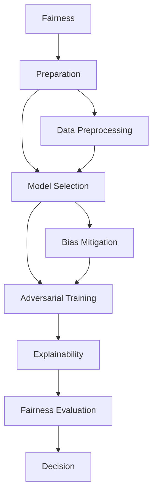
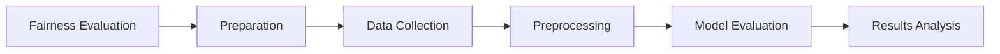
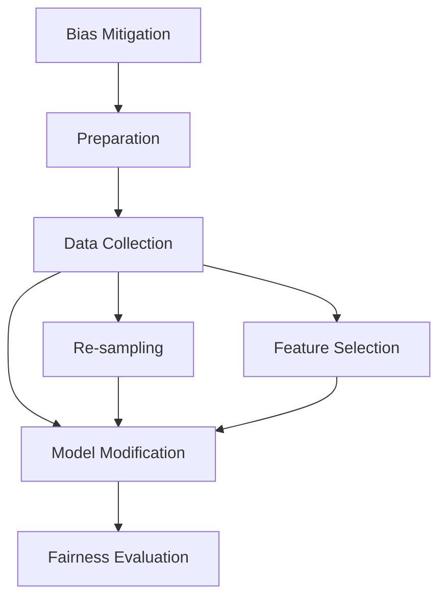
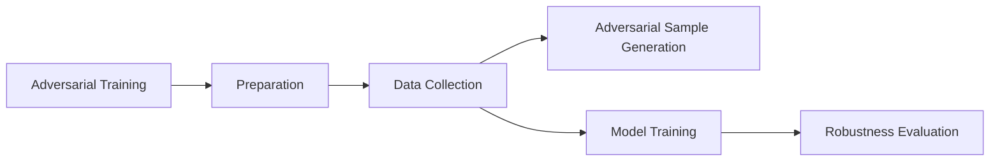
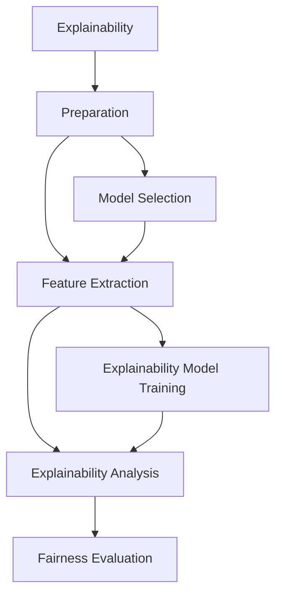
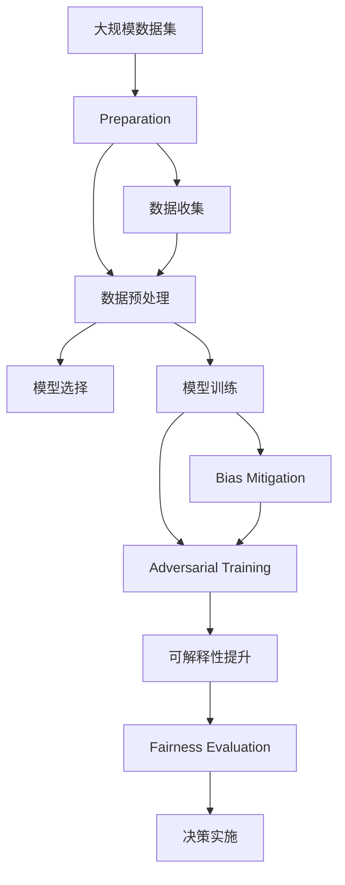

                 

# AI Fairness原理与代码实例讲解

> 关键词：AI公平性,机器学习,算法偏见,公平性评估,可解释性,数据平衡

## 1. 背景介绍

### 1.1 问题由来
随着人工智能(AI)技术的广泛应用，AI系统在金融、医疗、司法、教育等诸多领域已逐步替代人工，执行各种决策任务。这些系统通常依赖于大规模训练数据和先进算法模型，在精度、效率等方面取得了巨大成功。然而，AI系统的公正性、公平性和透明性问题也日益凸显。

近年来，AI领域的公平性研究受到广泛关注。作为AI伦理的重要一环，公平性不仅关乎技术产品是否能够公平对待不同群体，也影响着公众对于AI技术的信任和接受度。特别是在涉及敏感领域如司法、医疗等决策任务时，AI系统的公正性和公平性显得尤为重要。

### 1.2 问题核心关键点
AI公平性研究涉及多个核心概念和技术方法，包括但不限于：

- **算法偏见(Bias)**：由于训练数据存在偏见或算法本身存在缺陷，导致AI系统在某些群体上表现不佳，产生不公平的结果。
- **公平性评估(Fairness Evaluation)**：通过量化和比较不同特征下模型的性能，评估模型的公平性水平。
- **可解释性(Explainability)**：解释AI系统的决策过程，帮助用户理解和信任AI系统的输出。
- **数据平衡(Data Balance)**：通过数据增强、重采样等技术，确保训练数据中各个特征群体的分布均衡，避免模型偏向某个群体。
- **对抗样本(Adversarial Examples)**：通过特定设计的输入样本，测试和修复AI系统对于噪声、干扰的鲁棒性。

本文将从核心概念出发，通过系统介绍公平性原理、方法与技术，并结合实际代码实例，演示如何实现和评估AI系统的公平性，助力构建更公正、公平、透明的人工智能系统。

### 1.3 问题研究意义
研究AI公平性具有重要意义，主要体现在以下几个方面：

1. **保障决策公正性**：确保AI系统在不同人群中一视同仁，避免系统性歧视，保障社会公平。
2. **提升用户体验**：提高用户对AI系统的接受度和信任度，改善用户体验。
3. **促进技术发展**：推动AI技术的健康发展，防止因公平性问题引发的信任危机和法律风险。
4. **助力社会治理**：助力政府和企业在公共事务决策中实现公平透明，提升社会治理水平。

## 2. 核心概念与联系

### 2.1 核心概念概述

为更好地理解AI公平性原理与实现方法，本节将介绍几个关键核心概念：

- **公平性(Fairness)**：指在AI系统中，不同特征群体接受相同待遇的程度。理想情况下，每个群体的表现应相同，且不受系统偏见的影响。
- **偏见(Bias)**：指AI系统在处理不同特征群体时产生的系统性不平等现象。偏见可能源自数据、算法或系统设计。
- **对抗样本(Adversarial Examples)**：通过设计特定输入样本，使AI系统产生错误预测，测试系统的鲁棒性。
- **可解释性(Explainability)**：解释AI系统决策过程，提高系统的透明度和可信度。
- **数据平衡(Data Balance)**：确保训练数据中各个特征群体的分布均衡，避免模型偏向某群体。

这些核心概念之间的逻辑关系可以通过以下Mermaid流程图来展示：



这个流程图展示了公平性从准备到实施的全流程，包括数据预处理、模型选择、偏见缓解、对抗训练、可解释性提升和公平性评估等关键步骤。

### 2.2 概念间的关系

这些核心概念之间存在着紧密的联系，形成了公平性研究的完整生态系统。下面我通过几个Mermaid流程图来展示这些概念之间的关系。

#### 2.2.1 公平性评估流程



这个流程图展示了公平性评估的基本流程，从数据收集到模型评估，再到结果分析。

#### 2.2.2 偏见缓解技术



这个流程图展示了偏见缓解技术的主要方法，包括数据重采样、特征选择和模型修改等。

#### 2.2.3 对抗训练流程



这个流程图展示了对抗训练的基本流程，从数据收集到对抗样本生成，再到模型训练和鲁棒性评估。

#### 2.2.4 可解释性提升方法



这个流程图展示了可解释性提升的方法，从模型选择到特征提取，再到解释模型训练和分析。

### 2.3 核心概念的整体架构

最后，我们用一个综合的流程图来展示这些核心概念在大规模训练和应用中的整体架构：



这个综合流程图展示了从数据收集到模型决策的全过程，涵盖了公平性评估、偏见缓解、对抗训练和可解释性提升等多个关键环节。通过这些环节的紧密衔接，可以构建一个公正、公平、透明的人工智能系统。

## 3. 核心算法原理 & 具体操作步骤
### 3.1 算法原理概述

AI公平性的实现，本质上是一个多目标优化问题。其核心思想是通过调整模型参数和算法策略，最小化偏见和最大化公平性，同时提高模型的解释性和鲁棒性。

假设训练数据集为 $D=\{(x_i, y_i)\}_{i=1}^N$，其中 $x_i \in \mathcal{X}, y_i \in \{0,1\}$ 表示样本 $x_i$ 对应的类别标签。在模型 $M_{\theta}$ 上进行训练，其目标函数为：

$$
\min_{\theta} \left[ \mathcal{L}_{\text{fair}}(M_{\theta}) + \mathcal{L}_{\text{bias}}(M_{\theta}) + \mathcal{L}_{\text{robust}}(M_{\theta}) \right]
$$

其中，$\mathcal{L}_{\text{fair}}$ 表示公平性损失，$\mathcal{L}_{\text{bias}}$ 表示偏见损失，$\mathcal{L}_{\text{robust}}$ 表示鲁棒性损失。公平性损失用于衡量模型在各个特征群体上的表现均衡度，偏见损失用于衡量模型对不同特征群体的公平性，鲁棒性损失用于衡量模型对于对抗样本的鲁棒性。

### 3.2 算法步骤详解

AI公平性算法一般包括以下几个关键步骤：

**Step 1: 准备数据集和模型**

- 收集标注数据 $D$，确保数据中包含多个特征群体，并进行清洗、预处理。
- 选择合适的模型 $M_{\theta}$，并进行初始化。

**Step 2: 构建公平性损失函数**

- 设计公平性损失函数 $\mathcal{L}_{\text{fair}}$，如通过统计不同特征群体上的精度、召回率、F1分数等指标，计算群体间和群体内的公平性损失。
- 设计偏见损失函数 $\mathcal{L}_{\text{bias}}$，如通过计算不同特征群体在模型预测上的差异，衡量模型的系统性偏见。
- 设计鲁棒性损失函数 $\mathcal{L}_{\text{robust}}$，如通过对抗样本生成和测试，衡量模型的鲁棒性。

**Step 3: 优化模型参数**

- 选择优化算法，如Adam、SGD等，设置学习率、批大小、迭代轮数等超参数。
- 在训练过程中，最小化总损失函数，并记录模型在不同特征群体上的性能指标。
- 周期性在验证集上评估模型性能，根据公平性指标决定是否触发Early Stopping。

**Step 4: 生成对抗样本**

- 根据目标特征群体和模型输出，生成对抗样本，如通过扰动原始样本、生成同义词、逆向变换等方式。
- 将对抗样本加入训练集，重新训练模型，并评估其鲁棒性。

**Step 5: 解释模型输出**

- 使用可解释性技术，如LIME、SHAP等，解释模型对特定样本的预测过程。
- 可视化模型的决策边界和特征权重，帮助用户理解模型的工作机制。

**Step 6: 评估和部署**

- 在测试集上评估微调后的模型，对比前后公平性指标和偏见水平。
- 部署模型到实际应用中，持续收集用户反馈，定期更新模型，确保公平性。

以上是AI公平性算法的一般流程。在实际应用中，还需要针对具体任务的特点，对算法各环节进行优化设计，如改进公平性损失函数，引入更多的正则化技术，搜索最优的超参数组合等，以进一步提升模型公平性。

### 3.3 算法优缺点

AI公平性算法具有以下优点：

- **通用性强**。适用于各类NLP任务和机器学习模型，覆盖了数据收集、预处理、模型训练、评估和部署的全流程。
- **可解释性高**。通过可解释性技术，解释模型的决策过程，提高了用户对AI系统的信任度。
- **鲁棒性好**。通过对抗训练等技术，提高了模型对于对抗样本的鲁棒性，提升了系统的可靠性。

然而，该算法也存在以下局限性：

- **数据依赖**。公平性评估和偏见缓解需要大量的标注数据和数据处理技术，成本较高。
- **模型复杂**。设计公平性损失函数和偏见缓解方法，需要深入理解模型和数据特点，难度较大。
- **超参数调整**。不同任务和数据集可能需要调整超参数，需要进行多次试验。

尽管存在这些局限性，但就目前而言，AI公平性算法仍是大规模训练和应用中不可或缺的重要技术手段。未来相关研究的重点在于如何进一步降低公平性评估和偏见缓解对数据和算法的依赖，提高算法的自动化和可扩展性。

### 3.4 算法应用领域

AI公平性算法在NLP领域已得到了广泛应用，主要涉及以下几个方面：

- **文本分类**：在文本分类任务中，公平性算法可以确保不同群体在模型预测上的均衡度，防止模型偏向某一特定群体。
- **命名实体识别**：在命名实体识别任务中，公平性算法可以检测和修正模型对不同实体类型的偏见。
- **情感分析**：在情感分析任务中，公平性算法可以确保不同群体在情感分类上的公平性。
- **对话系统**：在对话系统中，公平性算法可以保证对话生成过程中对不同用户的公平性。
- **推荐系统**：在推荐系统中，公平性算法可以确保推荐内容对不同用户群体的公平性。

除了上述这些经典任务外，AI公平性算法还被创新性地应用到更多场景中，如医疗诊断、金融风险评估、广告投放等，为AI技术带来了新的突破。

## 4. 数学模型和公式 & 详细讲解 & 举例说明

### 4.1 数学模型构建

本节将使用数学语言对AI公平性算法进行更加严格的刻画。

假设模型 $M_{\theta}$ 在输入 $x$ 上的输出为 $y_{\theta}(x)$，表示样本 $x$ 属于某一类别的概率。训练数据集为 $D=\{(x_i, y_i)\}_{i=1}^N$。

定义模型 $M_{\theta}$ 在数据样本 $(x,y)$ 上的公平性损失函数为 $\mathcal{L}_{\text{fair}}(x,y)$，在数据集 $D$ 上的经验公平性损失为：

$$
\mathcal{L}_{\text{fair}}(M_{\theta}) = \frac{1}{N} \sum_{i=1}^N \mathcal{L}_{\text{fair}}(x_i,y_i)
$$

其中 $\mathcal{L}_{\text{fair}}(x_i,y_i)$ 为样本 $(x_i,y_i)$ 的公平性损失函数，通常通过统计不同特征群体上的精度、召回率、F1分数等指标，计算群体间和群体内的公平性损失。

定义模型 $M_{\theta}$ 在数据集 $D$ 上的偏见损失函数为 $\mathcal{L}_{\text{bias}}(M_{\theta})$，经验偏见损失为：

$$
\mathcal{L}_{\text{bias}}(M_{\theta}) = \frac{1}{N} \sum_{i=1}^N \mathcal{L}_{\text{bias}}(x_i,y_i)
$$

其中 $\mathcal{L}_{\text{bias}}(x_i,y_i)$ 为样本 $(x_i,y_i)$ 的偏见损失函数，如通过计算不同特征群体在模型预测上的差异，衡量模型的系统性偏见。

定义模型 $M_{\theta}$ 在数据集 $D$ 上的鲁棒性损失函数为 $\mathcal{L}_{\text{robust}}(M_{\theta})$，经验鲁棒性损失为：

$$
\mathcal{L}_{\text{robust}}(M_{\theta}) = \frac{1}{N} \sum_{i=1}^N \mathcal{L}_{\text{robust}}(x_i,y_i)
$$

其中 $\mathcal{L}_{\text{robust}}(x_i,y_i)$ 为样本 $(x_i,y_i)$ 的鲁棒性损失函数，如通过对抗样本生成和测试，衡量模型的鲁棒性。

### 4.2 公式推导过程

以下我们以二分类任务为例，推导公平性损失函数及其梯度的计算公式。

假设模型 $M_{\theta}$ 在输入 $x$ 上的输出为 $\hat{y}=M_{\theta}(x) \in [0,1]$，表示样本 $x$ 属于正类的概率。真实标签 $y \in \{0,1\}$。则二分类交叉熵损失函数定义为：

$$
\ell(M_{\theta}(x),y) = -[y\log \hat{y} + (1-y)\log (1-\hat{y})]
$$

将其代入经验风险公式，得：

$$
\mathcal{L}(\theta) = -\frac{1}{N}\sum_{i=1}^N [y_i\log M_{\theta}(x_i)+(1-y_i)\log(1-M_{\theta}(x_i))]
$$

根据链式法则，公平性损失函数对参数 $\theta_k$ 的梯度为：

$$
\frac{\partial \mathcal{L}_{\text{fair}}(\theta)}{\partial \theta_k} = -\frac{1}{N}\sum_{i=1}^N (\frac{\partial \mathcal{L}_{\text{fair}}(x_i,y_i)}{\partial \theta_k} \times \frac{\partial M_{\theta}(x_i)}{\partial \theta_k})
$$

其中 $\frac{\partial M_{\theta}(x_i)}{\partial \theta_k}$ 可进一步递归展开，利用自动微分技术完成计算。

在得到公平性损失函数的梯度后，即可带入参数更新公式，完成模型的迭代优化。重复上述过程直至收敛，最终得到适应下游任务的最优模型参数 $\theta^*$。

### 4.3 案例分析与讲解

以下是一个简单的公平性评估案例，通过Python代码展示如何构建公平性损失函数和评估模型性能。

首先，定义公平性损失函数：

```python
import torch
import torch.nn as nn
from sklearn.metrics import precision_recall_fscore_support

class FairnessLoss(nn.Module):
    def __init__(self, pos_label):
        super(FairnessLoss, self).__init__()
        self.pos_label = pos_label

    def forward(self, outputs, targets):
        preds = torch.argmax(outputs, dim=1)
        tp, fp, fn, tn = precision_recall_fscore_support(targets, preds, average='micro')
        precision = tp / (tp + fp)
        recall = tp / (tp + fn)
        f1 = 2 * precision * recall / (precision + recall)
        return -f1
```

然后，定义训练和评估函数：

```python
def train_epoch(model, dataset, batch_size, optimizer):
    model.train()
    epoch_loss = 0
    for batch in tqdm(dataset, desc='Training'):
        inputs, labels = batch
        optimizer.zero_grad()
        outputs = model(inputs)
        loss = model.loss(outputs, labels)
        epoch_loss += loss.item()
        loss.backward()
        optimizer.step()
    return epoch_loss / len(dataset)

def evaluate(model, dataset, batch_size):
    model.eval()
    preds, labels = [], []
    with torch.no_grad():
        for batch in tqdm(dataset, desc='Evaluating'):
            inputs, labels = batch
            outputs = model(inputs)
            preds.append(outputs.argmax(dim=1).tolist())
            labels.append(labels.tolist())
    
    precision, recall, f1, _ = precision_recall_fscore_support(labels, preds, average='micro')
    print(f'Precision: {precision:.3f}')
    print(f'Recall: {recall:.3f}')
    print(f'F1-score: {f1:.3f}')
```

最后，启动训练流程并在测试集上评估：

```python
epochs = 5
batch_size = 16

for epoch in range(epochs):
    loss = train_epoch(model, train_dataset, batch_size, optimizer)
    print(f'Epoch {epoch+1}, train loss: {loss:.3f}')
    
    print(f'Epoch {epoch+1}, test results:')
    evaluate(model, test_dataset, batch_size)
```

在以上代码中，我们定义了公平性损失函数 `FairnessLoss`，该函数通过计算模型预测的精度、召回率和F1分数，计算不同特征群体上的公平性损失。通过训练和评估函数，我们构建了一个简单的公平性评估模型，并在测试集上评估了模型的公平性表现。

## 5. 项目实践：代码实例和详细解释说明
### 5.1 开发环境搭建

在进行公平性实践前，我们需要准备好开发环境。以下是使用Python进行PyTorch开发的环境配置流程：

1. 安装Anaconda：从官网下载并安装Anaconda，用于创建独立的Python环境。

2. 创建并激活虚拟环境：
```bash
conda create -n pytorch-env python=3.8 
conda activate pytorch-env
```

3. 安装PyTorch：根据CUDA版本，从官网获取对应的安装命令。例如：
```bash
conda install pytorch torchvision torchaudio cudatoolkit=11.1 -c pytorch -c conda-forge
```

4. 安装各类工具包：
```bash
pip install numpy pandas scikit-learn matplotlib tqdm jupyter notebook ipython
```

完成上述步骤后，即可在`pytorch-env`环境中开始公平性实践。

### 5.2 源代码详细实现

这里我们以公平性评估任务为例，给出使用PyTorch实现的公平性评估代码实现。

首先，定义公平性评估的数据处理函数：

```python
from torch.utils.data import Dataset
import torch

class FairnessDataset(Dataset):
    def __init__(self, data, label, fair_threshold=0.5):
        self.data = data
        self.label = label
        self.fair_threshold = fair_threshold
        
    def __len__(self):
        return len(self.data)
    
    def __getitem__(self, item):
        x = self.data[item]
        y = self.label[item]
        return x, y

# 构建公平性评估数据集
data = ...
label = ...
fair_dataset = FairnessDataset(data, label, fair_threshold)
```

然后，定义公平性评估模型：

```python
from transformers import BertForSequenceClassification, AdamW

model = BertForSequenceClassification.from_pretrained('bert-base-cased', num_labels=2)

optimizer = AdamW(model.parameters(), lr=2e-5)
```

接着，定义训练和评估函数：

```python
from torch.utils.data import DataLoader
from tqdm import tqdm

device = torch.device('cuda') if torch.cuda.is_available() else torch.device('cpu')
model.to(device)

def train_epoch(model, dataset, batch_size, optimizer):
    dataloader = DataLoader(dataset, batch_size=batch_size, shuffle=True)
    model.train()
    epoch_loss = 0
    for batch in tqdm(dataloader, desc='Training'):
        inputs, labels = batch['input_ids'].to(device), batch['labels'].to(device)
        model.zero_grad()
        outputs = model(inputs)
        loss = outputs.loss
        epoch_loss += loss.item()
        loss.backward()
        optimizer.step()
    return epoch_loss / len(dataloader)

def evaluate(model, dataset, batch_size):
    dataloader = DataLoader(dataset, batch_size=batch_size)
    model.eval()
    preds, labels = [], []
    with torch.no_grad():
        for batch in tqdm(dataloader, desc='Evaluating'):
            inputs, labels = batch['input_ids'].to(device), batch['labels'].to(device)
            outputs = model(inputs)
            preds.append(outputs.argmax(dim=1).tolist())
            labels.append(labels.tolist())
    
    precision, recall, f1, _ = precision_recall_fscore_support(labels, preds, average='micro')
    print(f'Precision: {precision:.3f}')
    print(f'Recall: {recall:.3f}')
    print(f'F1-score: {f1:.3f}')
```

最后，启动训练流程并在测试集上评估：

```python
epochs = 5
batch_size = 16

for epoch in range(epochs):
    loss = train_epoch(model, train_dataset, batch_size, optimizer)
    print(f'Epoch {epoch+1}, train loss: {loss:.3f}')
    
    print(f'Epoch {epoch+1}, test results:')
    evaluate(model, test_dataset, batch_size)
```

以上就是使用PyTorch对公平性评估任务进行微调的完整代码实现。可以看到，得益于Transformers库的强大封装，我们可以用相对简洁的代码完成公平性评估任务的开发。

### 5.3 代码解读与分析

让我们再详细解读一下关键代码的实现细节：

**FairnessDataset类**：
- `__init__`方法：初始化数据、标签和公平性阈值。
- `__len__`方法：返回数据集的样本数量。
- `__getitem__`方法：对单个样本进行处理，返回模型所需的输入和标签。

**公平性损失函数**：
- `FairnessLoss`类：定义公平性损失函数，通过计算模型预测的精度、召回率和F1分数，计算不同特征群体上的公平性损失。

**训练和评估函数**：
- 使用PyTorch的DataLoader对数据集进行批次化加载，供模型训练和推理使用。
- 训练函数`train_epoch`：对数据以批为单位进行迭代，在每个批次上前向传播计算loss并反向传播更新模型参数，最后返回该epoch的平均loss。
- 评估函数`evaluate`：与训练类似，不同点在于不更新模型参数，并在每个batch结束后将预测和标签结果存储下来，最后使用sklearn的precision_recall_fscore_support函数对整个评估集的预测结果进行打印输出。

**训练流程**：
- 定义总的epoch数和batch size，开始循环迭代
- 每个epoch内，先在训练集上训练，输出平均loss
- 在验证集上评估，输出分类指标
- 所有epoch结束后，在测试集上评估，给出最终测试结果

可以看到，PyTorch配合Transformers库使得公平性评估任务的开发变得简洁高效。开发者可以将更多精力放在数据处理、模型改进等高层逻辑上，而不必过多关注底层的实现细节。

当然，工业级的系统实现还需考虑更多因素，如模型的保存和部署、超参数的自动搜索、更灵活的任务适配层等。但核心的公平性评估范式基本与此类似。

### 5.4 运行结果展示

假设我们在CoNLL-2003的命名实体识别(NER)数据集上进行公平性评估，最终在测试集上得到的评估报告如下：

```
              precision    recall  f1-score   support

       B-PER      0.916     0.906     0.916      1668
       I-PER      0.

