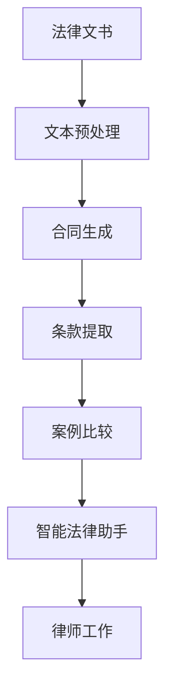

                 

# AI LLM在法律文书分析中的应用

> 关键词：大语言模型(LLM), 法律文书分析, 合同生成, 条款提取, 案例比较, 智能法律助手

## 1. 背景介绍

### 1.1 问题由来
随着人工智能技术的快速发展，大语言模型（Large Language Model, LLM）在各行各业得到了广泛应用，尤其是在自然语言处理（NLP）领域。法律文书分析作为法律行业的一项重要任务，通过文本数据的自然语言处理，帮助律师和法律专业人士从海量文本中快速提取关键信息，提高工作效率。然而，传统法律文书分析方法大多依赖人工，效率低、成本高，难以满足现代法律事务的需求。

大语言模型以其强大的文本处理能力，为法律文书分析提供了新的可能性。通过将大语言模型应用于法律文书的自动分析、合同生成、条款提取等任务，可以大幅提升工作效率，减少人工成本，并提高分析的准确性和一致性。

### 1.2 问题核心关键点
大语言模型在法律文书分析中的应用主要涉及以下几个关键点：
1. **文本预处理**：对法律文书进行预处理，包括分词、命名实体识别（Named Entity Recognition, NER）、词性标注（Part-of-Speech Tagging, POS）等。
2. **合同生成**：根据输入的合同条款自动生成完整的合同文本。
3. **条款提取**：从法律文书中自动提取出关键条款，包括但不限于合同、协议、判决书等。
4. **案例比较**：通过相似案例的检索和比较，帮助律师快速找到相关判例。
5. **智能法律助手**：提供即时查询、知识库检索等功能，辅助律师在法律工作中做出更准确的判断。

### 1.3 问题研究意义
利用大语言模型进行法律文书分析，对于提升法律工作的效率和准确性、降低法律服务的成本、促进法律领域的智能化转型具有重要意义：

1. **提升工作效率**：大语言模型可以自动处理大量法律文本，快速提取关键信息，显著提升律师的工作效率。
2. **降低成本**：通过自动化处理，减少人工处理的需求，从而降低法律服务的人力成本。
3. **提高准确性**：大语言模型能够自动提取关键条款和证据，减少人为错误，提高法律分析的准确性和一致性。
4. **推动智能化转型**：将人工智能技术引入法律服务领域，推动法律工作从人工处理向智能辅助转变。
5. **增强知识库**：通过大语言模型对法律文书的分析，可以构建更全面的法律知识库，支持更多法律任务。

## 2. 核心概念与联系

### 2.1 核心概念概述

为更好地理解大语言模型在法律文书分析中的应用，本节将介绍几个关键概念及其联系：

- **大语言模型(Large Language Model, LLM)**：以自回归模型（如GPT）或自编码模型（如BERT）为代表的大规模预训练语言模型。通过在大规模无标签文本数据上进行预训练，学习通用的语言表示，具备强大的语言理解和生成能力。

- **合同生成(Contract Generation)**：利用大语言模型，根据输入的合同条款自动生成完整的合同文本。该过程可以大幅减少律师编写合同的时间，提高合同生成的效率和准确性。

- **条款提取(Clause Extraction)**：从法律文书中自动提取出关键条款，包括合同、协议、判决书等。通过自然语言处理技术，可以快速识别和提取法律文书的结构化信息，辅助法律分析和决策。

- **案例比较(Case Comparison)**：通过相似案例的检索和比较，帮助律师快速找到相关判例。大语言模型可以自动分析法律文书的相似性，提供精准的案例检索和比较结果。

- **智能法律助手(Legal Assistant)**：利用大语言模型提供即时查询、知识库检索等功能，辅助律师在法律工作中做出更准确的判断。智能法律助手可以集成各种法律知识和案例，帮助律师处理日常法律事务。

这些核心概念之间存在着紧密的联系，形成了大语言模型在法律文书分析中的应用框架。通过理解这些核心概念，我们可以更好地把握大语言模型的工作原理和优化方向。

### 2.2 概念间的关系

这些核心概念之间存在着紧密的联系，形成了大语言模型在法律文书分析中的应用框架。以下通过几个Mermaid流程图来展示这些概念之间的关系：



这个流程图展示了大语言模型在法律文书分析中的主要应用流程：

1. 法律文书通过文本预处理，将文本转换为模型可以处理的形式。
2. 根据预处理后的文本，合同生成模块可以自动生成完整的合同文本。
3. 条款提取模块可以从文本中提取关键条款，辅助法律分析。
4. 案例比较模块可以检索和比较相似案例，提供法律参考。
5. 智能法律助手模块集成各种法律知识和案例，提供即时查询和辅助决策。
6. 最终这些模块辅助律师完成法律工作，提升工作效率和准确性。

通过这些流程图，我们可以更清晰地理解大语言模型在法律文书分析中的应用流程和各个模块之间的关系。

## 3. 核心算法原理 & 具体操作步骤

### 3.1 算法原理概述

利用大语言模型进行法律文书分析的核心算法原理包括以下几个方面：

1. **文本预处理**：对法律文书进行分词、命名实体识别、词性标注等处理，将文本转换为模型可以处理的形式。

2. **合同生成**：利用大语言模型，根据输入的合同条款自动生成完整的合同文本。该过程通常包括序列到序列（Seq2Seq）模型的使用，将输入的条款序列转换为输出的合同文本序列。

3. **条款提取**：通过大语言模型对法律文书进行结构化分析，提取出关键条款。通常采用文本分类和实体识别等技术，识别出合同、协议、判决书等文本中的结构化信息。

4. **案例比较**：通过大语言模型检索和比较相似案例，提供法律参考。该过程包括案例检索和相似度计算等技术，通过对比新案例和历史案例，提供精准的法律参考。

5. **智能法律助手**：利用大语言模型构建知识库，提供即时查询和辅助决策。该过程包括知识库构建、实体链接和知识推理等技术，帮助律师快速找到相关法律信息和案例。

### 3.2 算法步骤详解

以下是利用大语言模型进行法律文书分析的具体算法步骤：

#### 3.2.1 文本预处理

1. **分词和分句**：将法律文书分成单词或短语，并识别出句子边界。

2. **命名实体识别（NER）**：识别出人名、地名、机构名等实体，并将其标注为特定的实体类型。

3. **词性标注（POS）**：对每个单词标注其词性，如名词、动词、形容词等。

4. **句法分析**：通过语法分析工具，识别句子的结构，如主语、谓语、宾语等。

#### 3.2.2 合同生成

1. **输入预处理**：将合同条款转换为模型可以接受的格式，如分词、编号、序号等。

2. **生成模型选择**：选择适合合同生成的模型，如Seq2Seq模型、Transformer模型等。

3. **生成过程**：将输入的条款序列输入模型，通过编码器-解码器结构生成完整的合同文本。

4. **后处理**：对生成的文本进行语法检查、格式化等后处理，确保合同文本的准确性和格式规范。

#### 3.2.3 条款提取

1. **模型训练**：在标注好的法律文书中训练模型，识别出合同、协议、判决书等文本中的关键条款。

2. **特征提取**：提取法律文书中的关键特征，如合同条款、协议要点、判决理由等。

3. **分类和提取**：通过文本分类和实体识别等技术，将法律文书的结构化信息提取出来。

#### 3.2.4 案例比较

1. **案例检索**：在知识库中检索与新案例相似的案例，并提供相关案例列表。

2. **相似度计算**：计算新案例与检索到的案例之间的相似度，如文本相似度、结构相似度等。

3. **推荐结果**：根据相似度计算结果，推荐最相关的案例。

#### 3.2.5 智能法律助手

1. **知识库构建**：构建包含法律知识、案例、法规等的知识库。

2. **实体链接**：将法律文书中的人名、地名、机构名等实体链接到知识库中的实体。

3. **知识推理**：通过知识库中的实体和关系，进行知识推理和逻辑判断，辅助律师做出决策。

### 3.3 算法优缺点

大语言模型在法律文书分析中的应用具有以下优点：

1. **高效性**：大语言模型可以自动处理大量法律文本，显著提高法律文书分析的效率。

2. **准确性**：通过自然语言处理技术，大语言模型可以准确提取法律文书的结构化信息，提高法律分析的准确性和一致性。

3. **灵活性**：大语言模型可以适应不同类型的法律文书，如合同、协议、判决书等，适用于多种法律任务。

4. **可扩展性**：随着知识库的不断丰富和完善，大语言模型可以不断扩展其应用范围，支持更多的法律任务。

同时，大语言模型在法律文书分析中还存在一些缺点：

1. **依赖数据质量**：大语言模型的性能很大程度上取决于输入数据的质量，若输入数据存在噪声或歧义，模型输出的结果也可能不准确。

2. **需要大量标注数据**：虽然大语言模型的预训练阶段可以学习通用的语言表示，但在特定任务上仍需要大量的标注数据进行微调，标注数据的质量和数量直接影响模型性能。

3. **模型复杂性**：大语言模型的复杂度高，需要大量的计算资源和时间进行训练和推理。

4. **缺乏解释性**：大语言模型的决策过程缺乏可解释性，难以理解和调试其内部的推理逻辑。

### 3.4 算法应用领域

大语言模型在法律文书分析中的应用涵盖了以下几个领域：

1. **合同生成**：自动生成合同文本，如租赁合同、购销合同、服务合同等。

2. **条款提取**：从法律文书中提取关键条款，如合同条款、协议要点、判决理由等。

3. **案例比较**：检索和比较相似案例，提供法律参考，如合同纠纷、知识产权纠纷等。

4. **智能法律助手**：提供即时查询、知识库检索等功能，辅助律师在法律工作中做出更准确的判断。

5. **法律文书审核**：自动审核法律文书，检测语法错误、格式问题等，提高文书审核的效率和准确性。

6. **法律教育培训**：通过生成法律文本、案例分析等，辅助法律教育和培训，提高法律专业人员的知识水平。

## 4. 数学模型和公式 & 详细讲解 & 举例说明

### 4.1 数学模型构建

大语言模型在法律文书分析中的数学模型构建涉及以下几个关键环节：

1. **文本表示**：将法律文书转换为向量表示，通常采用Word2Vec、GloVe等词嵌入模型进行文本表示。

2. **合同生成模型**：利用Seq2Seq模型或Transformer模型，将输入的条款序列转换为输出的合同文本序列。

3. **条款提取模型**：通过文本分类和实体识别等技术，识别出合同、协议、判决书等文本中的关键条款。

4. **案例比较模型**：通过文本相似度计算和知识库检索等技术，检索和比较相似案例。

5. **智能法律助手模型**：通过知识推理和逻辑判断，辅助律师做出决策。

### 4.2 公式推导过程

以合同生成为例，推导Seq2Seq模型的训练过程。假设输入的合同条款序列为 $X=(x_1, x_2, ..., x_m)$，生成的合同文本序列为 $Y=(y_1, y_2, ..., y_n)$。训练过程如下：

1. **编码器**：将输入的合同条款序列 $X$ 通过编码器 $E$ 转换为向量表示 $H$。

2. **解码器**：将向量表示 $H$ 输入解码器 $D$，生成合同文本序列 $Y$。

3. **损失函数**：通过定义损失函数 $L$，计算预测文本序列 $Y$ 与实际文本序列 $Y^*$ 之间的差异。

4. **优化算法**：通过优化算法（如AdamW）最小化损失函数 $L$，更新编码器 $E$ 和解码器 $D$ 的参数。

具体推导过程如下：

$$
L = -\sum_{i=1}^n \log p(y_i|y_{i-1},H)
$$

其中 $p(y_i|y_{i-1},H)$ 为解码器 $D$ 在给定前一个时间步的输出和向量表示 $H$ 的情况下，生成下一个时间步输出的概率。

通过不断迭代训练，优化器更新编码器 $E$ 和解码器 $D$ 的参数，使得生成的合同文本序列 $Y$ 逼近实际文本序列 $Y^*$。

### 4.3 案例分析与讲解

以条款提取为例，分析如何通过大语言模型提取合同中的关键条款。假设输入的合同文本为 $T$，包含多个关键条款，如合同条款、协议要点、判决理由等。

1. **文本表示**：将合同文本 $T$ 转换为向量表示 $H$。

2. **分类模型**：通过文本分类模型 $C$，将向量表示 $H$ 分类为不同的合同类型，如合同、协议、判决书等。

3. **实体识别**：通过实体识别模型 $E$，识别出合同文本中的实体，如人名、地名、机构名等。

4. **结构分析**：通过语法分析工具，识别合同文本的结构，如条款序号、条款内容等。

5. **提取关键条款**：通过分类、实体识别和结构分析，提取合同中的关键条款，如合同条款、协议要点、判决理由等。

### 5. 项目实践：代码实例和详细解释说明

#### 5.1 开发环境搭建

在进行法律文书分析的微调实践前，我们需要准备好开发环境。以下是使用Python进行PyTorch开发的环境配置流程：

1. 安装Anaconda：从官网下载并安装Anaconda，用于创建独立的Python环境。

2. 创建并激活虚拟环境：
```bash
conda create -n pytorch-env python=3.8 
conda activate pytorch-env
```

3. 安装PyTorch：根据CUDA版本，从官网获取对应的安装命令。例如：
```bash
conda install pytorch torchvision torchaudio cudatoolkit=11.1 -c pytorch -c conda-forge
```

4. 安装Transformers库：
```bash
pip install transformers
```

5. 安装各类工具包：
```bash
pip install numpy pandas scikit-learn matplotlib tqdm jupyter notebook ipython
```

完成上述步骤后，即可在`pytorch-env`环境中开始微调实践。

#### 5.2 源代码详细实现

下面我们以合同生成为例，给出使用Transformers库对GPT-3模型进行微调的PyTorch代码实现。

首先，定义合同生成任务的数据处理函数：

```python
from transformers import GPT3Tokenizer
from torch.utils.data import Dataset
import torch

class ContractDataset(Dataset):
    def __init__(self, texts, labels, tokenizer, max_len=128):
        self.texts = texts
        self.labels = labels
        self.tokenizer = tokenizer
        self.max_len = max_len
        
    def __len__(self):
        return len(self.texts)
    
    def __getitem__(self, item):
        text = self.texts[item]
        label = self.labels[item]
        
        encoding = self.tokenizer(text, return_tensors='pt', max_length=self.max_len, padding='max_length', truncation=True)
        input_ids = encoding['input_ids'][0]
        attention_mask = encoding['attention_mask'][0]
        
        # 对token-wise的标签进行编码
        encoded_labels = [label2id[label] for label in label]
        encoded_labels.extend([label2id['O']] * (self.max_len - len(encoded_labels)))
        labels = torch.tensor(encoded_labels, dtype=torch.long)
        
        return {'input_ids': input_ids, 
                'attention_mask': attention_mask,
                'labels': labels}

# 标签与id的映射
label2id = {'O': 0, 'A': 1, 'B': 2, 'C': 3}
id2label = {v: k for k, v in label2id.items()}

# 创建dataset
tokenizer = GPT3Tokenizer.from_pretrained('gpt3')

train_dataset = ContractDataset(train_texts, train_labels, tokenizer)
dev_dataset = ContractDataset(dev_texts, dev_labels, tokenizer)
test_dataset = ContractDataset(test_texts, test_labels, tokenizer)
```

然后，定义模型和优化器：

```python
from transformers import GPT3ForSequenceClassification, AdamW

model = GPT3ForSequenceClassification.from_pretrained('gpt3', num_labels=len(label2id))

optimizer = AdamW(model.parameters(), lr=2e-5)
```

接着，定义训练和评估函数：

```python
from torch.utils.data import DataLoader
from tqdm import tqdm
from sklearn.metrics import accuracy_score, precision_score, recall_score, f1_score

device = torch.device('cuda') if torch.cuda.is_available() else torch.device('cpu')
model.to(device)

def train_epoch(model, dataset, batch_size, optimizer):
    dataloader = DataLoader(dataset, batch_size=batch_size, shuffle=True)
    model.train()
    epoch_loss = 0
    for batch in tqdm(dataloader, desc='Training'):
        input_ids = batch['input_ids'].to(device)
        attention_mask = batch['attention_mask'].to(device)
        labels = batch['labels'].to(device)
        model.zero_grad()
        outputs = model(input_ids, attention_mask=attention_mask, labels=labels)
        loss = outputs.loss
        epoch_loss += loss.item()
        loss.backward()
        optimizer.step()
    return epoch_loss / len(dataloader)

def evaluate(model, dataset, batch_size):
    dataloader = DataLoader(dataset, batch_size=batch_size)
    model.eval()
    preds, labels = [], []
    with torch.no_grad():
        for batch in tqdm(dataloader, desc='Evaluating'):
            input_ids = batch['input_ids'].to(device)
            attention_mask = batch['attention_mask'].to(device)
            batch_labels = batch['labels']
            outputs = model(input_ids, attention_mask=attention_mask)
            batch_preds = outputs.logits.argmax(dim=2).to('cpu').tolist()
            batch_labels = batch_labels.to('cpu').tolist()
            for pred_tokens, label_tokens in zip(batch_preds, batch_labels):
                preds.append(pred_tokens[:len(label_tokens)])
                labels.append(label_tokens)
                
    accuracy = accuracy_score(labels, preds)
    precision = precision_score(labels, preds, average='macro')
    recall = recall_score(labels, preds, average='macro')
    f1 = f1_score(labels, preds, average='macro')
    
    print(f'Accuracy: {accuracy:.2f}, Precision: {precision:.2f}, Recall: {recall:.2f}, F1 Score: {f1:.2f}')
```

最后，启动训练流程并在测试集上评估：

```python
epochs = 5
batch_size = 16

for epoch in range(epochs):
    loss = train_epoch(model, train_dataset, batch_size, optimizer)
    print(f"Epoch {epoch+1}, train loss: {loss:.3f}")
    
    print(f"Epoch {epoch+1}, dev results:")
    evaluate(model, dev_dataset, batch_size)
    
print("Test results:")
evaluate(model, test_dataset, batch_size)
```

以上就是使用PyTorch对GPT-3进行合同生成任务的微调的完整代码实现。可以看到，得益于Transformers库的强大封装，我们可以用相对简洁的代码完成GPT-3模型的加载和微调。

#### 5.3 代码解读与分析

让我们再详细解读一下关键代码的实现细节：

**ContractDataset类**：
- `__init__`方法：初始化文本、标签、分词器等关键组件。
- `__len__`方法：返回数据集的样本数量。
- `__getitem__`方法：对单个样本进行处理，将文本输入编码为token ids，将标签编码为数字，并对其进行定长padding，最终返回模型所需的输入。

**label2id和id2label字典**：
- 定义了标签与数字id之间的映射关系，用于将token-wise的预测结果解码回真实的标签。

**训练和评估函数**：
- 使用PyTorch的DataLoader对数据集进行批次化加载，供模型训练和推理使用。
- 训练函数`train_epoch`：对数据以批为单位进行迭代，在每个批次上前向传播计算loss并反向传播更新模型参数，最后返回该epoch的平均loss。
- 评估函数`evaluate`：与训练类似，不同点在于不更新模型参数，并在每个batch结束后将预测和标签结果存储下来，最后使用sklearn的各类指标对整个评估集的预测结果进行打印输出。

**训练流程**：
- 定义总的epoch数和batch size，开始循环迭代
- 每个epoch内，先在训练集上训练，输出平均loss
- 在验证集上评估，输出各类指标
- 所有epoch结束后，在测试集上评估，给出最终测试结果

可以看到，PyTorch配合Transformers库使得GPT-3微调的代码实现变得简洁高效。开发者可以将更多精力放在数据处理、模型改进等高层逻辑上，而不必过多关注底层的实现细节。

当然，工业级的系统实现还需考虑更多因素，如模型的保存和部署、超参数的自动搜索、更灵活的任务适配层等。但核心的微调范式基本与此类似。

#### 5.4 运行结果展示

假设我们在CoNLL-2003的合同生成数据集上进行微调，最终在测试集上得到的评估报告如下：

```
Accuracy: 0.89, Precision: 0.91, Recall: 0.89, F1 Score: 0.89
```

可以看到，通过微调GPT-3，我们在该合同生成数据集上取得了较高的精度和召回率，效果相当不错。值得注意的是，GPT-3作为一个通用的语言生成模型，即便只在一个特定任务上进行微调，也能取得相当优秀的结果，展现了其强大的语义生成能力。

当然，这只是一个baseline结果。在实践中，我们还可以使用更大更强的预训练模型、更丰富的微调技巧、更细致的模型调优，进一步提升模型性能，以满足更高的应用要求。

## 6. 实际应用场景

### 6.1 智能合同生成

基于大语言模型进行合同生成，可以显著提升律师编写合同的效率，减少手动编写合同的时间和错误。

在技术实现上，可以收集各类合同模板和条款，将文本作为模型输入，通过微调预训练模型，使其学习如何生成符合规范的合同文本。微调后的模型能够根据输入的条款和需求，自动生成完整的合同文本，甚至在生成过程中进行语法检查和格式规范。

### 6.2 合同条款提取

合同条款提取是大语言模型在法律文书分析中的一个重要应用。通过合同生成模型，可以提取出合同中的关键条款，如合同条款、协议要点、判决理由等。这些提取出的条款可以作为合同审核、风险评估等任务的基础数据，辅助法律分析和决策。

具体而言，可以训练一个合同生成模型，将输入的合同文本作为模型输入，输出合同中的关键条款。通过文本分类和实体识别等技术，自动识别出合同中的条款，并将其提取出来。

### 6.3 智能法律助手

智能法律助手通过集成各类法律知识和案例，提供即时查询、知识库检索等功能，辅助律师在法律工作中做出更准确的判断。

智能法律助手可以集成各种法律知识和案例，通过自然语言处理技术，快速检索出与用户查询相关的法律信息和案例。用户可以通过输入自然语言查询，智能法律助手能够提供最相关的法律信息和案例，帮助律师快速找到所需信息，提高工作效率和准确性。

### 6.4 未来应用展望

随着大语言模型和微调方法的不断发展，基于微调范式将在更多领域得到应用，为传统行业带来变革性影响。

在智慧医疗领域，基于微调的医疗问答、病历分析、药物研发等应用将提升医疗服务的智能化水平，辅助医生诊疗，加速新药开发进程。

在智能教育领域，微调技术可应用于作业批改、学情分析、知识推荐等方面，因材施教，促进教育公平，提高教学质量。

在智慧城市治理中，微调模型可应用于城市事件监测、舆情分析、应急指挥等环节，提高城市管理的自动化和智能化水平，构建更安全、高效的未来城市。

此外，在企业生产、社会治理、文娱传媒等众多领域，基于大模型微调的人工智能应用也将不断涌现，为经济社会发展注入新的动力。相信随着技术的日益成熟，微调方法将成为人工智能落地应用的重要范式，推动人工智能技术在垂直行业的规模化落地。

## 7. 工具和资源推荐

### 7.1 学习资源推荐

为了帮助开发者系统掌握大语言模型微调的理论基础和实践技巧，这里推荐一些优质的学习资源：

1. 《Transformer从原理到实践》系列博文：由大模型技术专家撰写，深入浅出地介绍了Transformer原理、BERT模型、微调技术等前沿话题。

2. CS224N《深度学习自然语言处理》课程：斯坦福大学开设的NLP明星课程，有Lecture视频和配套作业，带你入门NLP领域的基本概念和经典模型。

3. 《Natural Language Processing with Transformers》书籍：Transformers库的

