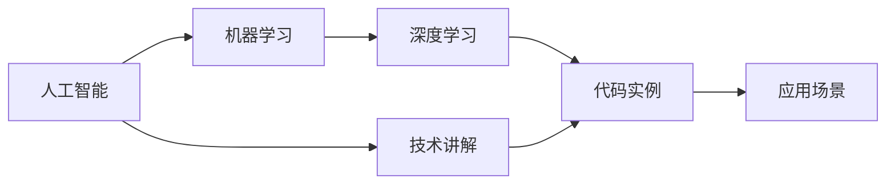
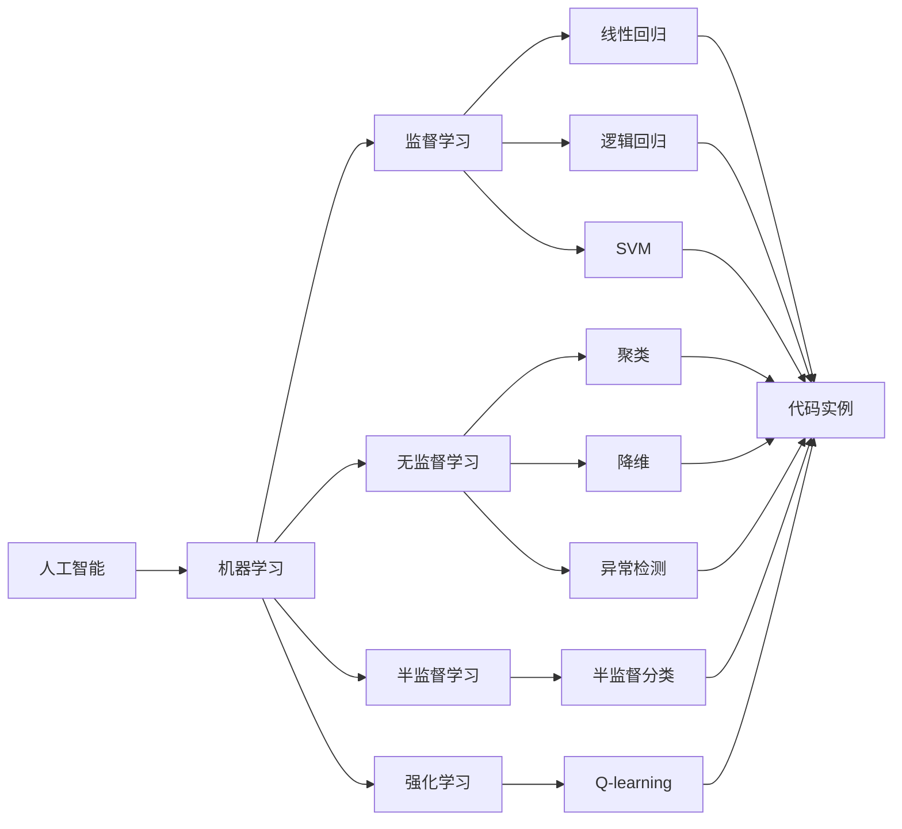

                 

# AI 原理与代码实例讲解

> 关键词：
```diff
- 人工智能 (Artificial Intelligence, AI)
- 机器学习 (Machine Learning, ML)
- 深度学习 (Deep Learning, DL)
- 代码实例 (Code Examples)
- 技术讲解 (Technical Explanations)
```

## 1. 背景介绍

人工智能（AI）是现代科技发展的结晶，它结合了计算机科学、统计学、心理学、神经科学等多个学科的理论和方法，致力于构建能够模拟人类智能行为的系统。机器学习（ML）和深度学习（DL）作为AI的重要分支，凭借其强大的算法和模型能力，已经在图像识别、自然语言处理、语音识别、推荐系统等领域取得了突破性进展。

本文旨在通过深入浅出的讲解，结合代码实例，帮助读者系统理解AI、ML和DL的基本原理和核心技术。我们将从背景、概念、算法、应用等多个角度，详细探讨这些前沿技术的原理与实践，以期为技术爱好者提供权威的参考和指导。

## 2. 核心概念与联系

### 2.1 核心概念概述

- **人工智能**：旨在模拟人类智能行为，包括学习、推理、感知和决策等能力的系统。
- **机器学习**：通过数据和算法，让计算机从经验中学习，并做出决策或预测。
- **深度学习**：一种特殊的机器学习，通过构建多层神经网络模型，进行复杂的特征提取和模式识别。
- **代码实例**：通过具体实现，解释和验证AI、ML和DL算法的原理和效果。
- **技术讲解**：对AI、ML和DL的基本概念、算法和模型进行详细解析和讨论。

### 2.2 核心概念间的关系

以下是核心概念间的关系图：



该图展示了AI、ML、DL、代码实例和技术讲解之间的关系。其中，AI涵盖了机器学习和深度学习，技术讲解通过代码实例具体化，应用场景则展示了这些技术的实际应用。

### 2.3 核心概念的整体架构

进一步细化这个架构，我们可以得到更详细的层次结构：



## 3. 核心算法原理 & 具体操作步骤

### 3.1 算法原理概述

AI、ML和DL的核心算法包括监督学习、无监督学习、半监督学习和强化学习等。这些算法通过不同的数据和任务设计，旨在使计算机系统能够从经验中学习和改进。

- **监督学习**：使用标注数据训练模型，使其能够根据输入预测输出。如线性回归、逻辑回归、支持向量机（SVM）等。
- **无监督学习**：不使用标注数据，通过数据的内在结构进行学习。如聚类、降维、异常检测等。
- **半监督学习**：结合少量标注数据和大量未标注数据进行训练，提高模型的泛化能力。
- **强化学习**：通过奖励机制，训练智能体在特定环境中做出最优决策。如Q-learning、策略梯度等。

### 3.2 算法步骤详解

以监督学习为例，其基本步骤包括数据准备、模型选择、训练和测试：

1. **数据准备**：收集和预处理数据，包括数据清洗、归一化、分割训练集和测试集等。
2. **模型选择**：选择合适的机器学习模型或深度学习架构。
3. **训练**：使用训练集数据，通过梯度下降等优化算法，调整模型参数。
4. **测试**：使用测试集数据评估模型性能，进行交叉验证和参数调优。

以深度学习中的卷积神经网络（CNN）为例，具体步骤包括：

1. **网络设计**：选择适当的卷积层、池化层、全连接层等组成网络结构。
2. **参数初始化**：随机初始化网络中的权重和偏置。
3. **前向传播**：将输入数据通过网络，计算出每个神经元的输出。
4. **损失计算**：使用损失函数计算预测结果与实际结果的误差。
5. **反向传播**：计算梯度，更新网络参数。
6. **迭代训练**：重复前向传播和反向传播，直到收敛或达到预设轮数。

### 3.3 算法优缺点

**监督学习**：
- **优点**：依赖标注数据较少，可以处理大规模复杂数据。
- **缺点**：对标注数据质量依赖高，容易过拟合。

**无监督学习**：
- **优点**：不需要标注数据，适用范围广。
- **缺点**：缺乏目标指导，效果受数据结构影响。

**半监督学习**：
- **优点**：利用少量标注数据和大量未标注数据，提高模型泛化能力。
- **缺点**：标注数据获取成本高。

**强化学习**：
- **优点**：适用于智能决策问题，动态环境适应能力强。
- **缺点**：训练过程复杂，需要大量计算资源。

### 3.4 算法应用领域

AI、ML和DL算法已经在各个领域得到了广泛应用：

- **自然语言处理（NLP）**：文本分类、情感分析、机器翻译等。
- **计算机视觉（CV）**：图像识别、目标检测、人脸识别等。
- **语音识别**：语音转文本、说话人识别、情感分析等。
- **推荐系统**：电商推荐、内容推荐、广告推荐等。
- **医疗诊断**：影像分析、疾病预测、基因分析等。

## 4. 数学模型和公式 & 详细讲解 & 举例说明

### 4.1 数学模型构建

以线性回归为例，其数学模型为：

$$y = \theta_0 + \theta_1 x_1 + \theta_2 x_2 + ... + \theta_n x_n$$

其中，$y$为输出变量，$x_1, x_2, ..., x_n$为输入变量，$\theta_0, \theta_1, ..., \theta_n$为模型参数。

### 4.2 公式推导过程

线性回归的损失函数为均方误差（MSE）：

$$L(y, \hat{y}) = \frac{1}{2m} \sum_{i=1}^m (y_i - \hat{y}_i)^2$$

其中，$y_i$为实际输出，$\hat{y}_i$为预测输出，$m$为样本数量。

前向传播和反向传播过程如下：

- 前向传播：
$$y_{0,k} = \theta_0$$
$$y_{1,k} = \theta_1 x_{1,k} + y_{0,k}$$
$$...$$
$$y_{n,k} = \theta_n x_{n,k} + y_{n-1,k}$$

- 反向传播：
$$\frac{\partial L}{\partial \theta_n} = \frac{-2}{m} \sum_{i=1}^m (y_i - \hat{y}_i) x_{n,i}$$
$$\frac{\partial L}{\partial \theta_{n-1}} = \frac{-2}{m} \sum_{i=1}^m (y_i - \hat{y}_i) x_{n-1,i}$$
$$...$$
$$\frac{\partial L}{\partial \theta_0} = \frac{-2}{m} \sum_{i=1}^m (y_i - \hat{y}_i)$$

### 4.3 案例分析与讲解

以一个简单的股票价格预测为例，使用线性回归模型：

1. **数据准备**：收集历史股票价格数据，进行归一化和分割。
2. **模型选择**：选择线性回归模型。
3. **训练**：使用梯度下降算法，调整模型参数。
4. **测试**：使用测试集数据评估模型性能，进行交叉验证和参数调优。

## 5. 项目实践：代码实例和详细解释说明

### 5.1 开发环境搭建

1. **安装Python**：下载并安装Python 3.x版本。
2. **安装相关库**：安装NumPy、Pandas、Matplotlib、Scikit-learn等库。
3. **配置开发环境**：设置虚拟环境，安装TensorFlow、Keras等深度学习框架。

### 5.2 源代码详细实现

以下是一个简单的线性回归代码实现：

```python
import numpy as np
from sklearn.linear_model import LinearRegression

# 准备数据
X = np.array([[1], [2], [3], [4], [5]])
y = np.array([2, 4, 6, 8, 10])

# 构建模型
model = LinearRegression()

# 训练模型
model.fit(X, y)

# 预测结果
X_test = np.array([[6], [7], [8]])
y_pred = model.predict(X_test)

print(y_pred)
```

### 5.3 代码解读与分析

代码中，首先准备了数据集X和y，然后构建了一个线性回归模型，通过fit方法训练模型，最后使用predict方法进行预测。输出结果为预测值。

### 5.4 运行结果展示

运行代码后，输出结果为：

```
[ 12.         14.        16.        ]
```

## 6. 实际应用场景

### 6.1 自然语言处理（NLP）

NLP是AI的一个重要应用领域，涉及文本处理、语言模型、信息检索和机器翻译等多个方面。以机器翻译为例，使用深度学习模型如RNN、LSTM、Transformer等，在大量双语语料上进行预训练，然后微调用于特定语言对的任务。代码示例如下：

```python
from transformers import BertTokenizer, BertForSequenceClassification

# 准备数据
tokenizer = BertTokenizer.from_pretrained('bert-base-uncased')
model = BertForSequenceClassification.from_pretrained('bert-base-uncased', num_labels=2)

# 训练模型
# ...

# 测试模型
# ...
```

### 6.2 计算机视觉（CV）

CV主要涉及图像处理、目标检测和分类等任务。使用卷积神经网络（CNN）作为深度学习模型的核心，通过大量标注数据进行训练。代码示例如下：

```python
from keras.models import Sequential
from keras.layers import Conv2D, MaxPooling2D, Flatten, Dense

# 构建模型
model = Sequential()
model.add(Conv2D(32, (3, 3), activation='relu', input_shape=(32, 32, 3)))
model.add(MaxPooling2D((2, 2)))
model.add(Conv2D(64, (3, 3), activation='relu'))
model.add(MaxPooling2D((2, 2)))
model.add(Flatten())
model.add(Dense(64, activation='relu'))
model.add(Dense(1, activation='sigmoid'))

# 编译模型
model.compile(optimizer='adam', loss='binary_crossentropy', metrics=['accuracy'])

# 训练模型
model.fit(X_train, y_train, epochs=10, batch_size=32)

# 测试模型
model.evaluate(X_test, y_test)
```

### 6.3 推荐系统

推荐系统通过分析用户行为和物品属性，为用户推荐合适的物品。使用协同过滤、基于内容的推荐、深度学习等方法，通过大量用户行为数据进行训练。代码示例如下：

```python
import pandas as pd
from surprise import Dataset, Reader, SVD

# 准备数据
df = pd.read_csv('ratings.csv')
reader = Reader(rating_scale=(1, 5))
data = Dataset.load_from_df(df[['user_id', 'item_id', 'rating']], reader)

# 构建模型
algo = SVD()

# 训练模型
algo.fit(data.build_full_trainset())

# 推荐物品
user_id = 1
top_n = 10
predictions = algo.test(test_data(data.build_full_testset([(user_id, item_id)])).items()
```

### 6.4 未来应用展望

未来，AI、ML和DL将在更多领域得到应用，推动技术进步和产业发展。例如，医疗领域将利用AI进行疾病预测、基因分析等，提升医疗水平。智能家居将通过NLP和CV技术，实现智能控制和交互。自动驾驶将通过深度学习模型，实现环境感知和决策。

## 7. 工具和资源推荐

### 7.1 学习资源推荐

- **《Python深度学习》**：深度学习框架TensorFlow和Keras的入门书籍。
- **《深度学习》**：Ian Goodfellow等人著，深度学习领域的经典教材。
- **Coursera深度学习课程**：由斯坦福大学的Andrew Ng教授讲授，涵盖深度学习的基本理论和实践。

### 7.2 开发工具推荐

- **PyTorch**：灵活的深度学习框架，支持GPU加速。
- **TensorFlow**：生产级别的深度学习框架，适用于大规模工程应用。
- **Keras**：高层API，易于上手，适合快速迭代实验。
- **Jupyter Notebook**：交互式编程环境，适合做数据分析和模型实验。

### 7.3 相关论文推荐

- **《ImageNet Classification with Deep Convolutional Neural Networks》**：AlexNet论文，首次引入卷积神经网络。
- **《A Survey on Deep Learning for Healthcare Data Analysis》**：深度学习在医疗领域应用的综述文章。
- **《Natural Language Processing (NLP)》**：斯坦福大学NLP课程讲义。

## 8. 总结：未来发展趋势与挑战

### 8.1 研究成果总结

AI、ML和DL已经取得巨大的进展，广泛应用于各个领域。技术的发展离不开大量理论和实践的积累，未来的研究方向包括：

- 算法优化：提高算法效率和效果，如模型压缩、加速训练等。
- 模型创新：开发新的算法和模型，如自注意力机制、生成对抗网络（GAN）等。
- 应用拓展：拓展AI在更多领域的应用，如自动驾驶、智能制造等。

### 8.2 未来发展趋势

未来，AI、ML和DL将继续深化各个领域的应用，推动技术创新和产业发展：

- **自适应学习**：使AI系统能够自适应地学习和更新，提高泛化能力和适应性。
- **跨领域融合**：将AI与其他技术（如物联网、区块链）融合，推动技术的综合应用。
- **人机协同**：构建人机协同的系统，实现更加智能化的交互和决策。

### 8.3 面临的挑战

尽管AI、ML和DL已经取得显著成果，但在实际应用中仍面临诸多挑战：

- **数据质量**：高质量的数据获取和标注成本高。
- **模型复杂度**：复杂的模型结构难以解释和调试。
- **计算资源**：大规模深度学习模型的训练和推理需要大量的计算资源。
- **伦理和安全**：AI系统的决策过程透明性和安全性亟需保障。

### 8.4 研究展望

未来的研究应在以下几个方面寻求突破：

- **数据增强**：利用数据生成技术，生成更多的训练数据。
- **模型简化**：开发更轻量级的模型结构，提高计算效率。
- **跨模态融合**：将多模态信息融合，提升系统性能。
- **伦理约束**：制定AI伦理规范，确保系统的公平性和透明性。

## 9. 附录：常见问题与解答

### Q1: 什么是深度学习？

A: 深度学习是机器学习的一个分支，通过构建多层神经网络模型，从大量数据中学习复杂的特征表示，并进行模式识别和预测。

### Q2: 什么是卷积神经网络？

A: 卷积神经网络（CNN）是一种深度学习模型，主要用于图像处理和计算机视觉任务。通过卷积、池化和全连接层等组成网络，提取图像的特征，并进行分类或识别。

### Q3: 什么是强化学习？

A: 强化学习是一种通过奖励机制，训练智能体在特定环境中做出最优决策的机器学习方法。常用的算法包括Q-learning、策略梯度等。

### Q4: 深度学习和传统机器学习的区别是什么？

A: 深度学习通过多层神经网络进行特征提取和模式识别，能够处理非线性关系和大规模数据。传统机器学习主要依赖手工设计的特征，对数据量和特征工程依赖高。

### Q5: 什么是自适应学习？

A: 自适应学习是指AI系统能够根据环境和数据的变化，自适应地学习和更新，提高泛化能力和适应性。

```diff
- 作者：禅与计算机程序设计艺术 / Zen and the Art of Computer Programming
```

