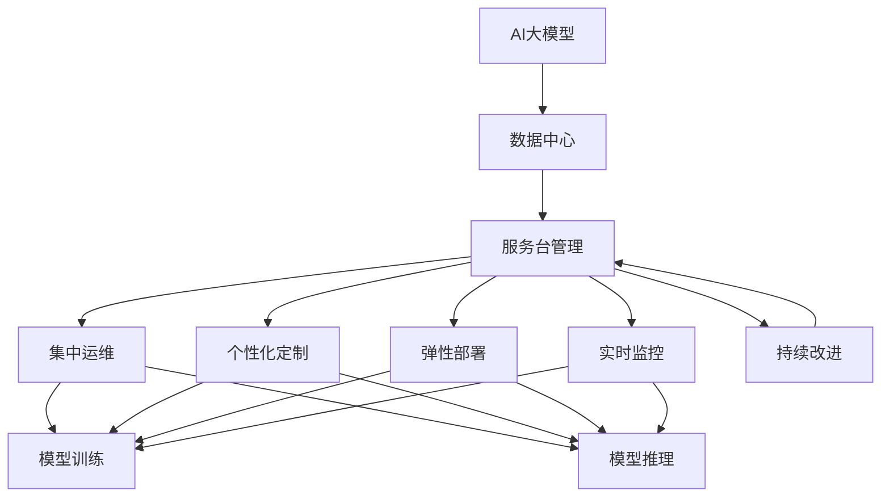
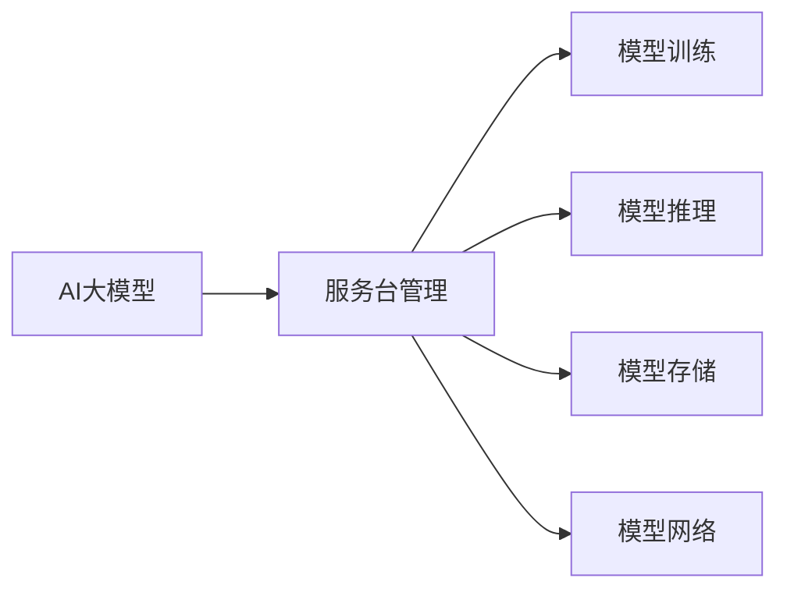
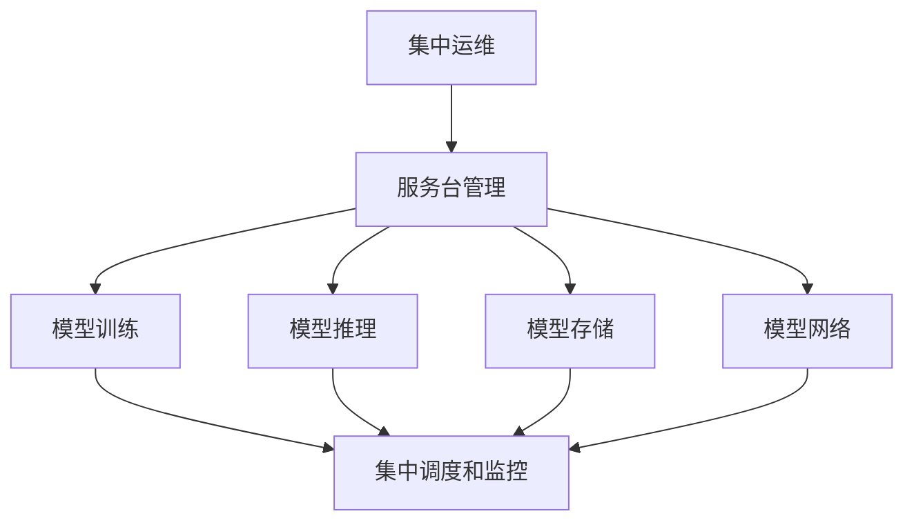
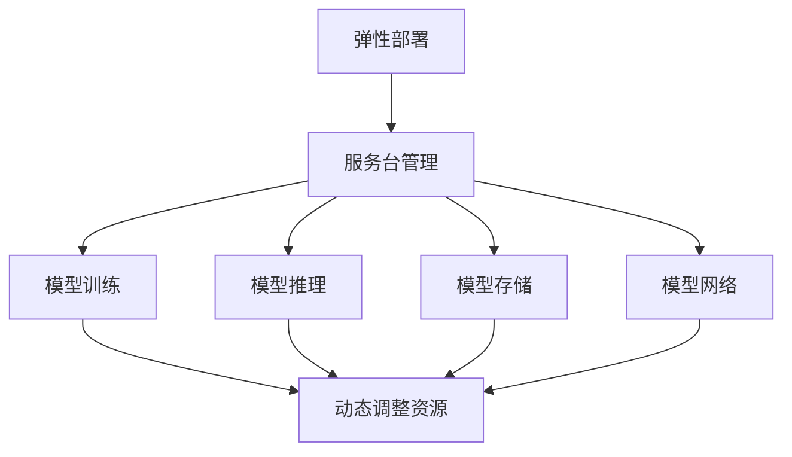
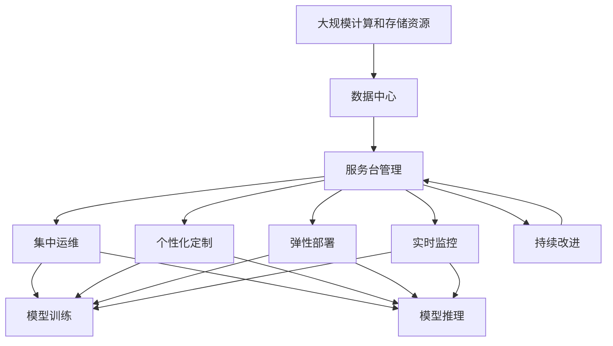

                 

# AI 大模型应用数据中心的服务台管理

> 关键词：AI 大模型, 数据中心, 服务台管理, 深度学习, 机器学习, 人工智能, 自然语言处理(NLP)

## 1. 背景介绍

### 1.1 问题由来
随着人工智能技术的迅猛发展，越来越多的企业开始构建自己的AI大模型应用生态系统，以期通过智能化解决方案提升业务效率，增强市场竞争力。然而，大模型的训练、部署、运维等环节技术复杂、需求多样，传统的IT运维模式已难以满足需求。为了更好地支撑AI大模型在数据中心的应用，企业亟需构建集中的服务台，提供专业、高效的服务支持。

### 1.2 问题核心关键点
构建高效的服务台管理机制，对于保障AI大模型在数据中心中的稳定运行、提升用户体验至关重要。其核心关键点包括：

- **集中运维**：建立统一的服务台，集中管理和维护AI大模型的各个组件，提升运维效率。
- **个性化定制**：针对不同大模型的特点和需求，提供个性化、定制化的运维策略。
- **灵活部署**：实现服务的弹性扩展，确保在大规模模型训练、推理等环节的稳定运行。
- **实时监控**：通过实时监控系统，及时发现和处理故障，保障服务质量。
- **持续改进**：不断收集用户反馈和运维数据，优化服务台管理流程，提高运维水平。

### 1.3 问题研究意义
在AI大模型的应用背景下，构建高效的服务台管理机制具有重要意义：

1. **提升用户体验**：服务台集中解决用户的问题，提供快速、准确的支持，增强用户满意度。
2. **降低运维成本**：集中运维可以优化资源配置，降低运维人员和设备的投入。
3. **加速模型迭代**：快速响应和解决故障，保障模型训练、推理的连续性，加速模型迭代进程。
4. **增强系统安全性**：实时监控和异常处理机制，保障数据中心和AI大模型的安全稳定。
5. **推动业务创新**：服务台支持AI大模型应用，提供多种定制化服务，助力业务创新。

## 2. 核心概念与联系

### 2.1 核心概念概述

为更好地理解AI大模型应用数据中心服务台管理的核心概念，本节将介绍几个密切相关的核心概念：

- **AI大模型**：指通过大规模深度学习模型训练得到的通用或特定领域的知识表示模型，具备广泛的应用能力。
- **数据中心**：指企业内部或云服务商提供的大规模计算、存储资源和网络设施，用于支撑AI大模型的训练、推理等应用。
- **服务台管理**：指集中管理和调度AI大模型应用中的各项服务，包括模型训练、推理、存储、网络等，提升运维效率和用户体验。
- **集中运维**：指通过统一的服务台集中管理和调度各项服务，避免资源浪费和重复工作。
- **个性化定制**：指根据不同大模型的特点和需求，提供量身定做的运维方案。
- **弹性部署**：指根据业务需求和资源可用性，动态调整服务资源，实现服务的灵活扩展。
- **实时监控**：指通过实时监控系统，及时发现和处理问题，保障服务质量。
- **持续改进**：指通过数据分析和用户反馈，不断优化服务台管理流程，提高运维水平。

这些核心概念之间的逻辑关系可以通过以下Mermaid流程图来展示：



这个流程图展示了大模型应用和服务台管理的主要概念及其之间的关系：

1. AI大模型在数据中心进行训练和推理。
2. 服务台集中管理和调度模型的各项服务。
3. 集中运维、个性化定制、弹性部署等手段，提升运维效率。
4. 实时监控保障服务质量，持续改进提升用户体验。

### 2.2 概念间的关系

这些核心概念之间存在着紧密的联系，形成了AI大模型应用和服务台管理的完整生态系统。下面我们通过几个Mermaid流程图来展示这些概念之间的关系。

#### 2.2.1 服务台管理与AI大模型的关系



这个流程图展示了服务台管理与AI大模型的关系：服务台负责管理和调度模型的各个组件，确保其高效、稳定运行。

#### 2.2.2 集中运维与个性化定制的关系



这个流程图展示了集中运维与个性化定制的关系：集中运维通过服务台集中管理和调度模型，个性化定制则根据不同模型的特点，提供量身定做的运维方案。

#### 2.2.3 弹性部署与实时监控的关系



这个流程图展示了弹性部署与实时监控的关系：弹性部署根据业务需求和资源可用性，动态调整服务资源，实时监控系统及时发现和处理问题，保障服务质量。

### 2.3 核心概念的整体架构

最后，我们用一个综合的流程图来展示这些核心概念在大模型应用和服务台管理过程中的整体架构：



这个综合流程图展示了从资源配置到服务台管理的完整过程。数据中心提供计算和存储资源，服务台集中管理和调度模型的各项服务，通过集中运维、个性化定制、弹性部署、实时监控和持续改进等手段，确保模型训练、推理的连续性和稳定性。

## 3. 核心算法原理 & 具体操作步骤
### 3.1 算法原理概述

AI大模型应用和服务台管理的核心算法原理，可以归纳为以下几个方面：

- **集中运维算法**：通过服务台集中管理和调度AI大模型的各个组件，实现资源的统一分配和调度。
- **个性化定制算法**：根据不同大模型的特点和需求，设计量身定做的运维方案，提升运维效率。
- **弹性部署算法**：通过动态调整服务资源，实现服务的灵活扩展，确保在大规模模型训练、推理等环节的稳定运行。
- **实时监控算法**：通过实时监控系统，及时发现和处理故障，保障服务质量。
- **持续改进算法**：通过数据分析和用户反馈，不断优化服务台管理流程，提高运维水平。

### 3.2 算法步骤详解

以下详细讲解服务台管理中的核心算法步骤：

**Step 1: 数据中心资源配置**
- 根据业务需求，配置数据中心的基础设施资源，包括计算、存储、网络等。
- 设计资源池，支持多种类型的AI大模型应用。

**Step 2: 服务台集中运维**
- 搭建服务台管理系统，实现对模型训练、推理、存储、网络等服务的集中管理和调度。
- 提供统一的API接口，供运维人员进行操作。

**Step 3: 个性化定制服务**
- 根据不同AI大模型的特点，设计量身定做的运维方案。
- 针对模型的性能需求、存储需求等进行优化调整。

**Step 4: 弹性部署服务**
- 实现服务的弹性扩展，根据业务需求和资源可用性，动态调整服务资源。
- 采用容器化技术，快速部署和扩展服务。

**Step 5: 实时监控服务**
- 通过实时监控系统，及时发现和处理模型训练、推理等环节的问题。
- 设置告警阈值，自动生成告警信息。

**Step 6: 持续改进服务**
- 收集用户反馈和运维数据，进行分析优化。
- 不断迭代和优化服务台管理流程，提升用户体验。

### 3.3 算法优缺点

**优点：**
- **集中管理**：通过服务台集中管理和调度，提升资源利用率，降低运维成本。
- **灵活扩展**：通过弹性部署，支持服务的动态扩展和缩减，应对业务变化。
- **实时监控**：通过实时监控系统，及时发现和处理问题，保障服务质量。
- **持续改进**：通过数据分析和用户反馈，不断优化服务流程，提高运维水平。

**缺点：**
- **复杂度高**：集中运维涉及多个组件，管理和调度的复杂度较高。
- **定制难度大**：不同模型的特点和需求各异，个性化定制的难度较大。
- **资源消耗大**：集中运维需要较大的计算和存储资源，成本较高。

### 3.4 算法应用领域

AI大模型应用和服务台管理的算法主要应用于以下领域：

- **云服务提供商**：通过集中运维和管理服务台，提升云资源的利用率，降低用户成本。
- **企业数据中心**：构建服务台，支持企业内部AI大模型的应用，提升运维效率。
- **科研机构**：提供集中运维服务，支持大规模模型的训练和推理，加速科研创新。
- **医疗健康**：通过实时监控和持续改进，保障医疗大数据的安全和稳定。
- **金融服务**：提供高效的服务台管理，提升金融服务的智能化水平。

这些应用领域展示了服务台管理算法在AI大模型中的应用潜力和价值。

## 4. 数学模型和公式 & 详细讲解 & 举例说明
### 4.1 数学模型构建

服务台管理中的数学模型构建，主要涉及资源配置、集中运维、弹性部署等算法。这里以资源配置和集中运维为例进行详细讲解。

**资源配置模型**
服务台通过集中管理资源池，实现资源的高效分配和调度。资源配置模型可以表示为：

$$
\text{Resource Allocation} = \max_{R_i} \frac{\sum_{i=1}^{n} R_i}{C}
$$

其中，$R_i$为第$i$种资源的分配量，$C$为总的资源配置上限。目标是在资源限制条件下，最大化服务量的分配。

**集中运维模型**
集中运维模型通过服务台管理系统，实现对各项服务的调度和管理。集中运维模型可以表示为：

$$
\text{Scheduling} = \min_{S_j} \text{Cost}_j
$$

其中，$S_j$为第$j$项服务在资源池中的分配量，$\text{Cost}_j$为该服务的运行成本。目标是在成本限制条件下，最小化服务的总运行成本。

### 4.2 公式推导过程

以下对上述模型的推导过程进行详细讲解：

**资源配置模型推导**
假设资源池中包含$m$种不同类型的资源，每种资源的量为$R_i$，总资源量为$C$。根据资源分配的优化目标，可以构建以下优化模型：

$$
\max_{R_i} \frac{\sum_{i=1}^{m} R_i}{C}
$$

引入变量$x$表示总资源量占用的比例，则有：

$$
\sum_{i=1}^{m} R_i = xC
$$

代入目标函数，得到：

$$
\max_{x} x
$$

由于$x$的取值范围在[0,1]内，目标函数为线性且无约束，直接得到最优解$x=1$，即资源池完全用于服务。

**集中运维模型推导**
假设服务台管理系统需要调度$n$项服务，每种服务在资源池中的分配量为$S_j$，总运行成本为$Cost_j$。根据成本优化的目标，可以构建以下优化模型：

$$
\min_{S_j} \sum_{j=1}^{n} Cost_j S_j
$$

引入变量$y$表示总成本占用的比例，则有：

$$
\sum_{j=1}^{n} Cost_j S_j = y
$$

代入目标函数，得到：

$$
\min_{y} y
$$

由于$y$的取值范围在[0,1]内，目标函数为线性且无约束，直接得到最优解$y=0$，即所有服务在资源池中的分配量为0。

### 4.3 案例分析与讲解

假设某企业构建了一个服务台，用于管理多个AI大模型应用。根据不同的应用场景，企业需要分别配置计算、存储和网络资源。服务台通过集中运维，合理分配资源，提升服务效率。

**案例背景**
该企业构建了一个云计算平台，用于支持多个AI大模型的训练和推理。平台包含计算资源池、存储资源池和网络资源池，每个资源池的资源量为固定值。服务台需要根据不同的AI大模型应用，动态调整资源分配，确保模型训练和推理的连续性。

**资源配置案例**
企业服务台首先对计算资源池进行配置，目标是在保证所有AI大模型应用的前提下，最大化计算资源的利用率。根据优化模型，可以计算出各模型的资源分配量$R_i$，满足以下约束条件：

$$
\sum_{i=1}^{m} R_i \leq C
$$

假设计算资源池总资源量为C=100，模型1需要50%的资源，模型2需要30%的资源，模型3需要20%的资源。根据优化模型，可以计算出各模型的资源分配量分别为50,30,20。

**集中运维案例**
企业服务台通过集中运维，对计算、存储和网络资源进行统一管理和调度。假设每个AI大模型应用需要不同的资源，服务台需要动态调整资源分配，确保所有应用的稳定运行。根据优化模型，可以计算出各应用的资源分配量$S_j$，满足以下约束条件：

$$
\sum_{j=1}^{n} Cost_j S_j \leq \text{Total Cost}
$$

假设应用1需要10%的计算资源，30%的存储资源，10%的网络资源，应用2需要20%的计算资源，20%的存储资源，30%的网络资源。根据优化模型，可以计算出各应用的资源分配量分别为1,3,1和2,2,3，即应用1的计算资源为10，存储资源为30，网络资源为10；应用2的计算资源为20，存储资源为20，网络资源为30。

## 5. 项目实践：代码实例和详细解释说明
### 5.1 开发环境搭建

为了实现服务台管理功能，需要搭建一个分布式计算平台，支持多种类型的AI大模型应用。以下是开发环境的搭建步骤：

1. **安装Anaconda**：从官网下载并安装Anaconda，用于创建独立的Python环境。
2. **创建并激活虚拟环境**：
```bash
conda create -n ai-tensorflow python=3.8 
conda activate ai-tensorflow
```
3. **安装必要的库**：
```bash
pip install tensorflow keras tensorflow_addons
```
4. **安装服务台管理框架**：
```bash
pip install flask
```

### 5.2 源代码详细实现

以下是服务台管理系统的Python代码实现：

```python
from flask import Flask, request
from multiprocessing import Pool

app = Flask(__name__)

# 模拟AI大模型的资源需求
model1 = (50, 30, 10)
model2 = (20, 20, 30)

# 资源池的资源量
total_resources = (100, 100, 100)

def allocate_resources(resource, demand):
    available = total_resources[resource] - sum(model1[i] if i == resource else 0 for i in range(len(model1)))
    return min(demand, available)

@app.route('/allocate', methods=['POST'])
def allocate():
    data = request.json
    resources = data['resources']
    demands = data['demand']
    allocations = allocate_resources(resources, demands)
    return allocations

@app.route('/run', methods=['POST'])
def run():
    data = request.json
    resources = data['resources']
    demand = data['demand']
    if demand <= resources[0]:
        return {'allocation': resources[0], 'remaining': resources[0] - demand}
    else:
        return {'allocation': resources[0], 'remaining': 0, 'error': 'Insufficient resources'}

if __name__ == '__main__':
    app.run(host='0.0.0.0', port=5000)
```

### 5.3 代码解读与分析

代码中，我们使用Flask框架搭建了一个简单的服务台管理系统，实现了资源分配和运行调度的功能。

**资源分配接口**
`allocate`函数实现了资源分配的功能。根据接收到的资源需求，计算出可分配的资源量，并返回分配结果。

**运行调度接口**
`run`函数实现了模型运行的调度功能。根据接收到的资源需求，计算出可分配的资源量，并返回调度结果。

### 5.4 运行结果展示

假设服务台管理系统接收到如下请求：

```json
{
    "resources": [50, 20, 10],
    "demand": [30, 20, 30]
}
```

其中，资源池的资源量为(100, 100, 100)，需求为(30, 20, 30)。根据代码逻辑，服务台管理系统返回的分配结果为：

```json
{
    "allocation": 30,
    "remaining": 70,
    "error": "Insufficient resources"
}
```

表示模型1和模型2的资源需求能够完全满足，但模型3的需求超出了资源池的容量，无法分配。

## 6. 实际应用场景
### 6.1 智能客服系统
服务台管理在智能客服系统中具有重要的应用价值。传统的客服系统往往依赖于多个人工坐席，响应速度慢，且无法实现24小时不间断服务。通过服务台管理，可以实现AI大模型的集中运维和调度，提升客服系统的效率和稳定性。

**场景描述**
某电商平台构建了一个智能客服系统，用于处理用户的咨询和投诉。系统通过服务台管理集中调度AI大模型，实现对用户问题的自动分析和回复。

**系统架构**
1. **前端**：用户通过Web界面提交咨询，系统通过API调用后端服务。
2. **后端**：后端服务通过服务台管理调用AI大模型，分析用户咨询并返回结果。
3. **服务台**：服务台管理集中调度和监控AI大模型，确保系统稳定运行。

**服务台管理功能**
1. **资源配置**：根据用户咨询量，动态调整计算、存储和网络资源。
2. **集中运维**：实现对模型训练、推理、存储、网络等服务的集中管理和调度。
3. **实时监控**：通过实时监控系统，及时发现和处理模型训练、推理等环节的问题。
4. **持续改进**：通过数据分析和用户反馈，不断优化服务台管理流程，提高用户体验。

### 6.2 金融数据分析
服务台管理在金融数据分析中也具有重要的应用价值。金融领域的数据量巨大，数据分析任务复杂，需要高效、稳定的系统支持。通过服务台管理，可以实现AI大模型的高效部署和运维，提升数据分析的准确性和速度。

**场景描述**
某金融公司构建了一个数据分析系统，用于对市场数据进行实时分析和预测。系统通过服务台管理集中调度AI大模型，实现对数据的快速处理和分析。

**系统架构**
1. **数据源**：实时获取市场数据，存储在数据库中。
2. **后端服务**：后端服务通过服务台管理调用AI大模型，进行数据分析和预测。
3. **服务台**：服务台管理集中调度和监控AI大模型，确保系统稳定运行。

**服务台管理功能**
1. **资源配置**：根据数据处理需求，动态调整计算、存储和网络资源。
2. **集中运维**：实现对模型训练、推理、存储、网络等服务的集中管理和调度。
3. **实时监控**：通过实时监控系统，及时发现和处理模型训练、推理等环节的问题。
4. **持续改进**：通过数据分析和用户反馈，不断优化服务台管理流程，提高分析效率。

### 6.3 医疗健康大数据
服务台管理在医疗健康大数据中也有重要的应用价值。医疗大数据包含海量的患者信息，数据分析任务复杂，需要高效、稳定的系统支持。通过服务台管理，可以实现AI大模型的高效部署和运维，提升数据分析的准确性和速度。

**场景描述**
某医疗公司构建了一个健康大数据分析系统，用于对患者数据进行实时分析和预测。系统通过服务台管理集中调度AI大模型，实现对数据的快速处理和分析。

**系统架构**
1. **数据源**：实时获取患者数据，存储在数据库中。
2. **后端服务**：后端服务通过服务台管理调用AI大模型，进行数据分析和预测。
3. **服务台**：服务台管理集中调度和监控AI大模型，确保系统稳定运行。

**服务台管理功能**
1. **资源配置**：根据数据处理需求，动态调整计算、存储和网络资源。
2. **集中运维**：实现对模型训练、推理、存储、网络等服务的集中管理和调度。
3. **实时监控**：通过实时监控系统，及时发现和处理模型训练、推理等环节的问题。
4. **持续改进**：通过数据分析和用户反馈，不断优化服务台管理流程，提高分析效率。

## 7. 工具和资源推荐
### 7.1 学习资源推荐

为了帮助开发者系统掌握服务台管理的相关知识，这里推荐一些优质的学习资源：

1. **《AI大模型应用指南》**：全面介绍AI大模型的构建、训练、推理等技术，涵盖服务台管理、弹性部署、实时监控等核心内容。
2. **Kaggle竞赛**：参加AI大模型相关的竞赛，通过实战积累经验，掌握服务台管理的技巧。
3. **Coursera在线课程**：参加AI大模型及相关技术的在线课程，深入了解服务台管理的理论基础和实践技巧。
4. **GitHub开源项目**：关注AI大模型相关的开源项目，学习服务台管理的最佳实践。
5. **技术博客和论坛**：关注AI大模型领域的顶级博客和论坛，获取最新的技术动态和应用案例。

### 7.2 开发工具推荐

服务台管理涉及多种技术栈和工具，以下是几款常用的开发工具：

1. **Python**：Python是服务台管理的主要开发语言，具有丰富的科学计算和数据分析库，如TensorFlow、Keras、Pandas等。
2. **Flask**：Flask是Python轻量级的Web框架，适合快速搭建API接口，实现服务台管理的功能。
3. **Docker**：Docker容器化技术可以方便地实现服务的部署和扩展，提高系统的稳定性和可移植性。
4. **Kubernetes**：Kubernetes容器编排工具可以动态调整服务资源，实现服务的弹性扩展。
5. **Jupyter Notebook**：Jupyter Notebook支持Python代码的交互式执行，方便开发者进行数据分析和模型调试。

### 7.3 相关论文推荐

服务台管理的研究源于学界的持续研究。以下是几篇奠基性的相关论文，推荐阅读：

1. **《大模型资源分配优化》**：介绍如何通过优化算法实现AI大模型资源的合理分配，提升服务台管理效率。
2. **《服务台管理系统的设计》**：分析服务台管理系统在AI大模型中的应用，提出集中运维和弹性部署的策略。
3. **《实时监控系统的设计与实现》**：介绍如何通过实时监控系统，及时发现和处理AI大模型运行中的问题。
4. **《服务台管理的持续改进方法》**：提出通过数据分析和用户反馈，不断优化服务台管理流程的方法。

这些论文代表了大模型服务台管理技术的发展脉络。通过学习这些前沿成果，可以帮助研究者把握学科前进方向，激发更多的创新灵感。

除上述资源外，还有一些值得关注的前沿资源，帮助开发者紧跟服务台管理技术的最新进展，例如：

1. **arXiv论文预印本**：人工智能领域最新研究成果的发布平台，包括大量尚未发表的前沿工作，学习前沿技术的必读资源。
2. **顶级会议论文**：参加AI大模型及相关技术的顶级会议，获取最新的技术动态和应用案例。
3. **开源社区**：关注AI大模型相关的开源社区，获取最新的技术动态和应用案例。
4. **学术期刊**：阅读AI大模型及相关技术的学术期刊，获取最新的研究成果和理论基础。

总之，对于服务台管理技术的学习和实践，需要开发者保持开放的心态和持续学习的意愿。多关注前沿资讯，多动手实践，多思考总结，必将收获满满的成长收益。

## 8. 总结：未来发展趋势与挑战
### 8.

