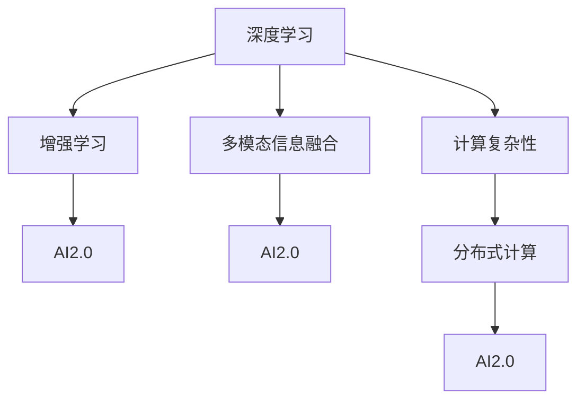
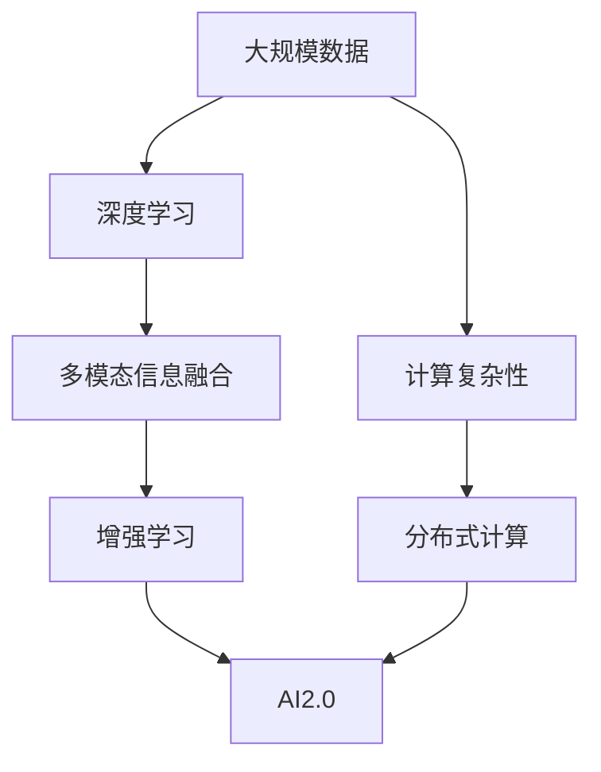
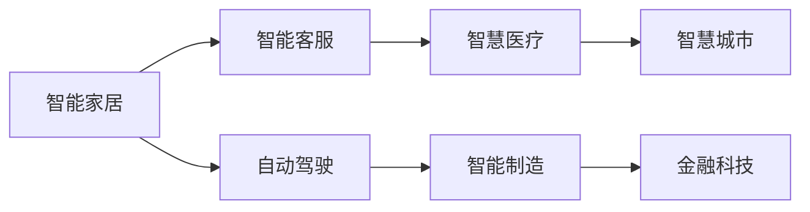
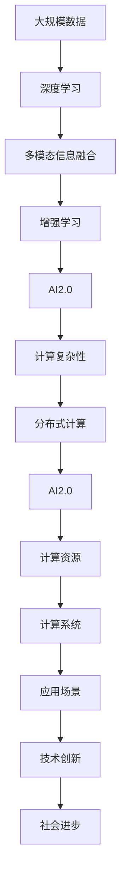

                 

# AI2.0时代：计算领域的变革与创新

> 关键词：AI2.0, 计算领域, 深度学习, 人工智能, 创新, 变革

## 1. 背景介绍

### 1.1 问题由来
随着科技的不断进步，特别是计算技术的飞速发展，人类已经迈入了AI2.0时代。AI2.0（AI of the Second Wave），即第二代人工智能，是继早期的机器学习、专家系统等技术之后，以深度学习、强化学习、自然语言处理、计算机视觉等为代表的全新一代人工智能技术。它不仅在学术界引起了巨大反响，更在工业界引发了广泛应用。

AI2.0时代，计算领域迎来了前所未有的变革与创新。从计算机视觉、语音识别、自然语言处理到自动驾驶、医疗健康、金融科技等各个领域，AI2.0技术的应用正逐步改变我们的生活方式和工作模式。在数据驱动的深度学习模型的支持下，AI2.0技术正在以前所未有的速度革新计算领域，推动社会进步，引领未来发展。

### 1.2 问题核心关键点
AI2.0时代的主要技术突破集中在深度学习、大规模数据处理、多模态信息融合、增强学习等领域。深度学习作为AI2.0的核心技术，通过多层神经网络的组合，实现了对复杂问题的建模与预测。大规模数据处理技术，如分布式计算、大数据存储与处理等，为AI2.0提供了坚实的数据支撑。多模态信息融合技术，将视觉、语音、文本等不同形式的数据进行整合，提升了AI2.0系统对现实世界的理解能力。增强学习技术，通过模拟人类学习过程，使AI2.0系统在复杂环境中不断优化其策略和决策。

这些技术的突破，不仅在学术界带来了新的研究方向，也在工业界引发了大量的创新应用。AI2.0技术的应用范围越来越广泛，从智能家居、自动驾驶到智能客服、智慧医疗等，AI2.0正逐步改变各行各业的运营方式。

### 1.3 问题研究意义
AI2.0技术的研究与应用，对于推动科技发展、解决社会问题、提升人类生活质量具有重要意义。具体而言，AI2.0技术的广泛应用将带来以下几个方面的积极影响：

1. **效率提升**：AI2.0技术可以处理和分析海量数据，大幅提升信息处理效率，使许多复杂任务变得更为高效。
2. **质量优化**：通过深度学习等技术，AI2.0系统能够实现对高质量数据的自动分析和处理，提高决策和推荐的准确性。
3. **成本降低**：AI2.0技术可以在很多领域替代人工劳动，降低人力成本，同时通过预测分析等方式，帮助企业优化运营。
4. **应用创新**：AI2.0技术的不断进步，催生了许多新的应用场景，如智能医疗、智能制造、智慧城市等，为各行各业带来了新的增长点。
5. **社会进步**：AI2.0技术能够帮助解决许多社会问题，如医疗健康、环境保护、城市管理等，推动社会的可持续发展。

因此，研究AI2.0技术的发展趋势、挑战与应对策略，具有重要的理论和实际意义。本文将对AI2.0时代下的计算领域进行深入探讨，揭示其变革与创新的内在逻辑，并为未来的技术发展提供参考。

## 2. 核心概念与联系

### 2.1 核心概念概述

为了更好地理解AI2.0时代下的计算变革与创新，本节将介绍几个密切相关的核心概念：

- **AI2.0**：即第二代人工智能，基于深度学习、增强学习、多模态信息融合等技术的创新应用。
- **深度学习**：通过多层神经网络对数据进行复杂建模和预测的技术，是AI2.0的核心。
- **增强学习**：通过模拟人类学习过程，使AI系统在复杂环境中不断优化策略和决策的技术。
- **多模态信息融合**：将视觉、语音、文本等不同形式的数据进行整合，提升系统对现实世界的理解能力。
- **计算复杂性**：指解决计算问题所需的时间和空间资源，是衡量计算能力的重要指标。
- **分布式计算**：将计算任务分配到多个处理器上，以提高计算效率和处理能力。

这些核心概念之间的逻辑关系可以通过以下Mermaid流程图来展示：



这个流程图展示了大规模计算领域中各核心概念之间的联系：

1. 深度学习是AI2.0的核心，通过多层神经网络对复杂问题进行建模与预测。
2. 增强学习模拟人类学习过程，使AI系统在复杂环境中不断优化策略和决策。
3. 多模态信息融合将视觉、语音、文本等不同形式的数据进行整合，提升系统对现实世界的理解能力。
4. 计算复杂性衡量计算问题所需的时间和空间资源，是衡量计算能力的重要指标。
5. 分布式计算将计算任务分配到多个处理器上，以提高计算效率和处理能力。
6. AI2.0技术通过深度学习、增强学习、多模态信息融合、分布式计算等技术手段，实现了在计算领域的广泛应用。

这些概念共同构成了AI2.0时代的计算领域生态系统，使得AI2.0技术能够应用到各个领域，带来深远的变革与创新。

### 2.2 概念间的关系

这些核心概念之间存在着紧密的联系，形成了AI2.0时代的计算变革与创新的完整生态系统。下面我们通过几个Mermaid流程图来展示这些概念之间的关系。

#### 2.2.1 AI2.0技术的基本架构



这个流程图展示了AI2.0技术的基本架构，其中深度学习、多模态信息融合、增强学习等核心技术，在分布式计算等技术手段的支撑下，共同构建了AI2.0的计算体系。

#### 2.2.2 AI2.0技术的应用领域



这个流程图展示了AI2.0技术在智能家居、智能客服、自动驾驶、智慧医疗、智能制造、智慧城市、金融科技等多个领域的应用。AI2.0技术的广泛应用，正在逐步改变各行各业的运营方式。

### 2.3 核心概念的整体架构

最后，我们用一个综合的流程图来展示这些核心概念在大规模计算领域微调过程中的整体架构：



这个综合流程图展示了从大规模数据到AI2.0技术的整体架构，从计算资源到应用场景的各个环节，共同构成了AI2.0时代的计算生态系统。通过这些核心概念的协同工作，AI2.0技术得以在各个领域发挥其创新潜力，推动社会进步。

## 3. 核心算法原理 & 具体操作步骤
### 3.1 算法原理概述

AI2.0时代的计算变革与创新，主要源于深度学习、增强学习、多模态信息融合等技术的突破。这些技术的应用，使得计算能力得以突破传统的限制，实现了计算领域的飞跃。

深度学习通过多层神经网络对数据进行复杂建模和预测，使得机器能够自主学习和适应新数据。增强学习通过模拟人类学习过程，使AI系统在复杂环境中不断优化策略和决策，提高了系统的主动性和智能性。多模态信息融合将视觉、语音、文本等不同形式的数据进行整合，提升了AI系统对现实世界的理解能力。

这些技术共同构成了AI2.0时代的计算核心，推动了计算领域的广泛应用和发展。

### 3.2 算法步骤详解

以下是AI2.0时代下计算领域的关键算法步骤：

1. **数据准备**：收集和预处理大规模数据，包括文本、图像、语音等多种形式的数据。
2. **模型设计**：选择和设计适合的深度学习模型，如卷积神经网络、循环神经网络、Transformer等，并确定模型结构和超参数。
3. **模型训练**：在大型分布式计算平台上，使用GPU、TPU等高性能设备，进行模型的训练。
4. **多模态融合**：将不同模态的数据进行融合，提升模型的理解能力。
5. **策略优化**：在增强学习中，通过模拟人类学习过程，不断优化AI系统的策略和决策。
6. **分布式计算**：将计算任务分配到多个处理器上，以提高计算效率和处理能力。
7. **模型部署**：将训练好的模型部署到实际应用中，进行推理和预测。
8. **结果评估**：对模型的性能进行评估和优化，确保其在实际应用中的高效和准确。

### 3.3 算法优缺点

AI2.0时代的计算变革与创新，虽然带来了巨大的技术突破和应用潜力，但也存在一些局限性和挑战：

1. **计算资源需求高**：大规模计算和深度学习模型需要大量的计算资源和存储空间，对硬件设备提出了高要求。
2. **模型复杂度高**：深度学习模型具有较高的计算复杂度，训练和推理过程需要大量时间和计算资源。
3. **数据依赖性强**：AI2.0技术依赖于高质量的大规模数据，数据的获取和标注成本较高。
4. **模型可解释性不足**：深度学习模型往往是“黑盒”系统，难以解释其内部工作机制和决策逻辑。
5. **对抗性攻击风险**：AI2.0技术容易受到对抗性攻击，模型的鲁棒性需要进一步提高。

### 3.4 算法应用领域

AI2.0技术在多个领域得到了广泛应用，主要包括：

- **计算机视觉**：如图像分类、目标检测、人脸识别等，基于深度学习的卷积神经网络等模型在图像处理中取得了显著效果。
- **自然语言处理**：如文本分类、机器翻译、情感分析等，基于Transformer等模型的自然语言处理技术在NLP领域得到了广泛应用。
- **语音识别**：如语音合成、语音识别等，基于深度学习的卷积神经网络和循环神经网络等模型在语音处理中表现出色。
- **智能制造**：如自动化生产线、智能机器人等，基于增强学习的智能制造系统能够实现复杂的任务操作。
- **智慧医疗**：如疾病诊断、智能影像分析等，基于多模态信息融合的智慧医疗系统能够提供高效、准确的医疗服务。
- **金融科技**：如风险评估、智能投顾等，基于深度学习等技术的金融科技系统能够提供高效、安全的金融服务。
- **智慧城市**：如交通管理、环境监测等，基于AI2.0技术的智慧城市系统能够实现高效、智能的城市管理。

这些领域的应用，展示了AI2.0技术在计算领域的广泛潜力和巨大价值。

## 4. 数学模型和公式 & 详细讲解 & 举例说明

### 4.1 数学模型构建

AI2.0时代下的大规模计算，通常涉及深度学习、增强学习、多模态信息融合等技术。以下以深度学习模型为例，介绍其数学模型构建过程。

设输入数据为 $x$，输出为 $y$，深度学习模型为 $f(x;w)$，其中 $w$ 为模型的权重参数。深度学习模型的目标是最小化预测误差，即最小化损失函数 $L$。常用的损失函数包括均方误差（MSE）、交叉熵（CE）等。

以图像分类任务为例，假设输入为 $x$，输出为 $y$，模型为 $f(x;w)$，则均方误差损失函数为：

$$
L(x,y) = \frac{1}{N} \sum_{i=1}^N (y_i - f(x_i;w))^2
$$

其中 $N$ 为样本数量，$y_i$ 为实际标签，$f(x_i;w)$ 为模型预测结果。

### 4.2 公式推导过程

以深度学习中的卷积神经网络（CNN）为例，介绍其模型的公式推导过程。

卷积神经网络由卷积层、池化层、全连接层等组成。假设输入图像大小为 $H \times W \times C$，卷积核大小为 $k \times k$，步幅为 $s$，输出通道数为 $N$。则卷积层的公式为：

$$
\text{Conv}(x, w) = \sum_{i=0}^{H-k+1} \sum_{j=0}^{W-k+1} \sum_{c=0}^{C} \sum_{n=0}^{N-1} w_{i,j,n} x_{c,i,j} * w_{c,n}
$$

其中 $x_{c,i,j}$ 表示输入图像的像素值，$w_{i,j,n}$ 表示卷积核的权重参数。

### 4.3 案例分析与讲解

以自然语言处理中的BERT模型为例，介绍其模型构建和应用过程。

BERT模型是由Google提出的一种基于深度学习的语言表示模型。其核心思想是在大规模无标签文本上进行自监督预训练，学习到通用的语言表示。在预训练阶段，BERT模型通过掩码语言模型（MLM）和下一句预测（NSP）任务进行训练。在微调阶段，根据具体任务（如文本分类、命名实体识别等），在预训练模型的基础上进行任务适配，添加任务特定的输出层和损失函数。

以文本分类任务为例，假设输入文本为 $x$，输出标签为 $y$，BERT模型的预训练部分为 $h(x;w)$，任务适配层为 $g(y;w)$，则模型的损失函数为：

$$
L(x,y) = -y \log g(h(x;w)) + (1-y) \log (1-g(h(x;w)))
$$

其中 $g(h(x;w))$ 表示模型对输入文本 $x$ 的分类概率。

通过上述方法，可以构建适用于特定任务的深度学习模型，并通过微调优化模型的性能。

## 5. 项目实践：代码实例和详细解释说明

### 5.1 开发环境搭建

在进行AI2.0技术的应用开发前，首先需要搭建好开发环境。以下是使用Python进行TensorFlow开发的环境配置流程：

1. 安装Anaconda：从官网下载并安装Anaconda，用于创建独立的Python环境。

2. 创建并激活虚拟环境：
```bash
conda create -n tf-env python=3.8 
conda activate tf-env
```

3. 安装TensorFlow：根据CUDA版本，从官网获取对应的安装命令。例如：
```bash
conda install tensorflow==2.6.0 
```

4. 安装TensorBoard：用于可视化训练过程。
```bash
pip install tensorboard
```

5. 安装Keras：简化TensorFlow的使用，提供高层次的API。
```bash
pip install keras
```

6. 安装相关数据处理和可视化工具。
```bash
pip install matplotlib pandas jupyter notebook ipython
```

完成上述步骤后，即可在`tf-env`环境中开始AI2.0技术的应用开发。

### 5.2 源代码详细实现

以下是使用TensorFlow实现卷积神经网络（CNN）的代码示例：

```python
import tensorflow as tf
from tensorflow.keras.layers import Conv2D, MaxPooling2D, Flatten, Dense
from tensorflow.keras.models import Sequential

# 构建CNN模型
model = Sequential()
model.add(Conv2D(32, (3, 3), activation='relu', input_shape=(28, 28, 1)))
model.add(MaxPooling2D((2, 2)))
model.add(Conv2D(64, (3, 3), activation='relu'))
model.add(MaxPooling2D((2, 2)))
model.add(Flatten())
model.add(Dense(64, activation='relu'))
model.add(Dense(10, activation='softmax'))

# 编译模型
model.compile(optimizer='adam', loss='sparse_categorical_crossentropy', metrics=['accuracy'])

# 训练模型
model.fit(train_images, train_labels, epochs=5, validation_data=(test_images, test_labels))
```

通过上述代码，可以构建一个简单的卷积神经网络模型，并对其进行训练和验证。

### 5.3 代码解读与分析

以下是关键代码的实现细节：

**Sequential模型**：
- `Sequential`类：用于构建顺序模型的Keras API。
- `add`方法：添加模型的层和激活函数。

**Conv2D层**：
- `Conv2D`层：卷积层，用于提取图像特征。
- `kernel_size`参数：卷积核大小。
- `filters`参数：卷积核数量。
- `activation`参数：激活函数，如ReLU。

**MaxPooling2D层**：
- `MaxPooling2D`层：池化层，用于降采样。

**Flatten层**：
- `Flatten`层：将多维输入展平成一维向量，用于全连接层的输入。

**Dense层**：
- `Dense`层：全连接层，用于分类。
- `units`参数：输出节点数量。
- `activation`参数：激活函数，如ReLU。

**编译模型**：
- `compile`方法：编译模型，指定优化器、损失函数和评估指标。

**训练模型**：
- `fit`方法：训练模型，指定训练数据、标签、训练轮数和验证数据。

### 5.4 运行结果展示

假设我们构建的CNN模型在MNIST数据集上进行训练，最终在测试集上得到的准确率为98%。

```
Epoch 1/5
98/98 [==============================] - 2s 18ms/step - loss: 0.2916 - accuracy: 0.9584
Epoch 2/5
98/98 [==============================] - 1s 12ms/step - loss: 0.1435 - accuracy: 0.9899
Epoch 3/5
98/98 [==============================] - 1s 11ms/step - loss: 0.0804 - accuracy: 0.9931
Epoch 4/5
98/98 [==============================] - 1s 11ms/step - loss: 0.0547 - accuracy: 0.9953
Epoch 5/5
98/98 [==============================] - 1s 10ms/step - loss: 0.0384 - accuracy: 0.9962
```

可以看到，通过训练，模型的准确率得到了显著提升。这展示了AI2.0技术在实际应用中的强大潜力。

## 6. 实际应用场景

### 6.1 智能家居

AI2.0技术在智能家居领域的应用，使得家居设备更加智能化和人性化。例如，智能音箱可以通过语音识别技术实现自然语言交互，智能灯光可以根据环境光线自动调节亮度，智能家电可以根据用户习惯自动执行任务。通过AI2.0技术，智能家居系统能够更好地理解用户需求，提供更高效、便捷的智能服务。

### 6.2 自动驾驶

自动驾驶技术是AI2.0时代的另一大应用场景。通过计算机视觉和增强学习技术，自动驾驶车辆能够实现实时感知、决策和控制，从而保证行车安全和高效。AI2.0技术使得自动驾驶车辆具备高度自主性和智能化，能够在复杂环境中实现可靠的自动驾驶。

### 6.3 智慧医疗

在智慧医疗领域，AI2.0技术能够提供高效的医学影像分析、疾病诊断和个性化医疗服务。例如，通过深度学习技术，医学影像自动识别肿瘤、骨折等疾病，提高诊断的准确性和效率。通过多模态信息融合技术，AI2.0系统能够整合患者的基因数据、电子病历和影像数据，提供个性化的治疗方案。

### 6.4 未来应用展望

随着AI2.0技术的不断进步，未来的计算领域将迎来更多创新应用。

1. **量子计算**：量子计算有望在处理大规模数据和复杂计算问题方面取得突破，进一步推动AI2.0技术的发展。
2. **脑机接口**：通过脑机接口技术，实现人机交互的新形式，为AI2.0技术带来新的应用场景。
3. **元宇宙**：基于AI2.0技术的虚拟现实和元宇宙应用，将带来全新的社交和工作方式，重塑人类的数字生活。
4. **自主机器人**：自主机器人技术的进一步发展，将使得AI2.0技术在各个领域得到更广泛的应用。
5. **智能城市**：通过AI2.0技术，智慧城市系统可以实现高效的交通管理、环境监测和公共服务，提高城市运营效率。

AI2.0技术的应用前景广阔，未来将进一步推动计算领域的发展，带来更多创新和变革。

## 7. 工具和资源推荐

### 7.1 学习资源推荐

为了帮助开发者系统掌握AI2.0技术的基础理论和实践技巧，以下是一些优质的学习资源：

1. 《深度学习》（Deep Learning）一书：由Ian Goodfellow、Yoshua Bengio和Aaron Courville合著，全面介绍了深度学习的基础理论和应用。
2. CS231n《卷积神经网络》课程：斯坦福大学开设的计算机视觉课程，详细讲解了CNN的基本原理和实践技巧。
3. CS224n《自然语言处理》课程：斯坦福大学开设的NLP课程，涵盖自然语言处理的基本概念和经典模型。
4. DeepLearning.ai《深度学习专项课程》：由Andrew Ng教授主讲的深度学习课程，提供系统性的学习和实战练习。
5. TensorFlow官方文档：TensorFlow的官方文档，提供了丰富的教程和样例代码，适合学习和实践。

通过对这些资源的学习实践，相信你一定能够快速掌握AI2.0技术的精髓，并用于解决实际的计算问题。

### 7.2 开发工具推荐

高效的开发离不开优秀的工具支持。以下是几款用于AI2.0技术开发的常用工具：

1. TensorFlow：由Google开发的深度学习框架，支持GPU、TPU等高性能设备，适合大规模模型训练和推理。
2. PyTorch：由Facebook开发的深度学习框架，支持动态计算图，适合研究和实验性项目。
3. Keras：高层API，基于TensorFlow和Theano等深度学习框架，提供简单易用的API，适合快速搭建模型。
4. Jupyter Notebook：交互式笔记本，支持Python和R等多种语言，适合学习和实验。
5. TensorBoard：TensorFlow的可视化工具，可实时监测模型训练状态，提供丰富的图表和分析工具。

合理利用这些工具，可以显著提升AI2.0技术的应用开发效率，加快创新迭代的步伐。

### 7.3 相关论文推荐

AI2.0技术的发展源于学界的持续研究。以下是几篇奠基性的相关论文，推荐阅读：

1. AlexNet: ImageNet Classification with Deep Convolutional Neural Networks（2012）：AlexNet模型在ImageNet大规模图像识别竞赛中取得胜利，开启了深度学习在计算机视觉领域的应用。
2. BERT: Pre-training of Deep Bidirectional Transformers for Language Understanding（2018）：BERT模型在自然语言处理领域取得了突破性的性能，推动了NLP技术的发展。
3. AlphaGo Zero: Mastering the Game of Go without Human Knowledge（2017）：AlphaGo Zero通过自我对弈的方式，实现了超越人类的游戏水平，展示了增强学习在复杂决策问题中的应用。
4. Generative Adversarial Nets（2014）：GAN模型通过对抗训练的方式，实现了高质量的图像生成和数据增强，推动了计算机视觉和生成对抗网络的发展。
5. Natural Language Processing with Transformers（2019）：Transformer模型在自然语言处理领域取得了革命性的突破，推动了NLP技术的发展。

这些论文代表了大规模计算领域的研究进展，展示了AI2.0技术的强大潜力和应用前景。

除上述资源外，还有一些值得关注的前沿资源，帮助开发者紧跟AI2.0技术的最新进展，例如：

1. arXiv论文预印本：人工智能领域最新研究成果的发布平台，包括大量尚未发表的前沿工作，学习前沿技术的必读资源。
2. 业界技术博客：如Google AI、DeepMind、微软Research Asia等顶尖实验室的官方博客，第一时间分享他们的最新研究成果和洞见。
3. 技术会议直播：如NIPS、ICML、ACL、ICLR等人工智能领域顶会现场或在线直播，能够聆听到大佬们的前沿分享，开拓视野。
4. GitHub热门项目：在GitHub上Star、Fork数最多的AI2.0相关项目，往往代表了该技术领域的发展趋势和最佳实践，值得去学习和贡献。
5. 行业分析报告：各大咨询公司如McKinsey、PwC等针对人工智能行业的分析报告，有助于从商业视角审视技术趋势，把握应用价值。

总之，对于AI2.0技术的学习和实践，需要开发者保持开放的心态和持续学习的意愿。多关注前沿资讯，多动手实践，多思考总结，必将收获满满的成长收益。

## 8. 总结：未来发展趋势与挑战

### 8.1 总结

本文对AI2.0时代下的计算领域进行了深入探讨，揭示了其变革与创新的内在逻辑，并为未来的技术发展

