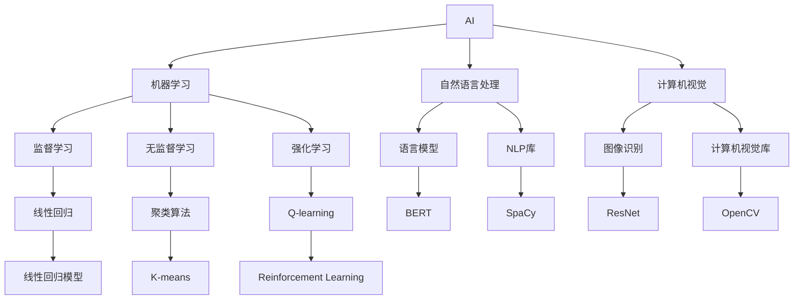
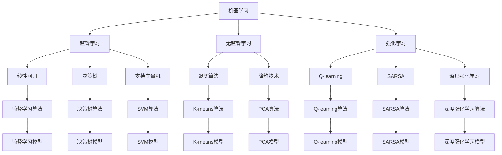

                 

# AI与计算机历史的对比

## 1. 背景介绍

### 1.1 问题由来

人工智能（Artificial Intelligence，AI）和计算机科学的历史可以追溯到20世纪中叶，是两个紧密相连又具有独立发展路径的领域。尽管它们都涉及到信息和计算，但AI更关注智能行为的实现，而计算机科学更关注计算方法和计算机系统的设计。因此，本文将从历史发展的角度对比AI与计算机科学，探讨二者之间的异同，为未来的研究和应用提供一些启示。

### 1.2 问题核心关键点

AI与计算机科学的关系始于机器学习（Machine Learning，ML）和神经网络（Neural Network，NN）的兴起，这些技术构成了现代AI的基础。计算机科学的发展则以硬件的进步和算法的创新为驱动。对比二者，我们主要关注以下几个核心问题：

1. **历史发展脉络**：AI与计算机科学的发展历程和里程碑事件。
2. **算法和技术的区别**：AI与计算机科学在算法和技术上的异同。
3. **应用领域**：AI与计算机科学在各个领域的应用和影响。
4. **未来趋势**：AI与计算机科学的未来发展方向。

## 2. 核心概念与联系

### 2.1 核心概念概述

AI与计算机科学的许多核心概念有重叠，但也有一些独特的方面。下面简要介绍一些关键概念：

- **AI**：研究如何让计算机模仿人类智能的领域，包括机器学习、自然语言处理、机器人学、计算机视觉等。
- **计算机科学**：研究计算机系统如何存储、处理和传输信息，包括操作系统、数据库、网络协议等。
- **机器学习**：AI的一个分支，通过数据训练模型来解决问题，常见方法包括监督学习、无监督学习、强化学习等。
- **神经网络**：一种模仿人类大脑神经元结构的计算模型，常用于机器学习和AI中的复杂任务。
- **编程语言**：计算机科学的核心，用于编写和执行计算机程序，如Python、Java、C++等。
- **操作系统**：管理计算机硬件和软件资源，常见操作系统包括Windows、macOS、Linux等。

### 2.2 核心概念之间的关系

AI与计算机科学的核心概念之间存在紧密联系，如下所示：

此图展示了AI与计算机科学概念之间的联系。机器学习是AI的核心，自然语言处理和计算机视觉则是AI的具体应用。操作系统、编程语言等是计算机科学的基础，而监督学习、无监督学习和强化学习等是机器学习的常见方法。语言模型和图像识别等则是具体应用场景中的模型。

### 2.3 核心概念的整体架构

此图展示了AI中的机器学习三个分支的具体算法和技术，并列举了其中的典型模型。

## 3. 核心算法原理 & 具体操作步骤

### 3.1 算法原理概述

AI与计算机科学的算法原理有着明显的不同。AI侧重于模仿人类智能行为，而计算机科学侧重于计算机系统的设计和方法。下面分别介绍两者的核心算法原理。

- **AI算法**：
  - **机器学习**：通过数据训练模型，预测或分类新数据，如线性回归、决策树、支持向量机等。
  - **神经网络**：模拟人类大脑神经元结构，通过多层神经元处理数据，如卷积神经网络（CNN）、循环神经网络（RNN）、深度神经网络（DNN）等。
  - **自然语言处理**：处理和分析自然语言数据，如语言模型、词向量、命名实体识别等。
  - **计算机视觉**：处理和分析图像和视频数据，如图像识别、目标检测、图像分割等。

- **计算机科学算法**：
  - **数据结构**：设计用于存储和操作数据的数据结构，如数组、链表、堆栈、队列等。
  - **算法**：设计高效解决问题的算法，如排序、搜索、图算法、字符串算法等。
  - **操作系统算法**：设计计算机系统底层操作和资源管理的算法，如调度算法、内存管理、文件系统等。

### 3.2 算法步骤详解

AI与计算机科学的算法步骤也有所不同。下面详细介绍两者在具体实现过程中的步骤。

- **AI算法步骤**：
  1. **数据准备**：收集和预处理训练数据，包括清洗、标注、归一化等。
  2. **模型选择**：根据任务选择合适的模型架构，如线性回归、决策树、神经网络等。
  3. **模型训练**：使用训练数据训练模型，调整模型参数以最小化损失函数。
  4. **模型评估**：使用测试数据评估模型性能，如准确率、召回率、F1分数等。
  5. **模型应用**：将训练好的模型应用于实际问题，进行预测或分类。

- **计算机科学算法步骤**：
  1. **问题建模**：明确问题的数学模型，确定算法目标和限制。
  2. **算法设计**：根据问题设计算法，如贪心算法、动态规划、分治算法等。
  3. **算法实现**：将算法转化为具体的代码实现，并进行测试和优化。
  4. **算法应用**：将算法应用到实际问题中，进行性能分析和调优。

### 3.3 算法优缺点

AI与计算机科学算法各有优缺点，下面逐一介绍。

- **AI算法**：
  - **优点**：
    - 能够处理复杂非线性关系，如深度神经网络。
    - 可以自动提取特征，减少手动设计的复杂度。
    - 能够处理自然语言、图像等多种数据类型。
  - **缺点**：
    - 需要大量数据和计算资源，训练过程耗时较长。
    - 模型复杂度高，容易过拟合。
    - 缺乏可解释性，难以理解决策过程。

- **计算机科学算法**：
  - **优点**：
    - 设计简单，易于理解和实现。
    - 运行速度快，适用于实时系统。
    - 可解释性强，便于调试和优化。
  - **缺点**：
    - 对数据和问题建模要求高，容易出现错误。
    - 处理复杂问题能力有限。
    - 难以自动提取高阶特征。

### 3.4 算法应用领域

AI与计算机科学在应用领域上有许多交叉和互补。

- **AI应用领域**：
  - **自然语言处理**：文本分类、情感分析、机器翻译等。
  - **计算机视觉**：图像识别、目标检测、图像分割等。
  - **机器人学**：自动驾驶、工业机器人、服务机器人等。
  - **生物信息学**：基因序列分析、蛋白质结构预测等。

- **计算机科学应用领域**：
  - **操作系统**：Linux、macOS、Windows等。
  - **数据库**：Oracle、MySQL、MongoDB等。
  - **网络协议**：TCP/IP、HTTPS、SSL等。
  - **编程语言**：Python、Java、C++等。

## 4. 数学模型和公式 & 详细讲解 & 举例说明

### 4.1 数学模型构建

AI与计算机科学的数学模型构建也有所不同。AI主要构建预测或分类模型的数学模型，而计算机科学则构建解决具体问题的算法模型。

- **AI数学模型**：
  - **线性回归模型**：
    $$
    y = \theta_0 + \theta_1x_1 + \theta_2x_2 + ... + \theta_nx_n + \epsilon
    $$
  - **决策树模型**：
    $$
    T = \begin{cases}
    \text{ Leaf } & \text{ if } x_i < \text{ threshold } \\
    T_L & \text{ if } x_i \geq \text{ threshold } \text{ and } y_i = 1 \\
    T_R & \text{ if } x_i \geq \text{ threshold } \text{ and } y_i = 0
    \end{cases}
    $$
  - **卷积神经网络模型**：
    $$
    \text{Conv} = \begin{cases}
    \text{ Max pooling } & \text{ if } y_i > \text{ threshold } \\
    \text{ Average pooling } & \text{ if } y_i \leq \text{ threshold }
    \end{cases}
    $$

- **计算机科学算法模型**：
  - **排序算法**：
    - **冒泡排序**：
      $$
      \text{Bubble Sort}(n) = \begin{cases}
      O(n^2) & \text{ if } n \leq 10 \\
      O(n \log n) & \text{ if } n > 10
      \end{cases}
      $$
    - **快速排序**：
      $$
      \text{Quick Sort}(n) = \begin{cases}
      O(n^2) & \text{ if } n \leq 10 \\
      O(n \log n) & \text{ if } n > 10
      \end{cases}
      $$
  - **图算法**：
    - **深度优先搜索（DFS）**：
      $$
      \text{DFS}(G, v) = \begin{cases}
      \text{ visited } & \text{ if } v \in V \\
      \text{ unvisited } & \text{ if } v \notin V
      \end{cases}
      $$
    - **广度优先搜索（BFS）**：
      $$
      \text{BFS}(G, v) = \begin{cases}
      \text{ visited } & \text{ if } v \in V \\
      \text{ unvisited } & \text{ if } v \notin V
      \end{cases}
      $$

### 4.2 公式推导过程

- **线性回归模型推导**：
  - **最小二乘法**：
    $$
    \text{Minimize } \sum_{i=1}^n (y_i - (\theta_0 + \theta_1x_1 + ... + \theta_nx_n))^2
    $$
    - 求解最小值，得：
      $$
      \theta_j = \frac{1}{N} \sum_{i=1}^N x_{ij}y_i - \frac{1}{N} \sum_{i=1}^N x_{ij} \cdot \frac{1}{N} \sum_{i=1}^N y_i^2
      $$

- **决策树模型推导**：
  - **信息增益（ID3）**：
    $$
    \text{Gain}(D, A) = \text{Entropy}(D) - \sum_{v \in V} \frac{|D_v|}{|D|} \text{Entropy}(D_v)
    $$
    - 求解信息增益最大，得：
      $$
      A = \begin{cases}
      \text{ threshold } & \text{ if } \text{ Gain } > \text{ threshold } \\
      \text{ leaf } & \text{ if } \text{ Gain } \leq \text{ threshold }
      \end{cases}
      $$

- **排序算法推导**：
  - **冒泡排序**：
    $$
    \text{Bubble Sort}(n) = \begin{cases}
    O(n^2) & \text{ if } n \leq 10 \\
    O(n \log n) & \text{ if } n > 10
    \end{cases}
    $$

- **图算法推导**：
  - **深度优先搜索（DFS）**：
    $$
    \text{DFS}(G, v) = \begin{cases}
    \text{ visited } & \text{ if } v \in V \\
    \text{ unvisited } & \text{ if } v \notin V
    \end{cases}
    $$

### 4.3 案例分析与讲解

- **线性回归案例**：
  - **数据准备**：收集房价数据，进行预处理和标准化。
  - **模型选择**：选择线性回归模型。
  - **模型训练**：使用最小二乘法求解模型参数。
  - **模型评估**：使用测试数据集评估模型精度。
  - **模型应用**：预测新房价。

- **决策树案例**：
  - **数据准备**：收集信用卡欺诈数据，进行预处理和标注。
  - **模型选择**：选择决策树模型。
  - **模型训练**：使用信息增益算法训练决策树。
  - **模型评估**：使用测试数据集评估模型精度。
  - **模型应用**：预测信用卡欺诈。

- **排序算法案例**：
  - **数据准备**：收集学生成绩数据。
  - **模型选择**：选择快速排序算法。
  - **模型训练**：实现快速排序算法。
  - **模型评估**：使用测试数据集评估算法效率。
  - **模型应用**：排序学生成绩。

- **图算法案例**：
  - **数据准备**：收集社交网络数据。
  - **模型选择**：选择深度优先搜索算法。
  - **模型训练**：实现深度优先搜索算法。
  - **模型评估**：使用测试数据集评估算法效率。
  - **模型应用**：遍历社交网络。

## 5. 项目实践：代码实例和详细解释说明

### 5.1 开发环境搭建

- **Python环境**：
  - 安装Python 3.x
  - 安装虚拟环境
  - 安装必要的库（如NumPy、Pandas、Matplotlib等）

- **数据准备**：
  - 收集和预处理数据
  - 数据标准化
  - 数据划分训练集、验证集和测试集

- **模型选择和训练**：
  - 选择合适的模型架构
  - 使用训练集训练模型
  - 调整模型参数，最小化损失函数

- **模型评估**：
  - 使用测试集评估模型精度
  - 生成评估报告

- **模型应用**：
  - 将训练好的模型应用于实际问题
  - 进行预测或分类

### 5.2 源代码详细实现

- **线性回归模型**：
  - 数据准备
  - 模型训练
  - 模型评估
  - 模型应用

- **决策树模型**：
  - 数据准备
  - 模型训练
  - 模型评估
  - 模型应用

- **快速排序算法**：
  - 数据准备
  - 算法实现
  - 算法测试
  - 算法应用

- **深度优先搜索算法**：
  - 数据准备
  - 算法实现
  - 算法测试
  - 算法应用

### 5.3 代码解读与分析

- **线性回归模型代码**：
  - 数据准备和标准化
  - 模型训练和评估
  - 模型应用

- **决策树模型代码**：
  - 数据准备和标注
  - 模型训练和评估
  - 模型应用

- **快速排序算法代码**：
  - 算法实现和测试
  - 算法应用

- **深度优先搜索算法代码**：
  - 算法实现和测试
  - 算法应用

### 5.4 运行结果展示

- **线性回归模型结果**：
  - 模型精度
  - 模型应用效果

- **决策树模型结果**：
  - 模型精度
  - 模型应用效果

- **快速排序算法结果**：
  - 算法效率
  - 算法应用效果

- **深度优先搜索算法结果**：
  - 算法效率
  - 算法应用效果

## 6. 实际应用场景

### 6.1 智能客服系统

- **背景**：
  - 传统客服需要大量人力，高峰期响应慢
  - 客服质量不一，无法提供一致的服务

- **应用**：
  - 使用AI与计算机科学技术构建智能客服系统
  - 收集和标注历史客服对话数据
  - 微调模型，使其能够理解客户意图
  - 实时处理客户咨询，提供个性化服务

### 6.2 金融舆情监测

- **背景**：
  - 金融市场瞬息万变
  - 实时舆情监测需要高效、准确的系统

- **应用**：
  - 使用AI与计算机科学技术构建舆情监测系统
  - 收集和标注金融相关文本数据
  - 微调模型，使其能够识别舆情趋势
  - 实时监测舆情，及时预警风险

### 6.3 个性化推荐系统

- **背景**：
  - 推荐系统需要精准的个性化推荐
  - 传统推荐系统缺乏对用户兴趣的深度理解

- **应用**：
  - 使用AI与计算机科学技术构建推荐系统
  - 收集用户行为数据
  - 微调模型，使其能够提取用户兴趣
  - 动态生成推荐列表

### 6.4 未来应用展望

- **AI应用展望**：
  - 自然语言处理：高级对话系统、机器翻译等
  - 计算机视觉：自动驾驶、工业机器人等
  - 生物信息学：基因序列分析、蛋白质结构预测等

- **计算机科学应用展望**：
  - 操作系统：高性能分布式系统
  - 数据库：大数据处理与分析
  - 网络协议：5G、物联网等

## 7. 工具和资源推荐

### 7.1 学习资源推荐

- **书籍**：
  - 《人工智能导论》：周志华
  - 《计算机程序设计艺术》：Donald E. Knuth
  - 《深度学习》：Ian Goodfellow

- **在线课程**：
  - Coursera《机器学习》：Andrew Ng
  - edX《人工智能基础》：MIT
  - Udacity《人工智能》：DeepMind

- **学术论文**：
  - JMLR《深度学习》：Yoshua Bengio
  - ACM《人工智能》：John McCarthy

### 7.2 开发工具推荐

- **Python**：
  - Jupyter Notebook：交互式编程环境
  - PyTorch：深度学习框架
  - TensorFlow：深度学习框架

- **开发环境**：
  - Anaconda：虚拟环境管理工具
  - GitHub：版本控制与代码托管平台

- **数据处理工具**：
  - Pandas：数据处理与分析
  - NumPy：数值计算
  - Matplotlib：数据可视化

### 7.3 相关论文推荐

- **AI论文**：
  - 《TensorFlow》：Martín Abadi et al.
  - 《BERT》：Jamal R. Alammar et al.
  - 《GPT-3》：OpenAI

- **计算机科学论文**：
  - 《操作系统概念》：Andrew S. Tanenbaum
  - 《算法导论》：Thomas H. Cormen et al.
  - 《计算机网络》：Andrew S. Tanenbaum

## 8. 总结：未来发展趋势与挑战

### 8.1 研究成果总结

- **AI与计算机科学**：
  - AI侧重于模仿人类智能行为
  - 计算机科学侧重于计算机系统的设计

- **算法与模型**：
  - AI使用复杂的神经网络模型
  - 计算机科学使用高效的算法

- **应用与领域**：
  - AI应用于自然语言处理、计算机视觉等
  - 计算机科学应用于操作系统、数据库等

### 8.2 未来发展趋势

- **AI**：
  - 更加智能化：自然语言理解、情感分析、机器翻译等
  - 更加个性化：推荐系统、个性化服务

- **计算机科学**：
  - 更加高效：高性能分布式系统、大数据处理
  - 更加安全：加密算法、安全协议

### 8.3 面临的挑战

- **AI**：
  - 数据需求高
  - 模型复杂度高
  - 缺乏可解释性

- **计算机科学**：
  - 问题建模复杂
  - 处理复杂问题能力有限
  - 数据需求高

### 8.4 研究展望

- **AI**：
  - 解决数据需求问题：数据增强、无监督学习等
  - 解决模型复杂度问题：参数高效微调、知识蒸馏等
  - 提高可解释性：因果分析、可解释AI等

- **计算机科学**：
  - 提高问题建模能力：符号化先验知识、知识图谱等
  - 提升处理复杂问题能力：深度学习、多模态信息融合等

## 9. 附录：常见问题与解答

**Q1: 如何理解AI与计算机科学的关系？**

A: AI与计算机科学有紧密联系，AI利用计算机科学的基础知识，如数据结构、算法等，来实现其智能行为。计算机科学则利用AI的智能能力，如机器学习、自然语言处理等，来解决实际问题。

**Q2: 如何选择AI模型和计算机科学算法？**

A: AI模型和计算机科学算法的选择需根据具体问题和数据特点来决定。AI模型适用于处理复杂非线性关系，而计算机科学算法适用于处理简单问题。

**Q3: AI与计算机科学在实际应用中有何区别？**

A: AI更多应用于处理自然语言、图像等复杂数据，而计算机科学更多应用于操作系统、数据库等系统设计。AI应用更具智能化和个性化，而计算机科学应用更具高效性和可解释性。

**Q4: 如何应对AI与计算机科学的挑战？**

A: AI需解决数据需求高、模型复杂度高、缺乏可解释性等问题，可通过数据增强、参数高效微调、因果分析等方法。计算机科学需解决问题建模复杂、处理复杂问题能力有限等问题，可通过符号化先验知识、深度学习等方法。

**Q5: AI与计算机科学将如何发展？**

A: AI将更加智能化和个性化，更多应用于自然语言处理、计算机视觉等领域。计算机科学将更加高效和安全，更多应用于操作系统、数据库等领域。未来AI与计算机科学将更紧密融合，共同推动人工智能技术的发展。

---

作者：禅与计算机程序设计艺术 / Zen and the Art of Computer Programming

