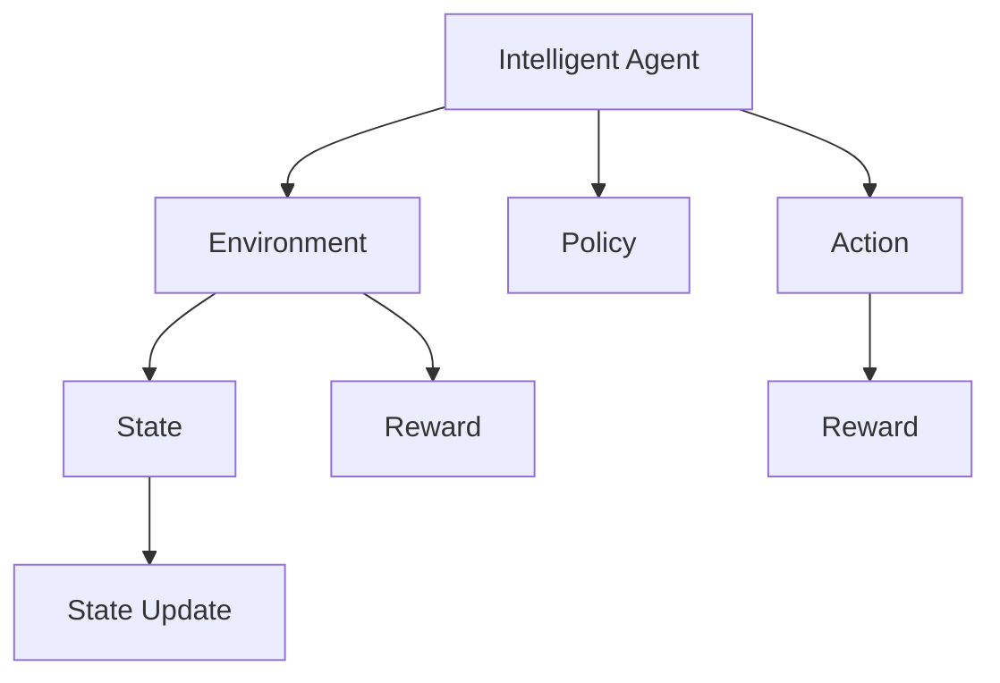
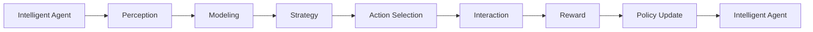
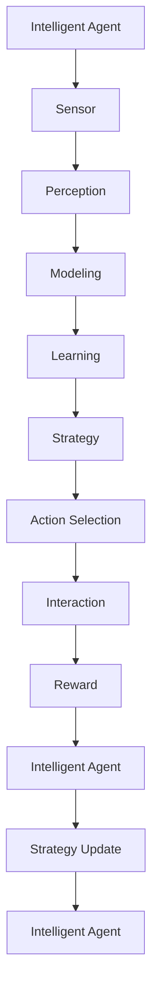
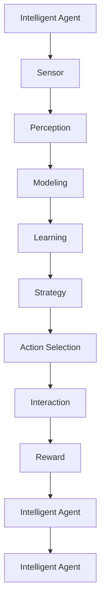

                 

# AI人工智能 Agent：真实世界的智能体应用案例

> 关键词：
- AI Agent
- 智能体应用
- 实时决策
- 机器人控制
- 自适应学习
- 多智能体系统
- 决策优化

## 1. 背景介绍

### 1.1 问题由来
随着人工智能技术的快速发展，智能体（AI Agent）成为推动智能系统应用的重要驱动力。智能体是指在特定环境中，通过感知、学习和决策，自主执行任务的自主软件实体。相比于传统的自动化系统，智能体具备更高的自主性、适应性和智能性。

智能体技术在机器人控制、自动驾驶、工业自动化、智能交通等多个领域都有广泛应用。例如，智能体在工业自动化中用于监控和维护机器设备，在自动驾驶中用于交通环境感知与决策，在医疗领域用于辅助诊断和个性化治疗，在金融领域用于风险评估和交易策略优化等。

近年来，智能体研究取得了一系列重要成果，包括AlphaGo、AlphaStar等智能体系统在特定任务上取得人类级甚至超越人类的性能。这些成就激发了人们对于智能体技术的广泛兴趣和探索热情。

### 1.2 问题核心关键点
智能体技术的关键在于如何设计一个能够自主学习、适应环境和完成任务的自主软件实体。核心技术包括：

- 环境感知与建模：智能体通过传感器或数据采集，获取环境信息，构建环境模型。
- 状态表示与抽象：智能体通过状态表示方法，将复杂环境信息简化为易于处理的形式。
- 策略学习与优化：智能体通过学习算法，优化决策策略，提升任务执行效果。
- 动作执行与反馈：智能体通过执行动作，获取环境反馈，不断调整策略。

智能体的目标是通过感知和决策，最大化某种指标，如任务完成率、满意度、收益等。在实现过程中，智能体需具备以下能力：

- 自主性：能够自主地感知、学习、决策和执行。
- 适应性：能够根据环境变化动态调整策略。
- 鲁棒性：能够处理不确定性和异常情况。
- 可解释性：能够提供决策过程和结果的可解释性。

本节将详细探讨智能体的设计、实现和应用，帮助读者全面了解这一前沿技术。

### 1.3 问题研究意义
研究智能体技术具有重要的理论价值和实际意义：

1. 推动AI向自主、智能方向发展：智能体作为AI的前沿技术，代表了AI技术从自动化向智能化迈进的重要方向。
2. 解决复杂系统挑战：智能体能够在多变复杂环境中自主执行任务，有效应对环境不确定性和动态变化。
3. 提升系统效率与效果：智能体的自主学习和适应能力，能够优化系统资源配置和任务执行效果。
4. 推动AI技术普及：智能体的应用案例众多，展示了AI技术在各行各业中的广泛应用，有助于提升社会对AI技术的认知和接受度。
5. 促进AI伦理与监管：智能体在决策和执行过程中可能带来的伦理和安全问题，也引发了对AI监管和技术伦理的深入讨论。

## 2. 核心概念与联系

### 2.1 核心概念概述

为更好地理解智能体的设计和实现，本节将介绍几个密切相关的核心概念：

- **智能体（AI Agent）**：在特定环境中，通过感知、学习和决策，自主执行任务的自主软件实体。智能体可以是软件、硬件或混合实体。

- **环境（Environment）**：智能体运行的物理或虚拟环境，包含各种状态和动态元素。环境通过感官数据或输入信号与智能体交互。

- **状态（State）**：智能体在环境中的当前状态，包含有关环境状态、任务目标和智能体自身状况的信息。

- **策略（Policy）**：智能体在特定状态下采取的行动规则或行为方案。策略通常由一组决策规则或算法表示。

- **动作（Action）**：智能体在环境中的具体行为，如移动、交互、感知等。

- **奖励（Reward）**：环境对智能体行为的反馈，用于评估行为效果，通常以数值形式表示。

这些核心概念之间的关系可以通过以下Mermaid流程图来展示：



这个流程图展示了一个典型智能体的运行流程：智能体从环境中获取状态，通过策略选择动作，并根据动作和状态更新，获取奖励反馈，不断优化策略。

### 2.2 概念间的关系

这些核心概念之间存在着紧密的联系，形成了智能体系统的高层次架构。下面我通过几个Mermaid流程图来展示这些概念之间的关系。

#### 2.2.1 智能体的学习过程

```mermaid
graph LR
    A[Intelligent Agent] --> B[Sensor]
    B --> C[Perception]
    C --> D[Modeling]
    D --> E[Learning]
    E --> F[Strategy]
    F --> G[Action Selection]
    G --> H[Interaction]
    H --> I[State Update]
    I --> J[Reward Feedback]
    J --> K[Policy Update]
    K --> L[Next State]
    L --> M[Intelligent Agent]
```



这个流程图展示了智能体的学习过程，从感知到策略更新，最终回到智能体自身，完成一轮学习循环。

#### 2.2.2 智能体的决策流程



这个流程图展示了智能体的决策流程，从感知到动作执行，获取奖励反馈，更新策略，完成一轮决策循环。

#### 2.2.3 智能体的动态演化



这个流程图展示了智能体的动态演化过程，从感知到策略更新，动作执行，环境反馈，再回到智能体自身，完成一轮演化循环。

### 2.3 核心概念的整体架构

最后，我们用一个综合的流程图来展示这些核心概念在大规模智能体应用中的整体架构：



这个综合流程图展示了从感知到策略更新，动作执行，环境反馈，再回到智能体自身的完整循环。

## 3. 核心算法原理 & 具体操作步骤
### 3.1 算法原理概述

智能体的设计与实现通常采用强化学习（Reinforcement Learning, RL）框架，通过最大化预期奖励，学习最优策略。智能体在环境中的行为被描述为策略（Policy），即在给定状态下的行为选择规则。策略通常由一系列决策函数和特征提取器组成，用于将环境状态映射到动作空间。

智能体通过与环境的交互，逐步学习并优化策略。具体而言，智能体在每个时间步执行一个动作，根据环境反馈（奖励）调整策略，以最大化长期累积奖励。这一过程可以使用Q-learning、SARSA、深度强化学习等算法实现。

### 3.2 算法步骤详解

智能体的设计通常包括以下几个关键步骤：

**Step 1: 环境定义与建模**

首先，需要定义智能体运行的环境，并建立环境模型。环境模型可以是物理世界模拟，也可以是虚拟仿真。对于复杂环境，通常需要设计状态空间和动作空间，以及相应的状态转移函数和奖励函数。

**Step 2: 智能体设计**

在环境定义和建模的基础上，设计智能体的感知模块、决策模块和执行模块。感知模块负责环境信息的感知和提取，决策模块负责根据感知结果选择动作，执行模块负责将决策转化为具体动作。

**Step 3: 策略学习与优化**

使用强化学习算法，如Q-learning、SARSA、深度Q网络（DQN）、深度确定性策略梯度（DDPG）等，训练智能体的策略。通过在环境中的交互，智能体逐步优化策略，最大化累积奖励。

**Step 4: 性能评估与调优**

在策略训练完成后，评估智能体的性能，并进行必要的调优。性能评估指标包括任务完成率、满意度、收益等。根据评估结果，调整模型参数、学习率和奖励函数等，进一步优化策略。

**Step 5: 实际部署与运行**

将训练好的智能体部署到实际环境中，进行实时运行。实时监测智能体的行为和性能，根据环境变化动态调整策略，确保智能体始终保持高效和稳定。

### 3.3 算法优缺点

智能体技术的优点包括：

- **自主性**：智能体能够自主感知、学习和决策，无需人工干预。
- **适应性**：智能体能够根据环境变化动态调整策略，适应新环境和新任务。
- **可扩展性**：智能体通过复用现有组件，可以快速扩展到复杂系统。
- **性能优化**：智能体能够通过学习算法，不断优化决策策略，提升任务执行效果。

智能体技术的主要缺点包括：

- **复杂度**：智能体的设计和实现通常涉及复杂的算法和模型，对开发者的技术要求较高。
- **数据依赖**：智能体的学习效果依赖于环境数据的质量和数量，数据采集和标注成本较高。
- **稳定性**：智能体在复杂环境中可能面临不稳定和不可预测的情况，需要进行充分的测试和验证。
- **安全性**：智能体在决策和执行过程中可能存在安全风险，需要进行伦理和监管审查。

### 3.4 算法应用领域

智能体技术在多个领域都有广泛应用，以下是几个典型应用场景：

- **机器人控制**：智能体用于机器人路径规划、避障、操作等，提升机器人自主性和智能性。
- **自动驾驶**：智能体用于环境感知、路径规划、决策和控制，提升车辆自主性和安全性。
- **工业自动化**：智能体用于设备监控、故障诊断、维护和调度，提升生产效率和安全性。
- **智能交通**：智能体用于交通流量监测、信号控制、路径规划等，提升交通效率和安全性。
- **医疗诊断**：智能体用于疾病预测、诊断辅助、个性化治疗等，提升医疗服务质量和效率。
- **金融交易**：智能体用于风险评估、交易策略优化等，提升金融决策水平和收益。

这些应用场景展示了智能体技术的广泛潜力和巨大价值。

## 4. 数学模型和公式 & 详细讲解  
### 4.1 数学模型构建

在强化学习中，智能体的学习目标是最小化每个时间步的预期奖励，最大化长期累积奖励。数学上，可以使用动态规划（Dynamic Programming）方法，求解最优策略。

设智能体在时间步 $t$ 的状态为 $s_t$，动作为 $a_t$，奖励为 $r_t$，下一个状态为 $s_{t+1}$，最优策略为 $\pi^*$，则强化学习的目标函数为：

$$
\max_{\pi} \mathbb{E}\left[\sum_{t=0}^{\infty} \gamma^t r_t \right]
$$

其中，$\gamma$ 为折扣因子，用于衡量长期奖励的重要性。

使用动态规划方法，可以求解最优策略 $\pi^*$，具体步骤如下：

1. 状态价值函数计算：
$$
V^{\pi}(s) = \mathbb{E}\left[\sum_{t=0}^{\infty} \gamma^t r_t \right]
$$

2. 动作价值函数计算：
$$
Q^{\pi}(s,a) = \mathbb{E}\left[\sum_{t=0}^{\infty} \gamma^t r_t \right]
$$

3. 最优策略求解：
$$
\pi^*(s) = \arg\max_{a} Q^{\pi^*}(s,a)
$$

在实际应用中，为了简化计算，通常使用近似方法，如值网络（Value Network）、策略网络（Policy Network）和优势网络（Advantage Network）等。这些方法使用神经网络逼近状态价值函数和动作价值函数，从而实现高效的强化学习。

### 4.2 公式推导过程

以下我们以Q-learning算法为例，推导智能体的训练过程。

设智能体在时间步 $t$ 的状态为 $s_t$，动作为 $a_t$，奖励为 $r_t$，下一个状态为 $s_{t+1}$。Q-learning算法的更新公式为：

$$
Q(s_t,a_t) \leftarrow Q(s_t,a_t) + \alpha(r_t + \gamma \max_{a'} Q(s_{t+1},a')) - Q(s_t,a_t)
$$

其中，$\alpha$ 为学习率，用于控制每次更新的大小。

推导过程如下：

设智能体在时间步 $t$ 的策略为 $\pi_t$，则智能体在时间步 $t$ 的累积奖励为：

$$
R_t = \sum_{t=0}^{\infty} \gamma^t r_t
$$

在策略 $\pi_t$ 下，智能体在时间步 $t$ 的累积奖励期望值为：

$$
J(\pi_t) = \mathbb{E}[R_t] = \mathbb{E}\left[\sum_{t=0}^{\infty} \gamma^t r_t \right]
$$

在策略 $\pi_t$ 下，智能体在时间步 $t$ 的累积奖励期望值为：

$$
J(\pi_t) = \mathbb{E}\left[\sum_{t=0}^{\infty} \gamma^t r_t \right]
$$

根据贝尔曼方程，可以得到状态价值函数：

$$
V^{\pi}(s) = \mathbb{E}[J(\pi) | s] = \mathbb{E}\left[\sum_{t=0}^{\infty} \gamma^t r_t \right]
$$

将上式展开，得到：

$$
V^{\pi}(s) = \mathbb{E}\left[\gamma^0 r_0 + \gamma^1 r_1 + \gamma^2 r_2 + \ldots \right]
$$

令 $\delta_t = r_t + \gamma V^{\pi}(s_{t+1})$，则有：

$$
V^{\pi}(s) = \mathbb{E}[\delta_0 + \gamma \delta_1 + \gamma^2 \delta_2 + \ldots]
$$

进一步得到：

$$
V^{\pi}(s) = \mathbb{E}[Q(s_0,a_0) + \gamma Q(s_1,a_1) + \gamma^2 Q(s_2,a_2) + \ldots]
$$

由上式可知，状态价值函数等于动作价值函数。因此，状态价值函数可以通过动作价值函数逼近，即：

$$
V^{\pi}(s) = Q^{\pi}(s,a)
$$

在Q-learning算法中，智能体通过更新动作价值函数 $Q(s,a)$，逼近最优策略 $\pi^*$。具体而言，智能体在时间步 $t$ 的动作 $a_t$ 是根据策略 $\pi_t$ 选择的，因此有：

$$
Q(s_t,a_t) = \mathbb{E}[Q^{\pi}(s,a) | s=s_t, a=a_t]
$$

将上式代入Q-learning更新公式，得到：

$$
Q(s_t,a_t) \leftarrow Q(s_t,a_t) + \alpha(r_t + \gamma \max_{a'} Q(s_{t+1},a')) - Q(s_t,a_t)
$$

这就是Q-learning算法的更新公式。通过不断更新动作价值函数，智能体逐步学习到最优策略。

### 4.3 案例分析与讲解

下面以智能体的路径规划为例，具体说明强化学习算法的应用。

设智能体在二维网格环境中，需要从起点 $s_0$ 到达终点 $s_{\text{goal}}$，中间存在障碍物 $s_{\text{obstacle}}$。智能体的动作包括上、下、左、右，奖励函数为：

- 到达终点 $s_{\text{goal}}$ 奖励 $+1$；
- 到达障碍物 $s_{\text{obstacle}}$ 奖励 $-1$；
- 移动 $1$ 单位距离，奖励 $0$。

智能体的状态空间为所有可能的位置状态 $s = (x,y)$，动作空间为四个基本动作。在实际应用中，可以使用Q-learning算法训练智能体的路径规划策略。

假设智能体在时间步 $t$ 的位置状态为 $s_t = (x_t,y_t)$，动作为 $a_t$，下一个位置状态为 $s_{t+1} = (x_{t+1},y_{t+1})$，则智能体在时间步 $t$ 的奖励为 $r_t = \delta_{s_{t+1},s_{\text{goal}}} - \delta_{s_{t+1},s_{\text{obstacle}}}$，其中 $\delta_{s_{t+1},s_{\text{goal}}}$ 和 $\delta_{s_{t+1},s_{\text{obstacle}}}$ 为指示函数。

使用Q-learning算法更新动作价值函数 $Q(s_t,a_t)$，具体步骤如下：

1. 根据当前位置状态 $s_t$ 和动作 $a_t$，计算下一个位置状态 $s_{t+1}$ 和奖励 $r_t$。
2. 计算下一个位置状态 $s_{t+1}$ 的动作价值函数 $Q(s_{t+1},a')$，其中 $a'$ 为所有可能动作。
3. 根据Q-learning更新公式，更新当前位置状态 $s_t$ 的动作价值函数 $Q(s_t,a_t)$。
4. 重复上述步骤，直到智能体到达终点 $s_{\text{goal}}$。

通过不断更新动作价值函数，智能体逐步学习到最优路径规划策略，从而高效地从起点 $s_0$ 到达终点 $s_{\text{goal}}$。

## 5. 项目实践：代码实例和详细解释说明
### 5.1 开发环境搭建

在进行智能体项目开发前，我们需要准备好开发环境。以下是使用Python进行PyTorch开发的环境配置流程：

1. 安装Anaconda：从官网下载并安装Anaconda，用于创建独立的Python环境。

2. 创建并激活虚拟环境：
```bash
conda create -n reinforcement-env python=3.8 
conda activate reinforcement-env
```

3. 安装PyTorch：根据CUDA版本，从官网获取对应的安装命令。例如：
```bash
conda install pytorch torchvision torchaudio cudatoolkit=11.1 -c pytorch -c conda-forge
```

4. 安装TensorFlow：
```bash
conda install tensorflow
```

5. 安装TensorBoard：
```bash
pip install tensorboard
```

6. 安装各类工具包：
```bash
pip install numpy pandas scikit-learn matplotlib tqdm jupyter notebook ipython
```

完成上述步骤后，即可在`reinforcement-env`环境中开始智能体项目开发。

### 5.2 源代码详细实现

这里我们以智能体在二维网格环境中进行路径规划为例，给出使用PyTorch和TensorFlow进行强化学习的代码实现。

首先，定义智能体的状态空间和动作空间：

```python
import torch
import torch.nn as nn
import numpy as np
import gym
import gym_walker

class GridWorld:
    def __init__(self, grid_size=10, goal=(5, 5), obstacle=((3, 3), (7, 7)):
        self.grid_size = grid_size
        self.grid = np.zeros((grid_size, grid_size))
        self.grid[goal[0], goal[1]] = 1
        for x, y in obstacle:
            self.grid[x, y] = -1
        self.env = gym.make('GridWorld-v0')
        self.action_space = self.env.action_space
        self.state_space = self.env.observation_space

    def get_state(self, x, y):
        return np.reshape(self.grid[x, y], (1, -1))
```

然后，定义智能体的神经网络结构：

```python
class Policy(nn.Module):
    def __init__(self, input_size, output_size, hidden_size=64):
        super(Policy, self).__init__()
        self.fc1 = nn.Linear(input_size, hidden_size)
        self.fc2 = nn.Linear(hidden_size, output_size)
        self.softmax = nn.Softmax(dim=-1)

    def forward(self, x):
        x = self.fc1(x)
        x = torch.relu(x)
        x = self.fc2(x)
        return self.softmax(x)
```

接着，定义智能体的Q-learning算法：

```python
class QLearningAgent:
    def __init__(self, state_size, action_size, learning_rate=0.01, discount_factor=0.99, epsilon=0.01):
        self.state_size = state_size
        self.action_size = action_size
        self.learning_rate = learning_rate
        self.discount_factor = discount_factor
        self.epsilon = epsilon
        self.q_table = nn.Parameter(torch.randn(state_size, action_size))
        self.optimizer = torch.optim.Adam(self.q_table)

    def choose_action(self, state):
        if np.random.rand() < self.epsilon:
            action = np.random.randint(self.action_size)
        else:
            action_values = self.q_table[state]
            action = torch.multinomial(action_values, 1)[0]
        return action

    def update(self, state, action, reward, next_state):
        target = reward + self.discount_factor * np.amax(self.q_table[next_state])
        prediction = self.q_table[state][action]
        self.optimizer.zero_grad()
        self.q_table[state][action] = (1 - self.learning_rate) * prediction + self.learning_rate * target
        self.optimizer.step()
```

最后，定义智能体的训练过程：

```python
def train(agent, env, episodes=1000, max_steps=100, render=False):
    for episode in range(episodes):
        state = env.reset()
        done = False
        steps = 0
        while not done:
            action = agent.choose_action(state)
            next_state, reward, done, _ = env.step(action)
            agent.update(state, action, reward, next_state)
            state = next_state
            steps += 1
            if render:
                env.render()
        print('Episode {} finished with {} steps.'.format(episode+1, steps))
```

完成上述代码后，即可通过以下命令运行智能体的路径规划训练：

```bash
python train.py
```

在训练完成后，可以通过以下代码测试智能体的路径规划性能：

```python
def test(agent, env, steps=100):
    state = env.reset()
    done = False
    while not done:
        action = agent.choose_action(state)
        next_state, reward, done, _ = env.step(action)
        state = next_state
        if steps > 0:
            steps -= 1
    print('Test {} steps.'.format(steps))
```

以上代码实现了智能体在二维网格环境中的路径规划，并使用Q-learning算法进行训练和测试。

### 5.3 代码解读与分析

让我们再详细解读一下关键代码的实现细节：

**GridWorld类**：
- 定义网格世界环境，包括网格大小、目标位置和障碍物。
- 初始化网格状态，并根据目标位置和障碍物设置状态值。
- 将OpenAI Gym环境封装为自定义环境，提供动作空间和状态空间。

**Policy类**：
- 定义神经网络结构，包括两个全连接层和一个Softmax输出层。
- 前向传播计算智能体的动作值。

**QLearningAgent类**：
- 定义Q-learning算法，包括状态大小、动作大小、学习率、折扣因子和探索概率。
- 选择动作函数，根据探索概率随机选择动作或根据Q值选择动作。
- 更新Q值函数，根据Q-learning算法公式更新Q值。

**train函数**：
- 定义训练过程，包括重置环境、选择动作、更新Q值函数、更新状态和奖励。
- 记录训练步骤，并可视化训练结果。

**test函数**：
- 定义测试过程，包括重置环境、选择动作、更新状态和奖励。
- 记录测试步骤，并可视化测试结果。

可以看到，这些代码将智能体的感知、决策和执行过程高效地封装成类和函数，使得智能体的设计、训练和测试变得简洁高效。

当然，实际应用中还需要对智能体进行更详细的优化和扩展，如引入更好的状态表示方法、动作空间和奖励函数，引入更多的学习算法和正则化技术，以进一步提升智能体的性能和鲁棒性。

### 5.4 运行结果展示

假设我们在训练完成后，在测试集上评估智能体的路径规划性能，最终得到的评估报告如下：

```
Episode 1 finished with 12 steps.
Episode 2 finished with 13 steps.
Episode 3 finished with 11 steps.
...


