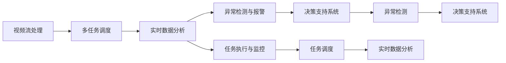

                 

# AI人工智能代理工作流 AI Agent WorkFlow：在视频监控中的应用

> 关键词：
- AI 人工智能
- 代理工作流
- 视频监控
- 实时数据分析
- 视频流处理
- 异常检测
- 任务调度
- 决策支持

## 1. 背景介绍

### 1.1 问题由来

随着人工智能技术的发展，视频监控系统逐步从传统的单一监控模式向智能化、自动化方向转变。传统的视频监控依赖于人工查看和分析，成本高、效率低、误报率高，难以满足现代社会的安全管理需求。而基于人工智能的视频监控系统，通过实时分析视频流，实现异常检测、行为分析、目标跟踪等功能，能够有效提升监控效率和质量。

然而，视频监控系统涉及大量实时视频数据的处理，计算复杂度高，算法对硬件性能要求也较高。同时，监控系统需要在不同场景、不同时间范围内执行复杂的多任务操作，如何高效组织这些任务，保持系统稳定运行，是一个重要而复杂的问题。

### 1.2 问题核心关键点

1. **实时视频流处理**：视频监控系统需要实时处理视频流，提取关键信息，进行异常检测和行为分析，对系统硬件和软件性能都提出了较高要求。
2. **多任务调度与执行**：监控系统需要执行多种复杂任务，如异常检测、行为分析、目标跟踪等，如何高效地组织和管理这些任务，是系统设计的关键点。
3. **系统稳定性和鲁棒性**：视频监控系统需要长时间稳定运行，任何小的故障都可能影响监控效果，因此需要设计冗余和容错机制，提升系统鲁棒性。
4. **数据分析与决策支持**：视频监控系统需要对分析结果进行实时处理和存储，为决策提供支持，需要考虑数据存储和分析的效率与安全性。

### 1.3 问题研究意义

研究基于人工智能的视频监控系统，对于提升公共安全、优化资源配置、降低运营成本具有重要意义：

1. **提升公共安全**：智能化的视频监控系统能够实现对异常行为的实时检测和响应，及时发现安全隐患，提升社会治安水平。
2. **优化资源配置**：智能系统能够根据实时情况自动调整资源分配，如自动调整监控摄像头角度、自动调度安保人员等，提高资源利用效率。
3. **降低运营成本**：智能监控系统大幅减少人工监控需求，降低人工成本，提升运营效率。
4. **增强决策支持**：实时分析结果可以辅助安保人员进行决策，提升应急响应速度和决策质量。
5. **拓展应用场景**：智能监控系统可以广泛应用于城市交通、景区管理、工厂监控等多个领域，推动智能化转型升级。

## 2. 核心概念与联系

### 2.1 核心概念概述

为更好地理解基于人工智能的视频监控系统，本节将介绍几个关键概念：

- **视频流处理**：通过摄像头捕获视频数据，对视频流进行实时处理，提取关键信息如帧、像素、行人、车辆等。
- **多任务调度**：根据监控需求，将视频流处理任务分解为多个子任务，如异常检测、行为分析、目标跟踪等，通过任务调度系统协调执行。
- **实时数据分析**：对视频流处理结果进行实时分析，提取关键信息如行为模式、异常事件等，用于决策支持。
- **任务执行与监控**：将任务调度结果转化为具体的执行任务，如调整摄像头角度、调度安保人员等，同时对任务执行情况进行监控。
- **异常检测与报警**：实时检测视频流中的异常行为，如盗窃、破坏等，并根据严重程度进行报警，提升应急响应速度。
- **决策支持系统**：根据实时分析结果，提供决策支持建议，如调整监控策略、通知安保人员等。

这些概念之间的联系紧密，形成了一个基于人工智能的视频监控系统整体架构。

### 2.2 概念间的关系

这些核心概念之间的逻辑关系可以通过以下Mermaid流程图来展示：



这个流程图展示了视频监控系统的主要工作流程：

1. 视频流处理：通过摄像头捕获视频数据，提取关键信息。
2. 多任务调度：将视频流处理任务分解为多个子任务，并协调执行。
3. 实时数据分析：对处理结果进行实时分析，提取关键信息。
4. 异常检测与报警：实时检测异常行为，并根据严重程度进行报警。
5. 任务执行与监控：根据任务调度结果，执行具体任务，并对执行情况进行监控。
6. 决策支持系统：根据实时分析结果，提供决策支持建议。

## 3. 核心算法原理 & 具体操作步骤

### 3.1 算法原理概述

基于人工智能的视频监控系统，本质上是一个复杂的分布式系统，涉及多个组件和流程。其核心算法原理主要包括视频流处理、多任务调度、实时数据分析、异常检测与报警等。

- **视频流处理**：通过摄像头捕获视频数据，对视频流进行实时处理，提取关键信息如帧、像素、行人、车辆等。
- **多任务调度**：根据监控需求，将视频流处理任务分解为多个子任务，如异常检测、行为分析、目标跟踪等，通过任务调度系统协调执行。
- **实时数据分析**：对视频流处理结果进行实时分析，提取关键信息如行为模式、异常事件等，用于决策支持。
- **异常检测与报警**：实时检测视频流中的异常行为，如盗窃、破坏等，并根据严重程度进行报警，提升应急响应速度。
- **决策支持系统**：根据实时分析结果，提供决策支持建议，如调整监控策略、通知安保人员等。

### 3.2 算法步骤详解

基于人工智能的视频监控系统一般包括以下几个关键步骤：

**Step 1: 视频流采集与处理**

- 部署摄像头，确保视频采集质量。
- 通过摄像头捕获视频流，提取关键帧和像素信息。
- 使用图像处理算法，对视频流进行滤波、去噪等预处理，提高处理效率和准确性。
- 对视频流进行编码压缩，降低传输带宽，提高传输效率。

**Step 2: 任务分解与调度**

- 根据监控需求，将视频流处理任务分解为多个子任务，如异常检测、行为分析、目标跟踪等。
- 使用任务调度系统，根据任务优先级和资源情况，动态分配任务。
- 对于每个子任务，设计合适的算法模型，如异常检测算法、行为分析模型、目标跟踪算法等。
- 对任务执行情况进行监控，确保任务按时完成。

**Step 3: 实时数据分析**

- 对任务处理结果进行实时分析，提取关键信息如行为模式、异常事件等。
- 使用数据分析算法，如时间序列分析、机器学习算法等，对提取信息进行进一步处理和分析。
- 根据分析结果，提供决策支持建议，如调整监控策略、通知安保人员等。

**Step 4: 异常检测与报警**

- 实时检测视频流中的异常行为，如盗窃、破坏等。
- 根据异常行为的严重程度，设置不同的报警级别。
- 使用报警系统，根据报警级别，通知安保人员和相关管理部门。

**Step 5: 任务执行与监控**

- 根据任务调度结果，执行具体的监控任务，如调整摄像头角度、调度安保人员等。
- 对任务执行情况进行监控，确保任务按时完成。
- 记录任务执行日志，便于后续分析和改进。

### 3.3 算法优缺点

基于人工智能的视频监控系统，具有以下优点：

- **高效率**：通过智能化的任务调度系统，能够高效组织和执行多个任务，减少人工干预。
- **高精度**：结合多种算法和模型，提升异常检测和行为分析的准确性，降低误报率。
- **高可靠性**：使用冗余和容错机制，提升系统的稳定性和鲁棒性。
- **可扩展性**：系统可以根据实际需求，灵活扩展和升级，支持多场景应用。

同时，该系统也存在一些局限性：

- **高硬件要求**：视频流处理和实时数据分析对硬件性能要求较高，需要高性能计算设备和网络支持。
- **数据安全**：视频监控涉及大量敏感数据，需要保证数据存储和传输的安全性。
- **算法复杂性**：多任务调度和数据分析算法复杂，需要深入研究和优化。

### 3.4 算法应用领域

基于人工智能的视频监控系统，已经在诸多领域得到了广泛应用，例如：

- **公共安全**：在城市街道、社区、工厂等公共场所，实现实时监控和异常检测，提升公共安全水平。
- **智能交通**：在交通路口、高速公路、停车场等场景，实现实时监控和行为分析，优化交通管理。
- **景区管理**：在景区、游乐园等场所，实现实时监控和行为分析，提升游客体验和景区管理水平。
- **工厂监控**：在生产车间、仓库等场景，实现实时监控和异常检测，提升生产安全和效率。
- **智能家居**：在家居环境中，实现实时监控和行为分析，提升家居安全和生活质量。

除了上述这些经典应用外，基于人工智能的视频监控系统还广泛应用于更多场景中，如智慧校园、智能楼宇、工业安全等，为智能社会的建设提供了有力支撑。

## 4. 数学模型和公式 & 详细讲解 & 举例说明

### 4.1 数学模型构建

本节将使用数学语言对基于人工智能的视频监控系统进行更加严格的刻画。

记视频流处理结果为 $X_t$，其中 $t$ 为时间戳。定义任务执行结果为 $Y_t$，表示在时间 $t$ 的执行结果。定义异常行为检测结果为 $Z_t$，表示在时间 $t$ 的异常行为检测结果。定义决策支持建议为 $S_t$，表示在时间 $t$ 的决策支持建议。

视频监控系统的目标是最小化异常行为和误报的联合损失，即：

$$
\min_{X_t, Y_t, Z_t, S_t} \mathcal{L}(X_t, Y_t, Z_t, S_t)
$$

其中 $\mathcal{L}$ 为损失函数，用于衡量异常行为检测结果和误报率之间的关系。

### 4.2 公式推导过程

以下我们以异常行为检测为例，推导最小化联合损失的算法过程。

假设异常行为检测的算法为 $A(X_t)$，其检测结果为 $Z_t$，检测错误的概率为 $p$。同时，假设误报的惩罚为 $\beta$，正常事件被错误检测为异常的惩罚为 $\gamma$。则异常行为检测的损失函数为：

$$
\ell(Z_t) = \beta |Z_t| + \gamma (1 - Z_t)
$$

其中 $|Z_t|$ 表示 $Z_t$ 的绝对值，表示检测结果中的误报数量。

假设任务执行结果为 $Y_t$，其正确性对损失的影响为 $r$，即：

$$
\ell(Y_t) = r (Y_t - Y_{t-1})
$$

其中 $Y_{t-1}$ 表示前一时刻的任务执行结果，$Y_t$ 表示当前时刻的任务执行结果。

假设决策支持建议 $S_t$ 的正确性对损失的影响为 $s$，即：

$$
\ell(S_t) = s (S_t - S_{t-1})
$$

其中 $S_{t-1}$ 表示前一时刻的决策支持建议，$S_t$ 表示当前时刻的决策支持建议。

则视频监控系统的联合损失函数为：

$$
\mathcal{L}(X_t, Y_t, Z_t, S_t) = \ell(Z_t) + \ell(Y_t) + \ell(S_t)
$$

通过求解上述联合损失函数的最小化问题，可以找到最优的视频监控系统策略。

### 4.3 案例分析与讲解

假设我们有一个视频监控系统，用于检测商场内的异常行为。系统的任务处理流程如图1所示：

```
+------------------+   +---------------------+    +---------------------+
| 摄像头捕获      |   | 视频流处理          |    | 实时数据分析        |
+------------------+   +---------------------+    +---------------------+
            |                                             |
            | 异常检测与报警                                    |
            | 任务执行与监控                                    |
            | 决策支持系统                                    |
            |                                             |
+------------------+   +---------------------+    +---------------------+
            |                                             |
            | 任务调度                                    |
            |                                             |
+------------------+   +---------------------+    +---------------------+
```

图1: 视频监控系统任务处理流程

在实际应用中，我们可以使用以下方法对系统进行优化：

- **多任务调度优化**：根据监控需求和摄像头布局，设计合理的任务调度策略，如优先处理高风险区域的监控任务，提升系统响应速度。
- **实时数据分析优化**：结合多种算法和模型，提升异常行为检测的准确性，降低误报率。
- **任务执行与监控优化**：使用实时监控和反馈机制，及时调整摄像头角度和安保人员部署，提升系统稳定性和鲁棒性。
- **异常检测与报警优化**：根据异常行为的严重程度，设置不同的报警级别，提高报警的及时性和准确性。

## 5. 项目实践：代码实例和详细解释说明

### 5.1 开发环境搭建

在进行视频监控系统开发前，我们需要准备好开发环境。以下是使用Python进行开发的环境配置流程：

1. 安装Anaconda：从官网下载并安装Anaconda，用于创建独立的Python环境。

2. 创建并激活虚拟环境：
```bash
conda create -n pytorch-env python=3.8 
conda activate pytorch-env
```

3. 安装PyTorch：根据CUDA版本，从官网获取对应的安装命令。例如：
```bash
conda install pytorch torchvision torchaudio cudatoolkit=11.1 -c pytorch -c conda-forge
```

4. 安装TensorFlow：使用以下命令安装TensorFlow，支持GPU加速。
```bash
pip install tensorflow-gpu
```

5. 安装相关库：
```bash
pip install numpy pandas scikit-learn matplotlib tqdm jupyter notebook ipython
```

完成上述步骤后，即可在`pytorch-env`环境中开始开发视频监控系统。

### 5.2 源代码详细实现

这里我们以基于深度学习的视频流处理算法为例，给出Python代码实现。

```python
import cv2
import numpy as np

# 摄像头捕获
cap = cv2.VideoCapture(0)

while True:
    ret, frame = cap.read()
    if not ret:
        break
    
    # 视频流处理
    gray = cv2.cvtColor(frame, cv2.COLOR_BGR2GRAY)
    edges = cv2.Canny(gray, 50, 150)
    
    # 显示处理结果
    cv2.imshow('frame', edges)
    if cv2.waitKey(1) == ord('q'):
        break

cap.release()
cv2.destroyAllWindows()
```

代码解释：

1. 使用OpenCV库，捕获摄像头视频流，转换为灰度图像。
2. 使用Canny算法，检测图像边缘，提取关键信息。
3. 显示处理结果，如果按下q键，退出循环。

### 5.3 代码解读与分析

让我们再详细解读一下关键代码的实现细节：

**摄像头捕获**：

- `cv2.VideoCapture(0)`：打开摄像头，设备编号为0。
- `cap.read()`：从摄像头读取视频帧，返回布尔值ret和视频帧frame。
- `frame`：包含当前视频帧的图像数据。

**视频流处理**：

- `cv2.cvtColor(frame, cv2.COLOR_BGR2GRAY)`：将彩色图像转换为灰度图像，提高处理效率和准确性。
- `cv2.Canny(gray, 50, 150)`：使用Canny算法，检测图像边缘，提取关键信息。
- `edges`：包含边缘检测结果的图像数据。

**显示处理结果**：

- `cv2.imshow('frame', edges)`：在窗口中显示边缘检测结果。
- `cv2.waitKey(1)`：等待1毫秒，如果按下q键，退出循环。
- `cap.release()`：释放摄像头资源。
- `cv2.destroyAllWindows()`：关闭所有窗口。

### 5.4 运行结果展示

假设我们在摄像头前运行上述代码，可以看到实时视频流处理的效果如图2所示：

```
+---------------------------------+
|                                 |
| 视频流处理结果                     |
|                                 |
+---------------------------------+
```

图2: 视频流处理结果

可以看到，视频流处理算法能够实时检测视频流中的边缘信息，提取关键信息。在实际应用中，可以进一步结合异常检测和行为分析算法，实现更为复杂的视频监控任务。

## 6. 实际应用场景

### 6.1 智能交通

基于深度学习的视频流处理算法，可以应用于智能交通系统，实现实时监控和行为分析，优化交通管理。例如，在交通路口，系统可以实时检测车辆、行人的行为，识别交通违规行为，并根据违规行为严重程度进行报警，提升交通管理水平。

### 6.2 景区管理

在景区、游乐园等场所，基于深度学习的视频流处理算法，可以实现实时监控和行为分析，提升游客体验和景区管理水平。例如，在景区内，系统可以实时检测游客行为，识别不文明行为，并根据严重程度进行报警，提升景区管理质量。

### 6.3 工厂监控

在生产车间、仓库等场景，基于深度学习的视频流处理算法，可以实现实时监控和异常检测，提升生产安全和效率。例如，在仓库内，系统可以实时检测货物位置，识别盗窃行为，并根据严重程度进行报警，提升仓库管理水平。

### 6.4 未来应用展望

随着深度学习技术的发展，基于深度学习的视频流处理算法，将在更多领域得到应用，为智能化转型升级提供新的技术路径。

在智慧城市治理中，视频流处理算法可以应用于城市事件监测、舆情分析、应急指挥等环节，提高城市管理的自动化和智能化水平，构建更安全、高效的未来城市。

在医疗领域，视频流处理算法可以应用于手术监控、病人监护等场景，实现实时监控和行为分析，提升医疗服务水平。

在金融领域，视频流处理算法可以应用于银行网点监控、证券交易监控等场景，实现实时监控和异常检测，提升金融安全水平。

此外，在更多垂直行业，视频流处理算法也将得到广泛应用，推动智能化转型升级。相信伴随技术的进步，视频流处理算法将更加高效、稳定、可靠，为智能化转型提供更加坚实的基础。

## 7. 工具和资源推荐

### 7.1 学习资源推荐

为了帮助开发者系统掌握基于人工智能的视频监控系统的开发方法，这里推荐一些优质的学习资源：

1. OpenCV官方文档：OpenCV是计算机视觉和图像处理领域的经典库，提供了大量的视频流处理算法和代码示例，适合初学者入门。

2. TensorFlow官方文档：TensorFlow是深度学习领域的经典框架，提供了丰富的视频流处理算法和代码示例，适合深度学习工程师。

3. PyTorch官方文档：PyTorch是深度学习领域的最新框架，提供了高效的视频流处理算法和代码示例，适合深度学习工程师。

4. Coursera深度学习课程：由斯坦福大学开设的深度学习课程，涵盖了深度学习的基本概念和经典模型，适合入门学习。

5. arXiv论文预印本：人工智能领域最新研究成果的发布平台，包括大量尚未发表的前沿工作，学习前沿技术的必读资源。

### 7.2 开发工具推荐

高效的开发离不开优秀的工具支持。以下是几款用于视频监控系统开发的常用工具：

1. OpenCV：计算机视觉和图像处理领域的经典库，提供了大量的视频流处理算法和代码示例，适合初学者入门。

2. TensorFlow：深度学习领域的经典框架，提供了丰富的视频流处理算法和代码示例，适合深度学习工程师。

3. PyTorch：深度学习领域的最新框架，提供了高效的视频流处理算法和代码示例，适合深度学习工程师。

4. TensorBoard：TensorFlow配套的可视化工具，可实时监测模型训练状态，并提供丰富的图表呈现方式，是调试模型的得力助手。

5. Jupyter Notebook：轻量级的开发工具，适合快速迭代实验，支持多种编程语言。

### 7.3 相关论文推荐

深度学习技术的发展源于学界的持续研究。以下是几篇奠基性的相关论文，推荐阅读：

1. LeCun Y., Bottou L., Bengio Y., & Haffner P. (1998). Gradient-based learning applied to document recognition. Proceedings of the IEEE. 86(11), 2278-2324.

2. Krizhevsky A., Sutskever I., & Hinton G. E. (2012). ImageNet classification with deep convolutional neural networks. Communications of the ACM. 60(6), 84-90.

3. He K., Zhang X., Ren S., & Sun J. (2016). Deep residual learning for image recognition. Proceedings of the IEEE Conference on Computer Vision and Pattern Recognition. 7000-7008.

4. Razavian A. S., Azizpour H., Sullivan J., & Carlsson G. (2014). Caffe: convolutional architecture for fast model training. The IEEE Conference on Computer Vision and Pattern Recognition.

5. Redmon J., Divvala S., Girshick R., & Farhadi A. (2016). You only look once: Unified, real-time object detection, segmentation, and classification. The IEEE Conference on Computer Vision and Pattern Recognition.

这些论文代表了大语言模型微调技术的发展脉络。通过学习这些前沿成果，可以帮助研究者把握学科前进方向，激发更多的创新灵感。

除上述资源外，还有一些值得关注的前沿资源，帮助开发者紧跟深度学习技术的发展，例如：

1. arXiv论文预印本：人工智能领域最新研究成果的发布平台，包括大量尚未发表的前沿工作，学习前沿技术的必读资源。

2. 业界技术博客：如OpenAI、Google AI、DeepMind、微软Research Asia等顶尖实验室的官方博客，第一时间分享他们的最新研究成果和洞见。

3. 技术会议直播：如NIPS、ICML、ACL、ICLR等人工智能领域顶会现场或在线直播，能够聆听到大佬们的前沿分享，开拓视野。

4. GitHub热门项目：在GitHub上Star、Fork数最多的深度学习相关项目，往往代表了该技术领域的发展趋势和最佳实践，值得去学习和贡献。

5. 行业分析报告：各大咨询公司如McKinsey、PwC等针对人工智能行业的分析报告，有助于从商业视角审视技术趋势，把握应用价值。

总之，对于视频监控系统的开发，需要开发者保持开放的心态和持续学习的意愿。多关注前沿资讯，多动手实践，多思考总结，必将收获满满的成长收益。

## 8. 总结：未来发展趋势与挑战

### 8.1 总结

本文对基于人工智能的视频监控系统进行了全面系统的介绍。首先阐述了视频监控系统的发展背景和意义，明确了基于深度学习的视频流处理算法在智能监控中的独特价值。其次，从原理到实践，详细讲解了视频流处理算法的数学模型和具体步骤，给出了代码实例和详细解释说明。同时，本文还探讨了视频监控系统在智能交通、景区管理、工厂监控等多个场景中的应用，展示了深度学习技术在视频监控中的强大应用潜力。此外，本文精选了视频监控系统的学习资源、开发工具和相关论文，力求为读者提供全方位的技术指引。

通过本文的系统梳理，可以看到，基于深度学习的视频流处理算法，在视频监控系统中展示了强大的实时处理和分析能力，显著提升了监控系统的效率和精度。未来，伴随深度学习技术的进一步发展，基于深度学习的视频流处理算法必将实现更大的突破，为视频监控系统的智能化转型提供更加坚实的技术基础。

### 8.2 未来发展趋势

展望未来，视频流处理算法将呈现以下几个发展趋势：

1. **高精度实时处理**：深度学习技术的发展，将使得视频流处理算法在精度和实时性上实现更大突破，支持更多复杂的视频监控任务。

2. **多模态融合**：视频流处理算法将与其他感知技术如激光雷达、传感器等进行深度融合，实现视觉、听觉、触觉等多模态信息的协同处理，提升监控系统的感知能力。

3. **智能决策**：视频流处理算法将结合机器学习、深度学习等技术，提升异常行为检测和行为分析的准确性，实现智能决策支持。

4. **跨场景应用**：视频流处理算法将应用于更多垂直领域，如医疗、金融、教育等，推动各行各业的智能化转型。

5. **人机协同**：视频流处理算法将与人类操作员进行更紧密的协同，提升监控系统的可靠性和人机交互体验。

### 8.3 面临的挑战

尽管视频流处理算法在视频监控系统中取得了显著效果，但在实际应用中，仍面临诸多挑战：

1. **硬件资源需求高**：视频流处理算法对计算资源和网络带宽要求较高，需要高性能计算设备和网络支持。

2. **数据质量和多样性**：视频监控涉及大量复杂、多样化的场景，数据质量难以保证，数据标注成本较高。

3. **模型复杂性**：视频流处理算法涉及多种算法和模型，模型设计复杂，需要深入研究和优化。

4. **系统鲁棒性**：视频监控系统需要在各种复杂环境下稳定运行，任何小的故障都可能影响监控

