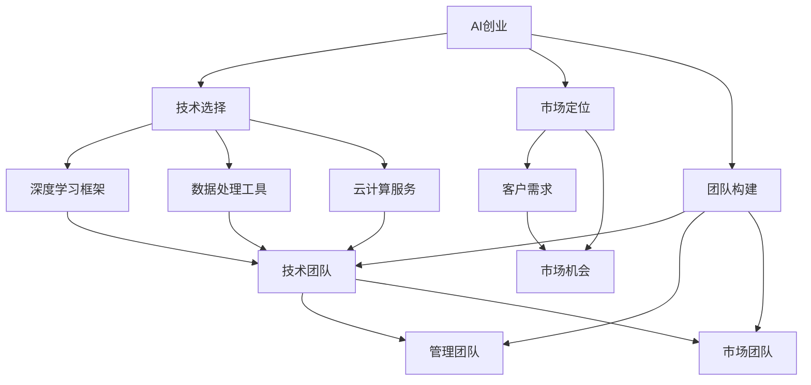
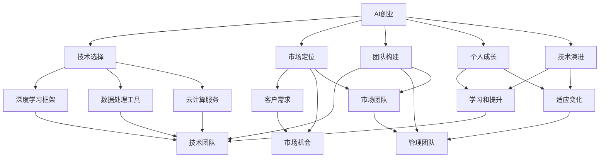

                 

# AI创业者的码头故事：95后博士的选择

> 关键词：AI创业, 博士, 港口, 技术选择

## 1. 背景介绍

### 1.1 问题由来

在全球化和数字化的浪潮中，人工智能（AI）已成为推动经济发展和社会进步的关键力量。AI创业在技术创新、产业升级和解决社会问题等方面展现了巨大潜力。然而，AI创业也是一项充满挑战的任务，创业者的选择和决策将直接影响创业项目的成败。

本文旨在探讨95后博士在AI创业中的选择，从技术、市场、团队和个人成长等方面深入分析，以期为即将踏入AI创业领域的年轻创业者提供有益的启示。

### 1.2 问题核心关键点

AI创业的关键在于选择合适的人工智能技术和应用场景，构建高效的技术栈，打造强大的团队，以及平衡短期与长期目标。本文将重点探讨以下几点：

- **技术选择**：如何选择适合AI创业的技术和框架？
- **市场定位**：如何精准地定位目标市场和客户需求？
- **团队构建**：如何组建高效的技术团队和管理团队？
- **个人成长**：创业过程中个人如何不断学习和成长？

## 2. 核心概念与联系

### 2.1 核心概念概述

1. **AI创业**：利用人工智能技术解决实际问题、创造商业价值的过程。
2. **技术栈**：支持AI创业的技术框架、工具和平台，如深度学习框架、数据处理工具、云计算服务等。
3. **市场定位**：识别目标客户和市场机会，制定产品和服务策略。
4. **团队构建**：组建具有技术、管理和市场能力的团队，确保创业项目的顺利进行。
5. **个人成长**：创业者在创业过程中不断学习和提升个人能力，适应变化和挑战。

### 2.2 概念间的关系

这些概念之间的逻辑关系可以通过以下Mermaid流程图来展示：



这个流程图展示了AI创业的基本流程和技术栈：

1. AI创业的基础是技术选择，如深度学习框架、数据处理工具和云计算服务。
2. 市场定位需要识别客户需求和市场机会。
3. 团队构建涉及组建技术、管理和市场团队，确保项目顺利进行。
4. 技术栈的选择直接影响项目的技术实现和性能表现。
5. 市场定位和团队构建需要紧密结合，以确保项目的市场适应性和团队协作效率。

### 2.3 核心概念的整体架构

最后，我们用一个综合的流程图来展示这些核心概念在大语言模型微调过程中的整体架构：



这个综合流程图展示了AI创业中各个环节的相互关系和作用，以及技术、市场、团队和个人成长之间的相互作用。

## 3. 核心算法原理 & 具体操作步骤

### 3.1 算法原理概述

AI创业的核心算法包括深度学习、自然语言处理、计算机视觉和强化学习等。其中，深度学习框架如TensorFlow、PyTorch是支持AI创业的主要工具。AI创业的算法原理主要包括以下几个方面：

- **深度学习**：通过多层神经网络模拟人脑的神经网络结构，实现复杂数据和模式的学习和预测。
- **自然语言处理（NLP）**：利用语言模型和序列模型，处理文本数据，进行文本分类、情感分析和机器翻译等任务。
- **计算机视觉**：通过卷积神经网络（CNN）和循环神经网络（RNN），处理图像和视频数据，进行目标检测、图像分类和视频分析等任务。
- **强化学习**：通过奖励机制和环境反馈，训练智能体（如机器人、游戏玩家），使其在复杂环境中自主决策。

### 3.2 算法步骤详解

以下是AI创业中深度学习框架和模型的典型步骤：

1. **数据预处理**：清洗、标注和分割数据集，准备训练和验证集。
2. **模型选择和训练**：根据任务选择合适的深度学习模型（如卷积神经网络、循环神经网络、自编码器等），使用数据集进行模型训练。
3. **模型调优**：根据验证集上的性能，调整模型参数，如学习率、批量大小、正则化参数等。
4. **模型评估和部署**：在测试集上评估模型性能，部署模型到生产环境，进行实时推理和预测。

### 3.3 算法优缺点

AI创业中的深度学习框架具有以下优点：

- **强大的建模能力**：能够处理大规模复杂数据，发现数据中的隐含模式和规律。
- **灵活的框架**：支持多种深度学习模型和架构，适合不同应用场景。
- **丰富的社区资源**：有大量的开源项目和工具，提供技术支持和资源共享。

同时，也存在以下缺点：

- **高计算需求**：训练深度学习模型需要大量的计算资源，如高性能计算集群、GPU等。
- **数据依赖性高**：模型性能高度依赖于数据质量和数量，数据偏差可能导致模型性能不佳。
- **解释性差**：深度学习模型的决策过程缺乏解释性，难以理解模型内部工作机制。

### 3.4 算法应用领域

AI创业中的深度学习框架广泛应用在以下几个领域：

- **医疗健康**：利用图像和文本数据，进行疾病诊断、影像分析和健康监测等。
- **金融科技**：通过分析和预测金融市场数据，进行风险管理、投资分析和智能投顾等。
- **智能制造**：利用传感器数据，进行设备监控、质量控制和智能生产等。
- **智慧城市**：通过物联网和传感器数据，进行交通管理、环境监测和城市管理等。
- **智能客服**：利用自然语言处理技术，进行智能问答、情感分析和客户服务自动化等。

## 4. 数学模型和公式 & 详细讲解 & 举例说明

### 4.1 数学模型构建

AI创业中深度学习模型的数学模型通常包括以下几个部分：

- **输入层**：将原始数据转化为模型可以处理的数值形式。
- **隐藏层**：通过多层神经网络进行特征提取和抽象。
- **输出层**：根据任务类型，输出预测结果或分类标签。

### 4.2 公式推导过程

以卷积神经网络（CNN）为例，其数学模型推导如下：

$$
f(x) = \sigma(\mathbf{W} \cdot \phi(x) + b)
$$

其中，$\phi(x)$ 表示输入数据经过卷积和池化后的特征向量，$\mathbf{W}$ 和 $b$ 表示卷积核和偏置项，$\sigma$ 表示激活函数。

### 4.3 案例分析与讲解

假设我们利用卷积神经网络进行手写数字识别，输入层为28x28的灰度图像，输出层为10个神经元，表示0到9的数字。使用softmax函数作为输出层的激活函数。在训练过程中，使用交叉熵损失函数：

$$
\mathcal{L} = -\sum_{i=1}^N y_i \log \hat{y}_i
$$

其中，$y_i$ 表示真实标签，$\hat{y}_i$ 表示模型预测的概率分布。

## 5. 项目实践：代码实例和详细解释说明

### 5.1 开发环境搭建

以下是Python环境下使用TensorFlow进行卷积神经网络开发的教程。

1. 安装Anaconda：
```
conda create -n tensorflow-env python=3.8
conda activate tensorflow-env
```

2. 安装TensorFlow：
```
pip install tensorflow
```

3. 安装必要的库：
```
pip install numpy matplotlib scikit-learn
```

### 5.2 源代码详细实现

以下是一个简单的手写数字识别模型，使用MNIST数据集进行训练和测试：

```python
import tensorflow as tf
from tensorflow import keras

# 加载数据集
(x_train, y_train), (x_test, y_test) = keras.datasets.mnist.load_data()

# 数据预处理
x_train = x_train.reshape((60000, 28, 28, 1)).astype('float32') / 255
x_test = x_test.reshape((10000, 28, 28, 1)).astype('float32') / 255

# 定义模型
model = keras.Sequential([
    keras.layers.Conv2D(32, (3, 3), activation='relu', input_shape=(28, 28, 1)),
    keras.layers.MaxPooling2D((2, 2)),
    keras.layers.Flatten(),
    keras.layers.Dense(10, activation='softmax')
])

# 编译模型
model.compile(optimizer='adam', loss='sparse_categorical_crossentropy', metrics=['accuracy'])

# 训练模型
model.fit(x_train, y_train, epochs=5, batch_size=64, validation_split=0.2)

# 评估模型
model.evaluate(x_test, y_test)
```

### 5.3 代码解读与分析

以上代码展示了卷积神经网络的基本结构和训练流程。模型首先定义了一个包含卷积层、池化层和全连接层的神经网络结构，然后在MNIST数据集上进行训练，最后评估模型的性能。

## 6. 实际应用场景

### 6.1 智能制造

在智能制造领域，AI创业项目可以开发智能监控系统，利用传感器数据进行设备状态检测和故障预测。例如，利用卷积神经网络对工厂监控摄像头拍摄的图像进行分析，识别设备运行异常情况，提前进行维护和维修，减少停机时间和生产损失。

### 6.2 智慧城市

智慧城市项目可以通过AI技术，优化交通管理、环境监测和公共服务。例如，利用计算机视觉技术，实时分析城市交通摄像头拍摄的图像，识别交通拥堵和事故，优化交通信号控制。或者利用自然语言处理技术，进行城市舆情分析，提升城市管理水平。

### 6.3 金融科技

金融科技领域，AI创业项目可以开发智能投顾系统，通过分析市场数据和用户行为，提供个性化投资建议和资产管理服务。例如，利用深度学习模型，分析股票价格走势和市场情绪，预测股票价格变化，辅助用户进行投资决策。

### 6.4 未来应用展望

未来，AI创业项目将更多地结合人工智能技术和应用场景，推动各行业的智能化升级。例如，通过人工智能技术，优化供应链管理，提高生产效率和产品质量。或者利用自然语言处理技术，提升客服自动化水平，改善用户体验。

## 7. 工具和资源推荐

### 7.1 学习资源推荐

1. **《深度学习》（Ian Goodfellow）**：全面介绍深度学习理论和实践，适合初学者和进阶者阅读。
2. **Kaggle**：提供大量机器学习和数据科学竞赛，可以学习和实践实际项目。
3. **GitHub**：查找和学习开源项目，了解前沿技术。
4. **Coursera**：提供机器学习和深度学习的在线课程，由世界顶尖大学和专家讲授。
5. **Deep Learning Specialization by Andrew Ng**：斯坦福大学提供的一系列深度学习课程，系统介绍深度学习理论和实践。

### 7.2 开发工具推荐

1. **PyTorch**：灵活的深度学习框架，易于调试和优化。
2. **TensorFlow**：功能强大的深度学习框架，适合大规模分布式训练。
3. **Jupyter Notebook**：交互式编程环境，方便代码调试和共享。
4. **Git**：版本控制系统，方便代码管理和协作。
5. **Docker**：容器化技术，方便部署和环境隔离。

### 7.3 相关论文推荐

1. **ImageNet Classification with Deep Convolutional Neural Networks**：AlexNet论文，引入卷积神经网络，开启深度学习在计算机视觉领域的应用。
2. **Deep Residual Learning for Image Recognition**：ResNet论文，提出残差网络结构，解决深度神经网络中的梯度消失问题。
3. **Attention is All You Need**：Transformer论文，提出自注意力机制，推动自然语言处理领域的发展。
4. **GANs Trained by a Two Time-Scale Update Rule Converge to the Naive Mode**：GAN论文，提出生成对抗网络，推动生成模型在图像生成、风格迁移等领域的应用。

## 8. 总结：未来发展趋势与挑战

### 8.1 总结

本文深入探讨了95后博士在AI创业中的选择，分析了技术、市场、团队和个人成长等多个方面。AI创业是一个充满挑战和机遇的过程，选择合适的人工智能技术和应用场景，构建高效的技术栈，打造强大的团队，平衡短期与长期目标，是创业成功的关键。

通过本文的系统梳理，可以看到，AI创业需要创业者具备多元化的能力和资源，不断学习和实践，才能在激烈的竞争中立于不败之地。

### 8.2 未来发展趋势

未来，AI创业将呈现以下几个趋势：

1. **技术融合**：AI创业项目将更多地结合人工智能技术和实际应用场景，推动各行业的智能化升级。
2. **模型集成**：通过集成多种AI技术，提升系统性能和鲁棒性，解决复杂问题。
3. **数据驱动**：数据驱动的AI创业项目将更加重视数据质量和数量，优化数据预处理和特征工程。
4. **模型解释性**：提升AI模型的可解释性和透明性，增强用户信任和接受度。
5. **跨领域应用**：AI创业项目将更多地应用于跨领域场景，如医疗、金融、制造等。

### 8.3 面临的挑战

尽管AI创业具有广阔的前景，但也面临着诸多挑战：

1. **技术门槛高**：深度学习、自然语言处理等技术复杂，需要深厚的技术积累。
2. **数据依赖性高**：数据质量和数量对模型性能至关重要，获取高质量数据成本较高。
3. **模型解释性差**：深度学习模型缺乏解释性，难以理解模型内部工作机制。
4. **市场竞争激烈**：AI创业项目面临激烈的市场竞争，需要不断创新和优化。
5. **法律和伦理问题**：AI技术应用可能带来隐私、安全等法律和伦理问题，需要严格遵守法律法规。

### 8.4 研究展望

未来的AI创业研究需要关注以下几个方面：

1. **技术突破**：推动深度学习、自然语言处理等技术的发展，提升模型的性能和鲁棒性。
2. **应用场景拓展**：研究AI技术在不同领域的应用，推动技术落地和产业化。
3. **数据治理**：制定数据治理标准和规范，保护数据隐私和安全。
4. **伦理与社会责任**：研究AI技术的伦理和社会责任问题，推动技术的健康发展。

## 9. 附录：常见问题与解答

**Q1：AI创业如何选择合适的技术框架？**

A: 选择合适的技术框架需要考虑项目需求、团队技术栈和资源条件。一般来说，深度学习框架如TensorFlow、PyTorch具有强大的建模能力和丰富的社区支持。可以根据项目的具体需求选择合适的框架。

**Q2：AI创业如何处理数据偏差问题？**

A: 数据偏差是AI创业中常见的问题，可以通过以下方法处理：
1. 数据清洗：去除噪声和异常值，提高数据质量。
2. 数据增强：通过数据扩充和增强，减少数据偏差。
3. 迁移学习：利用预训练模型，从相似任务中迁移知识，提高模型泛化能力。
4. 模型校正：通过模型校正和微调，调整模型参数，减少数据偏差的影响。

**Q3：AI创业如何优化模型性能？**

A: 优化模型性能需要从多个方面入手：
1. 模型选择：选择合适的模型架构和算法，适应任务需求。
2. 数据预处理：优化数据预处理流程，提高数据质量和模型性能。
3. 超参数调优：通过交叉验证和超参数调优，找到最优参数组合。
4. 模型集成：通过集成多个模型，提升模型性能和鲁棒性。

**Q4：AI创业如何管理团队和技术？**

A: 管理团队和技术需要具备以下能力：
1. 团队建设：招聘和培养技术和管理人才，打造高效的团队。
2. 项目管理：制定项目计划和里程碑，跟踪项目进度和质量。
3. 技术协作：建立良好的技术协作机制，推动团队高效工作。
4. 技术演进：跟踪最新的技术进展，不断引入新技术和方法。

**Q5：AI创业如何平衡短期与长期目标？**

A: 平衡短期与长期目标需要以下策略：
1. 制定明确的短期目标和长期目标，优先实现短期目标。
2. 在短期目标基础上，逐步推进长期目标。
3. 定期评估目标进展，及时调整策略和方向。
4. 保持灵活性和创新性，应对市场和技术变化。

---

作者：禅与计算机程序设计艺术 / Zen and the Art of Computer Programming

