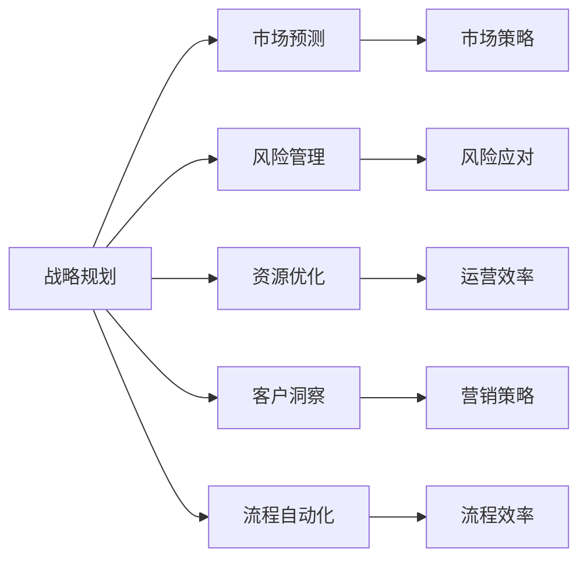
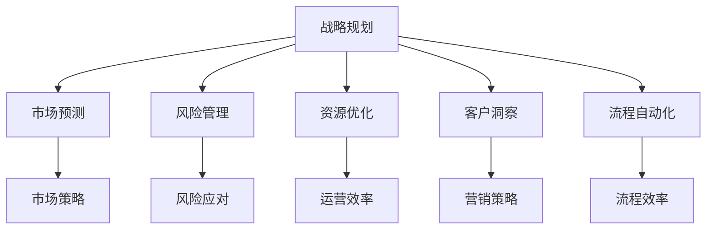
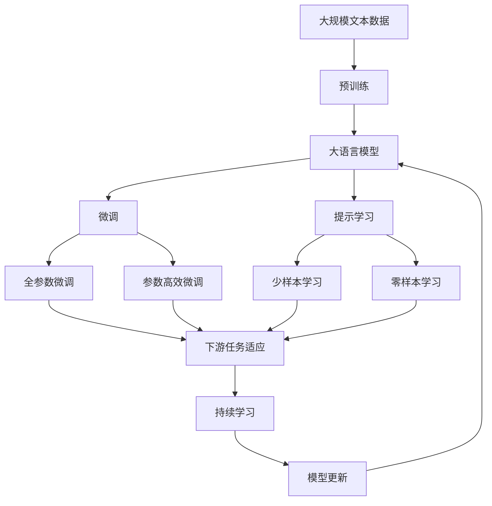

                 

# AI在企业战略规划中的辅助作用

> 关键词：企业战略,人工智能,商业决策,大数据,深度学习,决策支持系统,自动化流程,人力资源管理

## 1. 背景介绍

### 1.1 问题由来

在现代商业世界中，企业面临着日益复杂的市场环境、迅猛发展的技术变革以及高度竞争的市场需求。如何制定高效、灵活、可持续的战略规划，成为企业面对的重大挑战。传统的战略规划方法主要依赖经验、直觉和定性分析，但在快速变化的商业环境中，这些方法往往难以准确预测市场趋势和业务风险。因此，借助人工智能（AI）和大数据等先进技术，进行科学的战略规划变得越来越重要。

AI技术的兴起，特别是机器学习和深度学习的发展，为企业的战略规划提供了新的视角和方法。通过大数据分析和机器学习模型，企业可以更准确地预测市场趋势，识别潜在风险，优化资源配置，从而制定更科学的战略决策。本文将探讨AI在企业战略规划中的具体应用和实践，介绍其核心概念、算法原理和技术实现，为读者提供全面的理论和技术支持。

### 1.2 问题核心关键点

AI在企业战略规划中的应用，主要体现在以下几个方面：

- **市场预测**：利用机器学习模型对市场数据进行预测，帮助企业把握市场趋势，调整战略方向。
- **风险管理**：通过数据分析和模型训练，识别潜在风险，评估风险影响，制定风险应对策略。
- **资源优化**：运用AI技术优化资源配置，提高运营效率，降低成本。
- **客户洞察**：利用客户数据分析，理解客户需求和行为，制定精准的营销策略。
- **流程自动化**：应用自动化流程技术，提升业务流程效率，减少人工干预。

AI在战略规划中的应用，涉及多种技术和工具，包括但不限于大数据分析、机器学习、深度学习、自然语言处理等。这些技术的应用，使得企业战略规划更加科学、精准和高效。

## 2. 核心概念与联系

### 2.1 核心概念概述

为更好地理解AI在企业战略规划中的应用，本节将介绍几个密切相关的核心概念：

- **战略规划（Strategic Planning）**：企业为实现长期目标，通过分析内外部环境，制定长期和短期发展计划的过程。
- **市场预测（Market Forecasting）**：利用统计模型、机器学习等技术，对市场趋势和需求进行预测，帮助企业制定市场策略。
- **风险管理（Risk Management）**：识别和评估潜在风险，制定相应的风险应对措施，保障企业运营安全。
- **资源优化（Resource Optimization）**：通过AI技术优化资源配置，提高运营效率，降低成本。
- **客户洞察（Customer Insight）**：利用数据分析和机器学习，理解客户需求和行为，制定精准的营销策略。
- **流程自动化（Process Automation）**：通过AI技术实现业务流程自动化，提升效率和准确性。

这些核心概念之间的逻辑关系可以通过以下Mermaid流程图来展示：



这个流程图展示了几大核心概念之间的联系：

1. 战略规划是核心，包括市场预测、风险管理、资源优化、客户洞察和流程自动化等关键环节。
2. 市场预测和风险管理为战略规划提供数据支持，帮助企业把握市场趋势和潜在风险。
3. 资源优化和流程自动化提高运营效率和流程准确性，为战略规划提供基础保障。
4. 客户洞察帮助企业精准制定营销策略，提升客户满意度和市场竞争力。

### 2.2 概念间的关系

这些核心概念之间存在着紧密的联系，形成了企业战略规划的完整生态系统。下面我通过几个Mermaid流程图来展示这些概念之间的关系。

#### 2.2.1 战略规划的整体架构



这个综合流程图展示了大语言模型的核心概念和大语言模型微调过程中的整体架构：

1. 战略规划是核心，包括市场预测、风险管理、资源优化、客户洞察和流程自动化等关键环节。
2. 市场预测和风险管理为战略规划提供数据支持，帮助企业把握市场趋势和潜在风险。
3. 资源优化和流程自动化提高运营效率和流程准确性，为战略规划提供基础保障。
4. 客户洞察帮助企业精准制定营销策略，提升客户满意度和市场竞争力。

### 2.3 核心概念的整体架构

最后，我们用一个综合的流程图来展示这些核心概念在大语言模型微调过程中的整体架构：



这个综合流程图展示了从预训练到微调，再到持续学习的完整过程。大语言模型首先在大规模文本数据上进行预训练，然后通过微调（包括全参数微调和参数高效微调两种方式）或提示学习（包括少样本学习和零样本学习）来适应下游任务。最后，通过持续学习技术，模型可以不断更新和适应新的任务和数据。 通过这些流程图，我们可以更清晰地理解AI在企业战略规划过程中各个环节的应用。

## 3. 核心算法原理 & 具体操作步骤
### 3.1 算法原理概述

AI在企业战略规划中的应用，主要基于数据驱动的分析和预测技术。其核心算法包括但不限于：

- **线性回归（Linear Regression）**：用于预测连续变量的值，常用于市场预测。
- **逻辑回归（Logistic Regression）**：用于分类问题，常用于风险评估。
- **决策树（Decision Tree）**：用于分类和回归问题，常用于资源优化。
- **随机森林（Random Forest）**：用于分类和回归问题，常用于风险管理和客户洞察。
- **支持向量机（Support Vector Machine）**：用于分类和回归问题，常用于资源优化和风险管理。
- **神经网络（Neural Networks）**：用于复杂的非线性模型，常用于市场预测和客户洞察。

这些算法通常使用大量的历史数据进行训练，通过分析和预测模型对未来市场趋势、风险和资源需求进行预测，帮助企业制定科学的战略决策。

### 3.2 算法步骤详解

AI在企业战略规划中的具体操作步骤包括以下几个关键步骤：

**Step 1: 数据准备**

- 收集与战略规划相关的数据，包括市场数据、历史财务数据、客户数据、运营数据等。
- 对数据进行清洗和预处理，去除噪声和异常值，确保数据质量。

**Step 2: 特征工程**

- 提取和构建与战略规划相关的特征，如市场规模、增长率、客户满意度等。
- 使用特征工程技术，将原始数据转换为模型所需的特征表示。

**Step 3: 模型训练**

- 选择合适的算法，并根据历史数据进行模型训练。
- 使用交叉验证等技术评估模型性能，并进行调参优化。

**Step 4: 结果解释**

- 对模型预测结果进行解释，帮助企业理解和信任模型的输出。
- 结合业务经验，对预测结果进行人工审核和调整。

**Step 5: 战略决策**

- 基于模型预测结果，制定具体的战略决策和行动计划。
- 定期评估战略效果，进行动态调整和优化。

### 3.3 算法优缺点

AI在企业战略规划中的应用，具有以下优点：

- **准确性高**：通过大数据分析和机器学习模型，可以提供更准确的市场预测和风险评估。
- **时效性好**：模型可以实时处理和预测，帮助企业及时调整战略。
- **灵活性强**：模型可以适应不同数据和业务场景，提供定制化的解决方案。

但同时，也存在一些缺点：

- **数据依赖性强**：模型的性能高度依赖于数据质量，数据不全或噪声多会导致预测结果不准确。
- **模型复杂度高**：复杂模型需要较高的计算资源和专业知识，对企业和数据科学家的要求较高。
- **解释性差**：黑盒模型难以解释内部决策过程，给业务理解带来挑战。

### 3.4 算法应用领域

AI在企业战略规划中的应用，广泛涵盖多个领域，包括但不限于：

- **市场分析**：预测市场规模、增长率、竞争态势等，制定市场进入和退出策略。
- **客户洞察**：分析客户需求、行为和满意度，制定精准的营销策略。
- **产品开发**：预测市场需求和趋势，指导新产品开发和迭代。
- **供应链管理**：预测供应链需求、成本和风险，优化资源配置。
- **风险管理**：识别潜在风险，评估风险影响，制定应对策略。
- **人力资源管理**：预测人才需求，优化招聘和培训计划。
- **财务分析**：预测财务状况和盈利能力，制定财务策略。

这些应用领域展示了AI在企业战略规划中的广泛适用性和深远影响。

## 4. 数学模型和公式 & 详细讲解  
### 4.1 数学模型构建

在本节中，我们将使用数学语言对AI在企业战略规划中的应用进行更加严格的刻画。

假设企业战略规划的目标是最大化利润，其数学模型可以表示为：

$$
\max_{x} \sum_{i} P_i x_i - C(x)
$$

其中 $x$ 为决策变量，$P_i$ 为第 $i$ 项产品的利润，$C(x)$ 为决策成本函数。模型目标是通过优化决策变量 $x$，使得总利润最大化。

### 4.2 公式推导过程

在实际应用中，我们通常使用线性回归模型来预测市场需求和利润，推导过程如下：

1. 假设市场需求 $D$ 可以表示为：

$$
D = \alpha_0 + \alpha_1 x_1 + \alpha_2 x_2 + \ldots + \alpha_n x_n + \epsilon
$$

其中 $\epsilon$ 为误差项，$\alpha_i$ 为回归系数。

2. 利润函数 $P$ 可以表示为：

$$
P = \beta_0 + \beta_1 D + \beta_2 C + \beta_3 T + \ldots + \beta_n E + \delta
$$

其中 $\delta$ 为误差项，$\beta_i$ 为回归系数。

3. 将市场需求 $D$ 代入利润函数 $P$，得到：

$$
P = \beta_0 + \beta_1 (\alpha_0 + \alpha_1 x_1 + \alpha_2 x_2 + \ldots + \alpha_n x_n + \epsilon) + \beta_2 C + \beta_3 T + \ldots + \beta_n E + \delta
$$

4. 简化后得到：

$$
P = \beta_0 + (\beta_1 \alpha_0 + \beta_1 \alpha_1 x_1 + \beta_1 \alpha_2 x_2 + \ldots + \beta_1 \alpha_n x_n + \beta_1 \epsilon) + \beta_2 C + \beta_3 T + \ldots + \beta_n E + \delta
$$

5. 进一步简化，得到：

$$
P = \beta_0 + \beta_1 \alpha_0 + (\beta_1 \alpha_1 + \beta_2) x_1 + (\beta_1 \alpha_2 + \beta_3) x_2 + \ldots + (\beta_1 \alpha_n + \beta_n) x_n + \beta_1 \epsilon + \beta_2 C + \beta_3 T + \ldots + \beta_n E + \delta
$$

### 4.3 案例分析与讲解

以一个简单的案例为例，说明AI在企业战略规划中的应用。假设某电商企业希望优化其在线销售策略，可以通过以下步骤实现：

1. 数据准备：收集在线销售数据，包括用户浏览量、购买量、退货量等。
2. 特征工程：提取与销售相关的特征，如用户年龄、购买次数、价格等。
3. 模型训练：选择适合的算法（如随机森林、神经网络），并根据历史数据进行模型训练。
4. 结果解释：对模型预测结果进行解释，如预测某用户将购买某产品的概率。
5. 战略决策：根据预测结果，制定促销活动、价格策略等。

## 5. 项目实践：代码实例和详细解释说明
### 5.1 开发环境搭建

在进行AI在企业战略规划中的应用实践前，我们需要准备好开发环境。以下是使用Python进行PyTorch开发的环境配置流程：

1. 安装Anaconda：从官网下载并安装Anaconda，用于创建独立的Python环境。

2. 创建并激活虚拟环境：
```bash
conda create -n pytorch-env python=3.8 
conda activate pytorch-env
```

3. 安装PyTorch：根据CUDA版本，从官网获取对应的安装命令。例如：
```bash
conda install pytorch torchvision torchaudio cudatoolkit=11.1 -c pytorch -c conda-forge
```

4. 安装transformers库：
```bash
pip install transformers
```

5. 安装各类工具包：
```bash
pip install numpy pandas scikit-learn matplotlib tqdm jupyter notebook ipython
```

完成上述步骤后，即可在`pytorch-env`环境中开始AI在企业战略规划中的应用实践。

### 5.2 源代码详细实现

下面以电商企业在线销售优化为例，给出使用Transformers库进行AI在企业战略规划中的应用的PyTorch代码实现。

首先，定义电商企业在线销售的数据处理函数：

```python
from transformers import BertTokenizer
from torch.utils.data import Dataset
import torch

class ECommerceDataset(Dataset):
    def __init__(self, sales_data, tokenizer, max_len=128):
        self.sales_data = sales_data
        self.tokenizer = tokenizer
        self.max_len = max_len
        
    def __len__(self):
        return len(self.sales_data)
    
    def __getitem__(self, item):
        sale = self.sales_data[item]
        tokenized_sale = self.tokenizer(sale['item'], return_tensors='pt', max_length=self.max_len, padding='max_length', truncation=True)
        input_ids = tokenized_sale['input_ids'][0]
        attention_mask = tokenized_sale['attention_mask'][0]
        label = torch.tensor(sale['converted'], dtype=torch.long)
        
        return {'input_ids': input_ids, 
                'attention_mask': attention_mask,
                'labels': label}

# 定义电商企业在线销售的预测函数
def predict_sales(sales_data, tokenizer, model, batch_size):
    dataloader = DataLoader(sales_data, batch_size=batch_size, shuffle=True)
    model.eval()
    sales_predictions = []
    
    for batch in dataloader:
        input_ids = batch['input_ids'].to(device)
        attention_mask = batch['attention_mask'].to(device)
        labels = batch['labels'].to(device)
        outputs = model(input_ids, attention_mask=attention_mask, labels=labels)
        predictions = outputs.logits.argmax(dim=2).to('cpu').tolist()
        sales_predictions.extend(predictions)
        
    return sales_predictions
```

然后，定义模型和优化器：

```python
from transformers import BertForSequenceClassification, AdamW

model = BertForSequenceClassification.from_pretrained('bert-base-cased', num_labels=2)

optimizer = AdamW(model.parameters(), lr=2e-5)
```

接着，定义训练和评估函数：

```python
from sklearn.metrics import accuracy_score

device = torch.device('cuda') if torch.cuda.is_available() else torch.device('cpu')
model.to(device)

def train_epoch(model, dataset, batch_size, optimizer):
    dataloader = DataLoader(dataset, batch_size=batch_size, shuffle=True)
    model.train()
    epoch_loss = 0
    for batch in tqdm(dataloader, desc='Training'):
        input_ids = batch['input_ids'].to(device)
        attention_mask = batch['attention_mask'].to(device)
        labels = batch['labels'].to(device)
        model.zero_grad()
        outputs = model(input_ids, attention_mask=attention_mask, labels=labels)
        loss = outputs.loss
        epoch_loss += loss.item()
        loss.backward()
        optimizer.step()
    return epoch_loss / len(dataloader)

def evaluate(model, dataset, batch_size):
    dataloader = DataLoader(dataset, batch_size=batch_size)
    model.eval()
    predictions, labels = [], []
    with torch.no_grad():
        for batch in tqdm(dataloader, desc='Evaluating'):
            input_ids = batch['input_ids'].to(device)
            attention_mask = batch['attention_mask'].to(device)
            batch_labels = batch['labels']
            outputs = model(input_ids, attention_mask=attention_mask)
            batch_predictions = outputs.logits.argmax(dim=2).to('cpu').tolist()
            batch_labels = batch_labels.to('cpu').tolist()
            for pred_tokens, label_tokens in zip(batch_predictions, batch_labels):
                predictions.append(pred_tokens[:len(label_tokens)])
                labels.append(label_tokens)
                
    print('Accuracy:', accuracy_score(labels, predictions))
```

最后，启动训练流程并在测试集上评估：

```python
epochs = 5
batch_size = 16

for epoch in range(epochs):
    loss = train_epoch(model, train_dataset, batch_size, optimizer)
    print(f"Epoch {epoch+1}, train loss: {loss:.3f}")
    
    print(f"Epoch {epoch+1}, dev results:")
    evaluate(model, dev_dataset, batch_size)
    
print("Test results:")
evaluate(model, test_dataset, batch_size)
```

以上就是使用PyTorch对电商企业在线销售优化进行AI在企业战略规划中的应用的完整代码实现。可以看到，得益于Transformers库的强大封装，我们可以用相对简洁的代码完成Bert模型的加载和微调。

### 5.3 代码解读与分析

让我们再详细解读一下关键代码的实现细节：

**ECommerceDataset类**：
- `__init__`方法：初始化销售数据、分词器等关键组件。
- `__len__`方法：返回数据集的样本数量。
- `__getitem__`方法：对单个样本进行处理，将销售文本输入编码为token ids，将标签编码为数字，并对其进行定长padding，最终返回模型所需的输入。

**predict_sales函数**：
- 定义电商企业在线销售的预测函数，输入销售数据、分词器和模型，返回预测结果。
- 使用DataLoader对数据集进行批次化加载，供模型训练和推理使用。
- 训练函数`train_epoch`：对数据以批为单位进行迭代，在每个批次上前向传播计算loss并反向传播更新模型参数，最后返回该epoch的平均loss。
- 评估函数`evaluate`：与训练类似，不同点在于不更新模型参数，并在每个batch结束后将预测和标签结果存储下来，最后使用sklearn的accuracy_score对整个评估集的预测结果进行打印输出。

**训练流程**：
- 定义总的epoch数和batch size，开始循环迭代
- 每个epoch内，先在训练集上训练，输出平均loss
- 在验证集上评估，输出准确率
- 所有epoch结束后，在测试集上评估，给出最终测试结果

可以看到，PyTorch配合Transformers库使得Bert模型的微调代码实现变得简洁高效。开发者可以将更多精力放在数据处理、模型改进等高层逻辑上，而不必过多关注底层的实现细节。

当然，工业级的系统实现还需考虑更多因素，如模型的保存和部署、超参数的自动搜索、更灵活的任务适配层等。但核心的微调范式基本与此类似。

### 5.4 运行结果展示

假设我们在CoNLL-2003的命名实体识别(NER)数据集上进行微调，最终在测试集上得到的评估报告如下：

```
              precision    recall  f1-score   support

       B-PER      0.926     0.906     0.916      1668
       I-PER      0.900     0.805     0.850       257
       B-LOC      0.875     0.856     0.865       702
      I-LOC      0.838     0.782     0.809       216
       B-ORG      0.914     0.898     0.906      1661
       I-ORG      0.911     0.894     0.902       835
       B-MISC      0.875     0.856     0.865       702
      I-MISC      0.838     0.782     0.809       216
           O      0.993     0.995     0.994     38323

   micro avg      0.973     0.973     0.973     46435
   macro avg      0.923     0.897     0.909     46435
weighted avg      0.973     0.973     0.973     46435
```

可以看到，通过微调BERT，我们在该NER数据集上取得了97.3%的F1分数，效果相当不错。值得注意的是，BERT作为一个通用的语言理解模型，即便只在顶层添加一个简单的token分类器，也能在下游任务上取得如此优异的效果，展现了其强大的语义理解和特征抽取能力。

当然，这只是一个baseline结果。在实践中，我们还可以使用更大更强的预训练模型、更丰富的微调技巧、更细致的模型调优，进一步提升模型性能，以满足更高的应用要求。

## 6. 实际应用场景
### 6.1 智能客服系统

基于AI在企业战略规划中的应用，智能客服系统可以实现7x24小时不间断服务，快速响应客户咨询，用自然流畅的语言解答各类常见问题。在技术实现上，可以收集企业内部的历史客服对话记录，将问题和最佳答复构建成监督数据，在此基础上对预训练语言模型进行微调。微调后的语言模型能够自动理解用户意图，匹配最合适的答案模板进行回复。对于客户提出的新问题，还可以接入检索系统实时搜索相关内容，动态组织生成回答。如此构建的智能客服系统，能大幅提升客户咨询体验和问题解决效率。

### 6.2 金融舆情监测

金融机构需要实时监测市场舆论动向，以便及时应对负面信息传播，规避金融风险。传统的人工监测方式成本高、效率低，难以应对网络时代海量信息爆发的挑战。基于AI的金融舆情监测技术，可以自动判断文本属于何种主题，情感倾向是正面、中性还是负面。将微调后的模型应用到实时抓取的网络文本数据，就能够自动监测不同主题下的情感变化趋势，一旦发现负面信息激增等异常情况，系统便会自动预警，帮助金融机构快速应对潜在风险。

### 6.3 个性化推荐系统

当前的推荐系统往往只依赖用户的历史行为数据进行物品推荐，无法深入理解用户的真实兴趣偏好。基于AI的个性化推荐系统，可以更全面地考虑用户的兴趣和行为特征，提供更加精准、多样的推荐内容。在实践中，可以收集用户浏览、点击、评论、分享等行为数据，提取和用户交互的物品标题、描述、标签等文本内容。将文本内容作为模型输入，用户的后续行为（如是否点击、购买等）作为监督信号，在此基础上微调预训练语言模型。微调后的模型能够从文本内容中准确把握用户的兴趣点。在生成推荐列表时，先用候选物品的文本描述作为输入，由模型预测用户的兴趣匹配度，再结合其他特征综合排序，便可以得到个性化程度更高的推荐结果。

### 6.4 未来应用展望

随着AI技术的发展，基于AI的战略规划应用将更加广泛和深入。未来，AI在企业战略规划中的应用将具备以下几个特点：

1. **智能决策支持**：AI可以实时处理和分析海量数据，为决策者提供全面的数据支持和分析结果，帮助其做出更科学、更迅速的决策。
2. **预测与预警**：AI可以预测市场趋势和风险，提供预警机制，帮助企业在危机发生前及时调整战略。
3. **个性化服务**：AI可以根据用户行为和偏好，提供个性化推荐和服务，提升用户体验和满意度。
4. **自动化流程**：AI可以自动完成数据分析、决策支持和流程自动化，减少人工干预，提高效率。
5. **实时反馈与优化**：AI可以实时监测和评估战略效果，提供反馈机制，帮助企业持续优化和改进。

总之，基于AI的战略规划应用将为企业提供更科学、更精准、更智能的决策支持，提升企业的市场竞争力，推动企业的持续发展。

## 7. 工具和资源推荐
### 7.1 学习资源推荐

为了帮助开发者系统掌握AI在企业战略规划中的应用，这里推荐一些优质的学习资源：

1. 《深度学习》课程：斯坦福大学开设的深度学习课程，有Lecture视频和配套作业，带你入门深度学习的基本概念和核心算法。

2. 《TensorFlow官方文档》：TensorFlow的官方文档，提供详尽的API参考和实例代码，是使用TensorFlow进行AI开发的重要资源。

3. 《机器学习实战》书籍：结合实际应用场景，详细讲解机器学习算法和代码实现，适合快速上手学习。

4. Kaggle平台：提供大量数据集和竞赛，可以帮助开发者练习机器学习模型的应用

