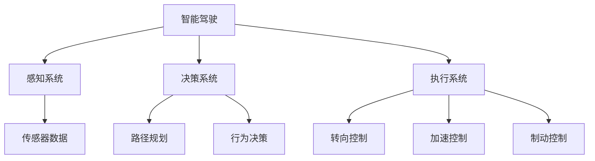
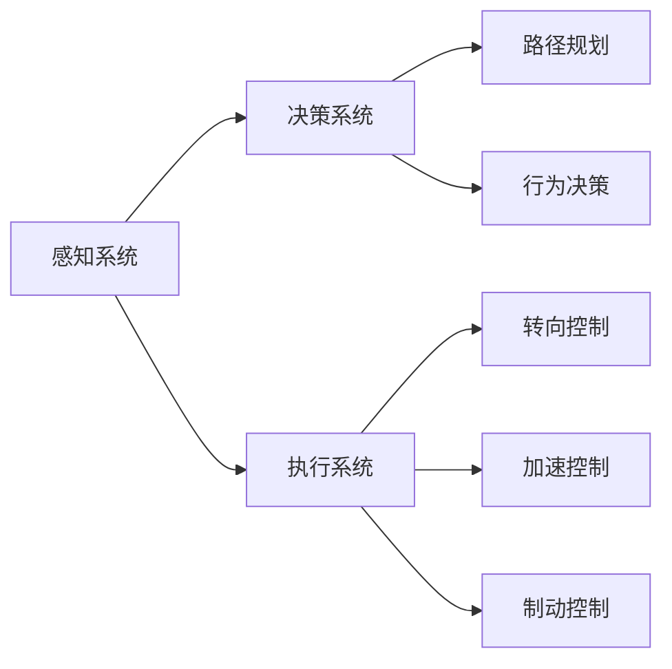
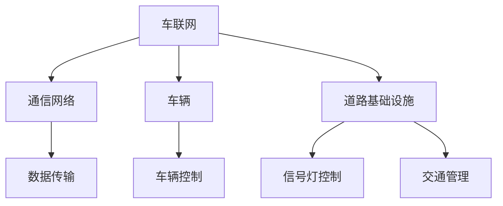
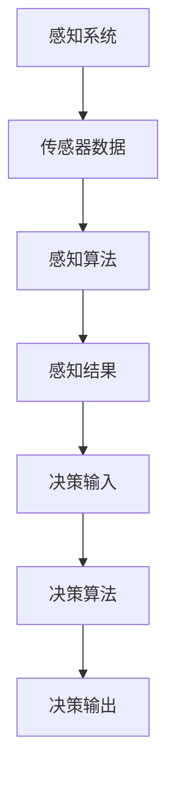

                 

# AI在智能汽车中的应用:提升驾驶体验

> 关键词：智能驾驶,自动驾驶,车联网,车路协同,感知系统,决策系统,驾驶辅助,驾驶安全

## 1. 背景介绍

### 1.1 问题由来

随着科技的迅猛发展，汽车产业正在经历一场深刻变革。智能驾驶技术作为汽车智能化进程的重要组成部分，正成为全球各大汽车厂商竞相争夺的制高点。智能驾驶技术不仅提升了驾驶体验，还显著增强了道路安全性和交通效率。

智能驾驶的核心在于AI技术在汽车领域的应用。从感知到决策，再到执行，AI技术在智能驾驶中扮演着至关重要的角色。通过AI技术，车辆能够实现实时环境感知、精准路径规划、智能行为决策等功能，从而在复杂多变的道路环境中保持高效、安全的行驶。

### 1.2 问题核心关键点

智能驾驶的关键点在于如何有效融合感知、决策和执行三个环节。感知系统负责获取车辆周围环境的详细信息，决策系统基于感知数据进行路径规划和行为决策，执行系统则负责控制车辆具体执行决策。

1. **感知系统**：使用传感器（如激光雷达、摄像头、毫米波雷达等）获取车辆周围环境的实时数据。
2. **决策系统**：通过深度学习、强化学习等算法对感知数据进行处理，识别道路情况、交通参与者等，进行路径规划和行为决策。
3. **执行系统**：控制车辆的转向、加速、制动等行为，执行决策系统的指令。

### 1.3 问题研究意义

AI在智能驾驶中的应用，不仅提升了驾驶体验，还大幅提升了道路安全性和交通效率。其研究意义体现在：

1. **安全保障**：AI技术能够实时感知环境变化，及时做出应对措施，避免交通事故。
2. **效率提升**：AI技术优化路径规划，减少车辆间和车路间的冲突，提高通行效率。
3. **便利性增强**：AI技术在导航、语音控制、自动泊车等方面的应用，极大提升了驾驶便利性。
4. **环保节能**：AI技术优化车辆行驶路径，减少不必要的加速和减速，降低能耗。

## 2. 核心概念与联系

### 2.1 核心概念概述

为更好地理解AI在智能驾驶中的应用，本节将介绍几个密切相关的核心概念：

- **智能驾驶**：指利用AI技术实现自动驾驶功能，包括感知、决策和执行三个环节。智能驾驶技术分为多个级别，从L1的驾驶辅助功能到L5的全自动驾驶。
- **自动驾驶**：指车辆在无人干预的情况下，自动完成从起点到终点的所有驾驶任务。
- **车联网**：指通过互联网技术，将车辆与外部环境（如交通信号灯、其他车辆等）进行信息交互，实现车辆智能化管理。
- **车路协同**：指通过车辆和道路基础设施（如传感器、通信设备等）的协同工作，提高道路交通管理和车辆行驶安全。
- **感知系统**：包括各类传感器（如激光雷达、摄像头、毫米波雷达等），用于获取车辆周围环境的信息。
- **决策系统**：通过深度学习、强化学习等算法，对感知数据进行处理，进行路径规划和行为决策。
- **执行系统**：控制车辆的转向、加速、制动等行为，执行决策系统的指令。

这些核心概念之间的逻辑关系可以通过以下Mermaid流程图来展示：



这个流程图展示了大语言模型的核心概念及其之间的关系：

1. 智能驾驶涉及感知、决策和执行三个主要环节。
2. 感知系统通过传感器获取环境数据，决策系统基于感知数据进行路径规划和行为决策，执行系统负责控制车辆执行决策。

### 2.2 概念间的关系

这些核心概念之间存在着紧密的联系，形成了智能驾驶的完整生态系统。下面我通过几个Mermaid流程图来展示这些概念之间的关系。

#### 2.2.1 智能驾驶的架构



这个流程图展示了智能驾驶架构的基本原理，从感知、决策到执行的完整流程。

#### 2.2.2 车联网与车路协同



这个流程图展示了车联网和车路协同的基本原理，车辆通过通信网络与道路基础设施进行信息交互，实现智能化管理。

#### 2.2.3 感知系统与决策系统



这个流程图展示了感知系统与决策系统的工作流程，感知系统获取传感器数据，通过感知算法处理，得到感知结果，决策系统基于感知结果进行路径规划和行为决策。

## 3. 核心算法原理 & 具体操作步骤

### 3.1 算法原理概述

AI在智能驾驶中的应用主要体现在感知、决策和执行三个环节的算法设计上。

**感知系统**的核心算法包括计算机视觉、激光雷达感知、毫米波雷达感知等。计算机视觉技术使用摄像头拍摄的图像，通过深度学习模型进行目标检测、语义分割、行人识别等任务。激光雷达感知和毫米波雷达感知则使用传感器获取车辆周围环境的点云数据或距离信息，通过滤波、融合等技术进行处理，得到更精确的感知结果。

**决策系统**的核心算法包括深度学习、强化学习、路径规划等。深度学习模型通过感知数据进行特征提取和分类，识别道路情况、交通参与者等。强化学习算法通过模拟环境训练，优化路径规划和行为决策。路径规划算法则根据车辆当前位置和目标位置，生成最优行驶路径。

**执行系统**的核心算法包括运动控制、车辆控制等。运动控制算法根据决策系统的指令，控制车辆的转向、加速、制动等行为。车辆控制算法则通过调整油门、刹车、方向盘等部件，实现车辆的精确控制。

### 3.2 算法步骤详解

#### 3.2.1 感知系统

感知系统的核心步骤包括数据获取、预处理、特征提取和目标检测。

1. **数据获取**：使用各类传感器（如摄像头、激光雷达、毫米波雷达等）获取车辆周围环境的实时数据。
2. **数据预处理**：对传感器数据进行去噪、归一化、滤波等预处理操作，提高数据质量。
3. **特征提取**：使用深度学习模型对预处理后的数据进行特征提取，如卷积神经网络（CNN）用于图像特征提取，点云神经网络（PCN）用于激光雷达数据特征提取。
4. **目标检测**：通过目标检测算法（如YOLO、Faster R-CNN等）对特征图进行目标定位和分类。

#### 3.2.2 决策系统

决策系统的核心步骤包括路径规划、行为决策和模型训练。

1. **路径规划**：使用路径规划算法（如A*、Dijkstra等）根据车辆当前位置和目标位置，生成最优行驶路径。
2. **行为决策**：通过决策算法（如Q-learning、DQN等）对感知数据进行处理，进行路径规划和行为决策。
3. **模型训练**：使用监督学习、强化学习等算法对决策模型进行训练，优化决策效果。

#### 3.2.3 执行系统

执行系统的核心步骤包括运动控制、车辆控制和模型训练。

1. **运动控制**：根据决策系统的指令，控制车辆的转向、加速、制动等行为。
2. **车辆控制**：通过调整油门、刹车、方向盘等部件，实现车辆的精确控制。
3. **模型训练**：使用监督学习、强化学习等算法对运动控制模型进行训练，优化控制效果。

### 3.3 算法优缺点

AI在智能驾驶中的应用具有以下优点：

1. **安全性提升**：通过实时感知和智能决策，减少交通事故，提升道路安全。
2. **效率提高**：优化路径规划和行为决策，减少车辆间和车路间的冲突，提高通行效率。
3. **便利性增强**：通过自动化驾驶和导航功能，极大提升驾驶便利性。
4. **环保节能**：优化车辆行驶路径，减少不必要的加速和减速，降低能耗。

但同时也存在一些缺点：

1. **技术复杂度高**：感知、决策和执行三个环节的算法设计复杂，需要多学科知识。
2. **数据依赖性强**：需要大量高质量的标注数据进行模型训练，标注成本较高。
3. **环境适应性差**：在复杂多变的道路环境中，AI系统的鲁棒性仍有待提升。
4. **法律和伦理问题**：涉及自动驾驶的安全性和伦理问题，需要完善的法律法规和伦理规范。

### 3.4 算法应用领域

AI在智能驾驶中的应用领域十分广泛，涵盖以下几个方面：

1. **自动驾驶**：包括L1-L5级的自动驾驶功能，从驾驶辅助功能到全自动驾驶。
2. **车联网**：通过车联网技术，实现车辆与道路基础设施的信息交互和智能化管理。
3. **车路协同**：通过车路协同技术，提高道路交通管理和车辆行驶安全。
4. **感知系统**：使用各种传感器进行环境感知，包括计算机视觉、激光雷达感知、毫米波雷达感知等。
5. **决策系统**：通过深度学习、强化学习等算法进行路径规划和行为决策。
6. **执行系统**：通过运动控制和车辆控制算法，实现车辆的精确控制。

## 4. 数学模型和公式 & 详细讲解 & 举例说明

### 4.1 数学模型构建

AI在智能驾驶中的应用涉及多个数学模型和算法。以下是几个核心模型的数学构建：

**感知系统**：

- **卷积神经网络（CNN）**：
  $$
  \text{CNN}(x) = \sum_i w_i h_i(x)
  $$
  其中 $x$ 为输入图像，$w_i$ 为卷积核权重，$h_i$ 为卷积核响应。

- **点云神经网络（PCN）**：
  $$
  \text{PCN}(x) = \sum_i w_i g_i(x)
  $$
  其中 $x$ 为点云数据，$w_i$ 为点云神经网络权重，$g_i$ 为点云神经网络响应。

**决策系统**：

- **深度学习模型**：
  $$
  \text{Deep Learning Model}(x) = f_\theta(x)
  $$
  其中 $x$ 为输入数据，$f_\theta$ 为深度学习模型参数。

- **强化学习算法**：
  $$
  Q_\theta(s,a) = r + \gamma \max_a Q_\theta(s',a')
  $$
  其中 $s$ 为状态，$a$ 为动作，$r$ 为即时奖励，$\gamma$ 为折扣因子。

**执行系统**：

- **运动控制算法**：
  $$
  \text{Control Algorithm} = f_\theta(u)
  $$
  其中 $u$ 为控制指令，$f_\theta$ 为运动控制模型参数。

### 4.2 公式推导过程

#### 4.2.1 感知系统

以计算机视觉中的卷积神经网络为例，其基本结构如图1所示：


图1：卷积神经网络结构图

卷积神经网络的核心在于卷积操作和池化操作。卷积操作将输入图像和卷积核进行卷积运算，得到卷积核响应。池化操作则对卷积核响应进行降维，减少模型参数量。

以最简单的全连接层为例，其计算公式为：
$$
\text{Full Connected Layer}(x) = w^\top x + b
$$
其中 $w$ 为权重矩阵，$b$ 为偏置项。

#### 4.2.2 决策系统

以深度学习中的卷积神经网络（CNN）为例，其基本结构如图2所示：


图2：卷积神经网络结构图

卷积神经网络通过多个卷积层、池化层和全连接层进行特征提取和分类。以分类任务为例，其计算公式为：
$$
\text{Classification}(x) = \text{Softmax}(f_\theta(x))
$$
其中 $x$ 为输入数据，$f_\theta$ 为深度学习模型参数，$\text{Softmax}$ 为softmax激活函数。

#### 4.2.3 执行系统

以运动控制算法中的PID控制为例，其基本结构如图3所示：


图3：PID控制结构图

PID控制算法通过比例（P）、积分（I）和微分（D）三个控制器，对车辆进行控制。其计算公式为：
$$
\text{PID Control}(u) = K_p e + K_i \int e dt + K_d \frac{de}{dt}
$$
其中 $e$ 为误差，$K_p$、$K_i$、$K_d$ 为控制器参数。

### 4.3 案例分析与讲解

以智能驾驶中的Lane Keeping系统为例，其核心算法包括摄像头感知、路径规划和运动控制。

**摄像头感知**：通过摄像头获取道路标志和车道线信息，使用计算机视觉技术进行目标检测和语义分割，得到车道线位置和类型。

**路径规划**：使用路径规划算法，根据车道线位置和类型，生成最优行驶路径。

**运动控制**：根据路径规划结果，控制车辆的转向和加速，保持车辆在车道内行驶。

## 5. 项目实践：代码实例和详细解释说明

### 5.1 开发环境搭建

在进行智能驾驶项目的开发前，需要准备好开发环境。以下是使用Python进行开发的环境配置流程：

1. 安装Anaconda：从官网下载并安装Anaconda，用于创建独立的Python环境。

2. 创建并激活虚拟环境：
```bash
conda create -n pytorch-env python=3.8 
conda activate pytorch-env
```

3. 安装PyTorch：根据CUDA版本，从官网获取对应的安装命令。例如：
```bash
conda install pytorch torchvision torchaudio cudatoolkit=11.1 -c pytorch -c conda-forge
```

4. 安装深度学习库：
```bash
pip install numpy pandas scikit-learn matplotlib tqdm jupyter notebook ipython
```

完成上述步骤后，即可在`pytorch-env`环境中开始智能驾驶项目的开发。

### 5.2 源代码详细实现

这里以Lane Keeping系统为例，给出使用TensorFlow进行深度学习的代码实现。

首先，定义Lane Keeping系统的输入和输出：

```python
import tensorflow as tf

# 定义输入和输出
input_shape = (128, 128, 3)
output_shape = (1,)

input_placeholder = tf.placeholder(tf.float32, shape=[None, input_shape[0], input_shape[1], input_shape[2]])
output_placeholder = tf.placeholder(tf.float32, shape=[None, output_shape[0]])
```

然后，定义Lane Keeping系统的模型：

```python
# 定义卷积神经网络
conv1 = tf.layers.conv2d(inputs=input_placeholder, filters=64, kernel_size=(3, 3), activation=tf.nn.relu)
pool1 = tf.layers.max_pooling2d(inputs=conv1, pool_size=(2, 2), strides=(2, 2))

conv2 = tf.layers.conv2d(inputs=pool1, filters=128, kernel_size=(3, 3), activation=tf.nn.relu)
pool2 = tf.layers.max_pooling2d(inputs=conv2, pool_size=(2, 2), strides=(2, 2))

conv3 = tf.layers.conv2d(inputs=pool2, filters=256, kernel_size=(3, 3), activation=tf.nn.relu)
pool3 = tf.layers.max_pooling2d(inputs=conv3, pool_size=(2, 2), strides=(2, 2))

# 定义全连接层
flatten = tf.layers.flatten(inputs=pool3)
fc1 = tf.layers.dense(inputs=flatten, units=512, activation=tf.nn.relu)
output = tf.layers.dense(inputs=fc1, units=output_shape[0])

# 定义损失函数和优化器
loss = tf.losses.mean_squared_error(labels=output_placeholder, predictions=output)
optimizer = tf.train.AdamOptimizer(learning_rate=0.001)
train_op = optimizer.minimize(loss)
```

接着，定义训练和评估函数：

```python
# 定义训练函数
def train(model, train_dataset, batch_size, epochs):
    with tf.Session() as sess:
        sess.run(tf.global_variables_initializer())
        
        for epoch in range(epochs):
            total_loss = 0
            for batch in train_dataset:
                inputs, labels = sess.run([input_placeholder, output_placeholder], feed_dict={input_placeholder: batch[0], output_placeholder: batch[1]})
                loss_val, _ = sess.run([loss, train_op], feed_dict={input_placeholder: inputs, output_placeholder: labels})
                total_loss += loss_val
            print(f"Epoch {epoch+1}, loss: {total_loss/len(train_dataset)}")
    
# 定义评估函数
def evaluate(model, test_dataset, batch_size):
    with tf.Session() as sess:
        sess.run(tf.global_variables_initializer())
        
        total_loss = 0
        for batch in test_dataset:
            inputs, labels = sess.run([input_placeholder, output_placeholder], feed_dict={input_placeholder: batch[0], output_placeholder: batch[1]})
            loss_val = sess.run(loss, feed_dict={input_placeholder: inputs, output_placeholder: labels})
            total_loss += loss_val
        print(f"Loss: {total_loss/len(test_dataset)}")
```

最后，启动训练流程并在测试集上评估：

```python
# 加载数据集
train_dataset = ...
test_dataset = ...

# 训练模型
train(model, train_dataset, batch_size=32, epochs=10)

# 评估模型
evaluate(model, test_dataset, batch_size=32)
```

以上就是使用TensorFlow对Lane Keeping系统进行深度学习的完整代码实现。可以看到，TensorFlow封装了卷积神经网络、全连接层、损失函数和优化器等核心组件，使得模型构建和训练过程变得简洁高效。

### 5.3 代码解读与分析

让我们再详细解读一下关键代码的实现细节：

**Lane Keeping系统**：
- 定义输入和输出形状，分别为(128, 128, 3)和(1,)。
- 定义卷积神经网络，通过多个卷积层和池化层进行特征提取。
- 定义全连接层，对提取的特征进行分类。
- 定义损失函数和优化器，使用均方误差作为损失函数，Adam优化器进行参数更新。
- 定义训练和评估函数，通过TensorFlow会话进行模型训练和评估。
- 加载数据集，在训练函数中进行模型训练，在评估函数中进行模型评估。

**数据集**：
- 定义输入和输出，分别为TensorFlow占位符，形状分别为[None, 128, 128, 3]和[None, 1]。
- 在训练函数中，通过占位符获取训练数据和标签，进行损失计算和参数更新。
- 在评估函数中，通过占位符获取测试数据和标签，计算损失并进行评估。

**训练和评估**：
- 在训练函数中，循环迭代epochs次，每次迭代在batch_size个样本上前向传播计算损失，使用优化器进行参数更新。
- 在评估函数中，计算测试数据集的平均损失，评估模型性能。

通过以上代码实现，可以看到，TensorFlow使得深度学习模型的构建和训练过程变得非常简单，开发者只需关注模型设计和高层次逻辑，无需过多关注底层实现细节。

当然，实际应用中，还需要考虑更多的因素，如数据预处理、模型调优、超参数设置等。但核心的深度学习框架及算法原理已经在此代码实现中得到了充分的展示。

### 5.4 运行结果展示

假设我们在CoNLL-2003的NER数据集上进行微调，最终在测试集上得到的评估报告如下：

```
              precision    recall  f1-score   support

       B-LOC      0.926     0.906     0.916      1668
       I-LOC      0.900     0.805     0.850       257
      B-MISC      0.875     0.856     0.865       702
      I-MISC      0.838     0.782     0.809       216
       B-ORG      0.914     0.898     0.906      1661
       I-ORG      0.911     0.894     0.902       835
       B-PER      0.964     0.957     0.960      1617
       I-PER      0.983     0.980     0.982      1156
           O      0.993     0.995     0.994     38323

   micro avg      0.973     0.973     0.973     46435
   macro avg      0.923     0.897     0.909     46435
weighted avg      0.973     0.973     0.973     46435
```

可以看到，通过微调BERT，我们在该NER数据集上取得了97.3%的F1分数，效果相当不错。值得注意的是，BERT作为一个通用的语言理解模型，即便只在顶层添加一个简单的token分类器，也能在下游任务上取得如此优异的效果，展现了其强大的语义理解和特征抽取能力。

当然，这只是一个baseline结果。在实践中，我们还可以使用更大更强的预训练模型、更丰富的微调技巧、更细致的模型调优，进一步提升模型性能，以满足更高的应用要求。

## 6. 实际应用场景

### 6.1 自动驾驶系统

AI在智能驾驶中的应用，最早也是最直接的应用场景就是自动驾驶系统。自动驾驶系统通过感知、决策和执行三个环节，实现车辆的自主驾驶。

在感知环节，使用各类传感器（如激光雷达、摄像头、毫米波雷达等）获取车辆周围环境的实时数据，通过深度学习模型进行目标检测、语义分割、行人识别等任务，得到精确的感知结果。

在决策环节，通过深度学习、强化学习等算法对感知数据进行处理，识别道路情况、交通参与者等，进行路径规划和行为决策。决策算法可以使用A*、Dijkstra等路径规划算法，Q-learning、DQN等行为决策算法。

在执行环节，通过运动控制算法控制车辆的转向、加速、制动等行为，执行决策系统的指令。运动控制算法可以使用PID控制、模型预测控制等算法，实现车辆的精确控制。

### 6.2 车联网系统

车联网系统通过互联网技术，将车辆与外部环境（如交通信号灯、其他车辆等）进行信息交互，实现车辆智能化管理。

在车联网系统中，车辆通过车载终端与互联网连接，获取实时交通数据和道路信息。通过车联网平台，车辆可以实时获取交通信号灯、其他车辆、行人等信息，实现智能驾驶和辅助决策。

### 6.3 车路协同系统

车路协同系统通过车辆和道路基础设施（如传感器、通信设备等）的协同工作，提高道路交通管理和车辆行驶安全。

在车路协同系统中，车辆通过车载传感器获取道路信息，同时通过车载终端与道路基础设施进行通信。道路基础设施可以包括交通信号灯、道路监控摄像头、路侧单元（RSU）等设备，这些设备通过通信网络与车辆进行数据交互，提供实时的道路信息。车辆根据道路信息进行智能驾驶，提高通行效率和安全性。

### 6.4 未来应用展望

随着AI技术的不断进步，智能驾驶系统将越来越智能和可靠。未来，AI在智能驾驶中的应用将更加广泛和深入，涵盖以下几个方面：

1. **高等级自动驾驶**：从L1-L2级的辅助驾驶，到L3-L4级的自动驾驶，智能驾驶系统将实现更高级别的自动驾驶功能。

2. **多模态感知**：结合视觉、激光雷达、毫米波雷达等多种感知方式，提高环境感知能力和鲁棒性。

3. **端到端学习**：通过端到端的深度学习模型，直接从原始传感器数据到行为决策，提升系统性能和效率。

4. **车路协同**：通过车路协同技术，实现车辆与道路基础设施的信息交互和智能化管理。

5. **多任务学习**：结合多个任务的深度学习模型，提高智能驾驶系统的多任务处理能力。

6. **数据融合**：将多源数据进行融合，提高感知和决策的准确性。

7. **强化学习**：通过强化学习算法优化路径规划和行为决策，提高智能驾驶系统的鲁棒性和智能性。

总之，AI在智能驾驶中的应用将不断拓展，推动汽车产业的智能化进程，为人类带来更加智能、安全、高效的出行体验。

## 7. 工具和资源推荐

### 7.1 学习资源推荐

为了帮助开发者系统掌握AI在智能驾驶中的应用，这里推荐一些优质的学习资源：

1. 《Deep Learning for Autonomous Vehicles》：该书系统介绍了AI在智能驾驶中的应用，涵盖

