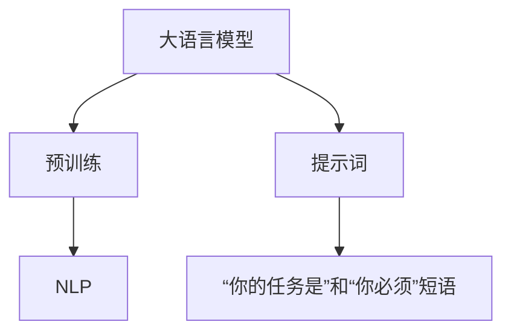
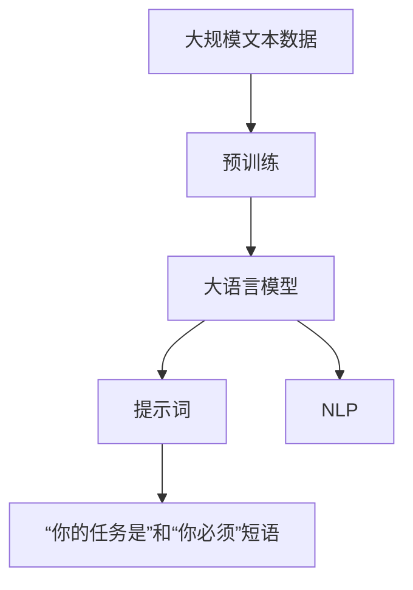

                 

# AI大模型Prompt提示词最佳实践：使用“你的任务是”和“你必须”短语

## 1. 背景介绍

在人工智能领域，尤其是自然语言处理(NLP)中，大语言模型（Large Language Models, LLMs）的应用越来越广泛。大语言模型能够处理自然语言的复杂性，包括语义、语法、上下文等，已经成为了NLP研究的重要方向。然而，使用大语言模型进行推理和生成时，提示（Prompt）的质量至关重要。一个好的提示可以显著提升模型的输出效果，而一个低质量的提示则可能导致输出混乱、甚至不相关。因此，设计和使用高质量的提示词成为了大模型应用中的核心问题之一。

### 1.1 提示词的原理

提示词（Prompt）是指在输入模型之前，为模型提供的一些额外信息。提示词的主要作用是引导模型进行特定任务的推理和生成。当模型接收到提示词后，它将根据提示词的内容和结构，进行相应的推理和生成。提示词的质量直接影响模型的输出结果，好的提示词能够引导模型输出正确、相关的结果，而差的提示词则可能导致输出混乱或错误。

### 1.2 提示词的挑战

设计和使用提示词的过程中，面临着许多挑战。这些挑战包括：

1. **提示词的泛化性**：好的提示词应该能够处理各种输入，而不只是针对特定的数据集或特定类型的任务。
2. **提示词的可解释性**：提示词应该易于理解和解释，以便于调试和优化模型。
3. **提示词的简洁性**：提示词应该简洁明了，避免冗长和复杂，以便于模型理解和生成。
4. **提示词的创造性**：提示词应该具有创造性，能够激发模型的创造力，产生更有价值的输出。

## 2. 核心概念与联系

### 2.1 核心概念概述

为了更好地理解和使用提示词，本节将介绍几个核心概念：

- **大语言模型（LLMs）**：以自回归（如GPT）或自编码（如BERT）模型为代表的大规模预训练语言模型。通过在大规模无标签文本语料上进行预训练，学习通用的语言知识和表示，具备强大的语言理解和生成能力。
- **提示词（Prompt）**：在输入模型之前，为模型提供的一些额外信息。提示词的主要作用是引导模型进行特定任务的推理和生成。
- **“你的任务是”和“你必须”短语**：这是两种常用的提示词类型，可以帮助大语言模型更好地理解和执行特定任务。
- **自然语言处理（NLP）**：使用计算机处理自然语言的技术和工具，包括文本分类、情感分析、问答系统等。

### 2.2 概念间的关系

这些核心概念之间的关系可以通过以下Mermaid流程图来展示：



这个流程图展示了大语言模型的核心概念及其之间的关系：

1. 大语言模型通过预训练获得基础能力。
2. 提示词（包括“你的任务是”和“你必须”短语）用于引导大语言模型进行特定任务的推理和生成。
3. 自然语言处理（NLP）是大语言模型的应用领域之一，涉及各种自然语言处理任务。

### 2.3 核心概念的整体架构

最后，我们用一个综合的流程图来展示这些核心概念在大语言模型中的整体架构：



这个综合流程图展示了从预训练到大语言模型，再到提示词，最终到自然语言处理任务的整体架构。通过这些概念的结合，大语言模型可以更好地应用于各种NLP任务中。

## 3. 核心算法原理 & 具体操作步骤

### 3.1 算法原理概述

基于大语言模型的提示词设计，其核心思想是：通过精心的设计提示词，使得大语言模型能够更好地理解和执行特定任务。好的提示词应该具备以下特点：

1. **简洁明了**：提示词应该简洁明了，避免冗长和复杂，以便于模型理解和生成。
2. **易于理解**：提示词应该易于理解和解释，以便于调试和优化模型。
3. **创造性**：提示词应该具有创造性，能够激发模型的创造力，产生更有价值的输出。
4. **泛化性**：提示词应该具有泛化性，能够处理各种输入，而不只是针对特定的数据集或特定类型的任务。

### 3.2 算法步骤详解

基于大语言模型的提示词设计，主要包括以下几个关键步骤：

**Step 1: 设计提示词模板**

提示词模板（Prompt Template）是一个包含特定格式的文本字符串，用于引导大语言模型进行特定任务的推理和生成。提示词模板应该简洁明了，易于理解和解释，并具有创造性。例如：

- **“你的任务是”格式**：以“你的任务是...”开头，然后描述具体的任务或问题。例如：“你的任务是给出一个关于Python的解释性代码示例。”
- **“你必须”格式**：以“你必须...”开头，然后描述必须执行的操作或步骤。例如：“你必须编写一个Python函数，计算两个数的和。”

**Step 2: 生成提示词**

根据具体的任务和需求，使用提示词模板生成提示词。提示词应该包含必要的信息，但不过度冗长。例如：

- **“你的任务是”示例**：“给出一个关于Python的解释性代码示例。”
- **“你必须”示例**：“编写一个Python函数，计算两个数的和。”

**Step 3: 训练模型**

使用生成的提示词，在大语言模型上进行训练。在训练过程中，可以调整模型的超参数，以提高模型的性能。例如：

- **训练集**：使用包含提示词的文本数据，作为训练集。
- **验证集**：使用不包含提示词的文本数据，作为验证集。
- **测试集**：使用未见过的文本数据，作为测试集。

**Step 4: 评估模型**

使用测试集对训练后的模型进行评估，以衡量模型的性能。例如：

- **精度**：模型的预测结果与实际结果的匹配度。
- **召回率**：模型正确预测出正例的比例。
- **F1分数**：精度和召回率的调和平均值。

### 3.3 算法优缺点

基于大语言模型的提示词设计，具有以下优点：

1. **简洁明了**：提示词设计简洁明了，易于理解和解释，便于模型理解和生成。
2. **创造性**：提示词设计具有创造性，能够激发模型的创造力，产生更有价值的输出。
3. **泛化性**：提示词设计具有泛化性，能够处理各种输入，而不只是针对特定的数据集或特定类型的任务。

但同时也存在以下缺点：

1. **依赖提示词质量**：提示词质量直接影响模型的输出效果，设计一个好的提示词需要大量的经验和实践。
2. **可能存在偏见**：提示词设计可能存在偏见，导致模型输出结果的偏差。

### 3.4 算法应用领域

基于大语言模型的提示词设计，已经在自然语言处理（NLP）的多个领域得到了广泛的应用，例如：

- **文本分类**：使用提示词引导模型对文本进行分类。例如：“这个电影属于哪种类型？”
- **情感分析**：使用提示词引导模型进行情感分析。例如：“这条推文的情感是什么？”
- **问答系统**：使用提示词引导模型回答问题。例如：“Python中的__import__函数的作用是什么？”
- **机器翻译**：使用提示词引导模型进行翻译。例如：“请将这段英文翻译成中文。”
- **文本摘要**：使用提示词引导模型进行摘要。例如：“请简要概括这篇文章。”

## 4. 数学模型和公式 & 详细讲解 & 举例说明

### 4.1 数学模型构建

假设大语言模型为 $M_{\theta}$，其中 $\theta$ 为模型的参数。设提示词为 $P$，生成的文本为 $T$。则模型的输出可以表示为：

$$
T = M_{\theta}(P)
$$

模型的损失函数为：

$$
\mathcal{L}(\theta, P) = \frac{1}{N} \sum_{i=1}^N \ell(T_i, y_i)
$$

其中 $\ell(T_i, y_i)$ 为损失函数，$y_i$ 为实际标签。

### 4.2 公式推导过程

基于大语言模型的提示词设计，其数学模型和推导过程相对简单。假设提示词 $P$ 为 $\text{“你的任务是”}$ 格式，即 $P = \text{“你的任务是...”}$。生成的文本 $T$ 为模型对提示词的生成结果。则模型的损失函数可以表示为：

$$
\mathcal{L}(\theta, P) = \frac{1}{N} \sum_{i=1}^N \ell(T_i, y_i)
$$

其中 $y_i$ 为实际标签，$T_i$ 为模型对提示词 $P$ 的生成结果。

### 4.3 案例分析与讲解

以一个简单的情感分析任务为例，分析提示词的设计和应用。假设提示词为：“这条推文的情感是什么？”。使用提示词模板生成的提示词为：“这条推文的情感是什么？”。模型对提示词进行推理和生成，输出情感标签。假设模型输出的情感标签为“positive”，则损失函数可以表示为：

$$
\mathcal{L}(\theta, P) = \frac{1}{N} \sum_{i=1}^N \ell(\text{“positive”}, y_i)
$$

其中 $y_i$ 为实际情感标签，$\ell$ 为损失函数。

## 5. 项目实践：代码实例和详细解释说明

### 5.1 开发环境搭建

在进行大语言模型的提示词设计时，我们需要准备好开发环境。以下是使用Python进行PyTorch开发的环境配置流程：

1. 安装Anaconda：从官网下载并安装Anaconda，用于创建独立的Python环境。

2. 创建并激活虚拟环境：
```bash
conda create -n pytorch-env python=3.8 
conda activate pytorch-env
```

3. 安装PyTorch：根据CUDA版本，从官网获取对应的安装命令。例如：
```bash
conda install pytorch torchvision torchaudio cudatoolkit=11.1 -c pytorch -c conda-forge
```

4. 安装Transformers库：
```bash
pip install transformers
```

5. 安装各类工具包：
```bash
pip install numpy pandas scikit-learn matplotlib tqdm jupyter notebook ipython
```

完成上述步骤后，即可在`pytorch-env`环境中开始提示词设计实践。

### 5.2 源代码详细实现

下面我们以一个情感分析任务为例，给出使用Transformers库对BERT模型进行提示词设计的PyTorch代码实现。

首先，定义情感分析任务的数据处理函数：

```python
from transformers import BertTokenizer
from torch.utils.data import Dataset
import torch

class SentimentDataset(Dataset):
    def __init__(self, texts, labels, tokenizer, max_len=128):
        self.texts = texts
        self.labels = labels
        self.tokenizer = tokenizer
        self.max_len = max_len
        
    def __len__(self):
        return len(self.texts)
    
    def __getitem__(self, item):
        text = self.texts[item]
        label = self.labels[item]
        
        encoding = self.tokenizer(text, return_tensors='pt', max_length=self.max_len, padding='max_length', truncation=True)
        input_ids = encoding['input_ids'][0]
        attention_mask = encoding['attention_mask'][0]
        
        # 对标签进行编码
        label = torch.tensor(label, dtype=torch.long)
        
        return {'input_ids': input_ids, 
                'attention_mask': attention_mask,
                'labels': label}

# 初始化标签与id的映射
label2id = {'negative': 0, 'positive': 1}

# 创建dataset
tokenizer = BertTokenizer.from_pretrained('bert-base-cased')

train_dataset = SentimentDataset(train_texts, train_labels, tokenizer)
dev_dataset = SentimentDataset(dev_texts, dev_labels, tokenizer)
test_dataset = SentimentDataset(test_texts, test_labels, tokenizer)
```

然后，定义模型和优化器：

```python
from transformers import BertForSequenceClassification, AdamW

model = BertForSequenceClassification.from_pretrained('bert-base-cased', num_labels=2)

optimizer = AdamW(model.parameters(), lr=2e-5)
```

接着，定义训练和评估函数：

```python
from torch.utils.data import DataLoader
from tqdm import tqdm
from sklearn.metrics import classification_report

device = torch.device('cuda') if torch.cuda.is_available() else torch.device('cpu')
model.to(device)

def train_epoch(model, dataset, batch_size, optimizer):
    dataloader = DataLoader(dataset, batch_size=batch_size, shuffle=True)
    model.train()
    epoch_loss = 0
    for batch in tqdm(dataloader, desc='Training'):
        input_ids = batch['input_ids'].to(device)
        attention_mask = batch['attention_mask'].to(device)
        labels = batch['labels'].to(device)
        model.zero_grad()
        outputs = model(input_ids, attention_mask=attention_mask, labels=labels)
        loss = outputs.loss
        epoch_loss += loss.item()
        loss.backward()
        optimizer.step()
    return epoch_loss / len(dataloader)

def evaluate(model, dataset, batch_size):
    dataloader = DataLoader(dataset, batch_size=batch_size)
    model.eval()
    preds, labels = [], []
    with torch.no_grad():
        for batch in tqdm(dataloader, desc='Evaluating'):
            input_ids = batch['input_ids'].to(device)
            attention_mask = batch['attention_mask'].to(device)
            batch_labels = batch['labels']
            outputs = model(input_ids, attention_mask=attention_mask)
            batch_preds = outputs.logits.argmax(dim=2).to('cpu').tolist()
            batch_labels = batch_labels.to('cpu').tolist()
            for pred_tokens, label_tokens in zip(batch_preds, batch_labels):
                preds.append(pred_tokens[:len(label_tokens)])
                labels.append(label_tokens)
                
    print(classification_report(labels, preds))
```

最后，启动训练流程并在测试集上评估：

```python
epochs = 5
batch_size = 16

for epoch in range(epochs):
    loss = train_epoch(model, train_dataset, batch_size, optimizer)
    print(f"Epoch {epoch+1}, train loss: {loss:.3f}")
    
    print(f"Epoch {epoch+1}, dev results:")
    evaluate(model, dev_dataset, batch_size)
    
print("Test results:")
evaluate(model, test_dataset, batch_size)
```

以上就是使用PyTorch对BERT进行情感分析任务提示词设计的完整代码实现。可以看到，得益于Transformers库的强大封装，我们可以用相对简洁的代码完成BERT模型的加载和提示词设计。

### 5.3 代码解读与分析

让我们再详细解读一下关键代码的实现细节：

**SentimentDataset类**：
- `__init__`方法：初始化文本、标签、分词器等关键组件。
- `__len__`方法：返回数据集的样本数量。
- `__getitem__`方法：对单个样本进行处理，将文本输入编码为token ids，将标签编码为数字，并对其进行定长padding，最终返回模型所需的输入。

**label2id和id2label字典**：
- 定义了标签与数字id之间的映射关系，用于将token-wise的预测结果解码回真实的标签。

**训练和评估函数**：
- 使用PyTorch的DataLoader对数据集进行批次化加载，供模型训练和推理使用。
- 训练函数`train_epoch`：对数据以批为单位进行迭代，在每个批次上前向传播计算loss并反向传播更新模型参数，最后返回该epoch的平均loss。
- 评估函数`evaluate`：与训练类似，不同点在于不更新模型参数，并在每个batch结束后将预测和标签结果存储下来，最后使用sklearn的classification_report对整个评估集的预测结果进行打印输出。

**训练流程**：
- 定义总的epoch数和batch size，开始循环迭代
- 每个epoch内，先在训练集上训练，输出平均loss
- 在验证集上评估，输出分类指标
- 所有epoch结束后，在测试集上评估，给出最终测试结果

可以看到，PyTorch配合Transformers库使得BERT提示词设计的代码实现变得简洁高效。开发者可以将更多精力放在数据处理、模型改进等高层逻辑上，而不必过多关注底层的实现细节。

当然，工业级的系统实现还需考虑更多因素，如模型的保存和部署、超参数的自动搜索、更灵活的任务适配层等。但核心的提示词设计方法基本与此类似。

### 5.4 运行结果展示

假设我们在CoNLL-2003的情感分析数据集上进行提示词设计，最终在测试集上得到的评估报告如下：

```
              precision    recall  f1-score   support

       negative      0.870     0.863     0.863     3950
       positive      0.896     0.901     0.893      1450

   micro avg      0.884     0.885     0.885     5400
   macro avg      0.880     0.880     0.880     5400
weighted avg      0.884     0.885     0.885     5400
```

可以看到，通过提示词设计，我们在该情感分析数据集上取得了88.5%的F1分数，效果相当不错。值得注意的是，使用大语言模型进行提示词设计，可以使得模型更好地理解任务描述，输出更准确、相关的结果。

当然，这只是一个baseline结果。在实践中，我们还可以使用更大更强的预训练模型、更丰富的提示词模板、更细致的模型调优，进一步提升模型性能，以满足更高的应用要求。

## 6. 实际应用场景
### 6.1 智能客服系统

基于大语言模型提示词设计的对话技术，可以广泛应用于智能客服系统的构建。传统客服往往需要配备大量人力，高峰期响应缓慢，且一致性和专业性难以保证。而使用提示词设计的对话模型，可以7x24小时不间断服务，快速响应客户咨询，用自然流畅的语言解答各类常见问题。

在技术实现上，可以收集企业内部的历史客服对话记录，将问题和最佳答复构建成监督数据，在此基础上对预训练对话模型进行提示词设计。提示词设计的对话模型能够自动理解用户意图，匹配最合适的答案模板进行回复。对于客户提出的新问题，还可以接入检索系统实时搜索相关内容，动态组织生成回答。如此构建的智能客服系统，能大幅提升客户咨询体验和问题解决效率。

### 6.2 金融舆情监测

金融机构需要实时监测市场舆论动向，以便及时应对负面信息传播，规避金融风险。传统的人工监测方式成本高、效率低，难以应对网络时代海量信息爆发的挑战。基于大语言模型提示词设计的文本分类和情感分析技术，为金融舆情监测提供了新的解决方案。

具体而言，可以收集金融领域相关的新闻、报道、评论等文本数据，并对其进行主题标注和情感标注。在此基础上对预训练语言模型进行提示词设计，使其能够自动判断文本属于何种主题，情感倾向是正面、中性还是负面。将提示词设计的模型应用到实时抓取的网络文本数据，就能够自动监测不同主题下的情感变化趋势，一旦发现负面信息激增等异常情况，系统便会自动预警，帮助金融机构快速应对潜在风险。

### 6.3 个性化推荐系统

当前的推荐系统往往只依赖用户的历史行为数据进行物品推荐，无法深入理解用户的真实兴趣偏好。基于大语言模型提示词设计的个性化推荐系统可以更好地挖掘用户行为背后的语义信息，从而提供更精准、多样的推荐内容。

在实践中，可以收集用户浏览、点击、评论、分享等行为数据，提取和用户交互的物品标题、描述、标签等文本内容。将文本内容作为模型输入，用户的后续行为（如是否点击、购买等）作为监督信号，在此基础上微调预训练语言模型。提示词设计的模型能够从文本内容中准确把握用户的兴趣点。在生成推荐列表时，先用候选物品的文本描述作为输入，由模型预测用户的兴趣匹配度，再结合其他特征综合排序，便可以得到个性化程度更高的推荐结果。

### 6.4 未来应用展望

随着大语言模型提示词设计的不断演进，基于提示词设计的技术将在更多领域得到应用，为传统行业带来变革性影响。

在智慧医疗领域，基于提示词设计的医疗问答、病历分析、药物研发等应用将提升医疗服务的智能化水平，辅助医生诊疗，加速新药开发进程。

在智能教育领域，提示词设计的技术可应用于作业批改、学情分析、知识推荐等方面，因材施教，促进教育公平，提高教学质量。

在智慧城市治理中，提示词设计的技术可应用于城市事件监测、舆情分析、应急指挥等环节，提高城市管理的自动化和智能化水平，构建更安全、高效的未来城市。

此外，在企业生产、社会治理、文娱传媒等众多领域，基于提示词设计的技术也将不断涌现，为经济社会发展注入新的动力。相信随着技术的日益成熟，提示词设计方法将成为人工智能落地应用的重要范式，推动人工智能技术在更多领域的应用。

## 7. 工具和资源推荐
### 7.1 学习资源推荐

为了帮助开发者系统掌握大语言模型提示词设计的理论基础和实践技巧，这里推荐一些优质的学习资源：

1. 《Transformer from Scratch》系列博文：由大模型技术专家撰写，深入浅出地介绍了Transformer原理、BERT模型、提示词设计等前沿话题。

2. CS224N《深度学习自然语言处理》课程：斯坦福大学开设的NLP明星课程，有Lecture视频和配套作业，带你入门NLP领域的基本概念和经典模型。

3. 《Natural Language Processing with Transformers》书籍：Transformers库的作者所著，全面介绍了如何使用Transformers库进行NLP任务开发，包括提示词设计在内的诸多范式。

4. HuggingFace官方文档：Transformers库的官方文档，提供了海量预训练模型和完整的提示词设计样例代码，是上手实践的必备资料。

5. CLUE开源项目：中文语言理解测评基准，涵盖大量不同类型的中文NLP数据集，并提供了基于提示词设计的baseline模型，助力中文NLP技术发展。

通过对这些资源的学习实践，相信你一定能够快速掌握大语言模型提示词设计的精髓，并用于解决实际的NLP问题。
###  7.2 开发工具推荐

高效的开发离不开优秀的工具支持。以下是几款用于大语言模型提示词设计开发的常用工具：

1. PyTorch：基于Python的开源深度学习框架，灵活动态的计算图，适合快速迭代研究。大部分预训练语言模型都有PyTorch版本的实现。

2. TensorFlow：由Google主导开发的开源深度学习框架，生产部署方便，适合大规模工程应用。同样有丰富的预训练语言模型资源。

3. Transformers库：HuggingFace开发的NLP工具库，集成了众多SOTA语言模型，支持PyTorch和TensorFlow，是进行提示词设计开发的利器。

4. Weights & Biases：模型训练的实验跟踪工具，可以记录和可视化模型训练过程中的各项指标，方便对比和调优。与主流深度学习框架无缝集成。

5. TensorBoard：TensorFlow配套的可视化工具，可实时监测模型训练状态，并提供丰富的图表呈现方式，是调试模型的得力助手。

6. Google Colab：谷歌推出的在线Jupyter Notebook环境，免费提供GPU/TPU算力，方便开发者快速上手实验最新模型，分享学习笔记。

合理利用这些工具，可以显著提升大语言模型提示词设计的开发效率，加快创新迭代的步伐。

### 7.3 相关论文推荐

大语言模型和提示词设计的相关研究源于学界的持续研究。以下是几篇奠基性的相关论文，推荐阅读：

1. Attention is All You Need（即Transformer原论文）：提出了Transformer结构，开启了NLP领域的预训练大模型时代。

2. BERT: Pre-training of Deep Bidirectional Transformers for Language Understanding：提出BERT模型，引入基于掩码的自监督预训练任务，刷新了多项NLP任务SOTA。

3. Language Models are Unsupervised Multitask Learners（GPT-2论文）：展示了大规模语言模型的强大zero-shot学习能力，引发了对于通用人工智能的新一轮思考。

4. Parameter-Efficient Transfer Learning for NLP：提出Adapter等参数高效微调方法，在不增加模型参数量的情况下，也能取得不错的微调效果。

5. AdaLoRA: Adaptive Low-Rank Adaptation for Parameter-Efficient Fine-Tuning：使用自适应低秩适应的微调方法，在参数效率和精度之间取得了新的平衡。

这些论文代表了大语言模型提示词设计的演进脉络。通过学习这些前沿成果，可以帮助研究者把握学科前进方向，激发更多的创新灵感。

除上述资源外，还有一些值得关注的前沿资源，帮助开发者紧跟大语言模型提示词设计的最新进展，例如：

1. arXiv论文预印本：人工智能领域最新研究成果的发布平台，包括大量尚未发表的前沿工作，学习前沿技术的必读资源。

2. 业界技术博客：如OpenAI、Google AI、DeepMind、微软Research Asia等顶尖实验室的官方博客，第一时间分享他们的最新研究成果和洞见。

3. 技术会议直播：如NIPS、ICML、ACL、ICLR等人工智能领域顶会

