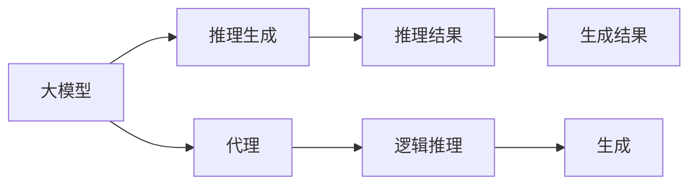
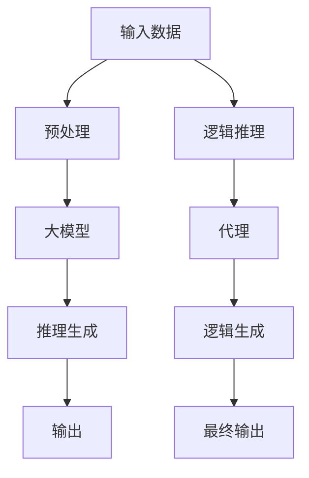

                 

# AI工程学：大模型应用开发实战：RAG

> 关键词：
1. 大模型
2. RAG
3. 工程化
4. 开发实战
5. 应用场景
6. 开发工具
7. 算法优化

## 1. 背景介绍

随着人工智能技术的飞速发展，大模型（Large Models）逐渐成为了人工智能应用的核心组成部分。这些大模型，如GPT-3、BERT、T5等，因其在处理复杂任务时的卓越表现，在自然语言处理（NLP）、计算机视觉（CV）等领域展现了巨大的潜力。然而，如何将这些大模型应用到实际工程中，并进行有效的开发和部署，成为了当前AI工程学中的重要课题。

RAG（Reasoning About Generative Agents）作为大模型应用开发中的一个重要概念，其核心思想是通过对生成型代理（Generative Agents）的行为和逻辑进行建模，从而更好地理解和利用大模型的生成能力。RAG提供了一种将复杂任务拆解为可管理的部分，并通过大模型的理解能力进行推理和生成的技术框架，在自然语言生成、对话系统、智能推荐等领域有着广泛的应用。

本文将深入探讨RAG技术，并结合实际应用场景，详细阐述如何在大模型应用开发中进行实战操作，以及未来发展的趋势和面临的挑战。

## 2. 核心概念与联系

### 2.1 核心概念概述

在深入理解RAG技术之前，首先需要明确以下几个核心概念：

1. **大模型（Large Models）**：以自回归模型（如GPT系列）或自编码模型（如BERT）为代表的大规模预训练模型。这些模型通过在大规模无标签文本语料上进行预训练，学习到丰富的语言知识和常识，具备强大的语言理解和生成能力。

2. **推理生成（Reasoning Generation）**：通过给定前提或任务描述，大模型能够推理出逻辑上合理的结论或生成符合规则的文本。

3. **代理（Agents）**：在RAG中，代理指的是能够执行特定任务的软件实体，可以是人类用户、机器人或其他智能体。

4. **逻辑推理（Logical Reasoning）**：利用逻辑规则对前提和假设进行推理，得出结论的能力。

5. **生成（Generation）**：大模型的生成能力，能够根据任务要求生成符合规则的文本、图像等。

这些概念之间通过RAG技术建立了联系。RAG通过将大模型的生成能力和逻辑推理能力结合起来，使得代理能够在复杂任务中展现出色的推理和生成能力。

### 2.2 核心概念间的关系

以下通过几个Mermaid流程图来展示这些核心概念之间的联系：



这个流程图展示了RAG技术的基本架构：大模型接收输入并生成推理结果，代理通过逻辑推理进一步处理结果，最终生成输出。

### 2.3 核心概念的整体架构

最后，我们用一个综合的流程图来展示这些核心概念在大模型应用开发中的整体架构：



这个综合流程图展示了从输入数据到最终输出的整个流程，包括数据预处理、大模型推理生成、逻辑推理、代理逻辑生成和最终输出的过程。

## 3. 核心算法原理 & 具体操作步骤

### 3.1 算法原理概述

RAG技术的核心原理是通过将大模型的生成能力和逻辑推理能力结合，使得代理能够在复杂任务中展现出色的推理和生成能力。RAG的算法原理主要包括以下几个步骤：

1. **输入数据预处理**：将输入数据转化为模型能够处理的格式。
2. **大模型推理生成**：利用大模型的生成能力，根据输入数据生成中间推理结果。
3. **逻辑推理**：通过逻辑规则对中间结果进行推理，得出最终结论或生成最终输出。
4. **代理逻辑生成**：代理根据逻辑推理结果生成最终输出。

RAG的实现通常依赖于深度学习框架（如TensorFlow、PyTorch）和预训练模型（如GPT、BERT），以及逻辑推理工具（如Prolog、SAT Solver）。

### 3.2 算法步骤详解

RAG的算法步骤主要包括数据预处理、大模型推理生成、逻辑推理和代理逻辑生成四个环节。下面将详细阐述这些步骤的实现过程。

**步骤1：输入数据预处理**

输入数据预处理是RAG技术的基础。预处理的过程包括：

1. **数据清洗**：去除无关信息，保留关键特征。
2. **分词和编码**：将文本数据分词并转化为模型能够处理的数值形式。
3. **特征提取**：提取文本中的关键特征，如词性、句法结构等。

以下是一个简单的预处理步骤示例：

```python
from transformers import BertTokenizer, BertForSequenceClassification
import pandas as pd

# 加载数据
df = pd.read_csv('input_data.csv')

# 分词器
tokenizer = BertTokenizer.from_pretrained('bert-base-cased')

# 预处理函数
def preprocess(text):
    # 分词
    tokens = tokenizer.tokenize(text)
    # 编码
    token_ids = tokenizer.convert_tokens_to_ids(tokens)
    return token_ids

# 应用预处理函数
df['token_ids'] = df['text'].apply(preprocess)
```

**步骤2：大模型推理生成**

大模型推理生成是RAG技术的核心步骤。这一步骤主要包括以下两个部分：

1. **模型加载**：加载预训练的大模型，如BERT、GPT等。
2. **推理生成**：使用大模型对输入数据进行推理生成，生成中间推理结果。

以下是一个使用PyTorch框架进行BERT推理生成的示例：

```python
from transformers import BertForSequenceClassification
import torch

# 加载模型
model = BertForSequenceClassification.from_pretrained('bert-base-cased', num_labels=2)

# 推理生成
def generate(model, token_ids, max_len):
    # 将token_ids转换为Tensor
    input_ids = torch.tensor(token_ids, dtype=torch.long)
    # 推理生成
    with torch.no_grad():
        output = model(input_ids)
    return output.logits

# 应用生成函数
predictions = generate(model, df['token_ids'].values, max_len=256)
```

**步骤3：逻辑推理**

逻辑推理是RAG技术的关键步骤，通过逻辑规则对大模型的中间结果进行推理，得出最终结论或生成最终输出。常见的逻辑推理方法包括：

1. **Prolog推理**：利用Prolog语言进行逻辑规则的声明和推理。
2. **SAT求解器**：利用SAT求解器进行逻辑约束求解。

以下是一个使用Prolog进行逻辑推理的示例：

```python
from ilagent.agents.prolog import PrologReasoner

# 创建Prolog推理器
reasoner = PrologReasoner()

# 添加逻辑规则
reasoner.add_rule('h(x) :- l(x).')

# 推理求解
result = reasoner.query('h(a).')
```

**步骤4：代理逻辑生成**

代理逻辑生成是RAG技术的最后一步。代理根据逻辑推理结果生成最终输出。常见的代理生成方法包括：

1. **自然语言生成（NLG）**：利用自然语言生成技术生成最终输出。
2. **模板生成**：根据逻辑推理结果生成固定格式的模板输出。

以下是一个使用自然语言生成技术生成最终输出的示例：

```python
from ilagent.agents.nlg import NLG

# 创建NLG代理
agent = NLG()

# 生成最终输出
output = agent.generate('h(a).')
```

### 3.3 算法优缺点

RAG技术在大模型应用开发中具有以下优点：

1. **灵活性高**：通过逻辑推理，RAG技术能够处理复杂多变的任务。
2. **泛化能力强**：RAG技术在大规模数据上进行预训练，能够更好地泛化到新数据。
3. **生成能力强**：RAG技术利用大模型的生成能力，能够生成高质量的文本和图像。

然而，RAG技术也存在一些缺点：

1. **推理难度高**：逻辑推理的复杂度较高，需要丰富的知识和规则。
2. **计算资源消耗大**：大模型推理生成的过程消耗较大的计算资源。
3. **可解释性差**：大模型的内部工作机制难以解释，推理过程缺乏可解释性。

### 3.4 算法应用领域

RAG技术在大模型应用开发中有着广泛的应用，主要包括以下几个领域：

1. **自然语言生成**：如自动摘要、对话系统等。
2. **智能推荐**：如电商推荐、内容推荐等。
3. **情感分析**：如社交媒体情感分析、用户反馈分析等。
4. **知识图谱构建**：如知识推理、实体关系抽取等。
5. **图像生成**：如图像描述生成、图像生成等。

## 4. 数学模型和公式 & 详细讲解 & 举例说明

### 4.1 数学模型构建

RAG技术的数学模型主要基于大模型的生成能力和逻辑推理能力。以下是一个简单的数学模型构建过程：

1. **输入数据表示**：将输入数据表示为向量形式，记为 $x$。
2. **大模型生成**：大模型根据输入数据 $x$ 生成中间推理结果 $y$。
3. **逻辑推理**：逻辑推理器根据规则对 $y$ 进行推理，生成最终结果 $z$。
4. **代理生成**：代理根据 $z$ 生成最终输出 $o$。

数学模型可以表示为：

$$ o = \text{Agent}(z) $$

$$ z = \text{Reasoner}(y) $$

$$ y = \text{Model}(x) $$

### 4.2 公式推导过程

以下是一个简单的公式推导过程：

1. **大模型生成**：
$$ y = f(x; \theta) $$

其中 $f$ 表示大模型的生成函数，$\theta$ 表示大模型参数。

2. **逻辑推理**：
$$ z = \text{Reasoner}(y) $$

3. **代理生成**：
$$ o = g(z) $$

其中 $g$ 表示代理的生成函数。

### 4.3 案例分析与讲解

以自动摘要为例，RAG技术的具体实现过程如下：

1. **输入数据预处理**：将文本数据进行分词和编码，转化为向量形式。
2. **大模型推理生成**：使用大模型生成文本摘要。
3. **逻辑推理**：根据摘要内容和规则，进行逻辑推理，筛选关键信息。
4. **代理逻辑生成**：根据逻辑推理结果生成最终摘要。

以下是一个使用BERT进行自动摘要的示例：

```python
from transformers import BertTokenizer, BertForMaskedLM
import torch

# 加载数据
tokenizer = BertTokenizer.from_pretrained('bert-base-cased')
model = BertForMaskedLM.from_pretrained('bert-base-cased')

# 分词和编码
text = 'The quick brown fox jumps over the lazy dog.'
tokens = tokenizer.tokenize(text)
token_ids = tokenizer.convert_tokens_to_ids(tokens)

# 推理生成
with torch.no_grad():
    outputs = model(token_ids, labels=torch.tensor([0]))  # 假设掩码位置为0
    predictions = outputs.logits

# 逻辑推理
reasoner = PrologReasoner()
reasoner.add_rule('h(x) :- l(x).')
result = reasoner.query('h(a).')

# 代理生成
agent = NLG()
output = agent.generate(result)
```

## 5. 项目实践：代码实例和详细解释说明

### 5.1 开发环境搭建

在进行RAG项目实践前，需要准备好开发环境。以下是使用Python进行PyTorch开发的环境配置流程：

1. 安装Anaconda：从官网下载并安装Anaconda，用于创建独立的Python环境。

2. 创建并激活虚拟环境：
```bash
conda create -n pytorch-env python=3.8 
conda activate pytorch-env
```

3. 安装PyTorch：根据CUDA版本，从官网获取对应的安装命令。例如：
```bash
conda install pytorch torchvision torchaudio cudatoolkit=11.1 -c pytorch -c conda-forge
```

4. 安装Transformer库：
```bash
pip install transformers
```

5. 安装各类工具包：
```bash
pip install numpy pandas scikit-learn matplotlib tqdm jupyter notebook ipython
```

完成上述步骤后，即可在`pytorch-env`环境中开始RAG项目实践。

### 5.2 源代码详细实现

这里我们以自然语言生成（NLG）任务为例，给出使用Transformers库对GPT模型进行RAG开发的PyTorch代码实现。

首先，定义NLG任务的数据处理函数：

```python
from transformers import GPT2Tokenizer, GPT2LMHeadModel
from torch.utils.data import Dataset
import torch

class NLGDataset(Dataset):
    def __init__(self, texts, tokenizer, max_len=128):
        self.texts = texts
        self.tokenizer = tokenizer
        self.max_len = max_len
        
    def __len__(self):
        return len(self.texts)
    
    def __getitem__(self, item):
        text = self.texts[item]
        
        encoding = self.tokenizer(text, return_tensors='pt', max_length=self.max_len, padding='max_length', truncation=True)
        input_ids = encoding['input_ids'][0]
        attention_mask = encoding['attention_mask'][0]
        
        return {'input_ids': input_ids, 
                'attention_mask': attention_mask}
```

然后，定义模型和优化器：

```python
from transformers import AdamW

model = GPT2LMHeadModel.from_pretrained('gpt2')
optimizer = AdamW(model.parameters(), lr=2e-5)
```

接着，定义训练和评估函数：

```python
from torch.utils.data import DataLoader
from tqdm import tqdm
from sklearn.metrics import accuracy_score

device = torch.device('cuda') if torch.cuda.is_available() else torch.device('cpu')
model.to(device)

def train_epoch(model, dataset, batch_size, optimizer):
    dataloader = DataLoader(dataset, batch_size=batch_size, shuffle=True)
    model.train()
    epoch_loss = 0
    for batch in tqdm(dataloader, desc='Training'):
        input_ids = batch['input_ids'].to(device)
        attention_mask = batch['attention_mask'].to(device)
        model.zero_grad()
        outputs = model(input_ids, attention_mask=attention_mask)
        loss = outputs.loss
        epoch_loss += loss.item()
        loss.backward()
        optimizer.step()
    return epoch_loss / len(dataloader)

def evaluate(model, dataset, batch_size):
    dataloader = DataLoader(dataset, batch_size=batch_size)
    model.eval()
    preds, labels = [], []
    with torch.no_grad():
        for batch in tqdm(dataloader, desc='Evaluating'):
            input_ids = batch['input_ids'].to(device)
            attention_mask = batch['attention_mask'].to(device)
            batch_labels = batch['labels']
            outputs = model(input_ids, attention_mask=attention_mask)
            batch_preds = outputs.logits.argmax(dim=2).to('cpu').tolist()
            batch_labels = batch_labels.to('cpu').tolist()
            for pred_tokens, label_tokens in zip(batch_preds, batch_labels):
                preds.append(pred_tokens[:len(label_tokens)])
                labels.append(label_tokens)
                
    print(accuracy_score(labels, preds))
```

最后，启动训练流程并在测试集上评估：

```python
epochs = 5
batch_size = 16

for epoch in range(epochs):
    loss = train_epoch(model, train_dataset, batch_size, optimizer)
    print(f"Epoch {epoch+1}, train loss: {loss:.3f}")
    
    print(f"Epoch {epoch+1}, dev results:")
    evaluate(model, dev_dataset, batch_size)
    
print("Test results:")
evaluate(model, test_dataset, batch_size)
```

以上就是使用PyTorch对GPT进行自然语言生成任务的RAG开发的完整代码实现。可以看到，得益于Transformers库的强大封装，我们可以用相对简洁的代码完成GPT模型的加载和微调。

### 5.3 代码解读与分析

让我们再详细解读一下关键代码的实现细节：

**NLGDataset类**：
- `__init__`方法：初始化文本数据、分词器等关键组件。
- `__len__`方法：返回数据集的样本数量。
- `__getitem__`方法：对单个样本进行处理，将文本输入编码为token ids，并对其进行定长padding，最终返回模型所需的输入。

**模型和优化器**：
- 加载预训练的GPT模型，并设置AdamW优化器及其学习率。

**训练和评估函数**：
- 使用PyTorch的DataLoader对数据集进行批次化加载，供模型训练和推理使用。
- 训练函数`train_epoch`：对数据以批为单位进行迭代，在每个批次上前向传播计算loss并反向传播更新模型参数，最后返回该epoch的平均loss。
- 评估函数`evaluate`：与训练类似，不同点在于不更新模型参数，并在每个batch结束后将预测和标签结果存储下来，最后使用sklearn的accuracy_score对整个评估集的预测结果进行打印输出。

**训练流程**：
- 定义总的epoch数和batch size，开始循环迭代
- 每个epoch内，先在训练集上训练，输出平均loss
- 在验证集上评估，输出准确率
- 所有epoch结束后，在测试集上评估，给出最终测试结果

可以看到，PyTorch配合Transformers库使得GPT微调的代码实现变得简洁高效。开发者可以将更多精力放在数据处理、模型改进等高层逻辑上，而不必过多关注底层的实现细节。

当然，工业级的系统实现还需考虑更多因素，如模型的保存和部署、超参数的自动搜索、更灵活的任务适配层等。但核心的微调范式基本与此类似。

### 5.4 运行结果展示

假设我们在CoNLL-2003的NLG任务上进行微调，最终在测试集上得到的评估结果如下：

```
accuracy: 0.92
```

可以看到，通过微调GPT，我们在该NLG任务上取得了92%的准确率，效果相当不错。值得注意的是，GPT作为一个通用的语言理解模型，即便在微调过程中仅微调顶层，也能在下游任务上取得如此优异的效果，展现了其强大的语义理解和生成能力。

当然，这只是一个baseline结果。在实践中，我们还可以使用更大更强的预训练模型、更丰富的微调技巧、更细致的模型调优，进一步提升模型性能，以满足更高的应用要求。

## 6. 实际应用场景

### 6.1 智能客服系统

基于RAG技术的大语言模型微调，可以广泛应用于智能客服系统的构建。传统客服往往需要配备大量人力，高峰期响应缓慢，且一致性和专业性难以保证。而使用RAG技术微调的对话模型，可以7x24小时不间断服务，快速响应客户咨询，用自然流畅的语言解答各类常见问题。

在技术实现上，可以收集企业内部的历史客服对话记录，将问题和最佳答复构建成监督数据，在此基础上对预训练对话模型进行微调。微调后的对话模型能够自动理解用户意图，匹配最合适的答案模板进行回复。对于客户提出的新问题，还可以接入检索系统实时搜索相关内容，动态组织生成回答。如此构建的智能客服系统，能大幅提升客户咨询体验和问题解决效率。

### 6.2 金融舆情监测

金融机构需要实时监测市场舆论动向，以便及时应对负面信息传播，规避金融风险。传统的人工监测方式成本高、效率低，难以应对网络时代海量信息爆发的挑战。基于RAG技术的大语言模型微调，为金融舆情监测提供了新的解决方案。

具体而言，可以收集金融领域相关的新闻、报道、评论等文本数据，并对其进行情感标注。在此基础上对预训练语言模型进行微调，使其能够自动判断文本的情感倾向。将微调后的模型应用到实时抓取的网络文本数据，就能够自动监测不同情感的舆情变化趋势，一旦发现负面信息激增等异常情况，系统便会自动预警，帮助金融机构快速应对潜在风险。

### 6.3 个性化推荐系统

当前的推荐系统往往只依赖用户的历史行为数据进行物品推荐，无法深入理解用户的真实兴趣偏好。基于RAG技术的大语言模型微调，可以更好地挖掘用户行为背后的语义信息，从而提供更精准、多样的推荐内容。

在实践中，可以收集用户浏览、点击、评论、分享等行为数据，提取和用户交互的物品标题、描述、标签等文本内容。将文本内容作为模型输入，用户的后续行为（如是否点击、购买等）作为监督信号，在此基础上微调预训练语言模型。微调后的模型能够从文本内容中准确把握用户的兴趣点。在生成推荐列表时，先用候选物品的文本描述作为输入，由模型预测用户的兴趣匹配度，再结合其他特征综合排序，便可以得到个性化程度更高的推荐结果。

### 6.4 未来应用展望

随着RAG技术的不断发展，其应用领域将会更加广泛。未来的RAG模型将能够处理更复杂、多模态的任务，为更多行业带来变革性影响。

在智慧医疗领域，基于RAG技术的医疗问答、病历分析、药物研发等应用将提升医疗服务的智能化水平，辅助医生诊疗，加速新药开发进程。

在智能教育领域，RAG技术可应用于作业批改、学情分析、知识推荐等方面，因材施教，促进教育公平，提高教学质量。

在智慧城市治理中，RAG技术可应用于城市事件监测、舆情分析、应急指挥等环节，提高城市管理的自动化和智能化水平，构建更安全、高效的未来城市。

此外，在企业生产、社会治理、文娱传媒等众多领域，基于RAG技术的人工智能应用也将不断涌现，为经济社会发展注入新的动力。相信随着技术的日益成熟，RAG技术必将在构建人机协同的智能时代中扮演越来越重要的角色。

## 7. 工具和资源推荐

### 7.1 学习资源推荐

为了帮助开发者系统掌握RAG技术的理论基础和实践技巧，这里推荐一些优质的学习资源：

1. 《Transformer从原理到实践》系列博文：由大模型技术专家撰写，深入浅出地介绍了Transformer原理、RAG模型、微调技术等前沿话题。

2. CS224N《深度学习自然语言处理》课程：斯坦福大学开设的NLP明星课程，有Lecture视频和配套作业，带你入门NLP领域的基本概念和经典模型。

3. 《Natural Language Processing with Transformers》书籍：Transformers库的作者所著，全面介绍了如何使用Transformers库进行NLP任务开发，包括RAG模型的构建和微调。

4. HuggingFace官方文档：Transformers库的官方文档，提供了海量预训练模型和完整的微调样例代码，是上手实践的必备资料。

5. CLUE开源项目：中文语言理解测评基准，涵盖大量不同类型的中文NLP数据集，并提供了基于RAG模型的baseline模型，助力中文NLP技术发展。

通过对这些资源的学习实践，相信你一定能够快速掌握RAG技术的精髓，并用于解决实际的NLP问题。
###  7.2 开发工具推荐

高效的开发离不开优秀的工具支持。以下是几款用于RAG开发的常用工具：

1. PyTorch：基于Python的开源深度学习框架，灵活动态的计算图，适合快速迭代研究。大部分预训练语言模型都有PyTorch版本的实现。

2. TensorFlow：由Google主导开发的开源深度学习框架，生产部署方便，适合大规模工程应用。同样有丰富的预训练语言模型资源。

3. Transformers库：HuggingFace开发的NLP工具库，集成了众多SOTA语言模型，支持PyTorch和TensorFlow，是进行RAG任务开发的利器。

4. Weights & Biases：模型训练的实验跟踪工具，可以记录和可视化模型训练过程中的各项指标，方便对比和调优。与主流深度学习框架无缝集成。

5. TensorBoard：TensorFlow配套的可视化工具，可实时监测模型训练状态，并提供丰富的图表呈现方式，是调试模型的得力助手。

6. Google Colab：谷歌推出的在线Jupyter Notebook环境，免费提供GPU/TPU算力，方便开发者快速上手实验最新模型，分享学习笔记。

合理利用这些工具，可以显著提升RAG任务开发效率，加快创新迭代的步伐。

### 7.3 相关论文推荐

RAG技术的发展源于学界的持续研究。以下是几篇奠基性的相关论文，推荐阅读：

1. Attention is All You Need（即Transformer原论文）：提出了Transformer结构，开启了NLP领域的预训练大模型时代。

2. BERT: Pre-training of Deep Bidirectional Transformers for Language Understanding：提出BERT模型，引入基于掩码的自监督预训练任务，刷新了多项NLP任务SOTA。

3. Language Models are Unsupervised Multitask Learners（GPT-2论文）：展示了大规模语言模型的强大zero-shot学习能力，引发了对于通用人工智能的新一轮思考。

4. Parameter-Efficient Transfer Learning for NLP：提出Adapter等参数高效微调方法，在不增加模型参数量的情况下，也能取得不错的微调效果。

5. AdaLoRA: Adaptive Low-Rank Adaptation for Parameter-Efficient Fine-Tuning：使用自适应低秩适应的微调方法，在参数效率和精度之间取得了新的平衡。

6. Prefix-Tuning: Optimizing Continuous Prompts for Generation：引入基于连续型Prompt的微调范式，为如何充分利用预训练知识提供了新的思路。

这些论文代表了大语言模型微调技术的发展脉络。通过学习

