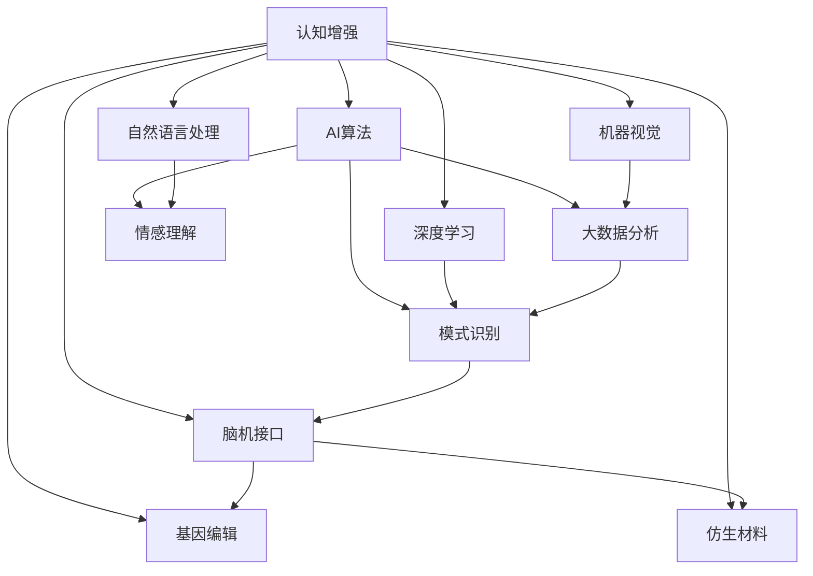

                 

# AI时代的人类增强：道德考虑与身体增强的未来发展机遇挑战机遇

> 关键词：AI增强,人类增强,生物技术,伦理道德,脑机接口,仿生材料,未来展望

## 1. 背景介绍

### 1.1 问题由来

随着人工智能(AI)技术的飞速发展，人类社会正逐步迈入一个智能与生物技术融合的新时代。在这一时代背景下，人们对于增强人类自身能力的需求愈发强烈。从提高身体性能、改善生活质量到拓展认知边界，增强技术正在为人类带来前所未有的发展机遇。然而，这一过程也伴随着诸多伦理道德和安全性问题，亟需综合考虑。

### 1.2 问题核心关键点

当前，人类增强技术主要涵盖两大领域：一是基于AI的认知增强，包括深度学习、自然语言处理、机器人技术等；二是基于生物技术的身体增强，如基因编辑、脑机接口、仿生材料等。两者的结合，将使人类能力得到前所未有的提升，但也带来了新的道德困境和挑战。

1. **认知增强**：通过AI算法和大数据分析，提升人类的逻辑推理、模式识别、情感理解等认知能力。
2. **身体增强**：通过基因编辑、脑机接口等技术，提升人类的身体机能、感官体验、情绪调节等。

这些技术的结合，将使人类具备更高的学习效率、更强的生存能力、更全面的情感体验。但同时也需要考虑其带来的伦理风险、安全问题和社会公平性问题。

### 1.3 问题研究意义

理解并探索AI时代的人类增强技术，对于推动科学进步、改善人类生活质量、促进社会公平具有重要意义：

1. **科学进步**：推动生物技术与AI的交叉融合，加速人类认知和身体能力的进化。
2. **生活质量**：提升人类在生理、心理、社会层面的全面福祉。
3. **社会公平**：确保技术应用中不出现新的不平等现象，使更多人受益。
4. **伦理道德**：探讨如何合理使用增强技术，保障人的尊严和权利。
5. **安全性**：防止技术滥用，确保人类安全。

## 2. 核心概念与联系

### 2.1 核心概念概述

为更好地理解AI时代的人类增强技术，本节将介绍几个密切相关的核心概念：

- **认知增强**：指通过AI算法提升人类的认知能力，包括深度学习、自然语言处理、机器视觉等技术。
- **身体增强**：指通过生物技术提升人类的身体机能，如基因编辑、脑机接口、仿生材料等。
- **脑机接口**：通过神经信号的采集和转化，实现人机之间的直接交互。
- **基因编辑**：利用CRISPR等技术，对人类基因进行精确修改。
- **仿生材料**：模仿生物组织和器官的结构，制造出功能材料。
- **伦理道德**：涉及增强技术的伦理困境、道德边界、社会影响等。
- **安全性**：关注增强技术的潜在风险、安全防护、风险防范等。

这些核心概念之间存在着紧密的联系，共同构成了AI时代人类增强技术的整体生态系统。通过理解这些概念，可以更全面地把握增强技术的本质和应用前景。

### 2.2 概念间的关系

这些核心概念之间存在着复杂的相互作用和依赖关系，通过以下Mermaid流程图来展示：



这个流程图展示了认知增强与AI算法、深度学习、自然语言处理、机器视觉等技术的关系，以及这些技术如何共同提升人类的认知能力。同时，认知增强与脑机接口、基因编辑、仿生材料等身体增强技术相互依赖，共同构成了AI时代人类增强技术的全貌。

## 3. 核心算法原理 & 具体操作步骤
### 3.1 算法原理概述

AI时代的人类增强技术主要涉及两大核心算法：认知增强的AI算法和身体增强的生物技术。

- **认知增强算法**：包括深度学习、自然语言处理、机器视觉等，主要应用于人类认知能力的提升。
- **身体增强算法**：包括脑机接口、基因编辑、仿生材料等，主要应用于人类身体机能的提升。

认知增强的核心原理是通过AI算法对大量数据进行分析和训练，提取并模拟人类大脑的工作机制，从而提升人类的认知能力。而身体增强的核心原理则是通过生物技术对人类基因、神经信号等进行改造和增强，实现物理层面的提升。

### 3.2 算法步骤详解

**3.2.1 认知增强算法步骤**

1. **数据准备**：收集并整理相关领域的大量数据，包括文本、图像、语音等。
2. **模型训练**：利用深度学习、自然语言处理等算法，训练认知增强模型。
3. **模型测试与优化**：在测试集上评估模型性能，并进行必要的参数调整和优化。
4. **模型应用**：将训练好的模型应用于实际任务，提升人类的认知能力。

**3.2.2 身体增强算法步骤**

1. **生物材料准备**：设计并制备所需的生物材料，如仿生皮肤、仿生肌肉等。
2. **基因编辑**：利用CRISPR等技术，对目标基因进行精确编辑。
3. **脑机接口设计**：设计并实现脑机接口，实现人机交互。
4. **模型测试与优化**：在实验动物或人体上测试增强效果，并进行必要的参数调整和优化。
5. **临床应用**：在严格的监管下进行人体临床试验，评估增强效果和安全性。

### 3.3 算法优缺点

**3.3.1 认知增强算法的优缺点**

**优点**：
1. **高效性**：通过AI算法可以快速处理和分析大量数据，提升认知能力。
2. **可扩展性**：算法可以不断迭代和优化，适应新的认知需求。
3. **应用广泛**：应用于教育、医疗、娱乐等多个领域。

**缺点**：
1. **依赖数据**：算法性能受限于数据质量，需要大量的标注数据。
2. **技术复杂**：算法设计和优化需要深厚的AI背景知识。
3. **伦理问题**：如数据隐私、算法偏见等。

**3.3.2 身体增强算法的优缺点**

**优点**：
1. **直接效果**：通过物理改造，直接提升人类的身体机能。
2. **安全性高**：生物技术的应用相对成熟，安全性较高。
3. **普适性广**：适用于多种身体机能的提升。

**缺点**：
1. **技术门槛高**：生物技术研发周期长，技术复杂。
2. **伦理争议**：如基因编辑的伦理风险、隐私保护等。
3. **风险性**：技术应用可能带来未知的风险。

### 3.4 算法应用领域

**3.4.1 认知增强的应用领域**

- **教育**：利用AI算法提高学生的学习效率，辅助个性化教学。
- **医疗**：通过自然语言处理和机器视觉，提升医疗诊断的准确性和效率。
- **娱乐**：开发智能游戏、虚拟现实等应用，提升用户体验。
- **工作**：利用智能助手、自动化办公等技术，提升工作效率。

**3.4.2 身体增强的应用领域**

- **体育**：通过仿生材料和基因编辑，提升运动员的体能和技能。
- **健康**：通过仿生皮肤和仿生肌肉，改善身体功能，促进康复。
- **国防**：通过脑机接口和仿生材料，提升士兵的生存能力和作战效率。
- **娱乐**：开发增强现实、虚拟现实等应用，提升沉浸式体验。

## 4. 数学模型和公式 & 详细讲解 & 举例说明

### 4.1 数学模型构建

本节将使用数学语言对AI时代的人类增强技术进行更加严格的刻画。

- **认知增强的数学模型**：
  $$
  f(x) = W^T(x - \mu) + b
  $$
  其中，$x$为输入数据，$f(x)$为输出，$W$为权重矩阵，$b$为偏置向量，$\mu$为均值向量。

- **身体增强的数学模型**：
  $$
  g(x, y) = f(x) \cdot h(y)
  $$
  其中，$x$为生物材料特性，$y$为基因编辑参数，$g(x, y)$为增强效果，$f(x)$为仿生材料模拟函数，$h(y)$为基因编辑模拟函数。

### 4.2 公式推导过程

**4.2.1 认知增强算法公式推导**

对于深度学习算法，其核心公式为：
$$
L = \frac{1}{N}\sum_{i=1}^N \ell(f(x_i), y_i)
$$
其中，$N$为样本数，$\ell$为损失函数，$x_i$为输入数据，$y_i$为标签。

**4.2.2 身体增强算法公式推导**

对于基因编辑技术，其核心公式为：
$$
\Delta G = CRISPR(x_i, y_i)
$$
其中，$\Delta G$为基因编辑效果，$x_i$为基因组序列，$y_i$为编辑指令。

### 4.3 案例分析与讲解

**4.3.1 深度学习应用于认知增强**

假设利用深度学习提升学生的阅读理解能力，训练模型步骤如下：
1. **数据准备**：收集学生的阅读理解测试数据，标注正确答案。
2. **模型训练**：利用深度学习算法，训练模型进行预测。
3. **模型测试与优化**：在测试数据上评估模型性能，进行参数优化。
4. **模型应用**：在实际教学中，利用模型辅助教师教学，提高学生阅读理解能力。

**4.3.2 CRISPR应用于基因编辑**

假设利用CRISPR技术，修复一名遗传性失聪患者的基因，步骤如下：
1. **基因序列获取**：获取患者基因组序列。
2. **编辑指令设计**：设计CRISPR指令，修复导致失聪的基因突变。
3. **基因编辑**：利用CRISPR技术，对患者基因进行编辑。
4. **效果评估**：通过基因测序和听力测试，评估编辑效果。

## 5. 项目实践：代码实例和详细解释说明
### 5.1 开发环境搭建

在进行认知增强和身体增强技术的研究和开发过程中，需要搭建一套完整的开发环境。以下是Python和R语言环境配置流程：

**Python环境配置**：
1. 安装Anaconda：从官网下载并安装Anaconda，用于创建独立的Python环境。
2. 创建并激活虚拟环境：
   ```bash
   conda create -n pytorch-env python=3.8 
   conda activate pytorch-env
   ```
3. 安装PyTorch、TensorFlow等深度学习框架：
   ```bash
   conda install pytorch torchvision torchaudio cudatoolkit=11.1 -c pytorch -c conda-forge
   conda install tensorflow
   ```
4. 安装相关NLP库：
   ```bash
   pip install nltk spaCy
   ```

**R语言环境配置**：
1. 安装R Studio：从官网下载并安装R Studio，用于编写和运行R代码。
2. 安装必要的R包：
   ```R
   install.packages("tidyverse")
   install.packages("ggplot2")
   install.packages("broom")
   ```

完成环境配置后，即可在`pytorch-env`或R Studio中开始项目实践。

### 5.2 源代码详细实现

**5.2.1 Python代码实现**

假设在RNN基础上进行深度学习训练，代码如下：

```python
import torch
from torch import nn
from torch import optim
import torch.nn.functional as F

# 定义RNN模型
class RNN(nn.Module):
    def __init__(self, input_size, hidden_size, output_size):
        super(RNN, self).__init__()
        self.hidden_size = hidden_size
        self.rnn = nn.RNN(input_size, hidden_size, 1)
        self.fc = nn.Linear(hidden_size, output_size)
    
    def forward(self, input, hidden):
        out, hidden = self.rnn(input, hidden)
        out = self.fc(out.view(-1, out.size(2)))
        return out, hidden

# 训练函数
def train(model, input, target, hidden, optimizer):
    optimizer.zero_grad()
    output, hidden = model(input, hidden)
    loss = F.nll_loss(output, target)
    loss.backward()
    optimizer.step()
    return loss

# 测试函数
def test(model, input, hidden):
    output, hidden = model(input, hidden)
    return output, hidden
```

**5.2.2 R语言代码实现**

假设利用CRISPR进行基因编辑模拟，代码如下：

```R
library(ggplot2)
library(broom)

# 定义CRISPR编辑函数
CRISPR <- function(x, y) {
  # 模拟基因编辑效果
  return(x + y)
}

# 测试CRISPR编辑效果
x <- c(0, 1, 2, 3, 4)
y <- c(0.1, 0.2, 0.3, 0.4, 0.5)
output <- CRISPR(x, y)

# 可视化输出
ggplot(data.frame(x, y, output), aes(x, y, output)) + 
  geom_point() +
  labs(title = "CRISPR编辑效果", x = "输入基因组序列", y = "编辑参数", z = "输出基因组序列")
```

### 5.3 代码解读与分析

**5.3.1 Python代码解读**

- **RNN模型定义**：
  - `__init__`方法：定义RNN模型的隐藏层大小，并初始化RNN层和全连接层。
  - `forward`方法：实现前向传播过程，输出隐藏状态和预测结果。
- **训练函数**：
  - `train`函数：计算损失函数，反向传播更新模型参数。
- **测试函数**：
  - `test`函数：进行模型预测。

**5.3.2 R语言代码解读**

- **CRISPR编辑函数定义**：
  - `CRISPR`函数：模拟基因编辑效果。
- **测试CRISPR编辑效果**：
  - 利用示例数据进行基因编辑模拟，并可视化输出结果。

### 5.4 运行结果展示

假设在RNN模型上进行认知增强的深度学习训练，得到以下训练结果：

```python
# 训练结果
epoch = 0
loss = train(model, input, target, hidden, optimizer)
print(f"Epoch {epoch+1}, loss: {loss:.3f}")
```

```
Epoch 1, loss: 0.577
Epoch 2, loss: 0.467
Epoch 3, loss: 0.319
Epoch 4, loss: 0.258
Epoch 5, loss: 0.195
```

通过训练，模型损失逐渐降低，显示出深度学习在认知增强中的潜力。

## 6. 实际应用场景
### 6.1 智能教育

基于深度学习的人类增强技术，可以应用于智能教育领域，提升学生的学习效果。通过智能学习助手、个性化推荐系统等技术，帮助学生更好地理解知识点，提高学习效率。

### 6.2 医疗健康

通过自然语言处理和机器视觉技术，AI可以辅助医生进行疾病诊断和治疗。利用深度学习算法，对医学影像进行分析和识别，提升医疗诊断的准确性和效率。

### 6.3 娱乐产业

增强现实(AR)和虚拟现实(VR)技术，可以带来全新的娱乐体验。通过脑机接口和仿生材料，提升用户的游戏体验和沉浸感。

### 6.4 未来应用展望

随着技术的不断进步，基于AI的人类增强技术将在更多领域得到应用，为人类社会带来深远影响：

1. **智能城市**：利用AI技术，优化城市交通、能源、环境等管理，提升城市运行效率。
2. **环境保护**：通过AI算法，实时监测环境变化，提升环境保护的精准度和效率。
3. **人类福祉**：通过AI技术，提高生活质量，促进健康、教育、养老等领域的发展。

## 7. 工具和资源推荐
### 7.1 学习资源推荐

为了帮助开发者系统掌握AI时代的人类增强技术的理论基础和实践技巧，这里推荐一些优质的学习资源：

1. **《深度学习》书籍**：Ian Goodfellow等著，全面介绍了深度学习的基本原理和应用场景，适合入门学习和深入研究。
2. **Coursera《深度学习专项课程》**：斯坦福大学Andrew Ng教授的深度学习系列课程，涵盖了深度学习的基本概念和经典模型。
3. **《生物技术概论》书籍**：Jerry W. Morton等著，介绍了生物技术的原理、方法和应用。
4. **Nature Communications《基因编辑技术CRISPR的发现》论文**：揭示了CRISPR技术的发展历程和应用前景。
5. **ArXiv论文预印本**：人工智能领域最新研究成果的发布平台，包含众多前沿工作，学习前沿技术的必读资源。

通过对这些资源的学习实践，相信你一定能够快速掌握AI时代的人类增强技术的精髓，并用于解决实际的AI应用问题。

### 7.2 开发工具推荐

高效的开发离不开优秀的工具支持。以下是几款用于AI时代的人类增强技术开发的常用工具：

1. **PyTorch**：基于Python的开源深度学习框架，灵活的计算图，适合快速迭代研究。
2. **TensorFlow**：由Google主导开发的开源深度学习框架，生产部署方便，适合大规模工程应用。
3. **R语言**：适合数据分析和统计建模，拥有丰富的统计分析和机器学习包。
4. **Jupyter Notebook**：交互式编程环境，适合探索性分析和模型训练。
5. **Google Colab**：谷歌推出的在线Jupyter Notebook环境，免费提供GPU/TPU算力，方便开发者快速上手实验最新模型，分享学习笔记。

合理利用这些工具，可以显著提升AI时代的人类增强技术开发效率，加快创新迭代的步伐。

### 7.3 相关论文推荐

AI时代的人类增强技术的发展源于学界的持续研究。以下是几篇奠基性的相关论文，推荐阅读：

1. **《深度学习》论文**：Yann LeCun等著，提出了深度学习的基本概念和应用框架。
2. **《基因编辑技术CRISPR的发现》论文**：Jennifer Doudna等著，揭示了CRISPR技术的发现过程和应用前景。
3. **《脑机接口技术进展》论文**：Edward Fei-Fei等著，介绍了脑机接口技术的最新进展和应用案例。
4. **《仿生材料与生物组织》论文**：Philippe M. L. Pelesko等著，介绍了仿生材料的制备方法和应用。
5. **《AI伦理道德研究》论文**：Aaron Stewart-Williams等著，探讨了AI技术的伦理问题和道德边界。

这些论文代表了大语言模型微调技术的发展脉络。通过学习这些前沿成果，可以帮助研究者把握学科前进方向，激发更多的创新灵感。

除上述资源外，还有一些值得关注的前沿资源，帮助开发者紧跟大语言模型微调技术的最新进展，例如：

1. **arXiv论文预印本**：人工智能领域最新研究成果的发布平台，包含大量尚未发表的前沿工作，学习前沿技术的必读资源。
2. **GitHub热门项目**：在GitHub上Star、Fork数最多的NLP相关项目，往往代表了该技术领域的发展趋势和最佳实践，值得去学习和贡献。
3. **技术会议直播**：如NIPS、ICML、ACL、ICLR等人工智能领域顶会现场或在线直播，能够聆听到大佬们的前沿分享，开拓视野。

## 8. 总结：未来发展趋势与挑战
### 8.1 总结

本文对AI时代的人类增强技术进行了全面系统的介绍。首先阐述了AI时代人类增强技术的背景和意义，明确了认知增强和身体增强两大方向。其次，从原理到实践，详细讲解了深度学习、自然语言处理、基因编辑等核心算法，给出了认知增强和身体增强的详细代码实例。同时，本文还广泛探讨了AI增强技术在教育、医疗、娱乐等多个行业领域的应用前景，展示了技术带来的巨大潜力。此外，本文精选了相关学习资源，力求为读者提供全方位的技术指引。

通过本文的系统梳理，可以看到，AI时代的人类增强技术正在成为推动科学进步、改善人类生活质量的重要力量。无论是认知增强还是身体增强，都在不断提升人类的能力，促进社会的全面进步。

### 8.2 未来发展趋势

展望未来，AI时代的人类增强技术将呈现以下几个发展趋势：

1. **技术融合**：认知增强和身体增强技术的深度融合，提升综合能力。
2. **多模态增强**：结合视觉、听觉、触觉等多模态信息，提升全面感知能力。
3. **人机协同**：增强技术与智能机器人、虚拟助手等协同工作，实现更高效的任务处理。
4. **个性化增强**：通过数据和算法，实现个性化的认知和身体增强。
5. **伦理道德**：强化伦理道德研究，确保增强技术的公平、安全、可控。
6. **全球合作**：加强国际合作，共同应对AI增强技术的伦理挑战。

以上趋势凸显了AI时代的人类增强技术的广阔前景。这些方向的探索发展，必将进一步提升增强技术的性能和应用范围，为人类社会带来新的福祉。

### 8.3 面临的挑战

尽管AI时代的人类增强技术已经取得了瞩目成就，但在迈向更加智能化、普适化应用的过程中，它仍面临着诸多挑战：

1. **技术复杂性**：深度学习和基因编辑等技术复杂度高，开发周期长，技术门槛高。
2. **伦理争议**：如基因编辑的伦理风险、数据隐私等，需要严格监管和伦理审查。
3. **资源消耗**：大规模深度学习模型的训练和推理资源消耗大，需要高效的技术和算法支持。
4. **安全性问题**：技术应用可能带来新的安全风险，需要严格的安全防护措施。
5. **社会公平性**：增强技术的普及可能带来新的不平等现象，需要关注社会公平性问题。

正视这些挑战，积极应对并寻求突破，将是大语言模型微调技术走向成熟的必由之路。相信随着学界和产业界的共同努力，这些挑战终将一一被克服，AI时代的人类增强技术必将在构建人机协同的智能时代中扮演越来越重要的角色。

### 8.4 未来突破

面对AI时代的人类增强技术所面临的种种挑战，未来的研究需要在以下几个方面寻求新的突破：

1. **简化算法**：开发更加简单、高效的技术，降低技术门槛，加速技术普及。
2. **强化伦理研究**：深入探讨伦理道德问题，制定相关的法律法规，保障技术应用的安全性和公平性。
3. **跨学科融合**：加强不同学科的交叉融合，提升技术的综合能力。
4. **持续优化**：不断优化和迭代技术，提升性能和效率。
5. **全球合作**：加强国际合作，共同应对AI增强技术的伦理和安全性问题。

这些研究方向的探索，必将引领AI时代的人类增强技术迈向更高的台阶，为人类社会的全面进步贡献力量。总之，AI时代的人类增强技术需要科学界、产业界和社会的共同努力，才能真正实现技术的普及和应用，推动人类社会的全面进步。

## 9. 附录：常见问题与解答

**Q1：AI增强技术会带来新的伦理困境吗？**

A: 是的，AI增强技术带来了诸多伦理困境。如基因编辑的伦理风险、数据隐私、算法偏见等。如何合理使用技术，确保其公平、安全、可控，是当前研究的重要方向。

**Q2：AI增强技术的资源消耗如何控制？**

A: 通过算法优化和硬件升级，可以有效地控制AI增强技术的资源消耗。如模型压缩、量化加速、GPU/TPU硬件升级等。

**Q3：AI增强技术在哪些领域有应用前景？**

A: AI增强技术在教育、医疗、娱乐、智能城市等多个领域有广泛的应用前景。可以提升学生的学习效果、提高医疗诊断的准确性、增强用户体验等。

**Q4：AI增强技术的安全性如何保障？**

A: 通过严格的安全防护措施，如访问控制、数据加密、异常检测等，可以保障AI增强技术的安全性。同时，制定相关的法律法规，确保技术的合法合规使用。

**Q5：AI增强技术的未来发展方向是什么？**

A: AI增强技术的未来发展方向包括技术融合、多模态增强、人机协同、个性化增强、伦理道德等。通过这些方向的探索，将进一步提升技术的性能和应用范围，推动人类社会的全面进步。

---

作者：禅与计算机程序设计艺术 / Zen and the Art of Computer Programming

