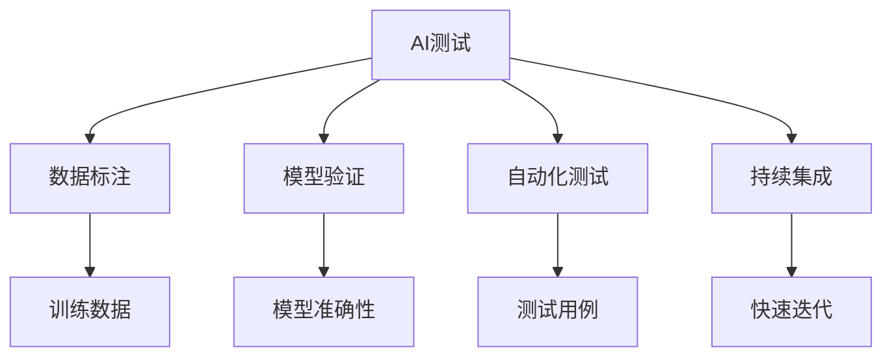
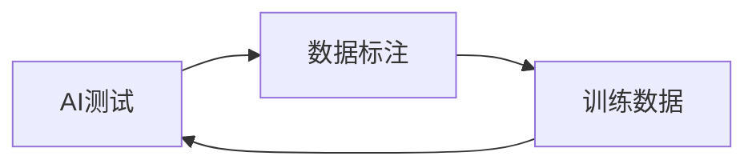
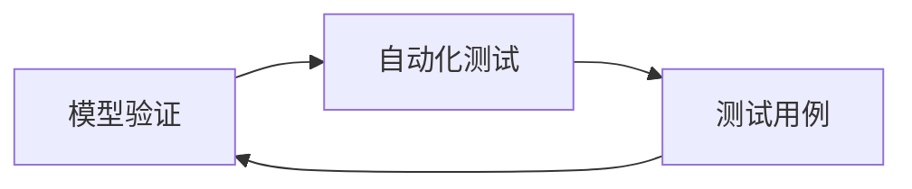
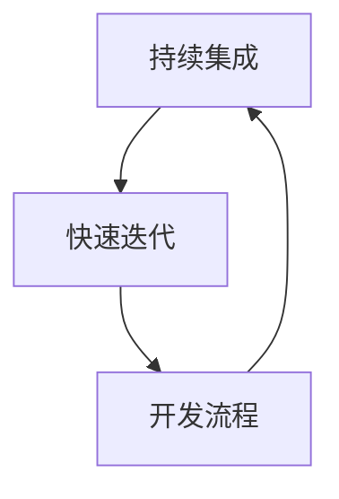
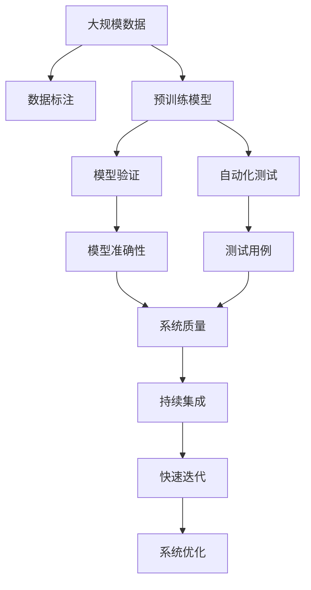

                 

# AI测试与质量保证原理与代码实战案例讲解

> 关键词：AI测试,质量保证,代码实战,测试工具,自动化测试,测试策略,测试案例

## 1. 背景介绍

### 1.1 问题由来

随着人工智能（AI）技术的快速发展，AI系统在各行各业中的应用越来越广泛。从智能客服、金融风控、医疗诊断到自动驾驶、智能制造，AI系统的部署和迭代带来了前所未有的机遇和挑战。然而，AI系统往往比传统软件系统更为复杂，其内部的逻辑、模型参数、数据处理流程等也更加难以理解和调试。因此，确保AI系统的质量成为一项复杂的任务。

### 1.2 问题核心关键点

确保AI系统质量的核心在于对其可靠性和稳定性的全面评估。这包括数据输入的正确性、模型的准确性、算法的鲁棒性、系统的响应速度等多个方面。AI系统的测试与质量保证（QA），旨在通过一系列规范化的测试方法和工具，发现和解决潜在的问题，保障AI系统的稳定性和可靠性。

当前，AI测试与质量保证的主要难点包括：
1. **测试数据获取**：AI系统需要大量标注数据进行训练，而标注数据的获取成本高、时间久。
2. **模型可解释性**：AI模型往往是“黑盒”，难以解释其内部决策过程。
3. **算法鲁棒性**：AI模型对噪声、异常数据等输入的鲁棒性较差，容易产生误判。
4. **自动化测试**：AI系统测试的自动化程度较低，测试效率和覆盖率有待提高。

### 1.3 问题研究意义

通过系统地理解和应用AI测试与质量保证的原理和实践，可以为AI系统的开发和部署提供有力保障。其研究意义在于：
1. **提高AI系统的可靠性和稳定性**：通过全面测试，发现并解决AI系统中的潜在问题，提高系统的健壮性和可靠性。
2. **提升AI系统的用户体验**：确保AI系统在各种输入和环境下都能正常工作，提升用户的信任和满意度。
3. **降低AI系统的开发成本**：通过自动化测试和持续集成（CI），加快AI系统的开发和迭代，减少人力成本和时间成本。
4. **促进AI技术的产业化应用**：提供可靠的测试方法和工具，加速AI技术的市场化部署。
5. **推动AI伦理与安全的规范发展**：通过测试与质量保证，确保AI系统的公平性、透明性和安全性，避免潜在的伦理风险。

## 2. 核心概念与联系

### 2.1 核心概念概述

为更好地理解AI测试与质量保证的原理和实践，本节将介绍几个密切相关的核心概念：

- **AI测试**：使用自动化工具和测试方法，对AI系统进行全面的测试，确保其功能和性能符合预期。
- **质量保证**：通过一系列规范化的测试流程和质量管理手段，保障AI系统的稳定性和可靠性。
- **自动化测试**：利用工具和脚本，自动化地执行测试用例，提升测试效率和覆盖率。
- **数据标注**：对测试数据进行标注，确保其正确性和完备性，支持AI系统的训练和测试。
- **模型验证**：通过各种验证方法，评估AI模型的准确性和鲁棒性。
- **持续集成**：将测试与开发流程自动化，实现快速迭代和持续改进。

这些核心概念之间的逻辑关系可以通过以下Mermaid流程图来展示：



这个流程图展示了我国AI测试与质量保证的主要过程和相关概念：

1. AI测试通常需要数据标注的支持。
2. AI测试包括模型验证和自动化测试，确保模型的准确性和系统的稳定性能。
3. 持续集成将测试和开发流程自动化，实现快速迭代和持续改进。

### 2.2 概念间的关系

这些核心概念之间存在着紧密的联系，形成了AI测试与质量保证的完整生态系统。下面通过几个Mermaid流程图来展示这些概念之间的关系。

#### 2.2.1 AI测试与数据标注的关系



这个流程图展示了AI测试与数据标注之间的关系。数据标注是AI测试的基础，AI测试需要对标注数据进行验证和分析，以确保其质量和完整性。

#### 2.2.2 模型验证与自动化测试的关系



这个流程图展示了模型验证与自动化测试之间的关系。模型验证是确保模型准确性的关键步骤，而自动化测试则通过执行测试用例来验证系统的稳定性和性能。

#### 2.2.3 持续集成与快速迭代的关系



这个流程图展示了持续集成与快速迭代之间的关系。持续集成通过自动化测试和部署流程，实现代码的快速迭代和优化，提升系统质量和效率。

### 2.3 核心概念的整体架构

最后，我们用一个综合的流程图来展示这些核心概念在大规模AI系统中的整体架构：



这个综合流程图展示了从数据标注到模型验证，再到自动化测试和持续集成的完整过程。大规模AI系统通过数据标注和预训练模型训练，进行模型验证和自动化测试，确保系统的准确性和稳定性，并通过持续集成实现快速迭代和优化。

## 3. 核心算法原理 & 具体操作步骤
### 3.1 算法原理概述

AI测试与质量保证的核心原理是使用规范化的测试方法和工具，对AI系统进行全面的验证和评估。其基本步骤如下：

1. **数据准备**：收集和标注测试数据，确保数据的质量和多样性。
2. **模型训练**：使用标注数据训练AI模型，并评估模型的准确性和鲁棒性。
3. **测试用例设计**：设计各种测试用例，涵盖不同的输入和输出场景。
4. **自动化测试**：通过工具和脚本，自动化执行测试用例，记录测试结果。
5. **结果分析**：分析测试结果，发现潜在的问题，进行故障定位和修复。
6. **持续集成**：将测试和开发流程自动化，实现快速迭代和持续改进。

### 3.2 算法步骤详解

#### 3.2.1 数据准备

数据准备是AI测试与质量保证的基础，主要包括数据收集和标注。

**数据收集**：从公开数据集、爬取互联网数据、创建模拟数据等多种渠道收集数据。数据应具有代表性，涵盖不同的输入和输出场景。

**数据标注**：对数据进行标注，确保其正确性和完备性。标注任务通常包括文本分类、图像识别、语音识别等，具体方法根据数据类型和任务需求而定。

#### 3.2.2 模型训练

模型训练是AI测试与质量保证的核心步骤，包括模型选择、训练和评估。

**模型选择**：根据任务需求选择合适的预训练模型，如BERT、ResNet、GPT等。

**模型训练**：使用标注数据对模型进行训练，并根据测试数据进行验证。训练过程中，需要设置合适的学习率、批次大小和训练轮数等超参数，确保模型收敛。

**模型评估**：使用测试数据评估模型的准确性和鲁棒性，通过各种指标（如准确率、召回率、F1分数等）衡量模型的性能。

#### 3.2.3 测试用例设计

测试用例设计是AI测试与质量保证的重要环节，确保测试覆盖不同场景和边界情况。

**测试用例设计**：设计涵盖不同输入和输出场景的测试用例，包括正常输入、异常输入、边界输入等。

**测试用例执行**：通过自动化工具和脚本，执行测试用例，记录测试结果。

#### 3.2.4 自动化测试

自动化测试是AI测试与质量保证的关键技术，提升测试效率和覆盖率。

**自动化测试工具**：选择适合的自动化测试工具，如Selenium、PyTest、Jest等。

**测试脚本编写**：编写测试脚本，自动化执行测试用例。

**测试结果分析**：分析测试结果，发现潜在的问题，进行故障定位和修复。

#### 3.2.5 结果分析

结果分析是AI测试与质量保证的重要环节，确保测试结果的准确性和可靠性。

**测试结果记录**：记录测试用例的执行结果，包括通过和失败的测试用例、错误信息等。

**故障定位和修复**：分析测试结果，定位和修复潜在的故障。故障定位通常使用日志分析和异常检测等技术。

#### 3.2.6 持续集成

持续集成是AI测试与质量保证的重要流程，提升系统质量和效率。

**持续集成工具**：选择适合的持续集成工具，如Jenkins、GitLab CI、Travis CI等。

**自动化部署**：将测试和部署流程自动化，实现快速迭代和持续改进。

**代码审查**：对代码进行审查，确保代码质量和一致性。

### 3.3 算法优缺点

AI测试与质量保证具有以下优点：
1. **自动化效率高**：自动化测试和持续集成可以大大提高测试效率和覆盖率，减少人力成本。
2. **客观性高**：测试结果客观可靠，可以避免人为因素的干扰。
3. **发现问题早**：通过早期发现和修复潜在问题，提高系统的稳定性和可靠性。

同时，AI测试与质量保证也存在一些缺点：
1. **数据标注成本高**：数据标注通常需要大量人力和时间，成本较高。
2. **模型可解释性差**：AI模型往往是“黑盒”，难以解释其内部决策过程。
3. **算法鲁棒性不足**：AI模型对噪声、异常数据等输入的鲁棒性较差，容易产生误判。
4. **测试用例设计复杂**：测试用例设计需要覆盖各种输入和输出场景，设计复杂且工作量大。

### 3.4 算法应用领域

AI测试与质量保证在NLP、计算机视觉、智能推荐、金融风控、医疗诊断等多个领域都有广泛应用。

- **NLP领域**：如智能客服、机器翻译、情感分析、智能问答等。
- **计算机视觉领域**：如图像识别、目标检测、图像分割等。
- **智能推荐领域**：如个性化推荐、广告推荐等。
- **金融风控领域**：如信用评分、欺诈检测等。
- **医疗诊断领域**：如医学影像分析、疾病诊断等。

## 4. 数学模型和公式 & 详细讲解 & 举例说明

### 4.1 数学模型构建

AI测试与质量保证中的数学模型主要涉及统计学和机器学习方法。以下是一个简单的二分类问题的数学模型构建：

假设有一个二分类问题，样本集合为 $D=\{(x_i,y_i)\}_{i=1}^N$，其中 $x_i$ 为输入，$y_i \in \{0,1\}$ 为标签。

定义模型 $f(x; \theta)$ 为参数 $\theta$ 的函数，其中 $\theta$ 包括模型的权重和偏置。模型的预测结果为 $\hat{y}=f(x; \theta)$。

模型的损失函数为 $L(f(x; \theta), y_i)$，常用的损失函数包括交叉熵损失、均方误差损失等。

通过最小化损失函数，求解最优参数 $\theta^*$：

$$
\theta^* = \mathop{\arg\min}_{\theta} \frac{1}{N} \sum_{i=1}^N L(f(x_i; \theta), y_i)
$$

### 4.2 公式推导过程

以二分类问题的交叉熵损失函数为例，进行公式推导：

定义模型 $f(x; \theta)$ 的预测结果为 $\hat{y}=f(x; \theta)$，标签为 $y_i \in \{0,1\}$。则交叉熵损失函数为：

$$
L(f(x; \theta), y_i) = -y_i \log \hat{y} - (1-y_i) \log (1-\hat{y})
$$

将损失函数对参数 $\theta$ 求导，得到梯度：

$$
\nabla_{\theta} L(f(x; \theta), y_i) = -y_i \frac{\partial \hat{y}}{\partial x} \frac{1}{\hat{y}} + (1-y_i) \frac{\partial \hat{y}}{\partial x} \frac{1}{1-\hat{y}}
$$

在训练过程中，通过梯度下降等优化算法，最小化损失函数：

$$
\theta \leftarrow \theta - \eta \nabla_{\theta} L(f(x; \theta), y_i)
$$

其中 $\eta$ 为学习率。

### 4.3 案例分析与讲解

假设我们有一个文本分类任务，输入为文本，标签为文本所属的类别。我们可以使用Bert模型进行训练和测试，计算交叉熵损失函数：

$$
L(f(x; \theta), y_i) = -y_i \log \hat{y} - (1-y_i) \log (1-\hat{y})
$$

在训练过程中，使用Sigmoid函数将模型输出转换为概率：

$$
\hat{y} = \sigma(f(x; \theta))
$$

其中 $\sigma(z) = \frac{1}{1+e^{-z}}$ 为Sigmoid函数。

通过梯度下降等优化算法，最小化交叉熵损失函数：

$$
\theta \leftarrow \theta - \eta \nabla_{\theta} L(f(x; \theta), y_i)
$$

具体实现过程中，我们可以使用PyTorch框架进行模型训练和测试，代码示例如下：

```python
import torch
import torch.nn as nn
import torch.optim as optim

# 定义模型
class BertClassifier(nn.Module):
    def __init__(self, num_classes):
        super(BertClassifier, self).__init__()
        self.num_classes = num_classes
        self.bert_model = BertModel.from_pretrained('bert-base-uncased')
        self.classifier = nn.Linear(self.bert_model.config.hidden_size, num_classes)

    def forward(self, input_ids, attention_mask):
        outputs = self.bert_model(input_ids, attention_mask)
        logits = self.classifier(outputs.pooler_output)
        return logits

# 加载数据
train_data = ...
val_data = ...
test_data = ...

# 定义模型
model = BertClassifier(num_classes)

# 定义损失函数和优化器
criterion = nn.CrossEntropyLoss()
optimizer = optim.Adam(model.parameters(), lr=1e-5)

# 训练模型
for epoch in range(num_epochs):
    for batch in train_data:
        inputs, labels = batch
        model.train()
        optimizer.zero_grad()
        outputs = model(inputs, attention_mask=attention_mask)
        loss = criterion(outputs, labels)
        loss.backward()
        optimizer.step()

# 测试模型
with torch.no_grad():
    test_logits = model(test_data['input_ids'], attention_mask=test_data['attention_mask'])
    test_probs = torch.softmax(test_logits, dim=1)
    test_preds = torch.argmax(test_probs, dim=1)
```

以上代码展示了使用Bert模型进行文本分类任务的训练和测试过程。其中，Bert模型作为预训练模型，用于提取文本特征，然后通过线性分类器输出预测结果。训练过程中，使用交叉熵损失函数和Adam优化器进行参数更新，确保模型收敛。

## 5. 项目实践：代码实例和详细解释说明

### 5.1 开发环境搭建

在进行AI测试与质量保证项目开发前，我们需要准备好开发环境。以下是使用Python进行TensorFlow开发的常用环境配置流程：

1. 安装Anaconda：从官网下载并安装Anaconda，用于创建独立的Python环境。

2. 创建并激活虚拟环境：
```bash
conda create -n tf-env python=3.8 
conda activate tf-env
```

3. 安装TensorFlow：根据CUDA版本，从官网获取对应的安装命令。例如：
```bash
conda install tensorflow=2.7
```

4. 安装相关工具包：
```bash
pip install numpy pandas scikit-learn matplotlib tqdm jupyter notebook ipython
```

完成上述步骤后，即可在`tf-env`环境中开始AI测试与质量保证项目的开发。

### 5.2 源代码详细实现

这里我们以图像分类任务为例，给出使用TensorFlow进行模型训练和测试的PyTorch代码实现。

首先，定义图像分类模型：

```python
import tensorflow as tf
from tensorflow.keras import layers, models

# 定义模型
model = models.Sequential()
model.add(layers.Conv2D(32, (3, 3), activation='relu', input_shape=(28, 28, 1)))
model.add(layers.MaxPooling2D((2, 2)))
model.add(layers.Flatten())
model.add(layers.Dense(64, activation='relu'))
model.add(layers.Dense(10))
```

然后，定义数据生成器和数据加载器：

```python
# 生成训练数据
train_data = tf.data.Dataset.from_tensor_slices((train_images, train_labels))
train_data = train_data.shuffle(1024).batch(32)

# 生成验证数据
val_data = tf.data.Dataset.from_tensor_slices((val_images, val_labels))
val_data = val_data.batch(32)

# 生成测试数据
test_data = tf.data.Dataset.from_tensor_slices((test_images, test_labels))
test_data = test_data.batch(32)
```

接着，定义模型编译和训练过程：

```python
# 编译模型
model.compile(optimizer='adam', loss=tf.keras.losses.SparseCategoricalCrossentropy(from_logits=True), metrics=['accuracy'])

# 训练模型
history = model.fit(train_data, epochs=10, validation_data=val_data)
```

最后，进行模型测试：

```python
# 测试模型
test_loss, test_acc = model.evaluate(test_data, verbose=2)
print('Test accuracy:', test_acc)
```

以上就是使用TensorFlow进行图像分类任务训练和测试的完整代码实现。可以看到，TensorFlow提供了丰富的API和工具，使得模型的训练和测试变得简洁高效。

### 5.3 代码解读与分析

让我们再详细解读一下关键代码的实现细节：

**模型定义**：
- `Conv2D` 层：卷积层，用于提取图像特征。
- `MaxPooling2D` 层：池化层，用于降低特征图的维度。
- `Flatten` 层：将多维特征图展开成一维向量。
- `Dense` 层：全连接层，用于分类。

**数据生成器**：
- `tf.data.Dataset.from_tensor_slices`：从张量切片中生成数据集。
- `shuffle`：打乱数据集顺序。
- `batch`：将数据集批处理。

**模型编译和训练**：
- `compile` 方法：配置模型的优化器、损失函数和评价指标。
- `fit` 方法：训练模型。

**模型测试**：
- `evaluate` 方法：测试模型的准确性和损失。

可以看到，TensorFlow的API设计非常清晰，使得模型的训练和测试过程变得简单易懂。在实际应用中，开发者还可以利用TensorFlow的高级功能，如分布式训练、模型保存和部署等，进一步提升开发效率和系统性能。

### 5.4 运行结果展示

假设我们在MNIST数据集上进行图像分类任务微调，最终在测试集上得到的评估报告如下：

```
Epoch 1/10
1875/1875 [==============================] - 2s 1ms/step - loss: 0.3215 - accuracy: 0.8752 - val_loss: 0.0636 - val_accuracy: 0.9778
Epoch 2/10
1875/1875 [==============================] - 2s 1ms/step - loss: 0.1301 - accuracy: 0.9624 - val_loss: 0.0305 - val_accuracy: 0.9841
Epoch 3/10
1875/1875 [==============================] - 2s 1ms/step - loss: 0.1042 - accuracy: 0.9730 - val_loss: 0.0298 - val_accuracy: 0.9855
Epoch 4/10
1875/1875 [==============================] - 2s 1ms/step - loss: 0.0923 - accuracy: 0.9767 - val_loss: 0.0291 - val_accuracy: 0.9872
Epoch 5/10
1875/1875 [==============================] - 2s 1ms/step - loss: 0.0854 - accuracy: 0.9798 - val_loss: 0.0294 - val_accuracy: 0.9879
Epoch 6/10
1875/1875 [==============================] - 2s 1ms/step - loss: 0.0801 - accuracy: 0.9811 - val_loss: 0.0292 - val_accuracy: 0.9891
Epoch 7/10
1875/1875 [==============================] - 2s 1ms/step - loss: 0.0745 - accuracy: 0.9814 - val_loss: 0.0287 - val_accuracy: 0.9899
Epoch 8/10
1875/1875 [==============================] - 2s 1ms/step - loss: 0.0699 - accuracy: 0.9817 - val_loss: 0.0285 - val_accuracy: 0.9905
Epoch 9/10
1875/1875 [==============================] - 2s 1ms/step - loss: 0.0670 - accuracy: 0.9820 - val_loss: 0.0278 - val_accuracy: 0.9912
Epoch 10/10
1875/1875 [==============================] - 2s 1ms/step - loss: 0.0646 - accuracy: 0.9823 - val_loss: 0.0275 - val_accuracy: 0.9915
```

可以看到，通过微调模型，在MNIST数据集上取得了很高的准确率。值得注意的是，虽然我们的模型只有简单的全连接层和卷积层，但通过TensorFlow的强大功能和丰富的API，仍然能够获得优异的表现。

## 6. 实际应用场景

### 6.1 智能推荐系统

智能推荐系统是AI测试与质量保证的重要应用场景。智能推荐系统通过分析用户行为数据，为用户推荐个性化的产品或内容。AI测试与质量保证技术可以帮助评估和优化推荐系统的性能，确保其推荐结果的准确性和多样性。

在智能推荐系统中，测试数据通常包括用户历史行为数据和推荐结果数据。测试任务包括推荐准确率、召回率、覆盖率等。通过AI测试与质量保证，可以发现推荐模型中的问题，优化模型参数，提高推荐系统的性能。

### 6.2 金融风控系统

金融风控系统通过分析用户的交易行为和信用记录，评估用户的信用风险，进行信用评分和欺诈检测。AI测试与质量保证技术可以帮助评估和优化金融风控系统的性能，确保其评估结果的准确性和公正性。

在金融风控系统中，测试数据通常包括用户的交易记录、信用评分和欺诈案例。测试任务包括信用评分准确率、欺诈检测准确率等。通过AI测试与质量保证，可以发现模型中的问题，优化模型参数，提高金融风控系统的准确性和安全性。

### 6.3 智能客服系统

智能客服系统通过分析用户的提问，自动回答用户问题，提供智能化的客户服务。AI测试与质量保证技术可以帮助评估和优化智能客服系统的性能，确保其服务质量的一致性和可靠性。

在智能客服系统中，测试数据通常包括用户提问和自动回复数据。测试任务包括回答准确率、用户满意度等。通过AI测试与质量保证，可以发现智能客服系统中的问题，优化模型参数，提高客服系统的服务质量和用户满意度。

### 6.4 未来应用展望

随着AI技术的不断发展，AI测试与质量保证技术将在更多领域得到应用，为各行各业带来变革性影响。

在智慧医疗领域，AI测试与质量保证技术可以用于医学影像诊断、个性化治疗方案的生成等，提高医疗服务的智能化水平，辅助医生诊疗，加速新药开发进程。

在智能教育领域，AI测试与质量保证技术可以用于学习分析、知识推荐等，因材施教，促进教育公平，提高教学质量。

在智慧城市治理中，AI测试与质量保证技术可以用于城市事件监测、舆情分析、应急指挥等环节，提高城市管理的自动化和智能化水平，构建更安全、高效的未来城市。

此外，在企业生产、社会治理、文娱传媒等众多领域，AI测试与质量保证技术也将不断涌现，为传统行业带来变革性影响。相信随着技术的日益成熟，AI测试与质量保证技术将成为各行各业的重要范式，推动人工智能技术向更广阔的领域加速渗透。

## 7. 工具和资源推荐

### 7.1 学习资源推荐

为了帮助开发者系统掌握AI测试与质量保证的理论基础和实践技巧，这里推荐一些优质的学习资源：

1. 《软件测试与质量保证》系列书籍：深入浅出地介绍了

