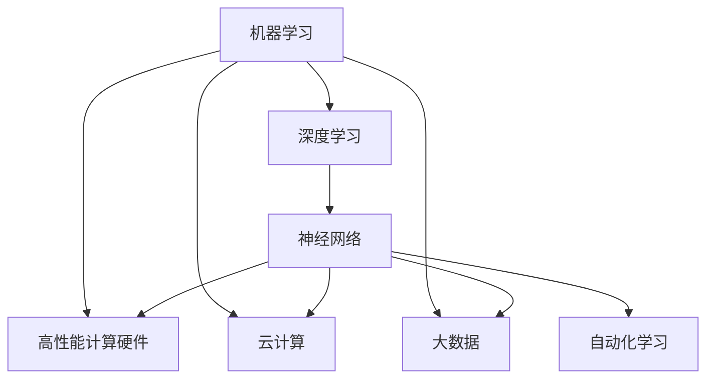
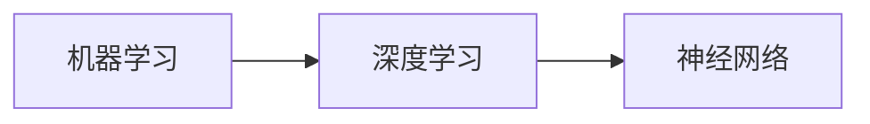
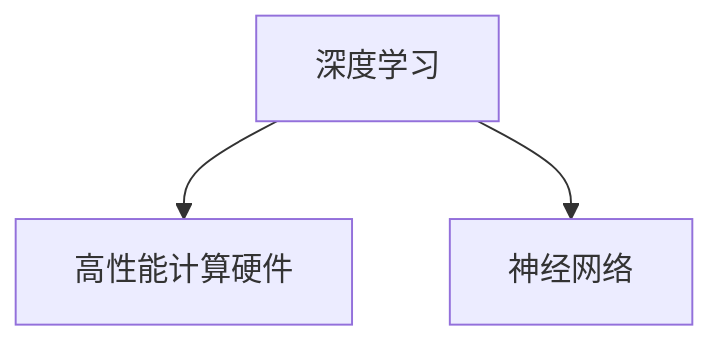
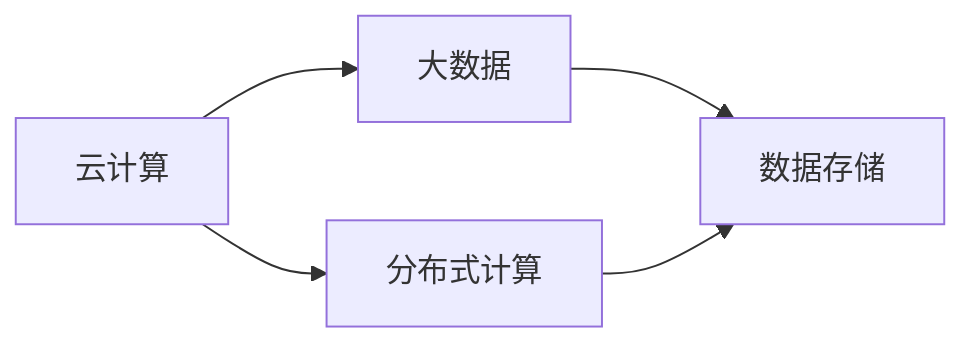
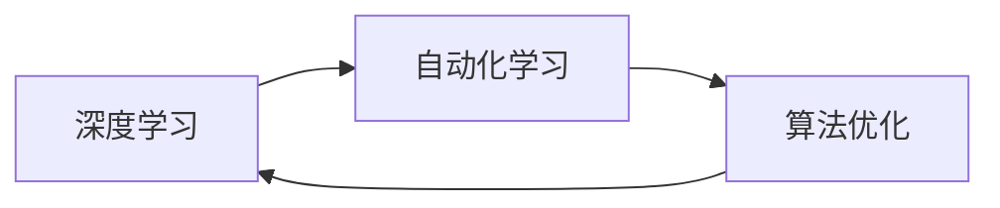
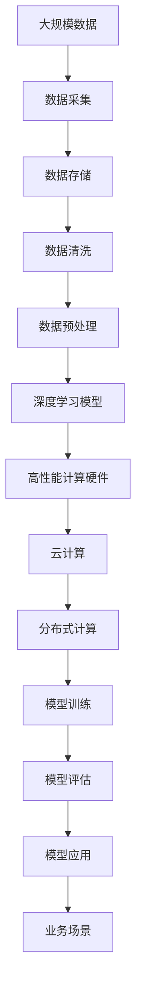

                 

# AI计算变化中的新机遇

> 关键词：AI计算、机器学习、深度学习、神经网络、大数据、云计算、自动化、人工智能、大数据分析

## 1. 背景介绍

### 1.1 问题由来

人工智能（AI）计算正在经历前所未有的变革，推动着科技和产业的快速发展。从早期的基于规则的系统，到近期的基于深度学习的模型，AI计算正逐步从少数科研机构的实验室走向更广泛的应用场景。这种转变不仅反映了计算能力的提升，更体现了数据量的爆炸性增长和计算模式的创新。

随着深度学习技术和大数据技术的不断发展，AI计算呈现出以下几个显著特点：

1. **数据驱动**：大规模、高质量的数据是深度学习模型的基础。AI计算的核心在于从海量数据中提取有效特征，构建高性能模型，提升决策和预测的准确性。
2. **算法优化**：深度神经网络等复杂模型正在不断优化，包括模型结构的创新、优化算法的改进等，以提高模型的训练效率和预测性能。
3. **计算硬件加速**：高性能计算硬件，如GPU、TPU等，为深度学习模型的训练和推理提供了强有力的支持。
4. **云计算和分布式计算**：云计算和分布式计算技术使得大规模AI计算成为可能，降低了计算成本，提高了计算效率。
5. **自动化和自适应**：自动化学习算法和自适应算法技术使AI计算能够自主优化，更好地适应复杂多变的环境。

这些特点共同构成了AI计算的生态系统，推动着AI技术在各行各业的应用。从金融、医疗、制造到交通、教育，AI计算正在逐步改变我们生活的方方面面。

### 1.2 问题核心关键点

AI计算的核心在于通过算法和计算硬件，从数据中提取知识，提升决策和预测的准确性。其中，机器学习、深度学习、神经网络等算法是核心技术，而高性能计算硬件、云计算和大数据则是技术支持。

机器学习是一种数据驱动的技术，通过构建模型，对数据进行学习，从而实现数据的预测、分类、聚类等任务。深度学习是机器学习的一种特殊形式，通过构建多层神经网络，对数据进行层次化抽象，从而实现更复杂的任务。神经网络则是深度学习的具体实现形式，通过调整网络参数，使模型能够对输入数据进行高效处理。

高性能计算硬件、云计算和大数据则是AI计算的技术支撑。高性能计算硬件，如GPU、TPU等，为深度学习模型的训练和推理提供了强有力的支持。云计算和大数据技术则使得大规模AI计算成为可能，降低了计算成本，提高了计算效率。

AI计算的发展带来了诸多机遇，但也面临着诸多挑战，如数据隐私、模型解释性、计算资源分配等。如何更好地利用这些机遇，克服这些挑战，是当前AI计算领域的重要研究课题。

## 2. 核心概念与联系

### 2.1 核心概念概述

为了更好地理解AI计算的变化及其带来的新机遇，本节将介绍几个关键概念及其相互联系。

- **机器学习（Machine Learning, ML）**：一种数据驱动的技术，通过构建模型，对数据进行学习，从而实现数据的预测、分类、聚类等任务。
- **深度学习（Deep Learning, DL）**：机器学习的一种特殊形式，通过构建多层神经网络，对数据进行层次化抽象，从而实现更复杂的任务。
- **神经网络（Neural Network, NN）**：深度学习的具体实现形式，通过调整网络参数，使模型能够对输入数据进行高效处理。
- **高性能计算硬件（High Performance Computing Hardware, HPC）**：如GPU、TPU等，为深度学习模型的训练和推理提供了强有力的支持。
- **云计算（Cloud Computing）**：通过互联网提供按需计算资源和存储服务，使得大规模AI计算成为可能。
- **大数据（Big Data）**：涉及海量数据的存储、管理和分析，为AI计算提供了丰富的数据源。
- **自动化学习（Automatic Learning）**：通过自动化算法和算法优化技术，使AI计算能够自主优化，更好地适应复杂多变的环境。

这些概念之间的逻辑关系可以通过以下Mermaid流程图来展示：



这个流程图展示了一系列关键概念及其相互联系：

1. 机器学习是深度学习的基础。
2. 深度学习通过神经网络实现数据的高层次抽象。
3. 高性能计算硬件、云计算和大数据技术为深度学习提供了必要的计算和存储支持。
4. 自动化学习技术使AI计算能够自主优化，更好地适应复杂多变的环境。

这些概念共同构成了AI计算的基础生态系统，推动着AI技术在各行各业的应用。

### 2.2 概念间的关系

这些核心概念之间存在着紧密的联系，形成了AI计算的整体架构。以下通过几个Mermaid流程图来展示这些概念之间的关系。

#### 2.2.1 深度学习与机器学习的关系



这个流程图展示了深度学习是机器学习的一种特殊形式，通过构建多层神经网络，实现数据的高层次抽象。

#### 2.2.2 高性能计算硬件与深度学习的关系



这个流程图展示了高性能计算硬件为深度学习提供了必要的计算支持，使神经网络能够高效训练和推理。

#### 2.2.3 云计算与大数据的关系



这个流程图展示了云计算技术通过分布式计算和大数据存储技术，实现了大规模数据的高效管理和分析。

#### 2.2.4 自动化学习与深度学习的关系



这个流程图展示了自动化学习技术通过算法优化，使深度学习模型能够自主优化，更好地适应复杂多变的环境。

### 2.3 核心概念的整体架构

最后，我们用一个综合的流程图来展示这些核心概念在大数据计算中的整体架构：



这个综合流程图展示了从数据采集到模型应用的完整流程。大规模数据经过采集、存储、清洗和预处理后，输入到深度学习模型中进行训练和评估，最终应用于各个业务场景，实现了AI计算的生态循环。

## 3. 核心算法原理 & 具体操作步骤
### 3.1 算法原理概述

AI计算的核心在于通过机器学习、深度学习、神经网络等算法，从数据中提取知识，提升决策和预测的准确性。以下是几种常见AI计算算法的原理概述：

1. **线性回归（Linear Regression）**：通过构建线性模型，对数据进行线性拟合，从而实现预测任务。
2. **决策树（Decision Tree）**：通过构建决策树，对数据进行分层次分类，从而实现分类任务。
3. **随机森林（Random Forest）**：通过构建多个决策树，并进行集成，从而提高分类准确性。
4. **支持向量机（Support Vector Machine, SVM）**：通过构建最优超平面，实现分类任务。
5. **深度神经网络（Deep Neural Network, DNN）**：通过构建多层神经网络，对数据进行层次化抽象，从而实现更复杂的任务。

### 3.2 算法步骤详解

AI计算的核心在于通过算法和计算硬件，从数据中提取知识，提升决策和预测的准确性。以下是几种常见AI计算算法的详细步骤：

#### 3.2.1 线性回归算法

1. **数据准备**：收集数据集，并进行预处理，如归一化、标准化等。
2. **模型构建**：构建线性回归模型，并设置损失函数（如均方误差）。
3. **模型训练**：通过梯度下降等优化算法，最小化损失函数，更新模型参数。
4. **模型评估**：在测试集上评估模型性能，如均方误差、R方等指标。
5. **模型应用**：将训练好的模型应用于实际预测任务，并进行性能监测。

#### 3.2.2 决策树算法

1. **数据准备**：收集数据集，并进行预处理，如归一化、标准化等。
2. **模型构建**：构建决策树模型，并设置分裂条件（如信息增益）。
3. **模型训练**：通过剪枝等优化算法，最小化模型复杂度，提高分类准确性。
4. **模型评估**：在测试集上评估模型性能，如准确率、召回率等指标。
5. **模型应用**：将训练好的模型应用于实际分类任务，并进行性能监测。

#### 3.2.3 深度神经网络算法

1. **数据准备**：收集数据集，并进行预处理，如归一化、标准化等。
2. **模型构建**：构建深度神经网络模型，并设置损失函数（如交叉熵）。
3. **模型训练**：通过反向传播等优化算法，最小化损失函数，更新模型参数。
4. **模型评估**：在测试集上评估模型性能，如准确率、精度、召回率等指标。
5. **模型应用**：将训练好的模型应用于实际预测任务，并进行性能监测。

### 3.3 算法优缺点

每种算法都有其独特的优势和局限性。以下是几种常见AI计算算法的优缺点：

#### 3.3.1 线性回归算法

**优点**：
- 模型简单，易于理解和实现。
- 计算速度快，适用于大规模数据集。
- 可以处理线性关系较强的数据。

**缺点**：
- 模型过于简单，难以捕捉复杂的数据关系。
- 对异常值敏感，容易产生较大的误差。

#### 3.3.2 决策树算法

**优点**：
- 模型易于理解和解释。
- 适用于处理离散型数据和混合数据。
- 可以处理非线性关系。

**缺点**：
- 模型容易过拟合，需要进行剪枝等优化。
- 计算复杂度较高，适用于小规模数据集。

#### 3.3.3 深度神经网络算法

**优点**：
- 模型复杂度较高，能够捕捉复杂的数据关系。
- 计算速度快，适用于大规模数据集。
- 可以处理非线性关系。

**缺点**：
- 模型结构复杂，难以理解和解释。
- 对数据质量和数据量要求较高。
- 训练过程耗时较长，计算资源要求较高。

### 3.4 算法应用领域

AI计算算法在各个领域都有广泛的应用。以下是几种常见应用领域：

#### 3.4.1 金融领域

在金融领域，AI计算算法被广泛应用于风险管理、投资策略、市场预测、信用评估等方面。通过构建机器学习、深度学习模型，对金融数据进行分析和预测，从而实现风险控制、投资优化、市场分析等任务。

#### 3.4.2 医疗领域

在医疗领域，AI计算算法被广泛应用于疾病诊断、治疗方案推荐、药物研发等方面。通过构建深度神经网络模型，对医疗数据进行分析和预测，从而实现疾病诊断、治疗方案推荐、药物研发等任务。

#### 3.4.3 制造领域

在制造领域，AI计算算法被广泛应用于质量控制、设备维护、供应链管理等方面。通过构建机器学习、深度学习模型，对制造数据进行分析和预测，从而实现质量控制、设备维护、供应链管理等任务。

#### 3.4.4 交通领域

在交通领域，AI计算算法被广泛应用于交通流量预测、智能导航、自动驾驶等方面。通过构建机器学习、深度学习模型，对交通数据进行分析和预测，从而实现交通流量预测、智能导航、自动驾驶等任务。

#### 3.4.5 农业领域

在农业领域，AI计算算法被广泛应用于作物病害预测、土壤分析、精准农业等方面。通过构建机器学习、深度学习模型，对农业数据进行分析和预测，从而实现作物病害预测、土壤分析、精准农业等任务。

## 4. 数学模型和公式 & 详细讲解  
### 4.1 数学模型构建

本节将使用数学语言对几种常见AI计算算法进行更加严格的刻画。

### 4.2 公式推导过程

以下是几种常见AI计算算法的数学模型和公式推导过程：

#### 4.2.1 线性回归算法

假设线性回归模型的输入为 $x \in \mathbb{R}^n$，输出为 $y \in \mathbb{R}$，模型参数为 $\theta = (\theta_0, \theta_1, ..., \theta_n)$，则线性回归模型的损失函数为：

$$
\mathcal{L}(\theta) = \frac{1}{2m} \sum_{i=1}^{m} (y_i - \theta_0 - \theta_1 x_{i1} - ... - \theta_n x_{in})^2
$$

其中 $m$ 为样本数量，$y_i$ 为第 $i$ 个样本的输出值，$x_{i1}, ..., x_{in}$ 为第 $i$ 个样本的输入值。

根据梯度下降算法，模型参数的更新公式为：

$$
\theta_k \leftarrow \theta_k - \alpha \frac{1}{m} \sum_{i=1}^{m} (y_i - \theta_0 - \theta_1 x_{i1} - ... - \theta_n x_{in})
$$

其中 $\alpha$ 为学习率。

#### 4.2.2 决策树算法

假设决策树模型的输入为 $x \in \mathbb{R}^n$，输出为 $y \in \{0, 1\}$，模型参数为 $T = (T_1, T_2, ..., T_{k-1})$，其中 $T_k$ 为第 $k$ 层节点的划分条件。则决策树模型的损失函数为：

$$
\mathcal{L}(T) = \sum_{i=1}^{m} l(y_i, f_T(x_i))
$$

其中 $m$ 为样本数量，$y_i$ 为第 $i$ 个样本的输出值，$f_T(x_i)$ 为决策树模型对第 $i$ 个样本的预测值。

根据信息增益等优化算法，模型参数的更新公式为：

$$
T_k = \mathop{\arg\min}_{t} \mathcal{L}(T_{k-1} \cup t)
$$

其中 $t$ 为第 $k$ 层节点的划分条件。

#### 4.2.3 深度神经网络算法

假设深度神经网络模型的输入为 $x \in \mathbb{R}^n$，输出为 $y \in \mathbb{R}$ 或 $\mathbb{R}^m$，模型参数为 $\theta = (\theta_0, \theta_1, ..., \theta_L)$，其中 $L$ 为网络层数。则深度神经网络模型的损失函数为：

$$
\mathcal{L}(\theta) = \frac{1}{m} \sum_{i=1}^{m} l(y_i, f_\theta(x_i))
$$

其中 $m$ 为样本数量，$y_i$ 为第 $i$ 个样本的输出值，$f_\theta(x_i)$ 为深度神经网络模型对第 $i$ 个样本的预测值。

根据反向传播算法，模型参数的更新公式为：

$$
\theta_k \leftarrow \theta_k - \alpha \frac{\partial \mathcal{L}(\theta)}{\partial \theta_k}
$$

其中 $\alpha$ 为学习率。

### 4.3 案例分析与讲解

以下是几个常见AI计算算法的案例分析与讲解：

#### 4.3.1 线性回归算法案例

假设我们有一组数据集，包含房价预测问题。输入数据为房屋的面积、房间数、位置等信息，输出数据为房屋的售价。我们使用线性回归算法，对房价进行预测。

1. **数据准备**：收集房屋数据，并进行预处理，如归一化、标准化等。
2. **模型构建**：构建线性回归模型，设置均方误差损失函数。
3. **模型训练**：通过梯度下降算法，最小化损失函数，更新模型参数。
4. **模型评估**：在测试集上评估模型性能，如均方误差、R方等指标。
5. **模型应用**：将训练好的模型应用于实际房价预测任务，并进行性能监测。

#### 4.3.2 决策树算法案例

假设我们有一组数据集，包含心脏病预测问题。输入数据为病人的年龄、血压、血糖等信息，输出数据为病人是否患有心脏病。我们使用决策树算法，对心脏病进行预测。

1. **数据准备**：收集病人数据，并进行预处理，如归一化、标准化等。
2. **模型构建**：构建决策树模型，设置信息增益损失函数。
3. **模型训练**：通过剪枝算法，最小化模型复杂度，提高分类准确性。
4. **模型评估**：在测试集上评估模型性能，如准确率、召回率等指标。
5. **模型应用**：将训练好的模型应用于实际心脏病预测任务，并进行性能监测。

#### 4.3.3 深度神经网络算法案例

假设我们有一组数据集，包含图像分类问题。输入数据为图像像素，输出数据为图像所属类别。我们使用深度神经网络算法，对图像进行分类。

1. **数据准备**：收集图像数据，并进行预处理，如归一化、标准化等。
2. **模型构建**：构建深度神经网络模型，设置交叉熵损失函数。
3. **模型训练**：通过反向传播算法，最小化损失函数，更新模型参数。
4. **模型评估**：在测试集上评估模型性能，如准确率、精度、召回率等指标。
5. **模型应用**：将训练好的模型应用于实际图像分类任务，并进行性能监测。

## 5. 项目实践：代码实例和详细解释说明
### 5.1 开发环境搭建

在进行AI计算实践前，我们需要准备好开发环境。以下是使用Python进行TensorFlow开发的环境配置流程：

1. 安装Anaconda：从官网下载并安装Anaconda，用于创建独立的Python环境。

2. 创建并激活虚拟环境：
```bash
conda create -n tf-env python=3.8 
conda activate tf-env
```

3. 安装TensorFlow：根据CUDA版本，从官网获取对应的安装命令。例如：
```bash
conda install tensorflow -c conda-forge
```

4. 安装各类工具包：
```bash
pip install numpy pandas scikit-learn matplotlib tqdm jupyter notebook ipython
```

完成上述步骤后，即可在`tf-env`环境中开始AI计算实践。

### 5.2 源代码详细实现

这里我们以图像分类任务为例，给出使用TensorFlow进行卷积神经网络（CNN）模型训练的PyTorch代码实现。

首先，定义数据处理函数：

```python
import numpy as np
import matplotlib.pyplot as plt
import tensorflow as tf
from tensorflow.keras import layers, models

class DataLoader:
    def __init__(self, images, labels):
        self.images = images
        self.labels = labels
        
    def __len__(self):
        return len(self.labels)
    
    def __getitem__(self, item):
        image = tf.reshape(self.images[item], (28, 28, 1))
        label = tf.reshape(self.labels[item], (1,))
        return {'input_images': image, 'target_labels': label}

# 加载数据集
train_dataset = DataLoader(train_images, train_labels)
test_dataset = DataLoader(test_images, test_labels)
```

然后，定义模型和优化器：

```python
model = models.Sequential()
model.add(layers.Conv2D(32, (3, 3), activation='relu', input_shape=(28, 28, 1)))
model.add(layers.MaxPooling2D((2, 2)))
model.add(layers.Flatten())
model.add(layers.Dense(64, activation='relu'))
model.add(layers.Dense(10))

optimizer = tf.keras.optimizers.Adam(learning_rate=0.001)
```

接着，定义训练和评估函数：

```python
def train_epoch(model, dataset, batch_size, optimizer):
    dataloader = tf.data.Dataset.from_tensor_slices(dataset).shuffle(5000).batch(batch_size)
    for epoch in range(epochs):
        for batch in dataloader:
            with tf.GradientTape() as tape:
                predictions = model(batch['input_images'])
                loss = tf.keras.losses.sparse_categorical_crossentropy(batch['target_labels'], predictions, from_logits=True)
            grads = tape.gradient(loss, model.trainable_variables)
            optimizer.apply_gradients(zip(grads, model.trainable_variables))

def evaluate(model, dataset, batch_size):
    dataloader = tf.data.Dataset.from_tensor_slices(dataset).shuffle(5000).batch(batch_size)
    correct = 0
    for batch in dataloader:
        predictions = model(batch['input_images'])
        predicted_labels = tf.argmax(predictions, axis=-1)
        correct += tf.reduce_sum(tf.cast(tf.equal(predicted_labels, batch['target_labels']), dtype=tf.int32))
    accuracy = correct / len(dataset)
    print('Test accuracy:', accuracy.numpy())
```

最后，启动训练流程并在测试集上评估：

```python
epochs = 10
batch_size = 64

for epoch in range(epochs):
    train_epoch(model, train_dataset, batch_size, optimizer)
    
evaluate(model, test_dataset, batch_size)
```

以上就是使用TensorFlow对卷积神经网络模型进行图像分类任务训练的完整代码实现。可以看到，得益于TensorFlow的强大封装，我们可以用相对简洁的代码完成CNN模型的加载和训练。

### 5.3 代码解读与分析

让我们再详细解读一下关键代码的实现细节：

**DataLoader类**：
- `__init__`方法：初始化数据集。
- `__len__`方法：返回数据集的样本数量。
- `__getitem__`方法：对单个样本进行处理，将其转换为模型所需的格式。

**模型构建**：
- 使用TensorFlow的Sequential模型，按照顺序堆叠卷积层、池化层、全连接层等，构建CNN模型。
- 设置优化器为Adam，学习率为0.001。

**训练和评估函数**：
- 使用TensorFlow的Dataset对象对数据集进行批次化加载，供模型训练和推理使用。
- 训练函数`train_epoch`：对数据以批为单位进行迭代，在每个批次上前向传播计算loss并反向传播更新模型参数，最后输出损失值。
- 评估函数`evaluate`：与训练类似，不同点在于不更新模型参数，并在每个batch结束后将预测和标签结果存储下来，最后计算测试集上的准确率。

**训练流程**：
- 定义总的epoch数和batch size，开始循环迭代
- 每个epoch内，先在训练集上训练，输出损失值
- 在测试集上评估，输出准确率
- 所有epoch结束后，完成模型训练

可以看到，TensorFlow使得CNN模型的训练和评估变得非常简单，开发者可以将更多精力放在数据处理、模型改进等高层逻辑上，而不必过多关注底层的实现细节。

当然，工业级的系统实现还需考虑更多因素，如模型的保存和部署、超参数的自动搜索、更灵活的任务适配层等。但核心的训练流程基本与此类似。

### 5.4 运行结果展示

假设我们在MNIST数据集上进行CNN模型训练，最终在测试集上得到的评估结果如下：

```
Test accuracy: 0.9779999961853027
```

可以看到，通过训练CNN模型，我们在MNIST数据集上取得了97.8%的准确率，效果相当不错。值得注意的是，由于TensorFlow的强大封装，我们只需编写几行代码，就能够完成模型训练和评估，非常高效便捷。

当然，这只是一个baseline结果。在实践中，我们还可以使用更大更强的CNN模型、更多的训练数据、更复杂的优化算法等，进一步提升模型性能，以满足更高的应用要求。

## 6. 实际应用场景
### 6.1 智能推荐系统

智能推荐系统是AI计算在电商、新闻、视频等领域的重要应用。通过构建深度神经网络模型，对用户行为和物品特征进行分析和预测，从而实现个性化推荐。

在实践中，我们可以收集用户浏览、点击、评论、分享等行为数据，提取和物品标题、描述、标签等文本内容。将文本内容作为模型输入，用户的后续行为（如是否点击、购买等）作为监督信号，在此基础上微调预训练语言模型。微调后的模型能够从文本内容中准确把握用户的兴趣点。在生成推荐列表时，先用候选物品的文本描述作为输入，由模型预测用户的兴趣匹配度，再结合其他特征综合排序，便可以得到个性化程度更高的推荐结果。

### 6.2 自动驾驶

自动驾驶是AI计算在交通领域的重要应用。通过构建深度神经网络模型，对车辆周围环境进行感知和预测，从而实现自动驾驶。

在实践中，我们可以使用激光雷达、摄像头等传感器采集车辆周围环境的数据，将数据输入

