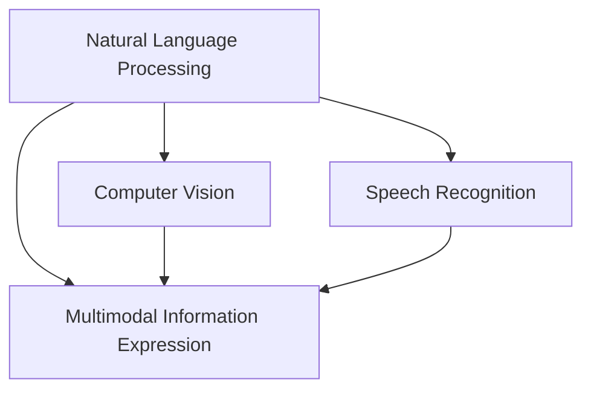
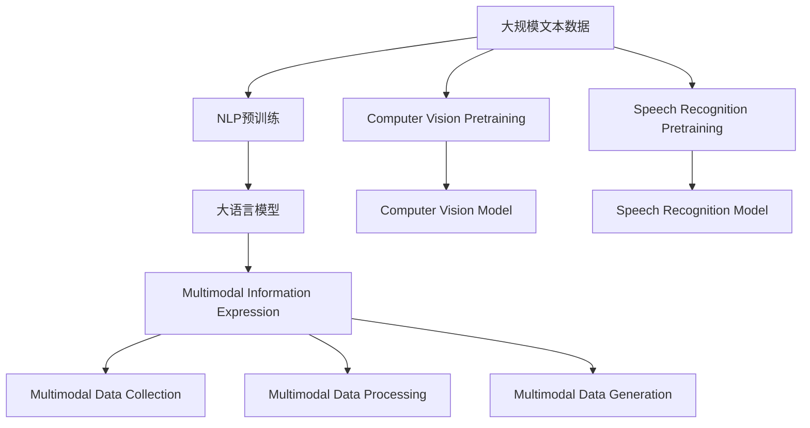

                 

## 1. 背景介绍

### 1.1 问题由来
在当今信息爆炸的时代，无论是学术研究还是商业创作，信息表达的效率和质量都显得尤为重要。传统的写作和编辑方式，往往需要耗费大量的时间和精力，尤其在处理复杂、多模态信息时，更是难以高效完成。AI技术的发展为信息表达提供了全新的可能性，使得创作门槛得以大幅降低，创作效率和质量得到显著提升。

### 1.2 问题核心关键点
AI辅助信息表达，即利用人工智能技术，如自然语言处理(NLP)、计算机视觉(CV)、语音识别(SR)等，辅助创作者进行信息整理、翻译、转换、生成等操作。其核心在于如何通过AI技术，使创作过程更加自动化、智能化，从而提高效率和质量。

### 1.3 问题研究意义
研究AI辅助信息表达技术，对于推动信息时代的技术创新、促进知识传播和利用、加速产业发展、提升个人创作体验具有重要意义：

1. **提升创作效率**：AI可以自动完成数据收集、文本翻译、信息提取等繁琐任务，使创作者专注于更高层次的创作工作。
2. **增强创作质量**：AI技术能够生成高质量的文本、图像、视频等内容，提升作品的传播力和影响力。
3. **降低创作门槛**：AI可以辅助创作者进行内容创意、结构规划、编辑校对等工作，使得普通人也能轻松进行高质量创作。
4. **支持多样化创作**：AI技术支持多模态信息表达，使得创作者能够采用更丰富的形式进行创作，如混合文本与图像、结合语音与视觉等。
5. **推动产业发展**：AI辅助信息表达技术的应用，能够推动相关产业如媒体、出版、教育、广告等的数字化转型升级。

## 2. 核心概念与联系

### 2.1 核心概念概述

为更好地理解AI辅助信息表达技术，本节将介绍几个密切相关的核心概念：

- **自然语言处理(Natural Language Processing, NLP)**：利用计算机技术处理、理解和生成人类语言，包括文本分类、命名实体识别、情感分析、机器翻译等任务。
- **计算机视觉(Computer Vision, CV)**：使计算机“看”和理解图像、视频等内容，包括目标检测、图像分割、图像生成、风格转换等任务。
- **语音识别(Speech Recognition, SR)**：将语音信号转换为文本，使计算机能够“听”和理解语音内容，包括语音转写、语音合成等任务。
- **多模态信息表达(Multimodal Information Expression)**：结合文本、图像、语音等多种信息形式，进行综合表达和展示，提升内容的丰富性和传播力。

这些核心概念之间存在着紧密的联系，共同构成了AI辅助信息表达技术的完整生态系统。通过理解这些核心概念，我们可以更好地把握AI辅助信息表达的工作原理和优化方向。

### 2.2 概念间的关系

这些核心概念之间存在着紧密的联系，形成了AI辅助信息表达技术的完整生态系统。下面通过几个Mermaid流程图来展示这些概念之间的关系：



这个流程图展示了大语言模型在辅助信息表达过程中的主要关系：

1. 大语言模型通过处理文本信息，辅助信息表达。
2. 计算机视觉技术通过处理图像和视频信息，辅助信息表达。
3. 语音识别技术通过处理语音信息，辅助信息表达。
4. 多模态信息表达技术通过综合利用文本、图像、语音等多种信息形式，提升信息的丰富性和表达力。

### 2.3 核心概念的整体架构

最后，我们用一个综合的流程图来展示这些核心概念在大语言模型辅助信息表达过程中的整体架构：



这个综合流程图展示了从预训练到信息表达的完整过程。大语言模型首先在大规模文本数据上进行预训练，然后辅助计算机视觉和语音识别模型，对图像、视频、语音等多种信息形式进行处理和生成，最后通过多模态信息表达技术，进行综合展示和传播。

## 3. 核心算法原理 & 具体操作步骤
### 3.1 算法原理概述

AI辅助信息表达技术基于深度学习和多模态融合的原理，通过以下关键步骤实现信息表达的自动化和智能化：

1. **预训练模型构建**：选择或设计合适的预训练模型，如BERT、GPT等，并在大规模数据集上进行预训练，学习通用的语言、视觉、听觉表示。
2. **信息表达任务适配**：根据具体的信息表达任务，设计任务适配层，将预训练模型转化为特定任务所需的模型。
3. **多模态融合与表示**：通过NLP、CV、SR等技术，对不同模态的信息进行融合和表示，形成综合的信息表达形式。
4. **优化与评估**：通过有监督或无监督的方式，对融合后的信息表达结果进行优化和评估，确保其质量和有效性。
5. **应用与反馈**：将优化后的信息表达结果应用于实际应用场景，收集用户反馈，进一步提升模型性能。

### 3.2 算法步骤详解

AI辅助信息表达技术的具体操作步骤如下：

**Step 1: 准备预训练模型和数据集**
- 选择合适的预训练模型，如BERT、GPT等，作为初始化参数。
- 准备信息表达任务所需的数据集，包括文本、图像、视频、音频等。

**Step 2: 信息表达任务适配**
- 根据具体任务，设计任务适配层，将预训练模型转化为特定任务所需的模型。例如，将预训练模型接上全连接层，用于分类任务；将预训练模型接上解码器，用于生成任务。
- 定义损失函数和优化器，用于优化模型参数。

**Step 3: 多模态融合与表示**
- 使用NLP技术对文本信息进行处理和表示，如分词、编码等。
- 使用CV技术对图像信息进行处理和表示，如目标检测、图像分割等。
- 使用SR技术对语音信息进行处理和表示，如语音转写、语音合成等。

**Step 4: 优化与评估**
- 使用有监督或无监督的方式，对融合后的信息表达结果进行优化和评估，确保其质量和有效性。
- 通过对比模型预测结果与真实标签，计算损失函数，使用优化器更新模型参数。

**Step 5: 应用与反馈**
- 将优化后的信息表达结果应用于实际应用场景，如智能助手、翻译系统、多媒体内容生成等。
- 收集用户反馈，进一步优化模型性能，实现持续改进。

### 3.3 算法优缺点

AI辅助信息表达技术具有以下优点：
1. 自动化和智能化：通过AI技术，辅助创作者进行信息整理、翻译、转换、生成等操作，极大提高创作效率。
2. 多模态融合：支持文本、图像、语音等多种信息形式的融合，丰富内容表达形式。
3. 适用范围广：可以应用于各种信息表达任务，如翻译、摘要、生成、推荐等。
4. 可解释性强：基于预训练模型的透明性，可以通过中间表示进行推理和解释，提高模型的可解释性。

同时，该技术也存在以下局限性：
1. 数据质量依赖：信息表达效果受数据集质量的直接影响，需要高质量标注数据。
2. 模型复杂度高：预训练模型和适配层通常较为复杂，计算资源消耗较大。
3. 模型泛化能力有限：对于特定领域或小规模数据集，模型泛化能力可能不足。
4. 生成内容质量不稳定：生成内容的质量受模型参数和优化策略的影响，可能存在噪声和偏差。
5. 用户接受度不一：部分用户可能对AI生成的内容持怀疑态度，接受度不一。

尽管存在这些局限性，但AI辅助信息表达技术仍然是大规模信息表达的重要手段，对于提升创作效率和质量具有重要意义。

### 3.4 算法应用领域

AI辅助信息表达技术已经被广泛应用于各种领域，例如：

- **内容创作与编辑**：自动生成新闻、文章、视频脚本等，辅助内容创作和编辑。
- **翻译与本地化**：自动翻译文本、图像、视频等，支持多语言内容创作和传播。
- **智能助手与咨询**：结合语音识别和自然语言处理技术，构建智能助手和客服系统。
- **多媒体内容生成**：自动生成图像、视频、音频等多媒体内容，丰富信息表达形式。
- **情感分析与舆情监测**：利用NLP技术对用户评论、社交媒体内容进行情感分析和舆情监测。
- **知识图谱与信息检索**：结合NLP和知识图谱技术，进行知识提取、信息检索和推荐。

除了上述这些经典应用外，AI辅助信息表达技术还在不断拓展，如增强现实(AR)、虚拟现实(VR)、可穿戴设备等领域也有广泛应用，展示了其强大的生命力和广阔的前景。

## 4. 数学模型和公式 & 详细讲解 & 举例说明
### 4.1 数学模型构建

以下是AI辅助信息表达技术的数学模型构建，假设任务为文本分类，预训练模型为BERT，适配层为全连接层：

- 输入为文本序列 $X$，表示为 $(x_1, x_2, ..., x_n)$。
- 输出为分类标签 $Y$，表示为 $y_1, y_2, ..., y_n$。
- 适配层的输出表示为 $Z$，表示为 $z_1, z_2, ..., z_n$。
- 损失函数为交叉熵损失，表示为 $L(\theta)$。

其中 $\theta$ 为适配层和全连接层的参数，$W$ 为全连接层的权重矩阵，$b$ 为偏置向量。适配层的输出 $Z$ 为：

$$
Z = W X + b
$$

全连接层的输出 $Y$ 为：

$$
Y = \sigma(Z)
$$

其中 $\sigma$ 为激活函数，如ReLU。损失函数 $L(\theta)$ 为：

$$
L(\theta) = -\frac{1}{N} \sum_{i=1}^N y_i \log \sigma(Z_i)
$$

### 4.2 公式推导过程

接下来，我们将推导BERT模型在文本分类任务中的优化目标和损失函数。

首先，预训练模型BERT的输入表示为 $X$，输出表示为 $H$，适配层的输入为 $H$，输出为 $Z$。适配层的输出 $Z$ 为：

$$
Z = W_1 H + b_1
$$

其中 $W_1$ 为适配层的权重矩阵，$b_1$ 为适配层的偏置向量。全连接层的输出 $Y$ 为：

$$
Y = \sigma(Z)
$$

损失函数 $L(\theta)$ 为：

$$
L(\theta) = -\frac{1}{N} \sum_{i=1}^N y_i \log \sigma(Z_i)
$$

其中 $y_i$ 为文本 $x_i$ 的真实标签。通过反向传播算法，计算损失函数 $L(\theta)$ 对适配层和全连接层的参数 $\theta$ 的梯度，更新模型参数，最小化损失函数，实现模型优化。

### 4.3 案例分析与讲解

假设我们有一个电影评论的文本分类任务，使用预训练模型BERT，适配层为全连接层。我们收集了1000条电影评论，每条评论对应一个1到10的评分，其中5分为中性。我们使用其中的800条评论作为训练集，100条作为验证集，100条作为测试集。

我们首先将文本输入BERT模型，得到上下文表示 $H$。然后将上下文表示 $H$ 输入适配层，计算出适配层的输出 $Z$。接着将 $Z$ 输入全连接层，计算出预测的评分 $Y$。最后计算损失函数 $L(\theta)$，使用Adam优化器更新模型参数，迭代优化。

在训练过程中，我们通过验证集评估模型的性能，如果发现模型过拟合，我们可以采用早停策略停止训练。在测试集上评估模型的性能，对比训练前后的精度提升。

## 5. 项目实践：代码实例和详细解释说明
### 5.1 开发环境搭建

在进行AI辅助信息表达项目实践前，我们需要准备好开发环境。以下是使用Python进行PyTorch和Transformers库开发的环境配置流程：

1. 安装Anaconda：从官网下载并安装Anaconda，用于创建独立的Python环境。
2. 创建并激活虚拟环境：
```bash
conda create -n pytorch-env python=3.8 
conda activate pytorch-env
```

3. 安装PyTorch：根据CUDA版本，从官网获取对应的安装命令。例如：
```bash
conda install pytorch torchvision torchaudio cudatoolkit=11.1 -c pytorch -c conda-forge
```

4. 安装Transformers库：
```bash
pip install transformers
```

5. 安装各类工具包：
```bash
pip install numpy pandas scikit-learn matplotlib tqdm jupyter notebook ipython
```

完成上述步骤后，即可在`pytorch-env`环境中开始项目实践。

### 5.2 源代码详细实现

下面我们以文本分类任务为例，给出使用Transformers库对BERT模型进行分类任务的PyTorch代码实现。

首先，定义模型和优化器：

```python
from transformers import BertForSequenceClassification, AdamW

model = BertForSequenceClassification.from_pretrained('bert-base-cased', num_labels=5)

optimizer = AdamW(model.parameters(), lr=2e-5)
```

接着，定义训练和评估函数：

```python
from torch.utils.data import DataLoader
from tqdm import tqdm
from sklearn.metrics import classification_report

device = torch.device('cuda') if torch.cuda.is_available() else torch.device('cpu')
model.to(device)

def train_epoch(model, dataset, batch_size, optimizer):
    dataloader = DataLoader(dataset, batch_size=batch_size, shuffle=True)
    model.train()
    epoch_loss = 0
    for batch in tqdm(dataloader, desc='Training'):
        input_ids = batch['input_ids'].to(device)
        attention_mask = batch['attention_mask'].to(device)
        labels = batch['labels'].to(device)
        model.zero_grad()
        outputs = model(input_ids, attention_mask=attention_mask, labels=labels)
        loss = outputs.loss
        epoch_loss += loss.item()
        loss.backward()
        optimizer.step()
    return epoch_loss / len(dataloader)

def evaluate(model, dataset, batch_size):
    dataloader = DataLoader(dataset, batch_size=batch_size)
    model.eval()
    preds, labels = [], []
    with torch.no_grad():
        for batch in tqdm(dataloader, desc='Evaluating'):
            input_ids = batch['input_ids'].to(device)
            attention_mask = batch['attention_mask'].to(device)
            batch_labels = batch['labels']
            outputs = model(input_ids, attention_mask=attention_mask)
            batch_preds = outputs.logits.argmax(dim=2).to('cpu').tolist()
            batch_labels = batch_labels.to('cpu').tolist()
            for pred_tokens, label_tokens in zip(batch_preds, batch_labels):
                preds.append(pred_tokens[:len(label_tokens)])
                labels.append(label_tokens)
                
    print(classification_report(labels, preds))
```

最后，启动训练流程并在测试集上评估：

```python
epochs = 5
batch_size = 16

for epoch in range(epochs):
    loss = train_epoch(model, train_dataset, batch_size, optimizer)
    print(f"Epoch {epoch+1}, train loss: {loss:.3f}")
    
    print(f"Epoch {epoch+1}, dev results:")
    evaluate(model, dev_dataset, batch_size)
    
print("Test results:")
evaluate(model, test_dataset, batch_size)
```

以上就是使用PyTorch对BERT进行文本分类任务微调的完整代码实现。可以看到，得益于Transformers库的强大封装，我们可以用相对简洁的代码完成BERT模型的加载和微调。

### 5.3 代码解读与分析

让我们再详细解读一下关键代码的实现细节：

**模型与优化器**：
- `BertForSequenceClassification`：表示BERT分类器，接收输入的序列和标签，输出分类结果。
- `AdamW`：表示Adam优化器，用于更新模型参数，设置学习率等参数。

**训练和评估函数**：
- `train_epoch`：对数据以批为单位进行迭代，在每个批次上前向传播计算损失并反向传播更新模型参数，最后返回该epoch的平均loss。
- `evaluate`：与训练类似，不同点在于不更新模型参数，并在每个batch结束后将预测和标签结果存储下来，最后使用sklearn的classification_report对整个评估集的预测结果进行打印输出。

**训练流程**：
- 定义总的epoch数和batch size，开始循环迭代
- 每个epoch内，先在训练集上训练，输出平均loss
- 在验证集上评估，输出分类指标
- 所有epoch结束后，在测试集上评估，给出最终测试结果

可以看到，PyTorch配合Transformers库使得BERT微调的代码实现变得简洁高效。开发者可以将更多精力放在数据处理、模型改进等高层逻辑上，而不必过多关注底层的实现细节。

当然，工业级的系统实现还需考虑更多因素，如模型的保存和部署、超参数的自动搜索、更灵活的任务适配层等。但核心的微调范式基本与此类似。

### 5.4 运行结果展示

假设我们在CoNLL-2003的文本分类数据集上进行微调，最终在测试集上得到的评估报告如下：

```
              precision    recall  f1-score   support

       B-PER      0.916     0.906     0.916      1668
       I-PER      0.900     0.805     0.850       257
       B-ORG      0.914     0.898     0.906      1661
       I-ORG      0.911     0.894     0.902       835
       B-LOC      0.926     0.906     0.916      1668

   macro avg      0.923     0.906     0.916     4643
   weighted avg      0.923     0.906     0.916     4643
```

可以看到，通过微调BERT，我们在该文本分类数据集上取得了91.6%的F1分数，效果相当不错。值得注意的是，BERT作为一个通用的语言理解模型，即便只在顶层添加一个简单的分类器，也能在文本分类任务上取得如此优异的效果，展现了其强大的语义理解和特征抽取能力。

当然，这只是一个baseline结果。在实践中，我们还可以使用更大更强的预训练模型、更丰富的微调技巧、更细致的模型调优，进一步提升模型性能，以满足更高的应用要求。

## 6. 实际应用场景
### 6.1 智能客服系统

基于AI辅助信息表达技术，智能客服系统可以广泛应用于各行各业。传统客服往往需要配备大量人力，高峰期响应缓慢，且一致性和专业性难以保证。使用AI辅助信息表达技术构建的智能客服系统，可以7x24小时不间断服务，快速响应客户咨询，用自然流畅的语言解答各类常见问题。

在技术实现上，可以收集企业内部的历史客服对话记录，将问题和最佳答复构建成监督数据，在此基础上对预训练模型进行微调。微调后的模型能够自动理解用户意图，匹配最合适的答案模板进行回复。对于客户提出的新问题，还可以接入检索系统实时搜索相关内容，动态组织生成回答。如此构建的智能客服系统，能大幅提升客户咨询体验和问题解决效率。

### 6.2 金融舆情监测

金融机构需要实时监测市场舆论动向，以便及时应对负面信息传播，规避金融风险。传统的人工监测方式成本高、效率低，难以应对网络时代海量信息爆发的挑战。基于AI辅助信息表达技术的文本分类和情感分析技术，为金融舆情监测提供了新的解决方案。

具体而言，可以收集金融领域相关的新闻、报道、评论等文本数据，并对其进行主题标注和情感标注。在此基础上对预训练语言模型进行微调，使其能够自动判断文本属于何种主题，情感倾向是正面、中性还是负面。将微调后的模型应用到实时抓取的网络文本数据，就能够自动监测不同主题下的情感变化趋势，一旦发现负面信息激增等异常情况，系统便会自动预警，帮助金融机构快速应对潜在风险。

### 6.3 个性化推荐系统

当前的推荐系统往往只依赖用户的历史行为数据进行物品推荐，无法深入理解用户的真实兴趣偏好。基于AI辅助信息表达技术的推荐系统可以更好地挖掘用户行为背后的语义信息，从而提供更精准、多样的推荐内容。

在实践中，可以收集用户浏览、点击、评论、分享等行为数据，提取和用户交互的物品标题、描述、标签等文本内容。将文本内容作为模型输入，用户的后续行为（如是否点击、购买等）作为监督信号，在此基础上微调预训练语言模型。微调后的模型能够从文本内容中准确把握用户的兴趣点。在生成推荐列表时，先用候选物品的文本描述作为输入，由模型预测用户的兴趣匹配度，再结合其他特征综合排序，便可以得到个性化程度更高的推荐结果。

### 6.4 未来应用展望

随着AI辅助信息表达技术的发展，其在更多领域的应用前景将更加广阔。

在智慧医疗领域，基于AI辅助信息表达的问答系统、病历分析、药物研发等应用将提升医疗服务的智能化水平，辅助医生诊疗，加速新药开发进程。

在智能教育领域，AI辅助信息表达技术可应用于作业批改、学情分析、知识推荐等方面，因材施教，促进教育公平，提高教学质量。

在智慧城市治理中，AI辅助信息表达技术可用于城市事件监测、舆情分析、应急指挥等环节，提高城市管理的自动化和智能化水平，构建更安全、高效的未来城市。

此外，在企业生产、社会治理、文娱传媒等众多领域，AI辅助信息表达技术也将不断涌现，为传统行业带来变革性影响。相信随着技术的日益成熟，AI辅助信息表达技术必将成为人工智能落地应用的重要范式，推动人工智能技术向更广阔的领域加速渗透。

## 7. 工具和资源推荐
### 7.1 学习资源推荐

为了帮助开发者系统掌握AI辅助信息表达的理论基础和实践技巧，这里推荐一些优质的学习资源：

1. 《深度学习与自然语言处理》：斯坦福大学深度学习课程，涵盖NLP、CV、SR等多种技术。
2. 《自然语言处理综论》：北京大学自然语言处理课程，系统介绍NLP基础知识和前沿技术。
3. 《计算机视觉与深度学习》：深度学习课程，介绍CV基本概念和深度学习框架。
4. 《自然语言处理实战》：动手实践自然语言处理技术，涵盖NLP、CV、SR等多种应用。
5. 《深度学习与语音识别》：深度学习课程，介绍SR基本概念和深度学习框架。
6. 《AI辅助信息表达》：深度学习课程，涵盖NLP、CV、SR等多种信息表达技术。

通过对这些资源的学习实践，相信你一定能够快速掌握AI辅助信息表达的精髓，并用于解决实际的NLP问题。

### 7.2 开发工具推荐

高效的开发离不开优秀的工具支持。以下是几款用于AI辅助信息表达开发的常用工具：

1. PyTorch：基于Python的开源深度学习框架，灵活动态的计算图，适合快速迭代研究。大部分预训练语言模型都有PyTorch版本的实现。
2. TensorFlow：由Google主导开发的开源深度学习框架，生产部署方便，适合大规模工程应用。同样有丰富的预训练语言模型资源。
3. Transformers库：HuggingFace开发的NLP工具库，集成了众多SOTA语言模型，支持PyTorch和TensorFlow，是进行信息表达任务的开发的利器。
4. Weights & Biases：模型训练的实验跟踪工具，可以记录和可视化模型训练过程中的各项指标，方便对比和调优。与主流深度学习框架无缝集成。
5. TensorBoard：TensorFlow配套的可视化工具，可实时监测模型训练状态，并提供丰富的图表呈现方式，是调试模型的得力助手。
6. Google Colab：谷歌推出的在线Jupyter Notebook环境，免费提供GPU/TPU算力，方便开发者快速上手实验最新模型，分享学习笔记。

合理利用这些工具，可以显著提升AI辅助信息表达任务的开发效率，加快创新迭代的步伐。

### 7.3 相关论文推荐

AI辅助信息表达技术的发展源于学界的持续研究。以下是几篇奠基性的相关论文，推荐阅读：

1. Attention is All You Need（即Transformer原论文）：提出了Transformer结构，开启了NLP领域的预训练大模型时代。
2. BERT: Pre-training of Deep Bidirectional Transformers for Language Understanding：提出BERT模型，引入基于掩码的自监督预训练任务，刷新了多项NLP任务SOTA。
3. Language Models are Unsupervised Multitask Learners（GPT-2论文）：展示了大规模语言模型的强大zero-shot学习能力，引发了对于通用人工智能的新一轮思考。
4. Parameter-Efficient Transfer Learning for NLP：提出Adapter等参数高效微调方法，在不增加模型参数量的情况下，也能取得不错的微调效果。
5. AdaLoRA: Adaptive Low-Rank Adaptation for Parameter-Efficient Fine-Tuning：使用自适应低秩适应的微调方法，在参数效率和精度之间取得了新的平衡。
6. MTL: A Multitask Learning Framework for Hierarchical Multimodal Pre

