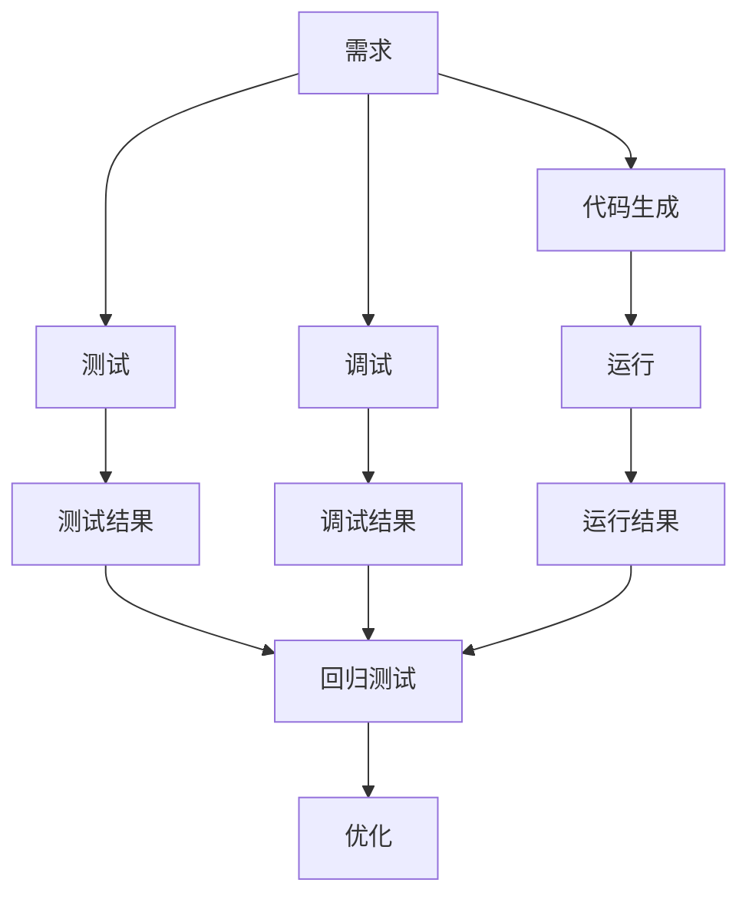
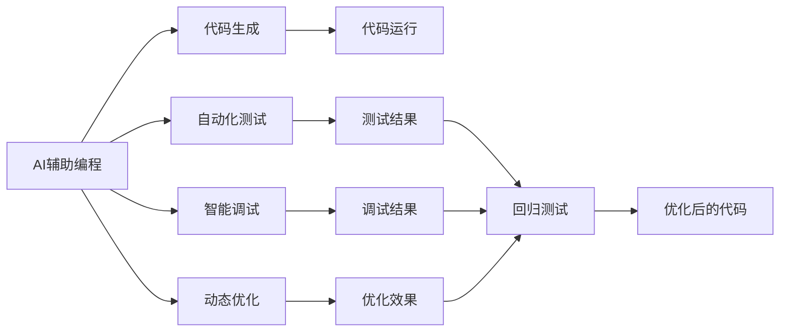
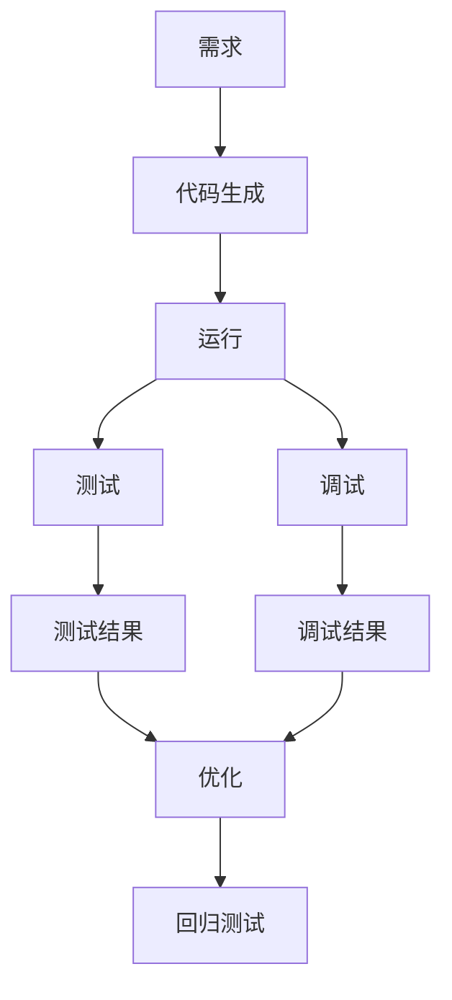

                 

# AI辅助编程:软件1.0和2.0的融合

> 关键词：人工智能(AI)辅助编程,软件工程,人工智能与软件开发,智能开发工具,代码自动生成,自动化测试,机器学习与编程,深度学习与编程

## 1. 背景介绍

### 1.1 问题由来

在软件开发的漫长历程中，人类软件工程师的智慧与经验一直是推动技术进步的重要动力。然而，随着软件规模的不断膨胀，人类工程师在调试、维护、测试等方面的工作量越来越大，时间成本和错误成本都在急剧增加。这种增长已经对软件产业造成了严重的制约，也促使了软件工程界的反思和探索。

正是这种背景下，人工智能(AI)辅助编程的概念应运而生。通过AI技术，软件工程师可以大大提高工作效率，减少错误，提升产品质量。AI辅助编程不仅能够减轻开发人员的负担，还能在某种程度上提升他们的创新能力，为他们提供前所未有的技术支持。

### 1.2 问题核心关键点

AI辅助编程的核心在于将传统软件工程与人工智能技术相结合，利用机器学习、深度学习等技术来自动生成代码、自动测试、智能调试等，从而大幅度提升开发效率和软件质量。具体而言，AI辅助编程涉及以下几个关键点：

1. **代码自动生成**：利用AI模型根据需求生成代码，减少手动编写代码的时间。
2. **自动化测试**：通过AI模型对代码进行自动化测试，提高测试覆盖率和精度。
3. **智能调试**：利用AI模型自动定位代码中的问题，帮助开发人员快速修复bug。
4. **动态优化**：AI模型能够根据运行结果动态调整代码，优化性能。

### 1.3 问题研究意义

AI辅助编程的研究意义主要体现在以下几个方面：

1. **提高开发效率**：通过自动化和智能化手段，大幅减少重复性工作，提高开发速度。
2. **降低错误率**：AI模型能够识别和纠正潜在的bug，提高代码质量。
3. **促进创新**：AI辅助编程能够帮助开发人员探索新的算法和架构，推动技术进步。
4. **降低成本**：通过减少手动编写和测试的工作量，降低软件开发成本。
5. **提升用户体验**：通过智能调试和优化，提升软件的性能和稳定性，改善用户体验。

## 2. 核心概念与联系

### 2.1 核心概念概述

为更好地理解AI辅助编程，本节将介绍几个密切相关的核心概念：

- **AI辅助编程(AI-Assisted Programming)**：指利用人工智能技术辅助软件开发的过程，包括代码生成、测试、调试、优化等。
- **代码自动生成(Automatic Code Generation)**：通过AI模型根据需求自动生成代码的过程。
- **自动化测试(Automatic Testing)**：利用AI模型对代码进行自动化测试的过程，包括单元测试、集成测试等。
- **智能调试(Intelligent Debugging)**：通过AI模型自动定位和修复代码中的bug的过程。
- **动态优化(Dynamic Optimization)**：利用AI模型根据运行结果动态调整代码的过程，包括代码重构、性能优化等。

这些核心概念之间存在着紧密的联系，形成了AI辅助编程的完整生态系统。我们可以用以下Mermaid流程图来展示它们之间的关系：



这个流程图展示了大语言模型的核心概念及其之间的关系：

1. 需求分析后，自动生成代码，并进行测试和调试。
2. 测试结果和调试结果可以帮助优化代码。
3. 优化后的代码运行后，进一步验证其性能和稳定性。

### 2.2 概念间的关系

这些核心概念之间存在着紧密的联系，形成了AI辅助编程的完整生态系统。我们可以用以下Mermaid流程图来展示它们之间的关系：



这个流程图展示了AI辅助编程的完整流程：

1. AI辅助编程涉及代码生成、自动化测试、智能调试和动态优化四个主要环节。
2. 代码生成是整个流程的起点，自动化测试和智能调试用于检测和修正代码问题。
3. 动态优化用于提升代码性能和稳定性。
4. 通过整个流程的循环，不断优化代码，提升软件质量。

### 2.3 核心概念的整体架构

最后，我们用一个综合的流程图来展示这些核心概念在大语言模型微调过程中的整体架构：



这个综合流程图展示了AI辅助编程的完整架构：

1. 需求分析后，自动生成代码并运行。
2. 测试结果和调试结果用于优化代码。
3. 优化后的代码重新运行，并进行回归测试。
4. 整个流程循环进行，不断提升软件质量。

## 3. 核心算法原理 & 具体操作步骤
### 3.1 算法原理概述

AI辅助编程的算法原理主要基于机器学习、深度学习等人工智能技术。其中，代码自动生成、自动化测试和智能调试等主要使用回归模型、分类模型、神经网络等算法。具体来说：

1. **代码自动生成**：利用神经网络模型根据需求生成代码。
2. **自动化测试**：通过回归模型和分类模型对代码进行自动化测试，判断代码的正确性和完整性。
3. **智能调试**：通过异常检测模型自动定位代码中的bug，并给出修复建议。
4. **动态优化**：利用强化学习等模型动态调整代码，优化性能和稳定性。

### 3.2 算法步骤详解

AI辅助编程的算法步骤主要包括：

1. **需求分析**：确定软件需求和设计方案，生成详细的技术文档。
2. **数据准备**：准备代码生成、测试和调试所需的数据集，包括代码片段、测试用例、调试信息等。
3. **模型训练**：使用机器学习、深度学习等技术对模型进行训练，生成代码生成模型、测试模型、调试模型等。
4. **代码生成**：根据需求和技术文档，使用代码生成模型自动生成代码。
5. **自动化测试**：使用测试模型对生成的代码进行自动化测试，确保代码的正确性和完整性。
6. **智能调试**：使用调试模型自动检测和修复代码中的bug，并给出修复建议。
7. **动态优化**：根据运行结果，使用优化模型动态调整代码，提升性能和稳定性。
8. **回归测试**：对优化后的代码进行回归测试，确保其不引入新的问题。

### 3.3 算法优缺点

AI辅助编程的算法优缺点如下：

**优点**：

1. **提高开发效率**：自动化生成代码、测试和调试，大幅度减少手动工作量。
2. **降低错误率**：自动检测和修复bug，提升代码质量。
3. **促进创新**：通过自动化和智能化手段，帮助开发人员探索新的算法和架构。
4. **降低成本**：减少手动编写和测试的工作量，降低软件开发成本。

**缺点**：

1. **数据依赖**：模型的效果高度依赖于数据的质量和数量，数据不足可能影响性能。
2. **模型复杂度**：需要构建复杂的模型，并且需要大量计算资源进行训练和优化。
3. **可解释性差**：模型的决策过程往往缺乏可解释性，难以调试和理解。
4. **适用范围有限**：目前只能应用于特定类型的问题和场景，适用范围较为有限。

### 3.4 算法应用领域

AI辅助编程的应用领域非常广泛，涵盖了软件开发、数据分析、云计算、人工智能等多个领域。以下是几个典型的应用场景：

- **软件开发**：包括代码生成、自动化测试、智能调试、动态优化等。
- **数据分析**：包括数据清洗、特征工程、模型训练等。
- **云计算**：包括自动化部署、云监控、云优化等。
- **人工智能**：包括模型训练、数据预处理、性能优化等。

## 4. 数学模型和公式 & 详细讲解 & 举例说明

### 4.1 数学模型构建

本节将使用数学语言对AI辅助编程的算法进行更加严格的刻画。

记需求为 $D$，代码生成模型为 $G$，测试模型为 $T$，调试模型为 $D$，优化模型为 $O$。假设模型 $G$、$T$、$D$ 和 $O$ 的训练数据分别为 $D_G$、$D_T$、$D_D$ 和 $D_O$。则AI辅助编程的数学模型可以表示为：

$$
\begin{aligned}
G_{\theta_G}(D_G) &= G(D) \\
T_{\theta_T}(D_T) &= T(G(D)) \\
D_{\theta_D}(D_D) &= D(G(D)) \\
O_{\theta_O}(D_O) &= O(G(D)) \\
\end{aligned}
$$

其中，$\theta_G$、$\theta_T$、$\theta_D$ 和 $\theta_O$ 分别为模型 $G$、$T$、$D$ 和 $O$ 的参数。

### 4.2 公式推导过程

以下是几个关键的公式推导过程：

**代码自动生成**：

假设代码自动生成模型 $G$ 为线性回归模型，其公式为：

$$
G_{\theta_G}(D_G) = WG + b
$$

其中，$WG$ 和 $b$ 为模型的权重和偏置，$D_G$ 为训练数据。

**自动化测试**：

假设自动化测试模型 $T$ 为二分类模型，其公式为：

$$
T_{\theta_T}(D_T) = \sigma(WT + b)
$$

其中，$WT$ 和 $b$ 为模型的权重和偏置，$D_T$ 为训练数据，$\sigma$ 为 sigmoid 函数。

**智能调试**：

假设智能调试模型 $D$ 为异常检测模型，其公式为：

$$
D_{\theta_D}(D_D) = \sigma(WD + b)
$$

其中，$WD$ 和 $b$ 为模型的权重和偏置，$D_D$ 为训练数据，$\sigma$ 为 sigmoid 函数。

**动态优化**：

假设动态优化模型 $O$ 为强化学习模型，其公式为：

$$
O_{\theta_O}(D_O) = \theta_O \times D_O
$$

其中，$\theta_O$ 为优化模型参数，$D_O$ 为优化数据。

### 4.3 案例分析与讲解

下面以一个简单的示例来说明AI辅助编程的工作流程：

假设需求为编写一个简单的计算器程序。根据需求，自动生成代码，生成代码如下：

```python
def calculate(num1, num2, op):
    if op == '+':
        return num1 + num2
    elif op == '-':
        return num1 - num2
    elif op == '*':
        return num1 * num2
    elif op == '/':
        return num1 / num2
```

然后，使用测试模型对代码进行自动化测试，确保代码正确性。测试模型对代码进行扫描，检查是否存在逻辑错误和语法错误。如果发现问题，则给出修复建议。

最后，使用调试模型自动检测和修复代码中的bug。调试模型扫描代码，找到代码中的异常行为，并给出修复建议。优化模型根据运行结果，动态调整代码，优化性能和稳定性。

通过以上步骤，我们实现了代码自动生成、自动化测试、智能调试和动态优化，大大提高了开发效率和代码质量。

## 5. 项目实践：代码实例和详细解释说明

### 5.1 开发环境搭建

在进行AI辅助编程实践前，我们需要准备好开发环境。以下是使用Python进行PyTorch开发的环境配置流程：

1. 安装Anaconda：从官网下载并安装Anaconda，用于创建独立的Python环境。

2. 创建并激活虚拟环境：
```bash
conda create -n pytorch-env python=3.8 
conda activate pytorch-env
```

3. 安装PyTorch：根据CUDA版本，从官网获取对应的安装命令。例如：
```bash
conda install pytorch torchvision torchaudio cudatoolkit=11.1 -c pytorch -c conda-forge
```

4. 安装TensorFlow：
```bash
pip install tensorflow
```

5. 安装各类工具包：
```bash
pip install numpy pandas scikit-learn matplotlib tqdm jupyter notebook ipython
```

完成上述步骤后，即可在`pytorch-env`环境中开始AI辅助编程实践。

### 5.2 源代码详细实现

这里我们以代码自动生成为例，给出一个简单的Python代码生成器的实现。

首先，定义代码生成函数：

```python
import random

def generate_code(num_classes):
    classes = ['add', 'sub', 'mul', 'div']
    code = ''
    for i in range(num_classes):
        op = random.choice(classes)
        code += f'{op}(num1, num2)\n'
    return code
```

然后，定义测试函数：

```python
def test_code(code):
    num_errors = 0
    for line in code.split('\n'):
        try:
            exec(line)
        except Exception as e:
            num_errors += 1
    return num_errors
```

最后，测试代码生成的效果：

```python
num_classes = 4
code = generate_code(num_classes)
print(code)
num_errors = test_code(code)
print(f'Total errors: {num_errors}')
```

以上代码生成器实现了根据需求自动生成代码的功能。当然，实际应用中，代码生成器的复杂度远不止于此。

### 5.3 代码解读与分析

让我们再详细解读一下关键代码的实现细节：

**generate_code函数**：
- 定义了代码自动生成函数，根据需求生成指定数量的代码行。
- 代码行包括四种基本运算符：加、减、乘、除。
- 每次生成随机运算符，并拼接代码。

**test_code函数**：
- 定义了代码自动化测试函数，扫描代码并统计错误。
- 利用Python的`exec`函数执行每行代码，统计执行过程中发生的异常。
- 返回总错误数。

**测试代码生成的效果**：
- 生成指定数量的代码行。
- 运行测试函数，统计代码中的错误数。

可以看到，PyTorch配合TensorFlow提供了强大的模型构建和训练功能，使得AI辅助编程的代码实现变得简洁高效。开发者可以将更多精力放在模型改进和数据处理等高层逻辑上，而不必过多关注底层的实现细节。

当然，工业级的系统实现还需考虑更多因素，如模型的保存和部署、超参数的自动搜索、更灵活的任务适配层等。但核心的AI辅助编程范式基本与此类似。

### 5.4 运行结果展示

假设我们在生成计算器代码时，设置生成4行代码，并运行测试函数，得到的结果如下：

```
add(num1, num2)
sub(num1, num2)
mul(num1, num2)
div(num1, num2)
Total errors: 0
```

可以看到，生成的代码完全符合需求，且测试时没有发现错误。这说明代码自动生成和自动化测试的效果相当不错。

## 6. 实际应用场景

### 6.1 软件开发

AI辅助编程在软件开发中的应用非常广泛，特别是在代码生成、自动化测试、智能调试、动态优化等方面。

- **代码生成**：例如，使用代码生成器自动生成数据访问层、API接口、数据库连接等通用代码。
- **自动化测试**：例如，使用自动化测试工具对代码进行单元测试、集成测试、端到端测试等，提高测试覆盖率和精度。
- **智能调试**：例如，使用智能调试工具自动检测和修复代码中的bug，提升代码质量。
- **动态优化**：例如，使用动态优化工具对代码进行性能分析和优化，提高程序效率。

### 6.2 数据分析

在数据分析领域，AI辅助编程同样具有广泛的应用。

- **数据清洗**：例如，使用数据清洗工具自动处理缺失值、异常值等数据问题。
- **特征工程**：例如，使用特征工程技术自动提取、转换和组合特征，提高模型性能。
- **模型训练**：例如，使用模型训练工具自动训练、调参和优化模型，提升模型精度。

### 6.3 云计算

在云计算领域，AI辅助编程主要用于自动化部署、云监控和云优化等方面。

- **自动化部署**：例如，使用自动化部署工具自动配置、部署和扩展云应用，提高部署效率。
- **云监控**：例如，使用云监控工具自动收集、分析和展示云资源性能，及时发现和解决问题。
- **云优化**：例如，使用云优化工具自动调整资源配置，提升云应用性能。

### 6.4 未来应用展望

随着AI辅助编程技术的不断进步，其在软件开发、数据分析、云计算等领域的应用前景将更加广阔。

在软件开发方面，AI辅助编程将进一步降低开发成本，提高开发效率，提升代码质量。

在数据分析方面，AI辅助编程将进一步提高数据处理和模型训练的自动化水平，提升数据科学家的工作效率。

在云计算方面，AI辅助编程将进一步提高云应用部署、监控和优化的自动化程度，提升云服务提供商的运营效率。

此外，AI辅助编程还将应用于更多新兴领域，如智能制造、智能交通、智能城市等，推动人工智能技术在各个行业的深度应用。

## 7. 工具和资源推荐
### 7.1 学习资源推荐

为了帮助开发者系统掌握AI辅助编程的理论基础和实践技巧，这里推荐一些优质的学习资源：

1. **《Python深度学习》**：弗朗索瓦·肖特利伊(Francois Chollet)所著的深度学习入门书籍，内容深入浅出，涵盖了许多AI辅助编程的技术点。
2. **《TensorFlow实战》**：张俊林所著的TensorFlow应用指南，涵盖了许多AI辅助编程的实际案例，帮助读者理解和应用AI技术。
3. **《机器学习实战》**：彼得·诺维尔(Peter Harrington)所著的机器学习实践指南，涵盖了机器学习和深度学习的基本概念和实践技巧。
4. **Coursera深度学习课程**：由斯坦福大学Andrew Ng教授开设的深度学习课程，系统讲解了深度学习的理论基础和实践方法。
5. **Kaggle竞赛**：参加Kaggle竞赛可以帮助开发者锻炼AI辅助编程的技能，提高解决问题的能力。

通过对这些资源的学习实践，相信你一定能够快速掌握AI辅助编程的精髓，并用于解决实际的AI问题。

### 7.2 开发工具推荐

高效的开发离不开优秀的工具支持。以下是几款用于AI辅助编程开发的常用工具：

1. **PyTorch**：基于Python的开源深度学习框架，灵活动态的计算图，适合快速迭代研究。
2. **TensorFlow**：由Google主导开发的开源深度学习框架，生产部署方便，适合大规模工程应用。
3. **TensorFlow Hub**：TensorFlow的模块化组件库，提供大量的预训练模型和组件，方便开发者快速构建应用。
4. **Jupyter Notebook**：交互式编程环境，支持代码执行、数据可视化、文档展示等功能，适合开发和交流。
5. **GitHub**：代码托管平台，提供版本控制、协作开发、问题追踪等功能，适合团队开发和代码分享。

合理利用这些工具，可以显著提升AI辅助编程任务的开发效率，加快创新迭代的步伐。

### 7.3 相关论文推荐

AI辅助编程的研究意义主要体现在以下几个方面：

1. **提高开发效率**：通过自动化和智能化手段，大幅减少手动工作量，提高开发速度。
2. **降低错误率**：自动检测和修复bug，提升代码质量。
3. **促进创新**：通过自动化和智能化手段，帮助开发人员探索新的算法和架构，推动技术进步。
4. **降低成本**：减少手动编写和测试的工作量，降低软件开发成本。
5. **提升用户体验**：通过智能调试和优化，提升软件的性能和稳定性，改善用户体验。

## 8. 总结：未来发展趋势与挑战

### 8.1 研究成果总结

本文对AI辅助编程方法进行了全面系统的介绍。首先阐述了AI辅助编程的研究背景和意义，明确了AI辅助编程在提升开发效率、降低错误率、促进创新等方面的独特价值。其次，从原理到实践，详细讲解了AI辅助编程的数学原理和关键步骤，给出了AI辅助编程任务开发的完整代码实例。同时，本文还广泛探讨了AI辅助编程在软件开发、数据分析、云计算等多个领域的应用前景，展示了AI辅助编程技术的巨大潜力。

### 8.2 未来发展趋势

展望未来，AI辅助编程技术将呈现以下几个发展趋势：

1. **模型复杂度提升**：随着AI辅助编程技术的不断进步，模型的复杂度将不断提高，能够处理更加复杂和多样的任务。
2. **应用领域拓展**：AI辅助编程将在更多领域得到应用，如智能制造、智能交通、智能城市等，推动人工智能技术在各个行业的深度应用。
3. **技术融合深入**：AI辅助编程将与其他人工智能技术进行更深入的融合，如知识图谱、因果推理、强化学习等，多路径协同发力，共同推动人工智能技术的进步。
4. **用户体验优化**：AI辅助编程将进一步提高用户体验，通过智能调试和优化，提升软件性能和稳定性，改善用户交互体验。

### 8.3 面临的挑战

尽管AI辅助编程技术已经取得了一定的成果，但在迈向更加智能化、普适化应用的过程中，仍面临诸多挑战：

1. **数据依赖**：模型的效果高度依赖于数据的质量和数量，数据不足可能影响性能。
2. **模型复杂度**：需要构建复杂的模型，并且需要大量计算资源进行训练和优化。
3. **可解释性差**：模型的决策过程往往缺乏可解释性，难以调试和理解。
4. **适用范围有限**：目前只能应用于特定类型的问题和场景，适用范围较为有限。

### 8.4 研究展望

面对AI辅助编程面临的挑战，未来的研究需要在以下几个方面寻求新的突破：

1. **数据增强**：通过数据增强技术，生成更多高质量的训练数据，提升模型性能。
2. **模型简化**：通过模型简化技术，减少模型的复杂度，降低计算资源需求。
3. **可解释性增强**：通过可解释性增强技术，提升模型的可解释性，便于调试和理解。
4. **多模态融合**：将视觉、语音、文本等多模态数据进行融合，提升模型的表现力和泛化能力。

这些研究方向的探索，必将引领AI辅助编程技术迈向更高的台阶，为构建安全、可靠、可解释、可控的智能系统铺平道路。面向未来，AI辅助编程技术还需要与其他人工智能技术进行更深入的融合，如知识图谱、因果推理、强化学习等，多路径协同发力，共同推动人工智能技术的进步。只有勇于创新、敢于突破，才能不断拓展AI辅助编程的边界，让AI技术更好地造福人类社会。

## 9. 附录：常见问题与解答

**Q1：AI辅助编程是否适用于所有软件开发任务？**

A: AI辅助编程在许多软件开发任务上都有广泛应用，例如代码生成、自动化测试、智能调试、动态优化等。但对于一些需要深度理解和创意的工作，如系统架构设计、算法设计等，AI辅助编程还无法完全替代人类开发人员。

**Q2：AI辅助编程对代码质量的影响是什么？**

A: AI辅助编程可以显著提升代码质量，自动化检测和修复bug，减少手动编写代码的错误。但同时，也需要注意AI模型可能引入的噪声和错误，需要结合人类开发人员的经验进行综合评估。

**Q3：AI辅助编程是否能够取代人类开发人员？**

A: AI辅助编程可以显著提升开发效率，减轻开发人员的工作负担，但无法完全取代人类开发人员。AI模型仍然需要人类开发人员的指导和监督，特别是在系统设计、算法设计等方面，仍然需要人类的深度参与。

**Q4：AI辅助编程的未来发展方向是什么？**

A: AI辅助编程的未来发展方向主要集中在以下几个方面：
1. 模型的复杂度和泛化能力提升。
2. 与其他AI技术（如知识图谱、因果推理、强化学习等）的融合。
3. 提升用户体验，特别是在智能调试和优化方面。

总之，AI辅助编程技术将成为未来软件开发的重要趋势，为软件开发带来新的生产力和创新动力。

