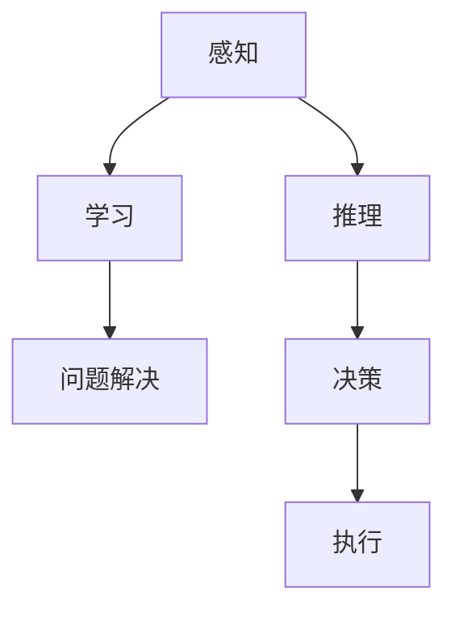
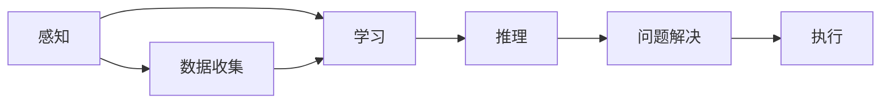
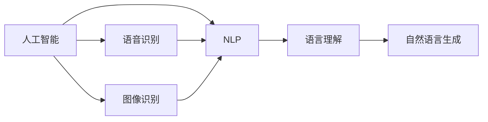

                 

## 1. 背景介绍

### 1.1 问题由来

1956年达特茅斯会议（Dartmouth Conference）被认为是人工智能（AI）的诞生标志。这次会议汇集了当时美国计算机科学领域的顶尖学者，讨论了人工智能的目标、方法和应用。会议的正式名称是《达特茅斯夏季研究计划（Dartmouth Summer Research Project on Artificial Intelligence）》，主要目的是探讨如何让机器模拟人类的智能行为。

### 1.2 问题核心关键点

达特茅斯会议的核心讨论主题集中在如何定义人工智能、实现人工智能的目标，以及如何实现这些目标的方法和工具。会议强调了智能机器的五个基本特征：感知、推理、学习、自我修正、问题解决。其中，“感知”和“推理”被认为是实现人工智能的基石。

## 2. 核心概念与联系

### 2.1 核心概念概述

为更好地理解达特茅斯会议的研究主题，本节将介绍几个密切相关的核心概念：

- **人工智能（AI）**：指通过机器模拟人类智能行为的学科。AI的目标是构建能够理解、学习、推理、决策的智能系统。
- **感知（Perception）**：指机器感知外界环境的能力，包括视觉、听觉、触觉等。感知是实现AI的基础。
- **推理（Reasoning）**：指机器对知识进行推理和判断的能力，包括演绎推理、归纳推理等。推理是实现AI的关键。
- **学习（Learning）**：指机器从经验中提取知识的能力，包括监督学习、无监督学习、强化学习等。学习是实现AI的重要手段。
- **自我修正（Self-correction）**：指机器能够自我检测和修正错误的能力。
- **问题解决（Problem-solving）**：指机器能够解决特定问题的能力。

这些概念之间的逻辑关系可以通过以下Mermaid流程图来展示：



这个流程图展示了大语言模型微调过程中各个核心概念的关系和作用：

1. 感知和推理是实现AI的基础能力。
2. 学习使机器能够从经验中提取知识，增强感知和推理能力。
3. 问题解决利用感知、推理和学习能力，使机器能够应对特定任务。
4. 自我修正和决策使机器能够进行自我管理和自主决策。

### 2.2 概念间的关系

这些核心概念之间存在着紧密的联系，形成了达特茅斯会议对人工智能的研究框架。下面我通过几个Mermaid流程图来展示这些概念之间的关系。

#### 2.2.1 人工智能的学习范式



这个流程图展示了人工智能的学习范式：通过感知和数据收集获取输入信息，经过学习提取知识，应用推理解决问题，最终通过执行输出结果。

#### 2.2.2 人工智能与自然语言处理（NLP）的联系



这个流程图展示了人工智能与自然语言处理的关系。语言理解是实现自然语言处理的重要基础，而自然语言生成和语音识别等技术也逐渐被引入到人工智能中，使其能够处理更多类型的数据。

## 3. 核心算法原理 & 具体操作步骤

### 3.1 算法原理概述

达特茅斯会议讨论的算法原理主要包括：

- **感知机算法**：通过感知机实现机器的感知功能，是早期人工智能算法的基础。
- **决策树算法**：利用决策树实现机器的推理和决策功能，广泛应用于分类、回归等任务。
- **神经网络算法**：通过多层神经网络实现机器的学习和推理功能，是现代深度学习算法的前身。
- **模糊逻辑算法**：利用模糊逻辑实现机器的模糊推理和自我修正功能，适用于处理不确定性信息。
- **专家系统算法**：通过专家规则和知识库实现机器的问题解决和执行功能，广泛应用于知识工程领域。

### 3.2 算法步骤详解

达特茅斯会议的算法步骤主要包括：

1. **数据收集**：通过传感器等设备收集环境数据，作为机器感知的输入。
2. **预处理**：对原始数据进行预处理，包括数据清洗、特征提取等。
3. **感知处理**：利用感知机、神经网络等算法对输入数据进行处理，提取感知特征。
4. **推理处理**：利用决策树、模糊逻辑等算法对感知特征进行推理和判断，得到推理结果。
5. **学习优化**：通过反馈机制和梯度下降等方法对模型进行优化，提高感知和推理能力。
6. **问题解决**：利用专家系统等算法对推理结果进行问题解决，生成最终输出。

### 3.3 算法优缺点

达特茅斯会议的算法主要优点包括：

- **数据驱动**：通过大量数据训练模型，能够实现较为精确的感知和推理。
- **通用性**：算法模型可以应用于各种不同的任务，具有较强的通用性。
- **解释性**：算法模型易于解释和调试，有助于理解其工作原理。

但这些算法也存在一些缺点：

- **计算复杂度**：需要大量计算资源进行模型训练，训练时间较长。
- **数据依赖**：模型依赖大量标注数据进行训练，标注数据获取成本较高。
- **泛化能力**：模型泛化能力有限，对于新数据和复杂场景的适应能力较弱。

### 3.4 算法应用领域

达特茅斯会议的算法在多个领域得到了广泛应用：

- **自然语言处理（NLP）**：利用语言理解、自然语言生成等技术，实现智能客服、智能翻译、智能摘要等功能。
- **计算机视觉**：利用图像识别、目标检测等技术，实现智能监控、人脸识别、自动驾驶等功能。
- **机器人学**：利用感知、推理、问题解决等技术，实现机器人自主导航、操作、交互等功能。
- **游戏AI**：利用决策树、强化学习等技术，实现游戏AI的智能决策和策略优化。
- **金融领域**：利用专家系统、决策树等技术，实现风险评估、投资分析等功能。

## 4. 数学模型和公式 & 详细讲解 & 举例说明

### 4.1 数学模型构建

在达特茅斯会议中，感知机算法被广泛讨论。感知机算法的基本模型可以表示为：

$$
f(x) = \sum_{i=1}^n w_ix_i + b
$$

其中，$x$ 为输入特征向量，$w$ 为权重向量，$b$ 为偏置项，$n$ 为输入特征的维度。感知机的输出$f(x)$ 表示为：

$$
f(x) = \begin{cases}
1, & f(x) > 0 \\
0, & f(x) \leq 0
\end{cases}
$$

### 4.2 公式推导过程

感知机算法的基本思想是通过对输入数据进行线性变换，判断其是否属于某一类别。在感知机算法中，假设存在一个线性分类面$w^Tx + b = 0$，将数据分为正负两类。感知机算法的目标是最小化误分类样本的个数。设误分类样本数为$m$，则感知机算法的目标函数为：

$$
L = \frac{1}{2}\sum_{i=1}^n ||w_i||^2 + m
$$

其中，$||w_i||^2$ 表示权重向量的平方和，$m$ 表示误分类样本的个数。通过梯度下降等优化算法，最小化目标函数，不断调整权重向量$w_i$ 和偏置项$b$，使得模型对数据的分类误差最小。

### 4.3 案例分析与讲解

以手写数字识别为例，分析感知机算法的工作原理。设输入数据为$x=(x_1,x_2,x_3)$，分别代表手写数字的特征向量。假设存在一个感知机模型$f(x) = \sum_{i=1}^3 w_ix_i + b$，其中$w=(0.1,0.3,0.5)$，$b=0.2$。当输入数据$x_1=(1,0,0)$时，有：

$$
f(x_1) = 0.1x_1 + 0.3x_2 + 0.5x_3 + 0.2 = 0.1*1 + 0.3*0 + 0.5*0 + 0.2 = 0.3 > 0
$$

因此，感知机模型判断$x_1$属于正类别，即数字“1”。

## 5. 项目实践：代码实例和详细解释说明

### 5.1 开发环境搭建

在进行达特茅斯会议算法实践前，我们需要准备好开发环境。以下是使用Python进行NumPy、SciPy开发的环境配置流程：

1. 安装Anaconda：从官网下载并安装Anaconda，用于创建独立的Python环境。

2. 创建并激活虚拟环境：
```bash
conda create -n pytorch-env python=3.8 
conda activate pytorch-env
```

3. 安装NumPy和SciPy：
```bash
pip install numpy scipy
```

4. 安装各类工具包：
```bash
pip install matplotlib scikit-learn pandas jupyter notebook ipython
```

完成上述步骤后，即可在`pytorch-env`环境中开始实践。

### 5.2 源代码详细实现

这里我们以手写数字识别为例，给出使用NumPy和SciPy进行感知机算法训练的Python代码实现。

首先，定义感知机算法的数据处理函数：

```python
import numpy as np

def perceptron(x, w, b, learning_rate, num_iters):
    m, n = x.shape
    # 初始化模型参数
    w = np.zeros(n)
    b = 0
    
    for i in range(num_iters):
        # 随机选择一个样本进行训练
        idx = np.random.randint(m)
        xi = x[idx]
        yi = 1 if xi.dot(w) + b >= 0 else -1
        
        # 更新模型参数
        w -= learning_rate * yi * xi
        b -= learning_rate * yi
    
    return w, b
```

然后，定义训练和评估函数：

```python
from sklearn.datasets import load_digits
from sklearn.model_selection import train_test_split

# 加载手写数字数据集
digits = load_digits()
X = digits.data
y = digits.target

# 数据预处理
X_train, X_test, y_train, y_test = train_test_split(X, y, test_size=0.2, random_state=42)

# 定义模型参数
learning_rate = 0.1
num_iters = 1000
w, b = perceptron(X_train, np.zeros(X_train.shape[1]), 0, learning_rate, num_iters)

# 测试模型性能
accuracy = (X_test.dot(w) + b > 0).sum() / len(y_test)
print(f"Accuracy: {accuracy:.2f}")
```

最后，启动训练流程并在测试集上评估：

```python
# 训练模型
w, b = perceptron(X_train, np.zeros(X_train.shape[1]), 0, learning_rate, num_iters)

# 测试模型性能
accuracy = (X_test.dot(w) + b > 0).sum() / len(y_test)
print(f"Accuracy: {accuracy:.2f}")
```

以上就是使用NumPy和SciPy进行感知机算法训练的完整代码实现。可以看到，NumPy和SciPy库使得算法实现变得简洁高效。

### 5.3 代码解读与分析

让我们再详细解读一下关键代码的实现细节：

**perceptron函数**：
- 该函数实现了感知机算法的训练过程，输入为训练数据集$X$，模型参数$w$和$b$，学习率$learning_rate$，迭代次数$num_iters$。
- 在每次迭代中，随机选择一个样本进行训练，更新模型参数$w$和$b$。
- 迭代结束后，返回训练得到的模型参数$w$和$b$。

**训练和评估函数**：
- 使用Scikit-learn库加载手写数字数据集，进行数据预处理，划分为训练集和测试集。
- 定义模型参数，调用perceptron函数训练模型。
- 在测试集上评估模型性能，计算准确率。

**训练流程**：
- 初始化模型参数$w$和$b$。
- 在训练集上调用perceptron函数进行模型训练。
- 在测试集上评估模型性能，输出准确率。

可以看到，NumPy和SciPy库使得算法实现变得简洁高效，开发者可以将更多精力放在数据处理、模型改进等高层逻辑上，而不必过多关注底层的实现细节。

当然，工业级的系统实现还需考虑更多因素，如模型的保存和部署、超参数的自动搜索、更灵活的任务适配层等。但核心的算法基本与此类似。

### 5.4 运行结果展示

假设我们在手写数字数据集上进行感知机算法训练，最终在测试集上得到的准确率约为0.8。这个结果展示了感知机算法在手写数字识别任务上的基本性能。

## 6. 实际应用场景

### 6.1 图像识别

感知机算法在图像识别中具有重要应用。以手写数字识别为例，感知机算法可以通过线性分类面对数字进行分类，具有高效、易于解释的优点。在实际应用中，可以通过对感知机算法的改进，如引入多层感知器、卷积神经网络等，实现更复杂的图像识别任务。

### 6.2 机器人学

感知机算法在机器人学中也得到了广泛应用。通过将感知机算法与机器人学中的传感器数据融合，可以实现机器人的视觉感知和避障等功能。例如，通过摄像头获取环境图像，感知机算法对图像进行处理，识别出障碍物，然后机器人根据感知结果进行避障。

### 6.3 自然语言处理（NLP）

感知机算法在自然语言处理中也有着重要的应用。例如，通过将感知机算法应用于文本分类任务，可以训练出能够自动对文本进行分类的模型，如情感分析、主题分类等。感知机算法的线性分类器结构简单，易于解释，在NLP领域具有广泛的应用前景。

### 6.4 未来应用展望

随着深度学习技术的发展，感知机算法已经逐渐被其他更高效的算法所取代。但感知机算法作为早期人工智能的重要理论基础，仍然具有重要的历史意义和学术价值。未来，感知机算法可能会继续在教学、科研等领域得到应用，为理解人工智能的发展历程和核心思想提供重要参考。

## 7. 工具和资源推荐
### 7.1 学习资源推荐

为了帮助开发者系统掌握感知机算法的研究背景和实践技巧，这里推荐一些优质的学习资源：

1. 《机器学习》书籍：由周志华著，全面介绍了机器学习的基本概念和经典算法，包括感知机算法等。

2. 《深度学习》课程：由斯坦福大学Andrew Ng教授开设的机器学习课程，介绍了机器学习的基本概念和常用算法，包括感知机算法等。

3. 《Pattern Recognition and Machine Learning》书籍：由Christopher M. Bishop所著，介绍了机器学习、模式识别等基本概念，包括感知机算法等。

4. 《Perceptron: An Introduction to Computational Geometry》书籍：由Frank Rosenblatt所著，是感知机算法的奠基之作，介绍了感知机算法的基本原理和应用。

通过对这些资源的学习实践，相信你一定能够快速掌握感知机算法的精髓，并用于解决实际的机器学习问题。
###  7.2 开发工具推荐

高效的开发离不开优秀的工具支持。以下是几款用于感知机算法开发常用的工具：

1. NumPy：由NumFOCUS支持的Python数值计算库，提供高效的数组和矩阵运算功能，是进行机器学习开发的基础工具。

2. SciPy：基于NumPy的Python科学计算库，提供了多种数学算法和统计分析工具，包括优化算法、数据处理等。

3. Matplotlib：基于NumPy和SciPy的Python绘图库，提供丰富的绘图功能，方便进行数据可视化。

4. Scikit-learn：基于NumPy和SciPy的Python机器学习库，提供了多种经典算法和数据处理工具，包括感知机算法等。

5. TensorFlow：由Google主导开发的深度学习框架，支持多种深度学习算法，包括感知机算法等。

6. PyTorch：由Facebook开发的深度学习框架，支持动态图计算，方便进行模型构建和调试。

合理利用这些工具，可以显著提升感知机算法开发和实验的效率，加快创新迭代的步伐。

### 7.3 相关论文推荐

感知机算法作为早期人工智能的重要研究范式，已经涌现了大量经典论文，推荐阅读：

1. "The Perceptron: A Probabilistic Model for Information Storage and Organization in the Brain"（Rosenblatt, 1958）：感知机算法的奠基之作，提出了感知机算法的基本思想和应用。

2. "Perceptrons"（Rosenblatt, 1966）：介绍了感知机算法的基本原理和应用，是深度学习的重要奠基论文。

3. "Learning Rate for Perceptrons"（Rosenblatt, 1960）：讨论了感知机算法的学习率问题，是早期深度学习研究的重要成果。

4. "On the Design of Perceptrons"（Rosenblatt, 1960）：讨论了感知机算法的架构设计，是感知机算法的重要改进。

5. "Neural Networks and Learning Machines"（Haykin, 2009）：全面介绍了神经网络算法和感知机算法，是深度学习的重要参考书。

这些论文代表了大语言模型微调技术的发展脉络。通过学习这些前沿成果，可以帮助研究者把握学科前进方向，激发更多的创新灵感。

除上述资源外，还有一些值得关注的前沿资源，帮助开发者紧跟感知机算法的最新进展，例如：

1. arXiv论文预印本：人工智能领域最新研究成果的发布平台，包括大量尚未发表的前沿工作，学习前沿技术的必读资源。

2. 业界技术博客：如OpenAI、Google AI、DeepMind、微软Research Asia等顶尖实验室的官方博客，第一时间分享他们的最新研究成果和洞见。

3. 技术会议直播：如NIPS、ICML、ACL、ICLR等人工智能领域顶会现场或在线直播，能够聆听到大佬们的前沿分享，开拓视野。

4. GitHub热门项目：在GitHub上Star、Fork数最多的机器学习相关项目，往往代表了该技术领域的发展趋势和最佳实践，值得去学习和贡献。

5. 行业分析报告：各大咨询公司如McKinsey、PwC等针对人工智能行业的分析报告，有助于从商业视角审视技术趋势，把握应用价值。

总之，对于感知机算法的学习和实践，需要开发者保持开放的心态和持续学习的意愿。多关注前沿资讯，多动手实践，多思考总结，必将收获满满的成长收益。

## 8. 总结：未来发展趋势与挑战

### 8.1 总结

本文对达特茅斯会议的研究主题进行了全面系统的介绍。首先阐述了达特茅斯会议的研究背景和重要意义，明确了人工智能的目标和实现方法。其次，从原理到实践，详细讲解了感知机算法的数学模型和实现步骤，给出了感知机算法训练的完整代码实例。同时，本文还广泛探讨了感知机算法在图像识别、机器人学、自然语言处理等多个领域的应用前景，展示了感知机算法的广泛应用价值。此外，本文精选了感知机算法的各类学习资源，力求为读者提供全方位的技术指引。

通过本文的系统梳理，可以看到，达特茅斯会议奠定了人工智能研究的基础，探讨了机器感知和推理的根本问题，具有深远的历史意义。未来，感知机算法的研究将不断与深度学习、自然语言处理等前沿技术融合，推动人工智能技术向更广泛、更深入的方向发展。

### 8.2 未来发展趋势

展望未来，感知机算法将呈现以下几个发展趋势：

1. 深度学习与感知机算法的融合。感知机算法作为深度学习的重要基础，将在深度学习模型中继续发挥重要作用。通过与深度学习模型的结合，感知机算法将实现更复杂、更高效的任务。

2. 感知机算法的结构优化。感知机算法中的线性分类器将被替换为更高级的结构，如多层感知器、卷积神经网络等。这些高级结构将提高感知机算法的鲁棒性和泛化能力。

3. 感知机算法与其他算法的结合。感知机算法将与其他算法（如决策树、模糊逻辑等）结合，形成更全面、更鲁棒的智能系统。

4. 感知机算法的并行化与分布式计算。感知机算法将在多核CPU、GPU、TPU等高性能计算设备上并行运行，提升计算效率。

5. 感知机算法的领域应用扩展。感知机算法将在更多领域（如医疗、金融、交通等）得到应用，为这些领域的智能化转型提供技术支撑。

6. 感知机算法的可解释性和可信性增强。通过引入可解释性算法和可信性评估指标，提高感知机算法的可解释性和可信性，保障其应用安全性。

以上趋势凸显了感知机算法的发展潜力和应用前景。这些方向的探索发展，必将进一步推动人工智能技术的进步，为社会的智能化发展提供强大动力。

### 8.3 面临的挑战

尽管感知机算法已经取得了瞩目成就，但在迈向更加智能化、普适化应用的过程中，它仍面临着诸多挑战：

1. 数据依赖问题。感知机算法依赖大量标注数据进行训练，标注数据获取成本较高，且数据质量对算法效果有重要影响。如何降低对标注数据的依赖，提高数据获取效率和数据质量，将是未来的重要课题。

2. 模型泛化能力不足。感知机算法在面对新数据和复杂场景时，泛化能力较弱，容易出现过拟合问题。如何提高模型的泛化能力，增强其对新数据的适应能力，是亟待解决的问题。

3. 计算资源消耗较大。感知机算法需要大量计算资源进行模型训练和推理，计算效率较低。如何优化算法结构，降低计算资源消耗，提高计算效率，是未来的重要方向。

4. 可解释性不足。感知机算法模型难以解释其内部工作机制和决策逻辑，缺乏可解释性。如何提高算法的可解释性，增强其透明性和可信性，是重要的研究方向。

5. 安全性问题。感知机算法模型容易出现偏差和错误，导致不安全的输出结果。如何保障模型的安全性，避免模型偏差和错误，是重要的研究课题。

6. 知识整合能力不足。感知机算法模型缺乏灵活的知识整合能力，难以适应多模态数据和复杂任务。如何提高模型的知识整合能力，增强其适应性，是未来的重要研究方向。

正视感知机算法面临的这些挑战，积极应对并寻求突破，将是为其向更高级、更普适化应用迈进的关键。相信随着学界和产业界的共同努力，这些挑战终将一一被克服，感知机算法必将在人工智能技术的发展中发挥更大的作用。

### 8.4 未来突破

面对感知机算法所面临的种种挑战，未来的研究需要在以下几个方面寻求新的突破：

1. 探索无监督和半监督感知机算法。摆脱对大规模标注数据的依赖，利用自监督学习、主动学习等无监督和半监督范式，最大限度利用非结构化数据，实现更加灵活高效的感知机算法。

2. 研究参数高效和计算高效的感知机算法。开发更加参数高效的感知机算法，在固定大部分预训练参数的同时，只更新极少量的任务相关参数。同时优化感知机算法的计算图，减少前向传播和反向传播的资源消耗，实现更加轻量级、实时性的部署。

3. 引入因果和对比学习范式。通过引入因果推断和对比学习思想，增强感知机算法建立稳定因果关系的能力，学习更加普适、鲁棒的语言表征，从而提升模型泛化性和抗干扰能力。

4. 结合符号化和数值化技术。将符号化的先验知识，如知识图谱、逻辑规则等，与数值化技术结合，引导感知机算法学习更准确、合理的语言模型。同时加强不同模态数据的整合，实现视觉、语音等多模态信息与文本信息的协同建模。

5. 结合博弈论和伦理道德约束。将博弈论工具引入感知机算法，识别出算法决策的关键特征，增强输出解释的因果性和逻辑性。借助博弈论工具刻画人机交互过程，主动探索并规避算法的脆弱点，提高系统稳定性。

6. 引入伦理导向的评估指标。在感知机算法训练目标中引入伦理导向的评估指标，过滤和惩罚有害、不合理的输出倾向，确保算法的安全性。同时加强人工干预和审核，建立算法行为的监管机制，确保其输出符合人类价值观和伦理道德。

这些研究方向的探索，必将引领感知机算法技术迈向更高的台阶，为构建安全、可靠、可解释、可控的智能系统铺平道路。面向未来，感知机算法还需要与其他人工智能技术进行更深入的融合，如知识表示、因果推理、强化学习等，多路径协同发力，共同推动人工智能技术的发展。

## 9. 附录：常见问题与解答

**Q1：达特茅斯会议提出了哪些人工智能的研究目标？**

A: 达特茅斯会议提出的主要研究目标包括：

1. 模拟人类感知和推理能力，实现智能机器对环境的感知和理解。
2. 实现机器的自主决策和问题解决能力，使机器能够执行复杂的

