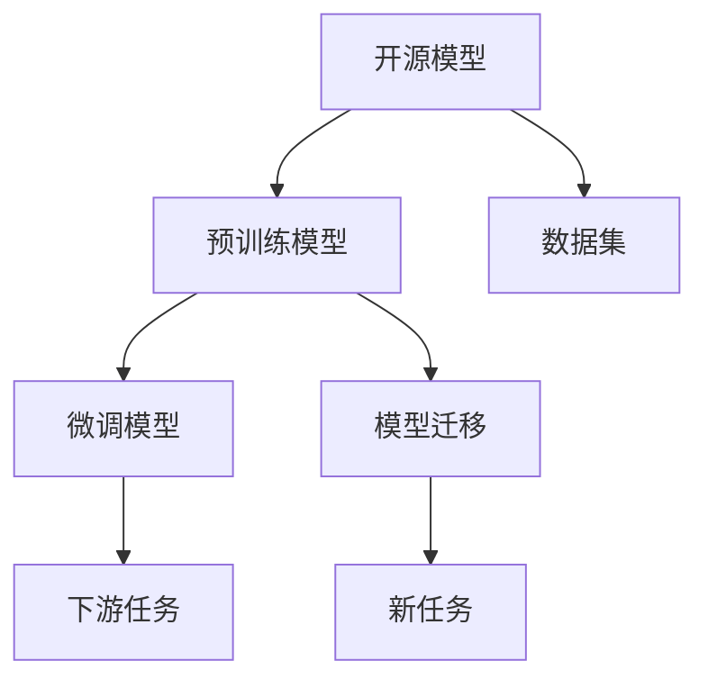

                 

## 1. 背景介绍

随着人工智能技术的迅猛发展，开源模型成为行业内外广泛关注的话题。开源模型不仅能够降低企业采用先进技术的门槛，也促进了技术社区的快速迭代和知识共享。本文将从背景、定义、应用及未来发展前景等方面，深入探讨开源模型在人工智能领域的发展前景。

## 2. 核心概念与联系

### 2.1 核心概念概述

为更深入地理解开源模型，首先需要明确几个核心概念：

- **开源模型（Open Source Model）**：指通过开源协议发布的模型源代码、文档及数据集，供用户自由下载、使用和修改，以适应不同的应用场景。

- **预训练模型（Pre-trained Model）**：指在大规模无标签数据上训练得到的通用语言模型，如BERT、GPT等。预训练模型通常具备强大的语言表示能力，能够用于多种下游任务。

- **微调模型（Fine-tuned Model）**：指基于预训练模型，通过有监督学习任务进一步优化的模型。微调模型能够适应特定任务，提升模型性能。

- **模型迁移（Model Transfer）**：指将预训练模型的知识迁移应用到新的任务或模型中，以提升新模型的性能。

这些概念之间具有紧密的联系，共同构成了开源模型的技术生态。预训练模型是开源模型的重要组成部分，微调模型和模型迁移是其应用的具体实现方式。

### 2.2 核心概念的关系

以下是各核心概念之间关系的简单图示：



该图展示了开源模型中各概念的相互关系。开源模型由预训练模型构成，微调模型和模型迁移是预训练模型的应用形式，数据集是模型训练的基础，下游任务和新的应用场景则是模型迁移的对象。

## 3. 核心算法原理 & 具体操作步骤

### 3.1 算法原理概述

开源模型的发展基于以下几个核心算法原理：

1. **预训练模型**：通过自监督学习在大规模无标签数据上训练得到的通用语言模型，如BERT、GPT等。预训练模型通常具备强大的语言表示能力，能够用于多种下游任务。

2. **微调模型**：基于预训练模型，通过有监督学习任务进一步优化的模型。微调模型能够适应特定任务，提升模型性能。

3. **模型迁移**：将预训练模型的知识迁移应用到新的任务或模型中，以提升新模型的性能。

4. **迁移学习**：通过在已有知识的基础上进行新任务的训练，可以减少新任务的学习时间，提升模型性能。

### 3.2 算法步骤详解

基于上述算法原理，开源模型的开发和应用一般包括以下几个关键步骤：

1. **数据准备**：收集数据集，确保数据的多样性和代表性，为模型训练和优化提供基础。

2. **模型选择**：选择合适的预训练模型，如BERT、GPT等，根据任务需求进行微调或迁移学习。

3. **超参数配置**：设置模型的学习率、批大小、迭代轮数等超参数，以优化模型性能。

4. **模型训练**：在数据集上对模型进行训练，调整模型参数以适应特定任务。

5. **模型评估**：在验证集上评估模型性能，确保模型泛化能力强。

6. **模型部署**：将模型部署到实际应用中，进行服务化和集成化开发。

7. **持续优化**：根据实际使用情况，不断调整模型参数，优化模型性能。

### 3.3 算法优缺点

开源模型具有以下优点：

1. **成本低**：开源模型免费使用，降低了企业的技术成本。

2. **易用性高**：开源模型提供了完整的代码和文档，易于使用和理解。

3. **社区支持**：开源模型有广泛的社区支持，开发者可以借助社区力量解决技术问题。

4. **灵活性高**：开源模型可以根据具体需求进行调整和优化，适应不同的应用场景。

5. **共享知识**：开源模型促进了知识的共享和传播，加速了技术的迭代和进步。

同时，开源模型也存在一些缺点：

1. **依赖性高**：开源模型依赖于外部环境，如硬件、网络等，可能影响模型的性能。

2. **安全性问题**：开源模型可能存在安全漏洞，未经审查的代码和数据集可能带来潜在风险。

3. **技术门槛**：开发和优化开源模型需要一定的技术背景，初学者可能面临较大挑战。

4. **性能不稳定**：开源模型的性能可能因数据集、超参数等差异而不同，需要不断调优。

### 3.4 算法应用领域

开源模型的应用领域广泛，涵盖了多个行业和领域。以下是一些典型应用场景：

1. **自然语言处理**：包括文本分类、情感分析、机器翻译等任务，开源模型如BERT、GPT等被广泛应用。

2. **计算机视觉**：包括图像识别、目标检测、图像生成等任务，开源模型如ResNet、YOLO等在实际项目中表现优异。

3. **语音识别**：包括语音转文本、语音情感分析等任务，开源模型如DeepSpeech、Wav2Vec等被广泛使用。

4. **智能推荐**：包括商品推荐、内容推荐等任务，开源模型如LightFM、NFM等在电商和媒体领域得到应用。

5. **金融科技**：包括信用评估、风险预测等任务，开源模型如XGBoost、Scikit-learn等在金融领域得到广泛应用。

## 4. 数学模型和公式 & 详细讲解

### 4.1 数学模型构建

假设我们有一项文本分类任务，使用开源模型进行微调。模型的输入为文本序列 $x = \{x_1, x_2, ..., x_n\}$，输出为分类标签 $y = \{1, 2, ..., k\}$。我们使用标准交叉熵损失函数 $\mathcal{L}$ 进行模型训练，具体如下：

$$
\mathcal{L} = -\frac{1}{N} \sum_{i=1}^{N} y_i \log(\hat{y}_i) + (1 - y_i) \log(1 - \hat{y}_i)
$$

其中 $\hat{y}_i$ 表示模型对文本 $x_i$ 的分类预测结果，$y_i$ 表示文本 $x_i$ 的真实标签。

### 4.2 公式推导过程

以文本分类任务为例，我们推导模型的具体实现过程。假设使用预训练模型 $M$ 和微调模型 $F$，目标函数为 $\mathcal{L}$，模型的预测输出为 $\hat{y} = F(x)$。

首先，我们需要计算模型 $F$ 在文本 $x_i$ 上的预测结果 $\hat{y}_i = F(x_i)$。然后，使用损失函数 $\mathcal{L}$ 计算模型预测结果与真实标签之间的差距：

$$
\mathcal{L} = -\frac{1}{N} \sum_{i=1}^{N} y_i \log(\hat{y}_i) + (1 - y_i) \log(1 - \hat{y}_i)
$$

接着，通过反向传播算法计算梯度，更新模型参数 $\theta$：

$$
\frac{\partial \mathcal{L}}{\partial \theta} = \frac{\partial \mathcal{L}}{\partial \hat{y}} \frac{\partial \hat{y}}{\partial \theta}
$$

其中 $\frac{\partial \mathcal{L}}{\partial \hat{y}}$ 是损失函数对预测输出的梯度，$\frac{\partial \hat{y}}{\partial \theta}$ 是预测输出对模型参数的梯度。

最后，使用优化算法（如Adam、SGD等）更新模型参数：

$$
\theta \leftarrow \theta - \eta \frac{\partial \mathcal{L}}{\partial \theta}
$$

其中 $\eta$ 为学习率，$F$ 为目标函数 $\mathcal{L}$ 对 $\theta$ 的梯度。

### 4.3 案例分析与讲解

以下是一个简单的案例分析，说明开源模型在实际应用中的具体实现。

假设我们需要使用开源模型进行文本分类任务，选择BERT作为预训练模型。具体实现步骤如下：

1. 数据准备：收集标注好的文本数据集，划分为训练集、验证集和测试集。

2. 模型选择：选择BERT作为预训练模型。

3. 超参数配置：设置模型的学习率为 $1e-5$，批大小为 $32$，迭代轮数为 $10$。

4. 模型训练：在训练集上进行模型训练，计算交叉熵损失函数。

5. 模型评估：在验证集上评估模型性能，调整学习率、批大小等超参数。

6. 模型部署：将模型部署到实际应用中，进行服务化和集成化开发。

7. 持续优化：根据实际使用情况，不断调整模型参数，优化模型性能。

## 5. 项目实践：代码实例和详细解释说明

### 5.1 开发环境搭建

开发环境搭建是开源模型开发的基础。以下是详细的步骤：

1. 安装Anaconda：从官网下载并安装Anaconda，用于创建独立的Python环境。

2. 创建并激活虚拟环境：
```bash
conda create -n pytorch-env python=3.8 
conda activate pytorch-env
```

3. 安装PyTorch：根据CUDA版本，从官网获取对应的安装命令。例如：
```bash
conda install pytorch torchvision torchaudio cudatoolkit=11.1 -c pytorch -c conda-forge
```

4. 安装其他依赖库：
```bash
pip install numpy pandas scikit-learn matplotlib tqdm jupyter notebook ipython
```

完成上述步骤后，即可在`pytorch-env`环境中进行模型开发。

### 5.2 源代码详细实现

以下是一个简单的代码实现，说明如何使用开源模型进行文本分类任务。

首先，定义数据处理函数：

```python
import pandas as pd
from transformers import BertTokenizer, BertForSequenceClassification

def load_data(file_path):
    df = pd.read_csv(file_path)
    return df['text'], df['label']
```

然后，定义模型和优化器：

```python
tokenizer = BertTokenizer.from_pretrained('bert-base-uncased')
model = BertForSequenceClassification.from_pretrained('bert-base-uncased', num_labels=2)
optimizer = AdamW(model.parameters(), lr=1e-5)
```

接着，定义训练和评估函数：

```python
def train_epoch(model, optimizer, train_data, device, batch_size):
    model.train()
    total_loss = 0
    for batch in train_data:
        input_ids = batch['input_ids'].to(device)
        attention_mask = batch['attention_mask'].to(device)
        labels = batch['labels'].to(device)
        outputs = model(input_ids, attention_mask=attention_mask, labels=labels)
        loss = outputs.loss
        total_loss += loss.item()
        optimizer.zero_grad()
        loss.backward()
        optimizer.step()
    return total_loss / len(train_data)

def evaluate(model, test_data, device, batch_size):
    model.eval()
    total_preds = []
    total_labels = []
    for batch in test_data:
        input_ids = batch['input_ids'].to(device)
        attention_mask = batch['attention_mask'].to(device)
        labels = batch['labels'].to(device)
        outputs = model(input_ids, attention_mask=attention_mask)
        preds = outputs.logits.argmax(dim=1).to('cpu').tolist()
        total_preds.append(preds)
        total_labels.append(labels)
    return preds, labels
```

最后，启动训练流程并在测试集上评估：

```python
epochs = 5
batch_size = 16
device = 'cuda' if torch.cuda.is_available() else 'cpu'

for epoch in range(epochs):
    loss = train_epoch(model, optimizer, train_data, device, batch_size)
    print(f'Epoch {epoch+1}, train loss: {loss:.3f}')
    
    preds, labels = evaluate(model, test_data, device, batch_size)
    print(classification_report(labels, preds))
    
print('Best accuracy:', max(classification_report(labels, preds).accuracy_score))
```

以上就是使用PyTorch进行开源模型微调的具体代码实现。可以看到，通过简单的代码，我们可以快速实现开源模型的训练和评估。

### 5.3 代码解读与分析

以下是代码中关键部分的详细解读：

**load_data函数**：
- 加载数据集，并返回文本和标签。

**BertForSequenceClassification模型**：
- 使用Bert作为预训练模型，并通过设置`num_labels`参数来指定分类数目。

**train_epoch函数**：
- 在训练集上进行模型训练，计算损失函数。

**evaluate函数**：
- 在测试集上评估模型性能，并返回预测结果和真实标签。

**classification_report函数**：
- 计算模型性能指标，包括精确率、召回率、F1分数等。

**max函数**：
- 计算最大准确率，用于评估模型最优性能。

## 6. 实际应用场景

开源模型在多个领域得到了广泛应用。以下是几个典型应用场景：

### 6.1 金融风控

在金融领域，开源模型被用于信用评估、欺诈检测、风险预测等任务。通过使用开源模型，金融机构能够快速构建风控系统，提高决策效率。

### 6.2 电商推荐

在电商领域，开源模型被用于商品推荐、个性化推荐等任务。通过使用开源模型，电商平台能够提升用户体验，增加销售转化率。

### 6.3 医疗诊断

在医疗领域，开源模型被用于疾病诊断、治疗方案推荐等任务。通过使用开源模型，医疗机构能够提高诊断准确性，提升患者满意度。

## 7. 工具和资源推荐

### 7.1 学习资源推荐

为了帮助开发者系统掌握开源模型的理论基础和实践技巧，这里推荐一些优质的学习资源：

1. **《深度学习》课程**：斯坦福大学开设的深度学习课程，涵盖深度学习的基本概念和前沿技术。

2. **PyTorch官方文档**：PyTorch官方文档提供了丰富的教程和示例，适合初学者和进阶开发者使用。

3. **HuggingFace官方文档**：HuggingFace官方文档提供了大量预训练模型的详细介绍和微调样例。

4. **Kaggle竞赛**：Kaggle竞赛平台提供了丰富的数据集和模型，适合开发者进行实践和竞赛。

### 7.2 开发工具推荐

高效的开发离不开优秀的工具支持。以下是几款用于开源模型开发的常用工具：

1. **PyTorch**：基于Python的开源深度学习框架，灵活的计算图设计，适合快速迭代研究。

2. **TensorFlow**：由Google主导开发的开源深度学习框架，适合大规模工程应用。

3. **TensorBoard**：TensorFlow配套的可视化工具，可实时监测模型训练状态，提供丰富的图表呈现方式。

4. **Weights & Biases**：模型训练的实验跟踪工具，可以记录和可视化模型训练过程中的各项指标，方便对比和调优。

5. **Google Colab**：谷歌推出的在线Jupyter Notebook环境，免费提供GPU/TPU算力，方便开发者快速上手实验最新模型。

### 7.3 相关论文推荐

开源模型的研究源于学界的持续努力。以下是几篇奠基性的相关论文，推荐阅读：

1. **ImageNet Large Scale Visual Recognition Challenge**：AlexNet模型的引入，标志着深度学习在计算机视觉领域的突破。

2. **Google AI Blog**：Google AI博客展示了其在深度学习领域的最新研究成果和思想。

3. **OpenAI Blog**：OpenAI博客提供了其在人工智能领域的最新见解和思考。

## 8. 总结：未来发展趋势与挑战

### 8.1 研究成果总结

开源模型的发展基于以下关键研究成果：

1. **深度学习理论**：深度学习模型的理论基础，如反向传播算法、梯度下降等。

2. **自然语言处理**：自然语言处理技术的进步，如BERT、GPT等预训练模型的提出。

3. **计算机视觉**：计算机视觉技术的突破，如ResNet、YOLO等模型的应用。

4. **迁移学习**：迁移学习技术的成熟，使得预训练模型能够应用于多种下游任务。

### 8.2 未来发展趋势

展望未来，开源模型将呈现以下几个发展趋势：

1. **模型规模不断增大**：随着算力成本的下降和数据规模的扩张，开源模型的参数量还将持续增长。超大规模模型蕴含的丰富知识，将推动更多下游任务的微调和应用。

2. **微调技术不断优化**：微调方法将更加高效、灵活，能够适应不同的应用场景和任务需求。

3. **跨领域知识融合**：开源模型将融合多模态数据和跨领域知识，提升模型在复杂场景中的理解和应用能力。

4. **持续学习和增量更新**：开源模型将具备持续学习和增量更新的能力，能够适应动态变化的数据分布。

5. **自动化和智能化**：开源模型将向自动化和智能化方向发展，自动进行数据预处理、模型训练和优化。

### 8.3 面临的挑战

尽管开源模型已经取得了显著进展，但在实际应用中也面临诸多挑战：

1. **数据隐私和安全**：开源模型可能面临数据泄露和隐私侵害的风险，如何保护用户数据成为重要问题。

2. **性能稳定性**：开源模型在实际应用中可能存在性能不稳定的问题，需要不断优化和调整。

3. **模型解释性**：开源模型的决策过程和推理逻辑难以解释，如何增强模型的可解释性成为重要研究方向。

4. **跨领域应用**：开源模型在不同领域的应用效果可能存在差异，需要针对特定领域进行微调和优化。

### 8.4 研究展望

未来的研究需要在以下几个方面寻求新的突破：

1. **无监督和半监督学习**：探索无监督和半监督学习范式，减少对标注数据的依赖，提升模型泛化能力。

2. **模型压缩和加速**：开发高效模型压缩和加速技术，提升开源模型的实时性和可用性。

3. **跨领域知识融合**：研究多模态数据和跨领域知识的融合方法，提升模型的综合应用能力。

4. **自动化微调**：开发自动化微调工具，自动选择模型和超参数，优化模型性能。

5. **可解释性增强**：研究增强模型可解释性的方法，提升模型的透明性和可信度。

6. **模型安全和隐私保护**：研究模型安全和隐私保护技术，保护用户数据和隐私。

这些研究方向的探索，必将引领开源模型的发展走向新的高度，为人工智能技术的落地应用提供更多可能。

## 9. 附录：常见问题与解答

**Q1：如何选择合适的开源模型？**

A: 选择开源模型需要考虑以下几个因素：
- 任务类型：选择适用于特定任务的模型，如BERT适用于自然语言处理任务。
- 数据集大小：选择适合数据集大小的模型，避免模型过大或过小。
- 计算资源：考虑模型的计算复杂度，选择合适的硬件和软件环境。

**Q2：开源模型在实际应用中需要注意哪些问题？**

A: 开源模型在实际应用中需要注意以下几个问题：
- 数据隐私和安全：保护用户数据，避免数据泄露和隐私侵害。
- 性能稳定性：优化模型性能，确保模型在实际应用中的稳定性。
- 模型解释性：增强模型可解释性，提高模型的透明性和可信度。
- 跨领域应用：针对特定领域进行微调和优化，提升模型性能。

**Q3：如何评估开源模型的性能？**

A: 评估开源模型的性能主要使用以下指标：
- 精确率、召回率、F1分数等分类指标。
- 均方误差、交叉熵等回归指标。
- AUC、ROC曲线等评估模型预测能力。
- 计算速度、内存占用等模型性能指标。

**Q4：开源模型在实际应用中如何持续优化？**

A: 持续优化开源模型的主要步骤包括：
- 数据收集：持续收集新数据，扩大数据集规模。
- 模型微调：根据新数据进行模型微调，优化模型性能。
- 超参数调整：调整模型超参数，如学习率、批大小等，提升模型效果。
- 模型压缩和加速：优化模型结构和参数，提升模型实时性。

总之，开源模型在实际应用中需要综合考虑数据、模型、算法、工程等多个方面，不断优化和调整，才能充分发挥其潜力，取得理想的效果。

---

作者：禅与计算机程序设计艺术 / Zen and the Art of Computer Programming

