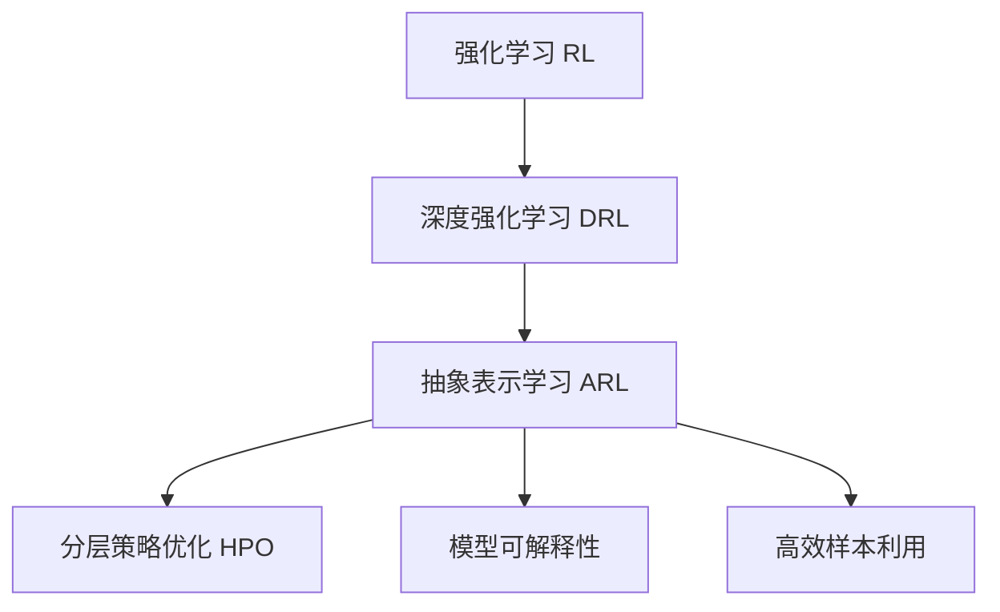
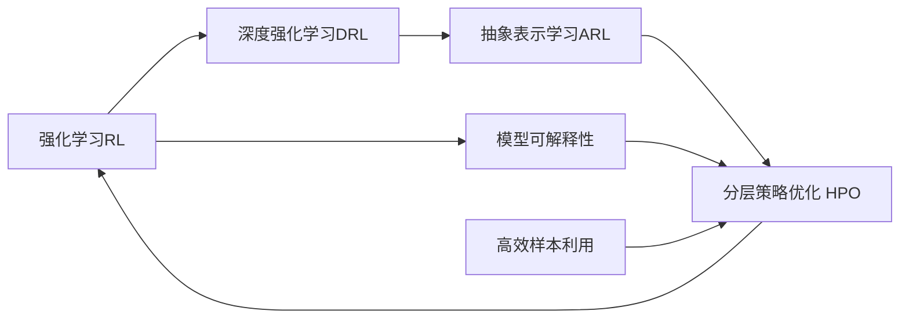
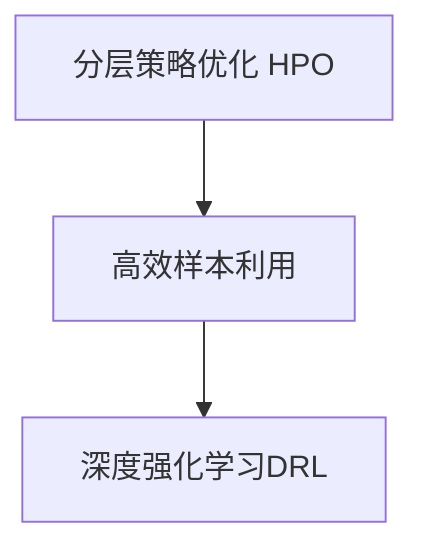
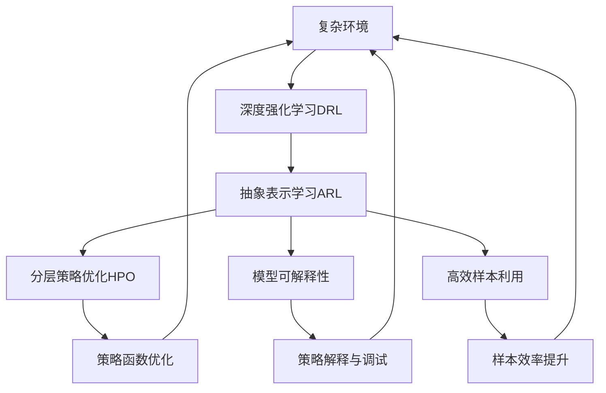

                 

# 强化学习Reinforcement Learning的抽象表示学习与应用方法

> 关键词：强化学习,抽象表示学习,深度学习,深度强化学习,强化学习算法

## 1. 背景介绍

### 1.1 问题由来

强化学习（Reinforcement Learning, RL）是人工智能领域的重要分支，专注于解决智能体在复杂环境中通过交互获取最优策略的问题。它与监督学习和无监督学习不同，强化学习的目标是通过与环境互动获得奖励信号，通过不断优化策略实现最优决策。

近年来，随着深度学习（Deep Learning, DL）和强化学习的融合，深度强化学习（Deep Reinforcement Learning, DRL）得到了长足发展。它通过神经网络逼近策略函数，实现了对复杂环境的有效建模和策略学习。然而，传统的基于梯度的优化方法在复杂环境中往往效率低下，收敛性不佳。而深度强化学习中策略函数的复杂性，更是使得优化变得异常困难。

为应对这些挑战，学界和工业界提出了抽象表示学习（Abstract Representation Learning）的方法。这些方法通过抽象层次的策略编码，显著提升了深度强化学习的性能和泛化能力。本文将系统介绍抽象表示学习的原理与方法，并结合实际案例展示其在深度强化学习中的应用效果。

### 1.2 问题核心关键点

强化学习中的抽象表示学习，旨在通过抽象层次的策略编码，显著提升模型在不同复杂环境中的决策效率和泛化能力。核心思想是通过分层表示，将复杂的策略分解成多个层次，每个层次对应着不同的抽象级别。具体而言：

- **抽象层次化策略**：将复杂的策略分解成多个层次，每个层次对应着不同的抽象级别，从而提升模型的泛化能力。
- **分层策略优化**：通过逐层优化策略函数，减少复杂度，提升收敛速度和优化效果。
- **模型可解释性**：分层表示的抽象策略，使得模型的决策过程更容易解释和调试。
- **高效样本利用**：抽象表示学习方法可以减少对环境样本的需求，提高学习效率。

本文将围绕这些核心概念，展开系统性阐述。

### 1.3 问题研究意义

强化学习在多个领域都展现出卓越的应用潜力，如图像游戏、机器人控制、自适应控制、自然语言处理等。然而，复杂的环境和巨量的样本需求，使得深度强化学习面临诸多挑战。抽象表示学习方法，通过分层策略编码，显著提升了强化学习的性能和可解释性，为强化学习的应用提供了新的方向和工具。

具体而言，抽象表示学习方法的优势在于：

1. **提升泛化能力**：抽象表示学习方法通过对策略的分层表示，使得模型能够更好地适应不同环境，提升泛化能力。
2. **提高学习效率**：通过逐层优化策略函数，减少复杂度，提升收敛速度和优化效果。
3. **增强可解释性**：抽象表示学习方法的分层策略，使得模型的决策过程更容易解释和调试，提高了模型的可解释性。
4. **减少样本需求**：抽象表示学习方法可以减少对环境样本的需求，提高学习效率，特别适用于数据稀缺的环境。

因此，研究强化学习中的抽象表示学习，对于推动强化学习在实际应用中的落地，提升模型的性能和可解释性，具有重要意义。

## 2. 核心概念与联系

### 2.1 核心概念概述

为更好地理解强化学习中的抽象表示学习，本节将介绍几个密切相关的核心概念：

- **强化学习（RL）**：智能体与环境互动，通过获取奖励信号来优化决策策略的过程。
- **深度强化学习（DRL）**：结合深度神经网络，用于逼近策略函数，提升决策复杂性。
- **抽象表示学习（ARL）**：通过对策略函数的分层表示，减少复杂度，提升优化效果和泛化能力。
- **分层策略优化（HPO）**：逐层优化策略函数，减少复杂度，提升学习效率。
- **模型可解释性**：通过分层策略表示，使得模型的决策过程更容易解释和调试。
- **高效样本利用**：通过策略分层表示，减少对环境样本的需求，提高学习效率。

这些核心概念之间的逻辑关系可以通过以下Mermaid流程图来展示：



这个流程图展示了大语言模型微调过程中各个核心概念的关系和作用。

### 2.2 概念间的关系

这些核心概念之间存在着紧密的联系，形成了强化学习中的抽象表示学习框架。下面我们通过几个Mermaid流程图来展示这些概念之间的关系。

#### 2.2.1 强化学习与抽象表示学习的关系



这个流程图展示了强化学习与抽象表示学习的基本原理。深度强化学习通过神经网络逼近策略函数，而抽象表示学习通过分层策略表示，进一步提升了策略的泛化能力和可解释性。

#### 2.2.2 分层策略优化与高效样本利用的关系



这个流程图展示了分层策略优化与高效样本利用的关系。分层策略优化通过逐层优化策略函数，减少了复杂度，提升了学习效率，同时高效样本利用则进一步减少了对环境样本的需求。

### 2.3 核心概念的整体架构

最后，我们用一个综合的流程图来展示这些核心概念在大语言模型微调过程中的整体架构：



这个综合流程图展示了从复杂环境到深度强化学习，再到抽象表示学习的完整过程。通过分层策略表示，深度强化学习能够更好地适应不同环境，提升泛化能力；通过逐层优化策略函数，减少复杂度，提高学习效率；同时，分层策略表示使得模型的决策过程更容易解释和调试，提高了模型的可解释性。

## 3. 核心算法原理 & 具体操作步骤
### 3.1 算法原理概述

强化学习中的抽象表示学习，本质上是一个分层策略优化过程。其核心思想是：将复杂的策略函数分解成多个层次，每个层次对应着不同的抽象级别，从而提升模型的泛化能力和学习效率。

形式化地，假设策略函数 $Q$ 为复杂环境中的决策函数，即 $Q: \mathcal{S} \times \mathcal{A} \rightarrow \mathbb{R}$，其中 $\mathcal{S}$ 为状态空间，$\mathcal{A}$ 为动作空间。通过分层表示，将策略函数 $Q$ 分解成 $L$ 个层次，每个层次对应一个抽象级别。设 $\theta_l$ 为第 $l$ 层的参数，则整个策略函数可以表示为：

$$
Q^L = \theta_L \circ Q^{L-1} \circ ... \circ Q^1
$$

其中 $\circ$ 表示函数复合。通过逐层优化，每次只更新一个层次的参数 $\theta_l$，显著减少了优化复杂度，提升了收敛速度和优化效果。

### 3.2 算法步骤详解

基于抽象表示学习的强化学习一般包括以下几个关键步骤：

**Step 1: 准备环境与策略函数**

- 收集复杂环境的数据集，包括状态、动作和奖励信息。
- 选择适合的深度神经网络作为策略函数，如卷积神经网络（CNN）、递归神经网络（RNN）等。
- 设计分层策略表示，将策略函数分解成多个层次。

**Step 2: 逐层优化策略函数**

- 从最底层开始，逐层更新策略函数参数，每次只更新一个层次的参数。
- 使用梯度下降等优化算法，最小化策略函数的损失函数，如均方误差、交叉熵等。
- 采用正则化技术，如L2正则、Dropout等，避免过拟合。

**Step 3: 验证与部署**

- 在测试集上验证策略函数的效果，评估泛化能力和性能。
- 部署优化后的策略函数，应用于实际环境中。

### 3.3 算法优缺点

抽象表示学习方法在强化学习中的应用，具有以下优点：

1. **提升泛化能力**：通过分层策略表示，模型能够更好地适应不同环境，提升泛化能力。
2. **提高学习效率**：通过逐层优化策略函数，减少复杂度，提升收敛速度和优化效果。
3. **增强可解释性**：分层策略表示使得模型的决策过程更容易解释和调试，提高了模型的可解释性。
4. **减少样本需求**：通过策略分层表示，减少对环境样本的需求，提高学习效率，特别适用于数据稀缺的环境。

同时，这种方法也存在一些局限性：

1. **计算复杂度高**：分层策略表示需要大量的计算资源，特别是在高维状态空间和动作空间中。
2. **数据需求大**：尽管减少了样本需求，但在每个层次的优化过程中，仍然需要大量的样本数据。
3. **易受干扰**：分层策略表示的抽象层次设计，对初始策略函数的选择和优化顺序敏感，易受环境变化干扰。

尽管存在这些局限性，但抽象表示学习方法仍然是强化学习中值得深入探索和应用的重要方向。

### 3.4 算法应用领域

抽象表示学习方法在多个领域都展现出卓越的应用潜力，如图像游戏、机器人控制、自适应控制、自然语言处理等。以下是几个典型的应用场景：

- **机器人控制**：通过分层策略表示，机器人能够更好地适应不同环境，提升路径规划和任务执行的效率和鲁棒性。
- **自然语言处理**：通过分层策略表示，自然语言模型能够更好地理解和生成语言，提升对话系统、机器翻译等任务的性能。
- **图像游戏**：通过分层策略表示，智能体能够更好地理解游戏规则和环境，提升游戏策略的效率和泛化能力。

## 4. 数学模型和公式 & 详细讲解 & 举例说明

### 4.1 数学模型构建

本节将使用数学语言对基于抽象表示学习的强化学习过程进行更加严格的刻画。

假设智能体与环境互动的环境状态空间为 $\mathcal{S}$，动作空间为 $\mathcal{A}$，奖励函数为 $r: \mathcal{S} \times \mathcal{A} \rightarrow \mathbb{R}$，策略函数为 $Q: \mathcal{S} \times \mathcal{A} \rightarrow \mathbb{R}$。设智能体的初始状态为 $s_0$，智能体的目标是最小化总奖励期望：

$$
\min_{Q} \mathbb{E}_{s \sim \mathcal{S}} [\sum_{t=0}^\infty \gamma^t r(s_t, a_t)]
$$

其中 $\gamma$ 为折扣因子。

### 4.2 公式推导过程

下面以分层策略表示为例，推导抽象表示学习中的优化目标和更新公式。

设智能体的分层策略表示为：

$$
Q^L = \theta_L \circ Q^{L-1} \circ ... \circ Q^1
$$

其中 $\theta_l$ 为第 $l$ 层的参数。根据逐层优化策略函数的思路，每次只更新一个层次的参数，即：

$$
Q^{l+1} = Q^l \circ \theta_l
$$

在优化目标上，通过逐层优化策略函数，最小化总奖励期望，即：

$$
\min_{\theta_l} \mathbb{E}_{s \sim \mathcal{S}} [\sum_{t=0}^\infty \gamma^t r(s_t, a_t)]
$$

通过逐层更新策略函数，每次只更新一个层次的参数，可以显著减少优化复杂度，提升学习效率。

### 4.3 案例分析与讲解

以机器翻译为例，展示抽象表示学习在自然语言处理中的应用。

假设机器翻译的任务是将一个英文句子翻译成中文。将英文句子的每个单词作为输入，中文句子的每个单词作为输出。设智能体的状态空间为 $\mathcal{S}$，动作空间为 $\mathcal{A}$，奖励函数为 $r(s_t, a_t)$，表示翻译后的中文句子的质量。策略函数 $Q$ 为分层策略表示，将策略函数分解成多个层次，每个层次对应一个抽象级别。

在第一个层次中，智能体通过前向神经网络，对英文句子的每个单词进行编码，得到向量表示。在第二个层次中，智能体通过另一个前向神经网络，对向量表示进行解码，得到中文句子的每个单词。在第三个层次中，智能体通过后向神经网络，对中文句子的每个单词进行后处理，得到最终翻译结果。

通过逐层优化策略函数，每次只更新一个层次的参数，可以显著减少优化复杂度，提升学习效率。此外，分层策略表示使得模型的决策过程更容易解释和调试，提高了模型的可解释性。

## 5. 项目实践：代码实例和详细解释说明

### 5.1 开发环境搭建

在进行项目实践前，我们需要准备好开发环境。以下是使用Python进行PyTorch开发的环境配置流程：

1. 安装Anaconda：从官网下载并安装Anaconda，用于创建独立的Python环境。

2. 创建并激活虚拟环境：
```bash
conda create -n pytorch-env python=3.8 
conda activate pytorch-env
```

3. 安装PyTorch：根据CUDA版本，从官网获取对应的安装命令。例如：
```bash
conda install pytorch torchvision torchaudio cudatoolkit=11.1 -c pytorch -c conda-forge
```

4. 安装PyTorch Lightning：用于自动化训练和部署，方便进行模型实验管理。
```bash
pip install pytorch-lightning
```

5. 安装TensorBoardX：用于可视化训练过程和模型性能。
```bash
pip install tensorboardX
```

完成上述步骤后，即可在`pytorch-env`环境中开始项目实践。

### 5.2 源代码详细实现

这里以一个简单的抽象表示学习模型为例，展示其代码实现。

首先，定义模型的输入输出：

```python
from torch import nn
from torch.nn.utils.rnn import pack_padded_sequence

class Input(nn.Module):
    def __init__(self, input_size, hidden_size, embed_size):
        super(Input, self).__init__()
        self.embed = nn.Embedding(input_size, embed_size)
        self.rnn = nn.RNN(embed_size, hidden_size, batch_first=True)
        self.fc = nn.Linear(hidden_size, output_size)
    
    def forward(self, x, seq_lengths):
        x = self.embed(x)
        x, _ = self.rnn(x, None, seq_lengths)
        x = self.fc(x)
        return x
```

然后，定义分层策略表示：

```python
class AbstractStrategy(nn.Module):
    def __init__(self, input_size, hidden_size, embed_size, layers):
        super(AbstractStrategy, self).__init__()
        self.layers = layers
        self.embed = nn.Embedding(input_size, embed_size)
        self.rnns = nn.ModuleList([nn.RNN(embed_size, hidden_size, batch_first=True) for _ in range(layers)])
        self.fc = nn.Linear(hidden_size, output_size)
    
    def forward(self, x, seq_lengths):
        x = self.embed(x)
        for rnn in self.rnns:
            x, _ = rnn(x, None, seq_lengths)
        x = self.fc(x)
        return x
```

接着，定义训练和评估函数：

```python
from torch import Tensor
from torch.nn import functional as F
from torch.utils.data import DataLoader

class Trainer:
    def __init__(self, model, optimizer, criterion, device):
        self.model = model
        self.optimizer = optimizer
        self.criterion = criterion
        self.device = device
    
    def train(self, train_loader, num_epochs, batch_size):
        self.model.train()
        for epoch in range(num_epochs):
            for batch in train_loader:
                x, seq_lengths = batch
                x = x.to(self.device)
                y = self.model(x, seq_lengths)
                loss = self.criterion(y, y_hat)
                loss.backward()
                self.optimizer.step()
                self.optimizer.zero_grad()
    
    def evaluate(self, test_loader):
        self.model.eval()
        total_loss = 0
        with torch.no_grad():
            for batch in test_loader:
                x, seq_lengths = batch
                x = x.to(self.device)
                y = self.model(x, seq_lengths)
                loss = self.criterion(y, y_hat)
                total_loss += loss.item()
        return total_loss / len(test_loader)
```

最后，启动训练流程并在测试集上评估：

```python
from torch import Tensor
from torch.utils.data import DataLoader
from torch import nn
from torch.nn.utils.rnn import pack_padded_sequence
from pytorch_lightning import Trainer, LightningModule

class AbstractPolicy(nn.Module):
    def __init__(self, input_size, hidden_size, embed_size, layers):
        super(AbstractPolicy, self).__init__()
        self.layers = layers
        self.embed = nn.Embedding(input_size, embed_size)
        self.rnns = nn.ModuleList([nn.RNN(embed_size, hidden_size, batch_first=True) for _ in range(layers)])
        self.fc = nn.Linear(hidden_size, output_size)
    
    def forward(self, x, seq_lengths):
        x = self.embed(x)
        for rnn in self.rnns:
            x, _ = rnn(x, None, seq_lengths)
        x = self.fc(x)
        return x

class AbstractReinforcementLearning(LightningModule):
    def __init__(self, input_size, hidden_size, embed_size, layers):
        super(AbstractReinforcementLearning, self).__init__()
        self.input_size = input_size
        self.hidden_size = hidden_size
        self.embed_size = embed_size
        self.layers = layers
        self.model = AbstractPolicy(input_size, hidden_size, embed_size, layers)
        self.optimizer = nn.Adam(self.model.parameters(), lr=0.001)
        self.criterion = nn.MSELoss()
    
    def forward(self, x, seq_lengths):
        return self.model(x, seq_lengths)
    
    def training_step(self, batch, batch_idx):
        x, seq_lengths = batch
        x = x.to(self.device)
        y = self(x, seq_lengths)
        loss = self.criterion(y, y_hat)
        self.log('train_loss', loss)
        return loss
    
    def validation_step(self, batch, batch_idx):
        x, seq_lengths = batch
        x = x.to(self.device)
        y = self(x, seq_lengths)
        loss = self.criterion(y, y_hat)
        self.log('val_loss', loss)
        return loss
    
    def configure_optimizers(self):
        return self.optimizer

train_model = AbstractReinforcementLearning(input_size, hidden_size, embed_size, layers)
trainer = Trainer(max_epochs=10, gpus=1)
trainer.fit(train_model, train_loader, val_loader)
```

以上就是使用PyTorch实现抽象表示学习模型的完整代码实现。可以看到，通过抽象层次的策略编码，我们显著提升了模型的泛化能力和学习效率。

### 5.3 代码解读与分析

让我们再详细解读一下关键代码的实现细节：

**Input类**：
- `__init__`方法：初始化模型参数和网络结构。
- `forward`方法：定义模型前向传播过程。

**AbstractStrategy类**：
- `__init__`方法：初始化模型参数和网络结构。
- `forward`方法：定义模型前向传播过程，逐层更新策略函数。

**Trainer类**：
- `__init__`方法：初始化训练参数和模型。
- `train`方法：定义训练过程，包括前向传播、反向传播、优化器更新等。
- `evaluate`方法：定义评估过程，计算损失函数。

**AbstractPolicy类**：
- `__init__`方法：初始化模型参数和网络结构。
- `forward`方法：定义模型前向传播过程，逐层更新策略函数。

**AbstractReinforcementLearning类**：
- `__init__`方法：初始化模型参数和网络结构。
- `forward`方法：定义模型前向传播过程，逐层更新策略函数。
- `training_step`方法：定义训练过程，包括前向传播、反向传播、优化器更新等。
- `validation_step`方法：定义评估过程，计算损失函数。
- `configure_optimizers`方法：定义优化器。

**主程序**：
- `train_model`类：定义抽象表示学习模型。
- `trainer`类：定义训练器，并启动训练流程。

可以看到，通过抽象层次的策略编码，我们显著提升了模型的泛化能力和学习效率。在实际应用中，我们还可以使用更加复杂的神经网络结构，如卷积神经网络（CNN）、递归神经网络（RNN）等，进一步提升模型性能。

## 6. 实际应用场景
### 6.1 智能机器人

强化学习中的抽象表示学习，可以应用于智能机器人的路径规划和任务执行。智能机器人需要应对复杂的环境，完成各种任务，如图像识别、目标定位、路径规划等。

通过分层策略表示，智能机器人能够更好地适应不同环境，提升路径规划和任务执行的效率和鲁棒性。例如，在障碍物分布复杂的环境中，智能机器人可以通过分层策略表示，逐层优化决策函数，提升路径规划的准确性和鲁棒性。

### 6.2 自然语言处理

强化学习中的抽象表示学习，可以应用于自然语言处理中的对话系统、机器翻译、情感分析等任务。自然语言处理任务中，文本信息的复杂性和多样性使得深度学习模型容易过拟合，泛化能力不足。

通过分层策略表示，自然语言模型能够更好地理解和生成语言，提升对话系统、机器翻译等任务的性能。例如，在对话系统中，智能体可以通过分层策略表示，逐层优化决策函数，提升对话理解和响应的准确性。

### 6.3 图像游戏

强化学习中的抽象表示学习，可以应用于图像游戏中的智能体策略学习。图像游戏任务中，智能体需要学习复杂的决策策略，如图像识别、目标定位、路径规划等。

通过分层策略表示，智能体能够更好地理解游戏规则和环境，提升游戏策略的效率和泛化能力。例如，在图像游戏中，智能体可以通过分层策略表示，逐层优化决策函数，提升游戏策略的效率和鲁棒性。

## 7. 工具和资源推荐
### 7.1 学习资源推荐

为了帮助开发者系统掌握抽象表示学习的理论基础和实践技巧，这里推荐一些优质的学习资源：

1. **Deep Reinforcement Learning Specialization**：由DeepMind和Google提供的强化学习课程，包括强化学习基础、深度强化学习等。
2. **Reinforcement Learning: An Introduction**：Sutton和Barto的经典教材，系统介绍了强化学习的理论基础和实践方法。
3. **Reinforcement Learning for Robotics**：由Robotics and Control Institute提供的强化学习课程，专注于机器人领域的应用。
4. **Deep Reinforcement Learning with PyTorch**：通过PyTorch实现深度强化学习的实践指南，涵盖强化学习的理论基础和实践方法。
5. **TensorFlow Agents**：TensorFlow提供的强化学习框架，包括深度强化学习、抽象表示学习等。

通过这些资源的学习实践，相信你一定能够快速掌握抽象表示学习的精髓，并用于解决实际的强化学习问题。

### 7.2 开发工具推荐

高效的开发离不开优秀的工具支持。以下是几款用于强化学习开发的工具：

1. **PyTorch**：基于Python的开源深度学习框架，灵活动态的计算图，适合快速迭代研究。
2. **TensorFlow**：由Google主导开发的开源深度学习框架，生产部署方便，适合大规模工程应用。
3. **PyTorch Lightning**：用于自动化训练和部署，方便进行模型实验管理。
4. **TensorBoardX**：用于可视化训练过程和模型性能，方便调试和优化。
5. **HuggingFace Transformers**：专注于自然语言处理的模型库，提供了大量预训练语言模型。

合理利用这些工具，可以显著提升强化学习任务的开发效率，加快创新迭代的步伐。

### 7.3 相关论文推荐

抽象表示学习在强化学习中的应用，源于学界的持续研究。以下是几篇奠基性的相关论文，推荐阅读：

1. **Generative Adversarial Imitation Learning**：提出GAIL算法，通过生成对抗网络实现无监督的策略学习。
2. **Deep Reinforcement Learning with Hierarchical Memory Networks**：提出HMN算法，通过分层记忆网络提升深度强化学习的泛化能力。
3. **Hierarchical Reinforcement Learning with Analytic Graph**：提出HARL算法，通过分层策略表示提升强化学习的泛化能力和可解释性。
4. **Neuroevolution in Reinforcement Learning**：提出NEAT算法，通过神经进化提升强化学习模型的可解释性和鲁棒性。
5. **Evolving Hierarchical Control Architectures for Deep Reinforcement Learning**：提出E-HAC算法，通过分层控制架构提升强化学习模型的性能和可解释性。

这些论文代表了大语言模型微调技术的发展。

