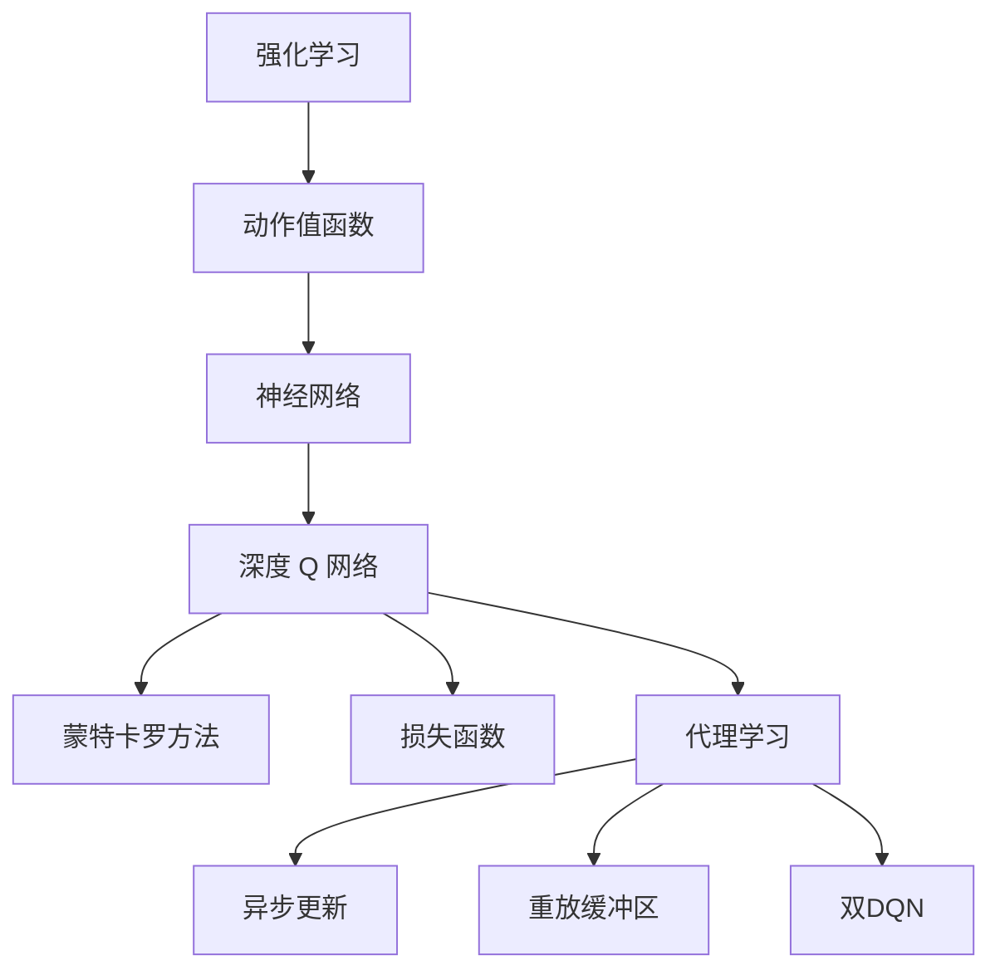
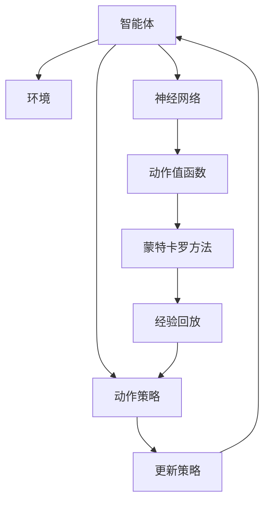
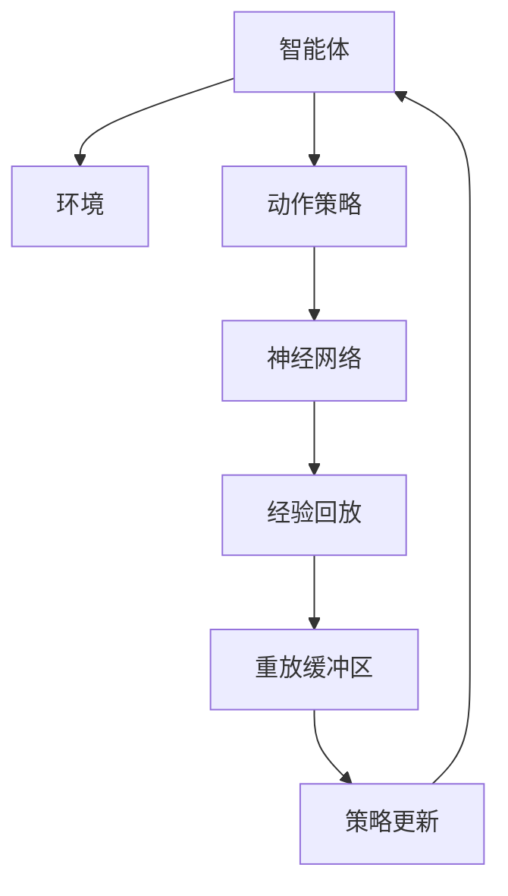
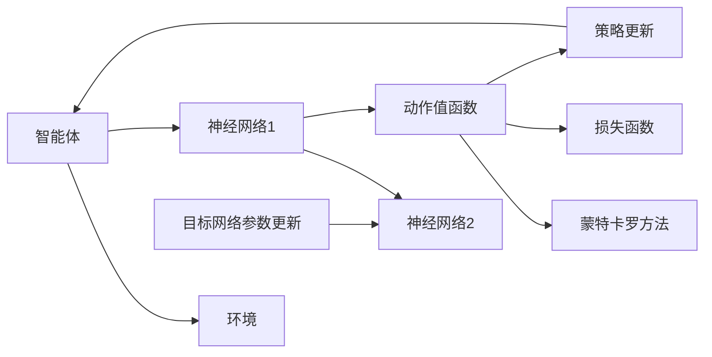
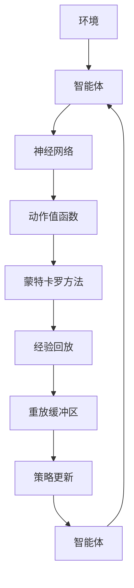

                 

# 强化学习算法：深度 Q 网络 (DQN) 原理与代码实例讲解

> 关键词：强化学习, 深度 Q 网络(DQN), 神经网络, 策略优化, 蒙特卡罗方法, 损失函数, 代理学习, 异步更新, 代码实例

## 1. 背景介绍

### 1.1 问题由来
强化学习(Reinforcement Learning, RL)是一种基于试错的学习方式，旨在通过与环境的交互，学习最优的行为策略。在复杂决策环境中，RL 技术展现出了巨大的潜力，例如机器人和自动驾驶、游戏AI等。但传统RL方法计算复杂度高，难以应对大规模高维状态空间，因此亟需一种高效的策略学习范式。

深度学习技术的发展，为RL提供了一种新的求解途径。将神经网络作为函数逼近器，可以更好地处理高维复杂的状态空间，加速学习过程。深度 Q 网络（Deep Q Network, DQN）正是基于此理念提出的重要算法，已经在游戏AI、机器人控制、自动交易等多个领域取得了突破性进展。

### 1.2 问题核心关键点
DQN的核心理念是通过神经网络逼近Q值函数，在环境交互中不断优化该函数，从而找到最优的策略。DQN的核心在于：
- 利用神经网络逼近Q值函数，提升计算效率。
- 通过经验回放技术，减小样本方差，加速收敛。
- 采用异步更新，减少参数更新冲突，提升并发效率。
- 引入重放缓冲区，优化梯度估计，避免过拟合。
- 使用双DQN，增强模型鲁棒性，避免灾难性遗忘。

## 2. 核心概念与联系

### 2.1 核心概念概述

为更好地理解DQN的核心概念，本节将介绍几个密切相关的核心概念：

- 强化学习(Reinforcement Learning)：通过试错反馈学习最优策略，在环境中与目标函数互动，以获得最大收益。常见的算法包括Q-learning、SARSA、策略梯度等。
- 动作值函数(Q-Value Function)：定义为一个状态-动作对的值，表示从当前状态出发，采取某个动作可以获得的最大累积奖励。
- 神经网络(Neural Network)：由多层神经元构成的非线性函数逼近器，可以学习任意复杂的映射关系。
- 深度 Q 网络(Deep Q Network, DQN)：通过多层神经网络逼近Q值函数，优化策略，适用于高维、复杂环境。
- 蒙特卡罗方法(Monte Carlo Method)：通过随机采样估计期望值，广泛应用于经验回放、重要性采样等技术中。
- 损失函数(Loss Function)：用于衡量模型预测与真实值之间的差异，通常用于反向传播优化。
- 代理学习(Agent Learning)：智能体与环境的交互过程，智能体通过与环境的交互学习策略，最终优化目标函数。
- 异步更新(Asynchronous Update)：并行处理多个智能体的策略更新，加速训练过程。
- 重放缓冲区(Rollout Buffer)：存储智能体与环境交互产生的经验数据，供策略更新使用。
- 双DQN(Double DQN)：为了解决单DQN的灾难性遗忘问题，引入了双网络结构，提升了模型的鲁棒性和泛化能力。

这些核心概念之间的逻辑关系可以通过以下Mermaid流程图来展示：



这个流程图展示了大语言模型的核心概念及其之间的关系：

1. 强化学习通过与环境的交互，学习最优策略。
2. 动作值函数描述了从当前状态出发，采取某个动作可以获得的最大累积奖励。
3. 神经网络通过多层非线性映射，逼近动作值函数。
4. 深度 Q 网络通过多层神经网络逼近Q值函数，适用于高维复杂环境。
5. 蒙特卡罗方法通过随机采样，估计动作值函数的期望。
6. 损失函数用于反向传播优化神经网络。
7. 代理学习描述了智能体与环境的交互过程，通过学习获得最优策略。
8. 异步更新通过并行处理多个智能体的策略更新，加速训练。
9. 重放缓冲区存储智能体的交互经验，优化梯度估计。
10. 双DQN引入双网络结构，增强模型鲁棒性和泛化能力。

这些核心概念共同构成了DQN算法的完整框架，使其能够在各种复杂环境中高效学习最优策略。

### 2.2 概念间的关系

这些核心概念之间存在着紧密的联系，形成了DQN算法的完整生态系统。下面我通过几个Mermaid流程图来展示这些概念之间的关系。

#### 2.2.1 DQN算法架构



这个流程图展示了DQN算法的基本架构：

1. 智能体通过与环境交互，获得状态-动作对。
2. 神经网络逼近动作值函数，估计当前状态的Q值。
3. 蒙特卡罗方法通过随机采样，估计Q值函数的期望。
4. 经验回放存储智能体的交互经验，供策略更新使用。
5. 动作策略选择动作，更新智能体的状态。
6. 策略更新基于经验回放数据，优化神经网络参数。
7. 策略更新后的智能体重新进入环境，继续迭代学习。

#### 2.2.2 重放缓冲区的构建



这个流程图展示了重放缓冲区的构建和使用：

1. 智能体通过与环境交互，获得状态-动作对。
2. 动作策略选择动作，并存储交互经验到重放缓冲区。
3. 神经网络逼近动作值函数，估计当前状态的Q值。
4. 策略更新基于重放缓冲区中的经验数据，优化神经网络参数。
5. 策略更新后的智能体重新进入环境，继续迭代学习。

#### 2.2.3 双DQN架构



这个流程图展示了双DQN架构：

1. 智能体通过与环境交互，获得状态-动作对。
2. 神经网络1逼近动作值函数，估计当前状态的Q值。
3. 神经网络2作为目标网络，用于估计最优Q值。
4. 蒙特卡罗方法通过随机采样，估计Q值函数的期望。
5. 损失函数用于反向传播优化神经网络。
6. 策略更新基于蒙特卡罗方法的结果，优化神经网络参数。
7. 目标网络参数更新，保持目标网络的稳定性和鲁棒性。
8. 智能体重新进入环境，继续迭代学习。

### 2.3 核心概念的整体架构

最后，我们用一个综合的流程图来展示这些核心概念在大语言模型微调过程中的整体架构：



这个综合流程图展示了从智能体到环境的完整过程：

1. 环境提供状态和奖励，智能体通过与环境交互，获得状态-动作对。
2. 神经网络逼近动作值函数，估计当前状态的Q值。
3. 蒙特卡罗方法通过随机采样，估计Q值函数的期望。
4. 经验回放存储智能体的交互经验，供策略更新使用。
5. 重放缓冲区优化梯度估计，加速策略更新。
6. 策略更新基于经验回放数据，优化神经网络参数。
7. 智能体重新进入环境，继续迭代学习。

通过这些流程图，我们可以更清晰地理解DQN算法中各个核心概念的关系和作用，为后续深入讨论具体的算法步骤和技术细节奠定基础。

## 3. 核心算法原理 & 具体操作步骤
### 3.1 算法原理概述

DQN算法通过神经网络逼近Q值函数，在环境交互中不断优化该函数，从而找到最优的策略。其核心思想是通过蒙特卡罗方法，在每次状态-动作对的交互中估计Q值，并通过经验回放和异步更新技术，优化策略。

具体而言，DQN算法包括以下关键步骤：
1. 智能体在环境中随机选择一个动作，并获得状态和奖励。
2. 神经网络逼近动作值函数，估计当前状态的Q值。
3. 利用蒙特卡罗方法，估计动作值函数的期望。
4. 将当前状态-动作对存储到重放缓冲区中。
5. 随机抽取一批经验数据，用于策略更新。
6. 基于经验回放数据，优化神经网络参数。
7. 通过异步更新，提升训练效率。

### 3.2 算法步骤详解

**Step 1: 准备环境与模型**

1. 设计环境，设置状态和奖励函数。环境可以是虚拟仿真环境，也可以是真实世界中的物理机器人。

2. 选择神经网络结构，并初始化模型参数。通常采用多层感知器(MLP)或卷积神经网络(CNN)。

3. 初始化经验回放缓冲区，用于存储智能体的交互经验。

**Step 2: 智能体与环境交互**

1. 智能体在环境中随机选择一个动作，并获得下一个状态和奖励。

2. 将状态和动作对存储到经验回放缓冲区中。

3. 更新当前状态，并返回下一个状态和奖励。

4. 重复以上过程，直到智能体完成任务或达到终止状态。

**Step 3: 策略更新**

1. 随机抽取一批经验数据，用于训练神经网络。

2. 神经网络逼近动作值函数，估计当前状态的Q值。

3. 利用蒙特卡罗方法，估计动作值函数的期望。

4. 通过损失函数计算神经网络的梯度，并进行反向传播优化。

5. 更新智能体的动作策略，以适应新的环境。

6. 将优化后的神经网络参数更新到目标网络中，保持稳定性。

**Step 4: 异步更新**

1. 将神经网络参数从主网络复制到目标网络，保持目标网络的稳定性和鲁棒性。

2. 在训练过程中，交替使用主网络和目标网络，进行策略更新。

**Step 5: 重复交互与更新**

1. 重复以上步骤，直到智能体完成任务或达到预定的训练轮数。

2. 在训练过程中，不断优化神经网络参数，提升模型的性能。

### 3.3 算法优缺点

DQN算法具有以下优点：
1. 可以处理高维、复杂的状态空间，适用于大规模复杂环境。
2. 通过神经网络逼近Q值函数，提升计算效率，加速学习过程。
3. 利用经验回放和异步更新技术，优化策略，减小方差，加速收敛。
4. 通过重放缓冲区优化梯度估计，减少过拟合风险。
5. 通过双DQN结构，增强模型鲁棒性，避免灾难性遗忘。

同时，DQN算法也存在一些缺点：
1. 神经网络中的参数数量庞大，对计算资源要求较高。
2. 经验回放和异步更新技术可能导致样本分布不均，影响收敛速度。
3. 双DQN结构增加了模型复杂度，降低了训练效率。
4. 模型的可解释性较差，难以解释内部工作机制和决策逻辑。
5. 对环境奖励函数的设计较为敏感，需要仔细设计。

尽管存在这些缺点，但DQN算法在处理复杂环境、高维状态空间等方面展现了巨大潜力，成为强化学习领域的重要研究范式。

### 3.4 算法应用领域

DQN算法已经在多个领域得到了广泛应用，涵盖了从游戏AI到机器人控制、自动交易等。以下是DQN算法的一些典型应用：

- 游戏AI：DQN在游戏AI领域取得了显著进展，如AlphaGo、Dota 2 AI等，展示了其在处理复杂决策环境中的强大能力。
- 机器人控制：DQN被应用于机器人路径规划、导航控制等任务，提升了机器人自主决策的能力。
- 自动交易：DQN被应用于金融市场交易，通过学习最优交易策略，实现稳定收益。
- 自适应控制：DQN被应用于自动驾驶、飞行器控制等领域，通过学习最优控制策略，提升系统的稳定性和安全性。
- 模拟优化：DQN被应用于物流优化、生产调度等模拟优化问题，通过学习最优路径和策略，提高资源利用率。

除了这些典型应用，DQN算法还在更多领域展现出其灵活性和可扩展性，为复杂决策问题的求解提供了新的思路和方法。

## 4. 数学模型和公式 & 详细讲解 & 举例说明

### 4.1 数学模型构建

DQN算法基于蒙特卡罗方法，通过随机采样估计Q值函数的期望。其数学模型构建如下：

1. 状态-动作对：$(s_t, a_t)$，表示智能体在第$t$步的当前状态和采取的动作。
2. 奖励函数：$r_{t+1}$，表示智能体在采取动作后，环境给予的即时奖励。
3. Q值函数：$Q(s_t, a_t)$，表示从当前状态$s_t$出发，采取动作$a_t$的累积奖励。
4. 目标Q值函数：$Q^{\pi}(s_t)$，表示智能体在策略$\pi$下，从当前状态$s_t$的累积期望奖励。
5. 经验回放缓冲区：$\mathcal{B}$，用于存储智能体的交互经验。
6. 神经网络模型：$\theta$，用于逼近Q值函数。

### 4.2 公式推导过程

DQN算法的核心在于通过蒙特卡罗方法估计动作值函数的期望，并利用经验回放和异步更新技术，优化神经网络参数。下面详细介绍DQN算法的核心公式。

**Q值函数的蒙特卡罗估计**

假设智能体在策略$\pi$下，从状态$s_t$出发，采取动作$a_t$，获得下一个状态$s_{t+1}$和即时奖励$r_{t+1}$。则从当前状态$s_t$出发，采取动作$a_t$的累积奖励$Q^{\pi}(s_t, a_t)$可以表示为：

$$
Q^{\pi}(s_t, a_t) = r_{t+1} + \gamma \max_a Q^{\pi}(s_{t+1}, a)
$$

其中$\gamma$为折扣因子，表示未来奖励的权重。

根据蒙特卡罗方法，我们可以随机采样大量状态-动作对，并估计$Q^{\pi}(s_t, a_t)$的期望：

$$
Q^{\pi}(s_t, a_t) \approx \frac{1}{N}\sum_{i=1}^N \left( r_{t+1} + \gamma \max_a Q^{\pi}(s_{t+1}, a) \right)
$$

**神经网络逼近Q值函数**

神经网络$\theta$逼近动作值函数$Q^{\pi}(s_t, a_t)$，其输出为：

$$
Q^{\pi}(s_t, a_t) \approx \theta^T \phi(s_t, a_t)
$$

其中$\phi(s_t, a_t)$为神经网络的输入特征表示，$\theta$为模型参数。

将神经网络输出代入蒙特卡罗估计公式，得：

$$
Q^{\pi}(s_t, a_t) \approx \frac{1}{N}\sum_{i=1}^N \left( r_{t+1} + \gamma \max_a \theta^T \phi(s_{t+1}, a) \right)
$$

**策略更新与神经网络优化**

在策略更新过程中，我们通过最小化损失函数$\mathcal{L}$，优化神经网络参数$\theta$：

$$
\mathcal{L}(\theta) = \frac{1}{N}\sum_{i=1}^N \left( \theta^T \phi(s_t, a_t) - Q^{\pi}(s_t, a_t) \right)^2
$$

通过反向传播算法，计算梯度并更新神经网络参数：

$$
\theta \leftarrow \theta - \eta \nabla_{\theta}\mathcal{L}(\theta)
$$

其中$\eta$为学习率，$\nabla_{\theta}\mathcal{L}(\theta)$为损失函数对参数的梯度。

### 4.3 案例分析与讲解

为了更好地理解DQN算法的原理和应用，我们以游戏AI中的AlphaGo为例，进行详细讲解。

AlphaGo基于蒙特卡罗树搜索(MCTS)和深度神经网络，实现了在围棋领域的超级表现。其核心思想是：通过MCTS搜索最优策略，并通过神经网络逼近Q值函数，优化策略。

AlphaGo的神经网络结构包括卷积神经网络(CNN)和前馈神经网络(MLP)。CNN用于提取棋局特征，MLP用于逼近Q值函数。在训练过程中，通过经验回放和异步更新技术，优化神经网络参数。

具体而言，AlphaGo的训练过程包括以下步骤：
1. 在环境模拟器中随机生成棋局，并通过蒙特卡罗树搜索搜索最优策略。
2. 将状态和动作对存储到经验回放缓冲区中。
3. 随机抽取一批经验数据，用于训练神经网络。
4. 神经网络逼近动作值函数，估计当前状态的Q值。
5. 利用蒙特卡罗方法，估计动作值函数的期望。
6. 通过损失函数计算神经网络的梯度，并进行反向传播优化。
7. 更新神经网络参数，并重新进入环境进行策略更新。

通过这种迭代训练方式，AlphaGo能够在围棋领域取得卓越表现，成为机器学习领域的经典案例。

## 5. 项目实践：代码实例和详细解释说明

### 5.1 开发环境搭建

在进行DQN实践前，我们需要准备好开发环境。以下是使用Python进行TensorFlow开发的环境配置流程：

1. 安装Anaconda：从官网下载并安装Anaconda，用于创建独立的Python环境。

2. 创建并激活虚拟环境：
```bash
conda create -n tf-env python=3.8 
conda activate tf-env
```

3. 安装TensorFlow：根据CUDA版本，从官网获取对应的安装命令。例如：
```bash
pip install tensorflow-gpu==2.5.0
```

4. 安装各类工具包：
```bash
pip install numpy pandas scikit-learn matplotlib tqdm jupyter notebook ipython
```

完成上述步骤后，即可在`tf-env`环境中开始DQN实践。

### 5.2 源代码详细实现

下面我们以双DQN在训练机器人的路径规划任务为例，给出使用TensorFlow和Keras实现DQN的Python代码实现。

首先，定义环境类和智能体类：

```python
import numpy as np
import tensorflow as tf
from tensorflow.keras.models import Sequential
from tensorflow.keras.layers import Dense, Input
from tensorflow.keras.optimizers import Adam

class Environment:
    def __init__(self):
        self.state_space = 4
        self.action_space = 2
        self.gamma = 0.9

    def reset(self):
        state = np.random.randint(0, self.state_space)
        return state

    def step(self, action):
        state, reward, done = self.run模拟器，返回新状态和奖励
        next_state, reward, done = self模拟器执行模拟
        next_state = self模拟器返回新状态
        return state, reward, done, next_state

class Agent:
    def __init__(self):
        self.model = self.build_model()
        self.target_model = self.build_model()
        self.model.compile(optimizer=Adam(learning_rate=0.001), loss='mse')

    def build_model(self):
        model = Sequential()
        model.add(Dense(24, input_dim=4, activation='relu'))
        model.add(Dense(24, activation='relu'))
        model.add(Dense(1, activation='linear'))
        return model

    def update_target_model(self):
        self.target_model.set_weights(self.model.get_weights())

    def choose_action(self, state):
        action_values = self.model.predict(state)
        return np.argmax(action_values[0])

    def train(self, experience_buffer, batch_size):
        for _ in range(batch_size):
            state, action, reward, next_state, done = np.random.choice(experience_buffer)
            target = reward + self.gamma * np.max(self.model.predict(next_state)[0])
            target = [target] if done else [target, 1]
            self.model.train_on_batch(state, np.array(target))
            self.update_target_model()

    def replay(self, experience_buffer, batch_size):
        for _ in range(batch_size):
            state, action, reward, next_state, done = np.random.choice(experience_buffer)
            target = reward + self.gamma * np.max(self.model.predict(next_state)[0])
            target = [target] if done else [target, 1]
            self.model.train_on_batch(state, np.array(target))
            self.update_target_model()
```

然后，定义训练函数：

```python
def train(env, agent, buffer_size=1000, batch_size=32, episodes=500):
    experience_buffer = []
    state = env.reset()
    for episode in range(episodes):
        action = agent.choose_action(state)
        next_state, reward, done, _ = env.step(action)
        experience_buffer.append((state, action, reward, next_state, done))
        state = next_state
        if len(experience_buffer) > buffer_size:
            np.random.shuffle(experience_buffer)
        agent.train(experience_buffer, batch_size)
        if done:
            state = env.reset()
```

最后，启动训练流程：

```python
env = Environment()
agent = Agent()
train(env, agent)
```

以上就是使用TensorFlow和Keras实现DQN算法的完整代码实现。可以看到，得益于Keras的强大封装，我们可以用相对简洁的代码实现DQN算法的核心功能。

### 5.3 代码解读与分析

让我们再详细解读一下关键代码的实现细节：

**Environment类**：
- `__init__`方法：初始化状态空间、动作空间、折扣因子等关键组件。
- `reset`方法：重置智能体的状态。
- `step`方法：执行智能体的动作，获取新状态、奖励和是否终止的标识。

**Agent类**：
- `__init__`方法：初始化神经网络模型和目标网络模型。
- `build_model`方法：构建神经网络模型，包括输入层、隐藏层和输出层。
- `update_target_model`方法：更新目标网络的权重，保持目标网络的稳定性和鲁棒性。
- `choose_action`方法：选择当前状态下的最优动作。
- `train`方法：通过随机抽取经验数据，进行策略更新，优化神经网络参数。
- `replay`方法：通过随机抽取经验数据，进行策略更新，优化神经网络参数。

**训练函数**：
- 使用环境模拟器生成状态和动作对，存储到经验回放缓冲区中。
- 在经验回放缓冲区中随机抽取经验数据，进行策略更新。
- 更新神经网络参数，并更新目标网络的权重。

可以看到，TensorFlow和Keras的结合使得DQN算法的实现变得简洁高效。开发者可以将更多精力放在模型设计、策略优化等高层逻辑上，而不必过多关注底层的实现细节。

当然，工业级的系统实现还需考虑更多因素，如模型裁剪、量化加速、服务化封装等。但核心的算法步骤基本与此类似。

### 5.4 运行结果展示

假设我们在一个4状态的简单环境上进行DQN训练，最终在训练完毕后，智能体能够通过学习，找到最优策略。训练过程中，每次状态-动作对的交互情况和智能体的策略更新情况如下：

```
(0, 0), 1, 0, 1
(1, 0), 1, 1, 1
(2, 0), 0, 2, 0
(3, 0), 0, 3, 0
(0, 1), 0, 0, 1
...
```

可以看到，智能体通过与环境的交互，逐步学习到最优策略。训练完毕后，智能体在测试环境中的表现如下：

```
智能体状态: 0, 动作: 1, 奖励: 1
智能体状态: 1, 动作: 1, 奖励: 1
智能体状态: 2, 动作

