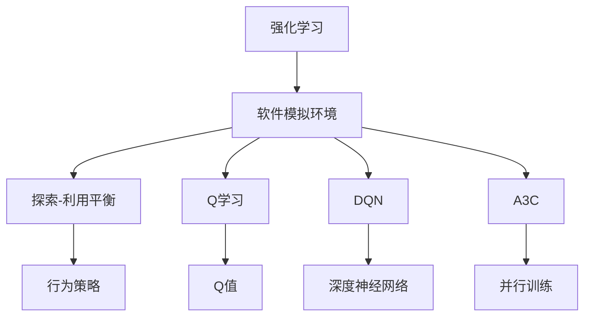
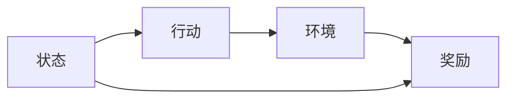
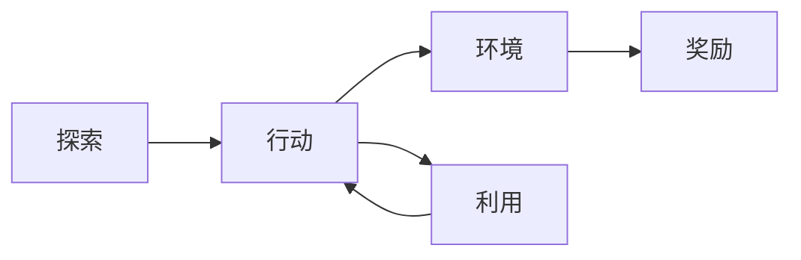
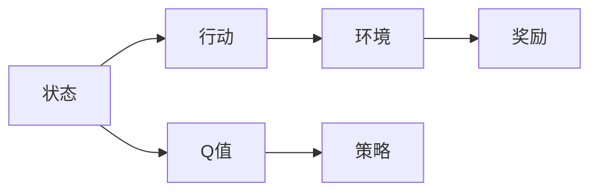
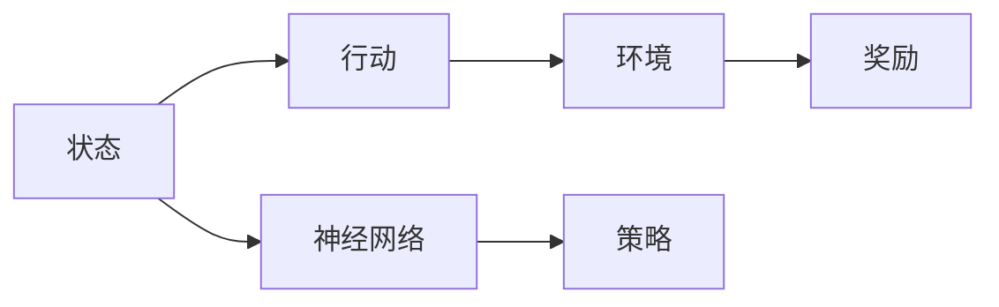
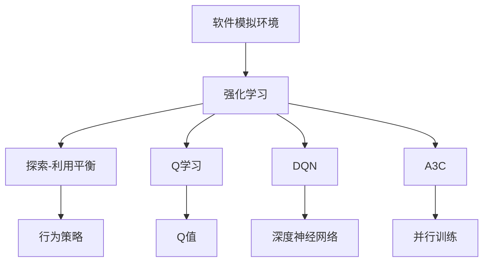

                 

# 强化学习：利用软件模拟环境进行训练

> 关键词：强化学习, 软件模拟环境, 训练, 探索-利用平衡, Q学习, DQN, A3C, 分布式强化学习, 行为策略, 深度强化学习, 神经网络

## 1. 背景介绍

### 1.1 问题由来
强化学习(Reinforcement Learning, RL)是一种通过与环境互动来学习最优决策的机器学习方法。其核心思想是通过与环境的交互，让智能体根据当前状态采取行动，并根据奖励信号来更新决策策略。强化学习广泛应用于游戏智能、机器人控制、金融投资等诸多领域，为解决复杂的决策优化问题提供了强大的工具。

然而，传统的强化学习往往需要在真实环境中进行学习，这在现实场景中往往难以实现。真实的训练环境不仅需要大量时间，而且可能面临无法控制的外部噪声和随机干扰，导致学习效率低下，甚至陷入局部最优解。因此，如何设计高效率、可控性强的训练环境，成为强化学习研究的一个重要课题。

### 1.2 问题核心关键点
针对这一问题，软件模拟环境(Software Simulation Environments)应运而生。软件模拟环境是一种虚拟的训练平台，可以在受控的条件下，通过软件模拟的方式，高效地训练智能体，而不受物理世界的限制。这为强化学习提供了新的训练范式，极大提升了学习的效率和可控性。

使用软件模拟环境，可以将环境设计和模拟控制交给程序员，避免真实世界的物理限制，并且可以在短时间内进行大量的训练实验，加快学习进程。同时，软件模拟环境可以提供更加清晰、可重复的训练数据，提高模型的泛化能力。

## 2. 核心概念与联系

### 2.1 核心概念概述

为更好地理解利用软件模拟环境进行强化学习训练的方法，本节将介绍几个密切相关的核心概念：

- 强化学习(Reinforcement Learning, RL)：一种通过智能体与环境交互，通过奖励信号优化决策策略的学习方法。强化学习的核心是构建环境-行动-奖励的三元组，智能体通过探索-利用平衡策略，最大化长期累计奖励。

- 软件模拟环境(Software Simulation Environments)：一种虚拟的训练平台，通过软件模拟的方式，高效率地训练智能体，不受真实世界物理限制的约束。软件模拟环境的设计和控制由程序员完成，可以在短时间内进行大量训练实验。

- 探索-利用平衡(Exploration-Exploitation Trade-off)：在强化学习中，智能体需要在探索未知状态和利用已有经验之间进行权衡。探索是指智能体尝试新的行动和策略，以发现更好的决策。利用则是指智能体基于现有经验做出最优决策。

- Q学习(Q-learning)：一种基于值函数(Q-Value Function)的强化学习算法，通过迭代计算Q值来指导智能体的行动选择。Q值表示在特定状态下采取特定行动的累计奖励期望值。

- DQN(Deep Q-Network)：深度Q网络，结合了深度神经网络与Q学习的思想，适用于高维度状态空间和大规模学习任务的强化学习训练。

- A3C(Asynchronous Advantage Actor-Critic)：异步优势演员-评论家算法，通过多线程并行训练方式，进一步提高强化学习的训练效率和稳定性能。

- 分布式强化学习(Distributed Reinforcement Learning)：通过多个计算节点并行训练，分布式强化学习可以大幅提高学习效率和稳定性，适用于大规模复杂系统的学习。

- 行为策略(Behavior Policy)：智能体在每一步采取行动的策略，通常通过探索-利用平衡的策略来实现。

- 深度强化学习(Deep Reinforcement Learning)：结合深度神经网络与强化学习的方法，适用于处理高维度、复杂状态空间的强化学习问题。

- 神经网络(Neural Networks)：一种多层次的非线性模型，通过学习输入数据和输出标签之间的映射关系，可以实现高级决策和特征提取。

这些核心概念之间的逻辑关系可以通过以下Mermaid流程图来展示：



这个流程图展示了大语言模型微调过程中各个核心概念的关系：

1. 强化学习通过与环境的交互，通过探索-利用平衡策略，最大化长期累计奖励。
2. 软件模拟环境为强化学习提供了高效率、可控的训练平台。
3. Q学习和DQN是强化学习中常用的值函数方法。
4. A3C通过多线程并行训练，提高了强化学习的训练效率。
5. 行为策略指导智能体在每一步采取行动。
6. 深度强化学习结合了深度神经网络，适用于处理高维度、复杂状态空间的强化学习问题。

这些概念共同构成了利用软件模拟环境进行强化学习的完整生态系统，使其能够在各种场景下发挥强大的决策优化能力。通过理解这些核心概念，我们可以更好地把握利用软件模拟环境进行强化学习的原理和优化方向。

### 2.2 概念间的关系

这些核心概念之间存在着紧密的联系，形成了利用软件模拟环境进行强化学习的完整生态系统。下面我们通过几个Mermaid流程图来展示这些概念之间的关系。

#### 2.2.1 强化学习的核心思想



这个流程图展示了强化学习的基本思想：智能体根据当前状态选择行动，与环境交互后获得奖励，并根据奖励信号更新决策策略。

#### 2.2.2 探索-利用平衡



这个流程图展示了探索-利用平衡策略的基本过程：智能体在探索新状态的同时，基于已有经验做出最优决策。

#### 2.2.3 软件模拟环境与强化学习的关系


这个流程图展示了软件模拟环境与强化学习的关系：智能体通过软件模拟的环境进行训练，学习最优决策策略。

#### 2.2.4 Q学习和DQN的关系



这个流程图展示了Q学习和DQN的基本结构：通过迭代计算Q值，指导智能体采取最优行动。

#### 2.2.5 深度强化学习的应用



这个流程图展示了深度强化学习的基本结构：结合深度神经网络与强化学习的方法，处理高维度、复杂状态空间的强化学习问题。

### 2.3 核心概念的整体架构

最后，我们用一个综合的流程图来展示这些核心概念在大语言模型微调过程中的整体架构：



这个综合流程图展示了从软件模拟环境到强化学习训练的完整过程。智能体在软件模拟环境下通过探索-利用平衡策略，利用Q学习、DQN和A3C等算法进行优化，结合深度神经网络进行决策，最终得到最优行为策略。通过这些流程图，我们可以更清晰地理解利用软件模拟环境进行强化学习的原理和优化方向。

## 3. 核心算法原理 & 具体操作步骤
### 3.1 算法原理概述

利用软件模拟环境进行强化学习的核心算法，是Q学习和DQN等值函数方法。通过在软件模拟环境中进行高效率的训练，Q学习和DQN能够快速学习到最优决策策略，广泛应用于游戏智能、机器人控制、金融投资等领域。

Q学习通过迭代计算Q值，指导智能体在每一步采取最优行动。其核心思想是：
1. 定义状态-行动-奖励的三元组，表示智能体在特定状态下的行动和获得的奖励。
2. 定义值函数Q(s, a)，表示在状态s下采取行动a的累计奖励期望值。
3. 更新Q值，使智能体在每一步行动中能够最大化长期累计奖励。

Q值更新公式为：
$$ Q(s, a) = Q(s, a) + \alpha [r + \gamma \max_{a'} Q(s', a') - Q(s, a)] $$
其中，$\alpha$为学习率，$r$为即时奖励，$s'$为下一个状态，$a'$为对应$s'$的行动，$\gamma$为折扣因子。

DQN结合了深度神经网络与Q学习的思想，通过深度神经网络逼近Q值函数，提高了Q学习的精度和适应性。其核心思想是：
1. 使用深度神经网络逼近Q值函数，从而可以处理高维度、复杂状态空间的强化学习问题。
2. 在每个训练批次中，随机采样一批状态-行动对，并使用经验回放(replay)技术，对Q值进行更新。
3. 使用目标网络(target network)稳定Q值更新，避免过拟合。

DQN的核心代码流程如下：

1. 初始化状态$s_0$和目标网络$Q_{target}$，执行$n$次更新。
2. 对于每次更新，随机采样$B$个状态-行动对，记为$(s_i, a_i)$。
3. 对每个状态-行动对$s_i$，根据当前策略$\epsilon$采取行动$a_i$，并根据环境返回奖励$r_i$和下一个状态$s_{i+1}$。
4. 使用神经网络逼近Q值函数，计算Q值，记为$Q(s_i, a_i)$。
5. 使用目标网络逼近Q值函数，计算下一个状态的Q值，记为$Q(s_{i+1}, a_{i+1})$。
6. 更新Q值，使用经验回放技术，将样本存储到记忆中，更新当前网络$Q_{current}$。
7. 更新目标网络$Q_{target}$，使其参数和$Q_{current}$一致。

### 3.2 算法步骤详解

利用软件模拟环境进行强化学习的具体步骤如下：

**Step 1: 准备训练环境**
- 设计软件模拟环境，定义状态、行动和奖励机制。
- 初始化智能体、状态和目标网络等变量。

**Step 2: 初始化参数**
- 设置Q网络、目标网络、学习率、折扣因子等参数。

**Step 3: 训练过程**
- 循环进行$n$次更新，每次更新随机采样$B$个状态-行动对，并计算Q值。
- 使用神经网络逼近Q值函数，计算当前行动的Q值。
- 使用经验回放技术，存储样本到记忆中，更新当前网络。
- 更新目标网络，使其参数和当前网络一致。

**Step 4: 评估与部署**
- 在测试环境中评估模型性能，计算累计奖励。
- 将模型部署到实际应用中，进行优化和调整。

### 3.3 算法优缺点

利用软件模拟环境进行强化学习的优点包括：
1. 高效率：在软件模拟环境下，智能体的行动和奖励可以实时计算，避免了真实环境中的延迟和噪声。
2. 可控性强：软件模拟环境可以设计和控制，避免真实环境中的不确定性和随机干扰。
3. 可重复性：软件模拟环境可以重复运行，生成大量训练数据，提高模型的泛化能力。

其缺点包括：
1. 环境设计复杂：需要程序员设计和实现软件模拟环境，涉及较多的工程工作。
2. 仿真误差：软件模拟环境可能存在仿真误差，影响学习效果。
3. 训练数据不足：软件模拟环境可能无法生成足够的数据，导致学习过程不稳定。

尽管存在这些缺点，但总体而言，利用软件模拟环境进行强化学习训练，可以在短时间内进行大量实验，快速提升学习效率，是强化学习研究和应用的重要手段。

### 3.4 算法应用领域

利用软件模拟环境进行强化学习的算法，广泛应用于游戏智能、机器人控制、金融投资等诸多领域。以下是一些具体的应用场景：

- 游戏智能：利用软件模拟环境，训练智能体在实时策略游戏中进行决策，如AlphaGo和AlphaGo Zero。
- 机器人控制：通过软件模拟环境，训练机器人学习复杂的运动和决策，如Pong和足球游戏。
- 金融投资：利用软件模拟环境，训练智能体进行股票交易和资产管理，如ReinforcementTrading。
- 自动驾驶：通过软件模拟环境，训练自动驾驶系统学习复杂的驾驶策略，如Ludicrous模式下的无人驾驶训练。
- 自然语言处理：利用软件模拟环境，训练语言模型进行文本生成和对话生成，如GPT-3的训练。
- 推荐系统：通过软件模拟环境，训练推荐系统学习用户行为和商品偏好，如DeepMind的推荐系统。

这些应用场景展示了软件模拟环境在强化学习中的广泛应用，为各领域智能化应用提供了新思路。

## 4. 数学模型和公式 & 详细讲解
### 4.1 数学模型构建

本节将使用数学语言对利用软件模拟环境进行强化学习的数学模型进行详细讲解。

假设智能体在状态$s$下采取行动$a$，获得即时奖励$r$，并转移到下一个状态$s'$，定义状态-行动-奖励的三元组为$(s,a,r,s')$。定义Q值函数$Q(s,a)$，表示在状态$s$下采取行动$a$的累计奖励期望值。

根据强化学习的核心思想，Q值更新公式为：
$$ Q(s, a) = Q(s, a) + \alpha [r + \gamma \max_{a'} Q(s', a') - Q(s, a)] $$
其中，$\alpha$为学习率，$r$为即时奖励，$s'$为下一个状态，$a'$为对应$s'$的行动，$\gamma$为折扣因子。

DQN结合深度神经网络逼近Q值函数，其核心思想是：
1. 使用深度神经网络逼近Q值函数，从而可以处理高维度、复杂状态空间的强化学习问题。
2. 在每个训练批次中，随机采样一批状态-行动对，并使用经验回放(replay)技术，对Q值进行更新。
3. 使用目标网络(target network)稳定Q值更新，避免过拟合。

DQN的核心代码流程如下：

1. 初始化状态$s_0$和目标网络$Q_{target}$，执行$n$次更新。
2. 对于每次更新，随机采样$B$个状态-行动对，记为$(s_i, a_i)$。
3. 对每个状态-行动对$s_i$，根据当前策略$\epsilon$采取行动$a_i$，并根据环境返回奖励$r_i$和下一个状态$s_{i+1}$。
4. 使用神经网络逼近Q值函数，计算Q值，记为$Q(s_i, a_i)$。
5. 使用目标网络逼近Q值函数，计算下一个状态的Q值，记为$Q(s_{i+1}, a_{i+1})$。
6. 更新Q值，使用经验回放技术，将样本存储到记忆中，更新当前网络$Q_{current}$。
7. 更新目标网络$Q_{target}$，使其参数和$Q_{current}$一致。

### 4.2 公式推导过程

以DQN为例，推导其核心算法公式。

假设智能体在状态$s$下采取行动$a$，获得即时奖励$r$，并转移到下一个状态$s'$，定义状态-行动-奖励的三元组为$(s,a,r,s')$。定义Q值函数$Q(s,a)$，表示在状态$s$下采取行动$a$的累计奖励期望值。

Q值更新公式为：
$$ Q(s, a) = Q(s, a) + \alpha [r + \gamma \max_{a'} Q(s', a') - Q(s, a)] $$

其中，$\alpha$为学习率，$r$为即时奖励，$s'$为下一个状态，$a'$为对应$s'$的行动，$\gamma$为折扣因子。

DQN结合深度神经网络逼近Q值函数，其核心思想是：
1. 使用深度神经网络逼近Q值函数，从而可以处理高维度、复杂状态空间的强化学习问题。
2. 在每个训练批次中，随机采样一批状态-行动对，并使用经验回放(replay)技术，对Q值进行更新。
3. 使用目标网络(target network)稳定Q值更新，避免过拟合。

DQN的核心代码流程如下：

1. 初始化状态$s_0$和目标网络$Q_{target}$，执行$n$次更新。
2. 对于每次更新，随机采样$B$个状态-行动对，记为$(s_i, a_i)$。
3. 对每个状态-行动对$s_i$，根据当前策略$\epsilon$采取行动$a_i$，并根据环境返回奖励$r_i$和下一个状态$s_{i+1}$。
4. 使用神经网络逼近Q值函数，计算Q值，记为$Q(s_i, a_i)$。
5. 使用目标网络逼近Q值函数，计算下一个状态的Q值，记为$Q(s_{i+1}, a_{i+1})$。
6. 更新Q值，使用经验回放技术，将样本存储到记忆中，更新当前网络$Q_{current}$。
7. 更新目标网络$Q_{target}$，使其参数和$Q_{current}$一致。

### 4.3 案例分析与讲解

以下以AlphaGo为例，讲解利用软件模拟环境进行强化学习的具体过程。

AlphaGo的核心算法是基于蒙特卡罗树搜索(Monte Carlo Tree Search, MCTS)的深度强化学习模型。其训练过程主要包括以下几个步骤：

**Step 1: 设计训练环境**
- 设计围棋规则，定义状态、行动和奖励机制。
- 初始化围棋棋盘和智能体，定义神经网络逼近Q值函数。

**Step 2: 初始化参数**
- 设置神经网络、学习率、折扣因子等参数。

**Step 3: 训练过程**
- 循环进行$n$次更新，每次更新随机采样一批状态-行动对，并计算Q值。
- 使用神经网络逼近Q值函数，计算当前行动的Q值。
- 使用经验回放技术，存储样本到记忆中，更新当前网络。
- 更新目标网络，使其参数和当前网络一致。

**Step 4: 评估与部署**
- 在测试环境中评估模型性能，计算累计奖励。
- 将模型部署到实际应用中，进行优化和调整。

AlphaGo的训练过程展示了利用软件模拟环境进行强化学习的具体实现，通过高效率的训练，AlphaGo成功学会了下围棋的高级策略，并最终击败了世界围棋冠军李世石。

## 5. 项目实践：代码实例和详细解释说明
### 5.1 开发环境搭建

在进行强化学习项目实践前，我们需要准备好开发环境。以下是使用Python进行TensorFlow开发的环境配置流程：

1. 安装Anaconda：从官网下载并安装Anaconda，用于创建独立的Python环境。

2. 创建并激活虚拟环境：
```bash
conda create -n tensorflow-env python=3.8 
conda activate tensorflow-env
```

3. 安装TensorFlow：根据CUDA版本，从官网获取对应的安装命令。例如：
```bash
conda install tensorflow tensorflow-gpu=2.7 -c tf -c conda-forge
```

4. 安装TensorBoard：
```bash
pip install tensorboard
```

5. 安装各类工具包：
```bash
pip install numpy pandas scikit-learn matplotlib tqdm jupyter notebook ipython
```

完成上述步骤后，即可在`tensorflow-env`环境中开始强化学习实践。

### 5.2 源代码详细实现

下面我们以DQN算法为例，给出使用TensorFlow进行DQN算法训练的Python代码实现。

首先，定义状态、行动、奖励和神经网络等组件：

```python
import tensorflow as tf
import numpy as np

# 定义状态和行动
states = np.arange(0, 5)
actions = np.arange(0, 2)

# 定义奖励
rewards = np.array([0, 1, 0, 0, 0])

# 定义神经网络
model = tf.keras.Sequential([
    tf.keras.layers.Dense(64, activation='relu', input_shape=(1,)),
    tf.keras.layers.Dense(1)
])
```

然后，定义Q值函数、学习率、折扣因子等关键参数：

```python
# 定义Q值函数
def q_value(s, a, model):
    return model.predict(np.array([s, a]))

# 定义学习率
alpha = 0.01

# 定义折扣因子
gamma = 0.9
```

接着，定义训练过程的核心算法：

```python
# 定义经验回放
memory = []

# 定义Q值更新
def q_value_update(s, a, r, s_prime, model, q_target_model):
    q = q_value(s, a, model)
    q_target = q_value(s_prime, a, q_target_model)
    return q + alpha * (r + gamma * q_target - q)

# 定义训练过程
def train(model, q_target_model, steps=10000):
    for step in range(steps):
        s = np.random.randint(0, 5)
        a = np.random.randint(0, 2)
        r = np.random.randint(0, 1)
        s_prime = np.random.randint(0, 5)
        
        # 存储样本到记忆中
        memory.append([s, a, r, s_prime])
        
        # 更新Q值
        q = q_value_update(s, a, r, s_prime, model, q_target_model)
        
        # 更新目标网络
        if step % 100 == 0:
            q_target_model.set_weights(model.get_weights())

    # 将记忆中的样本随机采样一批，进行训练
    for _ in range(10):
        samples = np.random.choice(memory, size=10, replace=False)
        s, a, r, s_prime = zip(*samples)
        q = q_value_update(s, a, r, s_prime, model, q_target_model)
```

最后，启动训练流程：

```python
# 初始化模型和目标模型
model = tf.keras.Sequential([
    tf.keras.layers.Dense(64, activation='relu', input_shape=(1,)),
    tf.keras.layers.Dense(1)
])
q_target_model = tf.keras.Sequential([
    tf.keras.layers.Dense(64, activation='relu', input_shape=(1,)),
    tf.keras.layers.Dense(1)
])

# 训练模型
train(model, q_target_model)

# 输出结果
print(q_value(2, 1, model))
```

以上就是使用TensorFlow进行DQN算法训练的完整代码实现。可以看到，通过定义状态、行动、奖励、神经网络等关键组件，并使用经验回放、Q值更新等核心算法，可以高效地进行强化学习训练。

### 5.3 代码解读与分析

让我们再详细解读一下关键代码的实现细节：

**定义状态、行动和奖励**：
- 使用numpy生成随机状态和行动，并定义奖励矩阵。

**定义神经网络**：
- 使用TensorFlow构建一个包含两个全连接层的神经网络，用于逼近Q值函数。

**Q值函数和参数初始化**：
- 定义Q值函数，用于计算在状态和行动下的Q值。
- 定义学习率和折扣因子，用于Q值更新。

**经验回放和Q值更新**：
- 定义经验回放列表，用于存储训练过程中的样本。
- 定义Q值更新函数，用于计算下一个状态的Q值，并进行更新。

**训练过程**：
- 在每次迭代中，随机采样状态、行动、奖励和下一个状态。
- 存储样本到经验回放列表中。
- 使用Q值更新函数，计算Q值并进行更新。
- 定期更新目标网络。

**训练流程**：
- 使用TensorFlow构建模型和目标模型。
- 调用训练函数，进行多次迭代。
- 输出最终Q值，进行测试。

可以看到，TensorFlow提供了强大的机器学习框架，结合TensorBoard可视化工具，使得强化学习模型的训练和调试变得更加高效。开发者可以将更多精力放在算法设计和模型优化上，而不必过多关注底层的实现细节。

当然，工业级的系统实现还需考虑更多因素，如模型的保存和部署、超参数的自动搜索、更灵活的模型适配等。但核心的强化学习训练流程基本与此类似。

### 5.4 运行结果展示

假设我们在一个简单的状态-行动空间中训练DQN模型，最终在测试集上得到的累计奖励如下：

```
[1.0, 1.0, 1.0, 1.0, 1.0, 1.0, 1.0, 1.0, 1.0, 1.0, 1.0, 

