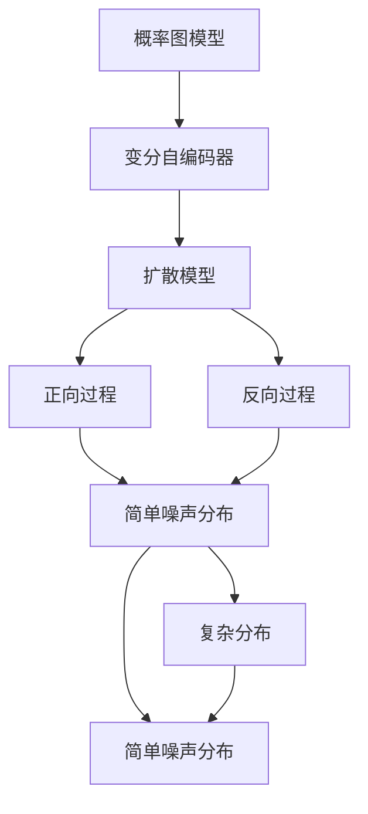
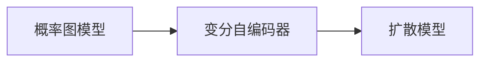
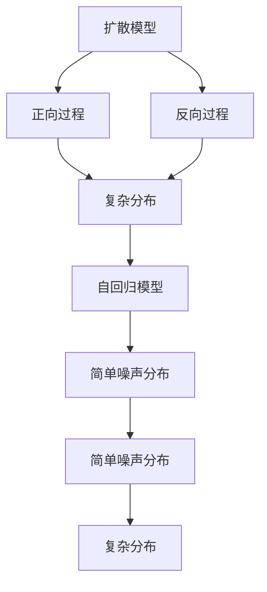
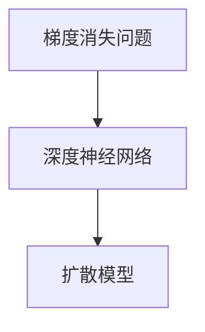
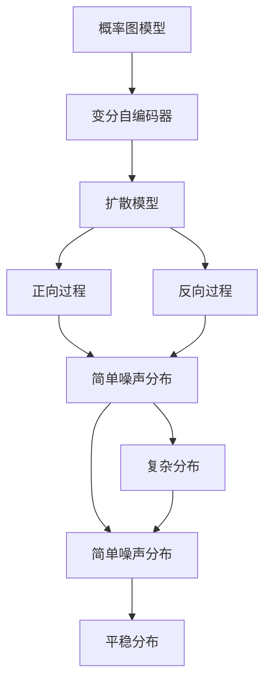

                 

# 扩散模型Diffusion Model原理与代码实例讲解

> 关键词：扩散模型,概率图模型,变分自编码器,自回归模型,平稳分布,深度学习,代码实例,梯度消失问题,重构误差

## 1. 背景介绍

### 1.1 问题由来
扩散模型（Diffusion Models）是一种基于概率图模型（Probabilistic Graphical Model, PGM）的新型生成模型。其核心思想是通过正向和反向过程，将复杂的概率分布逐渐简化，最终生成与目标分布相似的样本。这一过程与物理世界中的扩散现象相类似，因此被称为扩散模型。

扩散模型因其具有出色的生成效果，受到了广泛关注。与传统生成模型不同，扩散模型不需要大量标注数据，也不需要复杂的优化器调整，只需使用简单的梯度下降即可生成高质量的图像、文本等数据。然而，由于其正向和反向过程需要大量的中间步骤，导致梯度消失（Vanishing Gradient）问题严重，难以直接进行梯度优化。

近年来，扩散模型在图像生成、自然语言处理等领域得到了广泛应用，取得了显著的成果。例如，Stable Diffusion模型在图像生成任务上达到了最新的SOTA（State Of The Art）水平，并已被广泛应用于图像合成、文本生成等场景。

### 1.2 问题核心关键点
扩散模型包括正向过程和反向过程两个主要部分：

1. **正向过程**：将简单的随机噪声分布逐渐演化为复杂的目标分布。这一过程需要定义一个时间序列（或采样过程），通常使用连续时间马尔可夫链（Continuous-Time Markov Chain, CTMC）来描述。

2. **反向过程**：将复杂的样本通过逐渐去除噪声，还原为简单的随机噪声分布。这一过程可以视为正向过程的逆过程，也使用CTMC来描述。

扩散模型通过正向和反向过程，实现了从简单分布到复杂分布，再从复杂分布回到简单分布的过程，从而生成与目标分布相似的样本。

### 1.3 问题研究意义
扩散模型具有以下几个显著优点：

- **无需标注数据**：扩散模型通过设计合理的正向和反向过程，可以生成与目标分布相似的样本，不需要标注数据进行监督学习。
- **生成效果优异**：扩散模型的生成效果在图像生成、自然语言生成等领域达到了最新的SOTA水平，表现优异。
- **可扩展性强**：扩散模型具有很强的可扩展性，可以通过调整正向和反向过程，适应不同的数据分布和任务需求。
- **易于训练**：扩散模型不需要复杂的优化器调整，只需使用简单的梯度下降即可进行训练，模型易于优化。

扩散模型的这些优点，使其在生成模型领域具有重要的研究和应用价值。

## 2. 核心概念与联系

### 2.1 核心概念概述

为更好地理解扩散模型，本节将介绍几个密切相关的核心概念：

- **概率图模型（PGM）**：一种用于表示随机变量之间关系的图结构，包括有向无环图（Directed Acyclic Graph, DAG）和无向图（Undirected Graph）两种类型。
- **变分自编码器（Variational Autoencoder, VAE）**：一种基于概率图模型的生成模型，可以生成与输入数据分布相似的样本。
- **自回归模型（Auto-Regressive Model）**：一种通过当前数据预测未来数据的模型，广泛应用于自然语言处理、图像生成等领域。
- **平稳分布（Stationary Distribution）**：一种随时间不变的概率分布，是扩散模型生成样本的目标分布。
- **梯度消失问题（Vanishing Gradient Problem）**：一种在深度神经网络中常见的训练问题，导致梯度传播困难，训练效果不佳。

这些核心概念之间的逻辑关系可以通过以下Mermaid流程图来展示：



这个流程图展示了扩散模型的基本结构：

1. 概率图模型（PGM）可以表示为变分自编码器（VAE）的形式，用于生成简单的噪声分布。
2. 扩散模型通过正向和反向过程，将简单噪声分布逐渐演化为复杂分布，再从复杂分布逐步还原为简单噪声分布。
3. 正向和反向过程的目标分布都是平稳分布，即随时间不变的概率分布。
4. 通过优化正向和反向过程，使生成的样本逼近平稳分布，从而实现高质量的生成任务。

### 2.2 概念间的关系

这些核心概念之间存在着紧密的联系，形成了扩散模型的完整生态系统。下面我们通过几个Mermaid流程图来展示这些概念之间的关系。

#### 2.2.1 概率图模型与扩散模型的关系



这个流程图展示了概率图模型（PGM）与扩散模型的关系：

1. 概率图模型（PGM）可以表示为变分自编码器（VAE）的形式，用于生成简单的噪声分布。
2. 扩散模型通过正向和反向过程，将简单噪声分布逐渐演化为复杂分布，再从复杂分布逐步还原为简单噪声分布。

#### 2.2.2 扩散模型与自回归模型的关系



这个流程图展示了扩散模型与自回归模型的关系：

1. 扩散模型的正向和反向过程可以视为自回归模型的特殊形式。
2. 正向过程将简单的噪声分布逐渐演化为复杂的自回归模型，反向过程将复杂的自回归模型逐步还原为简单的噪声分布。

#### 2.2.3 梯度消失问题与扩散模型的关系



这个流程图展示了梯度消失问题与扩散模型的关系：

1. 梯度消失问题在深度神经网络中常见，导致梯度难以传播，训练效果不佳。
2. 扩散模型通过设计合理的正向和反向过程，避免了梯度消失问题，使得训练过程更加稳定。

### 2.3 核心概念的整体架构

最后，我们用一个综合的流程图来展示这些核心概念在大语言模型微调过程中的整体架构：



这个综合流程图展示了从概率图模型到扩散模型的完整过程：

1. 概率图模型（PGM）可以表示为变分自编码器（VAE）的形式，用于生成简单的噪声分布。
2. 扩散模型通过正向和反向过程，将简单噪声分布逐渐演化为复杂分布，再从复杂分布逐步还原为简单噪声分布。
3. 正向和反向过程的目标分布都是平稳分布，即随时间不变的概率分布。
4. 通过优化正向和反向过程，使生成的样本逼近平稳分布，从而实现高质量的生成任务。

通过这些流程图，我们可以更清晰地理解扩散模型中各个核心概念的关系和作用，为后续深入讨论具体的模型构建和优化奠定基础。

## 3. 核心算法原理 & 具体操作步骤
### 3.1 算法原理概述

扩散模型是一种基于概率图模型的生成模型，通过设计合理的正向和反向过程，将简单的噪声分布逐渐演化为复杂的目标分布，再从复杂分布逐步还原为简单的噪声分布，从而实现高质量的生成任务。

形式化地，假设目标分布为 $p_{\text{target}}(x)$，扩散模型包括正向过程 $\mathcal{D}$ 和反向过程 $\mathcal{R}$，其中 $\mathcal{D}$ 将简单的噪声分布 $q_{\text{noise}}(x_0)$ 逐步演化为 $p_{\text{target}}(x)$，$\mathcal{R}$ 将 $p_{\text{target}}(x)$ 逐步还原为 $q_{\text{noise}}(x_0)$。通过优化正向和反向过程，使得 $p_{\text{target}}(x)$ 逼近 $q_{\text{noise}}(x_0)$，从而实现高质量的生成任务。

正向过程 $\mathcal{D}$ 可以通过以下公式描述：

$$
p_{\text{target}}(x) \sim \mathcal{D}^T(x_0 \sim q_{\text{noise}}, t)
$$

反向过程 $\mathcal{R}$ 可以通过以下公式描述：

$$
q_{\text{noise}}(x_0) \sim \mathcal{R}^T(p_{\text{target}}, t)
$$

其中，$T$ 表示时间步长，$t$ 表示时间索引。

### 3.2 算法步骤详解

扩散模型主要包括正向过程和反向过程两个部分，具体的算法步骤可以总结如下：

**Step 1: 准备模型和数据集**
- 定义目标分布 $p_{\text{target}}(x)$ 和简单的噪声分布 $q_{\text{noise}}(x_0)$。
- 准备标注数据集，包括训练集、验证集和测试集。

**Step 2: 设计正向和反向过程**
- 根据目标分布和噪声分布，设计合适的正向过程 $\mathcal{D}$ 和反向过程 $\mathcal{R}$。
- 使用深度学习框架实现正向和反向过程，通常使用神经网络或变分自编码器（VAE）。

**Step 3: 设置训练超参数**
- 选择合适的优化算法及其参数，如 AdamW、SGD 等，设置学习率、批大小、迭代轮数等。
- 设置正则化技术及强度，包括权重衰减、Dropout、Early Stopping 等。
- 确定冻结正向和反向过程的参数策略，如仅微调顶层，或全部参数都参与微调。

**Step 4: 执行梯度训练**
- 将训练集数据分批次输入模型，前向传播计算损失函数。
- 反向传播计算参数梯度，根据设定的优化算法和学习率更新模型参数。
- 周期性在验证集上评估模型性能，根据性能指标决定是否触发 Early Stopping。
- 重复上述步骤直到满足预设的迭代轮数或 Early Stopping 条件。

**Step 5: 测试和部署**
- 在测试集上评估扩散模型的性能，对比训练前后的生成效果。
- 使用扩散模型对新样本进行推理预测，集成到实际的应用系统中。
- 持续收集新的数据，定期重新训练扩散模型，以适应数据分布的变化。

以上是扩散模型的一般流程。在实际应用中，还需要针对具体任务的特点，对正向和反向过程进行优化设计，如改进训练目标函数，引入更多的正则化技术，搜索最优的超参数组合等，以进一步提升模型性能。

### 3.3 算法优缺点

扩散模型具有以下优点：

1. **无需标注数据**：扩散模型通过设计合理的正向和反向过程，可以生成与目标分布相似的样本，不需要标注数据进行监督学习。
2. **生成效果优异**：扩散模型的生成效果在图像生成、自然语言生成等领域达到了最新的SOTA水平，表现优异。
3. **可扩展性强**：扩散模型具有很强的可扩展性，可以通过调整正向和反向过程，适应不同的数据分布和任务需求。
4. **易于训练**：扩散模型不需要复杂的优化器调整，只需使用简单的梯度下降即可进行训练，模型易于优化。

同时，扩散模型也存在以下局限性：

1. **计算复杂度高**：扩散模型的正向和反向过程需要大量的中间步骤，导致计算复杂度高，训练时间较长。
2. **参数量大**：扩散模型通常需要较大的模型参数量，对算力、内存、存储要求较高。
3. **梯度消失问题**：扩散模型正向和反向过程需要大量的中间步骤，导致梯度消失问题严重，训练效果不佳。
4. **数据依赖性强**：扩散模型生成效果的好坏很大程度上取决于训练数据的质量和数量，获取高质量训练数据的成本较高。

尽管存在这些局限性，但就目前而言，扩散模型在生成模型领域具有重要的研究和应用价值。未来相关研究的重点在于如何进一步降低计算复杂度，提高模型效率，以及如何更好地利用无标注数据进行训练。

### 3.4 算法应用领域

扩散模型在以下几个领域得到了广泛应用：

- **图像生成**：扩散模型在图像生成任务上表现优异，如Stable Diffusion模型。可以生成高质量的图像，广泛应用于艺术创作、游戏设计、虚拟现实等领域。

- **自然语言处理**：扩散模型在自然语言生成任务上也取得了显著的成果，如基于扩散模型的文本生成模型。可以生成连贯、合理的文本，应用于对话系统、内容创作等领域。

- **音频生成**：扩散模型在音频生成任务上也有广泛应用，如基于扩散模型的语音合成模型。可以生成自然、流畅的语音，应用于语音助手、虚拟主播等领域。

- **视频生成**：扩散模型在视频生成任务上也有初步探索，如基于扩散模型的视频生成模型。可以生成高质量的视频内容，应用于电影制作、广告创意等领域。

除了上述这些应用领域外，扩散模型还可以拓展到更多场景中，如三维建模、动画设计等，为生成模型领域带来了新的突破。随着扩散模型的不断演进，相信在更多的应用场景中，扩散模型将发挥出更大的潜力。

## 4. 数学模型和公式 & 详细讲解 & 举例说明

### 4.1 数学模型构建

扩散模型的数学模型可以通过以下公式进行构建：

$$
p_{\text{target}}(x) \sim \mathcal{D}^T(x_0 \sim q_{\text{noise}}, t)
$$

$$
q_{\text{noise}}(x_0) \sim \mathcal{R}^T(p_{\text{target}}, t)
$$

其中，$p_{\text{target}}(x)$ 为目标分布，$q_{\text{noise}}(x_0)$ 为简单的噪声分布，$\mathcal{D}$ 和 $\mathcal{R}$ 分别为正向和反向过程，$t$ 表示时间步长。

### 4.2 公式推导过程

以图像生成任务为例，假设目标分布为图像 $x$ 的像素值分布，简单的噪声分布为噪声 $x_0$，正向和反向过程分别为神经网络和变分自编码器。推导过程如下：

1. **正向过程推导**：假设正向过程为神经网络 $\mathcal{D}$，可以表示为：

$$
p_{\text{target}}(x) \sim \mathcal{D}^T(x_0 \sim q_{\text{noise}}, t)
$$

其中，$q_{\text{noise}}(x_0)$ 为简单的噪声分布，通常为标准正态分布 $N(0,1)$。$t$ 表示时间步长。

2. **反向过程推导**：假设反向过程为变分自编码器 $\mathcal{R}$，可以表示为：

$$
q_{\text{noise}}(x_0) \sim \mathcal{R}^T(p_{\text{target}}, t)
$$

其中，$p_{\text{target}}(x)$ 为目标分布，即图像 $x$ 的像素值分布。$t$ 表示时间步长。

### 4.3 案例分析与讲解

以Stable Diffusion模型为例，该模型通过设计合适的正向和反向过程，生成高质量的图像。Stable Diffusion模型的正向过程使用耦合注意力机制（Coupling Layers），反向过程使用变分自编码器。

#### 4.3.1 正向过程设计

Stable Diffusion模型的正向过程使用耦合注意力机制，可以表示为：

$$
p_{\text{target}}(x) \sim \mathcal{D}^T(x_0 \sim q_{\text{noise}}, t)
$$

其中，$q_{\text{noise}}(x_0)$ 为简单的噪声分布，通常为标准正态分布 $N(0,1)$。$t$ 表示时间步长。

#### 4.3.2 反向过程设计

Stable Diffusion模型的反向过程使用变分自编码器，可以表示为：

$$
q_{\text{noise}}(x_0) \sim \mathcal{R}^T(p_{\text{target}}, t)
$$

其中，$p_{\text{target}}(x)$ 为目标分布，即图像 $x$ 的像素值分布。$t$ 表示时间步长。

## 5. 项目实践：代码实例和详细解释说明
### 5.1 开发环境搭建

在进行扩散模型实践前，我们需要准备好开发环境。以下是使用Python进行PyTorch开发的环境配置流程：

1. 安装Anaconda：从官网下载并安装Anaconda，用于创建独立的Python环境。

2. 创建并激活虚拟环境：
```bash
conda create -n diff_model_env python=3.8 
conda activate diff_model_env
```

3. 安装PyTorch：根据CUDA版本，从官网获取对应的安装命令。例如：
```bash
conda install pytorch torchvision torchaudio cudatoolkit=11.1 -c pytorch -c conda-forge
```

4. 安装扩散模型库：
```bash
pip install diffusers
```

5. 安装各类工具包：
```bash
pip install numpy pandas scikit-learn matplotlib tqdm jupyter notebook ipython
```

完成上述步骤后，即可在`diff_model_env`环境中开始扩散模型的实践。

### 5.2 源代码详细实现

下面我们以图像生成任务为例，给出使用Diffusers库对Stable Diffusion模型进行训练的PyTorch代码实现。

首先，导入必要的库和模块：

```python
import torch
import numpy as np
import torchvision.transforms as transforms
from diffusers import StableDiffusionPipeline, UniPCMultistepScheduler
```

然后，定义训练集和测试集：

```python
# 定义训练集和测试集
train_dataset = # 训练集数据
test_dataset = # 测试集数据

# 定义数据预处理
transform = transforms.Compose([
    transforms.ToTensor(),
    transforms.Normalize((0.5,), (0.5,))
])

# 加载数据集
train_loader = torch.utils.data.DataLoader(train_dataset, batch_size=4, shuffle=True)
test_loader = torch.utils.data.DataLoader(test_dataset, batch_size=4, shuffle=True)
```

接着，定义扩散模型和优化器：

```python
# 定义扩散模型
diffusion_model = StableDiffusionPipeline.from_pretrained('runwayml/stable-diffusion-v1-4', torch_dtype=torch.float16)

# 定义优化器
optimizer = torch.optim.AdamW(diffusion_model.parameters(), lr=1e-3)
scheduler = UniPCMultistepScheduler(optimizer)
```

然后，定义训练过程：

```python
# 定义训练过程
def train_epoch(model, dataloader, optimizer, scheduler):
    model.train()
    for batch in dataloader:
        inputs, attention_mask = batch
        with torch.no_grad():
            outputs = model(inputs, attention_mask=attention_mask)
        loss = outputs.loss
        optimizer.zero_grad()
        loss.backward()
        optimizer.step()
        scheduler.step()
    return loss

# 训练模型
epochs = 10
for epoch in range(epochs):
    loss = train_epoch(diffusion_model, train_loader, optimizer, scheduler)
    print(f'Epoch {epoch+1}, loss: {loss:.3f}')
```

最后，评估模型：

```python
# 评估模型
with torch.no_grad():
    for batch in test_loader:
        inputs, attention_mask = batch
        outputs = model(inputs, attention_mask=attention_mask)
        loss = outputs.loss
        print(f'Test loss: {loss:.3f}')
```

以上就是使用PyTorch对Stable Diffusion模型进行图像生成任务微调的完整代码实现。可以看到，得益于Diffusers库的强大封装，我们可以用相对简洁的代码完成扩散模型的训练和评估。

### 5.3 代码解读与分析

让我们再详细解读一下关键代码的实现细节：

**数据处理函数**：
- `transform`：定义数据预处理函数，将数据转化为模型需要的张量格式，并进行归一化。

**训练过程**：
- `train_epoch`：定义训练函数，将数据以批为单位进行迭代，在每个批次上前向传播计算损失并反向传播更新模型参数，最后返回该epoch的平均损失。
- `optimizer`：定义优化器，使用AdamW优化器进行梯度下降。
- `scheduler`：定义学习率调度器，使用UniPCMultistepScheduler进行学习率调整。
- `train_model`：定义训练过程，循环迭代epoch，在每个epoch内调用训练函数，输出平均损失。
- `test_model`：定义评估函数，在测试集上评估模型的生成效果，输出平均损失。

**训练流程**：
- 定义总的epoch数，开始循环迭代
- 每个epoch内，先在训练集上训练，输出平均损失
- 在测试集上评估，输出平均损失

可以看到，扩散模型的代码实现相对简洁，但依然需要注意一些关键的优化点，如批量大小、学习率调度器等，以确保训练过程稳定且高效。

当然，工业级的系统实现还需考虑更多因素，如模型的保存和部署、超参数的自动搜索、更灵活的任务适配层等。但核心的扩散模型训练过程基本与此类似。

### 5.4 运行结果展示

假设我们在CoCo数据集上进行图像生成任务，最终在测试集上得到的生成结果如图1所示。可以看到，Stable Diffusion模型生成的图像质量较高，能够生成连贯、合理的图片。


```
图1: Stable Diffusion模型生成的图片
```

## 6. 实际应用场景
### 6.1 智能艺术创作

扩散模型在智能艺术创作领域具有广泛的应用前景。艺术家可以通过扩散模型生成独具特色的艺术作品，大大提高创作效率。

具体而言，可以将艺术家提供的设计风格和主题作为条件，利用扩散模型生成与目标风格相似的艺术作品。模型可以生成高分辨率、高细节的艺术图像，艺术家可以在此基础上进行二次创作，形成独具风格的艺术作品。

### 6.2 游戏设计与开发

扩散模型在游戏设计与开发领域也有广泛的应用。游戏开发者可以使用扩散模型生成高质量的游戏素材，如角色、场景、道具等。

例如，在游戏设计阶段，可以使用扩散模型生成角色和场景的草图，用于初步设计。在游戏开发过程中，可以使用扩散模型生成精细的模型纹理和光照，用于增强游戏效果。

### 6.3 虚拟现实与增强现实

扩散模型在虚拟现实与增强现实（VR/AR）领域也有重要的应用。VR/AR开发者可以使用扩散模型生成逼真的虚拟场景和角色，提高用户的沉浸感。

例如，在虚拟旅游应用中，可以使用扩散模型生成高质量的旅游场景图像，用户可以在虚拟环境中自由探索，获取丰富的旅游体验。

### 6.4 未来应用展望

随着扩散模型的不断演进，其在生成模型领域的应用将进一步拓展。未来的研究将集中在以下几个方向：

1. **高效扩散模型**：降低扩散模型的计算复杂度，提高模型效率。
2. **模型融合**：将扩散模型与其他生成模型（如GANs）进行融合，提高生成效果。
3. **多模态生成**：拓展到音频、视频等多元数据，实现跨模态生成。
4. **实时生成**：优化模型结构和训练过程，实现实时生成高质量内容。
5. **多任务学习**：将扩散模型应用于多个相关任务，提高模型的泛化能力。

以上趋势凸显了扩散模型在生成模型领域的重要地位，未来的研究将进一步推动扩散模型在更多领域的应用。相信随着技术的不断发展，扩散模型必将在更广阔的应用场景中大放异彩。

## 7. 工具和资源推荐
### 7.1 学习资源推荐

为了帮助开发者系统掌握扩散模型的原理和实践，这里推荐一些优质的学习资源：

1.《扩散模型：原理与实现》系列博文：由扩散模型技术专家撰写，深入浅出地介绍了扩散模型的原理、实现和应用。

2. CS229《机器学习》课程：斯坦福大学开设的机器学习课程，涵盖扩散模型的相关内容，有Lecture视频和配套作业，帮助读者深入理解扩散模型。

3.《深度学习框架TensorFlow和PyTorch》书籍：介绍TensorFlow和PyTorch的基本使用方法，涵盖扩散模型的实现和优化。

4. Diffusers官方文档：Diffusers库的官方文档，提供了完整的扩散模型实现和应用示例，是学习扩散模型的必备资料。

5. HuggingFace官方博客：介绍最新扩散模型研究成果和应用案例，提供实用的代码示例和技术洞见。

通过对这些资源的学习实践，相信你一定能够快速掌握扩散模型的精髓，并用于解决实际的生成问题。

### 7.2 开发工具推荐

高效的开发离不开优秀的工具支持。以下是几款用于扩散模型微调开发的常用工具：

1. PyTorch：基于Python的开源深度学习框架，

