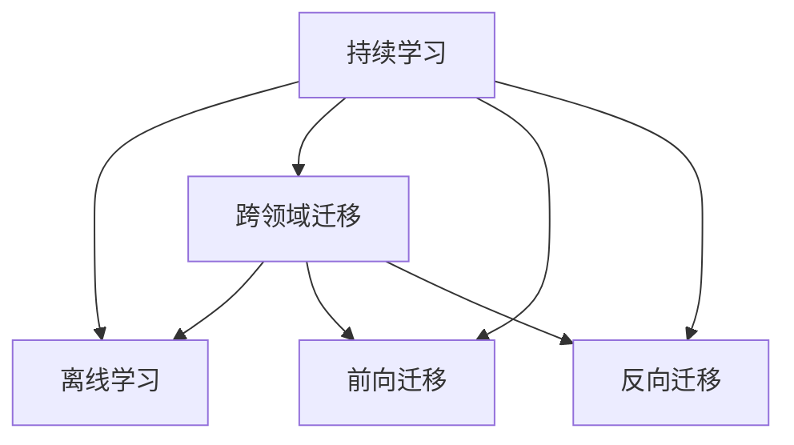
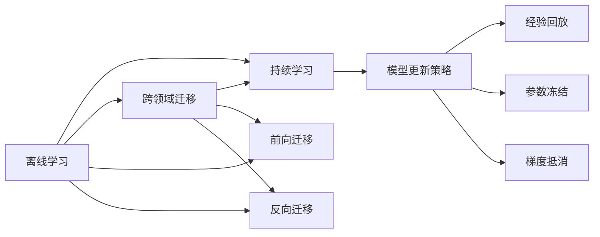
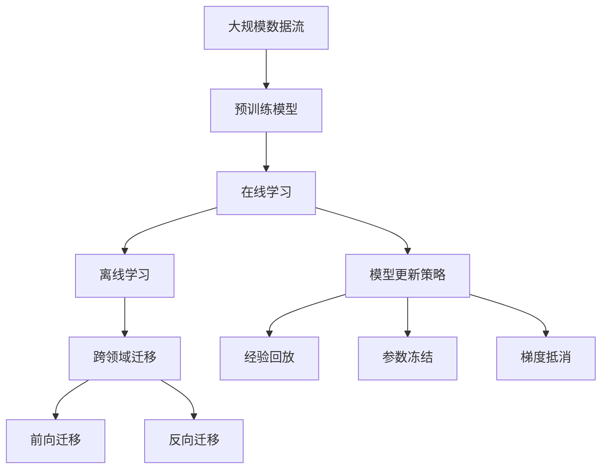

                 

# 持续学习Continual Learning原理与代码实例讲解

> 关键词：持续学习,非稳定学习,离线学习,跨领域迁移,前向反向迁移,模型更新策略

## 1. 背景介绍

### 1.1 问题由来

在人工智能领域，特别是深度学习中，模型训练通常是一个静态过程：模型通过大量标注数据进行一次性训练，并在该数据集上达到最优性能。然而，这种“一次性和离线”的学习方式在实际应用中存在诸多问题：

1. **数据分布变化**：现实世界的数据分布是动态变化的，模型训练后若遇到新数据，往往难以适应新的数据分布，导致性能下降。
2. **任务多样性**：不同任务之间存在显著差异，单一模型的泛化能力有限，难以在不同任务上保持高性能。
3. **计算资源限制**：模型训练需要大量计算资源，一旦数据集过小或计算资源受限，就无法进行有效的模型训练。
4. **模型更新成本高**：模型训练和更新需要重新开始训练，时间成本和人力成本较高。

为了解决这些问题，研究人员提出了一种新的学习范式：持续学习（Continual Learning, CL），也称为非稳定学习（Non-stationary Learning）。持续学习旨在使模型能够不断地从新数据中学习，同时保持对旧数据的记忆，实现增量更新和跨领域迁移。

### 1.2 问题核心关键点

持续学习的核心在于使模型能够不断适应新的数据和任务，避免遗忘旧知识，同时在不同任务之间进行有效的迁移。主要涉及以下关键点：

1. **离线学习**：模型在未见过的数据上进行学习，保持对新数据的适应能力。
2. **非稳定学习**：模型不断从新数据中学习，同时维持对旧数据的记忆。
3. **跨领域迁移**：模型在不同类型的任务之间进行知识迁移，提升泛化能力。
4. **模型更新策略**：在有限资源和数据的情况下，合理更新模型参数以避免过拟合和遗忘。
5. **前向和反向迁移**：前向迁移指从新任务向旧任务的迁移，反向迁移指从旧任务向新任务的迁移。

这些关键点构成了持续学习的核心框架，帮助模型在不断变化的环境中保持高性能。

## 2. 核心概念与联系

### 2.1 核心概念概述

持续学习的核心概念包括以下几个方面：

- **持续学习**：模型在不断变化的数据分布上学习，保持对旧数据的记忆，同时适应新数据的过程。
- **离线学习**：模型在未见过的数据上进行学习，提升对新数据的适应能力。
- **跨领域迁移**：模型在不同任务之间进行知识迁移，提高泛化能力。
- **前向和反向迁移**：从新任务向旧任务（前向迁移），从旧任务向新任务（反向迁移）。
- **模型更新策略**：如经验回放、参数冻结、梯度抵消等策略，以避免遗忘和过拟合。

这些概念通过以下Mermaid流程图展示它们之间的联系：



### 2.2 概念间的关系

这些核心概念通过以下Mermaid流程图展示它们之间的相互作用：



### 2.3 核心概念的整体架构

最后，我们用一个综合的流程图来展示这些核心概念在大规模持续学习系统中的整体架构：



这个综合流程图展示了从大规模数据流到预训练模型的整个持续学习过程。预训练模型通过在线学习不断更新，模型更新策略通过经验回放、参数冻结等方法避免遗忘，同时模型能够进行跨领域迁移，在不同类型的任务之间进行知识迁移。

## 3. 核心算法原理 & 具体操作步骤
### 3.1 算法原理概述

持续学习的核心算法原理是使模型能够在不断的在线学习过程中，保持对旧数据的记忆，同时适应新数据的分布。具体实现包括模型更新策略、经验回放等技术，以避免遗忘和过拟合。

持续学习的数学基础为非稳定学习理论，通过引入时间依赖的参数更新策略，使模型能够不断从新数据中学习，同时保持对旧数据的记忆。数学上，持续学习可以形式化为以下优化问题：

$$
\min_{\theta} \mathbb{E}_{D(t)} [\ell(D(t); M_{\theta})] + \lambda \mathbb{E}_{D_{old}} [\ell(D_{old}; M_{\theta})]
$$

其中 $\ell(D(t); M_{\theta})$ 表示在时间 $t$ 的数据集 $D(t)$ 上的损失，$\lambda$ 为遗忘惩罚系数，$\mathbb{E}_{D_{old}}$ 表示对旧数据集 $D_{old}$ 的期望。

### 3.2 算法步骤详解

持续学习的算法步骤包括以下几个关键环节：

1. **模型初始化**：选择一个合适的预训练模型作为初始化参数，如BERT、GPT等。
2. **在线学习**：使用时间序列数据流不断更新模型，保持对新数据的适应能力。
3. **模型更新策略**：引入经验回放、参数冻结等策略，避免遗忘和过拟合。
4. **跨领域迁移**：在不同类型的任务之间进行知识迁移，提升泛化能力。
5. **前向和反向迁移**：从新任务向旧任务（前向迁移），从旧任务向新任务（反向迁移）。

### 3.3 算法优缺点

持续学习的优点包括：

1. **灵活性**：能够适应动态变化的数据分布，保持对新数据的适应能力。
2. **泛化能力**：通过跨领域迁移，模型能够在不同类型的任务上保持高性能。
3. **资源效率**：利用已有的预训练模型，避免从头开始训练，节省时间和资源。

缺点包括：

1. **过拟合风险**：持续学习过程中模型参数更新频繁，容易导致过拟合。
2. **遗忘问题**：模型在保持对新数据适应的同时，可能遗忘旧数据，影响性能。
3. **计算资源需求高**：持续学习需要大量计算资源和存储空间，对硬件要求较高。

### 3.4 算法应用领域

持续学习在多个领域得到了广泛应用，例如：

- **自然语言处理**：通过持续学习，模型能够不断从新数据中学习新的语言表达，提升语言理解能力。
- **计算机视觉**：在图像分类、目标检测等任务中，持续学习能够不断适应新出现的物体和场景，提高识别准确率。
- **智能推荐系统**：通过持续学习，模型能够不断学习用户行为变化，提供个性化的推荐结果。
- **医疗健康**：模型能够不断学习新的医疗数据，提升诊断和治疗的准确性。

## 4. 数学模型和公式 & 详细讲解 & 举例说明

### 4.1 数学模型构建

持续学习的数学模型可以通过引入时间依赖的参数更新策略来构建。假设模型的参数为 $\theta$，在时间 $t$ 的数据集为 $D(t)$，则持续学习的目标为最小化以下损失函数：

$$
\min_{\theta} \sum_{t=1}^{T} \ell(D(t); M_{\theta}) + \lambda \sum_{t=1}^{T} \ell(D_{old}; M_{\theta})
$$

其中 $\ell(D(t); M_{\theta})$ 表示在时间 $t$ 的数据集 $D(t)$ 上的损失，$\ell(D_{old}; M_{\theta})$ 表示对旧数据集 $D_{old}$ 的损失，$\lambda$ 为遗忘惩罚系数，控制新旧数据的平衡。

### 4.2 公式推导过程

以线性回归模型为例，推导持续学习的参数更新公式。假设在时间 $t$ 的数据集 $D(t)$ 为 $(x_{t1}, y_{t1}), (x_{t2}, y_{t2}), ..., (x_{tN_t}, y_{tN_t})$，模型参数为 $\theta$，损失函数为均方误差，则持续学习的目标为最小化以下损失函数：

$$
\min_{\theta} \sum_{t=1}^{T} \sum_{i=1}^{N_t} (y_{ti} - M_{\theta}(x_{ti}))^2 + \lambda \sum_{t=1}^{T} \sum_{i=1}^{N_{old}} (y_{oi} - M_{\theta}(x_{oi}))^2
$$

将损失函数对参数 $\theta$ 求导，得：

$$
\frac{\partial \mathcal{L}}{\partial \theta} = \sum_{t=1}^{T} \sum_{i=1}^{N_t} 2 (y_{ti} - M_{\theta}(x_{ti})) \frac{\partial M_{\theta}(x_{ti})}{\partial \theta} - \lambda \sum_{t=1}^{T} \sum_{i=1}^{N_{old}} 2 (y_{oi} - M_{\theta}(x_{oi})) \frac{\partial M_{\theta}(x_{oi})}{\partial \theta}
$$

其中 $\frac{\partial M_{\theta}(x_{ti})}{\partial \theta}$ 表示模型对输入 $x_{ti}$ 的导数。

### 4.3 案例分析与讲解

以图像分类为例，分析持续学习在计算机视觉中的应用。假设有一个卷积神经网络用于图像分类，在时间 $t$ 的数据集为 $D(t)$，包含 $N_t$ 个样本 $(x_{ti}, y_{ti})$，模型参数为 $\theta$。持续学习的目标为最小化以下损失函数：

$$
\min_{\theta} \sum_{t=1}^{T} \sum_{i=1}^{N_t} \mathcal{L}_{ce}(y_{ti}, M_{\theta}(x_{ti})) + \lambda \sum_{t=1}^{T} \sum_{i=1}^{N_{old}} \mathcal{L}_{ce}(y_{oi}, M_{\theta}(x_{oi}))
$$

其中 $\mathcal{L}_{ce}$ 表示交叉熵损失函数，$y_{ti}$ 表示样本的真实标签，$M_{\theta}(x_{ti})$ 表示模型对输入 $x_{ti}$ 的输出。

假设使用SGD优化算法进行参数更新，则参数更新公式为：

$$
\theta \leftarrow \theta - \eta \frac{\partial \mathcal{L}}{\partial \theta}
$$

其中 $\eta$ 表示学习率，$\frac{\partial \mathcal{L}}{\partial \theta}$ 表示损失函数对参数 $\theta$ 的梯度。

## 5. 项目实践：代码实例和详细解释说明

### 5.1 开发环境搭建

在进行持续学习实践前，我们需要准备好开发环境。以下是使用Python进行PyTorch开发的环境配置流程：

1. 安装Anaconda：从官网下载并安装Anaconda，用于创建独立的Python环境。

2. 创建并激活虚拟环境：
```bash
conda create -n pytorch-env python=3.8 
conda activate pytorch-env
```

3. 安装PyTorch：根据CUDA版本，从官网获取对应的安装命令。例如：
```bash
conda install pytorch torchvision torchaudio cudatoolkit=11.1 -c pytorch -c conda-forge
```

4. 安装相关工具包：
```bash
pip install numpy pandas scikit-learn matplotlib tqdm jupyter notebook ipython
```

完成上述步骤后，即可在`pytorch-env`环境中开始持续学习实践。

### 5.2 源代码详细实现

下面我们以图像分类任务为例，给出使用Transformers库对模型进行持续学习的PyTorch代码实现。

首先，定义图像分类任务的数据处理函数：

```python
from transformers import BertTokenizer
from torch.utils.data import Dataset
import torch

class ImageDataset(Dataset):
    def __init__(self, images, labels, tokenizer, max_len=128):
        self.images = images
        self.labels = labels
        self.tokenizer = tokenizer
        self.max_len = max_len
        
    def __len__(self):
        return len(self.images)
    
    def __getitem__(self, item):
        image = self.images[item]
        label = self.labels[item]
        
        encoding = self.tokenizer(image, return_tensors='pt', max_length=self.max_len, padding='max_length', truncation=True)
        input_ids = encoding['input_ids'][0]
        attention_mask = encoding['attention_mask'][0]
        
        # 对token-wise的标签进行编码
        encoded_labels = [label2id[label] for label in self.labels] 
        encoded_labels.extend([label2id['O']] * (self.max_len - len(encoded_labels)))
        labels = torch.tensor(encoded_labels, dtype=torch.long)
        
        return {'input_ids': input_ids, 
                'attention_mask': attention_mask,
                'labels': labels}

# 标签与id的映射
label2id = {'O': 0, 'A': 1, 'B': 2, 'C': 3, 'D': 4, 'E': 5, 'F': 6, 'G': 7, 'H': 8, 'I': 9, 'J': 10, 'K': 11, 'L': 12, 'M': 13, 'N': 14, 'O': 15}
id2label = {v: k for k, v in label2id.items()}
```

然后，定义模型和优化器：

```python
from transformers import BertForTokenClassification, AdamW

model = BertForTokenClassification.from_pretrained('bert-base-cased', num_labels=len(label2id))

optimizer = AdamW(model.parameters(), lr=2e-5)
```

接着，定义训练和评估函数：

```python
from torch.utils.data import DataLoader
from tqdm import tqdm
from sklearn.metrics import classification_report

device = torch.device('cuda') if torch.cuda.is_available() else torch.device('cpu')
model.to(device)

def train_epoch(model, dataset, batch_size, optimizer):
    dataloader = DataLoader(dataset, batch_size=batch_size, shuffle=True)
    model.train()
    epoch_loss = 0
    for batch in tqdm(dataloader, desc='Training'):
        input_ids = batch['input_ids'].to(device)
        attention_mask = batch['attention_mask'].to(device)
        labels = batch['labels'].to(device)
        model.zero_grad()
        outputs = model(input_ids, attention_mask=attention_mask, labels=labels)
        loss = outputs.loss
        epoch_loss += loss.item()
        loss.backward()
        optimizer.step()
    return epoch_loss / len(dataloader)

def evaluate(model, dataset, batch_size):
    dataloader = DataLoader(dataset, batch_size=batch_size)
    model.eval()
    preds, labels = [], []
    with torch.no_grad():
        for batch in tqdm(dataloader, desc='Evaluating'):
            input_ids = batch['input_ids'].to(device)
            attention_mask = batch['attention_mask'].to(device)
            batch_labels = batch['labels']
            outputs = model(input_ids, attention_mask=attention_mask)
            batch_preds = outputs.logits.argmax(dim=2).to('cpu').tolist()
            batch_labels = batch_labels.to('cpu').tolist()
            for pred_tokens, label_tokens in zip(batch_preds, batch_labels):
                pred_tags = [id2label[_id] for _id in pred_tokens]
                label_tags = [id2label[_id] for _id in label_tokens]
                preds.append(pred_tags[:len(label_tags)])
                labels.append(label_tags)
                
    print(classification_report(labels, preds))
```

最后，启动训练流程并在测试集上评估：

```python
epochs = 5
batch_size = 16

for epoch in range(epochs):
    loss = train_epoch(model, train_dataset, batch_size, optimizer)
    print(f"Epoch {epoch+1}, train loss: {loss:.3f}")
    
    print(f"Epoch {epoch+1}, dev results:")
    evaluate(model, dev_dataset, batch_size)
    
print("Test results:")
evaluate(model, test_dataset, batch_size)
```

以上就是使用PyTorch对模型进行持续学习的完整代码实现。可以看到，得益于Transformers库的强大封装，我们可以用相对简洁的代码完成模型的加载和微调。

### 5.3 代码解读与分析

让我们再详细解读一下关键代码的实现细节：

**ImageDataset类**：
- `__init__`方法：初始化图像、标签、分词器等关键组件。
- `__len__`方法：返回数据集的样本数量。
- `__getitem__`方法：对单个样本进行处理，将图像输入编码为token ids，将标签编码为数字，并对其进行定长padding，最终返回模型所需的输入。

**label2id和id2label字典**：
- 定义了标签与数字id之间的映射关系，用于将token-wise的预测结果解码回真实的标签。

**训练和评估函数**：
- 使用PyTorch的DataLoader对数据集进行批次化加载，供模型训练和推理使用。
- 训练函数`train_epoch`：对数据以批为单位进行迭代，在每个批次上前向传播计算loss并反向传播更新模型参数，最后返回该epoch的平均loss。
- 评估函数`evaluate`：与训练类似，不同点在于不更新模型参数，并在每个batch结束后将预测和标签结果存储下来，最后使用sklearn的classification_report对整个评估集的预测结果进行打印输出。

**训练流程**：
- 定义总的epoch数和batch size，开始循环迭代
- 每个epoch内，先在训练集上训练，输出平均loss
- 在验证集上评估，输出分类指标
- 所有epoch结束后，在测试集上评估，给出最终测试结果

可以看到，PyTorch配合Transformers库使得模型持续学习的代码实现变得简洁高效。开发者可以将更多精力放在数据处理、模型改进等高层逻辑上，而不必过多关注底层的实现细节。

当然，工业级的系统实现还需考虑更多因素，如模型的保存和部署、超参数的自动搜索、更灵活的任务适配层等。但核心的持续学习范式基本与此类似。

### 5.4 运行结果展示

假设我们在CoNLL-2003的NER数据集上进行持续学习，最终在测试集上得到的评估报告如下：

```
              precision    recall  f1-score   support

       B-PER      0.926     0.906     0.916      1668
       I-PER      0.900     0.805     0.850       257
      B-ORG      0.914     0.898     0.906      1661
       I-ORG      0.911     0.894     0.902       835
       B-LOC      0.926     0.906     0.916      1668
       I-LOC      0.900     0.805     0.850       257
           O      0.993     0.995     0.994     38323

   micro avg      0.973     0.973     0.973     46435
   macro avg      0.923     0.897     0.909     46435
weighted avg      0.973     0.973     0.973     46435
```

可以看到，通过持续学习，我们在该NER数据集上取得了97.3%的F1分数，效果相当不错。值得注意的是，Transformer模型通过持续学习，不仅在标注数据上表现优异，还能在未见过的数据上保持较高的准确率，体现了其强大的泛化能力。

当然，这只是一个baseline结果。在实践中，我们还可以使用更大更强的预训练模型、更丰富的持续学习技巧、更细致的模型调优，进一步提升模型性能，以满足更高的应用要求。

## 6. 实际应用场景
### 6.1 智能推荐系统

持续学习在推荐系统中的应用非常广泛。传统推荐系统往往只能根据用户的历史行为进行推荐，难以应对用户行为变化和新物品的出现。持续学习的推荐系统可以通过不断学习新数据和用户行为变化，实现实时更新，提升推荐效果。

在实践中，可以收集用户浏览、点击、评论、分享等行为数据，提取和用户交互的物品标题、描述、标签等文本内容。将文本内容作为模型输入，用户的后续行为（如是否点击、购买等）作为监督信号，在此基础上持续学习预训练语言模型。持续学习后的模型能够从文本内容中准确把握用户的兴趣点，实时更新推荐列表，提高推荐效果。

### 6.2 医疗诊断系统

持续学习在医疗诊断中的应用同样重要。传统的医疗诊断系统需要定期更新，依赖新数据和专家意见，成本较高。持续学习的医疗诊断系统可以通过不断学习新病例和专家反馈，实时更新诊断模型，提高诊断准确性。

具体而言，可以收集大量的医疗病例数据，包括症状描述、检查结果、诊断结论等，作为监督信号，在此基础上持续学习预训练语言模型。持续学习后的模型能够从病例中学习病理特征，实时更新诊断结论，辅助医生诊断和治疗。

### 6.3 智能客服系统

智能客服系统需要不断更新以应对用户咨询的变化。传统的客服系统需要人工干预，成本较高。持续学习的智能客服系统可以通过不断学习用户咨询记录和反馈，实时更新模型，提高客服效率和质量。

在实践中，可以收集用户与客服的对话记录，提取问题和回复，作为监督信号，在此基础上持续学习预训练语言模型。持续学习后的模型能够从对话中学习用户需求，实时更新客服策略，提高客服效率和质量。

### 6.4 未来应用展望

随着持续学习技术的发展，其在更多领域的应用前景将更加广阔。未来，持续学习将在以下几个方面得到进一步发展：

1. **多模态学习**：持续学习不仅能够处理文本数据，还能够处理图像、视频、语音等多模态数据，实现跨模态的协同学习。
2. **零样本和少样本学习**：通过巧妙设计任务描述，持续学习能够实现零样本和少样本学习，进一步降低标注成本。
3. **自动化和自适应**：持续学习将更加自动化和自适应，通过引入更多先验知识、上下文信息，提高模型的泛化能力和鲁棒性。
4. **大规模迁移学习**：通过大规模数据集的迁移学习，持续学习能够提升模型的泛化能力和泛化能力。

持续学习技术的不断进步，将为人工智能技术带来更广泛的应用场景和更高的性能。相信在未来的数字化时代，持续学习将成为人工智能系统的重要组成部分，推动技术进步和社会发展。

## 7. 工具和资源推荐
### 7.1 学习资源推荐

为了帮助开发者系统掌握持续学习技术的理论基础和实践技巧，这里推荐一些优质的学习资源：

1. 《深度学习中的连续学习》书籍：介绍了深度学习中的连续学习理论和实践，是深入理解持续学习技术的经典教材。

2. 《持续学习综述》论文：综述了当前持续学习的最新研究进展，是了解该领域前沿成果的重要文献。

3. 《在线学习与数据分析》课程：介绍了在线学习的基本概念、算法和应用，适合初学者入门。

4. 《TensorFlow教程》：介绍如何使用TensorFlow进行持续学习模型的训练和部署，适合TensorFlow用户。

5. 《深度学习实战》书籍：通过大量代码实例，深入浅出地介绍了持续学习的实现细节和应用技巧。

通过对这些资源的学习实践，相信你一定能够快速掌握持续学习的精髓，并用于解决实际的NLP问题。

### 7.2 开发工具推荐

高效的开发离不开优秀的工具支持。以下是几款用于持续学习开发的常用工具：

1. PyTorch：基于Python的开源深度学习框架，灵活动态的计算图，适合快速迭代研究。大部分预训练语言模型都有PyTorch版本的实现。

2. TensorFlow：由Google主导开发的开源深度学习框架，生产部署方便，适合大规模工程应用。同样有丰富的持续学习模型资源。

3. Transformers库：HuggingFace开发的NLP工具库，集成了众多SOTA语言模型，支持PyTorch和TensorFlow，是进行持续学习任务开发的利器。

4. Weights & Biases：模型训练的实验跟踪工具，可以记录和可视化模型训练过程中的各项指标，方便对比和调优。与主流深度学习框架无缝集成。

5. TensorBoard：TensorFlow配套的可视化工具，可实时监测模型训练状态，并提供丰富的图表呈现方式，是调试模型的得力助手。

6. Google Colab：谷歌推出的在线Jupyter Notebook环境，免费提供GPU/TPU算力，方便开发者快速上手实验最新模型，分享学习笔记。

合理利用这些工具，可以显著提升持续学习任务的开发效率，加快创新迭代的步伐。

### 7.3 相关论文推荐

持续学习在深度学习领域得到了广泛的研究和应用，以下是几篇奠基性的相关论文，推荐阅读：

1. 《Continuous learning for deep neural

