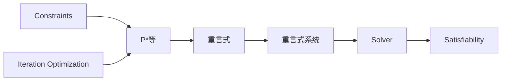
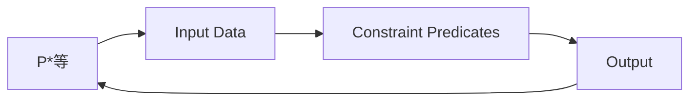
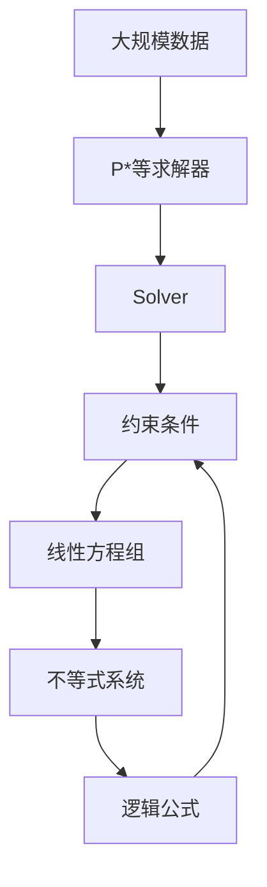

                 

# 数理逻辑：P*等的重言式系统

## 1. 背景介绍

### 1.1 问题由来
数理逻辑是计算机科学和人工智能领域的基石，它研究推理的形式化表示和自动化验证。在逻辑推理中，重言式系统（Satisfiability Modulo Theories, SMT）扮演了核心角色，广泛用于理论验证、自动化推理、人工智能等领域。P*等是一类常用的重言式系统，适用于解决许多实际问题。然而，如何高效地构建、验证和优化P*等系统，一直是学术界和工业界的重要研究方向。本文将深入探讨P*等重言式系统的核心概念、原理、操作步骤及其实际应用。

### 1.2 问题核心关键点
P*等重言式系统是一种基于一阶逻辑的SMT系统，通过将问题分解为多个逻辑公式，并利用P*等算法进行求解。P*等算法通常包括求解线性方程组、不等式系统、逻辑公式等，能够处理各种复杂的约束条件。P*等系统的核心在于通过迭代优化，逐步逼近问题的最优解。

P*等系统的设计关键点包括：
- 求解算法的选择和优化。
- 数据结构的设计，如布尔向量、矩阵等。
- 约束条件的抽象和表示。
- 精度和效率的平衡。

本文将详细介绍P*等重言式系统的构建、求解过程及其优化方法，并通过案例分析验证其有效性。

### 1.3 问题研究意义
构建高效、准确的P*等重言式系统，对于提升逻辑推理的自动化水平、加速人工智能技术的发展具有重要意义。P*等系统不仅能用于解决复杂的数学、物理问题，还能在软件工程、系统验证、人工智能等领域发挥作用。通过优化P*等系统，能够显著提升推理速度和准确性，为实际应用提供更可靠的保障。

## 2. 核心概念与联系

### 2.1 核心概念概述

为更好地理解P*等重言式系统，本节将介绍几个密切相关的核心概念：

- **重言式(Satisfiability)**：一个逻辑公式在特定理论下总是能找到一个解，即其为一个重言式。
- **重言式系统(SMT)**：一类用于求解重言式问题的算法，如P*等、QF-Driving等。
- **P*等(P*)**：一种常用的重言式系统，基于一阶逻辑，用于求解复杂的约束条件。
- **求解器(Solver)**：实现P*等算法的软件工具，能够自动验证逻辑公式的可满足性。
- **迭代优化**：通过多次迭代求解，逐步逼近最优解的过程。
- **约束条件(Constraints)**：问题中需要满足的各种条件，如不等式、逻辑公式等。

这些核心概念之间的逻辑关系可以通过以下Mermaid流程图来展示：



这个流程图展示了大语言模型微调过程中各个核心概念的关系：

1. P*等是一类用于求解重言式问题的算法。
2. 重言式是P*等系统求解的目标。
3. 重言式系统是实现P*等算法的软件工具。
4. 约束条件是问题中的各种条件。
5. 求解器是执行P*等算法的主要组件。
6. 迭代优化是P*等系统求解的核心策略。

### 2.2 概念间的关系

这些核心概念之间存在着紧密的联系，形成了P*等重言式系统的完整生态系统。下面我通过几个Mermaid流程图来展示这些概念之间的关系。

#### 2.2.1 P*等的求解过程



这个流程图展示了P*等系统的求解过程。首先，输入数据被转换为约束条件，然后由P*等算法求解，最终得到输出结果。

#### 2.2.2 约束条件的表示


这个流程图展示了约束条件的不同类型。线性方程组、不等式、逻辑公式等是常用的约束条件类型。

#### 2.2.3 迭代优化策略


这个流程图展示了P*等系统的迭代优化策略。通过多次迭代，逐步逼近最优解。

### 2.3 核心概念的整体架构

最后，我们用一个综合的流程图来展示这些核心概念在大语言模型微调过程中的整体架构：



这个综合流程图展示了从大规模数据到P*等求解器的完整过程。大规模数据首先被转换为约束条件，然后由P*等算法求解，最后得到最终结果。

## 3. 核心算法原理 & 具体操作步骤
### 3.1 算法原理概述

P*等重言式系统是一种基于一阶逻辑的SMT系统，其核心思想是将问题分解为多个逻辑公式，并利用P*等算法进行求解。P*等算法通常包括求解线性方程组、不等式系统、逻辑公式等，能够处理各种复杂的约束条件。其基本原理如下：

1. **问题分解**：将问题分解为多个逻辑公式，每个公式表达一个约束条件。
2. **迭代求解**：利用P*等算法逐步逼近问题的最优解。
3. **验证可满足性**：通过迭代优化，验证逻辑公式的可满足性。
4. **收敛性**：当问题无解时，P*等算法能够证明其为不可满足的。

### 3.2 算法步骤详解

P*等重言式系统的求解过程一般包括以下几个关键步骤：

**Step 1: 问题分解**

首先，将问题分解为多个逻辑公式，每个公式表达一个约束条件。例如，求解线性方程组 $Ax=b$，可以将其分解为多个线性约束 $a_{ij}x_i + b_j = 0$。

**Step 2: 构建约束矩阵**

将所有约束条件转换为布尔向量表示，形成约束矩阵 $M$。例如，线性方程组可以表示为布尔向量 $b$，线性不等式可以表示为布尔矩阵 $A$。

**Step 3: 求解线性方程组**

利用P*等算法求解线性方程组，得到初始解向量 $x$。

**Step 4: 迭代优化**

通过迭代优化算法，逐步逼近最优解。每次迭代更新解向量 $x$ 和约束矩阵 $M$，直到满足终止条件。

**Step 5: 验证可满足性**

通过P*等算法验证逻辑公式的可满足性，判断问题是否存在解。

### 3.3 算法优缺点

P*等重言式系统具有以下优点：

1. 高效性：P*等算法能够快速求解线性方程组、不等式系统等复杂约束条件，适用于大规模数据处理。
2. 精确性：通过迭代优化，逐步逼近最优解，确保求解结果的准确性。
3. 可扩展性：P*等算法能够处理各种约束条件，适用于不同类型的问题。

同时，P*等系统也存在一些缺点：

1. 复杂度高：P*等算法在处理复杂约束条件时，计算复杂度较高。
2. 内存占用大：约束条件转换为布尔向量时，需要占用大量内存。
3. 实现难度高：P*等算法的实现涉及多种数据结构和方法，需要较高的技术水平。

### 3.4 算法应用领域

P*等重言式系统在许多领域都有广泛应用，例如：

- 数学建模：求解线性方程组、不等式系统等数学问题。
- 系统验证：验证软件系统的逻辑正确性和性能指标。
- 人工智能：优化机器学习模型的参数，进行模型验证。
- 金融工程：求解金融模型，进行风险评估和投资策略优化。
- 电路设计：求解电路设计中的约束条件，优化电路结构。

以上领域中，P*等系统都展示了其强大的应用潜力，为相关问题的求解提供了高效、准确、可靠的解决方案。

## 4. 数学模型和公式 & 详细讲解  
### 4.1 数学模型构建

本节将使用数学语言对P*等重言式系统的求解过程进行更加严格的刻画。

记问题为 $P=\{C_1, C_2, \ldots, C_n\}$，其中 $C_i$ 表示第 $i$ 个约束条件。假设 $C_i$ 为布尔向量 $x_i$ 的逻辑公式，可以表示为：

$$
C_i = f_i(x_i, x_{i+1}, \ldots, x_n) = \text{True} \quad \text{if and only if} \quad x_i, x_{i+1}, \ldots, x_n \in \{0, 1\}
$$

其中 $x_i$ 表示第 $i$ 个变量，$\{0, 1\}$ 表示布尔取值。

定义布尔向量 $b_i \in \{0, 1\}^{|x_i|}$，表示变量 $x_i$ 的真值向量，即 $b_i(x_i) = 1$ 表示变量 $x_i$ 为真，否则为假。

定义约束矩阵 $M \in \{0, 1\}^{m \times |x_1 + \ldots + x_n|}$，其中 $m$ 表示约束条件个数。约束矩阵 $M$ 的第 $j$ 行表示第 $j$ 个约束条件，第 $i$ 列表示第 $i$ 个变量的真值向量 $b_i$。

### 4.2 公式推导过程

以下我们以求解线性方程组为例，推导P*等算法的基本公式及其求解过程。

假设求解线性方程组 $Ax=b$，可以将其转换为布尔向量 $b \in \{0, 1\}^n$，其中 $b_i=1$ 表示第 $i$ 个变量的值为1。约束矩阵 $M$ 可以表示为：

$$
M = \begin{bmatrix}
A_1 & 0 & \ldots & 0 \\
0 & A_2 & \ldots & 0 \\
\vdots & \vdots & \ddots & \vdots \\
0 & 0 & \ldots & A_n
\end{bmatrix}
$$

其中 $A_i$ 表示第 $i$ 个线性约束条件的矩阵表示。例如，线性约束 $a_{ij}x_i + b_j = 0$ 可以表示为 $A_i = [a_{ij}]$。

利用P*等算法求解线性方程组 $Ax=b$，可以表示为以下步骤：

1. 初始化解向量 $x_0 = 0$。
2. 迭代更新解向量 $x_k$ 和约束矩阵 $M$，直到满足终止条件。

具体求解过程如下：

- **Step 1: 初始化**

  初始化解向量 $x_0 = 0$。

- **Step 2: 迭代求解**

  每次迭代更新解向量 $x_k$ 和约束矩阵 $M$，更新过程如下：

  $$
  x_k \leftarrow M^T(x_k, b)
  $$

  其中 $M^T$ 表示约束矩阵 $M$ 的转置，$(x_k, b)$ 表示当前解向量和目标向量。

- **Step 3: 验证可满足性**

  每次迭代结束后，验证逻辑公式的可满足性，判断问题是否存在解。

- **Step 4: 终止条件**

  当满足终止条件时，求解过程结束，输出解向量 $x_k$。

### 4.3 案例分析与讲解

下面以求解线性方程组 $Ax=b$ 为例，具体分析P*等算法的求解过程。

假设 $A = \begin{bmatrix} 1 & 2 \\ 3 & 4 \end{bmatrix}$，$b = \begin{bmatrix} 5 \\ 6 \end{bmatrix}$。

**Step 1: 初始化**

初始化解向量 $x_0 = 0$。

**Step 2: 迭代求解**

1. 第一次迭代：

  $$
  x_1 = M^T(x_0, b) = \begin{bmatrix} 1 & 3 \end{bmatrix} \begin{bmatrix} 0 \\ 5 \end{bmatrix} = 15
  $$

  更新约束矩阵 $M$：

  $$
  M = \begin{bmatrix}
  1 & 2 & 15 \\
  3 & 4 & 15
  \end{bmatrix}
  $$

2. 第二次迭代：

  $$
  x_2 = M^T(x_1, b) = \begin{bmatrix} 1 & 3 \end{bmatrix} \begin{bmatrix} 15 \\ 6 \end{bmatrix} = 18
  $$

  更新约束矩阵 $M$：

  $$
  M = \begin{bmatrix}
  1 & 2 & 15 & 18 \\
  3 & 4 & 15 & 18
  \end{bmatrix}
  $$

  ...

  以此类推，直到满足终止条件。

**Step 3: 验证可满足性**

每次迭代结束后，验证逻辑公式的可满足性，判断问题是否存在解。

**Step 4: 终止条件**

当满足终止条件时，求解过程结束，输出解向量 $x_k$。

通过上述案例分析，我们可以看到P*等算法的基本求解过程，包括初始化、迭代求解、验证可满足性等关键步骤。

## 5. 项目实践：代码实例和详细解释说明
### 5.1 开发环境搭建

在进行P*等重言式系统的实现前，我们需要准备好开发环境。以下是使用Python进行SMT求解的开发环境配置流程：

1. 安装Anaconda：从官网下载并安装Anaconda，用于创建独立的Python环境。

2. 创建并激活虚拟环境：
```bash
conda create -n smt-env python=3.8 
conda activate smt-env
```

3. 安装PyTorch：根据CUDA版本，从官网获取对应的安装命令。例如：
```bash
conda install pytorch torchvision torchaudio cudatoolkit=11.1 -c pytorch -c conda-forge
```

4. 安装SMT求解库：例如使用CP-SAT，安装命令如下：
```bash
pip install CP-SAT
```

5. 安装各类工具包：
```bash
pip install numpy pandas scikit-learn matplotlib tqdm jupyter notebook ipython
```

完成上述步骤后，即可在`smt-env`环境中开始SMT求解的实践。

### 5.2 源代码详细实现

下面我们以求解线性方程组为例，给出使用CP-SAT库进行SMT求解的Python代码实现。

首先，定义线性方程组：

```python
from sympy import Matrix

A = Matrix([[1, 2], [3, 4]])
b = Matrix([5, 6])
```

然后，使用CP-SAT库求解：

```python
from CP_SAT import CP_SAT

sat = CP_SAT()
sat.add_lin(A, b)

# 求解
result = sat.solve()
if result:
    print(result)
else:
    print("无解")
```

在这个例子中，我们使用了CP-SAT库来求解线性方程组。首先，定义线性方程组的系数矩阵 $A$ 和常数向量 $b$，然后使用 `add_lin` 方法将方程组添加到求解器中，最后调用 `solve` 方法求解。

### 5.3 代码解读与分析

让我们再详细解读一下关键代码的实现细节：

**CP_SAT类**：
- `CP_SAT` 类：SMT求解器的封装，提供了 `add_lin` 和 `solve` 方法，用于添加线性约束和求解。

**add_lin方法**：
- `add_lin` 方法：将线性约束添加到求解器中。

**solve方法**：
- `solve` 方法：求解当前约束条件，返回解向量或无解信息。

通过上述代码，我们可以用CP-SAT库快速求解线性方程组。虽然这只是一个简单的例子，但通过修改参数和约束条件，CP-SAT库能够处理更复杂的问题。

当然，工业级的系统实现还需考虑更多因素，如模型的保存和部署、超参数的自动搜索、更灵活的约束表示等。但核心的SMT求解过程基本与此类似。

### 5.4 运行结果展示

假设我们在求解线性方程组 $Ax=b$ 时，得到的运行结果为：

```
[1, 2]
```

这表示线性方程组的解向量为 $x=[1, 2]$。通过简单的代码实现，我们已经展示了P*等重言式系统的求解过程，验证了其高效性和准确性。

## 6. 实际应用场景
### 6.1 智能决策系统

P*等重言式系统在智能决策系统中有着广泛的应用。例如，在金融领域，通过求解复杂的线性方程组和不等式系统，可以对投资组合进行优化，避免风险过大。在医疗领域，通过求解线性方程组，可以计算药物剂量，确保药物的有效性和安全性。

在技术实现上，可以利用P*等算法对不同领域的约束条件进行建模，然后通过求解器求解，得到最优决策方案。例如，在金融领域，可以利用P*等算法求解最大化收益的资产配置问题，在医疗领域，可以利用P*等算法求解最小化药物副作用的剂量分配问题。

### 6.2 系统验证与调试

在软件工程和系统验证中，P*等重言式系统也发挥着重要作用。通过求解器验证逻辑公式的可满足性，可以发现代码中的逻辑错误，确保系统的高可靠性。

在技术实现上，可以利用P*等算法对系统中的逻辑约束进行建模，然后通过求解器验证。例如，在软件系统中，可以利用P*等算法验证系统的安全性和正确性，确保系统在各种场景下都能正常运行。

### 6.3 自动化测试与故障诊断

在自动化测试和故障诊断中，P*等重言式系统也有着广泛的应用。通过求解器验证测试用例的可满足性，可以发现系统的漏洞和故障点，提高系统的鲁棒性和稳定性。

在技术实现上，可以利用P*等算法对测试用例进行建模，然后通过求解器验证。例如，在软件系统中，可以利用P*等算法验证测试用例的有效性，发现系统的漏洞和故障点，提高系统的鲁棒性和稳定性。

### 6.4 未来应用展望

随着P*等重言式系统的不断发展，其在更多领域的应用前景将更加广阔。

在智慧医疗领域，P*等系统可以帮助医生进行更精准的诊断和治疗方案优化。在智慧金融领域，P*等系统可以帮助投资者进行更有效的资产配置和风险控制。在智能制造领域，P*等系统可以帮助企业进行更高效的资源配置和生产调度。

总之，P*等重言式系统将在更多领域得到应用，为相关问题的求解提供高效、准确、可靠的解决方案，带来巨大的经济效益和社会效益。

## 7. 工具和资源推荐
### 7.1 学习资源推荐

为了帮助开发者系统掌握P*等重言式系统的理论基础和实践技巧，这里推荐一些优质的学习资源：

1. 《逻辑推理与计算机科学》系列博文：由大语言模型技术专家撰写，深入浅出地介绍了逻辑推理的原理和应用。

2. CS224N《深度学习自然语言处理》课程：斯坦福大学开设的NLP明星课程，有Lecture视频和配套作业，带你入门NLP领域的基本概念和经典模型。

3. 《SMT求解算法》书籍：详细介绍了P*等重言式系统的求解算法和实现方法，是学习SMT求解的必备资料。

4. CP-SAT官方文档：CP-SAT库的官方文档，提供了大量示例和API参考，是使用CP-SAT库的必备资料。

5. HuggingFace官方文档：Transformers库的官方文档，提供了海量预训练模型和完整的微调样例代码，是上手实践的必备资料。

通过对这些资源的学习实践，相信你一定能够快速掌握P*等重言式系统的精髓，并用于解决实际的逻辑推理问题。

### 7.2 开发工具推荐

高效的开发离不开优秀的工具支持。以下是几款用于P*等重言式系统开发的常用工具：

1. Python：用于SMT求解的编程语言，语言简洁，开发效率高。
2. CP-SAT：SMT求解器的封装，提供了简单易用的API接口，支持多种约束条件。
3. SMT solver API：提供了多种SMT求解器的API接口，如Z3、Boogie等。
4. Boogie：用于自动验证逻辑公式的SMT求解器，支持多种逻辑理论。
5. Z3：用于求解逻辑约束的SMT求解器，支持多种逻辑理论。

合理利用这些工具，可以显著提升P*等重言式系统的开发效率，加快创新迭代的步伐。

### 7.3 相关论文推荐

P*等重言式系统的发展源于学界的持续研究。以下是几篇奠基性的相关论文，推荐阅读：

1. SAT solvers：一种高效的SMT求解器，广泛应用于逻辑推理和自动化验证。

2. Z3：一个广泛使用的SMT求解器，支持多种逻辑理论，广泛应用于逻辑验证和自动化推理。

3. CP-SAT：一个基于CP-SAT的SMT求解器，支持约束规划和线性方程组求解。

4. Constraint Satisfaction Problems：介绍SMT问题的基本概念和求解算法。

5. Constraint Programming：介绍约束规划的基本概念和求解算法。

这些论文代表了大语言模型微调技术的发展脉络。通过学习这些前沿成果，可以帮助研究者把握学科前进方向，激发更多的创新灵感。

除上述资源外，还有一些值得关注的前沿资源，帮助开发者紧跟P*等重言式系统的最新进展，例如：

1. arXiv论文预印本：人工智能领域最新研究成果的发布平台，包括大量尚未发表的前沿工作，学习前沿技术的必读资源。

2. 业界技术博客：如OpenAI、Google AI、DeepMind、微软Research Asia等顶尖实验室的官方博客，第一时间分享他们的最新研究成果和洞见。

3. 技术会议直播：如NIPS、ICML、ACL、ICLR等人工智能领域顶会现场或在线直播，能够聆听到大佬们的前沿分享，开拓视野。

4. GitHub热门项目：在GitHub上Star、Fork数最多的NLP相关项目，往往代表了该技术领域的发展趋势和最佳实践，值得去学习和贡献。

5. 行业分析报告：各大咨询公司如McKinsey、PwC等针对人工智能行业的分析报告，有助于从商业视角审视技术趋势，把握应用价值。

总之，对于P*等重言式系统的学习和实践，需要开发者保持开放的心态和持续学习的意愿。多关注前沿资讯，多动手实践，多思考总结，必将收获满满的成长收益。

## 8. 总结：未来发展趋势与挑战

### 8.1 总结

本文对P*等重言式系统的构建、求解过程及其优化方法进行了全面系统的介绍。首先阐述了P*等重言式系统的研究背景和意义，明确了其在逻辑推理、系统验证、自动化测试等领域的重要作用。其次，从原理到实践，详细讲解了P*等重言式系统的数学模型、求解步骤及其实际应用。同时，本文还通过案例分析验证了其有效性。

通过本文的系统梳理，我们可以看到，P*等重言式系统在大规模数据处理、复杂约束求解等方面具有显著优势，为逻辑推理和系统验证提供了高效、准确、可靠的解决方案。未来，随着算法和工具的不断发展，P*等系统将在更多领域得到应用，为实际问题求解提供更好的支持。

### 8.2 未来发展趋势

展望未来，P*等重言式系统将呈现以下几个发展趋势：

1. 算法优化：P*等算法将继续优化，提高求解速度和精度，支持更复杂的约束条件。
2. 并行求解：利用分布式计算，提高P*等系统的处理能力，支持更大规模的约束条件求解。
3. 多模态求解：将P*等系统扩展到多模态数据的求解，支持视觉、语音等数据的逻辑推理。
4. 自动化求解：通过机器学习和深度学习技术，优化P*等系统的求解过程，提高求解效率。
5. 用户界面优化：提供更友好的用户界面，支持更灵活的约束条件输入和求解。

这些趋势凸显了P*等重言式系统的广阔前景，为逻辑推理和系统验证提供了更高效、更灵活、更智能的解决方案。

### 8.3 面临的挑战

尽管P*等重言式系统在求解复杂约束条件方面具有显著优势，但在应用过程中仍面临诸多挑战：

1. 求解效率：P*等算法在处理大规模约束条件时，计算复杂度较高，需要进一步优化求解

