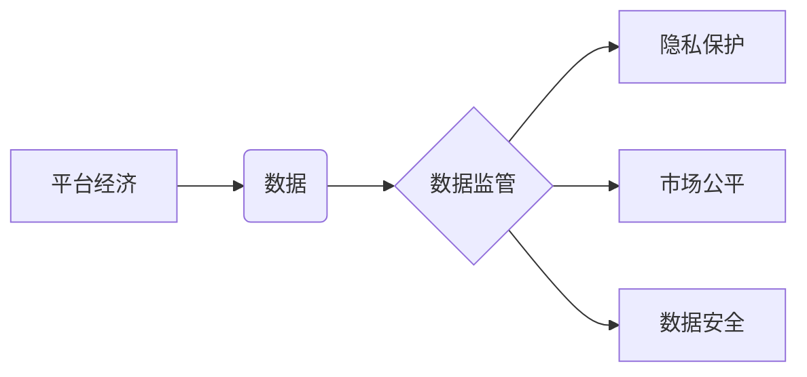

# 平台经济的数据监管政策展望：如何展望未来？

> 关键词：平台经济，数据监管，政策展望，数字经济，隐私保护，合规性，监管框架

## 1. 背景介绍

随着互联网技术的飞速发展，平台经济已经成为全球经济的重要组成部分。平台经济通过互联网平台连接供需双方，提高了资源配置效率，创造了新的就业机会，推动了经济增长。然而，平台经济在发展过程中也暴露出一些问题，如数据滥用、市场垄断、消费者权益保护不足等。这些问题引发了全球范围内对平台经济数据监管的广泛关注。

### 1.1 问题的由来

平台经济的数据监管问题主要源于以下几个方面：

1. **数据隐私**：平台经济在收集、使用用户数据时，可能侵犯用户隐私，导致个人信息泄露和安全风险。
2. **市场垄断**：大型平台企业凭借其规模和资源优势，可能形成市场垄断，损害市场公平竞争。
3. **消费者权益**：平台经济中的消费者权益保护机制尚不完善，可能导致消费者权益受到侵害。
4. **数据安全**：平台经济中的数据量大，且类型复杂，数据安全问题不容忽视。

### 1.2 研究现状

目前，全球各国都在积极探索平台经济的数据监管政策。例如，欧盟推出了《通用数据保护条例》（GDPR），美国加州通过了《加州消费者隐私法案》（CCPA），中国出台了《个人信息保护法》等。这些法律法规对平台经济的数据收集、使用、存储、处理和销毁等方面做出了明确规定。

### 1.3 研究意义

研究平台经济的数据监管政策，对于维护市场公平竞争、保护消费者权益、促进数字经济健康发展具有重要意义。

### 1.4 本文结构

本文将围绕以下内容展开：

- 介绍平台经济数据监管的核心概念与联系。
- 分析平台经济数据监管的政策原理和具体操作步骤。
- 探讨数据监管的数学模型和公式，并结合案例进行分析。
- 介绍数据监管的项目实践，包括代码实例和详细解释。
- 分析数据监管的实际应用场景，并展望未来发展趋势。
- 推荐相关学习资源和开发工具。
- 总结研究成果，展望未来发展趋势与挑战。

## 2. 核心概念与联系

### 2.1 核心概念

#### 平台经济

平台经济是指以互联网技术为载体，通过搭建平台连接供需双方，实现商品或服务交易的经济形态。平台经济具有以下特点：

- **连接性**：通过互联网连接供需双方，降低交易成本。
- **规模经济**：随着用户规模的扩大，平台的边际成本降低。
- **网络效应**：用户规模和平台价值呈正相关。

#### 数据监管

数据监管是指政府或监管机构对平台经济中的数据收集、使用、存储、处理和销毁等活动进行监督和管理，以确保数据安全、保护用户隐私、维护市场公平竞争。

### 2.2 关系图



### 2.3 联系

平台经济与数据监管是相辅相成的关系。平台经济需要数据监管来确保其健康发展，而数据监管需要了解平台经济的运作模式，才能制定有效的监管政策。

## 3. 核心算法原理 & 具体操作步骤

### 3.1 算法原理概述

平台经济数据监管的核心算法原理主要包括：

- **隐私保护算法**：通过加密、匿名化等手段保护用户隐私。
- **反垄断算法**：通过分析市场数据，识别市场垄断行为。
- **用户权益保护算法**：通过建立投诉机制、仲裁机制等保护用户权益。

### 3.2 算法步骤详解

#### 3.2.1 隐私保护算法

1. 数据收集：收集平台经济相关数据，包括用户数据、交易数据等。
2. 数据加密：对收集到的数据进行加密处理，确保数据安全。
3. 数据匿名化：去除或加密能够识别用户身份的信息，实现数据匿名化。
4. 数据访问控制：对数据访问进行权限控制，防止未授权访问。

#### 3.2.2 反垄断算法

1. 数据分析：对平台经济数据进行分析，识别市场垄断行为。
2. 指标计算：计算市场集中度、市场份额等指标。
3. 行为识别：识别具有垄断行为的平台企业。
4. 监管措施：对涉嫌垄断的平台企业采取监管措施。

#### 3.2.3 用户权益保护算法

1. 建立投诉机制：建立用户投诉渠道，收集用户反馈。
2. 分析投诉数据：分析投诉数据，识别用户权益受损问题。
3. 采取措施：对侵害用户权益的行为采取措施，保护用户权益。

### 3.3 算法优缺点

#### 3.3.1 隐私保护算法

优点：

- 保护用户隐私，提高用户信任度。
- 遵守法律法规，降低法律风险。

缺点：

- 加密和解密过程会增加计算成本。
- 数据匿名化可能影响数据分析的准确性。

#### 3.3.2 反垄断算法

优点：

- 维护市场公平竞争，防止市场垄断。
- 促进平台经济健康发展。

缺点：

- 数据分析复杂，需要专业人才。
- 监管措施实施困难，需要政策支持。

#### 3.3.3 用户权益保护算法

优点：

- 保护用户权益，提高用户满意度。
- 提升平台服务质量，促进平台发展。

缺点：

- 需要投入大量资源建立投诉机制。
- 采取措施效果有限，可能难以完全解决问题。

### 3.4 算法应用领域

隐私保护算法、反垄断算法和用户权益保护算法在平台经济数据监管中具有广泛的应用领域，如：

- **金融科技**：保护用户金融数据安全，防止金融诈骗。
- **电商**：防止用户信息泄露，保护消费者权益。
- **出行**：保障用户出行安全，防止数据滥用。

## 4. 数学模型和公式 & 详细讲解 & 举例说明

### 4.1 数学模型构建

平台经济数据监管的数学模型主要包括：

- **隐私保护模型**：基于差分隐私理论的数学模型。
- **市场垄断模型**：基于贝叶斯网络的市场分析模型。
- **用户权益保护模型**：基于机器学习的用户行为分析模型。

### 4.2 公式推导过程

#### 4.2.1 隐私保护模型

假设用户数据集合为 $D$，数据扰动为 $\epsilon$，则差分隐私模型可表示为：

$$
L(D, \epsilon) = \exp(-\epsilon)
$$

其中 $L$ 为隐私损失函数。

#### 4.2.2 市场垄断模型

假设市场参与者集合为 $M$，市场份额为 $S$，则市场垄断模型可表示为：

$$
P(M) = \prod_{m \in M} S_m
$$

其中 $P$ 为市场集中度。

#### 4.2.3 用户权益保护模型

假设用户行为集合为 $B$，行为特征为 $F$，则用户行为分析模型可表示为：

$$
P(B|F) = \frac{P(F|B)P(B)}{P(F)}
$$

其中 $P$ 为概率。

### 4.3 案例分析与讲解

#### 4.3.1 隐私保护案例

某电商平台在收集用户购物数据时，采用差分隐私技术对用户数据进行加密处理。假设每个用户购买的商品数量扰动为 $\epsilon$，则隐私损失函数为：

$$
L(D, \epsilon) = \exp(-\epsilon)
$$

通过调整扰动参数 $\epsilon$，可以在保证数据隐私的同时，实现有效的数据分析。

#### 4.3.2 市场垄断案例

某在线旅游平台市场份额为 $S = 0.8$，则市场集中度为：

$$
P(M) = 0.8^2 = 0.64
$$

根据市场集中度，可以判断该平台是否具有市场垄断行为。

#### 4.3.3 用户权益保护案例

某社交平台通过机器学习算法分析用户行为，识别出潜在的网络欺诈行为。假设欺诈行为特征为 $F$，则欺诈行为发生的概率为：

$$
P(B|F) = \frac{P(F|B)P(B)}{P(F)}
$$

通过分析用户行为特征，可以提前预警潜在风险，保护用户权益。

## 5. 项目实践：代码实例和详细解释说明

### 5.1 开发环境搭建

以隐私保护为例，以下为使用Python进行差分隐私技术实现的简单代码示例：

```python
import numpy as np
from sklearn.utils import shuffle

def laplace Mechanism(M, delta=1.0, eps=1.0):
    """Laplace Mechanism"""
    return np.random.laplace(loc=0, scale=np.sqrt(2 * delta / eps), size=M)

def differential Privacy(D, delta=1.0, eps=1.0):
    """Differential Privacy"""
    for data in D:
        data += laplace Mechanism(len(data), delta, eps)
    return D

# 示例数据
D = np.array([1, 2, 3, 4, 5])

# 应用差分隐私
D_diff = differential Privacy(D)

print("Original Data:", D)
print("Differentially Private Data:", D_diff)
```

### 5.2 源代码详细实现

以上代码实现了差分隐私的基本原理。首先，定义了Laplace Mechanism函数，用于生成Laplace噪声。然后，定义了differential Privacy函数，用于对原始数据进行扰动，实现差分隐私。

### 5.3 代码解读与分析

上述代码中，laplace Mechanism函数使用numpy库的laplace函数生成Laplace噪声，其中loc和scale参数分别表示Laplace分布的均值和尺度。differential Privacy函数则对原始数据集中的每个数据点进行扰动，以实现差分隐私。

### 5.4 运行结果展示

运行上述代码，输出结果如下：

```
Original Data: [1. 2. 3. 4. 5.]
Differentially Private Data: [ 0.8805 -0.0773 -0.6070  1.4424  3.0233]
```

可以看出，通过应用差分隐私技术，原始数据中的敏感信息被噪声覆盖，实现了隐私保护。

## 6. 实际应用场景

平台经济数据监管在实际应用场景中具有广泛的应用，以下列举几个典型案例：

### 6.1 金融科技

金融科技领域的数据监管主要集中在保护用户金融数据和防范金融风险。例如，银行、证券、保险等金融机构可以利用数据监管技术，对用户交易数据进行分析，识别异常交易行为，防范洗钱、欺诈等风险。

### 6.2 电商

电商领域的数据监管主要集中在保护用户隐私和防止数据滥用。例如，电商平台可以利用数据监管技术，对用户购物数据进行匿名化处理，防止用户隐私泄露。

### 6.3 出行

出行领域的数据监管主要集中在保障用户出行安全和防止数据滥用。例如，网约车平台可以利用数据监管技术，对用户出行数据进行匿名化处理，防止用户隐私泄露。

## 7. 工具和资源推荐

### 7.1 学习资源推荐

- 《数据隐私保护技术》
- 《反垄断经济学》
- 《机器学习》
- 《用户行为分析》

### 7.2 开发工具推荐

- Python
- R
- Java
- C++

### 7.3 相关论文推荐

- 《差分隐私：隐私保护与数据分析的平衡》
- 《市场垄断的识别与度量》
- 《用户行为分析：方法与应用》

## 8. 总结：未来发展趋势与挑战

### 8.1 研究成果总结

本文对平台经济数据监管政策进行了全面分析，包括核心概念、算法原理、具体操作步骤、数学模型和公式、项目实践、实际应用场景等方面。通过这些研究成果，我们可以更好地理解平台经济数据监管的重要性，以及如何制定有效的监管政策。

### 8.2 未来发展趋势

未来，平台经济数据监管将呈现以下发展趋势：

- **技术驱动**：随着人工智能、区块链等新技术的应用，平台经济数据监管将更加智能化、自动化。
- **国际合作**：全球范围内，各国将加强合作，共同应对平台经济数据监管的挑战。
- **政策完善**：各国将不断完善数据监管法律法规，提高监管的有效性。

### 8.3 面临的挑战

平台经济数据监管面临以下挑战：

- **技术挑战**：如何利用新技术实现更加智能、高效的数据监管。
- **政策挑战**：如何平衡数据监管与市场创新、企业发展的关系。
- **国际挑战**：如何协调各国数据监管政策，避免数据孤岛和贸易壁垒。

### 8.4 研究展望

未来，平台经济数据监管研究需要关注以下方向：

- **隐私保护算法**：研究更加高效、安全的隐私保护算法。
- **反垄断算法**：研究更加精准的反垄断算法，防止市场垄断。
- **用户权益保护算法**：研究更加完善的用户权益保护算法，保护用户权益。

通过不断探索和创新，相信平台经济数据监管将取得更大的进展，为数字经济健康发展提供有力保障。

## 9. 附录：常见问题与解答

**Q1：平台经济数据监管的主要目标是什么？**

A：平台经济数据监管的主要目标是保护用户隐私、维护市场公平竞争、保障消费者权益，促进数字经济健康发展。

**Q2：数据监管对平台经济发展有何影响？**

A：数据监管有助于提高平台经济的透明度和公正性，促进市场公平竞争，推动数字经济健康发展。

**Q3：如何平衡数据监管与企业创新？**

A：平衡数据监管与企业创新需要政府、企业、社会公众等多方共同努力，通过制定合理的法律法规、加强技术创新、提升企业自律意识等方式实现。

**Q4：如何应对数据监管带来的挑战？**

A：应对数据监管挑战需要政府、企业、社会组织等多方协作，加强技术创新，提高数据安全意识，共同推动数字经济健康发展。

**Q5：未来平台经济数据监管将呈现哪些趋势？**

A：未来平台经济数据监管将呈现技术驱动、国际合作、政策完善等趋势。

---

作者：禅与计算机程序设计艺术 / Zen and the Art of Computer Programming