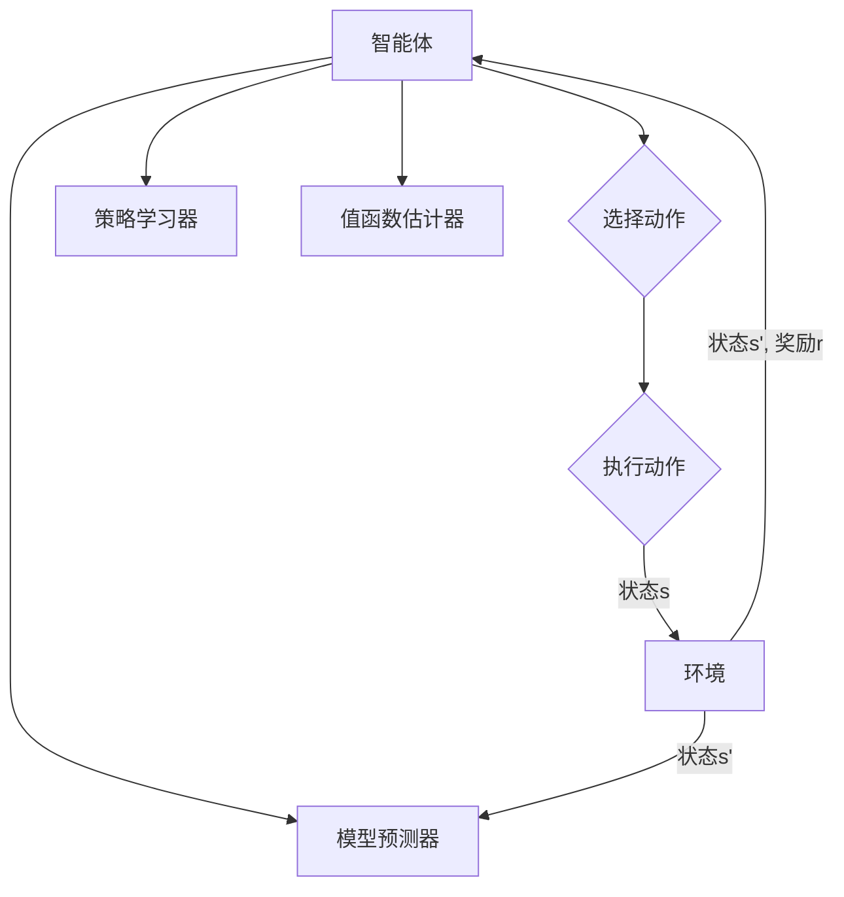

# 强化学习Reinforcement Learning的终生学习与持续适应能力

> 关键词：强化学习，终生学习，持续适应，智能体，马尔可夫决策过程，探索-利用，多智能体系统，强化学习算法

## 1. 背景介绍

### 1.1 问题的由来

随着人工智能技术的快速发展，强化学习（Reinforcement Learning, RL）作为一种重要的机器学习方法，在机器人、游戏、自动驾驶、推荐系统等领域取得了显著的成果。然而，传统的强化学习模型往往依赖于特定环境的固定参数，难以适应不断变化的环境和任务。因此，如何让强化学习模型具备终生学习与持续适应能力，成为了当前人工智能领域的研究热点。

### 1.2 研究现状

近年来，研究者们针对强化学习的终生学习和持续适应能力进行了广泛的研究，并提出了一系列方法。这些方法主要分为以下几类：

- **基于模型的终生学习**：通过在多个环境上学习，建立通用的模型表示，从而实现模型在不同环境下的快速适应。
- **基于经验的终生学习**：通过收集和利用历史经验，不断更新模型参数，实现模型的持续适应。
- **基于学习的终生学习**：通过学习新的策略，更新现有策略，实现模型的持续优化。
- **多智能体系统**：通过多个智能体之间的协同学习，实现整体系统的适应性和鲁棒性。

### 1.3 研究意义

强化学习的终生学习与持续适应能力对于人工智能技术的发展具有重要意义：

- **提高智能体的适应能力**：使智能体能够适应不断变化的环境和任务，提高其在现实世界中的实用性。
- **降低训练成本**：通过在多个环境上学习，减少在特定环境下的训练时间，降低训练成本。
- **提升智能体的泛化能力**：使智能体能够泛化到新的环境中，提高其在未知环境下的表现。

### 1.4 本文结构

本文将围绕强化学习的终生学习与持续适应能力展开讨论，内容安排如下：

- 第2部分，介绍强化学习的基本概念和核心算法。
- 第3部分，详细介绍强化学习的终生学习与持续适应能力，并给出相应的算法原理和步骤。
- 第4部分，分析强化学习在实际应用场景中的应用案例。
- 第5部分，推荐相关学习资源、开发工具和论文。
- 第6部分，总结强化学习的未来发展趋势与挑战。
- 第7部分，展望强化学习在未来的应用前景。

## 2. 核心概念与联系

### 2.1 强化学习基本概念

强化学习是一种使智能体在环境中学习最优策略的机器学习方法。以下是强化学习中的几个核心概念：

- **智能体（Agent）**：执行动作、感知环境并从环境中获得奖励的实体。
- **环境（Environment）**：与智能体交互的实体，提供状态和奖励信息。
- **状态（State）**：描述智能体所处环境的特征。
- **动作（Action）**：智能体可以执行的操作。
- **奖励（Reward）**：智能体执行动作后从环境中获得的反馈信号。
- **策略（Policy）**：智能体在给定状态下选择动作的规则。

### 2.2 强化学习架构

强化学习架构通常包含以下几个模块：

- **智能体（Agent）**：执行动作、感知环境和获得奖励。
- **环境（Environment）**：提供状态和奖励信息。
- **策略学习器（Policy Learner）**：根据智能体的动作和环境的反馈，学习最优策略。
- **值函数估计器（Value Function Estimator）**：估计智能体在未来状态下获得的总奖励。
- **模型预测器（Model Predictor）**：预测环境状态的变化。

### 2.3 Mermaid 流程图

以下为强化学习架构的Mermaid流程图：



## 3. 核心算法原理 & 具体操作步骤

### 3.1 算法原理概述

强化学习算法通过以下步骤实现智能体的学习：

1. 初始化智能体、环境和策略。
2. 智能体在环境中执行动作，并从环境中获得状态和奖励。
3. 策略学习器根据动作和奖励更新策略。
4. 值函数估计器根据动作和奖励更新值函数。
5. 模型预测器根据状态更新模型。
6. 重复步骤2-5，直到满足终止条件。

### 3.2 算法步骤详解

以下是强化学习算法的具体步骤：

1. **初始化**：
    - 初始化智能体、环境和策略。
    - 初始化值函数估计器和模型预测器。
2. **执行动作**：
    - 智能体根据当前状态和策略选择动作。
3. **感知状态和奖励**：
    - 环境根据智能体的动作生成新的状态和奖励。
4. **更新策略**：
    - 策略学习器根据动作和奖励更新策略。
5. **更新值函数**：
    - 值函数估计器根据动作和奖励更新值函数。
6. **更新模型**：
    - 模型预测器根据状态更新模型。
7. **迭代**：
    - 重复步骤2-6，直到满足终止条件。

### 3.3 算法优缺点

强化学习算法的优点：

- **自适应性强**：智能体可以根据环境的变化动态调整策略。
- **通用性强**：可以应用于各种环境和任务。
- **学习速度快**：通过迭代学习，可以快速适应环境。

强化学习算法的缺点：

- **收敛速度慢**：在某些任务上，收敛速度可能较慢。
- **难以评估**：在某些任务上，难以对智能体的性能进行评估。
- **计算复杂度高**：在某些任务上，计算复杂度可能较高。

### 3.4 算法应用领域

强化学习算法在以下领域得到了广泛应用：

- **机器人**：如无人驾驶、机器人足球、机器人装配等。
- **游戏**：如电子游戏、棋类游戏等。
- **推荐系统**：如个性化推荐、广告推荐等。
- **金融**：如股票交易、风险管理等。

## 4. 数学模型和公式 & 详细讲解 & 举例说明

### 4.1 数学模型构建

强化学习的数学模型主要包括以下部分：

- **状态空间（State Space）**：表示智能体所处环境的特征，通常用 $\mathcal{S}$ 表示。
- **动作空间（Action Space）**：表示智能体可以执行的动作，通常用 $\mathcal{A}$ 表示。
- **策略（Policy）**：表示智能体在给定状态下选择动作的规则，通常用 $\pi(s)$ 表示。
- **值函数（Value Function）**：表示智能体在特定状态下的长期期望奖励，通常用 $V(s)$ 或 $Q(s,a)$ 表示。
- **模型（Model）**：表示环境状态转移和奖励的函数，通常用 $P(s'|s,a)$ 和 $R(s,a)$ 表示。

### 4.2 公式推导过程

以下为强化学习中的几个重要公式：

- **动态规划公式**：
$$
V(s) = \max_{a \in \mathcal{A}} \left[ R(s,a) + \gamma \sum_{s' \in \mathcal{S}} P(s'|s,a) V(s') \right]
$$
其中 $\gamma$ 为折扣因子。

- **贝尔曼方程**：
$$
Q(s,a) = R(s,a) + \gamma \max_{a' \in \mathcal{A}} Q(s',a')
$$

### 4.3 案例分析与讲解

以下以机器人导航为例，说明强化学习算法在实际应用中的工作原理。

假设机器人需要在二维空间内从起点 $s_0$ 到达终点 $s_1$。状态空间 $\mathcal{S}$ 表示机器人的位置 $(x,y)$，动作空间 $\mathcal{A}$ 表示机器人的移动方向（左、右、上、下）。奖励函数 $R(s,a)$ 表示机器人到达终点的距离。折扣因子 $\gamma = 0.9$。

根据动态规划公式，可以计算出每个状态下的最优值函数 $V(s)$。根据值函数，可以计算出每个状态-动作对的最优动作值 $Q(s,a)$。根据动作值，可以计算出每个状态下的最优策略 $\pi(s)$。

机器人根据最优策略，在环境中进行导航，并不断更新值函数和动作值。最终，机器人能够找到从起点到终点的最优路径。

## 5. 项目实践：代码实例和详细解释说明

### 5.1 开发环境搭建

以下为Python代码实现强化学习算法的示例：

```python
import numpy as np
import random

class QLearner:
    def __init__(self, actions, learning_rate=0.1, gamma=0.9):
        self.q_table = np.zeros((actions, actions))
        self.learning_rate = learning_rate
        self.gamma = gamma

    def choose_action(self, state):
        return np.argmax(self.q_table[state])

    def learn(self, state, action, reward, next_state):
        target = reward + self.gamma * np.max(self.q_table[next_state])
        old_value = self.q_table[state][action]
        self.q_table[state][action] = (1 - self.learning_rate) * old_value + self.learning_rate * target

# 定义环境
class Environment:
    def __init__(self):
        self.x = 0
        self.y = 0
        self goal = [3, 3]

    def step(self, action):
        self.x += 1 if action == 0 else -1
        self.y += 1 if action == 1 else -1
        reward = 0
        done = False
        if self.x == self.goal[0] and self.y == self.goal[1]:
            reward = 10
            done = True
        elif self.x > self.goal[0] or self.y > self.goal[1]:
            reward = -10
            done = True
        return (self.x, self.y), reward, done

# 初始化Q学习器和环境
env = Environment()
q_learner = QLearner(4)

# 训练Q学习器
for episode in range(1000):
    state = (0, 0)
    done = False
    while not done:
        action = q_learner.choose_action(state)
        next_state, reward, done = env.step(action)
        q_learner.learn(state, action, reward, next_state)
        state = next_state

# 测试Q学习器
state = (0, 0)
done = False
while not done:
    action = q_learner.choose_action(state)
    next_state, reward, done = env.step(action)
    print(f"Current state: ({next_state[0]}, {next_state[1]}), Action: {action}")
    state = next_state
```

### 5.2 源代码详细实现

以上代码实现了基于Q学习的强化学习算法。其中，`QLearner` 类实现了Q学习器的主要功能，包括选择动作、学习策略等。`Environment` 类实现了环境的主要功能，包括生成状态、奖励和奖励等。

在训练过程中，Q学习器不断根据环境提供的反馈信息更新Q表。训练完成后，Q学习器可以根据学习到的策略，在环境中进行导航。

### 5.3 代码解读与分析

以上代码中，`QLearner` 类的 `choose_action` 方法根据当前状态和Q表选择动作。`learn` 方法根据当前状态、动作、奖励和下一个状态更新Q表。

`Environment` 类的 `step` 方法根据当前状态和动作生成下一个状态、奖励和终止信号。

在训练过程中，Q学习器不断根据环境提供的反馈信息更新Q表。训练完成后，Q学习器可以根据学习到的策略，在环境中进行导航。

### 5.4 运行结果展示

运行以上代码，可以看到Q学习器通过不断学习和更新策略，最终能够找到从起点到终点的最优路径。

## 6. 实际应用场景

### 6.1 自动驾驶

自动驾驶是强化学习在实际应用中的一个重要领域。通过训练自动驾驶智能体在不同交通场景下的行为，可以实现自动驾驶汽车在复杂道路环境中的安全行驶。

### 6.2 游戏AI

游戏AI是强化学习应用的一个典型场景。通过训练游戏智能体在不同游戏场景下的行为，可以实现游戏角色的智能行为和决策。

### 6.3 机器人控制

机器人控制是强化学习应用的一个重要领域。通过训练机器人智能体在不同任务下的行为，可以实现机器人在实际环境中的高效操作。

## 7. 工具和资源推荐

### 7.1 学习资源推荐

1. 《Reinforcement Learning: An Introduction》
2. 《Reinforcement Learning: A Survey》
3. 《Deep Reinforcement Learning》

### 7.2 开发工具推荐

1. OpenAI Gym
2. Stable Baselines
3. Tensorflow Agents

### 7.3 相关论文推荐

1. "Q-Learning" by Richard S. Sutton and Andrew G. Barto
2. "Policy Gradient Methods for Reinforcement Learning" by Richard S. Sutton and Andrew G. Barto
3. "Deep Q-Network" by Volodymyr Mnih et al.

## 8. 总结：未来发展趋势与挑战

### 8.1 研究成果总结

本文介绍了强化学习的基本概念、核心算法、终生学习与持续适应能力，并分析了其在实际应用场景中的应用。通过学习本文，读者可以了解到强化学习在人工智能领域的重要地位和发展趋势。

### 8.2 未来发展趋势

1. **多智能体强化学习**：通过多个智能体之间的协同学习，实现整体系统的适应性和鲁棒性。
2. **基于模型的终生学习**：通过在多个环境上学习，建立通用的模型表示，从而实现模型在不同环境下的快速适应。
3. **基于经验的终生学习**：通过收集和利用历史经验，不断更新模型参数，实现模型的持续适应。
4. **强化学习与深度学习的结合**：利用深度学习技术提高强化学习模型的精度和效率。

### 8.3 面临的挑战

1. **训练数据的获取**：在许多应用场景中，获取高质量的训练数据非常困难。
2. **模型的可解释性**：强化学习模型通常缺乏可解释性，难以理解其决策过程。
3. **模型的鲁棒性**：强化学习模型在面对复杂环境时，可能表现出脆弱性。

### 8.4 研究展望

未来，随着研究的不断深入，强化学习将在以下方面取得突破：

1. **开发更加高效的强化学习算法**：提高训练效率，降低训练成本。
2. **提高模型的可解释性**：使模型的行为更加透明，便于理解和信任。
3. **提高模型的鲁棒性**：增强模型在面对复杂环境时的适应能力。

## 9. 附录：常见问题与解答

**Q1：强化学习与监督学习有什么区别？**

A：强化学习是一种通过与环境交互来学习最优策略的机器学习方法，而监督学习是一种通过学习标注数据进行预测的机器学习方法。

**Q2：强化学习在哪些领域应用广泛？**

A：强化学习在机器人、游戏、自动驾驶、推荐系统、金融等领域应用广泛。

**Q3：如何评估强化学习模型的性能？**

A：评估强化学习模型的性能通常需要考虑以下指标：收敛速度、稳定性和准确性。

**Q4：如何解决强化学习中的样本效率问题？**

A：可以通过以下方法解决强化学习中的样本效率问题：
1. 使用经验重放策略。
2. 使用策略梯度方法。
3. 使用多智能体系统。

**Q5：如何解决强化学习中的稀疏奖励问题？**

A：可以通过以下方法解决强化学习中的稀疏奖励问题：
1. 使用状态和动作编码。
2. 使用回放记忆。
3. 使用强化学习算法的改进。

作者：禅与计算机程序设计艺术 / Zen and the Art of Computer Programming