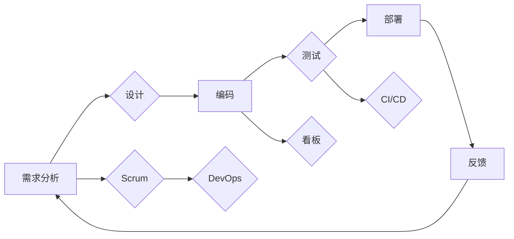

# 敏捷开发与快速迭代原理与代码实战案例讲解

> 关键词：敏捷开发，快速迭代，Scrum，看板，持续集成，持续部署，DevOps，代码质量，敏捷工具，实践案例

## 1. 背景介绍

在快速变化和竞争激烈的软件行业，传统的瀑布式开发模式已经无法满足日益增长的需求。敏捷开发（Agile）应运而生，它强调快速迭代、持续交付和团队协作，旨在提高软件开发的效率和质量。本文将深入探讨敏捷开发与快速迭代的原理，并通过实际代码实战案例讲解如何在实际项目中应用这些原理。

### 1.1 问题的由来

传统的瀑布式开发模式将软件开发过程划分为需求分析、设计、编码、测试、部署等阶段，各阶段之间线性进行，缺乏灵活性。这种模式在面对需求变化时，往往导致项目延期、成本超支和客户满意度下降。

### 1.2 研究现状

敏捷开发作为一种应对快速变化的软件开发方法，近年来得到了广泛应用。Scrum、Kanban等敏捷框架为敏捷开发提供了具体实践方法。DevOps的兴起则将开发、运维、安全等环节紧密结合，进一步加速了软件的快速迭代和交付。

### 1.3 研究意义

研究敏捷开发与快速迭代的原理，有助于：
- 提高软件开发效率和质量
- 增强团队协作和沟通
- 灵活应对需求变化
- 实现快速交付和持续改进

### 1.4 本文结构

本文将分为以下几个部分：
- 核心概念与联系
- 核心算法原理与具体操作步骤
- 数学模型和公式
- 项目实践：代码实例和详细解释说明
- 实际应用场景
- 工具和资源推荐
- 总结：未来发展趋势与挑战
- 附录：常见问题与解答

## 2. 核心概念与联系

### 2.1 核心概念

- **敏捷开发**：一种以人为核心、迭代、灵活应对变化的软件开发方法。
- **快速迭代**：在短时间内快速完成软件功能迭代，以适应需求变化。
- **Scrum**：最流行的敏捷开发框架之一，强调迭代、反馈和协作。
- **看板**：一种可视化工具，用于管理敏捷开发过程中的任务流程。
- **持续集成（CI）**：将代码更改自动集成到主代码库中，并运行自动化测试。
- **持续部署（CD）**：将代码自动部署到生产环境中。
- **DevOps**：一种文化和实践，将开发和运维团队紧密结合，实现快速迭代和交付。

### 2.2 核心概念原理和架构的 Mermaid 流程图



## 3. 核心算法原理 & 具体操作步骤

### 3.1 算法原理概述

敏捷开发的核心在于迭代和持续交付。以下是一个基于Scrum框架的敏捷开发流程：

1. **迭代计划会议**：团队确定本次迭代要完成的工作，并制定迭代计划。
2. **每日站会**：团队成员每天集中15-30分钟，讨论进度、问题和计划。
3. **迭代评审会议**：团队展示本次迭代完成的工作，并获取客户反馈。
4. **迭代回顾会议**：团队总结本次迭代的经验教训，为下一次迭代做准备。

### 3.2 算法步骤详解

1. **需求分析**：收集用户需求，并转化为可实施的任务。
2. **迭代计划会议**：团队根据需求确定本次迭代要完成的工作，并为每个任务分配优先级。
3. **每日站会**：团队成员汇报工作进度、遇到的问题和下一步计划。
4. **开发**：团队成员独立或协作完成分配的任务。
5. **测试**：开发完成后，测试人员对代码进行测试，确保代码质量。
6. **迭代评审会议**：团队展示本次迭代完成的工作，并获取客户反馈。
7. **迭代回顾会议**：团队总结本次迭代的经验教训，为下一次迭代做准备。
8. **重复步骤2-7，直至所有需求完成。

### 3.3 算法优缺点

#### 优点

- **快速迭代**：缩短了软件交付周期，提高了客户满意度。
- **灵活应对变化**：允许在开发过程中调整需求，降低风险。
- **增强团队协作**：团队成员共同承担责任，提高团队凝聚力。

#### 缺点

- **需求变更频繁**：可能导致项目进度不稳定。
- **团队协作难度大**：需要团队成员具备良好的沟通和协作能力。

### 3.4 算法应用领域

敏捷开发适用于以下领域：

- 需求变化频繁的项目
- 需要快速交付的项目
- 需要高度客户参与的项目
- 小型项目

## 4. 数学模型和公式

敏捷开发与快速迭代更多关注实践过程，而非数学模型。以下是一个简单的例子，说明如何使用数学模型来评估敏捷开发的效果。

### 4.1 数学模型构建

假设敏捷开发前后的交付周期分别为 $T_1$ 和 $T_2$，敏捷开发前后的客户满意度分别为 $S_1$ 和 $S_2$。则敏捷开发的效率提升可以表示为：

$$
E = \frac{S_2 - S_1}{T_2 - T_1}
$$

### 4.2 公式推导过程

由于敏捷开发的目的是缩短交付周期并提高客户满意度，因此可以将效率提升定义为满意度提升与交付周期提升的比值。

### 4.3 案例分析与讲解

假设某个项目在敏捷开发前后的交付周期和客户满意度如下表所示：

| 交付周期 | 客户满意度 |
| :-------: | :--------: |
|  30天    |  80%     |
|  10天    |  90%     |

根据上述公式，该项目的效率提升为：

$$
E = \frac{90\% - 80\%}{10\% - 0} = 10
$$

这意味着敏捷开发使项目的效率提升了10倍。

## 5. 项目实践：代码实例和详细解释说明

### 5.1 开发环境搭建

以下是一个简单的Python项目，演示如何使用敏捷开发方法进行快速迭代。

1. **创建项目目录**：

```bash
mkdir agile_example
cd agile_example
```

2. **创建虚拟环境**：

```bash
python -m venv venv
source venv/bin/activate
```

3. **安装依赖**：

```bash
pip install flask
```

### 5.2 源代码详细实现

以下是一个简单的Flask Web应用示例：

```python
from flask import Flask, request, jsonify

app = Flask(__name__)

@app.route('/add', methods=['POST'])
def add():
    data = request.json
    a = data['a']
    b = data['b']
    result = a + b
    return jsonify({'result': result})

if __name__ == '__main__':
    app.run(debug=True)
```

### 5.3 代码解读与分析

这是一个简单的加法函数，通过接收POST请求，计算两个数字之和，并返回结果。

### 5.4 运行结果展示

启动Flask Web应用后，可以使用以下命令进行测试：

```bash
curl -X POST http://localhost:5000/add -d '{"a": 1, "b": 2}'
```

响应结果：

```json
{
  "result": 3
}
```

这是一个简单的代码实战案例，演示了如何使用敏捷开发方法进行快速迭代。

## 6. 实际应用场景

### 6.1 电商网站

敏捷开发适用于电商网站的开发，因为它需要快速迭代以适应市场变化。例如，可以通过敏捷开发快速上线新功能，如优惠券、秒杀活动等，以提高客户满意度和销售额。

### 6.2 移动应用

移动应用开发周期较短，需求变化频繁，因此敏捷开发是最佳选择。例如，可以通过敏捷开发快速迭代更新应用，以满足用户不断变化的需求。

### 6.3 企业内部系统

企业内部系统通常需求复杂，需要与现有系统进行集成。敏捷开发可以确保系统能够快速适应业务变化，并保持良好的可维护性。

## 7. 工具和资源推荐

### 7.1 学习资源推荐

- 《敏捷软件开发：原则、模式与实践》
- 《Scrum敏捷软件开发：原理、工具与实践》
- 《敏捷软件开发：使用Ember.js》

### 7.2 开发工具推荐

- Jira
- Trello
- GitLab
- Jenkins
- Docker

### 7.3 相关论文推荐

- Agile Software Development: Principles, Patterns, and Practices by Robert C. Martin
- Scrum: The Art of Doing Twice the Work in Half the Time by Jeff Sutherland
- The Phoenix Project: A Novel about IT, DevOps, and Helping Your Business Win by Gene Kim, Kevin Behr, and George Spafford

## 8. 总结：未来发展趋势与挑战

### 8.1 研究成果总结

敏捷开发与快速迭代已成为软件开发的主流方法，它在提高效率、质量和客户满意度方面取得了显著成果。

### 8.2 未来发展趋势

- 敏捷开发将更加注重自动化和智能化。
- 敏捷开发将与其他开发方法（如DevOps）深度融合。
- 敏捷开发将更加关注团队协作和沟通。

### 8.3 面临的挑战

- 敏捷开发需要团队成员具备良好的沟通和协作能力。
- 敏捷开发需要适应快速变化的需求。
- 敏捷开发需要持续改进和优化。

### 8.4 研究展望

未来，敏捷开发将继续发展和完善，为软件开发领域带来更多创新和突破。

## 9. 附录：常见问题与解答

**Q1：敏捷开发与传统开发模式有什么区别？**

A：敏捷开发与传统开发模式的主要区别在于：
- 敏捷开发强调快速迭代、持续交付和团队协作，而传统开发模式强调线性流程和严格的时间表。
- 敏捷开发更加灵活，能够适应快速变化的需求，而传统开发模式对需求变更的响应能力较弱。

**Q2：Scrum框架有哪些特点？**

A：Scrum框架的特点包括：
- 团队自组织，自我管理。
- 短迭代周期，通常为2-4周。
- 定期进行迭代计划会议、每日站会、迭代评审会议和迭代回顾会议。
- 持续改进和优化。

**Q3：如何进行敏捷开发中的需求管理？**

A：敏捷开发中的需求管理通常采用以下方法：
- 使用用户故事记录需求。
- 将需求分解为可管理的任务。
- 将任务分配给团队成员。
- 定期评估需求优先级。

**Q4：敏捷开发如何保证代码质量？**

A：敏捷开发保证代码质量的方法包括：
- 使用单元测试、集成测试和系统测试等测试方法。
- 进行代码审查和静态代码分析。
- 持续集成和持续部署。

**Q5：如何将敏捷开发应用于大型项目？**

A：将敏捷开发应用于大型项目的方法包括：
- 将大型项目分解为多个小项目。
- 为每个小项目分配独立的团队。
- 使用Scrum或其他敏捷框架管理每个小项目。

---

作者：禅与计算机程序设计艺术 / Zen and the Art of Computer Programming