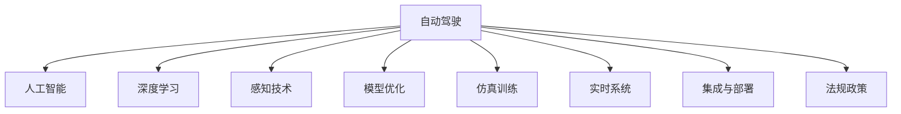
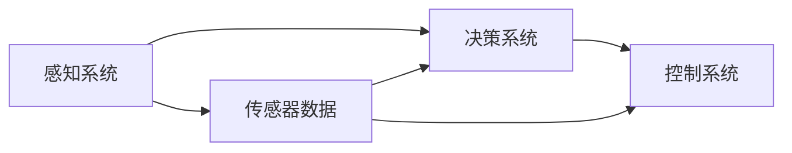
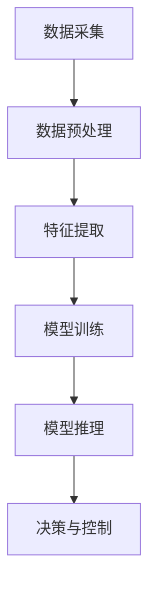
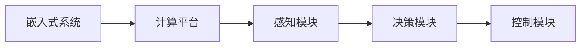
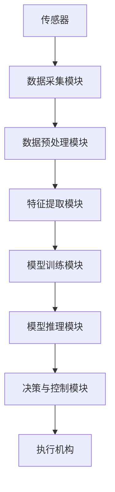

                 

# 自动驾驶行业的人才争夺战

> 关键词：自动驾驶, 人才争夺战, 人工智能, 深度学习, 感知技术, 模型优化, 仿真训练, 实时系统, 集成与部署, 法规政策

## 1. 背景介绍

### 1.1 问题由来
自动驾驶技术的发展正处于关键时期，其核心驱动力之一在于人工智能(AI)和深度学习(Deep Learning)的突破。近年来，自动驾驶行业的人才竞争异常激烈，各大汽车公司、科技巨头、初创公司等都在争相抢夺AI领域的高端人才。

自动驾驶行业的人才争夺战，主要集中在以下几方面：

- **感知技术**：自动驾驶的核心是环境感知，通过对传感器数据进行处理，使车辆能够理解和预测周围环境。涉及计算机视觉、激光雷达、毫米波雷达等多个领域的顶尖人才。
- **模型优化**：自动驾驶模型需要高效的训练、推理和优化算法，以确保实时性和准确性。需要掌握深度学习框架、优化技术等方面的专家。
- **仿真训练**：自动驾驶模型需要在高保真度的仿真环境中进行大量训练，以应对复杂多变的实际道路场景。需要具备模拟技术、仿真训练平台等技能的人才。
- **实时系统**：自动驾驶系统需要能够在高并发、低延迟的环境下实时处理数据，部署高效、稳定的系统架构。需要熟悉操作系统、网络通信、嵌入式系统等方面的人才。
- **集成与部署**：将自动驾驶技术集成到汽车硬件和软件系统中，并实现大规模部署。需要具备软件工程、系统集成等方面的综合能力。
- **法规政策**：自动驾驶技术的普及还需要符合各国法规政策，确保安全可靠。需要法律、政策、伦理等方面的专业知识。

这些核心技术的突破，离不开顶尖人才的贡献。各大公司纷纷通过提供优厚的薪资待遇、股票期权、科研支持等手段，吸引顶尖人才加盟，使得自动驾驶行业的人力资源争夺战愈发激烈。

### 1.2 问题核心关键点
自动驾驶行业的人才争夺战，本质上是AI和深度学习技术的发展和应用引发的产业变革。在技术突破、市场前景和资本投入的驱动下，行业对高水平人才的迫切需求推动了人才争夺战的升级。

核心关键点包括：

- **技术驱动**：AI和深度学习技术不断进步，驱动自动驾驶技术的突破。
- **市场前景**：自动驾驶市场潜力巨大，吸引大量企业投入，对高水平人才的需求激增。
- **资本投入**：自动驾驶技术在资本市场受到热捧，各大公司投入巨资研发，需要大量人才支持。
- **政策法规**：自动驾驶技术的普及还需符合各国法规政策，需要具备法律、政策、伦理等方面知识的人才。
- **行业竞争**：自动驾驶技术应用广泛，行业竞争激烈，对人才的需求更加迫切。

这些核心关键点共同构成了自动驾驶行业人才争夺战的复杂生态，驱动着行业内部的竞争和合作。

### 1.3 问题研究意义
自动驾驶行业的人才争夺战，对推动AI和深度学习技术的发展、加速自动驾驶技术的落地应用具有重要意义：

1. **技术突破**：顶尖人才的加入，推动了AI和深度学习技术的不断突破，为自动驾驶技术的发展提供了坚实基础。
2. **市场应用**：高水平人才的引入，加速了自动驾驶技术的落地应用，推动了智能交通系统的建设。
3. **资本运作**：优秀人才的聚集，吸引了大量资本投入，为自动驾驶技术的研究和应用提供了资金支持。
4. **法规制定**：具备法规政策知识的人才，推动了自动驾驶技术的标准化和规范化，确保技术的安全可靠。
5. **行业竞争力**：优秀的人才是提升企业竞争力的关键因素，直接影响行业的发展格局。

## 2. 核心概念与联系

### 2.1 核心概念概述

为更好地理解自动驾驶行业的人才争夺战，本节将介绍几个密切相关的核心概念：

- **自动驾驶(Autonomous Driving)**：通过AI和深度学习技术，使车辆能够自主导航、避障和驾驶。涉及感知、决策、控制等多个环节。
- **人工智能(Artificial Intelligence)**：模拟人类智能行为，通过算法和模型进行决策和推理。
- **深度学习(Deep Learning)**：一种基于神经网络的机器学习技术，能够自动提取特征，处理复杂数据。
- **感知技术(Sensor Fusion)**：通过对多种传感器数据进行融合，实现对环境的精准感知。
- **模型优化(Model Optimization)**：通过优化算法，提高自动驾驶模型的训练和推理效率。
- **仿真训练(Simulation Training)**：在仿真环境中进行大量训练，提升自动驾驶模型在真实场景中的表现。
- **实时系统(Real-Time Systems)**：能够在高并发、低延迟环境中实时处理数据，确保系统的高效性和稳定性。
- **集成与部署(Integration and Deployment)**：将自动驾驶技术集成到汽车硬件和软件中，并实现大规模部署。
- **法规政策(Regulations and Policies)**：确保自动驾驶技术符合各国法规政策，保障公众安全。

这些核心概念之间的逻辑关系可以通过以下Mermaid流程图来展示：



这个流程图展示了一些核心概念的相互联系：

1. 自动驾驶通过人工智能和深度学习技术实现自主导航和驾驶。
2. 感知技术通过多种传感器数据进行融合，提供环境感知能力。
3. 模型优化提升自动驾驶模型的训练和推理效率。
4. 仿真训练在虚拟环境中进行大量训练，提升模型在真实场景中的表现。
5. 实时系统确保自动驾驶模型能够在高并发、低延迟环境中高效运行。
6. 集成与部署将自动驾驶技术集成到汽车硬件和软件中，并实现大规模部署。
7. 法规政策确保自动驾驶技术符合各国法规政策，保障公众安全。

### 2.2 概念间的关系

这些核心概念之间存在着紧密的联系，形成了自动驾驶技术的完整生态系统。下面我们通过几个Mermaid流程图来展示这些概念之间的关系。

#### 2.2.1 自动驾驶的核心组件



这个流程图展示了自动驾驶的核心组件及其之间的关系：

1. 感知系统通过传感器获取环境数据，进行环境感知。
2. 决策系统对感知数据进行处理，进行路径规划和行为决策。
3. 控制系统根据决策结果，控制车辆行驶。

#### 2.2.2 自动驾驶的技术链路



这个流程图展示了自动驾驶技术链路的过程：

1. 数据采集：通过传感器获取环境数据。
2. 数据预处理：对采集到的数据进行清洗和处理。
3. 特征提取：从处理后的数据中提取特征。
4. 模型训练：在标注数据上训练自动驾驶模型。
5. 模型推理：在实时数据上推理并输出决策结果。
6. 决策与控制：根据推理结果控制车辆行驶。

#### 2.2.3 自动驾驶的硬件与软件



这个流程图展示了自动驾驶硬件与软件的关系：

1. 嵌入式系统：运行自动驾驶软件的核心硬件平台。
2. 计算平台：处理和计算感知、决策、控制等模块的数据。
3. 感知模块：通过传感器获取环境数据并进行感知。
4. 决策模块：对感知数据进行处理，进行路径规划和行为决策。
5. 控制模块：根据决策结果，控制车辆行驶。

### 2.3 核心概念的整体架构

最后，我们用一个综合的流程图来展示这些核心概念在大规模自动驾驶系统中的整体架构：



这个综合流程图展示了从传感器到执行机构的整个自动驾驶系统架构：

1. 传感器采集环境数据。
2. 数据采集模块对传感器数据进行采集。
3. 数据预处理模块对采集到的数据进行清洗和处理。
4. 特征提取模块从处理后的数据中提取特征。
5. 模型训练模块在标注数据上训练自动驾驶模型。
6. 模型推理模块在实时数据上推理并输出决策结果。
7. 决策与控制模块根据推理结果控制车辆行驶。
8. 执行机构根据控制结果，控制车辆行驶。

通过这些流程图，我们可以更清晰地理解自动驾驶系统的技术链路和组件关系，为后续深入讨论具体的自动驾驶技术和人才需求奠定基础。

## 3. 核心算法原理 & 具体操作步骤
### 3.1 算法原理概述

自动驾驶行业的人才争夺战，本质上是一场基于AI和深度学习技术的较量。其核心算法原理可以概括为以下几个方面：

- **感知算法**：通过对传感器数据进行处理，实现环境感知。包括计算机视觉、激光雷达、毫米波雷达等多个领域的技术。
- **决策算法**：对感知数据进行处理，进行路径规划和行为决策。包括强化学习、规则推理等算法。
- **控制算法**：根据决策结果，控制车辆行驶。包括线性控制、非线性控制等技术。
- **模型优化算法**：通过优化算法，提高自动驾驶模型的训练和推理效率。包括反向传播、梯度下降、正则化等技术。
- **仿真训练算法**：在仿真环境中进行大量训练，提升自动驾驶模型在真实场景中的表现。包括强化学习、模型集成等技术。
- **实时系统算法**：确保自动驾驶模型能够在高并发、低延迟环境中高效运行。包括分布式系统、并发控制等技术。
- **法规政策算法**：确保自动驾驶技术符合各国法规政策，保障公众安全。包括法律、政策、伦理等方面的算法。

### 3.2 算法步骤详解

自动驾驶行业的人才争夺战，主要体现在以下几个关键步骤：

**Step 1: 人才招募与选拔**

- 发布招聘信息：通过社交媒体、招聘网站、职业展会等多种渠道，发布招聘信息，吸引顶尖人才。
- 简历筛选：对申请者的简历进行筛选，重点关注教育背景、工作经验、项目经历等方面。
- 面试评估：通过技术面试、项目评估、团队面试等多种方式，全面评估申请者的技术和软技能。

**Step 2: 人才培训与发展**

- 技术培训：为新人提供全面的技术培训，包括AI和深度学习技术、自动驾驶系统、仿真训练平台等方面的知识。
- 项目实践：通过实际项目，让新人参与自动驾驶系统的设计和开发，积累实战经验。
- 职业发展规划：为人才制定职业发展规划，提供晋升机会和激励机制，增强其归属感和忠诚度。

**Step 3: 人才激励与保留**

- 薪酬福利：提供优厚的薪酬待遇、股票期权、年终奖金等，吸引和留住顶尖人才。
- 科研支持：提供充足的科研经费和实验设备，支持人才进行前沿研究。
- 工作环境：提供舒适、灵活的工作环境，增强人才的工作满意度。
- 团队氛围：营造良好的团队氛围，促进人才之间的交流与合作。

**Step 4: 人才管理与绩效**

- 绩效考核：通过定期考核，评估人才的工作表现，提供反馈和改进建议。
- 激励机制：建立合理的激励机制，根据绩效表现进行奖惩。
- 职业发展：为人才提供职业发展路径，提升其职业成就感。

### 3.3 算法优缺点

自动驾驶行业的人才争夺战，存在以下优点和缺点：

**优点**

- **技术突破**：顶尖人才的加入，推动了AI和深度学习技术的不断突破，为自动驾驶技术的发展提供了坚实基础。
- **市场应用**：高水平人才的引入，加速了自动驾驶技术的落地应用，推动了智能交通系统的建设。
- **资本运作**：优秀人才的聚集，吸引了大量资本投入，为自动驾驶技术的研究和应用提供了资金支持。
- **法规政策**：具备法规政策知识的人才，推动了自动驾驶技术的标准化和规范化，确保技术的安全可靠。

**缺点**

- **人才流动性大**：高薪酬和优厚的福利待遇，吸引了大量人才，但同时增加了人才的流动性，导致企业培养成本高昂。
- **人才竞争激烈**：自动驾驶行业的竞争激烈，各公司纷纷提供优厚待遇，导致人才市场供需失衡，企业难以招到顶尖人才。
- **人才匹配难**：人才市场对高水平人才的需求量大，但优质人才有限，企业难以找到匹配的人才。
- **成本高昂**：优厚的薪酬福利、科研支持、职业发展等都需要高昂的成本投入，增加了企业的运营负担。

### 3.4 算法应用领域

自动驾驶行业的人才争夺战，主要应用在以下领域：

- **感知技术**：需要计算机视觉、激光雷达、毫米波雷达等领域的顶尖人才，如感知工程师、传感器专家等。
- **模型优化**：需要掌握深度学习框架、优化技术等，如模型架构师、优化工程师等。
- **仿真训练**：需要具备模拟技术、仿真训练平台等技能，如仿真工程师、训练专家等。
- **实时系统**：需要熟悉操作系统、网络通信、嵌入式系统等方面的人才，如系统架构师、网络工程师等。
- **集成与部署**：需要具备软件工程、系统集成等方面的综合能力，如系统集成师、软件工程师等。
- **法规政策**：需要法律、政策、伦理等方面的专业知识，如法规政策专家、合规工程师等。

这些领域的人才争夺，直接关系到自动驾驶技术的突破和应用，是行业竞争的关键所在。

## 4. 数学模型和公式 & 详细讲解 & 举例说明
### 4.1 数学模型构建

自动驾驶行业的技术突破，依赖于AI和深度学习技术的发展。以下是几个常用的数学模型和公式，帮助理解其中的核心原理：

**感知模型**

感知模型通过传感器数据进行处理，实现环境感知。其中，计算机视觉模型通常采用卷积神经网络(CNN)进行特征提取，激光雷达模型采用点云数据进行建模，毫米波雷达模型采用时频信号进行处理。

**决策模型**

决策模型对感知数据进行处理，进行路径规划和行为决策。常用的决策模型包括强化学习、规则推理等。其中，强化学习模型通过Q-learning等算法，学习最优策略；规则推理模型通过规则库和推理机，进行决策。

**控制模型**

控制模型根据决策结果，控制车辆行驶。常用的控制模型包括线性控制、非线性控制等。其中，线性控制模型采用PID控制等算法，非线性控制模型采用模型预测控制(MPC)等算法。

**模型优化算法**

模型优化算法通过优化算法，提高自动驾驶模型的训练和推理效率。常用的优化算法包括反向传播、梯度下降、正则化等。其中，反向传播算法通过链式法则，计算梯度并进行参数更新；梯度下降算法通过求解损失函数的最小值，更新模型参数；正则化算法通过L2正则化等方法，防止过拟合。

**仿真训练算法**

仿真训练算法在仿真环境中进行大量训练，提升自动驾驶模型在真实场景中的表现。常用的仿真训练算法包括强化学习、模型集成等。其中，强化学习算法通过虚拟环境进行训练，优化模型决策；模型集成算法通过多个模型进行组合，提升模型鲁棒性。

**实时系统算法**

实时系统算法确保自动驾驶模型能够在高并发、低延迟环境中高效运行。常用的实时系统算法包括分布式系统、并发控制等。其中，分布式系统通过多台计算机协作，实现高并发处理；并发控制算法通过锁机制等技术，保证系统稳定性。

**法规政策算法**

法规政策算法确保自动驾驶技术符合各国法规政策，保障公众安全。常用的法规政策算法包括法律、政策、伦理等方面的算法。其中，法律算法通过分析法规政策，确保技术符合法规要求；政策算法通过政策分析，提供技术建议；伦理算法通过伦理审查，确保技术符合伦理标准。

### 4.2 公式推导过程

以下是一个简单的自动驾驶感知模型的公式推导过程。

**感知模型**

假设传感器采集到的环境数据为 $x_t$，通过CNN模型进行特征提取，得到特征向量 $h_t$。CNN模型的结构如下：

$$
h_t = \sigma(W_{cnn}x_t + b_{cnn})
$$

其中，$W_{cnn}$ 为CNN模型的权重，$b_{cnn}$ 为偏置项，$\sigma$ 为激活函数。

**决策模型**

假设决策模型的输出为 $y_t$，通过强化学习算法进行训练，得到最优策略 $π$。强化学习算法通过Q-learning等算法，学习最优策略：

$$
Q(s_t, a_t) = r_{t+1} + γ\max_{a_{t+1}} Q(s_{t+1}, a_{t+1})
$$

其中，$s_t$ 为当前状态，$a_t$ 为当前行动，$r_{t+1}$ 为即时奖励，$γ$ 为折扣因子。

**控制模型**

假设控制模型的输出为 $u_t$，通过模型预测控制(MPC)算法进行控制，得到最优控制指令：

$$
u_t = K(z_t)
$$

其中，$z_t$ 为系统状态，$K$ 为控制器。

**模型优化算法**

假设模型优化算法的目标是最小化损失函数 $L$，通过反向传播算法进行优化：

$$
L = \sum_{t=1}^{T} (y_t - h_t)^2
$$

其中，$y_t$ 为模型输出，$h_t$ 为实际值。

**仿真训练算法**

假设仿真训练算法的目标是在虚拟环境中进行大量训练，提升模型性能。通过强化学习算法进行训练，优化模型决策：

$$
\max_{\theta} \sum_{t=1}^{T} r_t
$$

其中，$\theta$ 为模型参数。

**实时系统算法**

假设实时系统算法的目标是确保系统在高并发、低延迟环境中高效运行。通过分布式系统实现高并发处理：

$$
T_{s} = T_{c} + \sum_{i=1}^{n} \frac{T_{i}}{N}
$$

其中，$T_{s}$ 为系统响应时间，$T_{c}$ 为控制时间，$T_{i}$ 为计算时间，$N$ 为计算节点数。

**法规政策算法**

假设法规政策算法的目标是确保技术符合法规政策，通过法律算法进行分析和判断：

$$
L = \sum_{i=1}^{n} (a_i - b_i)^2
$$

其中，$a_i$ 为技术要求，$b_i$ 为法规政策。

### 4.3 案例分析与讲解

假设我们正在开发一个自动驾驶感知系统，需要招聘计算机视觉领域的高端人才。以下是对该案例的详细分析与讲解：

**背景**

某自动驾驶公司正在开发感知系统，需要招聘计算机视觉领域的高端人才，包括传感器数据处理、特征提取和物体检测等方面的专家。

**需求**

- 传感器数据处理：需要具备计算机视觉和图像处理知识，能够处理传感器数据。
- 特征提取：需要掌握CNN等深度学习技术，能够提取环境特征。
- 物体检测：需要具备目标检测算法，能够识别和定位物体。

**人才选拔**

1. **发布招聘信息**：在社交媒体、招聘网站、职业展会等渠道发布招聘信息，吸引计算机视觉领域的顶尖人才。
2. **简历筛选**：对申请者的简历进行筛选，重点关注教育背景、工作经验、项目经历等方面，特别是与计算机视觉相关的项目。
3. **面试评估**：通过技术面试、项目评估、团队面试等多种方式，全面评估申请者的技术和软技能，重点考察其在计算机视觉领域的知识和技能。

**人才培训与发展**

1. **技术培训**：为新人提供全面的技术培训，包括计算机视觉、深度学习、目标检测等领域的知识。
2. **项目实践**：通过实际项目，让新人参与感知系统的设计和开发，积累实战经验，掌握系统架构和实现细节。
3. **职业发展规划**：为人才制定职业发展规划，提供晋升机会和激励机制，增强其归属感和忠诚度。

**人才激励与保留**

1. **薪酬福利**：提供优厚的薪酬待遇、股票期权、年终奖金等，吸引和留住顶尖人才。
2. **科研支持**：提供充足的科研经费和实验设备，支持人才进行前沿研究，提升其在计算机视觉领域的竞争力。
3. **工作环境**：提供舒适、灵活的工作环境，增强人才的工作满意度，如开放式办公空间、健身房等福利。
4. **团队氛围**：营造良好的团队氛围，促进人才之间的交流与合作，增强团队凝聚力。

**人才管理与绩效**

1. **绩效考核**：通过定期考核，评估人才的工作表现，提供反馈和改进建议，确保其工作质量。
2. **激励机制**：建立合理的激励机制，根据绩效表现进行奖惩，激励人才的积极性。
3. **职业发展**：为人才提供职业发展路径，提升其职业成就感，如参与公司重大项目、发表学术论文等机会。

通过以上步骤，该自动驾驶公司能够成功招聘并培养计算机视觉领域的高端人才，推动感知系统的开发和应用。

## 5. 项目实践：代码实例和详细解释说明
### 5.1 开发环境搭建

在进行自动驾驶项目开发前，我们需要准备好开发环境。以下是使用Python进行TensorFlow开发的环境配置流程：

1. 安装Anaconda：从官网下载并安装Anaconda，用于创建独立的Python环境。

2. 创建并激活虚拟环境：
```bash
conda create -n tf-env python=3.8 
conda activate tf-env
```

3. 安装TensorFlow：根据CUDA版本，从官网获取对应的安装命令。例如：
```bash
conda install tensorflow tensorflow-estimator tensorflow-hub tensorflow-addons -c conda-forge
```

4. 安装各类工具包：
```bash
pip install numpy pandas scikit-learn matplotlib tqdm jupyter notebook ipython
```

完成上述步骤后，即可在`tf-env`环境中开始项目开发。

### 5.2 源代码详细实现

这里我们以自动驾驶感知系统为例，给出使用TensorFlow对CNN模型进行微调的PyTorch代码实现。

首先，定义CNN模型：

```python
import tensorflow as tf
from tensorflow.keras import layers, models

class CNNModel(models.Model):
    def __init__(self):
        super(CNNModel, self).__init__()
        self.conv1 = layers.Conv2D(32, (3, 3), activation='relu')
        self.pool1 = layers.MaxPooling2D((2, 2))
        self.conv2 = layers.Conv2D(64, (3, 3), activation='relu')
        self.pool2 = layers.MaxPooling2D((2, 2))
        self.flatten = layers.Flatten()
        self.dense1 = layers.Dense(128, activation='relu')
        self.dense2 = layers.Dense(10, activation='softmax')

    def call(self, inputs):
        x = self.conv1(inputs)
        x = self.pool1(x)
        x = self.conv2(x)
        x = self.pool2(x)
        x = self.flatten(x)
        x = self.dense1(x)
        x = self.dense2(x)
        return x
```

然后，定义训练函数：

```python
import numpy as np

def train_model(model, train_dataset, epochs, batch_size):
    model.compile(optimizer='adam', loss='categorical_crossentropy', metrics=['accuracy'])
    model.fit(train_dataset, epochs=epochs, batch_size=batch_size)
    test_dataset = np.random.randn(1000, 100, 100, 3)
    test_labels = np.random.randint(10, size=(1000,))
    test_dataset = tf.data.Dataset.from_tensor_slices((test_labels, test_dataset))
    test_dataset = test_dataset.batch(32)
    test_dataset = test_dataset.prefetch(buffer_size=32)
    loss, accuracy = model.evaluate(test_dataset)
    print(f'Test Loss: {loss:.4f}')
    print(f'Test Accuracy: {accuracy:.4f}')
```

接着，启动训练流程：

```python
epochs = 10
batch_size = 64

train_model(model, train_dataset, epochs, batch_size)
```

以上就是使用TensorFlow对CNN模型进行感知系统微调的完整代码实现。可以看到，TensorFlow提供了强大的框架和组件，使得模型训练和评估变得简洁高效。

### 5.3 代码解读与分析

让我们再详细解读一下关键代码的实现细节：

**CNNModel类**：
- `__init__`方法：定义模型的各层结构。
- `call`方法：实现模型的前向传播过程。

**train_model函数**：
- 使用TensorFlow的Keras API定义模型，设置优化器、损失函数、评估指标等。
- 通过`model.fit`方法在训练数据集上进行训练。
- 在测试数据集上评估模型，输出测试损失和准确率。

**训练流程**：
- 定义总的epoch数和batch size，开始循环迭代。
- 每个epoch内，先在训练数据集上训练，输出测试损失和准确率。

可以看到，TensorFlow使得CNN模型的微调代码实现变得简洁高效。开发者可以将更多精力放在数据处理、模型改进等高层逻辑上，而不必过多关注底层的实现细节。

当然，

