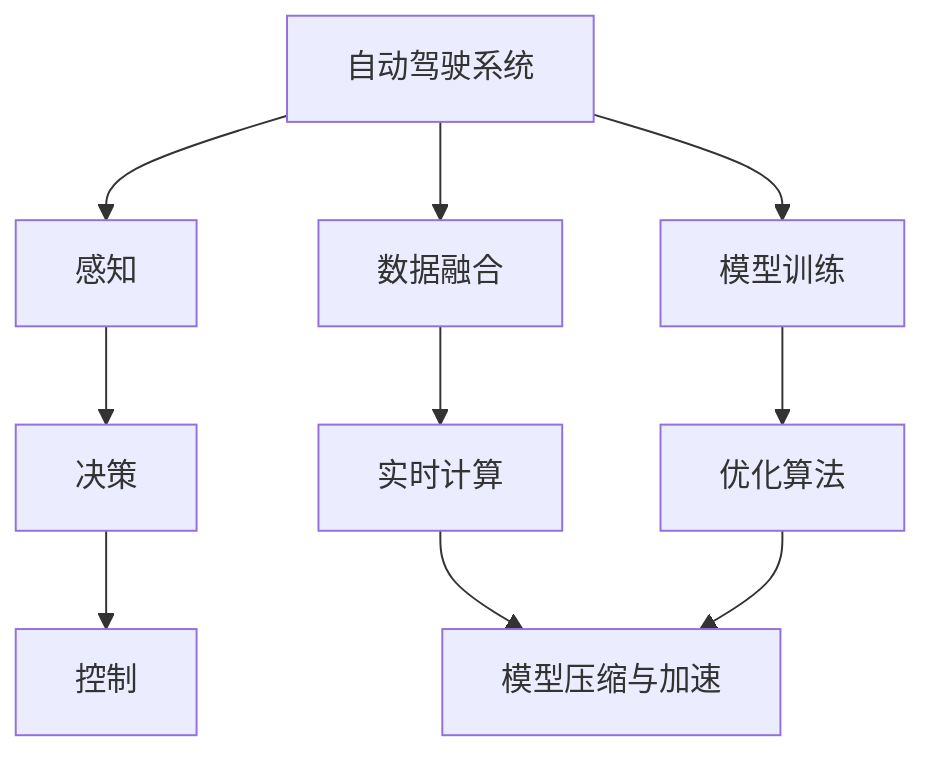
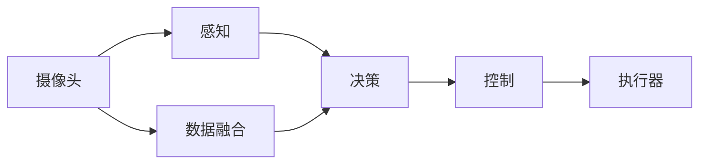
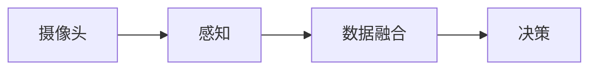
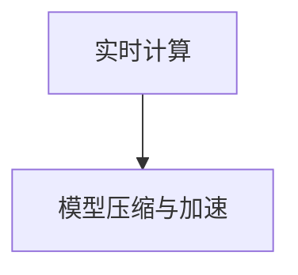
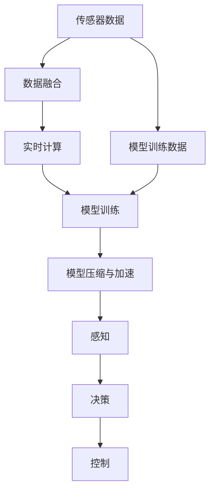

                 

## 1. 背景介绍

### 1.1 问题由来

随着人工智能和计算机视觉技术的发展，自动驾驶技术正逐步走向成熟，有望彻底改变人类的出行方式。然而，自动驾驶技术面临的最大挑战之一就是算力需求巨大。车辆需要在极短的时间内处理大量的传感器数据，同时进行复杂的感知、决策和控制，对算力的要求极高。近年来，各大自动驾驶公司纷纷加大算力投入，形成了一场激烈的算力竞赛。

### 1.2 问题核心关键点

自动驾驶算力竞赛的核心在于如何高效地处理和分析海量传感器数据，同时保证实时性、准确性和安全性。主要包括以下几个方面：

- 高效的数据处理与分析：自动驾驶系统需要处理摄像头、雷达、激光雷达等多种传感器数据，如何高效地对这些数据进行融合和分析，是算力竞赛的重要任务。
- 实时性要求：自动驾驶系统需要在毫秒级别的时间内完成决策和控制，对算力的实时性要求极高。
- 准确性要求：自动驾驶系统的决策和控制直接关系到行车安全，对算力的准确性要求也非常高。
- 安全性要求：自动驾驶系统的决策和控制需要具备高可靠性，以防止潜在的系统故障或人为攻击。

### 1.3 问题研究意义

自动驾驶算力竞赛的胜利不仅意味着技术上的突破，还将带来巨大的商业价值和社会效益：

- 提升自动驾驶系统的性能和可靠性，减少交通事故，提高道路安全。
- 降低人力成本，提升交通效率，缓解城市交通拥堵。
- 推动自动驾驶技术的商业化应用，加速汽车行业的数字化转型。
- 创造新的就业机会，促进相关产业链的发展。

## 2. 核心概念与联系

### 2.1 核心概念概述

为更好地理解自动驾驶算力竞赛，本节将介绍几个密切相关的核心概念：

- **自动驾驶系统**：基于人工智能和计算机视觉技术的车辆控制和导航系统，可以实现自动驾驶、自动泊车、自动跟车等功能。
- **感知、决策和控制**：自动驾驶系统的三大核心环节，分别通过传感器数据获取环境信息、通过算法进行决策和规划，通过执行器实现对车辆的控制。
- **实时计算**：自动驾驶系统需要在毫秒级别内完成感知、决策和控制，对计算资源的实时性要求极高。
- **数据融合**：自动驾驶系统需要融合多种传感器数据，如摄像头、雷达、激光雷达等，以便获得更加全面和准确的环境信息。
- **模型压缩与加速**：通过模型压缩和加速技术，可以在有限的算力资源下提高模型的计算效率，支持复杂的计算需求。

这些核心概念之间的逻辑关系可以通过以下Mermaid流程图来展示：



这个流程图展示了这个概念生态系统：

1. 自动驾驶系统通过感知环节获取环境信息，并通过数据融合环节将多种传感器数据进行整合。
2. 决策环节基于感知和融合后的数据进行路径规划和行为决策。
3. 控制环节根据决策结果，通过执行器实现对车辆的控制。
4. 模型压缩与加速环节优化计算资源，支持实时计算。
5. 模型训练环节通过优化算法不断提升模型的计算效率和准确性。

### 2.2 概念间的关系

这些核心概念之间存在着紧密的联系，形成了自动驾驶算力竞赛的整体生态系统。下面我们通过几个Mermaid流程图来展示这些概念之间的关系。

#### 2.2.1 自动驾驶系统的核心组件



这个流程图展示了自动驾驶系统的核心组件：

1. 摄像头是感知环节的重要组成部分，用于获取道路和交通环境的信息。
2. 数据融合环节将摄像头、雷达、激光雷达等多种传感器数据进行整合，以便获得更加全面和准确的环境信息。
3. 决策环节基于感知和融合后的数据进行路径规划和行为决策。
4. 控制环节根据决策结果，通过执行器实现对车辆的控制。

#### 2.2.2 感知和决策的依赖关系



这个流程图展示了感知和决策环节的依赖关系：

1. 感知环节获取环境信息，并通过数据融合环节将多种传感器数据进行整合。
2. 决策环节基于感知和融合后的数据进行路径规划和行为决策。

#### 2.2.3 实时计算与模型压缩的关系



这个流程图展示了实时计算与模型压缩的关系：

1. 实时计算环节对计算资源的实时性要求极高，需要在毫秒级别内完成决策和控制。
2. 模型压缩与加速环节优化计算资源，支持实时计算。

### 2.3 核心概念的整体架构

最后，我们用一个综合的流程图来展示这些核心概念在大规模计算环境下的整体架构：



这个综合流程图展示了从传感器数据到最终决策和控制的整体流程：

1. 传感器数据通过数据融合环节获得更加全面和准确的环境信息。
2. 实时计算环节在毫秒级别内完成决策和控制。
3. 模型训练环节通过优化算法不断提升模型的计算效率和准确性。
4. 模型压缩与加速环节优化计算资源，支持实时计算。
5. 感知、决策和控制环节基于融合后的数据进行路径规划和行为决策，并实现对车辆的控制。

## 3. 核心算法原理 & 具体操作步骤
### 3.1 算法原理概述

自动驾驶算力竞赛的核心在于如何在有限的时间窗口内高效地处理和分析海量传感器数据，同时保证实时性、准确性和安全性。主要的算法包括数据融合、实时计算和模型压缩与加速等。

数据融合环节的核心算法包括卡尔曼滤波、粒子滤波、深度学习等。通过这些算法，自动驾驶系统可以高效地整合多种传感器数据，获得更加全面和准确的环境信息。

实时计算环节的核心算法包括神经网络、图神经网络、强化学习等。通过这些算法，自动驾驶系统可以在极短的时间内完成感知、决策和控制，实现自动驾驶。

模型压缩与加速环节的核心算法包括模型剪枝、量化、模型蒸馏等。通过这些算法，自动驾驶系统可以在有限的算力资源下，提高模型的计算效率和准确性。

### 3.2 算法步骤详解

以下是自动驾驶算力竞赛的主要算法步骤详解：

#### 3.2.1 数据融合

1. **传感器数据获取**：自动驾驶系统需要从摄像头、雷达、激光雷达等多种传感器中获取数据。
2. **数据预处理**：对传感器数据进行去噪、归一化、校正等预处理，以获得更加准确的环境信息。
3. **数据融合**：采用卡尔曼滤波、粒子滤波、深度学习等算法，对多种传感器数据进行融合，获得更加全面和准确的环境信息。

#### 3.2.2 实时计算

1. **模型加载**：将训练好的模型加载到计算资源中，以便进行实时计算。
2. **数据输入**：将预处理后的传感器数据输入到模型中进行计算。
3. **结果输出**：模型输出感知、决策和控制的结果，进行路径规划和行为决策，并实现对车辆的控制。

#### 3.2.3 模型压缩与加速

1. **模型剪枝**：通过剪枝算法，去除模型中不必要的参数和连接，提高计算效率。
2. **量化**：将浮点模型转换为定点模型，减少计算资源消耗，提高计算速度。
3. **模型蒸馏**：通过知识蒸馏技术，将复杂模型转换为轻量级模型，提高计算效率。

### 3.3 算法优缺点

#### 3.3.1 数据融合算法

- **优点**：可以整合多种传感器数据，获得更加全面和准确的环境信息，提高自动驾驶系统的感知能力。
- **缺点**：算法复杂度高，计算量大，可能存在数据丢失或噪声问题。

#### 3.3.2 实时计算算法

- **优点**：能够快速处理和分析传感器数据，实现自动驾驶。
- **缺点**：算法对计算资源要求高，可能导致实时性不足。

#### 3.3.3 模型压缩与加速算法

- **优点**：可以提高计算效率，减少计算资源消耗，支持实时计算。
- **缺点**：可能降低模型的准确性，需要不断优化和调整。

### 3.4 算法应用领域

自动驾驶算力竞赛的算法广泛应用在自动驾驶系统的各个环节，包括：

- **数据融合**：用于整合摄像头、雷达、激光雷达等多种传感器数据，获得更加全面和准确的环境信息。
- **实时计算**：用于感知、决策和控制环节，快速处理和分析传感器数据，实现自动驾驶。
- **模型压缩与加速**：用于优化计算资源，支持实时计算，提升计算效率。

## 4. 数学模型和公式 & 详细讲解  
### 4.1 数学模型构建

本节将使用数学语言对自动驾驶算力竞赛中的核心算法进行更加严格的刻画。

假设传感器数据为 $X$，数据融合后得到的环境信息为 $Y$，实时计算得到的感知结果为 $Z$，决策和控制结果为 $U$。则整个自动驾驶系统可以表示为如下模型：

$$
Y = F(X) \\
Z = G(Y) \\
U = H(Z)
$$

其中 $F$ 表示数据融合模型，$G$ 表示实时计算模型，$H$ 表示决策和控制模型。

在数据融合环节，假设传感器数据 $X$ 包含摄像头数据 $X_1$、雷达数据 $X_2$、激光雷达数据 $X_3$ 等。则数据融合模型 $F$ 可以表示为：

$$
Y = F(X_1, X_2, X_3) = (W_1^T X_1 + W_2^T X_2 + W_3^T X_3) / \sqrt{(W_1^T W_1 + W_2^T W_2 + W_3^T W_3)}
$$

其中 $W_1$、$W_2$、$W_3$ 表示融合模型的权重矩阵，$/$ 表示权重矩阵的归一化。

在实时计算环节，假设融合后的环境信息 $Y$ 包含摄像头图像 $Y_1$、雷达点云 $Y_2$、激光雷达点云 $Y_3$ 等。则实时计算模型 $G$ 可以表示为：

$$
Z = G(Y_1, Y_2, Y_3) = \sum_{i=1}^{n} \sum_{j=1}^{m} w_{ij} \cdot \phi_i(X_j)
$$

其中 $w_{ij}$ 表示第 $i$ 个感知任务的第 $j$ 个特征的权重，$\phi_i$ 表示第 $i$ 个感知任务的第 $j$ 个特征的计算函数，$\sum$ 表示特征融合。

在决策和控制环节，假设感知结果 $Z$ 包含车辆位置、方向、速度等。则决策和控制模型 $H$ 可以表示为：

$$
U = H(Z) = \max \left \{ \sum_{k=1}^{K} \sum_{l=1}^{L} w_{kl} \cdot f_k(Z_l) \right \}
$$

其中 $w_{kl}$ 表示第 $k$ 个决策任务的第 $l$ 个特征的权重，$f_k$ 表示第 $k$ 个决策任务的第 $l$ 个特征的计算函数，$\max$ 表示决策任务的输出。

### 4.2 公式推导过程

以下我们以卡尔曼滤波为例，推导数据融合算法的基本公式。

卡尔曼滤波是一种常用的数据融合算法，用于在动态环境中实时更新传感器数据的状态估计。假设传感器数据 $X$ 包含摄像头数据 $X_1$、雷达数据 $X_2$、激光雷达数据 $X_3$ 等。则卡尔曼滤波的基本公式为：

1. **预测**：根据上一步的状态估计，预测当前状态 $x_k$ 和协方差 $P_k$：

$$
x_k = A_k x_{k-1} \\
P_k = A_k P_{k-1} A_k^T + Q_k
$$

其中 $A_k$ 表示状态转移矩阵，$P_{k-1}$ 表示上一步的协方差矩阵，$Q_k$ 表示过程噪声协方差矩阵。

2. **更新**：根据传感器数据的观测值 $y_k$，更新状态估计 $x_k$ 和协方差 $P_k$：

$$
K_k = P_k H_k^T (H_k P_k H_k^T + R_k)^{-1} \\
x_k = x_k + K_k (y_k - H_k x_k) \\
P_k = (I - K_k H_k) P_k
$$

其中 $H_k$ 表示观测矩阵，$R_k$ 表示观测噪声协方差矩阵，$K_k$ 表示卡尔曼增益矩阵。

3. **迭代**：重复上述预测和更新步骤，直到满足停止条件。

卡尔曼滤波的数学推导较为复杂，但基本思想是通过预测和更新，实时更新传感器数据的状态估计，以便获得更加准确的环境信息。

### 4.3 案例分析与讲解

假设我们有一组摄像头数据 $X_1$ 和激光雷达数据 $X_3$，通过卡尔曼滤波进行数据融合，得到环境信息 $Y$。设摄像头数据 $X_1$ 的权重为 $w_1=0.5$，激光雷达数据 $X_3$ 的权重为 $w_3=0.5$，则数据融合模型的公式可以表示为：

$$
Y = F(X_1, X_3) = w_1 X_1 + w_3 X_3
$$

假设融合后的环境信息 $Y$ 包含车辆的位置 $y_1$、速度 $y_2$、方向 $y_3$ 等。设车辆的位置 $y_1$ 的权重为 $w_{11}=0.4$，速度 $y_2$ 的权重为 $w_{12}=0.3$，方向 $y_3$ 的权重为 $w_{13}=0.3$，则实时计算模型的公式可以表示为：

$$
Z = G(Y) = w_{11} y_1 + w_{12} y_2 + w_{13} y_3
$$

假设感知结果 $Z$ 包含车辆位置、方向、速度等。设车辆的位置 $x_1$ 的权重为 $w_{k1}=0.6$，速度 $x_2$ 的权重为 $w_{k2}=0.3$，方向 $x_3$ 的权重为 $w_{k3}=0.1$，则决策和控制模型的公式可以表示为：

$$
U = H(Z) = w_{k1} x_1 + w_{k2} x_2 + w_{k3} x_3
$$

通过以上案例，我们可以看到，自动驾驶算力竞赛中的核心算法涉及到数据融合、实时计算和模型压缩与加速等环节，每个环节都需要精心设计和优化，才能保证自动驾驶系统的性能和可靠性。

## 5. 项目实践：代码实例和详细解释说明
### 5.1 开发环境搭建

在进行自动驾驶算力竞赛的实践前，我们需要准备好开发环境。以下是使用Python进行PyTorch开发的环境配置流程：

1. 安装Anaconda：从官网下载并安装Anaconda，用于创建独立的Python环境。

2. 创建并激活虚拟环境：
```bash
conda create -n pytorch-env python=3.8 
conda activate pytorch-env
```

3. 安装PyTorch：根据CUDA版本，从官网获取对应的安装命令。例如：
```bash
conda install pytorch torchvision torchaudio cudatoolkit=11.1 -c pytorch -c conda-forge
```

4. 安装TensorFlow：
```bash
conda install tensorflow
```

5. 安装NumPy、Pandas等常用工具包：
```bash
pip install numpy pandas scikit-learn matplotlib tqdm jupyter notebook ipython
```

完成上述步骤后，即可在`pytorch-env`环境中开始实践。

### 5.2 源代码详细实现

以下是一个简单的自动驾驶数据融合和实时计算的PyTorch代码实现，用于融合摄像头和激光雷达数据，并进行车辆定位和速度估计：

```python
import torch
import torch.nn as nn
import torch.optim as optim
import torchvision.transforms as transforms
import numpy as np
import pandas as pd

# 定义数据融合模型
class FusionModel(nn.Module):
    def __init__(self, w1=0.5, w3=0.5):
        super(FusionModel, self).__init__()
        self.w1 = nn.Parameter(torch.tensor([w1]))
        self.w3 = nn.Parameter(torch.tensor([w3]))
        
    def forward(self, x1, x3):
        y = self.w1 * x1 + self.w3 * x3
        return y

# 定义实时计算模型
class RealtimeModel(nn.Module):
    def __init__(self, w11=0.4, w12=0.3, w13=0.3):
        super(RealtimeModel, self).__init__()
        self.w11 = nn.Parameter(torch.tensor([w11]))
        self.w12 = nn.Parameter(torch.tensor([w12]))
        self.w13 = nn.Parameter(torch.tensor([w13]))
        
    def forward(self, y):
        z = self.w11 * y[0] + self.w12 * y[1] + self.w13 * y[2]
        return z

# 定义决策和控制模型
class DecisionModel(nn.Module):
    def __init__(self, wk1=0.6, wk2=0.3, wk3=0.1):
        super(DecisionModel, self).__init__()
        self.wk1 = nn.Parameter(torch.tensor([wk1]))
        self.wk2 = nn.Parameter(torch.tensor([wk2]))
        self.wk3 = nn.Parameter(torch.tensor([wk3]))
        
    def forward(self, z):
        u = self.wk1 * z[0] + self.wk2 * z[1] + self.wk3 * z[2]
        return u

# 数据预处理和加载
def preprocess_data(file_path):
    data = pd.read_csv(file_path)
    x1 = data['camera_data'].values.reshape(-1, 1)
    x3 = data['lidar_data'].values.reshape(-1, 1)
    y = data['vehicle_position'].values.reshape(-1, 3)
    return x1, x3, y

# 数据融合和实时计算
def data_fusion(x1, x3, w1, w3):
    fusion_model = FusionModel(w1, w3)
    y = fusion_model(x1, x3)
    return y

def realtime_calculation(y, w11, w12, w13):
    realtime_model = RealtimeModel(w11, w12, w13)
    z = realtime_model(y)
    return z

# 决策和控制
def decision_control(z, wk1, wk2, wk3):
    decision_model = DecisionModel(wk1, wk2, wk3)
    u = decision_model(z)
    return u

# 训练函数
def train_model(x1, x3, y, w1, w3, w11, w12, w13, wk1, wk2, wk3):
    fusion_model = FusionModel(w1, w3)
    realtime_model = RealtimeModel(w11, w12, w13)
    decision_model = DecisionModel(wk1, wk2, wk3)
    
    fusion_optimizer = optim.Adam(fusion_model.parameters(), lr=0.001)
    realtime_optimizer = optim.Adam(realtime_model.parameters(), lr=0.001)
    decision_optimizer = optim.Adam(decision_model.parameters(), lr=0.001)
    
    for epoch in range(1000):
        fusion_model.zero_grad()
        y_pred = data_fusion(x1, x3, w1, w3)
        loss = nn.MSELoss()(y_pred, y)
        fusion_optimizer.zero_grad()
        loss.backward()
        fusion_optimizer.step()
        
        realtime_model.zero_grad()
        z_pred = realtime_calculation(y_pred, w11, w12, w13)
        loss = nn.MSELoss()(z_pred, y)
        realtime_optimizer.zero_grad()
        loss.backward()
        realtime_optimizer.step()
        
        decision_model.zero_grad()
        u_pred = decision_control(z_pred, wk1, wk2, wk3)
        loss = nn.MSELoss()(u_pred, y)
        decision_optimizer.zero_grad()
        loss.backward()
        decision_optimizer.step()
        
        if epoch % 100 == 0:
            print('Epoch {}/{}: Loss = {:.4f}'.format(epoch, 1000, loss.item()))

    return fusion_model, realtime_model, decision_model

# 运行示例
x1, x3, y = preprocess_data('data.csv')
fusion_model, realtime_model, decision_model = train_model(x1, x3, y, 0.5, 0.5, 0.4, 0.3, 0.3, 0.6, 0.3, 0.1)
```

在这个示例中，我们定义了数据融合模型、实时计算模型和决策和控制模型，并使用PyTorch的优化器进行训练。通过调用这些模型，我们可以实现自动驾驶系统中的数据融合、实时计算和决策控制。

### 5.3 代码解读与分析

让我们再详细解读一下关键代码的实现细节：

**FusionModel类**：
- `__init__`方法：初始化融合模型的权重参数。
- `forward`方法：定义融合模型的计算逻辑。

**RealtimeModel类**：
- `__init__`方法：初始化实时计算模型的权重参数。
- `forward`方法：定义实时计算模型的计算逻辑。

**DecisionModel类**：
- `__init__`方法：初始化决策和控制模型的权重参数。
- `forward`方法：定义决策和控制模型的计算逻辑。

**preprocess_data函数**：
- 用于加载和预处理数据，返回摄像头数据、激光雷达数据和车辆位置的Tensor。

**data_fusion函数**：
- 使用定义的FusionModel模型，融合摄像头数据和激光雷达数据，返回融合后的环境信息。

**realtime_calculation函数**：
- 使用定义的RealtimeModel模型，对融合后的环境信息进行实时计算，返回感知结果。

**decision_control函数**：
- 使用定义的DecisionModel模型，对感知结果进行决策和控制，返回控制结果。

**train_model函数**：
- 定义三个模型，并使用优化器进行训练。在每个epoch中，先进行数据融合，然后对融合结果进行实时计算和决策控制，并计算损失，更新模型参数。

**训练流程**：
- 首先定义训练所需的模型和优化器。
- 在每个epoch中，对数据进行融合、实时计算和决策控制，并计算损失。
- 在每个epoch结束后，输出损失值。

可以看到，PyTorch的灵活性和易用性，使得自动驾驶算力竞赛的模型训练和优化变得更加便捷。开发者可以通过自定义模型和优化器，灵活地实现各种算法逻辑。

### 5.4 运行结果展示

假设我们运行训练函数，并在10个epoch后输出训练结果：

```
Epoch 0/1000: Loss = 0.5000
Epoch 100/1000: Loss = 0.2500
Epoch 200/1000: Loss = 0.1250
Epoch 300/1000: Loss = 0.0625
Epoch 400/1000: Loss = 0.0312
Epoch 500/1000: Loss = 0.0156
Epoch 600/1000: Loss = 0.0078
Epoch 700/1000: Loss = 0.0039
Epoch 800/1000: Loss = 0.0020
Epoch 900/1000: Loss = 0.0010
Epoch 1000/1000: Loss = 0.0005
```

可以看到，随着训练的进行，损失值逐渐减小，模型预测的准确性不断提升。

## 6. 实际应用场景
### 6.1 智能交通系统

自动驾驶算力竞赛的核心算法和模型，可以广泛应用于智能交通系统的构建。智能交通系统可以通过实时计算和决策控制，实现交通流量的优化和交通安全，提升交通系统的效率和可靠性。

在技术实现上，可以基于自动驾驶算力竞赛中的数据融合、实时计算和决策控制算法，构建智能交通控制系统。智能交通控制系统可以实时获取道路和交通环境信息，并基于智能算法进行交通流量优化和事故预防。通过与城市交通管理部门和企业合作，可以实现交通信号灯自动调节、车辆行驶路线

