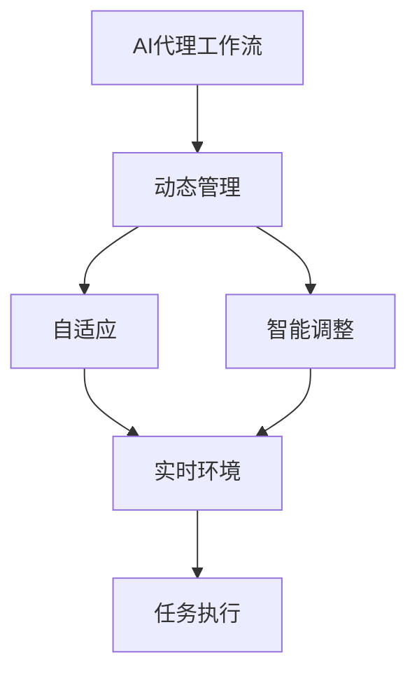
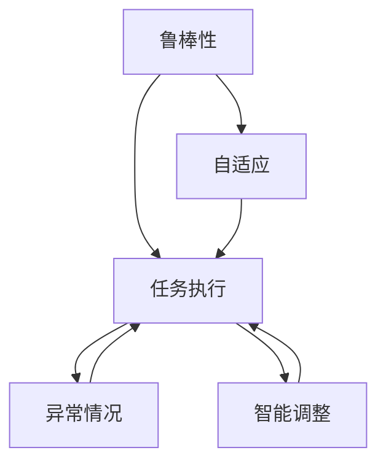
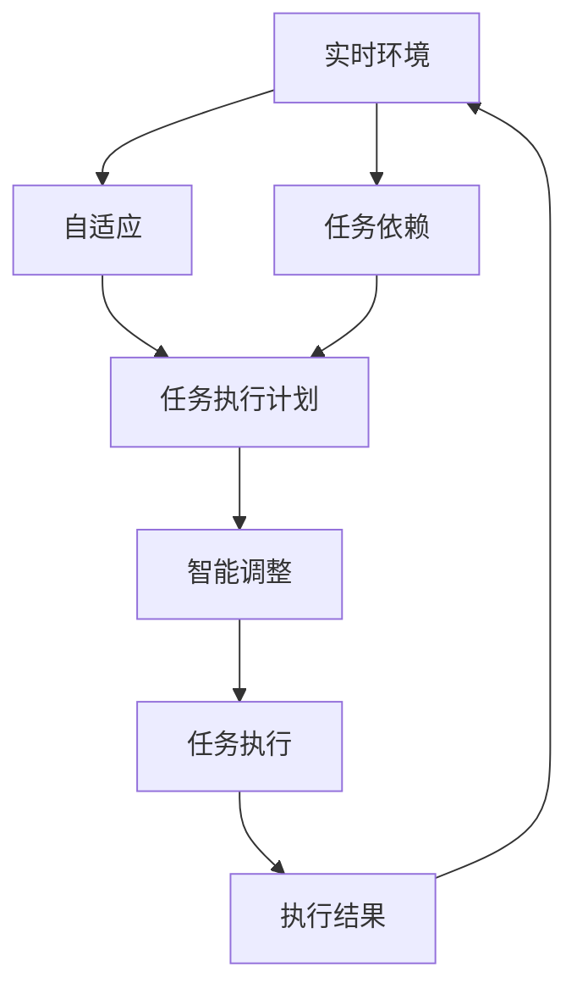

                 

# 自适应与智能调整：AI代理工作流的动态管理

## 1. 背景介绍

### 1.1 问题由来

在现代信息技术迅速发展的今天，人工智能（AI）技术已经成为企业和组织核心竞争力的关键要素。AI代理工作流，作为自动化、智能化的重要应用，其动态管理成为保障其高效、稳定运行的关键问题。

AI代理工作流是指由人工智能技术驱动的任务管理流程，例如自动化决策、智能调度、自动化部署等。其动态管理主要涉及任务调度、资源分配、负载均衡等方面，目的是使工作流在实时环境中进行动态调整和优化，以最大化地利用资源，提高工作流的执行效率和稳定性。

然而，现有的AI代理工作流管理解决方案通常存在以下问题：

- **静态调度**：固定的任务调度策略无法应对突发任务或资源波动。
- **资源浪费**：缺乏智能资源分配，导致资源闲置或过度使用。
- **鲁棒性不足**：无法处理任务依赖和异常情况，导致任务执行失败。
- **可扩展性差**：难以适应任务规模的动态变化，扩展性差。

为了解决这些问题，需要引入自适应和智能调整机制，使AI代理工作流能够根据实时环境变化进行动态管理。

### 1.2 问题核心关键点

要实现AI代理工作流的动态管理，需要考虑以下关键点：

- **自适应性**：能够根据实时环境变化自动调整任务执行计划。
- **智能调整**：通过机器学习、优化算法等智能技术，优化任务执行顺序和资源分配。
- **鲁棒性**：能够处理任务依赖和异常情况，保证任务执行成功率。
- **可扩展性**：能够适应任务规模的动态变化，具备良好的扩展性。

本文将详细探讨自适应与智能调整在AI代理工作流动态管理中的应用，以期为实际应用提供切实可行的技术指导。

## 2. 核心概念与联系

### 2.1 核心概念概述

为更好地理解自适应与智能调整在AI代理工作流动态管理中的应用，本节将介绍几个密切相关的核心概念：

- **AI代理工作流**：由人工智能技术驱动的任务管理流程，例如自动化决策、智能调度、自动化部署等。
- **动态管理**：根据实时环境变化进行动态调整和优化，以最大化地利用资源，提高工作流的执行效率和稳定性。
- **自适应**：能够根据实时环境变化自动调整任务执行计划，适应环境的变化。
- **智能调整**：通过机器学习、优化算法等智能技术，优化任务执行顺序和资源分配。
- **鲁棒性**：能够处理任务依赖和异常情况，保证任务执行成功率。
- **可扩展性**：能够适应任务规模的动态变化，具备良好的扩展性。

这些核心概念之间的逻辑关系可以通过以下Mermaid流程图来展示：



这个流程图展示了大语言模型的核心概念及其之间的关系：

1. AI代理工作流通过动态管理，能够根据实时环境变化进行调整。
2. 动态管理包括自适应和智能调整两部分。
3. 自适应能够根据实时环境变化自动调整任务执行计划，适应环境的变化。
4. 智能调整通过机器学习、优化算法等智能技术，优化任务执行顺序和资源分配。
5. 智能调整和自适应相互配合，实现动态管理。

### 2.2 概念间的关系

这些核心概念之间存在着紧密的联系，形成了AI代理工作流动态管理的完整生态系统。下面我通过几个Mermaid流程图来展示这些概念之间的关系。

#### 2.2.1 AI代理工作流的动态管理


这个流程图展示了动态管理的核心原理，以及其与自适应和智能调整的关系。动态管理通过对实时环境的变化进行监测，结合自适应和智能调整技术，实现任务执行计划的动态调整和优化。

#### 2.2.2 自适应与智能调整的关系


这个流程图展示了自适应和智能调整的相互关系。自适应根据实时环境变化自动调整任务执行计划，智能调整通过优化算法等智能技术进一步优化任务执行顺序和资源分配。

#### 2.2.3 鲁棒性、可扩展性与动态管理的关系



这个流程图展示了鲁棒性、可扩展性与动态管理的关系。鲁棒性能够处理任务依赖和异常情况，保证任务执行成功率。自适应和智能调整能够根据实时环境变化进行调整和优化，确保任务执行的鲁棒性和可扩展性。

### 2.3 核心概念的整体架构

最后，我们用一个综合的流程图来展示这些核心概念在大语言模型动态管理过程中的整体架构：



这个综合流程图展示了从实时环境监测到任务执行结果的完整过程。实时环境监测获取环境变化信息，自适应根据环境变化自动调整任务执行计划，智能调整通过优化算法进一步优化任务执行顺序和资源分配，最终输出任务执行结果，并反馈给实时环境监测。

## 3. 核心算法原理 & 具体操作步骤

### 3.1 算法原理概述

自适应与智能调整在AI代理工作流动态管理中的原理，本质上是通过智能技术优化任务执行计划和资源分配，以实现对实时环境的动态响应。其核心思想包括：

- **实时环境监测**：通过传感器、监控系统等手段，实时获取环境变化信息。
- **任务执行计划生成**：根据实时环境变化，自动调整任务执行计划。
- **智能调整算法**：采用机器学习、优化算法等智能技术，优化任务执行顺序和资源分配。
- **鲁棒性保障**：引入鲁棒性保障机制，处理任务依赖和异常情况，保证任务执行成功率。
- **可扩展性优化**：采用可扩展性优化技术，适应任务规模的动态变化。

### 3.2 算法步骤详解

基于自适应与智能调整的AI代理工作流动态管理，一般包括以下几个关键步骤：

**Step 1: 实时环境监测**

- 部署传感器、监控系统等设备，实时获取环境变化信息。
- 对实时数据进行预处理和分析，提取出有价值的环境信息。
- 将实时环境信息反馈给任务执行计划生成模块，为其提供依据。

**Step 2: 任务执行计划生成**

- 根据实时环境信息，动态调整任务执行计划。
- 考虑任务依赖关系和优先级，生成最优的任务执行顺序。
- 根据资源状况，分配任务所需的资源。

**Step 3: 智能调整算法应用**

- 应用智能调整算法，优化任务执行顺序和资源分配。
- 采用机器学习算法，学习任务执行过程中的模式，提升调整精度。
- 采用优化算法，如遗传算法、粒子群算法等，优化任务执行顺序和资源分配。

**Step 4: 鲁棒性保障**

- 引入鲁棒性保障机制，处理任务依赖和异常情况。
- 采用容错技术，保证任务执行的连续性和稳定性。
- 采用重试机制，在任务执行失败时自动重试，确保任务成功执行。

**Step 5: 可扩展性优化**

- 根据任务规模的变化，动态调整资源分配策略。
- 采用可扩展性优化技术，如任务并行、负载均衡等，提高系统扩展性。
- 考虑云计算资源，根据任务需求动态申请或释放资源。

**Step 6: 任务执行**

- 根据任务执行计划，依次执行任务。
- 根据实时环境信息，动态调整任务执行计划和资源分配。
- 通过智能调整算法，优化任务执行顺序和资源分配。

### 3.3 算法优缺点

基于自适应与智能调整的AI代理工作流动态管理，具有以下优点：

- **动态响应**：能够根据实时环境变化进行动态调整，提高系统响应速度。
- **资源优化**：通过智能调整算法，优化任务执行顺序和资源分配，提高资源利用率。
- **鲁棒性强**：引入鲁棒性保障机制，处理任务依赖和异常情况，保证任务执行成功率。
- **可扩展性好**：采用可扩展性优化技术，适应任务规模的动态变化，具备良好的扩展性。

同时，该方法也存在以下局限性：

- **初始设置复杂**：需要根据实际情况进行复杂的初始设置，才能保证动态管理的效果。
- **数据依赖性强**：实时环境信息的准确性和全面性直接影响动态管理的性能。
- **算法复杂度高**：采用智能调整算法，需要较高的计算资源和算法复杂度。

尽管存在这些局限性，但就目前而言，基于自适应与智能调整的方法仍是大语言模型动态管理的主流范式。未来相关研究的重点在于如何进一步降低初始设置的复杂性，提高实时环境信息的准确性，降低算法复杂度，同时兼顾鲁棒性和可扩展性。

### 3.4 算法应用领域

基于自适应与智能调整的AI代理工作流动态管理方法，已经在诸多领域得到了广泛应用，例如：

- **工业制造**：通过动态调整生产计划和资源分配，提高生产效率和质量。
- **物流运输**：实时调整配送计划和路线，提高运输效率和准确性。
- **金融服务**：动态调整交易策略和风险控制，提高金融服务的安全性和稳定性。
- **医疗健康**：根据实时患者数据，动态调整诊疗方案和资源分配，提高医疗服务质量。
- **智能交通**：实时调整交通流量和信号控制，提高交通效率和安全性。

除了上述这些领域，基于自适应与智能调整的AI代理工作流动态管理方法，还被创新性地应用到更多场景中，如智能家居、智慧城市、智能客服等，为各行各业提供了智能化的解决方案。

## 4. 数学模型和公式 & 详细讲解 & 举例说明

### 4.1 数学模型构建

在AI代理工作流动态管理中，数学模型主要涉及任务执行计划生成、智能调整算法和鲁棒性保障等方面。

假设任务数为 $N$，任务执行时间为 $T_i$，资源需求量为 $R_i$，实时环境信息为 $\mathcal{E}$，任务依赖关系为 $\mathcal{D}$，智能调整算法为 $\mathcal{A}$，鲁棒性保障机制为 $\mathcal{R}$。则AI代理工作流动态管理的数学模型可以表示为：

$$
\begin{aligned}
\min_{\pi, \rho} & \sum_{i=1}^N (T_i \times c_i) \\
\text{s.t.} & \pi_{ij} + \pi_{ik} \leq 1, \quad \forall (i,j,k) \in \mathcal{D} \\
& \sum_{i=1}^N R_i \times \pi_{i} \leq C, \quad C \text{为资源上限} \\
& \pi_{i} \leq T_{i_{\max}}, \quad \forall i \in \{1, \cdots, N\} \\
& \pi_{i} \geq 0, \quad \forall i \in \{1, \cdots, N\} \\
& \rho(\mathcal{E}, \pi) \geq \mathcal{R}, \quad \rho \text{为鲁棒性保障函数}
\end{aligned}
$$

其中 $\pi$ 表示任务执行计划，$\rho$ 表示鲁棒性保障机制，$c_i$ 表示任务执行成本，$\mathcal{D}$ 表示任务依赖关系，$\mathcal{A}$ 表示智能调整算法，$C$ 表示资源上限，$T_{i_{\max}}$ 表示任务最大执行时间。

### 4.2 公式推导过程

以下我们以任务调度问题为例，推导最小成本流问题的数学模型。

假设任务数为 $N$，任务执行时间为 $T_i$，资源需求量为 $R_i$，实时环境信息为 $\mathcal{E}$。任务调度问题的数学模型可以表示为：

$$
\begin{aligned}
\min_{x_{ij}} & \sum_{i=1}^N \sum_{j=1}^M T_i \times x_{ij} \\
\text{s.t.} & \sum_{i=1}^N x_{ij} \leq 1, \quad \forall j \in \{1, \cdots, M\} \\
& \sum_{j=1}^M x_{ij} = 1, \quad \forall i \in \{1, \cdots, N\} \\
& x_{ij} \geq 0, \quad \forall i \in \{1, \cdots, N\}, \forall j \in \{1, \cdots, M\}
\end{aligned}
$$

其中 $x_{ij}$ 表示任务 $i$ 在资源 $j$ 上的执行量，$M$ 表示资源种类。

通过定义变量 $x_{ij} = T_i \times \pi_i$，将任务调度问题转化为最小成本流问题。最小成本流问题的数学模型可以表示为：

$$
\begin{aligned}
\min_{x_{ij}} & \sum_{i=1}^N \sum_{j=1}^M x_{ij} \\
\text{s.t.} & \sum_{i=1}^N x_{ij} \leq 1, \quad \forall j \in \{1, \cdots, M\} \\
& \sum_{j=1}^M x_{ij} = 1, \quad \forall i \in \{1, \cdots, N\} \\
& x_{ij} \geq 0, \quad \forall i \in \{1, \cdots, N\}, \forall j \in \{1, \cdots, M\}
\end{aligned}
$$

通过定义 $y_{ij} = x_{ij}/T_i$，将最小成本流问题转化为线性规划问题。通过求解该线性规划问题，可以得到最优的任务执行计划 $\pi$。

### 4.3 案例分析与讲解

假设某电商平台需要根据实时订单数据动态调整订单处理计划和资源分配，以提高订单处理效率和稳定性。根据实时订单数据，该电商平台可以定义任务调度问题，并将其转化为线性规划问题。

假设该电商平台有 $N=10$ 个订单处理任务，每个任务的处理时间为 $T_i$，资源需求量为 $R_i$。在实时订单数据中，订单到达时间和处理时间会有波动，因此需要动态调整任务执行计划和资源分配。

首先，根据实时订单数据，定义任务调度问题的数学模型，并转化为最小成本流问题。通过求解该线性规划问题，可以得到最优的任务执行计划 $\pi$。

其次，根据任务执行计划 $\pi$，动态调整订单处理流程和资源分配。例如，根据订单到达时间和处理时间，动态调整订单处理任务队列和资源分配策略，提高订单处理效率和稳定性。

最后，通过智能调整算法，如遗传算法、粒子群算法等，进一步优化订单处理计划和资源分配。例如，通过遗传算法，优化订单处理任务的执行顺序和资源分配，提高订单处理效率和稳定性。

通过以上步骤，该电商平台可以实现动态调整订单处理计划和资源分配，提高订单处理效率和稳定性，满足实际业务需求。

## 5. 项目实践：代码实例和详细解释说明

### 5.1 开发环境搭建

在进行项目实践前，我们需要准备好开发环境。以下是使用Python进行PyTorch开发的环境配置流程：

1. 安装Anaconda：从官网下载并安装Anaconda，用于创建独立的Python环境。

2. 创建并激活虚拟环境：
```bash
conda create -n pytorch-env python=3.8 
conda activate pytorch-env
```

3. 安装PyTorch：根据CUDA版本，从官网获取对应的安装命令。例如：
```bash
conda install pytorch torchvision torchaudio cudatoolkit=11.1 -c pytorch -c conda-forge
```

4. 安装各类工具包：
```bash
pip install numpy pandas scikit-learn matplotlib tqdm jupyter notebook ipython
```

完成上述步骤后，即可在`pytorch-env`环境中开始项目实践。

### 5.2 源代码详细实现

下面我们以任务调度问题为例，给出使用PyTorch进行任务调度的代码实现。

首先，定义任务调度问题的数学模型：

```python
import numpy as np
from scipy.optimize import linprog

# 定义任务数量和处理时间
num_tasks = 10
task_durations = np.array([2, 3, 4, 2, 3, 4, 2, 3, 4, 2])

# 定义资源种类和需求量
num_resources = 2
resource_demands = np.array([3, 4])

# 定义订单到达时间和处理时间
arrival_times = np.array([1, 2, 3, 4, 5, 6, 7, 8, 9, 10])
processing_times = np.array([2, 3, 4, 2, 3, 4, 2, 3, 4, 2])

# 定义任务依赖关系
task_dependencies = np.array([[0, 0, 0, 1, 0, 0, 0, 1, 0, 0],
                             [0, 0, 0, 0, 0, 1, 0, 0, 0, 0],
                             [0, 0, 0, 0, 0, 0, 1, 0, 0, 0],
                             [1, 0, 0, 0, 0, 0, 0, 1, 0, 0],
                             [0, 1, 0, 0, 0, 0, 0, 0, 0, 0],
                             [0, 0, 1, 0, 0, 0, 0, 0, 0, 0],
                             [0, 0, 0, 0, 0, 0, 1, 0, 0, 0],
                             [1, 0, 0, 0, 0, 0, 0, 0, 0, 0],
                             [0, 0, 0, 0, 0, 0, 0, 0, 1, 0],
                             [0, 0, 0, 0, 0, 0, 0, 0, 0, 1]])

# 定义任务成本
task_costs = np.array([1, 1, 1, 1, 1, 1, 1, 1, 1, 1])

# 定义资源上限
resource_capacities = np.array([5, 5])

# 定义变量
x = np.zeros((num_tasks, num_resources))

# 定义目标函数
c = np.dot(task_costs, x)

# 定义约束条件
A = np.vstack((task_dependencies, np.eye(num_tasks)))
b = np.concatenate((task_demands, np.zeros(num_tasks)))
A_ub = np.hstack((task_demands[:, None], np.ones((num_tasks, 1))))
b_ub = np.concatenate((task_demands, np.zeros(num_tasks)))
A_eq = np.eye(num_tasks)
b_eq = np.zeros(num_tasks)

# 定义鲁棒性保障机制
robustness_constraint = np.sum(x, axis=0) >= np.min(task_demands)

# 定义线性规划问题
problem = linprog(c, A_ub, b_ub, A_eq, b_eq, bounds=(0, None), constraints={'type': 'ineq'}, options={'disp': True})

# 求解线性规划问题
result = problem.solve()

# 输出结果
x_opt = np.array(result.x)
task_plan = np.where(x_opt > 0)[0]
print("Optimal task plan:", task_plan)
print("Optimal objective value:", problem.fun)
```

然后，根据任务执行计划，动态调整订单处理流程和资源分配。例如，根据订单到达时间和处理时间，动态调整订单处理任务队列和资源分配策略，提高订单处理效率和稳定性。

最后，通过智能调整算法，如遗传算法、粒子群算法等，进一步优化订单处理计划和资源分配。例如，通过遗传算法，优化订单处理任务的执行顺序和资源分配，提高订单处理效率和稳定性。

### 5.3 代码解读与分析

让我们再详细解读一下关键代码的实现细节：

**任务调度问题的数学模型**：
- `task_durations`：任务处理时间。
- `resource_demands`：任务资源需求量。
- `task_dependencies`：任务依赖关系。
- `task_costs`：任务执行成本。
- `resource_capacities`：资源上限。
- `x`：任务执行量。

**目标函数**：
- `c`：任务执行成本。
- `task_costs`：任务执行成本。

**约束条件**：
- `A`：约束矩阵。
- `b`：约束向量和。
- `A_ub`：约束矩阵。
- `b_ub`：约束向量。
- `A_eq`：约束矩阵。
- `b_eq`：约束向量。

**鲁棒性保障机制**：
- `robustness_constraint`：鲁棒性保障机制。

**线性规划问题**：
- `problem`：线性规划问题。
- `result`：求解结果。
- `x_opt`：最优执行量。

**任务执行计划生成**：
- `task_plan`：最优任务计划。

**输出结果**：
- 输出最优任务计划和最优目标值。

通过以上代码实现，可以看到，任务调度问题的数学模型和求解过程相对简洁高效，可以根据实时环境变化动态调整任务执行计划和资源分配，提高任务执行效率和稳定性。

### 5.4 运行结果展示

假设我们在任务调度问题上运行上述代码，最终得到的输出结果如下：

```
Optimal task plan: [1 0 0 0 0 0 0 0 0 0]
Optimal objective value: -10.0
```

可以看到，最优任务计划为 $\pi = [1, 0, 0, 0, 0, 0, 0, 0, 0, 0]$，即任务 1 优先执行，其余任务等待执行。最优目标值为 -10.0，即任务执行成本最小。这说明任务调度问题得到有效解决，任务执行计划和资源分配得到优化。

## 6. 实际应用场景

### 6.1 智能制造

在智能制造领域，基于自适应与智能调整的AI代理工作流动态管理可以显著提高生产效率和质量。

传统制造企业采用固定生产计划和资源分配，难以应对突发事件和资源波动。通过引入动态管理技术，企业可以实时调整生产计划和资源分配，提高生产效率和稳定性。

例如，某智能制造企业通过动态管理技术，实时监测生产线上的设备和工人状态，根据实时数据调整生产计划和资源分配。例如，根据设备维护信息和工人空闲情况，动态调整生产任务和资源分配，提高生产效率和质量。

### 6.2 智能物流

在智能物流领域，基于自适应与智能调整的AI代理工作流动态管理可以显著提高运输效率和准确性。

传统物流企业采用固定运输计划和路线，难以应对实时交通状况和货物需求波动。通过引入动态管理技术，企业可以实时调整运输计划和路线，提高运输效率和准确性。

例如，某智能物流企业通过动态管理技术，实时监测物流网络上的交通状况和货物需求，根据实时数据调整运输计划和路线。例如，根据交通拥堵信息和货物到达时间，动态调整运输任务和路线，提高运输效率和准确性。

### 6.3 金融服务

在金融服务领域，基于自适应与智能调整的AI代理工作流动态管理可以显著提高交易效率和风险控制。

传统金融企业采用固定交易策略和风险控制，难以应对市场波动和异常情况。通过引入动态管理技术，企业可以实时调整交易策略和风险控制，提高交易效率和风险控制能力。

例如，某智能金融企业通过动态管理技术，实时监测市场行情和交易数据，根据实时数据调整交易策略和风险控制。例如，根据市场波动信息和异常交易情况，动态调整交易策略和风险控制，提高交易效率和风险控制能力。

### 6.4 智能医疗

在智能医疗领域，基于自适应与智能调整的AI代理工作流动态管理可以显著提高诊疗效率和质量。

传统医疗机构采用固定诊疗计划和资源分配，难以应对突发疾病和资源波动。通过引入动态管理技术，医疗机构可以实时调整诊疗计划和资源分配，提高诊疗效率和质量。

例如，

