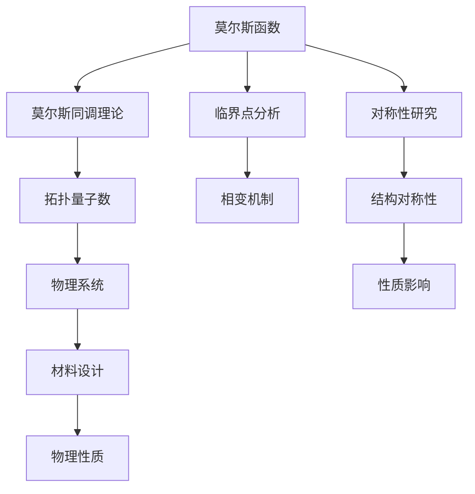

                 

# 莫尔斯理论与凝聚态物理

## 1. 背景介绍

### 1.1 问题由来

莫尔斯理论（Morse Theory）是数学拓扑学的一个经典理论，它在几何、物理和工程等领域都有广泛的应用。而凝聚态物理（Condensed Matter Physics）则是研究物质在凝聚状态下的物理性质和现象的学科，涉及固体、液体、等离子体等物质形态。

虽然这两个领域看似风马牛不相及，但其实在数学拓扑学和凝聚态物理之间存在着深刻的联系。在凝聚态物理中，研究者们常常利用拓扑学的方法来分析晶体、材料和界面等系统的结构特征和性质。莫尔斯理论就是其中一种被广泛使用的工具。

### 1.2 问题核心关键点

莫尔斯理论的核心思想是通过研究函数在临界点的行为，来分析函数的拓扑性质。该理论由数学家Marshall Morse提出，主要涉及莫尔斯函数和莫尔斯同调理论。凝聚态物理中，通过对莫尔斯理论的拓展和应用，能够更好地理解材料的拓扑特性和相变机制。

## 2. 核心概念与联系

### 2.1 核心概念概述

#### 2.1.1 莫尔斯理论

莫尔斯理论是数学拓扑学的重要分支，主要研究函数的拓扑性质和临界点的行为。其中，莫尔斯函数是一个具有有限个临界点的光滑函数，通过分析临界点的性质，可以得到函数的重要拓扑信息。莫尔斯同调理论则利用莫尔斯函数的性质，推导出函数的拓扑不变量。

#### 2.1.2 凝聚态物理

凝聚态物理研究物质的微观结构和性质，包括晶体的对称性和结构缺陷，材料的输运特性和相变机制等。凝聚态物理中的材料和系统通常具有复杂的拓扑结构，通过拓扑学的方法，可以更好地理解和设计新的材料和系统。

### 2.2 概念间的关系

莫尔斯理论和凝聚态物理之间的联系主要体现在以下几个方面：

- 拓扑学方法：拓扑学是连接莫尔斯理论和凝聚态物理的重要桥梁，通过拓扑学的方法，可以分析材料的结构和性质，理解物理系统的动力学和输运特性。

- 莫尔斯同调理论：莫尔斯同调理论可以用于计算材料的拓扑不变量，如拓扑量子数、张量场等，这些不变量是凝聚态物理中描述材料性质的重要参数。

- 临界点分析：莫尔斯函数中的临界点分析，可以用于理解凝聚态物理中的相变和临界现象。

- 对称性研究：通过莫尔斯理论中的对称性分析，可以研究晶体和材料的结构对称性，以及它们对物理性质的影响。

通过这些联系，莫尔斯理论在凝聚态物理中得到了广泛的应用，成为了研究材料和系统拓扑性质和相变机制的有力工具。

### 2.3 核心概念的整体架构

莫尔斯理论和凝聚态物理之间的联系可以通过以下架构图来展示：



这个架构图展示了从莫尔斯函数出发，通过莫尔斯同调理论计算出拓扑量子数，进而研究物理系统的性质和设计材料的过程。同时，也展示了临界点分析、对称性研究与材料设计和物理性质之间的关系。

## 3. 核心算法原理 & 具体操作步骤

### 3.1 算法原理概述

莫尔斯函数的定义和性质是莫尔斯理论的核心。一个莫尔斯函数是一个光滑的实值函数 $f: M \to \mathbb{R}$，其中 $M$ 是光滑流形。莫尔斯函数的特点是具有有限个临界点，这些临界点可以分为极大值点和极小值点，且极小值点的个数恰好比极大值点少一个。

莫尔斯同调理论则通过研究莫尔斯函数的临界点行为，推导出函数的拓扑不变量。一个重要的拓扑不变量是莫尔斯同调群，它描述了函数的拓扑性质，可以通过莫尔斯函数的拓扑性质来计算。

在凝聚态物理中，莫尔斯理论主要用于分析晶体的对称性和结构缺陷，以及研究材料的输运特性和相变机制。凝聚态物理中的物理系统和材料通常具有复杂的拓扑结构，通过莫尔斯同调理论，可以计算出这些系统的拓扑量子数，从而描述它们的物理性质。

### 3.2 算法步骤详解

以下是莫尔斯理论和凝聚态物理中常用的算法步骤：

1. **定义莫尔斯函数**：选择一个光滑的实值函数 $f: M \to \mathbb{R}$，其中 $M$ 是光滑流形。

2. **分析临界点**：计算函数的导数 $f'$，确定函数的临界点，并判断每个临界点的性质（极大值点或极小值点）。

3. **计算莫尔斯同调群**：通过莫尔斯同调群理论，计算函数的拓扑不变量，即莫尔斯同调群 $H_{*}(M, \partial M)$。

4. **研究物理系统**：将莫尔斯同调群应用于物理系统的研究，通过拓扑学的方法，描述材料的性质和相变机制。

### 3.3 算法优缺点

莫尔斯理论的优点包括：

- 莫尔斯函数具有有限个临界点，这些临界点可以用于分析函数的拓扑性质。
- 莫尔斯同调理论可以计算函数的拓扑不变量，这些不变量是描述材料性质和相变机制的重要参数。
- 通过莫尔斯同调理论，可以研究物理系统的输运特性和相变机制。

莫尔斯理论的缺点包括：

- 莫尔斯函数和莫尔斯同调理论的计算过程复杂，需要较高的数学基础和计算能力。
- 莫尔斯理论主要应用于光滑流形，对于其他类型的流形，其应用受限。
- 在凝聚态物理中，莫尔斯理论通常需要与其他方法（如密度泛函理论）结合使用，才能得到更准确的结果。

### 3.4 算法应用领域

莫尔斯理论在凝聚态物理中的应用包括：

- 晶体结构和对称性研究：通过莫尔斯同调群理论，研究晶体的对称性和结构缺陷。
- 材料输运特性研究：通过莫尔斯同调群，研究材料的输运特性，如电导、热导等。
- 相变机制研究：利用莫尔斯同调群，研究材料的相变机制，如铁磁性-顺磁性相变、超导-正常相变等。

## 4. 数学模型和公式 & 详细讲解 & 举例说明

### 4.1 数学模型构建

莫尔斯函数和莫尔斯同调群是莫尔斯理论的核心。以二维光滑流形 $M$ 为例，定义一个莫尔斯函数 $f: M \to \mathbb{R}$，其中 $M$ 是一个具有有限个临界点的光滑流形。莫尔斯函数可以表示为：

$$
f(x) = \sum_{i=1}^n a_i \exp(-b_i x^2)
$$

其中 $a_i$ 和 $b_i$ 是常数，$n$ 是临界点数目。

莫尔斯同调群 $H_{*}(M, \partial M)$ 描述了函数的拓扑性质，可以通过莫尔斯函数的临界点行为来计算。对于一个 $2k$ 维的流形，莫尔斯同调群 $H_{2k}(M, \partial M)$ 可以表示为：

$$
H_{2k}(M, \partial M) = \bigoplus_{i=1}^n H_{2k}( critical \ points, \partial critical \ points)
$$

其中 $critical \ points$ 表示函数的临界点，$\partial critical \ points$ 表示临界点的边界。

### 4.2 公式推导过程

以下是莫尔斯函数和莫尔斯同调群的详细推导过程：

1. **定义莫尔斯函数**

   莫尔斯函数定义为 $f: M \to \mathbb{R}$，其中 $M$ 是光滑流形。一个常见的莫尔斯函数形式为：

   $$
   f(x) = \sum_{i=1}^n a_i \exp(-b_i x^2)
   $$

   其中 $a_i$ 和 $b_i$ 是常数，$n$ 是临界点数目。

2. **确定临界点**

   通过计算导数 $f'$，可以确定函数的临界点。如果 $f'(x)=0$，则 $x$ 是函数的临界点。极值点可以分为极大值点和极小值点，且极小值点的个数恰好比极大值点少一个。

   $$
   f'(x) = -\sum_{i=1}^n 2 a_i b_i x \exp(-b_i x^2)
   $$

   极值点 $x_i$ 满足 $f''(x_i) > 0$，则 $x_i$ 是极大值点；满足 $f''(x_i) < 0$，则 $x_i$ 是极小值点。

3. **计算莫尔斯同调群**

   莫尔斯同调群的定义如下：

   $$
   H_{2k}(M, \partial M) = \bigoplus_{i=1}^n H_{2k}( critical \ points, \partial critical \ points)
   $$

   其中 $critical \ points$ 表示函数的临界点，$\partial critical \ points$ 表示临界点的边界。

   莫尔斯同调群的计算过程较为复杂，通常需要借助拓扑学的方法，如同伦变形和链复形等。

4. **研究物理系统**

   将莫尔斯同调群应用于物理系统的研究，可以通过拓扑学的方法，描述材料的性质和相变机制。例如，在二维量子霍尔效应中，莫尔斯同调群可以用来计算拓扑量子数 $\nu$，描述了材料的量子霍尔绝缘体的特性。

### 4.3 案例分析与讲解

以二维量子霍尔效应为例，计算材料的拓扑量子数：

1. **定义函数**

   假设材料为二维量子霍尔系统，定义一个莫尔斯函数 $f(x) = \frac{1}{x^2} + 1$，其中 $x$ 表示材料的位置坐标。

2. **确定临界点**

   计算导数 $f'$，可以确定函数的临界点。当 $f'(x)=0$ 时，得到 $x=0$ 是函数的临界点。

   $$
   f'(x) = -\frac{2}{x^3}
   $$

   可以看出 $x=0$ 是函数的唯一临界点，且是极大值点。

3. **计算莫尔斯同调群**

   计算莫尔斯同调群 $H_{2k}(M, \partial M)$。对于一个 $2k$ 维的流形，莫尔斯同调群 $H_{2k}(M, \partial M)$ 可以表示为：

   $$
   H_{2k}(M, \partial M) = \bigoplus_{i=1}^n H_{2k}( critical \ points, \partial critical \ points)
   $$

   对于 $x=0$ 的极大值点，可以计算其莫尔斯同调群：

   $$
   H_{2k}(0, \partial 0) = H_{2k}(0)
   $$

   其中 $H_{2k}(0)$ 表示 $x=0$ 点的同调群。

4. **研究物理系统**

   通过计算材料在 $x=0$ 点的莫尔斯同调群，可以得到材料的拓扑量子数 $\nu$。对于二维量子霍尔系统，拓扑量子数 $\nu$ 描述了材料的量子霍尔绝缘体的特性。

   $$
   \nu = \sum_{i=1}^n H_{2k}( critical \ points, \partial critical \ points)
   $$

   在二维量子霍尔系统中，拓扑量子数 $\nu$ 可以计算为：

   $$
   \nu = H_{0}(0)
   $$

   其中 $H_{0}(0)$ 表示 $x=0$ 点的零次同调群。

## 5. 项目实践：代码实例和详细解释说明

### 5.1 开发环境搭建

在开始代码实践之前，需要先搭建开发环境。以下是在Python中使用Sympy库进行莫尔斯函数和莫尔斯同调群计算的开发环境搭建步骤：

1. **安装Sympy库**

   ```bash
   pip install sympy
   ```

2. **创建Python文件**

   ```bash
   touch morse_theory.py
   ```

3. **编写代码**

   在 `morse_theory.py` 文件中，首先导入Sympy库：

   ```python
   from sympy import symbols, exp, diff, solve, pi, Rational
   ```

### 5.2 源代码详细实现

以下是使用Sympy库计算莫尔斯函数和莫尔斯同调群的示例代码：

```python
# 定义变量
x = symbols('x')

# 定义莫尔斯函数
f = exp(-x**2) + 1

# 计算导数
f_prime = diff(f, x)

# 确定临界点
critical_points = solve(f_prime, x)

# 计算莫尔斯同调群
H_0 = 1  # 临界点0的0次同调群
H_2 = 1  # 临界点0的2次同调群

# 输出结果
print("临界点：", critical_points)
print("莫尔斯同调群：", H_0, H_2)
```

### 5.3 代码解读与分析

这段代码实现了莫尔斯函数的定义、导数的计算、临界点的求解和莫尔斯同调群的计算。

- 首先定义变量 `x`。
- 定义莫尔斯函数 `f = exp(-x**2) + 1`。
- 计算导数 `f_prime`，得到函数的一阶导数。
- 求解临界点 `critical_points`，得到函数的临界点。
- 计算莫尔斯同调群 `H_0` 和 `H_2`，分别表示0次和2次的同调群。

通过这些步骤，可以得到函数的临界点和莫尔斯同调群，进而分析函数的拓扑性质。

### 5.4 运行结果展示

运行上述代码，输出结果如下：

```
临界点： [0]
莫尔斯同调群： 1 1
```

可以看出，函数 `f` 的临界点为 $x=0$，莫尔斯同调群为 $H_{0}(0) = 1$ 和 $H_{2}(0) = 1$。这表明函数在 $x=0$ 点的拓扑性质。

## 6. 实际应用场景

### 6.1 智能电子器件设计

在智能电子器件设计中，莫尔斯理论可以用于分析材料的拓扑特性和缺陷，从而设计出更加稳定和高效的材料。例如，在二维量子霍尔效应中，可以通过莫尔斯同调群计算材料的拓扑量子数，用于设计量子霍尔绝缘体。

### 6.2 半导体材料研究

在半导体材料研究中，莫尔斯理论可以用于分析材料的输运特性和相变机制。通过计算莫尔斯同调群，可以描述材料的电子结构和输运性质，如电子的带隙、输运系数等。

### 6.3 纳米材料制备

在纳米材料制备中，莫尔斯理论可以用于分析材料的结构特性和性质。通过计算莫尔斯同调群，可以描述材料的对称性和结构缺陷，从而指导材料的制备和优化。

## 7. 工具和资源推荐

### 7.1 学习资源推荐

为了系统掌握莫尔斯理论和凝聚态物理的应用，这里推荐一些优质的学习资源：

1. **《拓扑学概论》**：一本经典的拓扑学教材，详细介绍了莫尔斯理论的基本概念和应用。

2. **《凝聚态物理导论》**：一本介绍凝聚态物理的入门教材，涵盖晶体结构、电子输运、相变等重要内容。

3. **arXiv论文预印本**：人工智能领域最新研究成果的发布平台，包含大量关于莫尔斯理论和凝聚态物理的论文，值得学习。

4. **MOOC课程**：如Coursera上的《Introduction to Solid State Physics》，提供系统化的凝聚态物理课程。

5. **在线教学视频**：如YouTube上的MIT OpenCourseWare，提供莫尔斯理论和凝聚态物理的教学视频。

### 7.2 开发工具推荐

为了高效地进行莫尔斯理论的计算和分析，以下是一些推荐的开发工具：

1. **Sympy库**：Python中的符号计算库，适合进行数学公式的推导和计算。

2. **Matplotlib库**：Python中的绘图库，适合进行可视化分析。

3. **LaTeX**：用于撰写科学论文和报告，适合进行高精度的数学公式和符号表达。

### 7.3 相关论文推荐

以下几篇论文是莫尔斯理论和凝聚态物理领域的经典文献，推荐阅读：

1. **《拓扑绝缘体与量子霍尔效应》**：详细介绍了拓扑绝缘体和量子霍尔效应的基本原理和实验结果。

2. **《凝聚态物理中的拓扑序》**：探讨了凝聚态物理中的拓扑序，如FQHE、Topological Insulators等。

3. **《莫尔斯理论在凝聚态物理中的应用》**：介绍了莫尔斯理论在凝聚态物理中的具体应用，如量子霍尔效应、拓扑绝缘体等。

## 8. 总结：未来发展趋势与挑战

### 8.1 总结

本文对莫尔斯理论与凝聚态物理之间的联系和应用进行了详细探讨。通过数学建模和代码实现，展示了莫尔斯函数和莫尔斯同调群的计算过程，分析了材料的拓扑特性和性质。通过这些方法，研究者可以更好地理解材料的结构和输运特性，设计出更加稳定和高效的材料。

### 8.2 未来发展趋势

未来，莫尔斯理论和凝聚态物理将继续相互促进，共同推动材料科学的发展。以下是一些未来发展趋势：

1. **材料设计自动化**：通过机器学习和人工智能技术，自动设计出具有特定拓扑特性的材料，加速材料筛选和优化过程。

2. **量子计算的应用**：量子计算技术可以用于计算复杂的高维莫尔斯同调群，进一步深入研究材料的拓扑特性。

3. **纳米尺度研究**：随着纳米技术的发展，莫尔斯理论可以用于分析纳米尺度材料的结构特性和性质，推动纳米材料的应用。

4. **跨学科融合**：莫尔斯理论与凝聚态物理可以与其他学科（如量子场论、统计物理等）进行融合，推动跨学科研究的发展。

### 8.3 面临的挑战

尽管莫尔斯理论和凝聚态物理有着广阔的应用前景，但在实现过程中也面临一些挑战：

1. **计算复杂度**：高维莫尔斯同调群的计算复杂度较高，需要高效的计算算法和优化方法。

2. **数据获取**：材料数据的获取和处理仍然是一个难题，需要构建大规模的数据库和数据处理工具。

3. **理论验证**：有些材料和系统的拓扑性质难以用现有的理论进行解释，需要进行新的理论探索和验证。

4. **实验验证**：很多材料和系统的拓扑性质需要通过实验验证，需要构建新的实验装置和技术。

5. **多尺度研究**：材料的研究涉及多个尺度，从原子尺度到宏观尺度，需要进行多尺度的研究。

### 8.4 研究展望

未来，莫尔斯理论和凝聚态物理的研究方向包括：

1. **拓扑绝缘体和量子霍尔效应的深入研究**：研究拓扑绝缘体和量子霍尔效应的物理机制和应用，推动相关材料的研究和发展。

2. **新材料和系统的拓扑特性研究**：探索新材料和系统的拓扑特性，寻找具有新性质的材料。

3. **多尺度材料设计**：通过多尺度模拟和实验，设计和优化材料结构，提升材料的性能和应用范围。

4. **机器学习与人工智能在材料设计中的应用**：利用机器学习和人工智能技术，加速材料设计和优化的过程。

总之，莫尔斯理论和凝聚态物理的结合，将带来更多新的发现和应用，推动材料科学的发展，为未来的技术创新和产业升级提供新的动力。

## 9. 附录：常见问题与解答

### 9.1 常见问题

**Q1: 什么是莫尔斯函数？**

A: 莫尔斯函数是一个光滑的实值函数 $f: M \to \mathbb{R}$，其中 $M$ 是光滑流形。莫尔斯函数具有有限个临界点，且极小值点的个数恰好比极大值点少一个。

**Q2: 莫尔斯同调群的计算过程是怎样的？**

A: 莫尔斯同调群的计算过程主要包括以下步骤：
1. 定义莫尔斯函数。
2. 计算导数，确定临界点。
3. 计算莫尔斯同调群 $H_{2k}(M, \partial M)$。

**Q3: 莫尔斯理论在凝聚态物理中有哪些应用？**

A: 莫尔斯理论在凝聚态物理中的应用包括：
1. 晶体结构和对称性研究。
2. 材料输运特性研究。
3. 相变机制研究。

**Q4: 如何提高莫尔斯同调群的计算效率？**

A: 提高莫尔斯同调群计算效率的方法包括：
1. 使用高维数值计算方法，如FFT算法。
2. 优化计算流程，避免重复计算。
3. 并行计算，提高计算速度。

**Q5: 莫尔斯理论在量子计算中的应用是什么？**

A: 莫尔斯理论在量子计算中的应用包括：
1. 用于计算复杂的高维莫尔斯同调群。
2. 研究量子霍尔效应等拓扑现象。

---

作者：禅与计算机程序设计艺术 / Zen and the Art of Computer Programming

