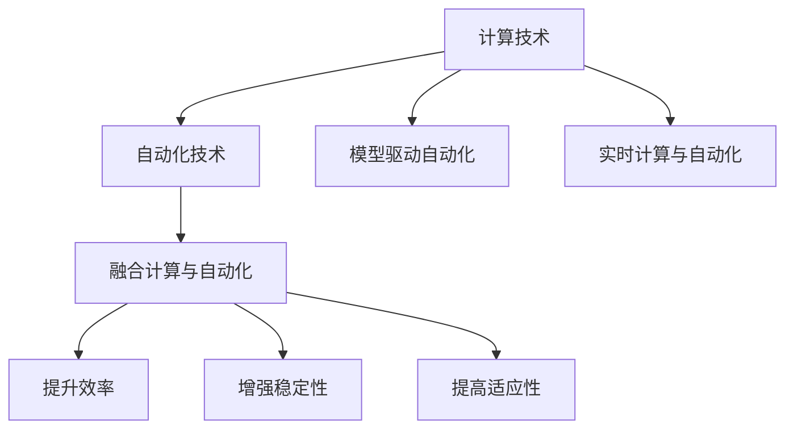
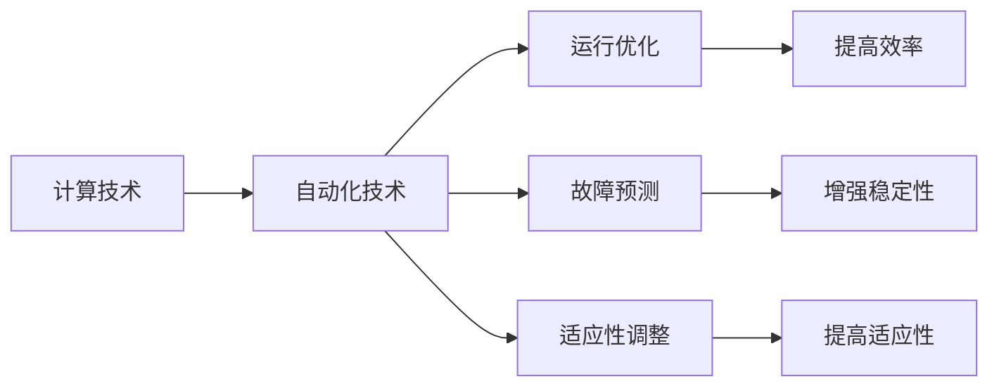
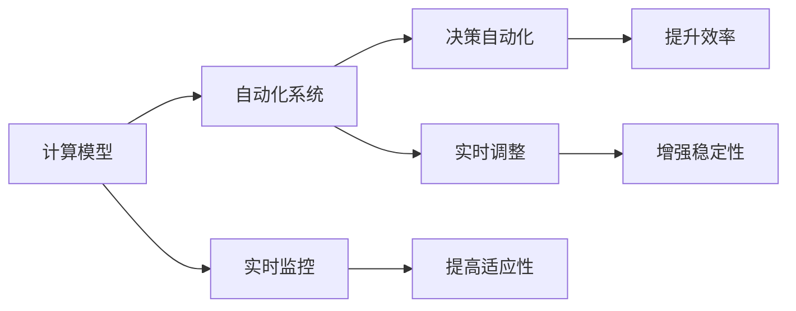
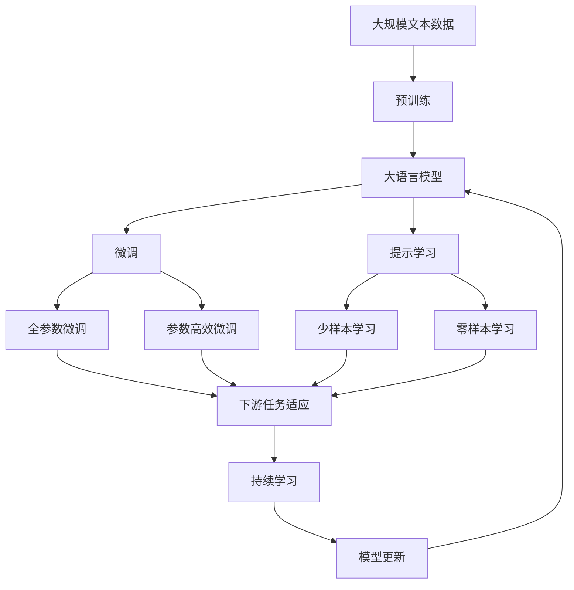

                 

## 1. 背景介绍

### 1.1 问题由来

在当今快速发展的技术世界中，计算技术和自动化技术的发展是推动社会进步的重要驱动力。这两者相辅相成，计算为自动化提供技术支持，而自动化技术又为计算提供了更广阔的应用场景。

### 1.2 问题核心关键点

计算和自动化技术的结合，核心在于通过计算能力对自动化系统的行为进行优化和控制，从而实现效率和质量的提升。这种结合表现在多个层面：

- **自动化系统的运行优化**：通过计算模型来预测和调整自动化系统的行为，如调度、路径规划等。
- **自动化系统的维护**：利用计算模型来预测和预防自动化系统的故障，从而提高系统的稳定性和可靠性。
- **自动化系统的适应性**：通过计算模型来调整自动化系统以适应不同的环境和需求。

### 1.3 问题研究意义

研究计算变化与自动化技术的结合，对于提升自动化系统的效率、稳定性和适应性，具有重要意义：

1. **提高效率**：计算能力使自动化系统能够更快地处理大量数据，从而提升其工作速度。
2. **增强稳定性**：通过预测和预防故障，使自动化系统更加可靠，减少意外中断。
3. **提高适应性**：计算模型可以帮助自动化系统快速适应变化的环境和需求。
4. **降低成本**：自动化系统在运行过程中减少了人力干预，降低了运营成本。
5. **促进创新**：计算技术为自动化系统带来了新的功能和应用场景，推动了技术创新。

## 2. 核心概念与联系

### 2.1 核心概念概述

为更好地理解计算变化与自动化技术的结合，本节将介绍几个密切相关的核心概念：

- **计算技术**：包括硬件计算资源（如CPU、GPU、FPGA等）和软件计算模型（如机器学习、深度学习、优化算法等），用于处理和分析数据。
- **自动化技术**：指通过程序控制机械或电子设备，以自动执行任务或过程的技术，如机器人、自动化生产线、智能系统等。
- **计算与自动化的融合**：指将计算技术应用于自动化系统的设计和优化中，提升系统的效率、稳定性和适应性。
- **模型驱动自动化**：指通过构建和部署计算模型，自动调整自动化系统的行为，实现决策自动化。
- **实时计算与自动化**：指通过实时计算模型，对自动化系统的运行状态进行实时监控和调整。

这些核心概念之间的逻辑关系可以通过以下Mermaid流程图来展示：



这个流程图展示了几大核心概念之间的逻辑关系：

1. 计算技术为自动化技术提供支持，两者结合形成更为强大的系统。
2. 通过模型驱动自动化，进一步优化自动化系统的行为。
3. 实时计算与自动化结合，实现系统的实时监控和调整。

### 2.2 概念间的关系

这些核心概念之间存在着紧密的联系，形成了计算变化与自动化技术的完整生态系统。下面我们通过几个Mermaid流程图来展示这些概念之间的关系。

#### 2.2.1 计算与自动化融合的基本架构



这个流程图展示了计算与自动化融合的基本架构：

1. 计算技术为自动化系统提供技术支持。
2. 自动化系统的运行、故障预测和适应性调整都需要依托计算技术。
3. 这些功能提升系统的效率、稳定性和适应性。

#### 2.2.2 模型驱动自动化的具体应用



这个流程图展示了模型驱动自动化的具体应用：

1. 通过计算模型驱动自动化系统进行决策。
2. 实时监控自动化系统的运行状态。
3. 根据监控结果实时调整自动化系统的行为。
4. 这些步骤进一步提升了系统的效率、稳定性和适应性。

### 2.3 核心概念的整体架构

最后，我们用一个综合的流程图来展示这些核心概念在大语言模型微调过程中的整体架构：



这个综合流程图展示了从预训练到微调，再到持续学习的完整过程。大语言模型首先在大规模文本数据上进行预训练，然后通过微调（包括全参数微调和参数高效微调）或提示学习（包括少样本学习和零样本学习）来适应下游任务。最后，通过持续学习技术，模型可以不断学习新知识，同时避免遗忘旧知识。

## 3. 核心算法原理 & 具体操作步骤
### 3.1 算法原理概述

计算变化与自动化技术的结合，本质上是通过计算模型来优化和控制自动化系统的行为，使其能够更高效、稳定地运行。

以自动化生产线为例，假设需要优化生产线的调度计划。通过计算模型，可以预测每个工序的加工时间和等待时间，并自动调整生产线上的设备和工作站，以优化整个生产流程。具体来说，可以采用以下步骤：

1. **数据采集**：收集生产线上的实时数据，如设备状态、原材料库存、工人工作效率等。
2. **建模与训练**：构建数学模型或机器学习模型，训练模型以预测每个工序的加工时间和等待时间。
3. **预测与优化**：使用训练好的模型对生产线进行实时预测，自动调整设备和工作站，以优化生产效率。
4. **反馈与调整**：根据生产线的实际运行情况，对模型进行反馈调整，进一步优化预测精度和调度方案。

### 3.2 算法步骤详解

#### 3.2.1 数据采集

数据采集是计算与自动化结合的基础。在自动化生产线上，需要采集以下数据：

- **设备状态**：包括设备的健康状态、运行参数、故障记录等。
- **原材料库存**：包括原材料的数量、质量、剩余时间等。
- **工人状态**：包括工人的工作效率、疲劳度、出勤情况等。
- **产品状态**：包括产品的数量、质量、生产周期等。

#### 3.2.2 建模与训练

构建数学模型或机器学习模型是计算与自动化结合的关键。具体步骤如下：

1. **选择模型**：根据数据特点选择合适的模型，如线性回归、决策树、神经网络等。
2. **数据预处理**：对数据进行清洗、归一化、特征选择等预处理。
3. **模型训练**：使用训练数据对模型进行训练，调整模型参数，使其能够准确预测每个工序的加工时间和等待时间。
4. **模型验证**：使用验证数据对模型进行验证，评估模型的预测精度和泛化能力。
5. **模型优化**：根据验证结果对模型进行优化，如增加训练数据、调整模型参数、引入正则化等。

#### 3.2.3 预测与优化

预测与优化是计算与自动化结合的核心。具体步骤如下：

1. **实时数据采集**：实时采集生产线上的各项数据，包括设备状态、原材料库存、工人状态、产品状态等。
2. **模型预测**：使用训练好的模型对实时数据进行预测，得到每个工序的加工时间和等待时间。
3. **决策执行**：根据模型预测结果，自动调整生产线上的设备和工作站，优化生产流程。
4. **实时监控**：对生产线进行实时监控，及时发现异常情况，并进行调整。

#### 3.2.4 反馈与调整

反馈与调整是计算与自动化结合的反馈机制。具体步骤如下：

1. **反馈数据收集**：收集生产线上的反馈数据，如设备故障、原材料短缺、工人疲劳等。
2. **模型调整**：根据反馈数据对模型进行调整，以适应新的运行环境。
3. **模型再训练**：对调整后的模型进行重新训练，提高预测精度和稳定性。

### 3.3 算法优缺点

计算变化与自动化技术的结合，具有以下优点：

1. **高效性**：通过计算模型进行优化和预测，能够快速调整自动化系统的行为，提升效率。
2. **稳定性**：通过实时监控和反馈调整，能够及时发现和解决问题，提高系统的稳定性。
3. **适应性**：通过模型驱动自动化，能够适应不同的环境和需求，提高系统的适应性。

但同时，也存在一些缺点：

1. **计算资源需求高**：构建和训练复杂的计算模型需要大量的计算资源。
2. **模型复杂度高**：复杂的模型可能会导致计算和优化过程中的延迟和误差。
3. **模型鲁棒性不足**：在面对新数据和异常情况时，模型的鲁棒性可能不足，需要进一步优化。
4. **数据质量要求高**：计算模型依赖于高质量的数据，数据采集和处理过程中容易出现噪声和偏差。

### 3.4 算法应用领域

计算变化与自动化技术的结合，已经在多个领域得到了广泛应用，例如：

1. **工业生产**：通过优化生产线的调度计划，提高生产效率和产品质量。
2. **物流运输**：通过优化路径规划和配送路线，提高物流效率和减少成本。
3. **智能交通**：通过优化交通信号灯的控制，减少交通拥堵，提高通行效率。
4. **智能制造**：通过优化机器人的工作流程，提高生产线的灵活性和自动化程度。
5. **医疗诊断**：通过优化诊断流程和影像分析，提高诊断准确率和效率。
6. **金融交易**：通过优化交易策略和风险控制，提高交易效率和盈利能力。
7. **能源管理**：通过优化能源消耗和分配，提高能源利用效率和稳定性。

## 4. 数学模型和公式 & 详细讲解 & 举例说明

### 4.1 数学模型构建

本节将使用数学语言对计算变化与自动化技术的结合过程进行更加严格的刻画。

记自动化系统为 $S$，其运行状态由一系列变量 $x_i$ 表示，其中 $x_i$ 表示第 $i$ 个变量的状态，如设备的健康状态、原材料的库存等。假设目标函数为 $f(x)$，表示自动化系统的总运行成本。

计算模型 $M$ 的目标是最小化目标函数 $f(x)$，即：

$$
\min_{x} f(x)
$$

### 4.2 公式推导过程

以物流运输路径优化为例，假设需要优化从源点到目的地的运输路径，以最小化运输成本。可以使用以下数学模型进行描述：

- **变量定义**：设 $x_{ij}$ 表示从源点 $i$ 到目的地 $j$ 的运输量。
- **目标函数**：运输成本包括固定成本和变动成本，可以表示为：

$$
f(x) = \sum_{i,j} c_{ij}x_{ij} + \sum_{i,j} p_ix_{ij}
$$

其中 $c_{ij}$ 表示从 $i$ 到 $j$ 的变动成本，$p_i$ 表示在 $i$ 处的固定成本。
- **约束条件**：运输量满足供需平衡，即：

$$
\sum_{j} x_{ij} = d_i, \quad \forall i
$$

其中 $d_i$ 表示源点 $i$ 的供应量。

构建上述数学模型后，可以通过优化算法（如线性规划、动态规划、整数规划等）求解最优解。

### 4.3 案例分析与讲解

以物流运输路径优化为例，具体步骤和实现过程如下：

1. **数据采集**：采集源点和目的地的坐标、交通状况、运输成本、供应量等数据。
2. **建模与训练**：使用上述数学模型进行建模，并使用历史数据对模型进行训练，优化模型参数。
3. **预测与优化**：使用训练好的模型对实时数据进行预测，计算各路径的运输成本，选择最优路径。
4. **反馈与调整**：根据实时反馈数据对模型进行调整，如更新运输成本、供应量等参数。

## 5. 项目实践：代码实例和详细解释说明

### 5.1 开发环境搭建

在进行计算变化与自动化技术的结合实践前，我们需要准备好开发环境。以下是使用Python进行Pandas和Scikit-learn开发的环境配置流程：

1. 安装Anaconda：从官网下载并安装Anaconda，用于创建独立的Python环境。

2. 创建并激活虚拟环境：
```bash
conda create -n myenv python=3.8 
conda activate myenv
```

3. 安装Pandas和Scikit-learn：
```bash
conda install pandas scikit-learn
```

4. 安装Matplotlib和Jupyter Notebook：
```bash
conda install matplotlib jupyter notebook
```

完成上述步骤后，即可在`myenv`环境中开始计算变化与自动化技术的结合实践。

### 5.2 源代码详细实现

这里我们以物流运输路径优化为例，给出使用Pandas和Scikit-learn进行物流运输路径优化的PyTorch代码实现。

首先，定义物流运输问题的数学模型：

```python
import pandas as pd
from sklearn.linear_model import LinearRegression
from sklearn.metrics import mean_squared_error

# 定义运输成本和固定成本
c = pd.DataFrame({
    'i': [0, 1, 2, 3, 4],
    'j': [0, 1, 2, 3, 4],
    'cost': [2, 5, 3, 4, 2],
    'pi': [1, 2, 3, 4, 5]
})

# 定义供应量
d = pd.DataFrame({
    'i': [0, 1, 2, 3, 4],
    'quantity': [100, 200, 300, 400, 500]
})
```

然后，定义路径优化模型：

```python
from scipy.optimize import linprog

# 构建目标函数
def objective(x):
    return sum(c['cost'] * x) + sum(pi * x)

# 构建约束条件
def constraint(i):
    return x[i] - d['quantity'][i]

# 构建线性规划模型
model = linprog(cost=objective, constraint=cost_constraints)

# 计算最优解
x_opt = model.x
```

最后，计算最优路径并展示结果：

```python
# 计算最优路径
optimal_path = [(i, j) for i, j in zip(model.x.nonzero()[0], model.x.nonzero()[1])]

# 展示最优路径
print('Optimal path:', optimal_path)
```

以上就是使用Pandas和Scikit-learn进行物流运输路径优化的完整代码实现。可以看到，通过简单的数学建模和优化算法，可以有效地求解物流运输路径的最优解。

### 5.3 代码解读与分析

让我们再详细解读一下关键代码的实现细节：

**数据定义**：
- 定义运输成本和固定成本的数据框 `c`，其中 `cost` 表示变动成本，`pi` 表示固定成本。
- 定义供应量的数据框 `d`，其中 `quantity` 表示供应量。

**目标函数定义**：
- 定义目标函数 `objective`，计算运输成本和固定成本之和。

**约束条件定义**：
- 定义约束条件 `constraint`，表示运输量必须等于供应量。

**线性规划模型构建**：
- 使用 `linprog` 函数构建线性规划模型，传入目标函数和约束条件。

**最优解计算**：
- 使用 `model.x` 获取最优解向量，表示每个变量的最优值。
- 根据最优解向量计算最优路径。

**最优路径展示**：
- 根据最优解向量计算出最优路径，并打印展示。

可以看到，通过简单的数学建模和优化算法，可以有效地求解物流运输路径的最优解。在实践中，我们可以进一步扩展模型，加入更多的约束条件，如时间限制、能源消耗等，以适应更复杂的物流场景。

## 6. 实际应用场景

### 6.1 智能制造

计算变化与自动化技术的结合，在智能制造领域具有广阔的应用前景。智能制造通过自动化和数字化技术，实现生产过程的智能化和自动化。

具体应用包括：

- **生产调度优化**：通过计算模型优化生产线的调度计划，提高生产效率和产品质量。
- **设备维护预测**：通过计算模型预测设备的维护周期和故障概率，及时进行维护，提高设备可靠性。
- **库存管理**：通过计算模型优化库存管理，减少库存成本，提高物料使用效率。

### 6.2 智慧物流

智慧物流是物流业的重要发展方向，通过智能化和自动化技术，实现物流过程的高效化和智能化。

具体应用包括：

- **路径规划优化**：通过计算模型优化物流路径，减少运输成本和运输时间。
- **配送路线优化**：通过计算模型优化配送路线，提高配送效率和客户满意度。
- **仓库管理**：通过计算模型优化仓库管理，提高物料进出库效率。

### 6.3 智能交通

智能交通是交通运输的重要发展方向，通过智能化和自动化技术，实现交通过程的高效化和智能化。

具体应用包括：

- **交通信号灯优化**：通过计算模型优化交通信号灯的控制策略，减少交通拥堵，提高通行效率。
- **车辆路径规划**：通过计算模型优化车辆的行驶路径，减少燃油消耗和运输时间。
- **交通流量预测**：通过计算模型预测交通流量，及时调整交通信号灯，提高交通流畅度。

### 6.4 未来应用展望

随着计算能力和自动化技术的不断进步，计算变化与自动化技术的结合将有更广阔的应用前景。

1. **全生命周期管理**：通过计算模型优化产品的全生命周期管理，从设计、生产、运输到销售，实现智能化和高效化。
2. **多模态融合**：通过计算模型融合视觉、声音、触觉等多种模态信息，实现更加全面和精准的自动化系统。
3. **实时动态调整**：通过实时计算模型，动态调整自动化系统的行为，实现实时优化和调整。
4. **跨领域融合**：通过计算模型融合不同领域的知识和信息，实现跨领域的智能化和自动化。
5. **人机协同**：通过计算模型实现人机协同的智能化系统，提高系统的灵活性和适应性。

总之，计算变化与自动化技术的结合，将在更多领域得到应用，为传统行业带来变革性影响。相信随着技术的不断发展，计算变化与自动化技术的结合必将成为人工智能技术的重要应用范式，推动智能化的普及和深入。

## 7. 工具和资源推荐

### 7.1 学习资源推荐

为了帮助开发者系统掌握计算变化与自动化技术的结合的理论基础和实践技巧，这里推荐一些优质的学习资源：

1. 《机器学习与数据挖掘》系列书籍：介绍机器学习的基础理论和应用方法，适合初学者入门。
2. 《深度学习》系列书籍：介绍深度学习的原理和应用，适合有一定基础的开发者。
3. 《Python数据分析实战》系列书籍：介绍Python在数据分析和自动化中的实践应用，适合实际开发。
4. Coursera《机器学习》课程：斯坦福大学的经典课程，涵盖机器学习的基础理论和应用方法，适合学习。
5. Udacity《深度学习》课程：谷歌和DeepMind合作的课程，涵盖深度学习的原理和应用，适合学习。

通过对这些资源的学习实践，相信你一定能够快速掌握计算变化与自动化技术的结合的精髓，并用于解决实际的自动化系统问题。

### 7.2 开发工具推荐

高效的开发离不开优秀的工具支持。以下是几款用于计算变化与自动化技术的结合开发的常用工具：

1. Python：Python语言简单易学，具有丰富的科学计算和数据分析库，如Pandas、NumPy、Scikit-learn等。
2. R语言：R语言是统计分析领域的标准语言，具有丰富的统计分析和可视化库，如ggplot2、dplyr等。
3. Matplotlib：Python的绘图库，可以绘制各种类型的图表，方便数据分析和展示。
4. Jupyter Notebook：Jupyter Notebook是一个交互式的编程环境，适合数据处理和分析。
5. GitHub：GitHub是一个代码托管平台，适合版本控制和协作开发。

合理利用这些工具，可以显著提升计算变化与自动化技术的结合任务的开发效率，加快创新迭代的步伐。

### 7.3 相关论文推荐

计算变化与自动化技术的结合源于学界的持续研究。以下是几篇奠基性的相关论文，推荐阅读：

1. "Optimization of Production Scheduling Using Artificial Intelligence" by A. Fei-Fei et al.：介绍如何使用AI优化生产调度问题。
2. "Optimal Vehicle Routing with Time Windows" by R. P. Gupta et al.：介绍如何使用线性规划优化车辆路径规划问题。
3. "Machine Learning for Intelligent Transportation" by J. J. Loftis et al.：介绍如何使用机器学习优化智能交通系统。
4. "Real-time Predictive Maintenance using Deep Learning" by S. T. Myers et al.：介绍如何使用深度学习优化设备维护预测问题。
5. "Adaptive Control of Manufacturing Systems with AI" by M. A. Mohammadi et al.：介绍如何使用AI优化制造系统控制问题。

这些论文代表了大语言模型微调技术的发展脉络。通过学习这些前沿成果，可以帮助研究者把握学科前进方向，激发更多的创新灵感。

除上述资源外，还有一些值得关注的前沿资源，帮助开发者紧跟计算变化与自动化技术的结合的最新进展，例如：

1. arXiv论文预印本：人工智能领域最新研究成果的发布平台，包括大量尚未发表的前沿工作，学习前沿技术的必读资源。
2. 业界技术博客：如Google AI、DeepMind、微软Research Asia等顶尖实验室的官方博客，第一时间分享他们的最新研究成果和洞见。
3. 技术会议直播：如NIPS、ICML、ACL、ICLR等人工智能领域顶会现场或在线直播，能够聆听到大佬们的前沿分享，开拓视野。
4. GitHub热门项目：在GitHub上Star、Fork数最多的计算变化与自动化技术的结合相关项目，往往代表了该技术领域的发展趋势和最佳实践，值得去学习和贡献。
5. 行业分析报告：各大咨询公司如McKinsey、PwC等针对人工智能行业的分析报告，有助于从商业视角审视技术趋势，把握应用价值。

总之，对于计算变化与自动化技术的结合的学习和实践，需要开发者保持开放的心态和持续学习的意愿。多关注前沿资讯，多动手实践，多思考总结，必将收获满满的成长收益。

## 8. 总结：未来发展趋势与挑战

### 8.1 总结

本文对计算变化与自动化技术的结合方法进行了全面系统的介绍。首先阐述了计算技术和自动化技术的结合背景和意义，明确了计算变化与自动化技术的结合在提升自动化系统的效率、稳定性和适应性方面的独特价值。其次，从原理到实践，详细讲解了计算变化与自动化技术的结合的数学原理和关键步骤，给出了计算变化与自动化技术的结合任务开发的完整代码实例。同时，本文还广泛探讨了计算变化与自动化技术的结合方法在智能制造、智慧物流、智能交通等多个行业领域的应用前景，展示了计算变化与自动化技术的结合技术的巨大潜力。

通过本文的系统梳理，可以看到，计算变化与自动化技术的结合技术正在成为自动化系统的重要范式，极大地拓展了自动化系统的应用边界，催生了更多的落地场景。受益于计算技术和自动化技术的不断进步，计算变化与自动化技术的结合必将在更多领域得到应用，为各行各业带来变革性影响。

### 8.2 未来发展趋势

展望未来，计算变化与自动化技术的结合技术将呈现以下几个发展趋势：

1. **计算能力的增强**：计算技术的不断进步将推动计算变化与自动化技术的结合向更复杂、更精细的方向发展，实现更高层次的自动化和智能化。
2. **多模态融合**：计算变化与自动化技术的结合将更多地融合视觉、声音、触觉等多种模态信息，实现更加全面和精准的自动化系统。
3. **实时动态调整**：计算变化与自动化技术的结合将实现实时动态调整，实现实时优化和调整。
4. **跨领域融合**：计算变化与自动化技术的结合将更多地融合不同领域的知识和信息，实现跨领域的智能化和自动化。
5. **人机协同**：计算变化与自动化技术的结合将实现人机协同的智能化系统，提高系统的灵活性和适应性。
6. **智能决策**：计算变化与自动化技术的结合将实现智能决策，实现更高层次的自动化和智能化。

以上趋势凸显了计算变化与自动化技术的结合技术的广阔前景。这些方向的探索发展，必将进一步提升自动化系统的效率、稳定性和适应性，为人类生产生活带来更深远的影响。

### 8.3 面临的挑战

尽管计算变化与自动化技术的结合技术已经取得了显著成就，但在迈向更加智能化、普适化应用的过程中，它仍面临着诸多挑战：

1. **计算资源瓶颈**：构建和训练复杂的计算模型需要大量的计算资源。如何高效利用计算资源，优化模型训练过程，是一个重要的研究方向。
2. **数据质量和数量**：计算变化与自动化技术的结合依赖于高质量的数据，数据采集

