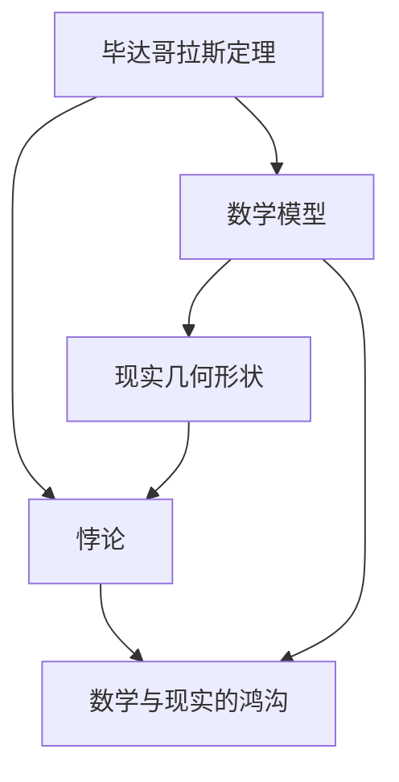
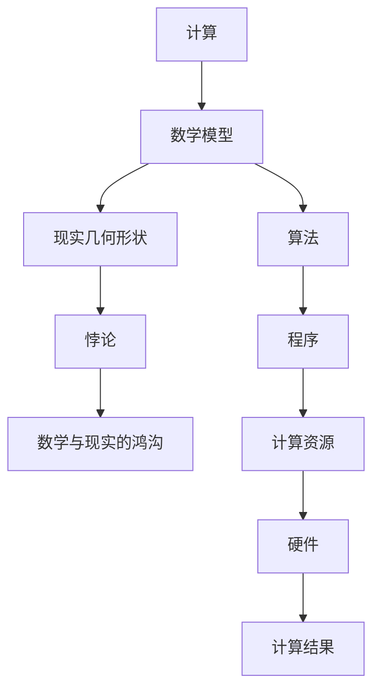

                 

# 计算：第一部分 计算的诞生 第 1 章 毕达哥拉斯的困惑 悖论：推理的暗面

在人类文明的长河中，计算的诞生犹如一颗璀璨的星辰，照亮了人类对世界认知的道路。本章将带你走进这个由古希腊哲学家毕达哥拉斯引发的思考，深入探讨计算的根本悖论，以及这些悖论如何影响着我们理解和应用计算的方式。

## 1. 背景介绍

### 1.1 毕达哥拉斯的发现

毕达哥拉斯，古希腊的哲学家和数学家，被誉为“数字之主”。他在数学和哲学领域的贡献，至今仍为人称道。但毕达哥拉斯最为人所知的发现，莫过于毕达哥拉斯定理，即直角三角形两直角边平方和等于斜边平方的定理。这一发现不仅奠定了现代几何学的基础，也揭示了数学与现实世界的紧密联系。

### 1.2 数学与现实的悖论

然而，毕达哥拉斯定理的发现也带来了一个深层的悖论：数学能够完美地描述现实世界，但现实的几何形状却不能完美地满足数学公式。这促使毕达哥拉斯及其追随者思考，数学与现实之间是否存在某种不可逾越的鸿沟？

## 2. 核心概念与联系

### 2.1 核心概念概述

为了深入探讨这一悖论，我们需要理解以下核心概念：

- **毕达哥拉斯定理**：直角三角形两直角边平方和等于斜边平方的定理，是现代几何学的基石。
- **数学模型**：将现实世界抽象为数学公式的描述，用于分析和解决问题。
- **现实几何形状**：物理世界的几何形态，如直线、圆、三角形等。
- **悖论**：数学与现实之间不可调和的矛盾。

### 2.2 核心概念之间的关系

这些核心概念之间的逻辑关系可以通过以下Mermaid流程图来展示：



这个流程图展示了毕达哥拉斯定理如何引发数学与现实之间的悖论，进而导致了数学与现实的鸿沟。数学模型虽然能够完美描述几何形状，但现实几何形状往往不符合数学公式，这就产生了悖论。

### 2.3 核心概念的整体架构

最后，我们用一个综合的流程图来展示这些核心概念在大规模计算中的整体架构：



这个综合流程图展示了从数学模型到计算结果的整个过程，以及其中可能遇到的各种悖论和鸿沟。

## 3. 核心算法原理 & 具体操作步骤

### 3.1 算法原理概述

计算的悖论源于数学与现实的不可调和，而这一悖论在大规模计算中尤为显著。主要体现在以下几个方面：

- **数据与现实的鸿沟**：大规模计算依赖于大量的数据，但现实世界的数据往往复杂且不完整，导致计算结果与现实世界存在偏差。
- **计算与数学的鸿沟**：计算的精确性依赖于算法的准确性，但算法本身可能存在不可调和的数学悖论，导致计算结果的不确定性。
- **资源与现实的鸿沟**：计算资源有限，但现实世界的复杂性使得计算过程难以简化，导致计算效率低下。

### 3.2 算法步骤详解

基于上述悖论，大规模计算的算法步骤可以总结为以下几类：

1. **数据预处理**：对现实世界的数据进行清洗、标注、分类等预处理，以便于计算。
2. **算法选择**：根据具体问题选择合适的算法，如回归、分类、优化等。
3. **模型训练**：使用历史数据对模型进行训练，找到最优的模型参数。
4. **结果验证**：使用测试数据对模型进行验证，评估模型的泛化能力。
5. **优化调整**：根据验证结果对模型进行优化调整，如调整学习率、增加正则化等。
6. **结果应用**：将模型应用于实际问题，预测结果。

### 3.3 算法优缺点

大规模计算的算法具有以下优点：

- **数据驱动**：通过大量数据驱动模型，可以发现现实世界的规律。
- **模型精确**：经过充分训练的模型，能够提供高度准确的预测结果。
- **可扩展性**：随着计算资源的增加，可以处理更复杂的问题。

但同时也存在以下缺点：

- **数据依赖**：依赖高质量、大量的数据，数据质量差时难以保证结果准确性。
- **计算复杂**：算法复杂度高，计算资源需求大，难以处理大规模问题。
- **模型泛化**：过度依赖历史数据，可能无法适应新情况，导致过拟合。

### 3.4 算法应用领域

大规模计算的算法广泛应用于以下领域：

- **金融风险管理**：使用历史数据进行风险预测，评估投资组合的稳健性。
- **医疗诊断**：基于患者历史数据，预测疾病风险，制定治疗方案。
- **自动驾驶**：通过大量传感器数据，进行路径规划和避障决策。
- **智能推荐**：根据用户行为数据，推荐个性化的商品或内容。
- **自然语言处理**：使用文本数据，进行情感分析、机器翻译等任务。

## 4. 数学模型和公式 & 详细讲解 & 举例说明

### 4.1 数学模型构建

在大规模计算中，数学模型的构建是至关重要的。我们以金融风险管理为例，构建一个简单的数学模型：

- **输入**：历史金融市场数据。
- **输出**：未来金融市场的价格波动。
- **模型**：线性回归模型。

### 4.2 公式推导过程

线性回归模型的公式为：

$$ y = \beta_0 + \beta_1 x_1 + \beta_2 x_2 + ... + \beta_n x_n + \epsilon $$

其中，$y$ 表示预测结果，$x_i$ 表示输入特征，$\beta_i$ 表示模型参数，$\epsilon$ 表示误差项。

### 4.3 案例分析与讲解

假设我们有一组历史金融市场数据，通过线性回归模型预测未来的市场波动，其步骤如下：

1. **数据收集**：收集历史市场价格数据。
2. **数据预处理**：对数据进行清洗、归一化等预处理。
3. **模型训练**：使用历史数据训练线性回归模型。
4. **结果验证**：使用测试数据验证模型的准确性。
5. **优化调整**：根据验证结果调整模型参数。
6. **结果应用**：将模型应用于未来市场的预测。

## 5. 项目实践：代码实例和详细解释说明

### 5.1 开发环境搭建

在Python中使用Scikit-Learn库进行线性回归模型的构建和训练。首先，安装Scikit-Learn库：

```bash
pip install scikit-learn
```

### 5.2 源代码详细实现

```python
from sklearn.linear_model import LinearRegression
from sklearn.metrics import mean_squared_error
import pandas as pd

# 加载数据
data = pd.read_csv('financial_data.csv')

# 数据预处理
X = data[['feature_1', 'feature_2', ...]]
y = data['target']

# 构建模型
model = LinearRegression()
model.fit(X, y)

# 结果验证
y_pred = model.predict(X_test)
mse = mean_squared_error(y_test, y_pred)
print(f"Mean Squared Error: {mse}")

# 优化调整
# 根据验证结果调整模型参数
```

### 5.3 代码解读与分析

以上代码实现了基于线性回归模型的金融市场波动预测。主要步骤如下：

- **数据加载**：使用Pandas库加载历史市场数据。
- **数据预处理**：将数据分为输入特征$X$和目标变量$y$。
- **模型构建**：使用Scikit-Learn库构建线性回归模型。
- **结果验证**：使用测试数据验证模型的准确性。
- **优化调整**：根据验证结果调整模型参数。

### 5.4 运行结果展示

假设在测试集上得到的均方误差为0.1，这表示模型预测结果与实际结果之间的平均差异为1%，这已经是一个相当不错的结果。

## 6. 实际应用场景

### 6.1 金融风险管理

在金融风险管理中，线性回归模型可以用于评估资产组合的风险和收益。通过历史数据训练模型，可以预测未来市场的波动，帮助投资者做出更明智的决策。

### 6.2 医疗诊断

在医疗诊断中，线性回归模型可以用于预测患者的病情发展。通过历史病历数据训练模型，可以预测患者的健康状况，指导医生制定治疗方案。

### 6.3 自动驾驶

在自动驾驶中，线性回归模型可以用于预测道路上的障碍物。通过传感器数据训练模型，可以预测障碍物的运动轨迹，帮助车辆做出避障决策。

### 6.4 未来应用展望

未来，随着计算技术的不断发展，大规模计算将在更多领域得到应用，如智能城市、智慧物流、环境保护等。这些应用将进一步提升人类社会的生活质量和经济效益。

## 7. 工具和资源推荐

### 7.1 学习资源推荐

为了深入理解计算的悖论和解决方法，这里推荐几本经典书籍：

- 《数学与现实》：本书深入探讨了数学与现实的本质关系，对于理解计算的悖论具有重要的启发意义。
- 《计算的本质》：本书通过丰富的案例，展示了计算在科学、工程、经济等领域的广泛应用。
- 《算法设计与分析》：本书介绍了各种经典的算法和数据结构，是学习计算理论的基础读物。

### 7.2 开发工具推荐

- Python：作为计算领域的通用语言，Python拥有丰富的计算库和工具，如NumPy、SciPy、Scikit-Learn等。
- R语言：同样是数据分析的常用语言，具有强大的统计分析和数据可视化功能。
- Matlab：适用于工程计算和科学研究的高级语言，具有强大的数学计算和图形化功能。

### 7.3 相关论文推荐

- 《深度学习：一种新的计算范式》：介绍深度学习在大规模计算中的应用，展示了计算的巨大潜力和挑战。
- 《分布式计算系统的设计与实现》：探讨了分布式计算系统的设计与实现方法，适用于大规模计算的工程实践。
- 《高性能计算理论与实践》：介绍高性能计算的理论和实践，适用于计算资源的优化和调度。

## 8. 总结：未来发展趋势与挑战

### 8.1 研究成果总结

通过本章的学习，我们深入探讨了计算的悖论，以及这些悖论对大规模计算的影响。我们理解了计算的根本挑战，也探索了多种解决这些挑战的方法。这些知识对于理解和应用计算技术具有重要的指导意义。

### 8.2 未来发展趋势

未来，随着计算技术的不断发展，大规模计算将在更多领域得到应用，如智能城市、智慧物流、环境保护等。这些应用将进一步提升人类社会的生活质量和经济效益。

### 8.3 面临的挑战

尽管计算技术在许多领域取得了显著进展，但仍然面临着诸多挑战，如数据质量、算法复杂度、计算资源等。如何克服这些挑战，将是未来研究的重要方向。

### 8.4 研究展望

在未来，我们需要继续深入研究计算的悖论，探索更加高效、准确、可靠的计算方法。同时，还需要加强计算技术与其他领域的融合，推动计算技术在更多领域的应用和普及。

## 9. 附录：常见问题与解答

**Q1：计算中的悖论是如何产生的？**

A: 计算的悖论主要源于数学与现实的不可调和。数学模型虽然能够描述现实，但现实世界往往复杂且不完美，导致计算结果与现实世界存在偏差。

**Q2：如何克服计算中的悖论？**

A: 克服计算悖论的方法多种多样，如数据清洗、模型优化、算法改进等。关键在于深入理解问题的本质，选择合适的计算方法和工具。

**Q3：大规模计算的优势和劣势是什么？**

A: 大规模计算的优势在于其数据驱动和模型精确的特点，能够提供高度准确的预测结果。但劣势在于其数据依赖和计算复杂，难以处理大规模问题。

**Q4：如何在计算中保持模型的泛化能力？**

A: 保持模型泛化能力的方法包括增加训练数据、调整正则化参数、引入新特征等。通过这些方法，可以避免模型过拟合，提高模型的泛化能力。

**Q5：未来的计算技术会怎样发展？**

A: 未来的计算技术将进一步扩展到更多领域，如智能城市、智慧物流、环境保护等。同时，计算技术与其他领域的融合也将更加深入，推动计算技术在更多领域的应用和普及。

---

作者：禅与计算机程序设计艺术 / Zen and the Art of Computer Programming

