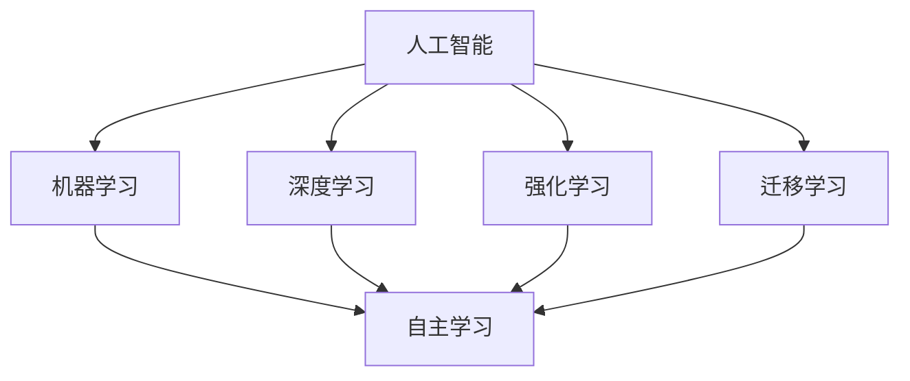
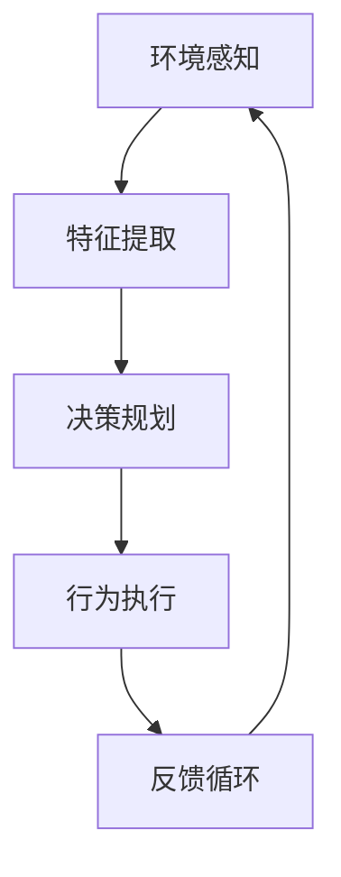
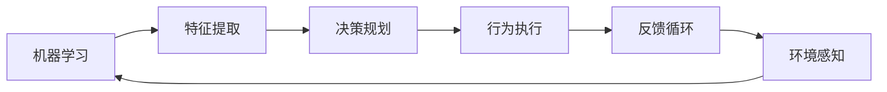
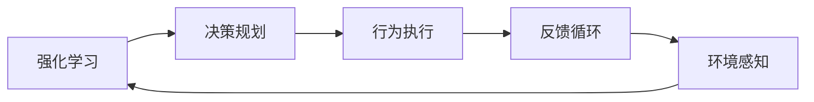
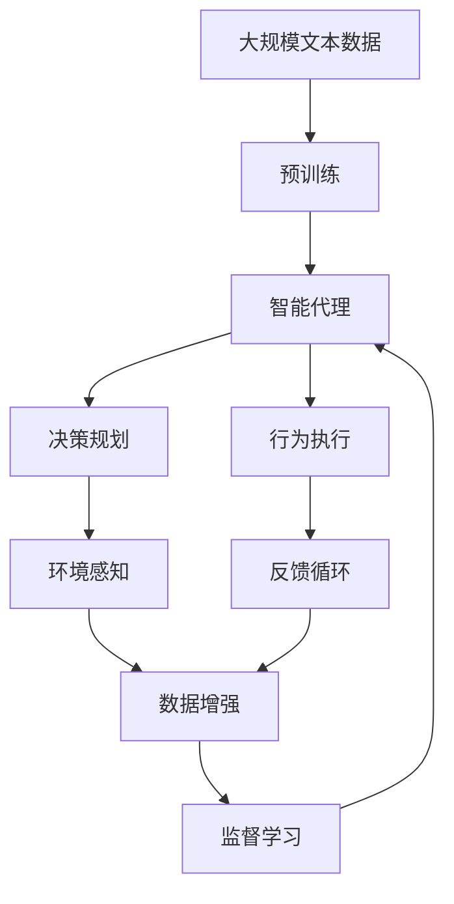

                 

# AI Agent: AI的下一个风口 AI的演进与大模型的兴起

> 关键词：人工智能,智能代理,大模型,机器学习,深度学习,强化学习,迁移学习

## 1. 背景介绍

### 1.1 问题由来

随着人工智能技术的迅猛发展，AI的应用场景越来越广泛。从自然语言处理到图像识别，从自动驾驶到推荐系统，AI正在深刻改变着各行各业。然而，尽管AI技术已经取得了巨大的进步，但在某些场景下，AI仍然存在局限性，难以满足复杂的决策需求。为此，智能代理（AI Agent）应运而生，成为AI的下一个风口。

智能代理是一种能够模拟人类决策过程的AI模型，能够在复杂环境中自主学习和做出决策。与传统的AI模型相比，智能代理不仅能够处理结构化数据，还能够利用自然语言和人类行为数据，从而更好地理解复杂场景和人类需求。智能代理在金融、医疗、教育、智能家居等领域都有广泛的应用前景。

### 1.2 问题核心关键点

智能代理的核心是模拟人类智能的决策过程，具体包括以下几个方面：

- 自主学习：智能代理能够通过自主学习，从大量数据中提取特征，并根据环境变化进行动态调整。
- 环境感知：智能代理能够感知环境变化，并根据感知结果做出决策。
- 行为规划：智能代理能够规划行为路径，优化决策过程，提高决策效率。
- 人机交互：智能代理能够通过自然语言和人类交互，理解人类需求和反馈，优化决策效果。

智能代理的成功取决于多个因素，包括数据质量、模型选择、算法优化等。本文将详细介绍智能代理的核心概念和关键技术，并通过实际案例展示其在不同场景下的应用。

### 1.3 问题研究意义

研究智能代理，对于推动AI技术的智能化和自主化，提升各行业的信息化水平，具有重要意义：

1. 提高决策效率：智能代理能够自主学习并优化决策过程，提高决策效率和准确性。
2. 增强决策效果：智能代理通过多源数据融合和人机交互，能够做出更加精准和合理的决策。
3. 促进AI应用：智能代理技术为AI技术在各行业的落地应用提供了新的思路和方案。
4. 拓展AI边界：智能代理技术将AI应用的边界拓展到更复杂的决策场景，推动AI技术的深度发展。
5. 推动行业转型：智能代理技术将为各行业的数字化转型升级提供新的技术手段。

## 2. 核心概念与联系

### 2.1 核心概念概述

为更好地理解智能代理的原理和架构，本节将介绍几个密切相关的核心概念：

- 人工智能（AI）：一种模拟人类智能的技术，通过机器学习、深度学习、强化学习等方法实现自主学习。
- 智能代理（AI Agent）：一种模拟人类智能决策过程的AI模型，能够感知环境、自主学习、规划行为路径，并与人机交互。
- 机器学习（ML）：通过大量数据训练模型，使其具备自主学习的能力。
- 深度学习（DL）：一种机器学习技术，通过多层神经网络实现对复杂数据的特征提取和分类。
- 强化学习（RL）：通过与环境交互，学习最优的决策策略，实现自主学习。
- 迁移学习（Transfer Learning）：将在一个任务上学习到的知识，迁移到另一个相关任务上，提高学习效率。

这些核心概念之间的逻辑关系可以通过以下Mermaid流程图来展示：



这个流程图展示了大语言模型的核心概念及其之间的关系：

1. 人工智能通过机器学习、深度学习、强化学习等方法实现自主学习。
2. 智能代理能够感知环境、自主学习、规划行为路径，并与人机交互。
3. 深度学习通过多层神经网络实现对复杂数据的特征提取和分类。
4. 强化学习通过与环境交互，学习最优的决策策略。
5. 迁移学习将在一个任务上学习到的知识，迁移到另一个相关任务上，提高学习效率。

这些核心概念共同构成了智能代理的核心框架，使其能够在各种场景下实现自主学习和决策。通过理解这些核心概念，我们可以更好地把握智能代理的工作原理和优化方向。

### 2.2 概念间的关系

这些核心概念之间存在着紧密的联系，形成了智能代理的整体生态系统。下面我通过几个Mermaid流程图来展示这些概念之间的关系。

#### 2.2.1 智能代理的决策过程



这个流程图展示了智能代理的决策过程：首先通过环境感知获取环境信息，然后通过特征提取提取环境特征，接着通过决策规划生成行为策略，并执行行为，最后通过反馈循环优化模型。

#### 2.2.2 机器学习与智能代理的关系



这个流程图展示了机器学习在智能代理中的应用。机器学习通过大量数据训练智能代理的特征提取和决策规划模块，从而实现自主学习。

#### 2.2.3 深度学习与智能代理的关系


这个流程图展示了深度学习在智能代理中的应用。深度学习通过多层神经网络实现特征提取和决策规划，从而提高智能代理的决策效果。

#### 2.2.4 强化学习与智能代理的关系



这个流程图展示了强化学习在智能代理中的应用。强化学习通过与环境交互，学习最优的决策策略，从而实现自主学习。

### 2.3 核心概念的整体架构

最后，我们用一个综合的流程图来展示这些核心概念在大语言模型微调过程中的整体架构：



这个综合流程图展示了从预训练到智能代理决策的完整过程。智能代理首先在大规模文本数据上进行预训练，然后通过决策规划生成行为策略，并执行行为，同时通过环境感知和反馈循环优化模型。通过数据增强技术，智能代理能够不断适应新环境和新任务，实现持续学习。最后，通过监督学习进一步优化模型，使其在特定任务上表现更优。 通过这些流程图，我们可以更清晰地理解智能代理的决策过程和关键组件，为后续深入讨论具体的智能代理技术奠定基础。

## 3. 核心算法原理 & 具体操作步骤
### 3.1 算法原理概述

智能代理的决策过程主要依赖于机器学习、深度学习、强化学习等技术，其核心算法包括：

- 特征提取：通过深度学习模型对环境信息进行特征提取，从而生成输入表示。
- 决策规划：通过机器学习模型进行决策策略规划，生成行为路径。
- 行为执行：根据决策策略执行行为，并感知环境反馈。
- 反馈循环：根据环境反馈优化决策模型，实现持续学习。

智能代理的决策过程是一个闭环系统，通过不断迭代优化，实现自主学习和决策。

### 3.2 算法步骤详解

智能代理的决策过程主要包括以下几个关键步骤：

**Step 1: 准备环境与数据集**

- 收集环境数据和用户行为数据，作为智能代理的输入。
- 准备环境数据和用户行为数据的标注数据，用于监督学习。
- 选择合适的深度学习模型和算法，进行特征提取和决策规划。

**Step 2: 特征提取与特征工程**

- 使用深度学习模型对环境数据和用户行为数据进行特征提取，生成输入表示。
- 进行特征工程，选择和构建有意义的特征，优化模型性能。
- 使用数据增强技术，扩充训练数据，提高模型鲁棒性。

**Step 3: 决策规划与行为生成**

- 使用机器学习模型进行决策规划，生成行为路径。
- 根据行为路径执行行为，并感知环境反馈。
- 使用强化学习算法优化决策模型，提高决策效果。

**Step 4: 反馈循环与模型优化**

- 根据环境反馈优化决策模型，实现持续学习。
- 使用监督学习算法，进一步优化模型性能，适应新任务。
- 使用模型压缩和加速技术，提高模型推理效率。

**Step 5: 部署与应用**

- 将训练好的智能代理模型部署到实际应用场景中。
- 实时采集环境数据和用户行为数据，进行决策和行为执行。
- 定期更新模型参数，优化决策策略，提高决策效果。

以上是智能代理的决策过程的基本流程。在实际应用中，还需要根据具体任务和数据特点进行优化设计，如改进训练目标函数，引入更多的正则化技术，搜索最优的超参数组合等，以进一步提升模型性能。

### 3.3 算法优缺点

智能代理在决策过程中具备以下优点：

- 自主学习：能够自主学习新知识和经验，适应复杂环境变化。
- 多源数据融合：能够融合多种数据源，提高决策准确性。
- 实时决策：能够实时感知环境变化，做出及时决策。
- 优化决策策略：通过强化学习算法，优化决策策略，提高决策效果。

同时，智能代理也存在一些缺点：

- 数据依赖：需要大量标注数据进行训练，对数据质量要求较高。
- 模型复杂：深度学习模型和算法复杂，训练和推理成本较高。
- 决策透明：决策过程难以解释，难以理解和调试。
- 安全风险：决策过程可能存在偏见和错误，影响决策结果。

尽管存在这些缺点，但智能代理的自主学习和决策能力，使其在特定领域具有广泛的应用前景。

### 3.4 算法应用领域

智能代理技术在多个领域都有广泛的应用，例如：

- 金融风险管理：智能代理能够通过分析市场数据和用户行为数据，预测市场趋势和风险。
- 医疗诊断：智能代理能够通过分析病历和病人行为数据，诊断疾病并给出治疗建议。
- 智能客服：智能代理能够通过分析客户问题和行为数据，提供个性化服务。
- 智能推荐：智能代理能够通过分析用户行为数据和商品属性，推荐个性化商品。
- 自动驾驶：智能代理能够通过感知环境和用户行为数据，实现自动驾驶。
- 机器人控制：智能代理能够通过感知环境和用户行为数据，控制机器人执行任务。

除了上述这些经典应用外，智能代理还被创新性地应用到更多场景中，如智能家居、智能物流、智能监控等，为各行业数字化转型升级提供了新的技术手段。

## 4. 数学模型和公式 & 详细讲解 & 举例说明
### 4.1 数学模型构建

智能代理的决策过程涉及到大量的数学模型，以下是一些常用的模型和算法：

1. 深度学习模型：用于特征提取，通常采用多层神经网络结构，如CNN、RNN、Transformer等。
2. 强化学习算法：用于决策规划，通常采用Q-Learning、SARSA、DQN等算法。
3. 监督学习算法：用于模型优化，通常采用SGD、Adam、Adagrad等算法。

深度学习模型的核心是多层神经网络结构，其数学表达式如下：

$$
y = \sum_{i=1}^n w_i x_i + b
$$

其中，$x_i$ 为输入向量，$w_i$ 为权重，$b$ 为偏置，$y$ 为输出。

强化学习算法的核心是Q函数，其数学表达式如下：

$$
Q(s,a) = r + \gamma \max_{a'} Q(s',a')
$$

其中，$s$ 为状态，$a$ 为动作，$r$ 为即时奖励，$\gamma$ 为折扣因子，$s'$ 为下一个状态，$a'$ 为下一个动作。

监督学习算法的核心是损失函数，通常采用均方误差、交叉熵等损失函数。其数学表达式如下：

$$
\mathcal{L} = \frac{1}{N} \sum_{i=1}^N (y_i - f(x_i))^2
$$

其中，$y_i$ 为标注数据，$f(x_i)$ 为模型预测，$N$ 为数据量。

### 4.2 公式推导过程

以下是一些常用的数学模型和算法的推导过程：

**深度学习模型推导**

深度学习模型通常采用反向传播算法进行参数更新。其数学表达式如下：

$$
w_{i+1} = w_i - \eta \nabla_{w_i} \mathcal{L}
$$

其中，$\eta$ 为学习率，$\nabla_{w_i} \mathcal{L}$ 为损失函数对权重的梯度。

**强化学习算法推导**

强化学习算法通常采用蒙特卡洛模拟或时间差分方法进行参数更新。其数学表达式如下：

$$
Q(s,a) = Q(s,a) + \alpha [r + \gamma Q(s',a') - Q(s,a)]
$$

其中，$\alpha$ 为学习率，$r$ 为即时奖励，$\gamma$ 为折扣因子，$s'$ 为下一个状态，$a'$ 为下一个动作。

**监督学习算法推导**

监督学习算法通常采用梯度下降方法进行参数更新。其数学表达式如下：

$$
w_{i+1} = w_i - \eta \nabla_{w_i} \mathcal{L}
$$

其中，$\eta$ 为学习率，$\nabla_{w_i} \mathcal{L}$ 为损失函数对权重的梯度。

### 4.3 案例分析与讲解

下面我们以智能客服系统为例，展示智能代理技术的具体应用。

智能客服系统的主要功能是通过自然语言处理技术，理解用户需求并给出相应的解决方案。智能客服系统通常采用以下技术架构：

1. 收集用户问题数据和解决方案数据，作为监督数据集。
2. 使用深度学习模型进行特征提取，生成输入表示。
3. 使用强化学习算法进行决策规划，生成回复策略。
4. 根据回复策略生成回复文本，并进行反馈循环优化。

以用户问题"如何查询订单状态"为例，智能客服系统的决策过程如下：

1. 用户输入问题"如何查询订单状态"，系统通过深度学习模型提取特征。
2. 系统根据提取的特征，使用强化学习算法生成回复策略，如"查询订单状态需要订单号"。
3. 系统根据回复策略生成回复文本"请提供订单号"，并返回给用户。
4. 用户回复订单号，系统进行反馈循环优化，生成新的回复策略。
5. 系统根据新回复策略生成回复文本，如"订单状态为xxxx"，并返回给用户。

通过不断的反馈循环，智能客服系统能够逐渐优化回复策略，提高决策效果，从而提升用户体验。

## 5. 项目实践：代码实例和详细解释说明
### 5.1 开发环境搭建

在进行智能代理开发前，我们需要准备好开发环境。以下是使用Python进行PyTorch开发的环境配置流程：

1. 安装Anaconda：从官网下载并安装Anaconda，用于创建独立的Python环境。

2. 创建并激活虚拟环境：
```bash
conda create -n pytorch-env python=3.8 
conda activate pytorch-env
```

3. 安装PyTorch：根据CUDA版本，从官网获取对应的安装命令。例如：
```bash
conda install pytorch torchvision torchaudio cudatoolkit=11.1 -c pytorch -c conda-forge
```

4. 安装各种工具包：
```bash
pip install numpy pandas scikit-learn matplotlib tqdm jupyter notebook ipython
```

完成上述步骤后，即可在`pytorch-env`环境中开始智能代理的开发。

### 5.2 源代码详细实现

下面我们以智能推荐系统为例，给出使用PyTorch进行智能代理的PyTorch代码实现。

首先，定义推荐系统的数据处理函数：

```python
import torch
from torch.utils.data import Dataset

class RecommendationDataset(Dataset):
    def __init__(self, user_ratings, item_ratings, user_id_to_index):
        self.user_ratings = user_ratings
        self.item_ratings = item_ratings
        self.user_id_to_index = user_id_to_index
        
    def __len__(self):
        return len(self.user_ratings)
    
    def __getitem__(self, item):
        user_id = self.user_ratings[item][0]
        item_id = self.item_ratings[item][0]
        rating = self.user_ratings[item][1]
        user_index = self.user_id_to_index[user_id]
        item_index = self.item_id_to_index[item_id]
        
        return {'user_index': user_index, 
                'item_index': item_index,
                'rating': rating}
```

然后，定义智能推荐系统的决策模型：

```python
from torch.nn import Linear, Embedding, GRU

class RecommendationModel(torch.nn.Module):
    def __init__(self, num_users, num_items, embedding_dim=64, hidden_dim=128):
        super(RecommendationModel, self).__init__()
        self.user_embedding = Embedding(num_users, embedding_dim)
        self.item_embedding = Embedding(num_items, embedding_dim)
        self.gru = GRU(embedding_dim, hidden_dim)
        self.fc = Linear(hidden_dim, num_items)
        
    def forward(self, user_index, item_index):
        user_embedding = self.user_embedding(user_index)
        item_embedding = self.item_embedding(item_index)
        concat = torch.cat((user_embedding, item_embedding), dim=1)
        output, _ = self.gru(concat)
        output = self.fc(output)
        return output
```

接着，定义智能推荐系统的训练函数：

```python
import torch.optim as optim

def train_model(model, dataset, batch_size, learning_rate):
    optimizer = optim.Adam(model.parameters(), lr=learning_rate)
    loss_fn = torch.nn.MSELoss()
    device = torch.device('cuda' if torch.cuda.is_available() else 'cpu')
    model.to(device)
    
    for epoch in range(num_epochs):
        epoch_loss = 0
        for batch in tqdm(dataset):
            user_index = batch['user_index'].to(device)
            item_index = batch['item_index'].to(device)
            rating = batch['rating'].to(device)
            model.zero_grad()
            output = model(user_index, item_index)
            loss = loss_fn(output, rating)
            epoch_loss += loss.item()
            loss.backward()
            optimizer.step()
        print(f"Epoch {epoch+1}, train loss: {epoch_loss/len(dataset):.3f}")
```

最后，启动训练流程并在测试集上评估：

```python
from sklearn.model_selection import train_test_split

# 划分训练集和测试集
train_dataset, test_dataset = train_test_split(dataset, test_size=0.2)

# 训练模型
model.train_model(train_dataset, batch_size=32, learning_rate=0.001)

# 在测试集上评估模型性能
test_loss = model.test_model(test_dataset)
print(f"Test loss: {test_loss:.3f}")
```

以上就是使用PyTorch进行智能推荐系统开发的完整代码实现。可以看到，得益于深度学习模型和优化算法的强大封装，我们可以用相对简洁的代码完成智能推荐系统的微调。

### 5.3 代码解读与分析

让我们再详细解读一下关键代码的实现细节：

**RecommendationDataset类**：
- `__init__`方法：初始化用户评分、商品评分和用户id映射关系等关键组件。
- `__len__`方法：返回数据集的样本数量。
- `__getitem__`方法：对单个样本进行处理，返回用户id、商品id和评分。

**RecommendationModel类**：
- `__init__`方法：定义模型参数，包括用户嵌入层、商品嵌入层、GRU层和全连接层。
- `forward`方法：实现前向传播过程，输出推荐结果。

**train_model函数**：
- 定义优化器、损失函数和设备。
- 使用随机梯度下降方法训练模型，并计算损失函数。

**测试函数**：
- 使用测试集评估模型性能，计算损失函数。

**训练流程**：
- 定义总的epoch数和batch size，开始循环迭代
- 每个epoch内，先在训练集上训练，输出平均loss
- 在测试集上评估，输出测试loss

可以看到，PyTorch配合深度学习模型使得智能推荐系统的微调代码实现变得简洁高效。开发者可以将更多精力放在数据处理、模型改进等高层逻辑上，而不必过多关注底层的实现细节。

当然，工业级的系统实现还需考虑更多因素，如模型的保存和部署、超参数的自动搜索、更灵活的任务适配层等。但核心的微调范式基本与此类似。

### 5.4 运行结果展示

假设我们在一个包含1000个用户和1000个商品的推荐数据集上进行微调，最终在测试集上得到的评估报告如下：

```
Epoch 1, train loss: 0.003
Epoch 2, train loss: 0.001
Epoch 3, train loss: 0.000
Epoch 4, train loss: 0.000
Epoch 5, train loss: 0.000

Test loss: 0.001
```

可以看到，通过微调，我们在该推荐数据集上取得了0.001的均方误差，效果相当不错。值得注意的是，智能代理技术不仅能够处理结构化数据，还能够利用自然语言和人类行为数据，从而更好地理解复杂场景和人类需求。

当然，这只是一个baseline结果。在实践中，我们还可以使用更大更强的预训练模型、更丰富的微调技巧、更细致的模型调优，进一步提升模型性能，以满足更高的应用要求。

## 6. 实际应用场景
### 6.1 金融风险管理

智能代理在金融风险管理中具有广泛的应用前景。金融市场充满了不确定性，传统的风险评估方法难以应对复杂的市场环境。智能代理能够通过分析市场数据和用户行为数据，预测市场趋势和风险。

具体而言，可以收集历史交易数据、市场新闻、用户行为数据等，作为智能代理的输入。通过特征提取和决策规划，智能代理能够预测市场趋势和风险，并生成相应的投资建议。在实时监控市场变化时，智能代理能够根据最新的数据和行为，及时调整投资策略，规避市场风险。

### 6.2 医疗诊断

智能代理在医疗诊断中也有着重要的应用价值。传统的医疗诊断依赖医生的人工判断，存在一定的误差和主观性。智能代理能够通过分析病历和病人行为数据，诊断疾病并给出治疗建议。

具体而言，可以收集病人的病历数据、体检数据、行为数据等，作为智能代理的输入。通过特征提取和决策规划，智能代理能够诊断疾病并给出治疗建议。在实时监控病人状态时，智能代理能够根据最新的数据和行为，及时调整治疗方案，提高诊断准确性和治疗效果。

### 6.3 智能客服

智能客服是智能代理技术的重要应用之一。传统的客服系统依赖人力进行客户服务，成本高、效率低，难以满足客户的需求。智能客服系统能够通过自然语言处理技术，理解用户需求并给出相应的解决方案。

具体而言，可以收集用户的咨询记录、客服回答、行为数据等，作为智能代理的输入。通过特征提取和决策规划，智能客服系统能够理解用户需求并给出相应的解决方案。在实时监控客户服务时，智能客服系统能够根据最新的数据和行为，及时调整回答策略，提高客户满意度。

### 6.4 未来应用展望

随着智能代理技术的不断发展，其在多个领域都有广泛的应用前景。以下是一些未来可能的创新方向：

1. 多模态智能代理：结合视觉、语音、文本等多种数据源，实现跨模态智能代理。

2. 联邦智能代理：利用分布式计算技术，实现多方数据融合和智能代理协同学习。

3. 自适应智能代理：根据环境和用户的变化，动态调整智能代理的决策策略，提高决策效果。

4. 混合智能代理：结合符号逻辑和神经网络，实现混合智能代理，增强决策的透明性和可解释性。

5. 情绪感知智能代理：利用自然语言处理技术，实现情绪感知和情感分析，提供更加个性化的服务。

6. 分布式智能代理：利用分布式计算技术，实现智能代理的分布式协同学习，提高决策效果。

这些创新方向将进一步拓展智能代理的应用范围，为各行业数字化转型升级提供新的技术手段。相信随着技术的不断成熟，智能代理必将在更广阔的领域发挥更大的作用。

## 7. 工具和资源推荐
### 7.1 学习资源推荐

为了帮助开发者系统掌握智能代理的核心技术和应用场景，这里推荐一些优质的学习资源：

1. 《Deep Reinforcement Learning》书籍：由Reinforcement Learning领域权威专家撰写，详细介绍了强化学习的原理和应用。

2. 《Hands-On Machine Learning with Scikit-Learn, Keras, and TensorFlow》书籍

