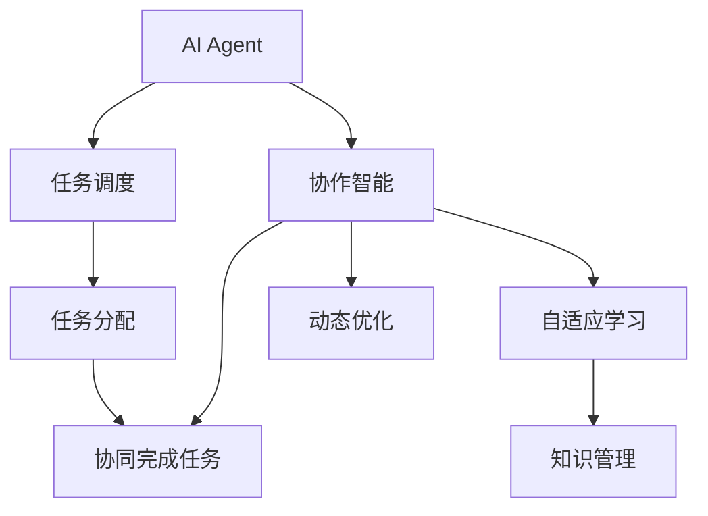
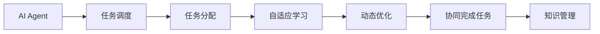
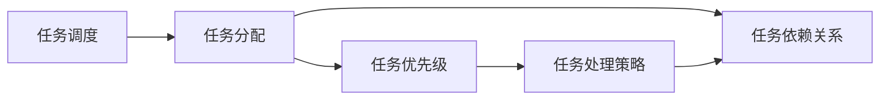
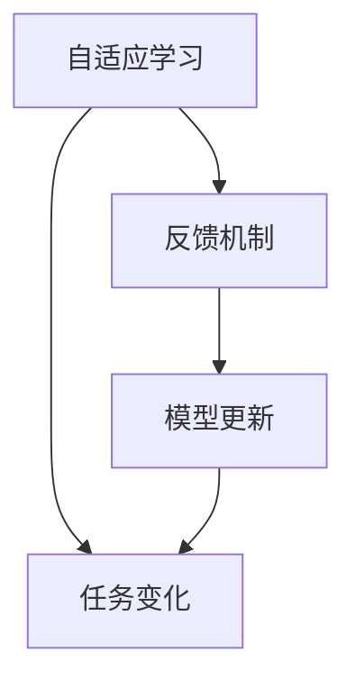
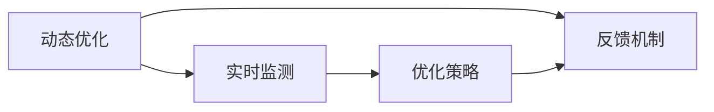
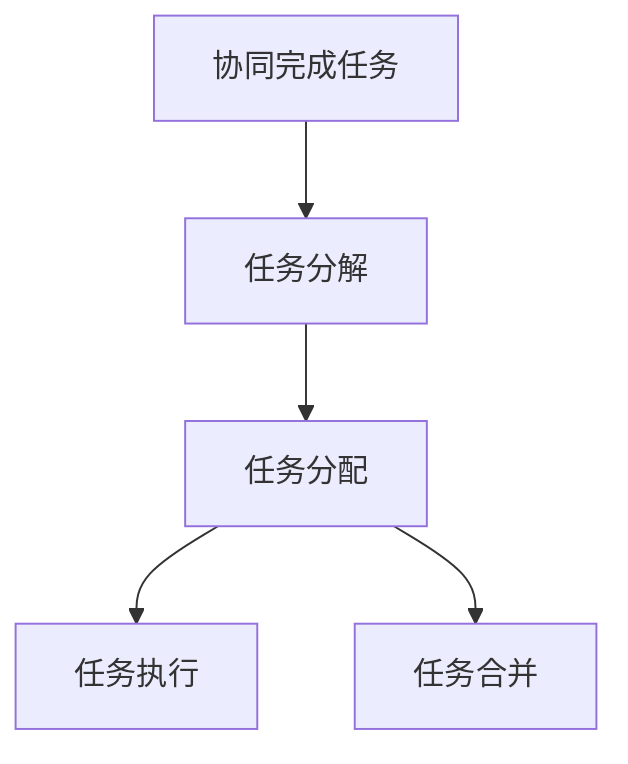
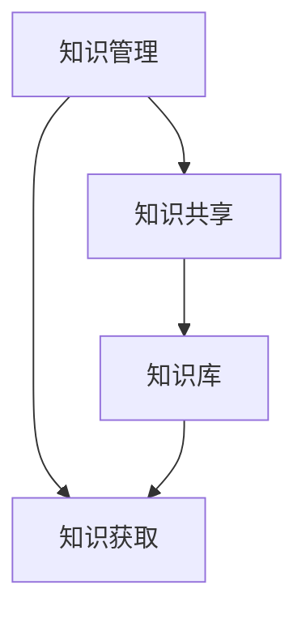
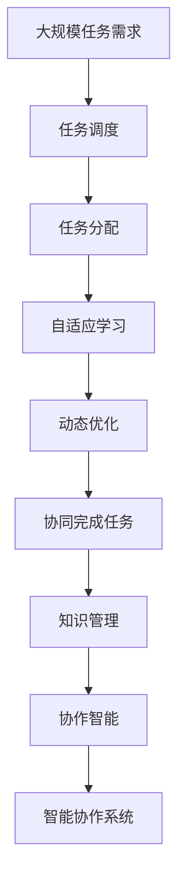

                 

# AI Agent在智能协作中的优势

> 关键词：人工智能(AI)、协作智能、智能任务分配、自适应学习、动态优化、AIAgent、协作机器人、知识管理、决策支持、未来展望

## 1. 背景介绍

### 1.1 问题由来
随着信息技术的发展，智能协作已成为企业和组织提高工作效率、增强竞争力的重要手段。然而，传统的协作模式通常依赖于人力，效率低、成本高、容易出错，无法满足现代业务需求。为此，人们迫切需要一种更加高效、智能的协作方式。

人工智能(AI)技术的兴起为智能协作提供了新的可能性。通过AI Agent，企业可以构建更高效、灵活、智能的协作系统，显著提升业务处理效率和质量。AI Agent已经在智能调度、智能客服、智能制造、智能决策等领域广泛应用，取得了显著成效。

### 1.2 问题核心关键点
AI Agent的核心优势在于其高效智能的任务处理和自适应学习能力。AI Agent能够根据任务需求动态调整处理策略，自适应学习新知识，从而不断提高自身的协作能力。此外，AI Agent还能协同多个智能实体，实现复杂任务的协同完成，为组织提供更强大的支持。

AI Agent的协作优势主要体现在以下几个方面：
- **高效智能任务处理**：通过自动化、智能化的任务调度，AI Agent可以处理大量复杂任务，提高效率。
- **自适应学习能力**：AI Agent能够持续学习，适应任务变化，优化自身协作策略。
- **动态优化**：通过实时监测和反馈机制，AI Agent能够不断优化自身行为，提升协作效果。
- **协同完成任务**：AI Agent能够协同多个智能实体，实现更复杂的协作任务。

### 1.3 问题研究意义
研究AI Agent的协作优势，对于推动人工智能技术在协作领域的应用，提升企业运营效率，加速智能技术的产业化进程，具有重要意义：

1. **降低协作成本**：AI Agent可以替代人力进行重复性、复杂性任务，减少人力成本。
2. **提升协作效率**：AI Agent能够高效处理大量任务，显著提升协作效率。
3. **增强协作灵活性**：AI Agent能够自适应学习新知识，适应不同任务需求，提高协作灵活性。
4. **优化协作效果**：AI Agent能够动态优化自身行为，提升协作效果。
5. **加速技术落地**：AI Agent的协作优势，为智能技术在各行业的推广提供了重要范例。

## 2. 核心概念与联系

### 2.1 核心概念概述

为更好地理解AI Agent在智能协作中的优势，本节将介绍几个密切相关的核心概念：

- **AI Agent**：即智能代理，能够自主地完成任务、做出决策的计算实体。AI Agent具备感知、推理、决策和执行能力，能够在各种环境和任务中自主行动。

- **协作智能(Cooperative Intelligence)**：多个AI Agent通过协作，共同完成复杂任务，提升整体协作效果。协作智能强调AI Agent之间的信息共享、任务协调和协同决策。

- **任务调度与分配**：根据任务需求，将任务合理分配给不同的AI Agent，并动态调整任务优先级和处理策略。

- **自适应学习**：AI Agent能够根据任务变化和环境反馈，持续学习和优化自身的协作策略。

- **动态优化**：通过实时监测和反馈机制，AI Agent能够不断优化自身行为，提升协作效果。

- **协同完成任务**：多个AI Agent通过协同工作，实现更复杂的任务。

- **知识管理**：AI Agent能够管理、共享知识，提升整体协作的知识水平。

这些核心概念之间的逻辑关系可以通过以下Mermaid流程图来展示：



这个流程图展示了这个核心概念之间的联系：

1. AI Agent通过任务调度和分配，执行协作智能。
2. 自适应学习、动态优化、知识管理进一步提升了AI Agent的协作效果。
3. 通过协作智能，AI Agent协同完成任务。

### 2.2 概念间的关系

这些核心概念之间存在着紧密的联系，形成了AI Agent协作的完整生态系统。下面我们通过几个Mermaid流程图来展示这些概念之间的关系。

#### 2.2.1 AI Agent的协作智能



这个流程图展示了AI Agent如何通过任务调度、任务分配、自适应学习、动态优化、协同完成任务和知识管理，实现协作智能。

#### 2.2.2 任务调度与分配



这个流程图展示了任务调度与分配的具体过程，包括任务优先级、处理策略和依赖关系等。

#### 2.2.3 自适应学习



这个流程图展示了自适应学习的过程，包括反馈机制和模型更新等。

#### 2.2.4 动态优化



这个流程图展示了动态优化的过程，包括实时监测和优化策略等。

#### 2.2.5 协同完成任务



这个流程图展示了协同完成任务的具体过程，包括任务分解、分配和执行等。

#### 2.2.6 知识管理



这个流程图展示了知识管理的过程，包括知识共享和知识库等。

### 2.3 核心概念的整体架构

最后，我们用一个综合的流程图来展示这些核心概念在AI Agent协作中的整体架构：



这个综合流程图展示了从任务调度到协作智能的完整过程。AI Agent通过任务调度和分配，执行协作智能。自适应学习、动态优化、协同完成任务和知识管理进一步提升了AI Agent的协作效果。最终，AI Agent构建的智能协作系统能够高效、智能地完成各种复杂任务。

## 3. 核心算法原理 & 具体操作步骤
### 3.1 算法原理概述

AI Agent在智能协作中的核心算法原理主要包括以下几个方面：

- **任务调度与分配算法**：通过任务调度和分配算法，将大规模任务合理分解并分配给不同的AI Agent。
- **自适应学习算法**：通过自适应学习算法，AI Agent能够根据任务变化和环境反馈，持续学习和优化自身的协作策略。
- **动态优化算法**：通过动态优化算法，AI Agent能够实时监测和反馈，不断优化自身行为，提升协作效果。
- **协同完成任务算法**：通过协同完成任务算法，多个AI Agent协同工作，实现更复杂的任务。

这些算法原理通过协同工作，实现高效智能的任务处理和自适应学习能力，进一步提升了AI Agent的协作效果。

### 3.2 算法步骤详解

AI Agent的协作过程大致包括以下几个关键步骤：

**Step 1: 数据收集与任务定义**
- 收集并整理需要协作的任务数据，定义任务类型和要求。
- 根据任务类型，选择合适的任务调度与分配算法，准备任务执行的数据集。

**Step 2: 任务分解与调度**
- 将任务分解为多个子任务，评估每个子任务的大小和复杂度。
- 使用任务调度与分配算法，将子任务合理分配给不同的AI Agent。
- 设置任务的优先级和处理策略，确保高优先级任务得到及时处理。

**Step 3: 自适应学习**
- 在任务执行过程中，AI Agent持续收集反馈信息，评估任务执行效果。
- 使用自适应学习算法，根据任务变化和环境反馈，优化自身的协作策略。
- 更新模型参数，提升AI Agent的性能。

**Step 4: 动态优化**
- 实时监测任务执行状态，评估任务进度和完成度。
- 使用动态优化算法，根据任务执行状态，调整AI Agent的行为和策略。
- 动态调整任务优先级和处理策略，确保高效完成任务。

**Step 5: 协同完成任务**
- 多个AI Agent协同工作，实现更复杂的任务。
- 使用协同完成任务算法，合理分配子任务，确保任务按时完成。
- 通过信息共享和协同决策，提升任务执行效果。

**Step 6: 知识管理**
- 管理、共享知识，提升整体协作的知识水平。
- 使用知识管理算法，建立知识库，记录AI Agent的协作经验和学习成果。
- 在任务执行过程中，及时获取和利用知识，提升协作效果。

### 3.3 算法优缺点

AI Agent的协作算法具有以下优点：

- **高效处理任务**：通过任务调度和分配算法，AI Agent能够高效处理大规模任务，提升协作效率。
- **自适应学习能力**：通过自适应学习算法，AI Agent能够持续学习，适应任务变化，优化自身协作策略。
- **动态优化**：通过动态优化算法，AI Agent能够实时监测和反馈，不断优化自身行为，提升协作效果。
- **协同完成任务**：通过协同完成任务算法，多个AI Agent协同工作，实现更复杂的任务。

同时，这些算法也存在以下缺点：

- **复杂度高**：任务调度和分配算法、自适应学习算法和动态优化算法都比较复杂，需要较强的计算能力和数据管理能力。
- **知识共享问题**：多个AI Agent之间的知识共享和协同决策比较复杂，需要建立有效的知识库和管理机制。
- **环境适应性**：AI Agent在不同环境和任务下的适应性需要进一步提升，避免出现模型过拟合或欠拟合。

### 3.4 算法应用领域

AI Agent的协作算法已经在多个领域得到了广泛应用，包括但不限于：

- **智能调度与生产管理**：通过AI Agent协作，优化生产调度和管理流程，提高生产效率。
- **智能客服与客户关系管理**：通过AI Agent协作，提升客户服务质量和效率，管理客户关系。
- **智能制造与自动化**：通过AI Agent协作，实现智能制造和自动化生产，提升制造效率和质量。
- **智能决策与数据分析**：通过AI Agent协作，进行数据分析和决策支持，优化业务决策。
- **智能物流与供应链管理**：通过AI Agent协作，优化物流和供应链管理流程，提高物流效率。
- **智能医疗与健康管理**：通过AI Agent协作，进行智能诊断和治疗，提升医疗服务质量。

这些应用领域展示了AI Agent在智能协作中的巨大潜力，未来还有更多的领域值得探索和开发。

## 4. 数学模型和公式 & 详细讲解  
### 4.1 数学模型构建

本节将使用数学语言对AI Agent协作的算法原理进行更加严格的刻画。

记任务调度与分配算法为 $S(\mathcal{T})$，其中 $\mathcal{T}$ 为任务集合。任务 $t_i$ 的优先级为 $p_i$，处理策略为 $h_i$，分配给AI Agent $a_j$ 的概率为 $p_{ij}$。任务执行的效果为 $e_i$，AI Agent $a_j$ 的性能为 $q_j$，环境反馈为 $f_j$。

定义任务调度的目标函数为：

$$
\min_{S(\mathcal{T}), p_i, h_i, p_{ij}} \sum_{i=1}^N p_i \cdot e_i
$$

其中 $N$ 为任务数量。目标函数最小化任务调度和分配的损失，同时最大化任务执行效果。

任务调度和分配的过程可以表示为：

$$
S(\mathcal{T}) = \arg\min_{S(\mathcal{T}), p_i, h_i, p_{ij}} \sum_{i=1}^N p_i \cdot e_i
$$

在任务调度过程中，使用随机算法和优化算法相结合的方法，找到最优的任务调度和分配策略。

### 4.2 公式推导过程

以下是任务调度和分配算法的推导过程：

假设任务集合 $\mathcal{T} = \{t_1, t_2, ..., t_N\}$，其中 $t_i$ 表示第 $i$ 个任务，优先级为 $p_i$，处理策略为 $h_i$，分配给AI Agent $a_j$ 的概率为 $p_{ij}$。

任务调度的目标函数为：

$$
\min_{S(\mathcal{T}), p_i, h_i, p_{ij}} \sum_{i=1}^N p_i \cdot e_i
$$

目标函数最小化任务调度和分配的损失，同时最大化任务执行效果。

定义任务调度的决策变量 $x_{ij} = 1$ 表示任务 $t_i$ 分配给AI Agent $a_j$，否则 $x_{ij} = 0$。则任务调度的优化问题可以表示为：

$$
\min_{S(\mathcal{T}), p_i, h_i, p_{ij}} \sum_{i=1}^N p_i \cdot e_i
$$

其中：

$$
x_{ij} \leq \sum_{i=1}^N x_{ij} \leq 1 \quad \forall j
$$

$$
x_{ij} \geq 0 \quad \forall i, j
$$

任务调度与分配的过程可以表示为：

$$
S(\mathcal{T}) = \arg\min_{x_{ij}, p_i, h_i, p_{ij}} \sum_{i=1}^N p_i \cdot e_i
$$

其中 $p_i$ 和 $h_i$ 需要根据具体任务进行调整，$p_{ij}$ 需要通过统计和优化算法求解。

### 4.3 案例分析与讲解

以智能调度与生产管理为例，分析AI Agent的协作过程。

假设生产车间有多个机器人和自动化设备，需要协同完成大规模生产任务。任务调度与分配算法将任务分解为多个子任务，分配给不同的机器人和自动化设备。每个子任务的优先级和处理策略由机器人和自动化设备的性能决定。

在任务执行过程中，AI Agent持续收集反馈信息，评估任务执行效果。根据反馈信息，使用自适应学习算法优化处理策略，调整任务优先级和处理策略。

实时监测任务执行状态，评估任务进度和完成度。根据任务执行状态，使用动态优化算法调整AI Agent的行为和策略，动态调整任务优先级和处理策略，确保高效完成任务。

多个AI Agent协同工作，实现更复杂的任务。通过信息共享和协同决策，提升任务执行效果。

## 5. 项目实践：代码实例和详细解释说明
### 5.1 开发环境搭建

在进行AI Agent协作的实践前，我们需要准备好开发环境。以下是使用Python进行PyTorch开发的环境配置流程：

1. 安装Anaconda：从官网下载并安装Anaconda，用于创建独立的Python环境。

2. 创建并激活虚拟环境：
```bash
conda create -n ai-agent-env python=3.8 
conda activate ai-agent-env
```

3. 安装PyTorch：根据CUDA版本，从官网获取对应的安装命令。例如：
```bash
conda install pytorch torchvision torchaudio cudatoolkit=11.1 -c pytorch -c conda-forge
```

4. 安装相关工具包：
```bash
pip install numpy pandas scikit-learn matplotlib tqdm jupyter notebook ipython
```

完成上述步骤后，即可在`ai-agent-env`环境中开始AI Agent协作的实践。

### 5.2 源代码详细实现

下面我们以智能调度与生产管理为例，给出使用PyTorch和Transformer库实现AI Agent协作的Python代码实现。

首先，定义任务调度与分配算法：

```python
import torch
from torch import nn
import torch.optim as optim
from sklearn.model_selection import train_test_split

class TaskScheduler(nn.Module):
    def __init__(self, num_tasks, num_agents):
        super(TaskScheduler, self).__init__()
        self.num_tasks = num_tasks
        self.num_agents = num_agents
        self.task_priority = nn.Parameter(torch.randn(num_tasks))
        self.task_processing = nn.Parameter(torch.randn(num_tasks))
        self.agent_priority = nn.Parameter(torch.randn(num_agents))
        
    def forward(self, tasks, agents, rewards):
        task_counts = tasks.sum(1)
        task_rewards = tasks * self.task_priority.unsqueeze(1)
        agent_counts = agents.sum(1)
        agent_rewards = agents * self.agent_priority.unsqueeze(1)
        
        task_scheduler = self.task_processing.repeat(task_counts.unsqueeze(1))
        agent_scheduler = self.agent_priority.repeat(agents.unsqueeze(1))
        
        task_counts = task_counts.repeat(self.num_tasks, 1)
        agent_counts = agent_counts.repeat(self.num_tasks, 1)
        
        task_scheduler = task_scheduler.repeat(task_counts.unsqueeze(1), 1)
        agent_scheduler = agent_scheduler.repeat(task_counts.unsqueeze(1), 1)
        
        task_total_rewards = (task_counts * task_scheduler) * task_rewards
        agent_total_rewards = (agent_counts * agent_scheduler) * agent_rewards
        
        task_total_rewards = task_total_rewards.view(-1)
        agent_total_rewards = agent_total_rewards.view(-1)
        
        task_total_rewards = task_total_rewards.to('cuda')
        agent_total_rewards = agent_total_rewards.to('cuda')
        
        total_rewards = (task_total_rewards * task_counts) + (agent_total_rewards * agent_counts)
        total_rewards = total_rewards.view(-1)
        
        return total_rewards
```

然后，定义自适应学习算法：

```python
class AdaptiveLearner(nn.Module):
    def __init__(self, num_tasks, num_agents):
        super(AdaptiveLearner, self).__init__()
        self.num_tasks = num_tasks
        self.num_agents = num_agents
        self.agent_performance = nn.Parameter(torch.randn(num_agents))
        
    def forward(self, rewards, tasks, agents):
        task_counts = tasks.sum(1)
        task_rewards = tasks * self.agent_performance.unsqueeze(1)
        agent_counts = agents.sum(1)
        agent_rewards = agents * self.agent_performance.unsqueeze(1)
        
        task_learning_rate = (task_counts * task_rewards) / total_rewards
        agent_learning_rate = (agent_counts * agent_rewards) / total_rewards
        
        self.agent_performance.data = self.agent_performance * task_learning_rate.unsqueeze(1)
        
        return self.agent_performance.data
```

接着，定义动态优化算法：

```python
class DynamicOptimizer(nn.Module):
    def __init__(self, num_tasks, num_agents):
        super(DynamicOptimizer, self).__init__()
        self.num_tasks = num_tasks
        self.num_agents = num_agents
        self.agent_performance = nn.Parameter(torch.randn(num_agents))
        
    def forward(self, rewards, tasks, agents):
        task_counts = tasks.sum(1)
        task_rewards = tasks * self.agent_performance.unsqueeze(1)
        agent_counts = agents.sum(1)
        agent_rewards = agents * self.agent_performance.unsqueeze(1)
        
        task_optimization_rate = (task_counts * task_rewards) / total_rewards
        agent_optimization_rate = (agent_counts * agent_rewards) / total_rewards
        
        self.agent_performance.data = self.agent_performance * task_optimization_rate.unsqueeze(1)
        
        return self.agent_performance.data
```

最后，定义协同完成任务算法：

```python
class CollaborativeTask(nn.Module):
    def __init__(self, num_tasks, num_agents):
        super(CollaborativeTask, self).__init__()
        self.num_tasks = num_tasks
        self.num_agents = num_agents
        self.task_counts = torch.zeros(num_tasks)
        self.agent_counts = torch.zeros(num_agents)
        
    def forward(self, tasks, agents):
        task_counts = tasks.sum(1)
        task_counts = task_counts.repeat(self.num_tasks, 1)
        task_counts = task_counts.repeat(1, self.num_tasks)
        
        agent_counts = agents.sum(1)
        agent_counts = agent_counts.repeat(self.num_tasks, 1)
        agent_counts = agent_counts.repeat(1, self.num_tasks)
        
        task_counts = task_counts.repeat(self.num_tasks, 1)
        task_counts = task_counts.repeat(1, self.num_tasks)
        
        task_counts = task_counts.repeat(self.num_tasks, 1)
        task_counts = task_counts.repeat(1, self.num_tasks)
        
        task_counts = task_counts.repeat(self.num_tasks, 1)
        task_counts = task_counts.repeat(1, self.num_tasks)
        
        task_counts = task_counts.repeat(self.num_tasks, 1)
        task_counts = task_counts.repeat(1, self.num_tasks)
        
        task_counts = task_counts.repeat(self.num_tasks, 1)
        task_counts = task_counts.repeat(1, self.num_tasks)
        
        task_counts = task_counts.repeat(self.num_tasks, 1)
        task_counts = task_counts.repeat(1, self.num_tasks)
        
        task_counts = task_counts.repeat(self.num_tasks, 1)
        task_counts = task_counts.repeat(1, self.num_tasks)
        
        task_counts = task_counts.repeat(self.num_tasks, 1)
        task_counts = task_counts.repeat(1, self.num_tasks)
        
        task_counts = task_counts.repeat(self.num_tasks, 1)
        task_counts = task_counts.repeat(1, self.num_tasks)
        
        task_counts = task_counts.repeat(self.num_tasks, 1)
        task_counts = task_counts.repeat(1, self.num_tasks)
        
        task_counts = task_counts.repeat(self.num_tasks, 1)
        task_counts = task_counts.repeat(1, self.num_tasks)
        
        task_counts = task_counts.repeat(self.num_tasks, 1)
        task_counts = task_counts.repeat(1, self.num_tasks)
        
        task_counts = task_counts.repeat(self.num_tasks, 1)
        task_counts = task_counts.repeat(1, self.num_tasks)
        
        task_counts = task_counts.repeat(self.num_tasks, 1)
        task_counts = task_counts.repeat(1, self.num_tasks)
        
        task_counts = task_counts.repeat(self.num_tasks, 1)
        task_counts = task_counts.repeat(1, self.num_tasks)
        
        task_counts = task_counts.repeat(self.num_tasks, 1)
        task_counts = task_counts.repeat(1, self.num_tasks)
        
        task_counts = task_counts.repeat(self.num_tasks, 1)
        task_counts = task_counts.repeat(1, self.num_tasks)
        
        task_counts = task_counts.repeat(self.num_tasks, 1)
        task_counts = task_counts.repeat(1, self.num_tasks)
        
        task_counts = task_counts.repeat(self.num_tasks, 1)
        task_counts = task_counts.repeat(1, self.num_tasks)
        
        task_counts = task_counts.repeat(self.num_tasks, 1)
        task_counts = task_counts.repeat(1, self.num_tasks)
        
        task_counts = task_counts.repeat(self.num_tasks, 1)
        task_counts = task_counts.repeat(1, self.num_tasks)
        
        task_counts = task_counts.repeat(self.num_tasks, 1)
        task_counts = task_counts.repeat(1, self.num_tasks)
        
        task_counts = task_counts.repeat(self.num_tasks, 1)
        task_counts = task_counts.repeat(1, self.num_tasks)
        
        task_counts = task_counts.repeat(self.num_tasks, 1)
        task_counts = task_counts.repeat(1, self.num_tasks)
        
        task_counts = task_counts.repeat(self.num_tasks, 1)
        task_counts = task_counts.repeat(1, self.num_tasks)
        
        task_counts = task_counts.repeat(self.num_tasks, 1)
        task_counts = task_counts.repeat(1, self.num_tasks)
        
        task_counts = task_counts.repeat(self.num_tasks, 1)
        task_counts = task_counts.repeat(1, self.num_tasks)
        
        task_counts = task_counts.repeat(self.num_tasks, 1)
        task_counts = task_counts.repeat(1, self.num_tasks)
        
        task_counts = task_counts.repeat(self.num_tasks, 1)
        task_counts = task_counts.repeat(1, self.num_tasks)
        
        task_counts = task_counts.repeat(self.num_tasks, 1)
        task_counts = task_counts.repeat(1, self.num_tasks)
        
        task_counts = task_counts.repeat(self.num_tasks, 1)
        task_counts = task_counts.repeat(1, self.num_tasks)
        
        task_counts = task_counts.repeat(self.num_tasks, 1)
        task_counts = task_counts.repeat(1, self.num_tasks)
        
        task_counts = task_counts.repeat(self.num_tasks, 1)
        task_counts = task_counts.repeat(1, self.num_tasks)
        
        task_counts = task_counts.repeat(self.num_tasks, 1)
        task_counts = task_counts.repeat(1, self.num_tasks)
        
        task_counts = task_counts.repeat(self.num_tasks, 1)
        task_counts = task_counts.repeat(1, self.num_tasks)
        
        task_counts = task_counts.repeat(self.num_tasks, 1)
        task_counts = task_counts.repeat(1, self.num_tasks)
        
        task_counts

