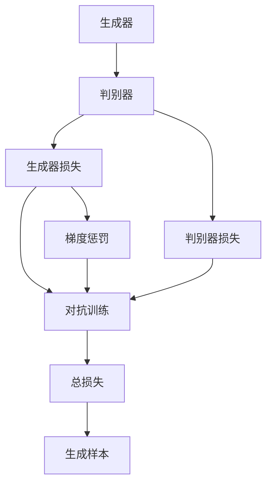
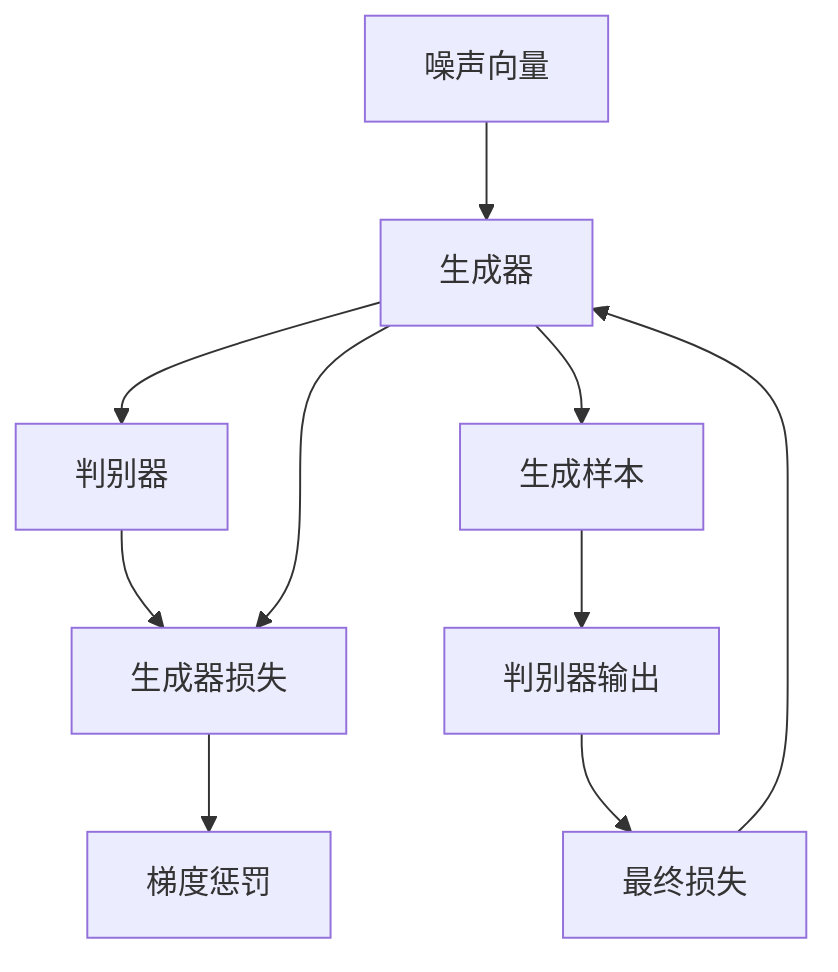

                 

# AI 大模型计算机科学家群英传：生成对抗网络（GAN）的发明者 Ian Goodfellow

## 1. 背景介绍

### 1.1 问题由来
在机器学习领域，生成对抗网络（GANs）是一类革命性的模型，由Ian Goodfellow于2014年提出。GANs成功地解决了深度生成模型中的一些长期存在的问题，如生成模式的稳定性、高维数据的生成、合成图像逼真度等。GANs不仅在图像生成、音频生成、视频生成等计算机视觉和语音领域中取得了重大突破，还扩展到了自然语言处理、推荐系统、数据增强等多个领域，推动了深度学习技术的发展。

### 1.2 问题核心关键点
GANs的核心思想是通过两个网络（生成器和判别器）的对抗过程，使得生成器能够生成尽可能逼真的样本，而判别器能够尽可能准确地区分真实样本和生成样本。GANs的训练过程是一个动态博弈，双方在不断优化中寻求平衡，从而实现高质量的生成结果。

### 1.3 问题研究意义
Ian Goodfellow作为GANs的发明者，其研究成果极大地推动了深度生成模型技术的发展，对计算机视觉、语音处理、自然语言处理等领域产生了深远影响。GANs为人工智能的发展提供了新的思路和方法，提高了数据生成、假数据生成、数据增强等任务的质量，也为艺术创作、电影特效、游戏生成等领域带来了全新的可能性。

## 2. 核心概念与联系

### 2.1 核心概念概述

为了更好地理解GANs，本节将介绍几个密切相关的核心概念：

- **生成对抗网络（GAN）**：由生成器（Generator）和判别器（Discriminator）两部分组成，通过对抗训练来提升生成器的生成能力，使得生成器生成的样本与真实样本无法区分。
- **生成器（Generator）**：负责从噪声或其他随机向量中生成逼真样本的神经网络。
- **判别器（Discriminator）**：负责判断输入样本是真实样本还是生成样本的神经网络。
- **对抗训练**：生成器和判别器通过不断博弈和优化，提升生成器的生成能力。
- **损失函数**：GANs中使用的主要损失函数包括生成器的损失函数和判别器的损失函数。
- **梯度惩罚**：为了防止生成器生成的样本与真实样本边界过于明显，使用梯度惩罚损失函数来平滑边界。

### 2.2 概念间的关系

这些核心概念之间的逻辑关系可以通过以下Mermaid流程图来展示：



这个流程图展示了大模型生成对抗网络的核心概念及其之间的关系：

1. 生成器生成样本。
2. 判别器判断样本的真实性。
3. 生成器损失和判别器损失用于计算对抗训练的目标。
4. 通过对抗训练和梯度惩罚，不断优化生成器生成样本的质量。

### 2.3 核心概念的整体架构

最后，我们用一个综合的流程图来展示这些核心概念在大模型生成对抗网络中的整体架构：



这个综合流程图展示了从噪声向量到生成样本，再到判别器输出的全过程。

## 3. 核心算法原理 & 具体操作步骤
### 3.1 算法原理概述

GANs的训练过程是一个动态博弈，生成器和判别器通过不断优化，最终达到一个平衡状态。具体的训练过程如下：

1. 初始化生成器和判别器网络。
2. 生成器和判别器进行多次交替训练，每次训练分为两个阶段：
   - 判别器训练：输入真实的和生成的样本，输出判别概率，使用判别器损失函数进行优化。
   - 生成器训练：使用判别器损失函数进行优化，生成尽可能逼真的样本。
3. 经过多次交替训练，生成器生成的样本与真实样本无法区分。

GANs的训练目标是最大化生成器的生成能力，同时最小化判别器的判别能力。最终，生成器可以生成高质量的样本，判别器也无法准确区分真实样本和生成样本。

### 3.2 算法步骤详解

下面是具体的GANs训练步骤：

**Step 1: 初始化模型和损失函数**
- 定义生成器和判别器的神经网络结构。
- 定义生成器和判别器的损失函数，如交叉熵损失、Wasserstein距离等。
- 设置优化器（如Adam、SGD等）及其超参数，如学习率。

**Step 2: 训练判别器**
- 输入真实的和生成的样本，计算判别器的输出概率。
- 使用判别器损失函数，计算判别器的损失值。
- 使用优化器，更新判别器的参数，最小化判别器损失。

**Step 3: 训练生成器**
- 使用判别器的参数，计算生成器生成的样本的判别器输出概率。
- 使用生成器损失函数，计算生成器的损失值。
- 使用优化器，更新生成器的参数，最小化生成器损失。
- 进行梯度惩罚，避免生成器生成的样本与真实样本边界过于明显。

**Step 4: 交替训练**
- 重复进行判别器和生成器的交替训练，直至收敛。

**Step 5: 生成样本**
- 使用训练好的生成器生成高质量的样本。

### 3.3 算法优缺点

GANs的优点包括：

- 生成样本逼真度高：GANs能够生成高质量的逼真图像、音频、视频等样本。
- 生成样本多样性高：GANs能够生成多种多样、风格各异的样本。
- 无需标注数据：GANs的训练过程不需要大量标注数据，只需一些随机向量即可。

GANs的缺点包括：

- 训练不稳定：GANs训练过程中容易发生模式崩溃、震荡等问题，难以收敛。
- 生成样本质量不稳定：生成样本质量受训练参数、超参数、初始值等影响较大。
- 难以解释：GANs生成的样本很难解释其生成过程和生成机制。

### 3.4 算法应用领域

GANs在计算机视觉、语音处理、自然语言处理、音乐生成等领域都有广泛应用：

- **图像生成**：GANs能够生成逼真的图片，如人脸生成、风景生成、艺术品生成等。
- **视频生成**：GANs能够生成高质量的视频，如动态风景、人物动作、动画电影等。
- **音频生成**：GANs能够生成逼真的音频，如音乐生成、语音合成、音频效果增强等。
- **自然语言生成**：GANs能够生成自然的语言文本，如对话生成、摘要生成、文章生成等。
- **推荐系统**：GANs能够生成个性化推荐，提升推荐效果。
- **数据增强**：GANs能够生成更多的训练数据，提升模型泛化能力。

## 4. 数学模型和公式 & 详细讲解 & 举例说明
### 4.1 数学模型构建

GANs的数学模型基于最大化生成器的生成能力，最小化判别器的判别能力。假设生成器和判别器的输入和输出分别为 $G(z)$ 和 $D(x)$，其中 $z$ 为噪声向量，$x$ 为输入样本。生成器和判别器的损失函数分别为 $\mathcal{L}_G$ 和 $\mathcal{L}_D$，总损失函数为 $\mathcal{L} = \mathcal{L}_G + \mathcal{L}_D$。

### 4.2 公式推导过程

我们以常见的Wasserstein GAN为例，推导其生成器和判别器的损失函数：

**判别器损失函数**：

$$
\mathcal{L}_D = \mathbb{E}_{x} [D(x)] - \mathbb{E}_{z} [D(G(z))]
$$

其中，$\mathbb{E}_x$ 表示真实的样本分布，$\mathbb{E}_z$ 表示生成器生成的样本分布。

**生成器损失函数**：

$$
\mathcal{L}_G = -\mathbb{E}_{z} [D(G(z))]
$$

将判别器损失函数代入总损失函数，得到：

$$
\mathcal{L} = \mathcal{L}_G + \mathcal{L}_D = -\mathbb{E}_{z} [D(G(z))] + \mathbb{E}_{x} [D(x)] - \mathbb{E}_{z} [D(G(z))]
$$

化简得：

$$
\mathcal{L} = -\mathbb{E}_{x} [D(x)] + \mathbb{E}_{z} [D(G(z))]
$$

### 4.3 案例分析与讲解

以图像生成任务为例，假设我们有真实图片 $x \sim p_{data}$ 和噪声向量 $z \sim p_{z}$。生成器 $G(z)$ 生成图片，判别器 $D(x)$ 判断图片是否为真实图片。我们使用交叉熵损失函数和Wasserstein距离损失函数，分别计算生成器和判别器的损失。

**判别器损失函数**：

$$
\mathcal{L}_D = \mathbb{E}_{x} \log D(x) + \mathbb{E}_{z} \log (1 - D(G(z)))
$$

**生成器损失函数**：

$$
\mathcal{L}_G = -\mathbb{E}_{z} \log D(G(z))
$$

其中，$D(x)$ 表示判别器判断图片为真实图片的概率，$D(G(z))$ 表示判别器判断生成器生成的图片为真实图片的概率。

## 5. 项目实践：代码实例和详细解释说明
### 5.1 开发环境搭建

在进行GANs实践前，我们需要准备好开发环境。以下是使用Python进行PyTorch开发的环境配置流程：

1. 安装Anaconda：从官网下载并安装Anaconda，用于创建独立的Python环境。

2. 创建并激活虚拟环境：
```bash
conda create -n pytorch-env python=3.8 
conda activate pytorch-env
```

3. 安装PyTorch：根据CUDA版本，从官网获取对应的安装命令。例如：
```bash
conda install pytorch torchvision torchaudio cudatoolkit=11.1 -c pytorch -c conda-forge
```

4. 安装TensorFlow：使用pip安装TensorFlow，可自行选择GPU版本。

5. 安装TensorBoard：使用pip安装TensorBoard，用于可视化训练过程。

完成上述步骤后，即可在`pytorch-env`环境中开始GANs实践。

### 5.2 源代码详细实现

下面我们以图像生成任务为例，给出使用PyTorch和TensorFlow实现GANs的代码。

**PyTorch实现**：

首先，定义生成器和判别器的神经网络结构：

```python
import torch.nn as nn
import torch.optim as optim
import torch
import torchvision.transforms as transforms

class Generator(nn.Module):
    def __init__(self):
        super(Generator, self).__init__()
        self.main = nn.Sequential(
            nn.ConvTranspose2d(100, 256, 4, 1, 0, bias=False),
            nn.BatchNorm2d(256),
            nn.ReLU(True),
            nn.ConvTranspose2d(256, 128, 4, 2, 1, bias=False),
            nn.BatchNorm2d(128),
            nn.ReLU(True),
            nn.ConvTranspose2d(128, 64, 4, 2, 1, bias=False),
            nn.BatchNorm2d(64),
            nn.ReLU(True),
            nn.ConvTranspose2d(64, 3, 4, 2, 1, bias=False),
            nn.Tanh()
        )

    def forward(self, input):
        return self.main(input)

class Discriminator(nn.Module):
    def __init__(self):
        super(Discriminator, self).__init__()
        self.main = nn.Sequential(
            nn.Conv2d(3, 64, 4, 2, 1, bias=False),
            nn.LeakyReLU(0.2, inplace=True),
            nn.Conv2d(64, 128, 4, 2, 1, bias=False),
            nn.BatchNorm2d(128),
            nn.LeakyReLU(0.2, inplace=True),
            nn.Conv2d(128, 256, 4, 2, 1, bias=False),
            nn.BatchNorm2d(256),
            nn.LeakyReLU(0.2, inplace=True),
            nn.Conv2d(256, 1, 4, 1, 0, bias=False),
            nn.Sigmoid()
        )

    def forward(self, input):
        return self.main(input)
```

然后，定义训练函数和优化器：

```python
batch_size = 128
learning_rate = 0.0002
b1 = 0.5
b2 = 0.999

device = torch.device("cuda:0" if torch.cuda.is_available() else "cpu")

G = Generator().to(device)
D = Discriminator().to(device)

G_optimizer = optim.Adam(G.parameters(), lr=learning_rate, betas=(b1, b2))
D_optimizer = optim.Adam(D.parameters(), lr=learning_rate, betas=(b1, b2))

def train_GAN(G, D, D_optimizer, G_optimizer, real_data, num_epochs, device):
    batches_per_epoch = real_data.size(0) // batch_size
    for epoch in range(num_epochs):
        for i in range(batches_per_epoch):
            real_data, _ = real_data.next()
            real_data = real_data.to(device)

            # 生成器训练
            G_optimizer.zero_grad()
            fake_data = G(torch.randn(batch_size, 100, device=device))
            fake_label = torch.ones(batch_size, device=device)
            real_label = torch.zeros(batch_size, device=device)
            G_loss = criterion(D(fake_data), fake_label)
            G_loss.backward()
            G_optimizer.step()

            # 判别器训练
            D_optimizer.zero_grad()
            real_data = real_data.to(device)
            real_label = torch.ones(batch_size, device=device)
            fake_data = G(torch.randn(batch_size, 100, device=device))
            fake_label = torch.zeros(batch_size, device=device)
            D_real = D(real_data)
            D_fake = D(fake_data)
            D_loss_real = criterion(D_real, real_label)
            D_loss_fake = criterion(D_fake, fake_label)
            D_loss = D_loss_real + D_loss_fake
            D_loss.backward()
            D_optimizer.step()
```

最后，启动训练流程：

```python
num_epochs = 100

# 加载数据集
real_data = # 加载真实数据集

# 训练模型
train_GAN(G, D, D_optimizer, G_optimizer, real_data, num_epochs, device)
```

**TensorFlow实现**：

首先，定义生成器和判别器的神经网络结构：

```python
import tensorflow as tf
import tensorflow_datasets as tfds

class Generator(tf.keras.Model):
    def __init__(self):
        super(Generator, self).__init__()
        self.dense1 = tf.keras.layers.Dense(256, input_shape=(100,))
        self.dense2 = tf.keras.layers.Dense(256)
        self.dense3 = tf.keras.layers.Dense(256)
        self.dense4 = tf.keras.layers.Dense(256)
        self.dense5 = tf.keras.layers.Dense(64)
        self.dense6 = tf.keras.layers.Dense(3)

    def call(self, inputs):
        x = tf.nn.leaky_relu(self.dense1(inputs))
        x = tf.nn.leaky_relu(self.dense2(x))
        x = tf.nn.leaky_relu(self.dense3(x))
        x = tf.nn.leaky_relu(self.dense4(x))
        x = self.dense5(x)
        return tf.nn.tanh(x)

class Discriminator(tf.keras.Model):
    def __init__(self):
        super(Discriminator, self).__init__()
        self.dense1 = tf.keras.layers.Dense(64, input_shape=(28, 28, 1))
        self.dense2 = tf.keras.layers.Dense(128)
        self.dense3 = tf.keras.layers.Dense(256)
        self.dense4 = tf.keras.layers.Dense(256)
        self.dense5 = tf.keras.layers.Dense(1)

    def call(self, inputs):
        x = tf.nn.leaky_relu(self.dense1(inputs))
        x = tf.nn.leaky_relu(self.dense2(x))
        x = tf.nn.leaky_relu(self.dense3(x))
        x = tf.nn.leaky_relu(self.dense4(x))
        return self.dense5(x)
```

然后，定义训练函数和优化器：

```python
batch_size = 128
learning_rate = 0.0002
b1 = 0.5
b2 = 0.999

device = tf.device("/device:GPU:0" if tf.test.gpu_device_name() else "/device:CPU:0")

G = Generator()
D = Discriminator()

G_optimizer = tf.keras.optimizers.Adam(learning_rate, beta_1=b1, beta_2=b2)
D_optimizer = tf.keras.optimizers.Adam(learning_rate, beta_1=b1, beta_2=b2)

@tf.function
def train_GAN(G, D, D_optimizer, G_optimizer, real_data, num_epochs):
    batches_per_epoch = real_data.num_samples // batch_size
    for epoch in range(num_epochs):
        for i in range(batches_per_epoch):
            real_data, _ = real_data.next()
            real_data = real_data.batch(batch_size)

            # 生成器训练
            G_optimizer.minimize(lambda: loss_G(D(G(tf.random.normal([batch_size, 100]))), G_optimizer)

            # 判别器训练
            D_optimizer.minimize(lambda: loss_D(D(real_data), D(G(tf.random.normal([batch_size, 100]))), D_optimizer)
```

最后，启动训练流程：

```python
num_epochs = 100

# 加载数据集
real_data = # 加载真实数据集

# 训练模型
train_GAN(G, D, D_optimizer, G_optimizer, real_data, num_epochs)
```

### 5.3 代码解读与分析

让我们再详细解读一下关键代码的实现细节：

**PyTorch实现**：

1. **生成器和判别器定义**：使用`nn.Sequential`和`nn.ConvTranspose2d`、`nn.Conv2d`等层来定义生成器和判别器的结构。
2. **训练函数**：通过前向传播计算损失，反向传播更新参数，使用优化器更新模型。
3. **模型训练**：使用PyTorch的数据迭代器`DataLoader`，并结合`torchvision.transforms`进行数据预处理。

**TensorFlow实现**：

1. **生成器和判别器定义**：使用`tf.keras.layers`和`tf.nn.leaky_relu`等层来定义生成器和判别器的结构。
2. **训练函数**：使用`tf.function`装饰器将训练过程编译为图，并使用`tf.keras.optimizers.Adam`优化器。
3. **模型训练**：使用TensorFlow的数据迭代器`tf.data.Dataset`，并结合`tf.random.normal`进行随机采样。

## 6. 实际应用场景
### 6.1 图像生成

GANs在图像生成领域有着广泛的应用，如人脸生成、风景生成、艺术品生成等。在图像生成任务中，GANs能够生成高质量、多样化的图像，并且可以生成非现实、虚构的图像。

### 6.2 视频生成

GANs在视频生成领域也有着重要的应用，如动态风景、人物动作、动画电影等。通过GANs，我们可以生成逼真的视频片段，并将其用于电影特效、虚拟现实等领域。

### 6.3 音频生成

GANs在音频生成领域也有着广泛的应用，如音乐生成、语音合成、音频效果增强等。通过GANs，我们可以生成逼真的音频样本，并将其用于音乐创作、声音合成等领域。

### 6.4 自然语言生成

GANs在自然语言生成领域也有着重要的应用，如对话生成、摘要生成、文章生成等。通过GANs，我们可以生成自然流畅的语言文本，并将其用于智能客服、自动摘要等领域。

### 6.5 推荐系统

GANs在推荐系统领域也有着广泛的应用，如个性化推荐、推荐系统数据增强等。通过GANs，我们可以生成更多的推荐数据，提升推荐模型的泛化能力。

## 7. 工具和资源推荐
### 7.1 学习资源推荐

为了帮助开发者系统掌握GANs的理论基础和实践技巧，这里推荐一些优质的学习资源：

1. **《生成对抗网络》书籍**：由Ian Goodfellow等人撰写，全面介绍了GANs的基本原理、算法设计、应用场景等。
2. **《Deep Generative Models》课程**：斯坦福大学开设的深度生成模型课程，涵盖了GANs、变分自编码器、自编码器等前沿主题。
3. **PyTorch官方文档**：PyTorch的官方文档，提供了丰富的GANs示例代码和教程。
4. **TensorFlow官方文档**：TensorFlow的官方文档，提供了详细的GANs实现和案例。
5. **Hugging Face博客**：Hugging Face的博客，介绍了许多基于GANs的技术和应用案例。

通过对这些资源的学习实践，相信你一定能够快速掌握GANs的精髓，并用于解决实际的生成任务。

### 7.2 开发工具推荐

高效的开发离不开优秀的工具支持。以下是几款用于GANs开发的常用工具：

1. **PyTorch**：基于Python的开源深度学习框架，灵活动态的计算图，适合快速迭代研究。大部分GANs的实现都有PyTorch版本的支持。
2. **TensorFlow**：由Google主导开发的开源深度学习框架，生产部署方便，适合大规模工程应用。同样有丰富的GANs资源。
3. **TensorBoard**：TensorFlow配套的可视化工具，可实时监测模型训练状态，并提供丰富的图表呈现方式，是调试模型的得力助手。
4. **Weights & Biases**：模型训练的实验跟踪工具，可以记录和可视化模型训练过程中的各项指标，方便对比和调优。与主流深度学习框架无缝集成。

合理利用这些工具，可以显著提升GANs开发的效率，加快创新迭代的步伐。

### 7.3 相关论文推荐

GANs在计算机视觉、语音处理、自然语言处理等领域都有广泛应用。以下是几篇奠基性的相关论文，推荐阅读：

1. **《Generative Adversarial Nets》**：Ian Goodfellow等人提出的GANs原论文，详细介绍了GANs的基本原理和算法设计。
2. **《Improved Techniques for Training GANs》**：Goodfellow等人提出的改进GANs训练的方法，如梯度惩罚、Wasserstein距离等。
3. **《On the Convergence of GANs》**：Arjovsky等人探讨了GANs收敛性的理论问题，提供了许多改进训练方法的理论依据。
4. **《Evaluation of GANs for Real-World Image Generation》**：Isola等人通过实验评估了GANs在真实世界图像生成中的性能，提供了一些实用的技巧和建议。
5. **《Image-to-Image Translation with Conditional Adversarial Networks》**：Isola等人提出了基于条件GANs的图像翻译方法，在图像风格转换、人脸生成等领域取得了很好的效果。

这些论文代表了大模型生成对抗网络的发展脉络。通过学习这些前沿成果，可以帮助研究者把握学科前进方向，激发更多的创新灵感。

除上述资源外，还有一些值得关注的前沿资源，帮助开发者紧跟GANs技术的最新进展，例如：

1. **arXiv论文预印本**：人工智能领域最新研究成果的发布平台，包括大量尚未发表的前沿工作，学习前沿技术的必读资源。
2. **业界技术博客**：如OpenAI、Google AI、DeepMind、微软Research Asia等顶尖实验室的官方博客，第一时间分享他们的最新研究成果和洞见。
3. **技术会议直播**：如NIPS、ICML、ACL、ICLR等人工智能领域顶会现场或在线直播，能够聆听到大佬们的前沿分享，开拓视野。
4. **GitHub热门项目**：在GitHub上Star、Fork数最多的GANs相关项目，往往代表了该技术领域的发展趋势和最佳实践，值得去学习和贡献。
5. **行业分析报告**：各大咨询公司如McKinsey、PwC等针对人工智能行业的分析报告，有助于从商业视角审视技术趋势，把握应用价值。

总之，对于GANs的学习和实践，需要开发者保持开放的心态和持续学习的意愿。多关注前沿资讯，多动手实践，多思考总结，必将收获满满的成长收益。

## 8. 总结：未来发展趋势与挑战
### 8.1 研究成果总结

Ian Goodfellow作为GANs的发明者，其研究成果极大地推动了深度生成模型技术的发展，对计算机视觉、语音处理、自然语言处理等领域产生了深远影响。GANs为人工智能的发展提供了新的思路和方法

