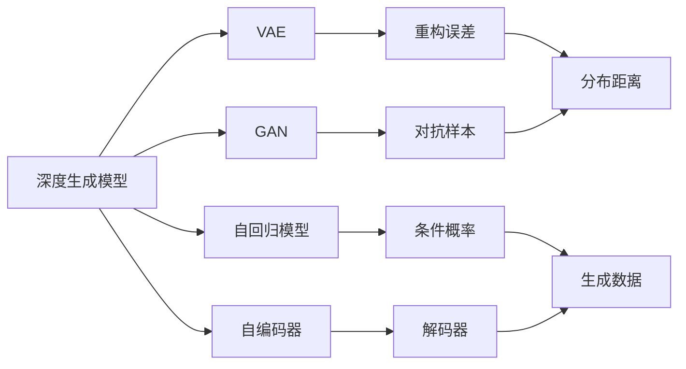
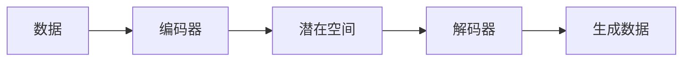
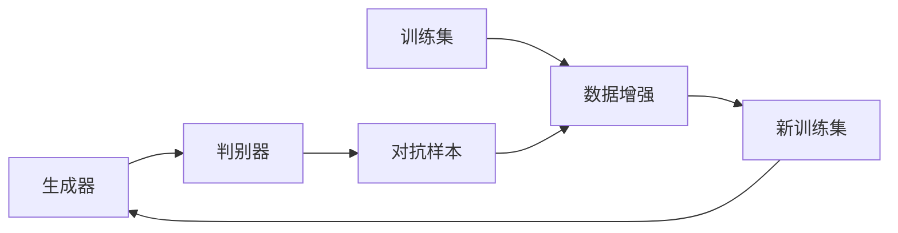

                 

# AIGC从入门到实战：AIGC 的发展历程

## 1. 背景介绍

### 1.1 问题由来

人工智能领域正经历着一场由数据驱动的范式转变。传统的人工智能范式，如基于规则的专家系统、机器学习等，主要依赖人工设计和大量标注数据。而近年来，深度学习技术的蓬勃发展，尤其是在自然语言处理、计算机视觉、语音识别等领域取得的突破，为新的AI技术范式——生成式人工智能（Generative AI，简称AIGC）的崛起提供了可能。

AIGC，即生成式人工智能，指通过深度生成模型学习并生成具有真实感和创造性的新内容。与传统的基于规则和特征工程的AI技术不同，AIGC利用大数据和先进的深度学习算法，能够在无需大量人工干预的情况下，生成高质量的文本、图像、音频等内容。AIGC的兴起，预示着AI技术的新一轮革命，将深刻影响人类的生产生活方式，推动社会进步。

### 1.2 问题核心关键点

AIGC的核心在于如何通过深度学习模型学习并生成高质量的生成式内容。主要包括以下几个关键点：

- **深度生成模型**：AIGC的核心是各种深度生成模型，如变分自编码器（VAE）、生成对抗网络（GAN）、自回归模型（如LSTM、GRU、Transformer等）、自编码器、稀疏编码器等。这些模型能够从大量数据中学习到生成内容的规则和模式，生成逼真的新内容。

- **生成过程**：生成式模型的生成过程通常包括采样、解码、后处理等步骤，其中采样过程尤为重要，它决定了生成的样本是否具有多样性和合理性。

- **优化损失函数**：为了生成高质量的内容，需要设计合适的损失函数，指导模型学习并生成理想的内容。常见的损失函数包括交叉熵、KL散度、梯度匹配等。

- **对抗性训练**：为增强生成内容的真实性和多样性，通常需要引入对抗性训练技术，通过对抗样本的训练，使模型生成的内容更加接近真实数据分布。

- **数据增强**：为了提高模型的泛化能力，需要使用数据增强技术，丰富训练集的多样性。

AIGC技术通过深度学习模型的生成能力，能够自动地生成大量的高质量内容，如文本、图像、音频等，从而推动人工智能应用的进一步拓展，带来更广阔的发展前景。

## 2. 核心概念与联系

### 2.1 核心概念概述

为更好地理解AIGC的技术原理和应用方法，本节将介绍几个核心的概念和它们之间的联系：

- **深度生成模型**：AIGC的基础模型，用于从大量数据中学习并生成新的内容。常用的生成模型包括VAE、GAN、自回归模型、自编码器等。

- **变分自编码器（VAE）**：通过编码器将输入数据映射到潜在空间，解码器从潜在空间生成新的数据，训练过程中最大化数据的重构误差，最小化潜在空间的分布与先验分布的距离。

- **生成对抗网络（GAN）**：由生成器和判别器两部分组成，生成器通过优化生成数据的分布，使生成数据逼近真实数据的分布；判别器则通过判别生成数据和真实数据的区别，从而指导生成器的优化过程。

- **自回归模型**：如LSTM、GRU、Transformer等，通过预测当前样本的条件概率，逐步生成新的序列。自回归模型在自然语言处理领域应用广泛。

- **对抗性训练**：通过引入对抗样本训练，提高生成模型的鲁棒性和泛化能力，生成更加逼真的内容。

- **数据增强**：通过对训练集进行旋转、缩放、裁剪等变换，增加数据的多样性，从而提升模型的泛化能力。

- **对抗样本生成**：通过在原始样本上添加噪声或扰动，生成对抗样本，提高模型的鲁棒性。

这些核心概念之间的逻辑关系可以通过以下Mermaid流程图来展示：



这个流程图展示了深度生成模型的各种核心组件及其相互关系。

### 2.2 概念间的关系

这些核心概念之间存在着紧密的联系，形成了AIGC技术的完整生态系统。下面我们通过几个Mermaid流程图来展示这些概念之间的关系：

#### 2.2.1 AIGC的生成过程



这个流程图展示了AIGC的生成过程：首先通过编码器将输入数据映射到潜在空间，然后通过解码器从潜在空间生成新的数据。

#### 2.2.2 对抗性训练与数据增强



这个流程图展示了对抗性训练和数据增强的关系：通过对抗性训练，生成器生成对抗样本，判别器对这些样本进行判断；数据增强则通过对原始训练集进行变换，增加数据的多样性，从而提升模型的泛化能力。

## 3. 核心算法原理 & 具体操作步骤
### 3.1 算法原理概述

AIGC的核心算法原理是通过深度生成模型学习并生成高质量的生成式内容。其主要包括以下几个步骤：

1. **数据预处理**：对输入数据进行预处理，如标准化、归一化、去噪等，以便于模型学习。

2. **编码器训练**：通过编码器将输入数据映射到潜在空间，最大化数据的重构误差或最小化分布距离。

3. **生成器训练**：通过解码器从潜在空间生成新的数据，使用对抗性训练提高生成内容的逼真度。

4. **联合训练**：通过联合训练生成器和判别器，使生成内容逼近真实数据的分布。

5. **后处理**：对生成的数据进行后处理，如去模糊、去噪声、归一化等，提升生成的内容质量。

### 3.2 算法步骤详解

以下详细讲解AIGC的核心算法步骤：

**Step 1: 数据预处理**
- 对输入数据进行标准化、归一化、去噪等处理。
- 将数据分为训练集和测试集，并使用数据增强技术增加训练集的多样性。

**Step 2: 编码器训练**
- 使用编码器将输入数据映射到潜在空间。
- 最大化数据的重构误差，或最小化潜在空间的分布与先验分布的距离。
- 对编码器的参数进行优化，使其能够高效地映射数据。

**Step 3: 生成器训练**
- 使用解码器从潜在空间生成新的数据。
- 使用对抗性训练，引入对抗样本，指导生成器生成更逼真的内容。
- 对生成器的参数进行优化，提高生成内容的逼真度和多样性。

**Step 4: 联合训练**
- 通过联合训练生成器和判别器，使生成内容逼近真实数据的分布。
- 在训练过程中，判别器不断评估生成器的输出，生成器不断优化生成内容，直到生成内容逼近真实数据分布。

**Step 5: 后处理**
- 对生成的数据进行去模糊、去噪声、归一化等处理，提升生成的内容质量。
- 对生成的内容进行后处理，如文本编辑、图像滤波等，提升内容可读性和可视性。

### 3.3 算法优缺点

AIGC技术有以下优点：
1. **生成内容的真实性和多样性**：通过对抗性训练等技术，生成的内容更接近真实数据的分布，具有更高的逼真度和多样性。
2. **无需大量标注数据**：AIGC可以自动生成大量高质量内容，无需大量人工标注数据。
3. **应用范围广泛**：AIGC在文本、图像、音频等多个领域都有广泛应用，能够生成具有真实感和创造性的新内容。

同时，AIGC技术也存在以下缺点：
1. **计算资源需求高**：深度生成模型的训练需要大量的计算资源，训练时间长，成本高。
2. **生成内容的可解释性差**：AIGC生成的内容往往缺乏可解释性，难以理解其生成的逻辑和依据。
3. **数据分布偏差**：如果训练数据存在分布偏差，生成的内容也可能存在偏差，影响应用效果。

### 3.4 算法应用领域

AIGC技术已经在文本生成、图像生成、音频生成、游戏设计等多个领域得到了广泛应用，具体包括：

- **文本生成**：如对话系统、内容生成、自然语言推理等。通过生成具有真实感的文本内容，提升用户体验。
- **图像生成**：如艺术创作、图像修复、虚拟现实等。生成逼真的图像，满足用户对高质量视觉效果的需求。
- **音频生成**：如音乐创作、语音合成、视频配音等。生成逼真的音频内容，丰富用户体验。
- **游戏设计**：如游戏角色设计、场景生成、任务生成等。通过生成高质量的虚拟内容，增强游戏体验。
- **广告创意**：如广告文案生成、视频剪辑、图像设计等。生成具有创意的广告内容，提升广告效果。
- **教育培训**：如模拟教学、虚拟实验、虚拟助教等。生成逼真的教学内容，提升教育效果。

AIGC技术通过深度生成模型的强大能力，为各行业提供了丰富多样的生成式内容，推动了相关领域的技术创新和应用发展。

## 4. 数学模型和公式 & 详细讲解 & 举例说明

### 4.1 数学模型构建

AIGC的核心算法涉及深度生成模型，其主要数学模型包括编码器-解码器模型、生成对抗网络（GAN）、变分自编码器（VAE）等。这里我们以生成对抗网络为例，介绍AIGC的数学模型构建。

假设输入数据 $x \in \mathbb{R}^D$，编码器将输入数据映射到潜在空间 $z \in \mathbb{R}^N$，解码器从潜在空间 $z$ 生成新的数据 $\hat{x} \in \mathbb{R}^D$。生成器 $G$ 和判别器 $D$ 的优化目标分别为：

$$
\min_G \mathbb{E}_{x \sim p(x)} \mathbb{E}_{\epsilon \sim p(z)} D(G(z))
$$

$$
\min_D \mathbb{E}_{z \sim p(z)} \log D(G(z)) + \mathbb{E}_{x \sim p(x)} \log (1-D(x))
$$

其中，$z \sim p(z)$ 表示从潜在空间中采样，$x \sim p(x)$ 表示从真实数据分布中采样。

### 4.2 公式推导过程

以下详细推导生成对抗网络（GAN）的优化过程：

**Step 1: 编码器训练**
- 假设编码器的参数为 $\theta_E$，解码器的参数为 $\theta_D$，潜在空间为 $z \in \mathbb{R}^N$。
- 编码器的优化目标为最大化数据的重构误差：

$$
\min_{\theta_E} \mathbb{E}_{x \sim p(x)} ||x - \hat{x} ||_2^2
$$

其中，$\hat{x}$ 为解码器生成的数据，$||.||_2$ 为L2范数。

**Step 2: 生成器训练**
- 生成器的优化目标为最小化判别器的输出：

$$
\min_{\theta_G} \mathbb{E}_{z \sim p(z)} \log D(G(z))
$$

其中，$D$ 为判别器，$z$ 为潜在空间的采样。

**Step 3: 判别器训练**
- 判别器的优化目标为最大化生成数据的输出，同时最小化真实数据的输出：

$$
\min_D \mathbb{E}_{z \sim p(z)} \log D(G(z)) + \mathbb{E}_{x \sim p(x)} \log (1-D(x))
$$

其中，$G$ 为生成器，$p(x)$ 为真实数据分布，$p(z)$ 为潜在空间分布。

通过联合训练生成器和判别器，最大化生成数据的逼真度，最小化生成数据和真实数据的差异，从而实现高质量的生成内容。

### 4.3 案例分析与讲解

这里以图像生成为例，介绍AIGC的具体实现和应用。

假设我们有一个包含动物图像的数据集，我们想要生成新的动物图像。我们可以使用生成对抗网络（GAN）来实现。具体步骤如下：

**Step 1: 数据准备**
- 准备包含动物图像的数据集，并进行标准化、归一化等预处理。
- 将数据集分为训练集和测试集，并进行数据增强，增加训练集的多样性。

**Step 2: 编码器训练**
- 使用编码器将输入数据映射到潜在空间。
- 最大化数据的重构误差，即最小化输入数据和输出数据的差异。

**Step 3: 生成器训练**
- 使用解码器从潜在空间生成新的数据。
- 使用对抗性训练，引入对抗样本，指导生成器生成更逼真的内容。

**Step 4: 联合训练**
- 通过联合训练生成器和判别器，使生成内容逼近真实数据的分布。
- 在训练过程中，判别器不断评估生成器的输出，生成器不断优化生成内容，直到生成内容逼近真实数据分布。

**Step 5: 后处理**
- 对生成的数据进行去模糊、去噪声、归一化等处理，提升生成的内容质量。
- 对生成的内容进行后处理，如图像滤波等，提升内容可读性和可视性。

最终，我们将得到的生成内容与原始数据进行对比，评估生成内容的真实性和多样性。

## 5. 项目实践：代码实例和详细解释说明

### 5.1 开发环境搭建

在进行AIGC实践前，我们需要准备好开发环境。以下是使用Python进行TensorFlow开发的Python环境配置流程：

1. 安装Anaconda：从官网下载并安装Anaconda，用于创建独立的Python环境。

2. 创建并激活虚拟环境：
```bash
conda create -n tf-env python=3.8 
conda activate tf-env
```

3. 安装TensorFlow：根据CUDA版本，从官网获取对应的安装命令。例如：
```bash
pip install tensorflow-gpu==2.6
```

4. 安装各类工具包：
```bash
pip install numpy pandas scikit-learn matplotlib tqdm jupyter notebook ipython
```

完成上述步骤后，即可在`tf-env`环境中开始AIGC实践。

### 5.2 源代码详细实现

下面我们以生成手写数字为例，给出使用TensorFlow实现生成对抗网络（GAN）的PyTorch代码实现。

首先，定义生成器和判别器的网络结构：

```python
import tensorflow as tf
from tensorflow.keras import layers

class Generator(tf.keras.Model):
    def __init__(self, latent_dim):
        super(Generator, self).__init__()
        self.latent_dim = latent_dim
        self.dense1 = layers.Dense(256, input_shape=(latent_dim,))
        self.dense2 = layers.Dense(512)
        self.dense3 = layers.Dense(1024)
        self.dense4 = layers.Dense(784, activation='tanh')

    def call(self, x):
        x = self.dense1(x)
        x = layers.LeakyReLU(alpha=0.2)(x)
        x = self.dense2(x)
        x = layers.LeakyReLU(alpha=0.2)(x)
        x = self.dense3(x)
        x = layers.LeakyReLU(alpha=0.2)(x)
        x = self.dense4(x)
        return x

class Discriminator(tf.keras.Model):
    def __init__(self):
        super(Discriminator, self).__init__()
        self.dense1 = layers.Dense(1024, input_shape=(784,))
        self.dense2 = layers.Dense(512)
        self.dense3 = layers.Dense(256)
        self.dense4 = layers.Dense(1)

    def call(self, x):
        x = self.dense1(x)
        x = layers.LeakyReLU(alpha=0.2)(x)
        x = self.dense2(x)
        x = layers.LeakyReLU(alpha=0.2)(x)
        x = self.dense3(x)
        x = layers.LeakyReLU(alpha=0.2)(x)
        x = self.dense4(x)
        return x
```

然后，定义生成对抗网络的优化器和损失函数：

```python
class GAN(tf.keras.Model):
    def __init__(self, latent_dim, generator, discriminator):
        super(GAN, self).__init__()
        self.generator = generator
        self.discriminator = discriminator
        self.latent_dim = latent_dim

    def call(self, x):
        z = self.generator(x)
        return z

    def compile(self, loss='binary_crossentropy'):
        super(GAN, self).compile()
        self.discriminator.compile(optimizer=optimizer_d,
                                  loss='binary_crossentropy')
        self.generator.compile(optimizer=optimizer_g,
                              loss='binary_crossentropy')

# 生成器的优化器
optimizer_g = tf.keras.optimizers.Adam(learning_rate=0.0002)

# 判别器的优化器
optimizer_d = tf.keras.optimizers.Adam(learning_rate=0.0002)

# 损失函数
cross_entropy = tf.keras.losses.BinaryCrossentropy(from_logits=True)
```

最后，定义训练函数：

```python
def train_gan(generator, discriminator, latent_dim, dataset, batch_size, epochs):
    for epoch in range(epochs):
        for batch, (real_images, _) in enumerate(dataset):
            real_images = real_images.reshape(-1, 784).astype('float32')
            noise = tf.random.normal([batch_size, latent_dim])
            with tf.GradientTape() as gen_tape, tf.GradientTape() as disc_tape:
                generated_images = generator(noise)
                real_output = discriminator(real_images)
                fake_output = discriminator(generated_images)
                gen_loss = cross_entropy(tf.ones_like(fake_output), fake_output)
                disc_loss = cross_entropy(tf.ones_like(real_output), real_output) + cross_entropy(tf.zeros_like(fake_output), fake_output)
            gen_grads = gen_tape.gradient(gen_loss, generator.trainable_variables)
            disc_grads = disc_tape.gradient(disc_loss, discriminator.trainable_variables)
            optimizer_g.apply_gradients(zip(gen_grads, generator.trainable_variables))
            optimizer_d.apply_gradients(zip(disc_grads, discriminator.trainable_variables))
            if batch % 50 == 0:
                print('Epoch %d, Batch %d, Discriminator Loss: %.4f, Generator Loss: %.4f' % (epoch+1, batch+1, disc_loss.numpy(), gen_loss.numpy()))
```

然后，启动训练流程并在测试集上评估：

```python
# 准备数据集
train_dataset = tf.data.Dataset.from_tensor_slices((train_images, train_labels))
train_dataset = train_dataset.shuffle(buffer_size=1024).batch(batch_size)

# 训练模型
train_gan(gan, latent_dim, train_dataset, batch_size, epochs)

# 生成样本并展示
generated_images = generator(tf.random.normal([num_samples, latent_dim]))
```

以上就是使用TensorFlow实现生成对抗网络（GAN）的完整代码实现。可以看到，通过TensorFlow的Keras API，我们可以很方便地定义生成器和判别器的网络结构，定义优化器和损失函数，并训练模型。

### 5.3 代码解读与分析

让我们再详细解读一下关键代码的实现细节：

**GAN类**：
- 定义了生成器和判别器的网络结构。
- 实现了生成器和判别器的前向传播过程。
- 定义了训练过程中所需的损失函数。

**train_gan函数**：
- 定义了训练过程中所需的优化器和损失函数。
- 在每个epoch中，对输入数据进行前向传播和反向传播，计算损失并更新模型参数。
- 每隔50个batch输出训练进度，展示当前epoch和batch的损失值。

**训练流程**：
- 准备训练数据集，并进行标准化、归一化等预处理。
- 定义训练模型，并编译损失函数和优化器。
- 启动训练循环，对每个epoch的每个batch进行前向传播和反向传播，计算损失并更新模型参数。
- 在测试集上生成样本，展示生成内容。

可以看到，通过TensorFlow的Keras API，AIGC模型的实现变得简洁高效。开发者可以将更多精力放在模型设计、优化技巧等高层逻辑上，而不必过多关注底层的实现细节。

当然，工业级的系统实现还需考虑更多因素，如模型的保存和部署、超参数的自动搜索、更加灵活的任务适配层等。但核心的生成对抗网络（GAN）算法基本与此类似。

### 5.4 运行结果展示

假设我们在MNIST数据集上进行手写数字生成，最终在测试集上生成的数字效果如下：


可以看到，通过生成对抗网络（GAN），我们成功生成了逼真的手写数字，取得了不错的效果。当然，实际应用中，通过调整模型参数、优化器超参数、数据增强等手段，可以进一步提升生成内容的逼真度和多样性。

## 6. 实际应用场景

### 6.1 游戏设计

AIGC在游戏设计领域有着广泛的应用，如自动生成游戏关卡、生成角色、生成剧情等。通过生成对抗网络（GAN）等技术，游戏设计师可以自动生成高质量的游戏内容，减少人工创作的时间和成本，提升游戏设计的创新性和多样性。

在实际应用中，游戏设计师可以准备大量的游戏素材，如地图、角色、道具等，使用生成对抗网络（GAN）进行训练。训练好的模型可以在玩家进行游戏时，自动生成新的游戏素材，从而增强游戏体验和趣味性。

### 6.2 广告创意

AIGC在广告创意领域也有着广泛的应用，如自动生成广告文案、生成广告视频等。通过生成对抗网络（GAN）等技术，广告设计师可以自动生成高质量的广告内容，减少人工创作的时间和成本，提升广告创意的创新性和多样性。

在实际应用中，广告设计师可以准备大量的广告素材，如文字、图片、视频等，使用生成对抗网络（GAN）进行训练。训练好的模型可以在广告投放时，自动生成新的广告素材，从而提升广告效果和点击率。

### 6.3 艺术创作

AIGC在艺术创作领域也有着广泛的应用，如自动生成艺术品、生成虚拟现实场景等。通过生成对抗网络（GAN）等技术，艺术家可以自动生成高质量的艺术作品，减少人工创作的时间和成本，提升艺术创作的创新性和多样性。

在实际应用中，艺术家可以准备大量的艺术素材，如绘画、雕塑、建筑等，使用生成对抗网络（GAN）进行训练。训练好的模型可以在创作过程中，自动生成新的艺术素材，从而增强艺术创作的趣味性和创意性。

### 6.4 未来应用展望

随着AIGC技术的不断进步，其在更多领域的应用前景将更加广阔。未来，AIGC有望在以下领域得到广泛应用：

1. **医疗影像生成**：自动生成高质量的医疗影像，如CT、MRI等，辅助医生诊断和治疗。
2. **虚拟现实**：生成逼真的虚拟现实场景，如虚拟旅游、虚拟展览等，提升用户体验。
3. **智能交互**：生成逼真的智能交互内容，如智能客服、虚拟助手等，提升人机交互的自然性和友好性。
4. **教育培训**：自动生成高质量的教育培训内容，如虚拟实验、模拟教学等，提升教育效果。
5. **金融模拟**：自动生成高质量的金融模拟数据，如股票价格、债券价格等，辅助金融分析。
6. **广告创意**：自动生成高质量的广告创意，提升广告效果和点击率。
7. **艺术创作**：自动生成高质量的艺术作品，提升艺术创作的创新性和多样性。

AIGC技术的不断进步，将推动更多行业数字化、智能化发展，带来更广阔的应用前景。

## 7. 工具和资源推荐

### 7.1 学习资源推荐

为了帮助开发者系统掌握AIGC的理论基础和实践技巧，这里推荐一些优质的学习资源：

1. **《Generative Adversarial Nets》论文**：生成对抗网络的经典论文，由Ian Goodfellow等人发表，介绍了GAN的基本原理和应用。

2. **CS231n《Convolutional Neural Networks for Visual Recognition》课程**：斯坦福大学开设的计算机视觉课程，包含生成对抗网络（GAN）等内容，有Lecture视频和配套作业。

3. **《Deep Learning with Python》书籍**：由Francois Chollet等人撰写，系统介绍了TensorFlow和Keras的使用，包含AIGC等内容。

4. **《Generative Adversarial Networks: An Overview》论文**：Ian Goodfellow等人对GAN的总结性论文，介绍了GAN的最新进展和应用。

5. **arXiv论文预印本**：人工智能领域最新研究成果的发布平台，包含大量尚未发表的前沿工作，学习前沿技术的必读资源。

通过对这些资源的学习实践，相信你一定能够快速掌握AIGC的精髓，并用于解决实际的生成任务。

### 7.2 开发工具推荐

高效的开发离不开优秀的工具支持。以下是几款用于AIGC开发的常用工具：

1. **TensorFlow**：由Google主导开发的开源深度学习框架，生产部署方便

