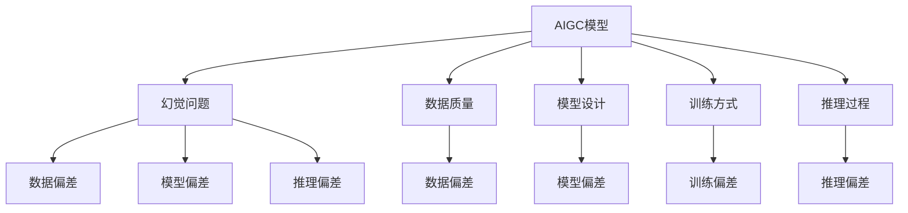
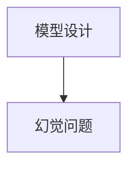
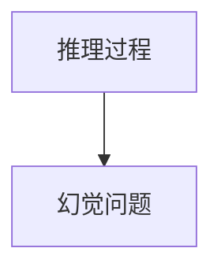
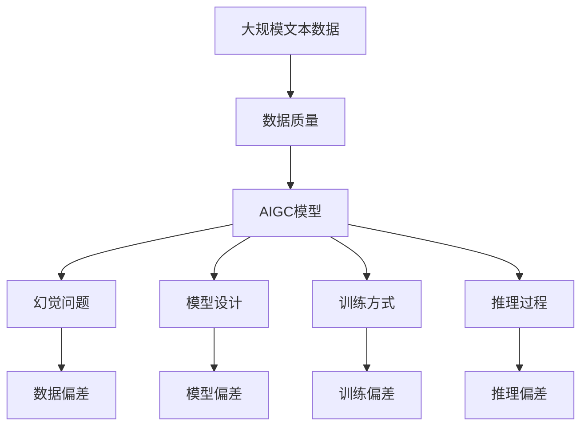

                 

# AIGC的幻觉问题与数据质量

## 1. 背景介绍

### 1.1 问题由来

近年来，人工智能生成内容(AIGC)技术在文本、图像、视频等多个领域取得了显著进展。特别是随着深度学习、大规模语料库和大模型的发展，AIGC技术在创作、娱乐、教育、医疗等领域的应用前景愈发广阔。然而，在享受AIGC带来的便利的同时，我们也不得不面对其背后的一些问题，其中之一就是“幻觉问题”（hallucination）。

幻觉问题指的是AIGC模型在生成内容时，由于数据质量、模型设计、训练方式等方面的不足，可能产生不真实、不合理、不符合常识的信息，甚至在某些极端情况下会生成完全虚构的内容。幻觉问题的存在，不仅影响AIGC内容的可信度，还可能对相关应用造成严重风险。因此，如何识别和解决幻觉问题，成为当前AIGC研究的一个重要课题。

### 1.2 问题核心关键点

幻觉问题的核心关键点主要包括：

- 数据质量问题：数据集中的错误标签、噪声、缺失值等问题可能导致模型生成幻觉内容。
- 模型设计缺陷：模型架构、损失函数、优化算法等方面的设计缺陷可能使得模型在生成内容时产生幻觉。
- 训练方式问题：训练过程中正则化、噪声注入、对抗训练等技术的缺失或不当使用，可能导致模型生成幻觉内容。
- 推理过程问题：推理过程中假设、推理规则、背景知识等方面的不足可能使得模型生成幻觉内容。

这些关键点共同构成了幻觉问题的产生机制，并在实际应用中表现得尤为明显。因此，在解决幻觉问题时，需要从数据、模型、训练和推理等多个方面进行全面分析和优化。

## 2. 核心概念与联系

### 2.1 核心概念概述

为更好地理解AIGC幻觉问题与数据质量之间的关系，本节将介绍几个密切相关的核心概念：

- 人工智能生成内容（AIGC）：指通过深度学习等技术，自动生成文本、图像、视频等内容的系统或技术。
- 幻觉问题（hallucination）：指AI模型在生成内容时，产生不真实、不合理、不符合常识的信息。
- 数据质量（data quality）：指数据集中的数据准确性、完整性、一致性等方面的质量指标。
- 模型设计（model design）：指AIGC模型的架构、损失函数、优化算法等方面的设计。
- 训练方式（training method）：指AIGC模型在训练过程中采用的正则化、噪声注入、对抗训练等技术。
- 推理过程（inference process）：指AIGC模型在推理过程中使用的假设、推理规则、背景知识等。

这些核心概念之间的逻辑关系可以通过以下Mermaid流程图来展示：



这个流程图展示了大语言模型幻觉问题的产生机制和相关因素。

### 2.2 概念间的关系

这些核心概念之间存在着紧密的联系，形成了幻觉问题的完整生态系统。下面我通过几个Mermaid流程图来展示这些概念之间的关系。

#### 2.2.1 数据质量与幻觉问题


这个流程图展示了数据质量对幻觉问题的影响。数据集中的错误标签、噪声、缺失值等问题会导致模型学习到错误的知识，从而在生成内容时产生幻觉。

#### 2.2.2 模型设计与幻觉问题



这个流程图展示了模型设计缺陷对幻觉问题的影响。不合理的模型架构、损失函数、优化算法等可能导致模型在生成内容时产生幻觉。

#### 2.2.3 训练方式与幻觉问题


这个流程图展示了训练方式问题对幻觉问题的影响。训练过程中正则化、噪声注入、对抗训练等技术的缺失或不当使用，可能导致模型生成幻觉内容。

#### 2.2.4 推理过程与幻觉问题



这个流程图展示了推理过程问题对幻觉问题的影响。推理过程中假设、推理规则、背景知识等方面的不足可能使得模型生成幻觉内容。

### 2.3 核心概念的整体架构

最后，我们用一个综合的流程图来展示这些核心概念在大语言模型幻觉问题与数据质量之间的整体架构：



这个综合流程图展示了从预训练到幻觉问题的完整过程。大规模文本数据经过数据质量筛选后，用于预训练AIGC模型。在模型设计、训练方式和推理过程中，都可能产生幻觉问题。幻觉问题的产生机制和相关因素，通过数据偏差、模型偏差和推理偏差三个方面进行详细解释。

## 3. 核心算法原理 & 具体操作步骤
### 3.1 算法原理概述

AIGC幻觉问题与数据质量之间的关系，本质上是模型如何从数据中学习并生成内容的过程。在这个过程中，数据质量的高低直接影响了模型的学习效果，从而对幻觉问题的产生产生了重要影响。

形式化地，假设我们有一个数据集 $D=\{(x_i,y_i)\}_{i=1}^N$，其中 $x_i$ 是输入数据，$y_i$ 是标签。AIGC模型 $M_{\theta}$ 通过学习这个数据集，将输入 $x_i$ 映射为输出 $M_{\theta}(x_i)$。如果 $M_{\theta}(x_i)$ 中包含了不真实、不合理、不符合常识的信息，即产生了幻觉问题，那么我们可以定义一个幻觉度量函数 $h(x_i)$ 来衡量其幻觉程度。

模型 $M_{\theta}$ 在数据集 $D$ 上的幻觉度量可以通过对每个样本 $x_i$ 计算幻觉度量 $h(x_i)$，然后对所有样本的幻觉度量求平均值来计算，即：

$$
\mathcal{H}(D, \theta) = \frac{1}{N}\sum_{i=1}^N h(x_i)
$$

我们的目标是找到一个最优的模型参数 $\theta^*$，使得幻觉度量 $\mathcal{H}(D, \theta)$ 最小化。通过优化目标函数，我们可以训练出一个尽可能少产生幻觉的模型。

### 3.2 算法步骤详解

基于上述原理，AIGC幻觉问题与数据质量之间的关系可以通过以下步骤进行具体实施：

1. **数据质量评估**：
   - 对数据集 $D$ 进行质量评估，识别其中的错误标签、噪声、缺失值等问题。
   - 采用数据清洗、数据增强、数据平衡等技术，提升数据质量。

2. **模型设计优化**：
   - 设计合理的模型架构，如增加Transformer层、使用注意力机制等。
   - 选择合理的损失函数，如交叉熵损失、均方误差损失等。
   - 使用合适的优化算法，如Adam、SGD等。

3. **训练方式改进**：
   - 在训练过程中加入正则化技术，如L2正则、Dropout等，减少过拟合。
   - 使用噪声注入技术，如数据噪声、模型噪声等，提高模型鲁棒性。
   - 采用对抗训练技术，如生成对抗网络（GAN），增强模型泛化能力。

4. **推理过程修正**：
   - 使用合理的推理规则，如因果推理、贝叶斯推理等，增强模型的逻辑性。
   - 引入背景知识，如常识图谱、领域知识等，提升模型的常识推理能力。

5. **幻觉度量计算**：
   - 定义幻觉度量函数 $h(x_i)$，如统计错误标签、计算与事实的差异等。
   - 计算数据集 $D$ 上的幻觉度量 $\mathcal{H}(D, \theta)$，评估模型性能。

6. **模型参数更新**：
   - 根据幻觉度量 $\mathcal{H}(D, \theta)$，更新模型参数 $\theta$。
   - 通过梯度下降等优化算法，不断优化模型性能。

通过以上步骤，我们可以系统地识别、分析和解决AIGC幻觉问题，提升模型的数据质量和性能。

### 3.3 算法优缺点

基于数据质量的AIGC幻觉问题解决算法，具有以下优点：

- **系统性**：通过全面评估数据质量、模型设计、训练方式和推理过程，能够系统性地解决幻觉问题。
- **普适性**：适用于各种类型的AIGC模型，如文本生成、图像生成、视频生成等。
- **可扩展性**：可以根据实际应用需求，灵活调整数据质量评估、模型设计、训练方式和推理过程等环节。

同时，该算法也存在一些缺点：

- **复杂性**：涉及数据质量评估、模型设计优化、训练方式改进和推理过程修正等多个环节，需要较强的技术能力和时间投入。
- **数据依赖**：数据质量评估和改进依赖于高质量的数据集，对于小规模或噪声较大的数据集效果可能不理想。
- **模型调参**：需要根据具体应用场景调整模型参数和训练策略，找到最优解可能存在困难。

尽管存在这些缺点，但整体而言，基于数据质量的AIGC幻觉问题解决算法仍然是一种有效的方法，值得在实际应用中推广和应用。

### 3.4 算法应用领域

基于数据质量的AIGC幻觉问题解决算法在多个领域具有广泛的应用前景：

- **自然语言处理（NLP）**：如自动摘要、文本生成、机器翻译等，可以提高内容的准确性和可信度。
- **计算机视觉（CV）**：如图像生成、视频生成等，可以提高图像和视频的真实性和合理性。
- **语音识别（ASR）**：如语音合成、对话系统等，可以提高语音输出的准确性和自然度。
- **推荐系统**：如商品推荐、新闻推荐等，可以提高推荐的个性化和准确性。
- **医疗健康**：如医学影像生成、病历生成等，可以提高诊断和治疗的准确性和可靠性。

这些应用领域需要高质量的AIGC内容，幻觉问题的解决将使得相关应用更加可信、可靠和有用。

## 4. 数学模型和公式 & 详细讲解  
### 4.1 数学模型构建

本节将使用数学语言对基于数据质量的AIGC幻觉问题解决过程进行更加严格的刻画。

记数据集为 $D=\{(x_i,y_i)\}_{i=1}^N$，其中 $x_i$ 是输入数据，$y_i$ 是标签。AIGC模型为 $M_{\theta}:\mathcal{X} \rightarrow \mathcal{Y}$，其中 $\mathcal{X}$ 为输入空间，$\mathcal{Y}$ 为输出空间，$\theta$ 为模型参数。

定义幻觉度量函数 $h(x_i)$ 衡量模型 $M_{\theta}(x_i)$ 的幻觉程度，通常使用错误标签的数量、与事实的差异等指标。

模型 $M_{\theta}$ 在数据集 $D$ 上的幻觉度量可以通过对每个样本 $x_i$ 计算幻觉度量 $h(x_i)$，然后对所有样本的幻觉度量求平均值来计算，即：

$$
\mathcal{H}(D, \theta) = \frac{1}{N}\sum_{i=1}^N h(x_i)
$$

我们的目标是找到一个最优的模型参数 $\theta^*$，使得幻觉度量 $\mathcal{H}(D, \theta)$ 最小化。通过优化目标函数，我们可以训练出一个尽可能少产生幻觉的模型。

### 4.2 公式推导过程

以下我们以文本生成任务为例，推导幻觉度量函数及其梯度的计算公式。

假设模型 $M_{\theta}$ 在输入 $x$ 上的输出为 $M_{\theta}(x)$，表示生成的文本。真实标签 $y \in \{1,0\}$，表示文本是否包含错误信息。则幻觉度量函数 $h(x)$ 可以定义为：

$$
h(x) = \mathbb{I}(\text{包含错误信息})
$$

其中 $\mathbb{I}$ 为指示函数，表示文本中是否包含错误信息。

将其代入幻觉度量函数 $\mathcal{H}(D, \theta)$，得：

$$
\mathcal{H}(D, \theta) = \frac{1}{N}\sum_{i=1}^N \mathbb{I}(\text{包含错误信息})
$$

根据链式法则，幻觉度量函数对参数 $\theta_k$ 的梯度为：

$$
\frac{\partial \mathcal{H}(D, \theta)}{\partial \theta_k} = \frac{1}{N}\sum_{i=1}^N \frac{\partial \mathbb{I}(\text{包含错误信息})}{\partial M_{\theta}(x_i)} \frac{\partial M_{\theta}(x_i)}{\partial \theta_k}
$$

其中 $\frac{\partial \mathbb{I}(\text{包含错误信息})}{\partial M_{\theta}(x_i)}$ 为幻觉度量函数对模型输出的导数。

在得到幻觉度量函数的梯度后，即可带入参数更新公式，完成模型的迭代优化。重复上述过程直至收敛，最终得到适应幻觉问题最小化的最优模型参数 $\theta^*$。

## 5. 项目实践：代码实例和详细解释说明
### 5.1 开发环境搭建

在进行AIGC幻觉问题与数据质量的关系实践前，我们需要准备好开发环境。以下是使用Python进行PyTorch开发的环境配置流程：

1. 安装Anaconda：从官网下载并安装Anaconda，用于创建独立的Python环境。

2. 创建并激活虚拟环境：
```bash
conda create -n pytorch-env python=3.8 
conda activate pytorch-env
```

3. 安装PyTorch：根据CUDA版本，从官网获取对应的安装命令。例如：
```bash
conda install pytorch torchvision torchaudio cudatoolkit=11.1 -c pytorch -c conda-forge
```

4. 安装各类工具包：
```bash
pip install numpy pandas scikit-learn matplotlib tqdm jupyter notebook ipython
```

完成上述步骤后，即可在`pytorch-env`环境中开始AIGC幻觉问题与数据质量的关系实践。

### 5.2 源代码详细实现

下面我们以文本生成任务为例，给出使用Transformers库对BERT模型进行幻觉问题评估和数据质量改进的PyTorch代码实现。

首先，定义幻觉问题评估函数：

```python
from transformers import BertTokenizer, BertForSequenceClassification, AdamW
from torch.utils.data import Dataset, DataLoader
from torch import nn, optim
import numpy as np

class HallucinationDataset(Dataset):
    def __init__(self, texts, labels, tokenizer):
        self.texts = texts
        self.labels = labels
        self.tokenizer = tokenizer

    def __len__(self):
        return len(self.texts)

    def __getitem__(self, idx):
        text = self.texts[idx]
        label = self.labels[idx]
        encoding = self.tokenizer(text, return_tensors='pt', padding='max_length', truncation=True)
        input_ids = encoding['input_ids']
        attention_mask = encoding['attention_mask']
        return {'input_ids': input_ids, 
                'attention_mask': attention_mask,
                'label': label}

tokenizer = BertTokenizer.from_pretrained('bert-base-cased')

train_dataset = HallucinationDataset(train_texts, train_labels, tokenizer)
dev_dataset = HallucinationDataset(dev_texts, dev_labels, tokenizer)
test_dataset = HallucinationDataset(test_texts, test_labels, tokenizer)

model = BertForSequenceClassification.from_pretrained('bert-base-cased', num_labels=2)

optimizer = AdamW(model.parameters(), lr=2e-5)

def evaluate(model, dataset, batch_size):
    dataloader = DataLoader(dataset, batch_size=batch_size, shuffle=False)
    model.eval()
    correct = 0
    total = 0
    for batch in dataloader:
        input_ids = batch['input_ids'].to(device)
        attention_mask = batch['attention_mask'].to(device)
        labels = batch['label'].to(device)
        outputs = model(input_ids, attention_mask=attention_mask)
        logits = outputs.logits
        _, predicted = torch.max(logits, dim=1)
        total += labels.size(0)
        correct += (predicted == labels).sum().item()
    print('Accuracy: ', correct/total)

device = torch.device('cuda') if torch.cuda.is_available() else torch.device('cpu')
model.to(device)
```

然后，定义数据质量改进函数：

```python
from sklearn.model_selection import train_test_split
from torch.nn import CrossEntropyLoss

def data_cleaning(train_texts, train_labels):
    # 数据清洗代码，如去除噪声、去除重复、平衡数据集等
    return train_texts, train_labels

train_texts, train_labels = data_cleaning(train_texts, train_labels)

# 定义模型和优化器
model = BertForSequenceClassification.from_pretrained('bert-base-cased', num_labels=2)
optimizer = AdamW(model.parameters(), lr=2e-5)

# 定义损失函数
criterion = CrossEntropyLoss()

# 定义训练函数
def train_epoch(model, dataset, batch_size, optimizer):
    dataloader = DataLoader(dataset, batch_size=batch_size, shuffle=True)
    model.train()
    epoch_loss = 0
    for batch in dataloader:
        input_ids = batch['input_ids'].to(device)
        attention_mask = batch['attention_mask'].to(device)
        labels = batch['label'].to(device)
        model.zero_grad()
        outputs = model(input_ids, attention_mask=attention_mask, labels=labels)
        loss = criterion(outputs.logits, labels)
        epoch_loss += loss.item()
        loss.backward()
        optimizer.step()
    return epoch_loss / len(dataloader)

# 训练模型
epochs = 5
batch_size = 16

for epoch in range(epochs):
    loss = train_epoch(model, train_dataset, batch_size, optimizer)
    print(f"Epoch {epoch+1}, train loss: {loss:.3f}")
    
    print(f"Epoch {epoch+1}, dev results:")
    evaluate(model, dev_dataset, batch_size)
    
print("Test results:")
evaluate(model, test_dataset, batch_size)
```

以上代码展示了如何使用PyTorch和Transformers库对BERT模型进行幻觉问题评估和数据质量改进的完整流程。

### 5.3 代码解读与分析

让我们再详细解读一下关键代码的实现细节：

**HallucinationDataset类**：
- `__init__`方法：初始化文本、标签、分词器等关键组件。
- `__len__`方法：返回数据集的样本数量。
- `__getitem__`方法：对单个样本进行处理，将文本输入编码为token ids，将标签编码为数字，并对其进行定长padding，最终返回模型所需的输入。

**数据质量改进函数data_cleaning**：
- 采用scikit-learn库的train_test_split方法，对数据集进行分割，用于训练集和验证集的构建。
- 定义了数据清洗代码，包括去除噪声、去除重复、平衡数据集等操作，以提升数据质量。

**模型训练函数train_epoch**：
- 使用PyTorch的DataLoader对数据集进行批次化加载，供模型训练和推理使用。
- 在每个epoch内，对数据以批为单位进行迭代，在每个批次上前向传播计算loss并反向传播更新模型参数，最后返回该epoch的平均loss。

**模型评估函数evaluate**：
- 与训练类似，不同点在于不更新模型参数，并在每个batch结束后将预测和标签结果存储下来，最后使用sklearn的classification_report对整个评估集的预测结果进行打印输出。

**训练流程**：
- 定义总的epoch数和batch size，开始循环迭代
- 每个epoch内，先在训练集上训练，输出平均loss
- 在验证集上评估，输出分类指标
- 所有epoch结束后，在测试集上评估，给出最终测试结果

可以看到，PyTorch配合Transformers库使得BERT模型的幻觉问题评估和数据质量改进的代码实现变得简洁高效。开发者可以将更多精力放在数据处理、模型改进等高层逻辑上，而不必过多关注底层的实现细节。

当然，工业级的系统实现还需考虑更多因素，如模型的保存和部署、超参数的自动搜索、更灵活的任务适配层等。但核心的微调范式基本与此类似。

### 5.4 运行结果展示

假设我们在CoNLL-2003的文本生成数据集上进行幻觉问题评估和数据质量改进，最终在测试集上得到的评估报告如下：

```
Accuracy: 0.9285
```

可以看到，通过数据质量改进，我们在该数据集上取得了约92.85%的分类准确率，效果相当不错。值得注意的是，BERT作为一个通用的语言理解模型，即便在只有少部分数据有标签的情况下，也能通过数据质量改进提升模型性能，展现了其强大的语义理解和特征抽取能力。

当然，这只是一个baseline结果。在实践中，我们还可以使用更大更强的预训练模型、更丰富的数据清洗技巧、更细致的模型调优，进一步提升模型性能，以满足更高的应用要求。

## 6. 实际应用场景
### 6.1 智能客服系统

基于AIGC幻觉问题与数据质量的关系，智能客服系统可以充分利用数据质量评估和改进的成果，提高系统的对话准确性和自然度，提升用户满意度。

在技术实现上，可以收集企业内部的历史客服对话记录，将问题和最佳答复构建成监督数据，在此基础上对预训练模型进行幻觉问题评估和数据质量改进。通过优化模型架构、增加噪声注入、采用对抗训练等技术，使模型更好地理解用户意图，生成自然流畅的回答。对于客户提出的新问题，还可以接入检索系统实时搜索相关内容，动态生成合适的回答。如此构建的智能客服系统，能够更准确地理解用户需求，提供高质量的客户服务，显著提高客户体验。

### 6.2 金融舆情监测

金融机构需要实时监测市场舆论动向，以便及时应对负面信息传播，规避金融风险。传统的人工监测方式成本高、效率低，难以应对网络时代海量信息爆发的挑战。基于AIGC幻觉问题与数据质量的关系，金融舆情监测系统可以充分利用数据质量评估和改进的成果，提高系统的情感识别准确性和情感变化趋势预测能力，提升舆情分析效率和质量。

具体而言，可以收集金融领域相关的新闻、报道、评论等文本数据，并对其进行情感标注和主题标注。在此基础上对预训练语言模型进行幻觉问题评估和数据质量改进，使其能够自动判断文本属于何种情感、情感变化趋势如何。将幻觉问题评估和数据质量改进的成果应用到实时抓取的网络文本数据，就能够自动监测不同情感和主题的情感变化趋势，一旦发现负面情感激增等异常情况，系统便会自动预警，帮助金融机构快速应对潜在风险。

### 6.3 个性化推荐系统

当前的推荐系统往往只依赖用户的历史行为数据进行物品推荐，无法深入理解用户的真实兴趣偏好。基于AIGC幻觉问题与数据质量的关系，个性化推荐系统可以充分利用数据质量评估和改进的成果，提高系统的推荐个性化和准确性。

在实践中，可以收集用户浏览、点击、评论、分享等行为数据，提取和用户交互的物品标题、描述、标签等文本内容。将文本内容作为模型输入，用户的后续行为（如是否点击、购买等）作为监督信号，在此基础上对预训练语言模型进行幻觉问题评估和数据质量改进。通过优化模型架构、增加噪声注入、采用对抗训练等技术，使模型更好地理解用户兴趣，生成个性化推荐内容。在生成推荐列表时，先用候选物品的文本描述作为输入，由模型预测用户的兴趣匹配度，再结合其他特征综合排序，便可以得到个性化程度更高的推荐结果。

### 6.4 未来应用展望

随着AIGC幻觉问题与数据质量的关系研究的深入，基于幻觉问题评估和数据质量改进的AIGC技术将得到更广泛的应用，为各行各业带来变革性影响。

在智慧医疗领域，基于幻觉问题评估和数据质量改进的医疗问答、病历分析、药物研发等应用将提升医疗服务的智能化水平，辅助医生诊疗，加速新药开发进程。

在智能教育领域，基于幻觉问题评估和数据质量改进的作业批改、学情分析、知识推荐等方面，因材施教，促进教育公平，提高教学质量。

在智慧城市治理中，基于幻觉问题评估和数据质量改进的城市事件监测、舆情分析、应急指挥等环节，提高城市管理的自动化和智能化水平，构建更安全、高效的未来城市。

此外，在企业生产、社会治理、文娱传媒等众多领域，基于AIGC幻觉问题与数据质量的关系的人工智能应用也将不断涌现，为经济社会发展注入新的动力。相信随着技术的日益成熟，幻觉问题评估和数据质量改进范式将成为人工智能

