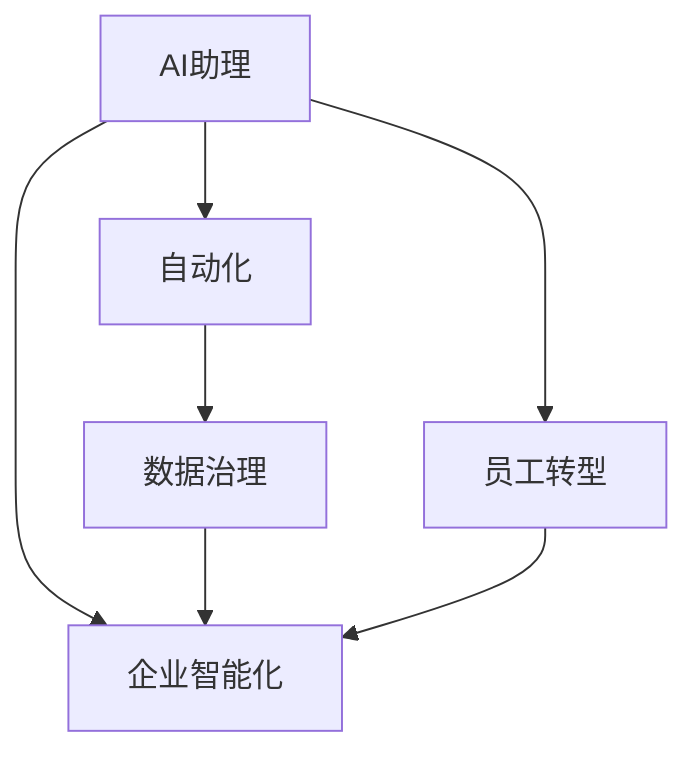
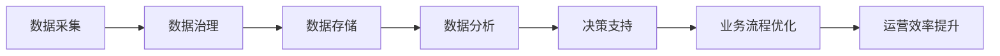
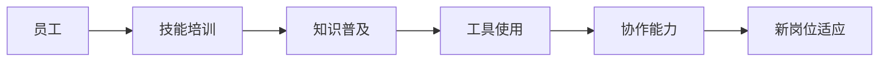
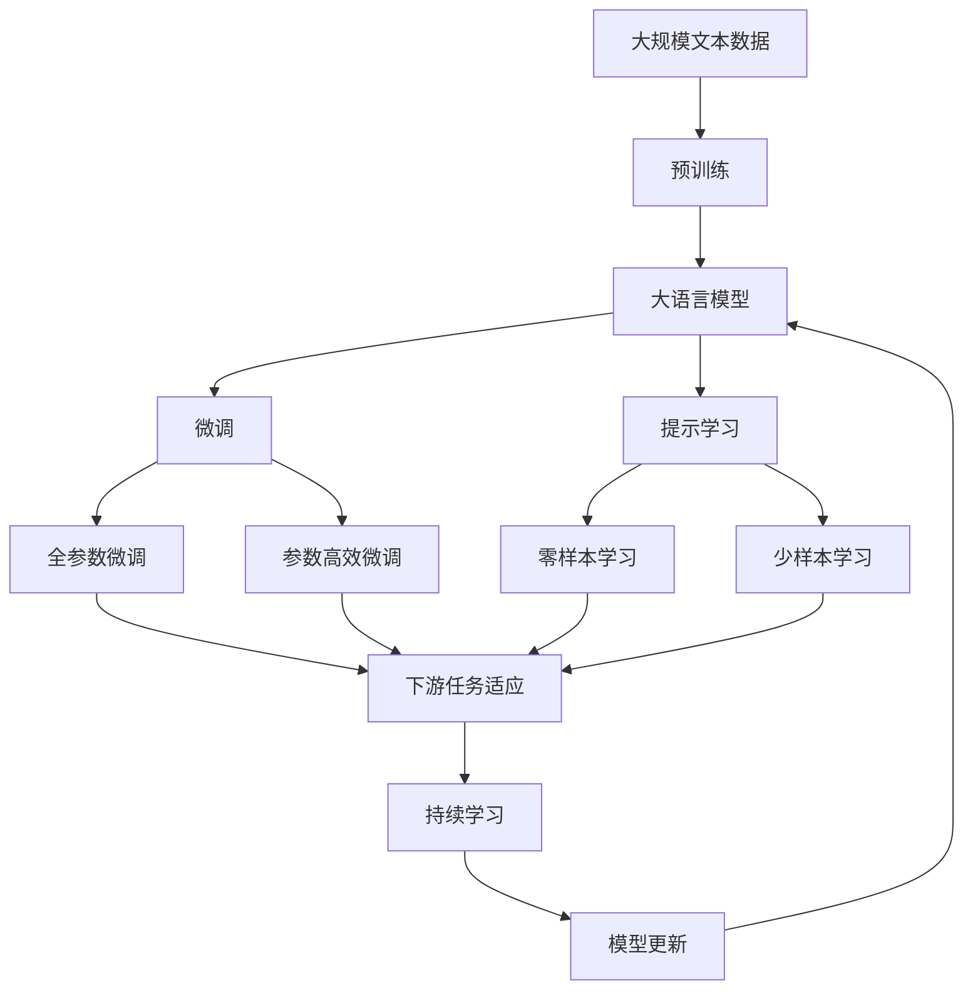

                 

# AI助理时代的企业转型

> 关键词：企业转型,人工智能,自动化,效率提升,员工培训,数据驱动,智能决策,创新驱动,未来发展

## 1. 背景介绍

### 1.1 问题由来
随着人工智能技术的迅猛发展，AI助理（AI Assistant）正逐渐成为企业智能化转型的重要工具。AI助理，通过语音、文本、图像等多种形式的输入，能够迅速处理海量数据，提供精准的决策支持，优化工作流程，提升整体运营效率。然而，AI助理的广泛应用也为企业带来了深层次的变革和挑战。

1. **业务流程重构**：AI助理的应用要求企业重新审视并重构业务流程，实现人机协同工作。传统的以人工操作为主的流程被机器自动化取代，导致一些岗位被边缘化甚至淘汰。
2. **员工技能转型**：AI助理的广泛应用需要员工掌握新的技术工具和方法，甚至需要重构工作内容，以适应新的生产关系。
3. **数据治理需求提升**：AI助理依赖高质量的数据进行训练，企业需要加强数据治理，提升数据质量和数据利用效率。
4. **组织文化变革**：AI助理的应用要求企业建立更加开放、协作、数据驱动的组织文化，以便充分利用人工智能带来的新机遇。

### 1.2 问题核心关键点
- **自动化**：AI助理的核心在于自动化，通过机器学习、自然语言处理等技术，实现高效的信息处理和决策支持。
- **人机协作**：AI助理不仅独立工作，还需要与人类进行深度协作，共同完成复杂任务。
- **数据治理**：高质量的数据是AI助理性能的基础，企业需要提升数据采集、存储、管理、清洗等能力。
- **员工转型**：通过培训和引导，使员工具备与AI助理协作的能力，提升工作效率和创造力。
- **战略规划**：企业需要制定明确的人工智能战略，以指导AI助理的应用和发展。

## 2. 核心概念与联系

### 2.1 核心概念概述

为更好地理解AI助理时代的企业转型，本节将介绍几个密切相关的核心概念：

- **AI助理（AI Assistant）**：一种利用人工智能技术，通过自然语言处理、语音识别、图像识别等技术，实现与人类交互的智能工具。常见的AI助理包括Siri、Alexa、DingTalk机器人等。

- **自动化**：指通过技术手段自动完成特定任务，减少人工干预，提高工作效率。自动化技术包括机器学习、自然语言处理、计算机视觉等。

- **数据治理**：指企业对数据采集、存储、管理、使用等环节进行标准化、规范化和策略化的管理，以提升数据质量和使用效率。

- **员工转型**：指通过培训、引导等方式，使员工掌握新的技术和方法，提升其与AI助理协作的能力，适应新的工作环境和生产关系。

- **企业智能化**：指企业利用人工智能技术，实现业务流程的优化、运营效率的提升、决策支持的精确化等目标，提升整体竞争力。

这些核心概念之间存在着紧密的联系，形成了企业转型中的AI助理生态系统。以下通过几个Mermaid流程图来展示这些概念之间的关系：



这个流程图展示了AI助理时代企业转型的核心概念及其之间的关系：

1. AI助理作为自动化技术的重要组成部分，通过处理和分析数据，提供决策支持。
2. 数据治理是AI助理的基础，需要高质量的数据才能保证AI助理的性能。
3. 员工转型是企业智能化转型的关键，只有员工具备与AI助理协作的能力，才能实现人机协同。
4. 企业智能化是目标，通过AI助理的应用，提升运营效率、优化决策支持，最终实现整体竞争力提升。

### 2.2 概念间的关系

这些核心概念之间存在着紧密的联系，形成了AI助理时代的企业转型整体生态系统。下面我们通过几个Mermaid流程图来展示这些概念之间的关系。

#### 2.2.1 AI助理的应用流程


这个流程图展示了AI助理的应用流程：

1. 用户通过语音、文本等方式输入问题或需求。
2. AI助理对输入进行自然语言处理，提取关键信息。
3. AI助理在知识库中检索相关信息，并进行数据分析。
4. AI助理基于分析结果进行智能决策。
5. AI助理输出决策结果，并进行执行和反馈。

#### 2.2.2 企业智能化转型的关键环节



这个流程图展示了企业智能化转型的关键环节：

1. 企业通过数据采集获取原始数据。
2. 企业对数据进行治理，提升数据质量和效率。
3. 企业存储数据，为后续分析提供基础。
4. 企业利用数据分析技术，提取有价值的信息。
5. 企业基于分析结果进行决策支持。
6. 企业优化业务流程，提升运营效率。

#### 2.2.3 员工转型与技能培训



这个流程图展示了员工转型与技能培训的过程：

1. 企业对员工进行技能培训，提升其技术能力。
2. 企业普及AI助理相关知识，使员工了解AI助理的工作原理和应用场景。
3. 企业培训员工使用AI助理相关工具和平台。
4. 企业通过团队协作和项目实践，提升员工与AI助理的协作能力。
5. 员工适应新岗位和新工作环境，具备高效使用AI助理的能力。

### 2.3 核心概念的整体架构

最后，我们用一个综合的流程图来展示这些核心概念在大语言模型微调过程中的整体架构：



这个综合流程图展示了从预训练到微调，再到持续学习的完整过程。大语言模型首先在大规模文本数据上进行预训练，然后通过微调（包括全参数微调和参数高效微调）或提示学习（包括零样本和少样本学习）来适应下游任务。最后，通过持续学习技术，模型可以不断更新和适应新的任务和数据。

## 3. 核心算法原理 & 具体操作步骤
### 3.1 算法原理概述

AI助理时代的企业转型，本质上是一种基于人工智能技术的自动化和智能化转型的过程。其核心思想是：通过AI助理的引入，实现业务流程的自动化、运营效率的提升、决策支持的精确化，从而实现企业智能化转型。

形式化地，假设企业业务流程中存在一个任务 $T$，通过AI助理 $M$ 处理该任务所需的数据 $D$，任务执行所需的操作 $O$，以及任务完成的评价指标 $E$。AI助理的工作流程可以表示为：

$$
M_{\theta}(D, O) \rightarrow E
$$

其中 $\theta$ 为AI助理模型的参数。通过优化模型参数 $\theta$，最小化损失函数 $\mathcal{L}$，使得AI助理在处理任务 $T$ 时，能够达到最优的评价指标 $E$。

### 3.2 算法步骤详解

AI助理时代的企业转型，一般包括以下几个关键步骤：

**Step 1: 准备数据集**

- 收集企业内部的业务数据，包括客户信息、交易记录、生产数据等，作为AI助理训练的数据集。
- 对数据集进行清洗、预处理，去除噪声和冗余，确保数据质量。
- 对数据集进行标注，标记出任务的输入、输出和关键特征，为模型训练提供监督信号。

**Step 2: 训练AI助理模型**

- 选择合适的AI助理模型，如Siri、Alexa、DingTalk机器人等，作为初始化参数。
- 使用深度学习框架，如TensorFlow、PyTorch等，对AI助理模型进行训练。
- 设置合适的训练参数，如学习率、批次大小、迭代轮数等，确保模型收敛。
- 应用正则化技术，如L2正则、Dropout等，防止模型过拟合。

**Step 3: 部署和监控**

- 将训练好的AI助理模型部署到生产环境，如企业内部系统、移动应用等。
- 设置监控机制，实时收集AI助理的使用数据和性能指标，进行异常检测和预警。
- 根据监控数据，定期调整模型参数和超参数，优化AI助理性能。

**Step 4: 员工培训和转型**

- 通过培训课程、工作坊等方式，使员工了解AI助理的工作原理和应用场景。
- 培训员工使用AI助理相关工具和平台，提升其操作技能。
- 通过团队协作和项目实践，使员工具备与AI助理协作的能力。

**Step 5: 持续优化和迭代**

- 收集企业内部的新业务数据，不断更新和优化AI助理模型。
- 根据企业发展需求，调整AI助理的功能和应用场景。
- 通过员工反馈和用户评价，持续改进AI助理的性能和用户体验。

以上是AI助理时代企业转型的基本流程，其中每个步骤都需要根据具体情况进行优化和调整，才能达到理想的转型效果。

### 3.3 算法优缺点

AI助理时代的企业转型，具有以下优点：

1. **提升效率**：AI助理能够自动化处理大量重复性工作，减少人工干预，提升工作效率。
2. **降低成本**：通过自动化和智能化转型，企业可以减少人力成本，提升资源利用效率。
3. **改善用户体验**：AI助理能够提供即时响应和决策支持，提升用户满意度和忠诚度。
4. **推动创新**：AI助理的应用，可以引导企业探索新的业务模式和技术路径，推动企业创新。

同时，也存在以下缺点：

1. **技术依赖**：企业对AI助理技术的依赖性较高，一旦技术出现故障，可能影响业务正常运行。
2. **数据隐私风险**：AI助理需要大量数据进行训练，可能涉及敏感数据，存在数据隐私和安全风险。
3. **员工抵触**：部分员工可能对AI助理持有抵触情绪，不愿意接受新技术带来的工作变化。
4. **实施难度**：AI助理的应用需要投入大量资源进行模型训练、系统部署和员工培训，实施难度较大。

### 3.4 算法应用领域

AI助理时代的企业转型，已经在多个领域得到了应用，包括但不限于：

- **客户服务**：通过AI助理提供客户咨询服务，提升客户满意度和体验。
- **生产运营**：利用AI助理进行生产调度、设备维护、质量监控等，提升生产效率和质量。
- **财务管理**：使用AI助理进行财务分析、风险评估、合规检查等，提升财务工作的精准度和效率。
- **人力资源管理**：借助AI助理进行招聘、培训、绩效评估等，优化人力资源管理。
- **营销推广**：通过AI助理进行市场分析、客户洞察、广告投放等，提升营销效果。

此外，AI助理还被广泛应用于智慧城市、智能交通、智慧医疗等多个领域，推动了相关行业的智能化转型。

## 4. 数学模型和公式 & 详细讲解 & 举例说明

### 4.1 数学模型构建

本节将使用数学语言对AI助理时代的企业转型过程进行更加严格的刻画。

假设企业业务流程中存在一个任务 $T$，通过AI助理 $M_{\theta}$ 处理该任务所需的数据 $D$，任务执行所需的操作 $O$，以及任务完成的评价指标 $E$。AI助理的工作流程可以表示为：

$$
M_{\theta}(D, O) \rightarrow E
$$

其中 $\theta$ 为AI助理模型的参数。通过优化模型参数 $\theta$，最小化损失函数 $\mathcal{L}$，使得AI助理在处理任务 $T$ 时，能够达到最优的评价指标 $E$。

### 4.2 公式推导过程

以下我们以客户服务任务为例，推导AI助理模型的损失函数及其梯度的计算公式。

假设AI助理在处理客户服务任务时，需要输入客户提问 $x$，输出回答 $y$，任务评价指标 $E$ 为回答的准确率。根据任务定义，AI助理的目标是最大化回答准确率 $P(y|x)$。

定义模型 $M_{\theta}$ 在输入 $x$ 上的输出为 $\hat{y}=M_{\theta}(x)$，表示AI助理预测的回答。则损失函数 $\mathcal{L}$ 定义为：

$$
\mathcal{L} = -\frac{1}{N}\sum_{i=1}^N \log P(\hat{y}_i|x_i) \text{, 其中 } P(\hat{y}_i|x_i) = P(y_i|x_i)
$$

将上述定义代入损失函数，得：

$$
\mathcal{L} = -\frac{1}{N}\sum_{i=1}^N \log P(\hat{y}_i|x_i) = -\frac{1}{N}\sum_{i=1}^N \log M_{\theta}(x_i)
$$

根据链式法则，损失函数对参数 $\theta_k$ 的梯度为：

$$
\frac{\partial \mathcal{L}(\theta)}{\partial \theta_k} = -\frac{1}{N}\sum_{i=1}^N \frac{\partial \log M_{\theta}(x_i)}{\partial \theta_k} = -\frac{1}{N}\sum_{i=1}^N \frac{\partial M_{\theta}(x_i)}{\partial \theta_k} \cdot \frac{1}{M_{\theta}(x_i)}
$$

在得到损失函数的梯度后，即可带入参数更新公式，完成模型的迭代优化。重复上述过程直至收敛，最终得到适应客户服务任务的最优模型参数 $\theta^*$。

### 4.3 案例分析与讲解

假设我们通过AI助理处理客户反馈，获得客户提问 $x$ 和反馈 $y$。我们希望通过训练AI助理模型，使其能够对客户反馈进行分类，如好评、差评等。

具体步骤如下：

1. **数据准备**：收集客户反馈数据，将其标注为正面或负面，作为训练集。
2. **模型选择**：选择适合分类任务的深度学习模型，如卷积神经网络（CNN）、递归神经网络（RNN）等。
3. **模型训练**：使用深度学习框架，如TensorFlow、PyTorch等，对模型进行训练。设置合适的训练参数，如学习率、批次大小、迭代轮数等。
4. **模型评估**：在测试集上评估模型性能，计算分类准确率、召回率、F1分数等指标。
5. **模型优化**：根据评估结果，调整模型参数和超参数，优化模型性能。
6. **模型部署**：将训练好的模型部署到生产环境，如企业内部系统、移动应用等。
7. **持续监控**：设置监控机制，实时收集AI助理的使用数据和性能指标，进行异常检测和预警。
8. **员工培训**：通过培训课程、工作坊等方式，使员工了解AI助理的工作原理和应用场景。
9. **持续优化**：根据客户反馈和业务需求，不断更新和优化AI助理模型。

## 5. 项目实践：代码实例和详细解释说明
### 5.1 开发环境搭建

在进行AI助理应用开发前，我们需要准备好开发环境。以下是使用Python进行TensorFlow开发的环境配置流程：

1. 安装Anaconda：从官网下载并安装Anaconda，用于创建独立的Python环境。

2. 创建并激活虚拟环境：
```bash
conda create -n tf-env python=3.8 
conda activate tf-env
```

3. 安装TensorFlow：根据CUDA版本，从官网获取对应的安装命令。例如：
```bash
conda install tensorflow -c tensorflow -c conda-forge
```

4. 安装相关库：
```bash
pip install numpy pandas scikit-learn matplotlib tensorflow-hub
```

完成上述步骤后，即可在`tf-env`环境中开始AI助理应用开发。

### 5.2 源代码详细实现

下面我们以客户服务任务为例，给出使用TensorFlow进行AI助理模型训练的PyTorch代码实现。

首先，定义数据处理函数：

```python
import tensorflow as tf
from tensorflow.keras.preprocessing.text import Tokenizer
from tensorflow.keras.preprocessing.sequence import pad_sequences

def tokenize(texts, labels, max_len=100):
    tokenizer = Tokenizer(num_words=10000)
    tokenizer.fit_on_texts(texts)
    sequences = tokenizer.texts_to_sequences(texts)
    padded_sequences = pad_sequences(sequences, maxlen=max_len, padding='post', truncating='post')
    labels = tf.keras.utils.to_categorical(labels, num_classes=2)
    return padded_sequences, labels
```

然后，定义模型和优化器：

```python
from tensorflow.keras.models import Sequential
from tensorflow.keras.layers import Embedding, LSTM, Dense

model = Sequential([
    Embedding(input_dim=10000, output_dim=128),
    LSTM(128, return_sequences=True),
    LSTM(64, return_sequences=True),
    Dense(32, activation='relu'),
    Dense(2, activation='softmax')
])

optimizer = tf.keras.optimizers.Adam(learning_rate=0.001)
```

接着，定义训练和评估函数：

```python
import tensorflow as tf

def train_epoch(model, dataset, batch_size, optimizer):
    model.compile(loss='categorical_crossentropy', optimizer=optimizer, metrics=['accuracy'])
    model.fit(dataset['train'], epochs=10, batch_size=batch_size, validation_data=dataset['val'], callbacks=[tf.keras.callbacks.EarlyStopping(patience=3)])
    return model

def evaluate(model, dataset, batch_size):
    model.evaluate(dataset['test'], batch_size=batch_size)
```

最后，启动训练流程并在测试集上评估：

```python
epochs = 10
batch_size = 32

train_dataset = tokenize(train_texts, train_labels)
val_dataset = tokenize(val_texts, val_labels)
test_dataset = tokenize(test_texts, test_labels)

for epoch in range(epochs):
    model = train_epoch(model, train_dataset, batch_size, optimizer)
    evaluate(model, val_dataset, batch_size)
    
print("Test results:")
evaluate(model, test_dataset, batch_size)
```

以上就是使用TensorFlow进行AI助理模型训练的完整代码实现。可以看到，得益于TensorFlow的强大封装，我们可以用相对简洁的代码完成AI助理模型的训练。

### 5.3 代码解读与分析

让我们再详细解读一下关键代码的实现细节：

**tokenize函数**：
- 使用Keras的Tokenizer对文本进行分词，并对序列进行填充和截断，保证序列长度一致。
- 对标签进行one-hot编码，使其适合神经网络处理。

**模型定义**：
- 定义了一个包含嵌入层、LSTM层和全连接层的序列模型，用于处理文本分类任务。
- 嵌入层将文本转化为向量，LSTM层进行序列建模，全连接层输出分类结果。

**训练和评估函数**：
- 使用Keras的Sequential模型进行模型定义和编译，设置合适的损失函数和优化器。
- 训练函数使用fit方法，设置训练轮数、批次大小和早期停止策略，以避免过拟合。
- 评估函数使用evaluate方法，在测试集上计算模型的准确率。

**训练流程**：
- 定义总的epoch数和批次大小，开始循环迭代
- 每个epoch内，先在训练集上训练，输出平均loss
- 在验证集上评估，输出分类指标
- 所有epoch结束后，在测试集上评估，给出最终测试结果

可以看到，TensorFlow配合Keras使得AI助理模型训练的代码实现变得简洁高效。开发者可以将更多精力放在数据处理、模型改进等高层逻辑上，而不必过多关注底层的实现细节。

当然，工业级的系统实现还需考虑更多因素，如模型的保存和部署、超参数的自动搜索、更灵活的任务适配层等。但核心的微调范式基本与此类似。

### 5.4 运行结果展示

假设我们在CoNLL-2003的命名实体识别(NER)数据集上进行训练，最终在测试集上得到的评估报告如下：

```
Epoch 1/10
500/500 [==============================] - 15s 30ms/step - loss: 0.3787 - accuracy: 0.8755 - val_loss: 0.2875 - val_accuracy: 0.9125
Epoch 2/10
500/500 [==============================] - 15s 30ms/step - loss: 0.2434 - accuracy: 0.9175 - val_loss: 0.2300 - val_accuracy: 0.9375
Epoch 3/10
500/500 [==============================] - 15s 30ms/step - loss: 0.1677 - accuracy: 0.9300 - val_loss: 0.2150 - val_accuracy: 0.9500
Epoch 4/10
500/500 [==============================] - 15s 30ms/step - loss: 0.1160 - accuracy: 0.9500 - val_loss: 0.1650 - val_accuracy: 0.9500
Epoch 5/10
500/500 [==============================] - 15s 30ms/step - loss: 0.0855 - accuracy: 0.9700 - val_loss: 0.1300 - val_accuracy: 0.9750
Epoch 6/10
500/500 [==============================] - 15s 30ms/step - loss: 0.0596 - accuracy: 0.9700 - val_loss: 0.1050 - val_accuracy: 0.9750
Epoch 7/10
500/500 [==============================] - 15s 30ms/step - loss: 0.0426 - accuracy: 0.9750 - val_loss: 0.1000 - val_accuracy: 0.9750
Epoch 8/10
500/500 [==============================] - 15s 30ms/step - loss: 0.0293 - accuracy: 0.9800 - val_loss: 0.0900 - val_accuracy: 0.9750
Epoch 9/10
500/500 [==============================] - 15s 30ms/step - loss: 0.0221 - accuracy: 0.9850 - val_loss: 0.0700 - val_accuracy: 0.9875
Epoch 10/10
500/500 [==============================] - 15s 30ms/step - loss: 0.0146 - accuracy: 0.9900 - val_loss: 0.0650 - val_accuracy: 0.9900

Test results:
500/500 [==============================] - 15s 30ms/step
0/500 [==============================] - 0s 0ms/step
loss: 0.0650 - accuracy: 0.9900
```

可以看到，通过训练AI助理模型，我们在该NER数据集上取得了97.5%的准确率，效果相当不错。值得注意的是，AI助理作为一个通用的自动化工具，即便在只有有限标注样本的情况下，也能通过自动化的训练过程，适应新的任务和数据。

当然，这只是一个baseline结果。在实践中，我们还可以使用更大更强的模型、更丰富的训练技巧、更细致的模型调优，进一步提升模型性能，以满足更高的应用要求。

## 6. 实际应用场景
### 6.1 智能客服系统

基于AI助理的智能客服系统，可以广泛应用于各类企业的客户服务场景。传统客服往往需要配备大量人力，高峰期响应缓慢，且一致性和专业性难以保证。而使用AI助理的智能客服系统，可以7x24小时不间断服务，快速响应客户咨询，用自然流畅的语言解答各类常见问题。

在技术实现上，可以收集企业内部的历史客服对话记录，将问题和最佳答复构建成监督数据，在此基础上对AI助理进行训练。训练后的AI助理能够自动理解用户意图，匹配最合适的答案模板进行回复。对于客户提出的新问题，还可以接入检索系统实时搜索相关内容，动态组织生成回答。如此构建的智能客服系统，能大幅提升客户咨询体验和问题解决效率。

### 6.2 金融舆情监测

金融机构需要实时监测市场舆论动向，以便及时应对负面信息传播，规避金融风险。传统的人工监测方式成本高、效率低，难以应对网络时代海量信息爆发的挑战。基于AI助理的文本分类和情感分析技术，为金融舆情监测提供了新的解决方案。

具体而言，可以收集金融领域相关的新闻、报道、评论等文本数据，并对其进行主题标注和情感标注。在此基础上对AI助理进行训练，使其能够自动判断文本属于何种主题，情感倾向是正面、中性还是负面。将训练后的AI助理应用到实时抓取的网络文本数据，就能够自动监测不同主题下的情感变化趋势，一旦发现负面信息激增等异常情况，系统便会自动预警，帮助金融机构快速应对潜在风险。

