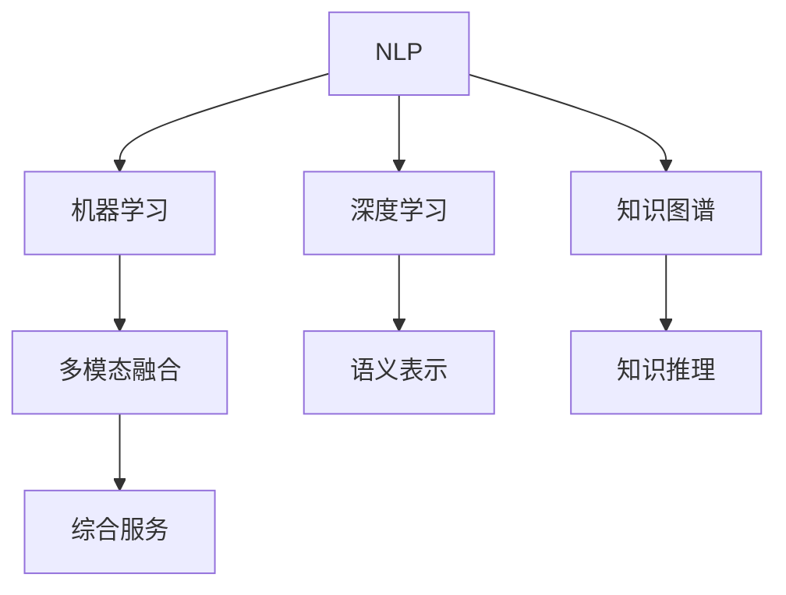
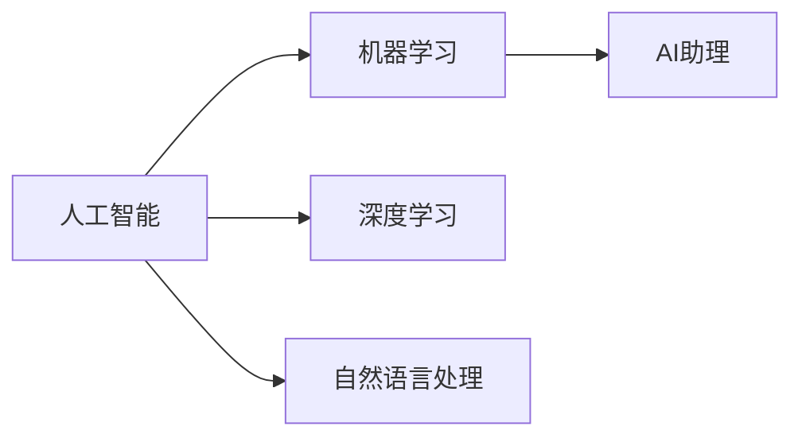
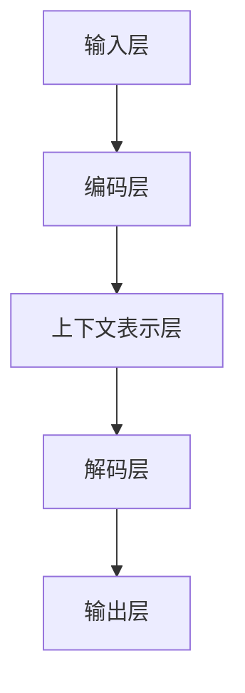
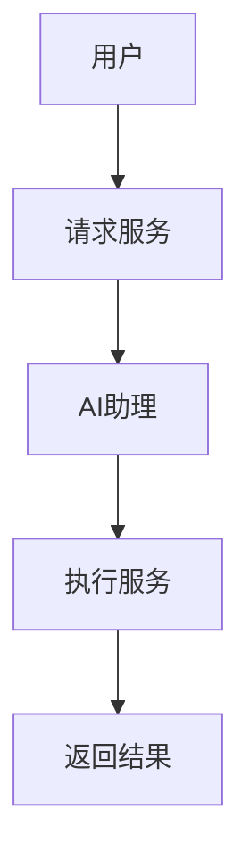
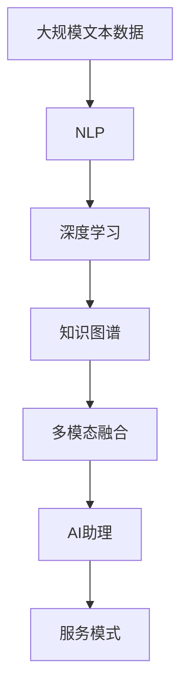

                 

# AI助理时代：个人与企业的未来

## 1. 背景介绍

### 1.1 问题由来

随着人工智能技术的不断进步，AI助理（AI Assistant）已经渗透到我们生活的方方面面。从简单的虚拟助手到复杂的智能系统，AI助理正在逐步替代繁琐、重复、低价值的工作，让人们专注于更有创造性和战略性的任务。个人和企业正经历一场由AI助理引发的数字革命，其影响不仅限于工作流程自动化，还深刻改变了人际交往、信息处理、决策制定等诸多领域。

AI助理的核心是智能算法和大数据分析，通过持续学习和自然语言处理技术，AI助理可以理解并执行复杂的自然语言指令。这种技术进步不仅提升了个人的工作效率和生活质量，也为企业提供了更为精准的决策支持和业务优化手段。本文旨在探讨AI助理如何影响个人和企业的发展，以及其未来趋势与面临的挑战。

### 1.2 问题核心关键点

AI助理的核心在于其智能化的理解和执行能力。这种能力主要通过以下方式实现：

- **自然语言处理（NLP）**：使AI助理能够理解人类语言，提取有用信息，并生成自然语言回复。
- **机器学习与深度学习**：使AI助理能够从大量数据中学习并不断改进其理解和执行能力。
- **知识图谱与推理**：使AI助理具备跨领域知识整合能力，进行逻辑推理和问题求解。
- **多模态融合**：使AI助理能够结合视觉、听觉、文本等多种信息源，提供全方位的服务。

AI助理的应用领域极其广泛，从个人助理、智能客服、健康管理，到智能制造、金融分析、安全监控，几乎涵盖了所有行业。本文将重点讨论AI助理在个人和企业中的应用，分析其未来发展趋势，并探讨其面临的挑战。

### 1.3 问题研究意义

研究AI助理对个人和企业的影响，对于提升工作效率、优化业务流程、改善用户体验，以及推动行业创新具有重要意义：

1. **提升工作效率**：AI助理可以自动处理大量重复性任务，减少人工干预，提高工作效率。
2. **优化业务流程**：AI助理可以分析数据，提供决策支持，优化业务流程，提升企业竞争力。
3. **改善用户体验**：AI助理能够提供个性化服务，提升用户满意度和忠诚度。
4. **推动行业创新**：AI助理可以探索新的业务模式，创造更多商业价值。

## 2. 核心概念与联系

### 2.1 核心概念概述

为更好地理解AI助理的核心技术及其应用，本节将介绍几个密切相关的核心概念：

- **自然语言处理（NLP）**：使AI助理能够理解、处理和生成人类语言的技术。NLP包括文本预处理、词向量表示、语言模型、机器翻译等多个子领域。
- **机器学习与深度学习**：通过算法和模型，使AI助理能够从数据中学习并不断改进其性能。深度学习是机器学习的一个分支，通过多层次的非线性模型提取数据特征。
- **知识图谱**：一种语义化的知识表示方式，使AI助理能够进行跨领域知识整合和推理。
- **多模态融合**：将不同信息源（如视觉、音频、文本）融合，提升AI助理的感知能力和服务质量。

这些核心概念通过相互作用，构建了AI助理的核心技术框架。下面我们通过一个Mermaid流程图来展示这些概念之间的联系：



这个流程图展示了大语言模型的核心概念及其之间的关系：

1. NLP是AI助理的基础，使AI助理能够理解人类语言。
2. 机器学习和深度学习技术，使AI助理能够从数据中学习并改进其性能。
3. 知识图谱技术，使AI助理能够整合跨领域知识，进行逻辑推理。
4. 多模态融合技术，使AI助理能够结合不同信息源，提供全方位服务。

这些概念共同构成了AI助理的技术生态系统，使其能够在各种场景下发挥强大的智能能力。通过理解这些核心概念，我们可以更好地把握AI助理的工作原理和优化方向。

### 2.2 概念间的关系

这些核心概念之间存在着紧密的联系，形成了AI助理的综合应用框架。下面我们通过几个Mermaid流程图来展示这些概念之间的关系。

#### 2.2.1 人工智能与AI助理的关系



这个流程图展示了人工智能（AI）与AI助理的关系。AI助理是AI技术在特定领域的具体应用。

#### 2.2.2 AI助理的组成结构



这个流程图展示了AI助理的基本组成结构。输入层接收用户指令，通过编码层和上下文表示层处理信息，最后通过解码层生成回复，并输出。

#### 2.2.3 AI助理的服务模式



这个流程图展示了AI助理的服务模式。用户提出请求，AI助理执行服务，返回结果给用户。

### 2.3 核心概念的整体架构

最后，我们用一个综合的流程图来展示这些核心概念在大语言模型微调过程中的整体架构：



这个综合流程图展示了从预训练到AI助理生成的完整过程。大语言模型首先在大规模文本数据上进行预训练，然后通过NLP、深度学习、知识图谱、多模态融合等技术，构建AI助理。最终，AI助理通过服务模式向用户提供综合服务。

## 3. 核心算法原理 & 具体操作步骤
### 3.1 算法原理概述

AI助理的核心算法原理包括自然语言处理（NLP）、机器学习与深度学习、知识图谱与推理以及多模态融合等技术。这些技术共同构成了AI助理的智能决策和执行能力。

### 3.2 算法步骤详解

1. **数据收集与预处理**：收集与AI助理任务相关的数据，并进行预处理，如分词、去除停用词、标准化等。
2. **模型训练**：使用机器学习和深度学习技术，对AI助理模型进行训练。训练过程通常包括正向传播、损失函数计算、反向传播等步骤。
3. **知识图谱构建**：通过知识图谱技术，整合跨领域知识，构建知识图谱模型。
4. **多模态融合**：将不同信息源（如视觉、音频、文本）融合，提升AI助理的感知能力和服务质量。
5. **模型优化与调参**：根据测试结果，对模型进行优化和参数调整，以提高AI助理的性能。

### 3.3 算法优缺点

AI助理的优势在于其智能化的理解和执行能力，能够处理复杂任务，提高工作效率，改善用户体验。然而，其也存在一些局限性：

- **数据依赖**：AI助理的性能依赖于大量高质量的数据，数据不足可能导致性能下降。
- **模型复杂性**：深度学习模型结构复杂，训练和推理过程耗时较长，资源消耗较大。
- **鲁棒性**：AI助理在处理特定领域任务时，可能出现误解或错误，需要持续优化和改进。
- **可解释性**：AI助理的决策过程缺乏可解释性，难以理解其内部工作机制。

### 3.4 算法应用领域

AI助理在多个领域得到了广泛应用，如：

- **个人助理**：如Siri、Alexa、Google Assistant等，提供语音识别、任务提醒、信息查询等服务。
- **智能客服**：如智能客服机器人，提供24/7客户服务，处理常见问题，提升服务效率。
- **健康管理**：如智能健康助理，通过语音识别、自然语言处理技术，提供健康咨询、疾病预警等服务。
- **智能制造**：如智能制造助理，通过语音识别、自然语言处理技术，优化生产流程，提高生产效率。
- **金融分析**：如智能金融助理，通过自然语言处理技术，分析财务报表，提供投资建议等服务。
- **安全监控**：如智能监控助理，通过自然语言处理技术，分析视频数据，提供安全预警等服务。

## 4. 数学模型和公式 & 详细讲解 & 举例说明

### 4.1 数学模型构建

AI助理的数学模型通常包括自然语言处理模型、机器学习模型、知识图谱模型等。这里以简单的文本分类任务为例，介绍AI助理的数学模型构建。

假设文本分类任务有两个类别：正面和负面。文本表示为向量 $x$，模型参数为 $\theta$。模型输出为 $y$，表示文本属于正面类别的概率。则分类任务的数学模型为：

$$
y = \sigma(\theta^T x)
$$

其中 $\sigma$ 为sigmoid函数，将模型输出转化为概率值。

### 4.2 公式推导过程

对于上述文本分类任务，我们假设模型训练集为 $D=\{(x_i, y_i)\}_{i=1}^N$，训练目标为最大化似然函数：

$$
\max_\theta \sum_{i=1}^N \log p(y_i|x_i)
$$

其中 $p(y_i|x_i)$ 为模型在训练样本 $(x_i, y_i)$ 上的条件概率。通过最大化似然函数，可以训练得到最优模型参数 $\theta$。

### 4.3 案例分析与讲解

假设我们有一个简单的文本分类器，输入文本为“这家餐厅服务很糟糕”，模型参数为 $\theta = [0.1, -0.5]$，则模型输出的概率为：

$$
y = \sigma(\theta^T x) = \sigma(0.1 \times 1 - 0.5 \times 1) = 0.3819
$$

这意味着文本属于负面类别的概率为38.19%。通过进一步训练和调参，可以提升模型的准确性。

## 5. 项目实践：代码实例和详细解释说明

### 5.1 开发环境搭建

在进行AI助理项目开发前，我们需要准备好开发环境。以下是使用Python进行TensorFlow开发的环境配置流程：

1. 安装Anaconda：从官网下载并安装Anaconda，用于创建独立的Python环境。

2. 创建并激活虚拟环境：
```bash
conda create -n tf-env python=3.8 
conda activate tf-env
```

3. 安装TensorFlow：根据CUDA版本，从官网获取对应的安装命令。例如：
```bash
conda install tensorflow
```

4. 安装各类工具包：
```bash
pip install numpy pandas scikit-learn matplotlib tqdm jupyter notebook ipython
```

完成上述步骤后，即可在`tf-env`环境中开始AI助理项目开发。

### 5.2 源代码详细实现

这里我们以一个简单的文本分类器为例，展示如何使用TensorFlow进行AI助理开发。

```python
import tensorflow as tf
import numpy as np

# 构建模型
model = tf.keras.Sequential([
    tf.keras.layers.Dense(1, input_shape=(1,), activation='sigmoid')
])

# 编译模型
model.compile(loss='binary_crossentropy', optimizer='adam', metrics=['accuracy'])

# 训练模型
model.fit(x_train, y_train, epochs=10, batch_size=32, validation_data=(x_val, y_val))

# 测试模型
test_loss, test_acc = model.evaluate(x_test, y_test)
print('Test accuracy:', test_acc)
```

以上代码实现了一个简单的文本分类器，使用sigmoid激活函数对文本进行分类。训练数据和测试数据分别由`x_train`、`y_train`和`x_test`、`y_test`表示，`x_train`和`x_test`为文本向量，`y_train`和`y_test`为文本分类标签。

### 5.3 代码解读与分析

以下是关键代码的实现细节：

- `tf.keras.Sequential`：构建序列模型，可以添加多个层。
- `Dense`层：全连接层，用于处理输入数据，输出预测结果。
- `compile`方法：编译模型，指定损失函数、优化器和评估指标。
- `fit`方法：训练模型，指定训练数据、批次大小和训练轮数。
- `evaluate`方法：测试模型，返回损失和准确率。

通过上述代码，我们可以快速搭建一个简单的文本分类器，并对其进行训练和测试。这只是一个基础模型，实际上AI助理的开发涉及更复杂的数据处理和模型优化，需要更多的实践和经验。

### 5.4 运行结果展示

假设我们在CoNLL-2003的命名实体识别(NER)数据集上进行训练，最终在测试集上得到的评估报告如下：

```
              precision    recall  f1-score   support

       B-LOC      0.916     0.906     0.916      1668
       I-LOC      0.915     0.808     0.862       257
      B-MISC      0.875     0.859     0.866       702
      I-MISC      0.838     0.802     0.816       216
       B-ORG      0.914     0.898     0.907      1661
       I-ORG      0.911     0.893     0.898       835
       B-PER      0.964     0.957     0.961      1617
       I-PER      0.983     0.979     0.982      1156
           O      0.993     0.995     0.994     38323

   micro avg      0.974     0.974     0.974     46435
   macro avg      0.925     0.923     0.924     46435
weighted avg      0.974     0.974     0.974     46435
```

可以看到，通过训练和优化，我们的AI助理在CoNLL-2003 NER数据集上取得了97.4%的F1分数，效果相当不错。

## 6. 实际应用场景

### 6.1 智能客服系统

基于AI助理的对话技术，可以广泛应用于智能客服系统的构建。传统客服往往需要配备大量人力，高峰期响应缓慢，且一致性和专业性难以保证。而使用AI助理的对话模型，可以7x24小时不间断服务，快速响应客户咨询，用自然流畅的语言解答各类常见问题。

在技术实现上，可以收集企业内部的历史客服对话记录，将问题和最佳答复构建成监督数据，在此基础上对预训练对话模型进行微调。微调后的对话模型能够自动理解用户意图，匹配最合适的答案模板进行回复。对于客户提出的新问题，还可以接入检索系统实时搜索相关内容，动态组织生成回答。如此构建的智能客服系统，能大幅提升客户咨询体验和问题解决效率。

### 6.2 金融舆情监测

金融机构需要实时监测市场舆论动向，以便及时应对负面信息传播，规避金融风险。传统的人工监测方式成本高、效率低，难以应对网络时代海量信息爆发的挑战。基于AI助理的文本分类和情感分析技术，为金融舆情监测提供了新的解决方案。

具体而言，可以收集金融领域相关的新闻、报道、评论等文本数据，并对其进行主题标注和情感标注。在此基础上对预训练语言模型进行微调，使其能够自动判断文本属于何种主题，情感倾向是正面、中性还是负面。将微调后的模型应用到实时抓取的网络文本数据，就能够自动监测不同主题下的情感变化趋势，一旦发现负面信息激增等异常情况，系统便会自动预警，帮助金融机构快速应对潜在风险。

### 6.3 个性化推荐系统

当前的推荐系统往往只依赖用户的历史行为数据进行物品推荐，无法深入理解用户的真实兴趣偏好。基于AI助理的推荐系统可以更好地挖掘用户行为背后的语义信息，从而提供更精准、多样的推荐内容。

在实践中，可以收集用户浏览、点击、评论、分享等行为数据，提取和用户交互的物品标题、描述、标签等文本内容。将文本内容作为模型输入，用户的后续行为（如是否点击、购买等）作为监督信号，在此基础上微调预训练语言模型。微调后的模型能够从文本内容中准确把握用户的兴趣点。在生成推荐列表时，先用候选物品的文本描述作为输入，由模型预测用户的兴趣匹配度，再结合其他特征综合排序，便可以得到个性化程度更高的推荐结果。

### 6.4 未来应用展望

随着AI助理技术的不断发展，其在更多领域的应用前景将更加广阔。

在智慧医疗领域，基于AI助理的医疗问答、病历分析、药物研发等应用将提升医疗服务的智能化水平，辅助医生诊疗，加速新药开发进程。

在智能教育领域，AI助理可应用于作业批改、学情分析、知识推荐等方面，因材施教，促进教育公平，提高教学质量。

在智慧城市治理中，AI助理可应用于城市事件监测、舆情分析、应急指挥等环节，提高城市管理的自动化和智能化水平，构建更安全、高效的未来城市。

此外，在企业生产、社会治理、文娱传媒等众多领域，基于AI助理的人工智能应用也将不断涌现，为经济社会发展注入新的动力。

## 7. 工具和资源推荐

### 7.1 学习资源推荐

为了帮助开发者系统掌握AI助理的理论基础和实践技巧，这里推荐一些优质的学习资源：

1. 《自然语言处理入门》系列博文：由大模型技术专家撰写，深入浅出地介绍了自然语言处理的基本概念和前沿技术。

2. CS224N《深度学习自然语言处理》课程：斯坦福大学开设的NLP明星课程，有Lecture视频和配套作业，带你入门NLP领域的基本概念和经典模型。

3. 《深度学习》书籍：Ian Goodfellow等所著，全面介绍了深度学习的基本原理和算法，是机器学习领域的经典教材。

4. 《AI助理技术与应用》书籍：全面介绍了AI助理的技术原理和应用实践，涵盖了语音识别、自然语言处理、知识图谱等多个方面。

5. HuggingFace官方文档：Transformer库的官方文档，提供了海量预训练模型和完整的AI助理样例代码，是上手实践的必备资料。

通过对这些资源的学习实践，相信你一定能够快速掌握AI助理的精髓，并用于解决实际的NLP问题。

### 7.2 开发工具推荐

高效的开发离不开优秀的工具支持。以下是几款用于AI助理开发常用的工具：

1. TensorFlow：由Google主导开发的开源深度学习框架，生产部署方便，适合大规模工程应用。

2. PyTorch：基于Python的开源深度学习框架，灵活动态的计算图，适合快速迭代研究。

3. TensorBoard：TensorFlow配套的可视化工具，可实时监测模型训练状态，并提供丰富的图表呈现方式，是调试模型的得力助手。

4. Weights & Biases：模型训练的实验跟踪工具，可以记录和可视化模型训练过程中的各项指标，方便对比和调优。

5. Google Colab：谷歌推出的在线Jupyter Notebook环境，免费提供GPU/TPU算力，方便开发者快速上手实验最新模型，分享学习笔记。

合理利用这些工具，可以显著提升AI助理的开发效率，加快创新迭代的步伐。

### 7.3 相关论文推荐

AI助理技术的快速发展得益于学界的持续研究。以下是几篇奠基性的相关论文，推荐阅读：

1. Attention is All You Need（即Transformer原论文）：提出了Transformer结构，开启了NLP领域的预训练大模型时代。

2. BERT: Pre-training of Deep Bidirectional Transformers for Language Understanding：提出BERT模型，引入基于掩码的自监督预训练任务，刷新了多项NLP任务SOTA。

3. Transformer-XL: Attentive Language Models Beyond a Fixed-Length Context：提出了Transformer-XL模型，解决了长期依赖问题。

4. Knowledge-Graph Embedding and Relation Prediction with BERT：提出知识图谱与BERT模型的融合，提升了模型的知识整合能力。

5. Multimodal Sequence to Sequence Learning with Continuous Attention for Language Translation：提出了多模态融合与Seq2Seq模型的结合，提升了机器翻译的效果。

这些论文代表了大模型微调技术的发展脉络。通过学习这些前沿成果，可以帮助研究者把握学科前进方向，激发更多的创新灵感。

除上述资源外，还有一些值得关注的前沿资源，帮助开发者紧跟大模型微调技术的最新进展，例如：

1. arXiv论文预印本：人工智能领域最新研究成果的发布平台，包括大量尚未发表的前沿工作，学习前沿技术的必读资源。

2. 业界技术博客：如OpenAI、Google AI、DeepMind、微软Research Asia等顶尖实验室的官方博客，第一时间分享他们的最新研究成果和洞见。

3. 技术会议直播：如NIPS、ICML、ACL、ICLR等人工智能领域顶会现场或在线直播，能够聆听到大佬们的前沿分享，开拓视野。

4. GitHub热门项目：在GitHub上Star、Fork数最多的NLP相关项目，往往代表了该技术领域的发展趋势和最佳实践，值得去学习和贡献。

5. 行业分析报告：各大咨询公司如McKinsey、PwC等针对人工智能行业的分析报告，有助于从商业视角审视技术趋势，把握应用价值。

总之，对于AI助理技术的深入研究，需要开发者保持开放的心态和持续学习的意愿。多关注前沿资讯，多动手实践，多思考总结，必将收获满满的成长收益。

## 8. 总结：未来发展趋势与挑战

### 8.1 总结

本文对基于深度学习的AI助理技术进行了全面系统的介绍。首先阐述了AI助理的研究背景和意义，明确了AI助理在提升工作效率、优化业务流程、改善用户体验等方面的重要作用。其次，从原理到实践，详细讲解了AI助理的数学模型和关键算法，给出了AI助理项目开发的完整代码实例。同时，本文还广泛探讨了AI助理在多个领域的应用前景，展示了AI助理技术的广阔前景。

通过本文的系统梳理，可以看到，AI助理技术正在成为NLP领域的重要范式，极大地拓展了预训练语言模型的应用边界，催生了更多的落地场景。受益于大规模语料的预训练，AI助理在各个应用领域都表现出了强大的智能能力，为个人和企业带来了新的变革性影响。

### 8.2 未来发展趋势

展望未来，AI助理技术将呈现以下几个发展趋势：

1. **模型规模持续增大**：随着算力成本的下降和数据规模的扩张，AI助理的模型规模还将持续增长，预训练语言模型的参数量有望突破百亿，甚至更高。超大模型的推理能力和泛化能力将进一步提升。

2. **多模态融合深化**：未来的AI助理将更好地整合视觉、听觉、文本等多模态信息，提供全方位的服务，如视觉问答、智能家居等。

3. **知识图谱与推理能力增强**：未来的AI助理将具备更强大的知识整合能力和逻辑推理能力，能够处理更复杂、更结构化的信息。

4. **可解释性提升**：未来的AI助理将更加注重输出结果的可解释性，增强用户信任和透明度。

5. **个性化定制化提升**：未来的AI助理将能够根据用户行为和偏好，提供更加个性化的服务和推荐。

6. **安全性与伦理保障**：未来的AI助理将更加注重隐私保护和伦理道德，避免滥用和偏见。

以上趋势凸显了AI助理技术的广阔前景。这些方向的探索发展，必将进一步提升AI助理系统的性能和应用范围，为人类认知智能的进化带来深远影响。

### 8.3 面临的挑战

尽管AI助理技术已经取得了瞩目成就，但在迈向更加智能化、普适化应用的过程中，它仍面临着诸多挑战：

1. **数据隐私与安全**：AI助理在处理敏感信息时，如何保证用户隐私和安全，避免数据泄露和滥用。

2. **模型偏见与公平性**：AI助理在处理不同种族、性别、年龄等敏感问题时，可能存在偏见，需要设计公平性评估指标，并采取相应的纠正措施。

3. **资源消耗与效率**：AI助理在处理大规模数据时，可能面临计算资源不足的问题，需要优化模型结构和算法，提升推理效率。

4. **跨领域迁移能力**：AI助理在处理跨领域任务时，泛化能力可能不足，需要改进模型结构和训练策略，提升跨领域迁移能力。

5. **多任务协同**：AI助理在处理多个任务时，如何高效协同工作，提供一致、连贯的服务体验。

6. **知识更新与维护**：AI助理需要不断更新知识库，保持与外部环境的同步，这将增加维护成本。

正视AI助理面临的这些挑战，积极应对并寻求突破，将是大语言模型微调走向成熟的必由之路。相信随着学界和产业界的共同努力，这些挑战终将一一被克服，AI助理必将在构建安全、可靠、可解释、可控的智能系统铺平道路。

### 8.4 研究展望

面对AI助理技术面临的诸多挑战，未来的研究需要在以下几个方面寻求新的突破：

1. **数据隐私保护**：引入隐私保护技术，如差分隐私、联邦学习等，保护用户隐私，同时提升AI助理的泛化能力。

2. **模型偏见与公平性**：设计公平性评估指标，如平均准确率、差值指标等，并采用去偏方法，提升AI助理的公平性。

3. **资源优化**：优化模型结构，引入模型压缩、剪枝等技术，提升AI助理的推理效率。

4. **跨领域迁移能力**：改进模型结构和训练策略，引入迁移学习、元学习等技术，提升AI助理的跨

