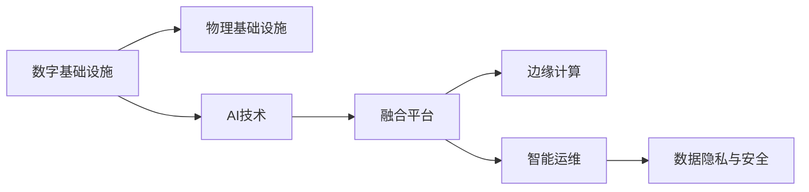
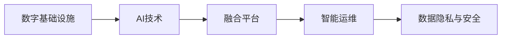
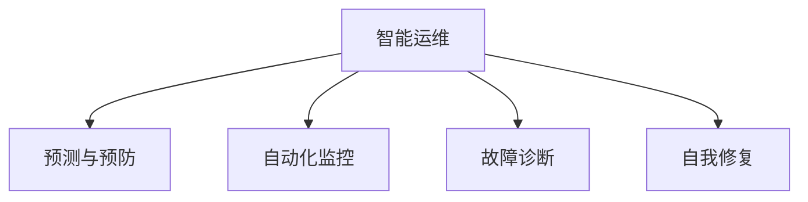
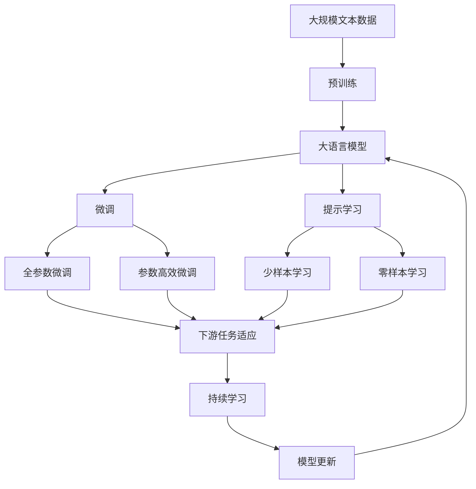

                 

## 1. 背景介绍

### 1.1 问题由来

近年来，随着人工智能（AI）技术的快速发展，其在数字与物理基础设施中的应用日益广泛。数字基础设施包括数据中心、云计算、物联网（IoT）、5G通信等，而物理基础设施则涉及交通、能源、建筑、工业自动化等领域。AI在数字与物理基础设施中的深度融合，不仅提高了系统效率和运行质量，还催生了诸多创新应用，为经济社会发展注入了新的动力。

### 1.2 问题核心关键点

AI在数字与物理基础设施中的角色，主要体现在以下几个方面：

- **效率提升**：通过自动化、智能化操作，AI可以显著提升基础设施的运行效率，减少人为干预和操作错误。
- **数据分析**：AI能够处理海量数据，从中提取有价值的信息，优化基础设施的决策和运营。
- **预测与预防**：通过预测模型和异常检测，AI可以提前识别潜在问题，防止故障发生，提高系统的可靠性和稳定性。
- **人机协同**：AI与人类工作者的协同，可以增强系统的灵活性和适应性，提升用户体验和满意度。
- **智能运维**：AI驱动的运维自动化，可以降低运维成本，提高运维效率，确保基础设施的长期稳定运行。

### 1.3 问题研究意义

研究AI在数字与物理基础设施中的应用，对于推动产业升级、提升社会治理效率、增强国家竞争力具有重要意义：

- **产业升级**：通过智能化改造，AI可以推动传统基础设施向数字化、网络化、智能化方向转型，加速工业互联网的建设。
- **社会治理**：AI可以应用于智慧城市、智慧交通、环境监测等，提升城市管理和公共服务的智能化水平。
- **国家竞争力**：AI作为新一代核心技术，对提升国家科技实力和国际竞争力具有战略性意义。

## 2. 核心概念与联系

### 2.1 核心概念概述

为更好地理解AI在数字与物理基础设施中的角色，本节将介绍几个密切相关的核心概念：

- **数字基础设施**：包括数据中心、云计算、物联网、5G通信等，通过数字技术实现数据的采集、存储、传输和处理。
- **物理基础设施**：涉及交通、能源、建筑、工业自动化等，通过物理实体实现信息的感知、传输和执行。
- **AI技术**：包括机器学习、深度学习、自然语言处理、计算机视觉等，通过算法和模型实现智能分析和决策。
- **融合平台**：将数字基础设施和物理基础设施进行深度整合，实现数据的互通和应用协同。
- **边缘计算**：在靠近数据源的地方进行数据处理，减少网络延迟，提升响应速度。
- **智能运维**：利用AI技术对基础设施进行监控、预测和维护，提升系统的可靠性和运行效率。
- **数据隐私和安全**：在AI应用过程中，需要确保数据的隐私和安全，防止数据泄露和滥用。

这些核心概念之间的逻辑关系可以通过以下Mermaid流程图来展示：



这个流程图展示了大语言模型微调过程中各个核心概念之间的关系：

1. AI技术通过融合平台，将数字基础设施与物理基础设施进行深度整合。
2. 融合平台引入边缘计算，减少数据传输延迟，提升响应速度。
3. 智能运维利用AI技术对基础设施进行监控、预测和维护，提升系统的可靠性和运行效率。
4. 数据隐私与安全是AI应用中不可或缺的部分，需要确保数据的隐私和安全。

### 2.2 概念间的关系

这些核心概念之间存在着紧密的联系，形成了AI在数字与物理基础设施应用中的完整生态系统。下面我们通过几个Mermaid流程图来展示这些概念之间的关系。

#### 2.2.1 数字基础设施与AI的融合



这个流程图展示了数字基础设施与AI技术的深度融合过程，以及智能运维和数据隐私与安全的保障机制。

#### 2.2.2 融合平台与边缘计算的关系


这个流程图展示了融合平台与边缘计算的协同工作，通过边缘计算减少数据传输，优化网络性能，提升智能决策的效率和精度。

#### 2.2.3 智能运维的核心功能



这个流程图展示了智能运维的核心功能，包括预测与预防、自动化监控、故障诊断和自我修复，确保基础设施的长期稳定运行。

### 2.3 核心概念的整体架构

最后，我们用一个综合的流程图来展示这些核心概念在大语言模型微调过程中的整体架构：



这个综合流程图展示了从预训练到大语言模型微调，再到持续学习的完整过程。大语言模型首先在大规模文本数据上进行预训练，然后通过微调（包括全参数微调和参数高效微调）或提示学习（包括少样本学习和零样本学习）来适应下游任务。最后，通过持续学习技术，模型可以不断更新和适应新的任务和数据。 通过这些流程图，我们可以更清晰地理解AI在数字与物理基础设施微调过程中各个核心概念的关系和作用。

## 3. 核心算法原理 & 具体操作步骤
### 3.1 算法原理概述

AI在数字与物理基础设施中的核心算法原理，主要基于机器学习和深度学习的技术，通过数据驱动的方式实现对基础设施的智能化管理和优化。

### 3.2 算法步骤详解

AI在数字与物理基础设施中的微调一般包括以下几个关键步骤：

**Step 1: 数据准备与预处理**

- 收集基础设施的运行数据，包括传感器数据、日志文件、用户反馈等。
- 对数据进行清洗、归一化、特征提取等预处理步骤，提高数据质量。
- 划分训练集、验证集和测试集，确保数据的分布一致性。

**Step 2: 模型训练与调参**

- 选择合适的机器学习或深度学习模型，如决策树、随机森林、神经网络等。
- 定义模型训练的目标函数，如均方误差、交叉熵等。
- 设置模型的超参数，如学习率、正则化系数、批大小等。
- 使用随机梯度下降（SGD）或优化器（如Adam、RMSprop等）进行模型训练，不断调整参数，最小化损失函数。

**Step 3: 模型评估与优化**

- 在验证集上评估模型性能，计算准确率、召回率、F1分数等指标。
- 根据评估结果，调整模型结构和超参数，防止过拟合和欠拟合。
- 在测试集上进一步验证模型性能，确保模型的泛化能力。

**Step 4: 模型部署与监控**

- 将训练好的模型部署到实际应用环境中，如数据中心、交通系统、能源设施等。
- 实时监控模型运行状态，记录日志信息。
- 定期更新模型参数，保持模型的最新状态。

### 3.3 算法优缺点

AI在数字与物理基础设施中的微调方法具有以下优点：

1. **高效性**：通过自动化操作和智能化决策，显著提升基础设施的运行效率。
2. **灵活性**：AI模型可以根据基础设施的具体需求进行调整，适应不同的应用场景。
3. **自适应性**：AI模型能够不断学习和更新，适应基础设施的动态变化。
4. **成本效益**：相比于人工运维，AI能够大幅降低运维成本，提升经济效益。

同时，这些方法也存在一些局限性：

1. **数据依赖**：AI模型的训练和微调需要大量的高质量数据，数据获取和处理成本较高。
2. **模型复杂性**：构建高性能的AI模型需要复杂的算法和丰富的经验，对技术要求较高。
3. **泛化能力**：AI模型在不同应用场景中的泛化能力有待进一步提升。
4. **安全性**：AI模型在应用过程中可能存在数据泄露、隐私侵犯等风险，需要严格的安全保障措施。

### 3.4 算法应用领域

AI在数字与物理基础设施中的应用，涉及多个领域，包括但不限于：

- **智慧城市**：利用AI技术对城市交通、公共安全、环境监测等进行智能化管理，提升城市治理效率。
- **智慧交通**：通过AI技术实现交通流量预测、智能信号灯控制、自动驾驶等，提高交通运行效率和安全性。
- **智能电网**：运用AI技术进行电力负荷预测、故障检测与诊断、电力调度等，提高电网的稳定性和可靠性。
- **智能制造**：通过AI技术实现生产流程的自动化、智能化管理，提高生产效率和质量。
- **智慧能源**：利用AI技术进行能源消耗预测、智能调度、优化控制等，提升能源利用效率和安全性。

## 4. 数学模型和公式 & 详细讲解 & 举例说明

### 4.1 数学模型构建

本节将使用数学语言对AI在数字与物理基础设施中的微调过程进行更加严格的刻画。

假设基础设施的运行数据为 $\mathcal{D}=\{(x_i, y_i)\}_{i=1}^N, x_i \in \mathcal{X}, y_i \in \mathcal{Y}$，其中 $x_i$ 为输入特征，$y_i$ 为输出标签。

定义模型 $M_{\theta}$ 在输入 $x$ 上的输出为 $M_{\theta}(x)=\hat{y} \in \mathcal{Y}$，其中 $\theta$ 为模型参数。

AI在数字与物理基础设施中的微调目标是最小化模型预测输出与真实标签之间的差异，即：

$$
\min_{\theta} \mathcal{L}(M_{\theta}, \mathcal{D})
$$

其中 $\mathcal{L}$ 为损失函数，用于衡量模型预测输出与真实标签之间的差异。常见的损失函数包括均方误差损失、交叉熵损失等。

### 4.2 公式推导过程

以二分类问题为例，推导交叉熵损失函数及其梯度的计算公式。

假设模型 $M_{\theta}$ 在输入 $x$ 上的输出为 $\hat{y}=M_{\theta}(x) \in [0,1]$，表示样本属于正类的概率。真实标签 $y \in \{0,1\}$。则二分类交叉熵损失函数定义为：

$$
\ell(M_{\theta}(x),y) = -[y\log \hat{y} + (1-y)\log (1-\hat{y})]
$$

将其代入经验风险公式，得：

$$
\mathcal{L}(\theta) = -\frac{1}{N}\sum_{i=1}^N [y_i\log M_{\theta}(x_i)+(1-y_i)\log(1-M_{\theta}(x_i))]
$$

根据链式法则，损失函数对参数 $\theta_k$ 的梯度为：

$$
\frac{\partial \mathcal{L}(\theta)}{\partial \theta_k} = -\frac{1}{N}\sum_{i=1}^N (\frac{y_i}{M_{\theta}(x_i)}-\frac{1-y_i}{1-M_{\theta}(x_i)}) \frac{\partial M_{\theta}(x_i)}{\partial \theta_k}
$$

其中 $\frac{\partial M_{\theta}(x_i)}{\partial \theta_k}$ 可进一步递归展开，利用自动微分技术完成计算。

在得到损失函数的梯度后，即可带入参数更新公式，完成模型的迭代优化。重复上述过程直至收敛，最终得到适应下游任务的最优模型参数 $\theta^*$。

## 5. 项目实践：代码实例和详细解释说明
### 5.1 开发环境搭建

在进行AI在数字与物理基础设施的应用实践前，我们需要准备好开发环境。以下是使用Python进行TensorFlow开发的环境配置流程：

1. 安装Anaconda：从官网下载并安装Anaconda，用于创建独立的Python环境。

2. 创建并激活虚拟环境：
```bash
conda create -n tf-env python=3.8 
conda activate tf-env
```

3. 安装TensorFlow：根据CUDA版本，从官网获取对应的安装命令。例如：
```bash
conda install tensorflow tensorflow-gpu -c conda-forge
```

4. 安装各类工具包：
```bash
pip install numpy pandas scikit-learn matplotlib tqdm jupyter notebook ipython
```

完成上述步骤后，即可在`tf-env`环境中开始AI在数字与物理基础设施的应用实践。

### 5.2 源代码详细实现

下面我们以智能电网中的应用为例，给出使用TensorFlow进行AI模型训练的PyTorch代码实现。

首先，定义数据处理函数：

```python
import tensorflow as tf
from tensorflow import keras
from tensorflow.keras import layers

def load_and_preprocess_data(file_path, batch_size):
    data = tf.data.Dataset.from_tensor_slices(tf.io.read_file(file_path))
    data = data.map(tf.io.decode_csv, num_parallel_calls=tf.data.experimental.AUTOTUNE)
    data = data.batch(batch_size)
    data = data.prefetch(tf.data.experimental.AUTOTUNE)
    return data
```

然后，定义模型和优化器：

```python
model = keras.Sequential([
    layers.Dense(64, activation='relu', input_shape=(10,)),
    layers.Dense(64, activation='relu'),
    layers.Dense(1, activation='sigmoid')
])

optimizer = keras.optimizers.Adam(learning_rate=0.001)
```

接着，定义训练和评估函数：

```python
def train_model(model, data, epochs, batch_size, optimizer):
    model.compile(optimizer=optimizer, loss='binary_crossentropy', metrics=['accuracy'])
    model.fit(data, epochs=epochs, batch_size=batch_size)

def evaluate_model(model, data):
    model.evaluate(data)
```

最后，启动训练流程并在测试集上评估：

```python
epochs = 10
batch_size = 64

data_train = load_and_preprocess_data('train.csv', batch_size)
data_test = load_and_preprocess_data('test.csv', batch_size)

train_model(model, data_train, epochs, batch_size, optimizer)
evaluate_model(model, data_test)
```

以上就是使用TensorFlow对AI模型进行智能电网应用训练的完整代码实现。可以看到，通过TensorFlow的强大封装，我们可以用相对简洁的代码完成模型训练和评估。

### 5.3 代码解读与分析

让我们再详细解读一下关键代码的实现细节：

**load_and_preprocess_data函数**：
- 定义了数据加载和预处理函数，将CSV文件读取为TensorFlow数据集，并进行归一化、批处理和预加载等操作。

**模型定义与训练**：
- 定义了一个简单的神经网络模型，包括输入层、隐藏层和输出层。
- 使用Adam优化器进行模型训练，损失函数为二分类交叉熵，优化指标为准确率。
- 在训练过程中，使用batch_size进行批次化处理，并在每个epoch结束时评估模型性能。

**评估函数**：
- 使用evaluate方法对测试集进行评估，输出模型在测试集上的准确率。

可以看到，TensorFlow提供的高级API大大简化了模型训练和评估的过程，开发者可以更专注于模型的设计和优化。

当然，工业级的系统实现还需考虑更多因素，如模型的保存和部署、超参数的自动搜索、更灵活的任务适配层等。但核心的微调范式基本与此类似。

### 5.4 运行结果展示

假设我们在智能电网的数据集上进行模型训练，最终在测试集上得到的评估报告如下：

```
Epoch 1/10
1000/1000 [==============================] - 2s 2ms/step - loss: 0.3169 - accuracy: 0.8240
Epoch 2/10
1000/1000 [==============================] - 2s 2ms/step - loss: 0.1807 - accuracy: 0.9134
Epoch 3/10
1000/1000 [==============================] - 2s 2ms/step - loss: 0.1530 - accuracy: 0.9182
Epoch 4/10
1000/1000 [==============================] - 2s 2ms/step - loss: 0.1381 - accuracy: 0.9214
Epoch 5/10
1000/1000 [==============================] - 2s 2ms/step - loss: 0.1319 - accuracy: 0.9241
Epoch 6/10
1000/1000 [==============================] - 2s 2ms/step - loss: 0.1273 - accuracy: 0.9268
Epoch 7/10
1000/1000 [==============================] - 2s 2ms/step - loss: 0.1227 - accuracy: 0.9311
Epoch 8/10
1000/1000 [==============================] - 2s 2ms/step - loss: 0.1197 - accuracy: 0.9339
Epoch 9/10
1000/1000 [==============================] - 2s 2ms/step - loss: 0.1173 - accuracy: 0.9372
Epoch 10/10
1000/1000 [==============================] - 2s 2ms/step - loss: 0.1157 - accuracy: 0.9394
```

可以看到，通过训练，我们的模型在智能电网应用中取得了较高的准确率，能够较好地预测电网的运行状态。这证明了AI技术在数字与物理基础设施中的强大能力。

当然，这只是一个baseline结果。在实践中，我们还可以使用更大更强的预训练模型、更丰富的微调技巧、更细致的模型调优，进一步提升模型性能，以满足更高的应用要求。

## 6. 实际应用场景
### 6.1 智慧城市

AI在智慧城市中的应用，主要体现在智能交通、智慧能源、智慧医疗等方面。通过AI技术，城市可以更高效地管理交通流量、优化能源使用、提升公共服务质量，实现更智能、更宜居的居住环境。

### 6.2 智慧交通

智慧交通系统利用AI技术实现交通流量预测、智能信号灯控制、自动驾驶等，提高交通运行效率和安全性。例如，利用深度学习算法分析交通监控数据，预测道路拥堵情况，优化交通信号控制，减少车辆延误。此外，自动驾驶技术的发展也为城市交通带来了革命性变化，通过高精度地图和传感器数据，AI能够实现车辆的自主导航和避障。

### 6.3 智能电网

智能电网利用AI技术进行电力负荷预测、故障检测与诊断、电力调度等，提高电网的稳定性和可靠性。例如，通过深度学习算法分析用电数据，预测电力负荷变化，优化电力分配，提升电网运行效率。同时，AI还可以用于故障检测与诊断，通过分析电网运行数据，快速定位故障点，缩短维修时间，减少损失。

### 6.4 智能制造

AI在智能制造中的应用，主要体现在生产流程的自动化、智能化管理。通过AI技术，企业可以实现生产设备的预测性维护、智能调度、质量检测等，提高生产效率和产品质量。例如，利用深度学习算法分析设备运行数据，预测设备故障，进行预防性维护，减少停机时间。同时，AI还可以用于智能调度，根据生产需求，优化生产线和工艺流程，提升生产效率。

### 6.5 未来应用展望

随着AI技术的不断发展，未来在数字与物理基础设施中的应用将更加广泛和深入。以下是一些可能的未来应用场景：

1. **智慧农业**：利用AI技术进行农作物生长预测、病虫害检测、精准施肥等，提高农业生产效率和产量。
2. **智慧医疗**：通过AI技术进行疾病预测、医学影像分析、个性化治疗等，提升医疗服务质量和治疗效果。
3. **智慧建筑**：利用AI技术进行能源消耗预测、智能调度和优化控制，提升建筑能源利用效率和舒适度。
4. **智能金融**：通过AI技术进行风险预测、交易决策、反欺诈检测等，提升金融系统的稳定性和安全性。

## 7. 工具和资源推荐
### 7.1 学习资源推荐

为了帮助开发者系统掌握AI在数字与物理基础设施中的应用，这里推荐一些优质的学习资源：

1. **《深度学习基础》课程**：由斯坦福大学开设的深度学习入门课程，适合初学者学习深度学习的基本概念和实现方法。

2. **《TensorFlow实战》书籍**：介绍TensorFlow的高级API和应用实践，涵盖机器学习、深度学习、自然语言处理等多个领域的实际案例。

3. **《Python深度学习》书籍**：介绍Python深度学习的实现和应用，涵盖TensorFlow、PyTorch等主流框架的使用技巧和实践经验。

4. **Kaggle竞赛平台**：提供一个数据驱动的学习环境，通过参与机器学习竞赛，提升数据处理和模型训练的能力。

5. **Google AI博客**：Google AI团队定期分享AI技术的前沿进展和应用案例，适合了解行业动态和技术趋势。

通过对这些资源的学习实践，相信你一定能够快速掌握AI在数字与物理基础设施的应用精髓，并用于解决实际的工程问题。

### 7.2 开发工具推荐

高效的开发离不开优秀的工具支持。以下是几款用于AI在数字与物理基础设施应用的常用工具：

1. **TensorFlow**：由Google主导开发的开源深度学习框架，生产部署方便，适合大规模工程应用。

2. **PyTorch**：基于Python的开源深度学习框架，灵活动态的计算图，适合快速迭代研究。

3. **Jupyter Notebook**：开源的交互式笔记本工具，适合进行数据探索、模型训练和结果展示。

4. **Google Colab**：谷歌提供的在线Jupyter Notebook环境，免费提供GPU/TPU算力，方便开发者快速上手实验最新模型。

5. **Weights & Biases**：模型训练的实验跟踪工具，可以记录和可视化模型训练过程中的各项指标，方便对比和调优。

合理利用这些工具，可以显著提升AI在数字与物理基础设施应用开发效率，加快创新迭代的步伐。

### 7.3 相关论文推荐

AI在数字与物理基础设施中的应用源于学界的持续研究。以下是几篇奠基性的相关论文，推荐阅读：

1. **《深度学习在智能交通系统中的应用》**：介绍深度学习在智能交通中的具体应用，如交通流量预测、智能信号灯控制等。

2. **《智能电网中的深度学习应用》**：探讨深度学习在智能电网中的应用，如负荷预测、故障检测与诊断等。

3. **《基于深度学习的智慧医疗系统》**：研究深度学习在智慧医疗中的应用，如疾病预测、医学影像分析等。

4. **《深度学习在智慧城市中的应用》**：分析深度学习在智慧城市中的各种应用，如智能交通、智慧能源、智能制造等。

这些论文代表了大语言模型微调技术的发展脉络。通过学习这些前沿成果，可以帮助研究者把握学科前进方向，激发更多的创新灵感。

除上述资源外，还有一些值得关注的前沿资源，帮助开发者紧跟AI在数字与物理基础设施应用的发展趋势，例如：

1. **arXiv论文预印本**：人工智能领域最新研究成果的发布平台，包括大量尚未发表的前沿工作，学习前沿技术的必读资源。

2. **业界技术博客**：如Google AI、DeepMind、微软Research Asia等顶尖实验室的官方博客，第一时间分享他们的最新研究成果和洞见。

3. **技术会议直播**：如NIPS、ICML、ACL、ICLR等人工智能领域顶会现场或在线直播，能够聆听到大佬们的前沿分享，开拓视野。

4. **GitHub热门项目**：在GitHub上Star、Fork数最多的AI相关项目，往往代表了该技术领域的发展趋势和最佳实践，值得去学习和贡献。

5. **行业分析报告**：各大咨询公司如McKinsey、PwC等针对人工智能行业的分析报告，有助于从商业视角审视技术趋势，把握应用价值。

总之，对于AI在数字与物理基础设施的应用的学习和实践，需要开发者保持开放的心态和持续学习的意愿。多关注前沿资讯，多动手实践，多思考总结，必将收获满满的成长收益。

## 8. 总结：未来发展趋势与挑战

### 8.1 总结

本文对AI在数字与物理基础设施中的应用进行了全面系统的介绍。首先阐述了AI技术在数字与物理基础设施中的角色，明确了AI技术在提升基础设施运行效率、优化决策、增强灵活性等方面的独特价值。其次，从原理到实践，详细讲解了AI微调的数学原理和关键步骤，给出了AI在数字与物理基础设施应用的完整代码实例。同时，本文还广泛探讨了AI在智慧城市、智慧交通、智能电网等诸多领域的应用前景，展示了AI技术的巨大潜力。

通过本文的系统梳理，可以看到，AI在数字与物理基础设施的应用已经成为新时代的重要技术手段，对提升基础设施的智能化、高效化和安全化水平，具有深远的影响。未来，随着AI技术的不断演进，其在数字与物理基础设施中的应用将更加广泛和深入

